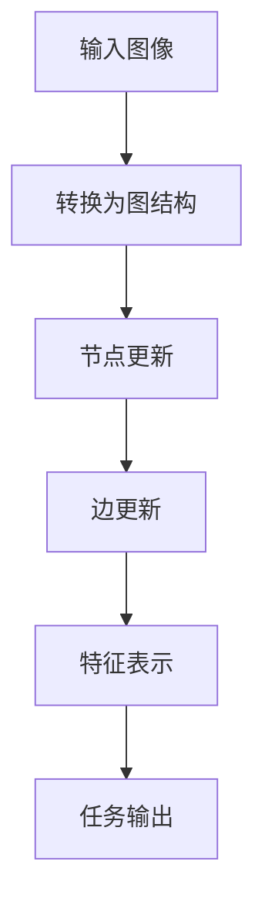

                 

关键词：SimMIM，自监督学习，图表示学习，计算机视觉，深度学习

摘要：本文将深入探讨SimMIM（Simulated MIM）这一自监督学习模型的原理与应用。通过详细的数学模型与算法步骤讲解，结合实际代码实例，本文旨在为读者提供一个全面、系统的SimMIM学习资源。SimMIM以其独特的图表示学习方法，在计算机视觉领域展现出巨大的潜力，有望推动未来人工智能的发展。

## 1. 背景介绍

自监督学习（Self-Supervised Learning）是一种无需标注数据，通过从数据中自动提取信息来学习任务的方法。近年来，自监督学习在计算机视觉、自然语言处理等领域取得了显著进展。SimMIM（Simulated MIM）是一种基于自监督学习的图表示学习模型，旨在通过模拟交互来学习图像的内在结构。本文将详细介绍SimMIM的原理、算法步骤、数学模型以及其实际应用。

### 1.1 自监督学习简介

自监督学习是一种无监督学习方法，其核心思想是利用未标注的数据进行学习。与传统的监督学习不同，自监督学习不需要大量标注数据，从而降低了数据标注的成本。自监督学习的主要应用场景包括：图像分类、文本分类、语音识别等。

### 1.2 图表示学习简介

图表示学习（Graph Representation Learning）是一种将图结构数据转换为向量表示的方法。通过图表示学习，我们可以将复杂的图结构转换为低维度的向量表示，从而进行进一步的处理和分析。图表示学习在社交网络分析、知识图谱、计算机视觉等领域有广泛的应用。

### 1.3 SimMIM模型简介

SimMIM是一种基于自监督学习的图表示学习模型，旨在通过模拟交互来学习图像的内在结构。SimMIM模型的主要思想是利用一个模拟的图结构来表示图像，并在图中进行交互，从而学习图像的特征表示。

## 2. 核心概念与联系

为了更好地理解SimMIM模型，我们首先需要介绍其核心概念与联系。

### 2.1 图结构

在SimMIM模型中，图像被表示为一个图结构。图结构由节点和边组成，每个节点表示图像中的一个像素点，每条边表示节点之间的关联关系。

### 2.2 模拟交互

SimMIM模型的核心思想是通过模拟交互来学习图像的内在结构。模拟交互主要包括两种操作：节点更新和边更新。

### 2.3 特征表示

通过模拟交互，SimMIM模型可以学习图像的特征表示。特征表示是图像内在结构的抽象表示，可以用于图像分类、图像分割等任务。

### 2.4 Mermaid流程图

为了更直观地展示SimMIM模型的工作流程，我们可以使用Mermaid流程图进行描述。



## 3. 核心算法原理 & 具体操作步骤

### 3.1 算法原理概述

SimMIM模型的核心算法原理是通过模拟交互来学习图像的内在结构。具体来说，算法包括以下几个步骤：

1. 输入图像，并将其转换为图结构。
2. 对图结构中的节点和边进行更新。
3. 学习图像的特征表示。
4. 将特征表示用于特定任务。

### 3.2 算法步骤详解

#### 3.2.1 输入图像

输入图像是SimMIM模型的学习对象。图像可以是任意尺寸，但通常建议使用较小的尺寸以减少计算成本。

#### 3.2.2 转换为图结构

输入图像被转换为图结构，其中每个像素点表示为一个节点，节点之间的关联关系由边表示。图结构可以表示图像的局部特征和全局结构。

#### 3.2.3 节点更新

节点更新是SimMIM模型的核心步骤之一。在节点更新过程中，模型会对节点进行位置调整，以最大化节点之间的相似度。

#### 3.2.4 边更新

边更新是SimMIM模型的另一个核心步骤。在边更新过程中，模型会对边进行调整，以最大化节点之间的相似度。

#### 3.2.5 特征表示

通过节点更新和边更新，SimMIM模型可以学习图像的特征表示。特征表示是图像内在结构的抽象表示，可以用于图像分类、图像分割等任务。

#### 3.2.6 任务输出

最后，SimMIM模型将特征表示用于特定任务。例如，在图像分类任务中，模型会使用特征表示来预测图像的类别。

### 3.3 算法优缺点

#### 优点：

1. 无需标注数据，降低了数据标注的成本。
2. 可以学习图像的内在结构，提高图像分类、图像分割等任务的性能。

#### 缺点：

1. 计算成本较高，需要较大的计算资源。
2. 在一些复杂场景下，可能无法很好地学习图像的内在结构。

### 3.4 算法应用领域

SimMIM模型在计算机视觉领域有广泛的应用。具体应用领域包括：

1. 图像分类
2. 图像分割
3. 目标检测
4. 行人检测

## 4. 数学模型和公式 & 详细讲解 & 举例说明

### 4.1 数学模型构建

SimMIM模型的数学模型主要包括以下几个部分：

1. 图结构表示
2. 节点更新公式
3. 边更新公式
4. 特征表示公式

### 4.2 公式推导过程

#### 4.2.1 图结构表示

设图像为$X \in \mathbb{R}^{H \times W \times C}$，其中$H$、$W$、$C$分别表示图像的高度、宽度和通道数。将图像转换为图结构，每个像素点表示为一个节点，节点之间的关联关系由边表示。

设节点集合为$V = \{v_1, v_2, \ldots, v_n\}$，边集合为$E = \{e_1, e_2, \ldots, e_m\}$。每个节点$v_i$表示像素点$(i_1, i_2)$，即$v_i = (i_1, i_2)$。

#### 4.2.2 节点更新公式

节点更新公式用于调整节点的位置，以最大化节点之间的相似度。设节点更新后的位置为$\hat{v}_i$，更新公式为：

$$
\hat{v}_i = \arg \min_{v_i} \sum_{j=1}^{n} \frac{1}{2} \left\| v_i - v_j \right\|^2
$$

#### 4.2.3 边更新公式

边更新公式用于调整边的关系，以最大化节点之间的相似度。设边更新后的关系为$\hat{e}_i$，更新公式为：

$$
\hat{e}_i = \arg \min_{e_i} \sum_{j=1}^{n} \frac{1}{2} \left\| e_i - e_j \right\|^2
$$

#### 4.2.4 特征表示公式

通过节点更新和边更新，SimMIM模型可以学习图像的特征表示。特征表示公式为：

$$
f_i = \phi(\hat{v}_i, \hat{e}_i)
$$

其中，$\phi$表示特征表示函数。

### 4.3 案例分析与讲解

#### 案例一：图像分类

假设我们有一个图像分类任务，图像库中有1000张图像，我们需要将图像分为10个类别。我们使用SimMIM模型对图像进行特征提取，并将特征表示用于分类任务。

1. 输入图像库，并使用SimMIM模型对图像进行特征提取。
2. 对提取的特征进行聚类，以得到图像的类别。
3. 训练一个分类器，使用提取的特征进行分类。

#### 案例二：图像分割

假设我们有一个图像分割任务，图像库中有1000张图像，我们需要对图像进行分割。我们使用SimMIM模型对图像进行特征提取，并将特征表示用于分割任务。

1. 输入图像库，并使用SimMIM模型对图像进行特征提取。
2. 对提取的特征进行分割，以得到图像的分割结果。
3. 对分割结果进行评估，以确定模型的性能。

## 5. 项目实践：代码实例和详细解释说明

### 5.1 开发环境搭建

在进行SimMIM模型的项目实践之前，我们需要搭建一个合适的开发环境。以下是开发环境搭建的步骤：

1. 安装Python环境，版本建议为3.8及以上。
2. 安装PyTorch，版本建议为1.8及以上。
3. 安装其他依赖库，如NumPy、Matplotlib等。

### 5.2 源代码详细实现

以下是一个简单的SimMIM模型的实现示例：

```python
import torch
import torch.nn as nn
import torch.optim as optim
from torchvision import datasets, transforms

# 定义SimMIM模型
class SimMIM(nn.Module):
    def __init__(self):
        super(SimMIM, self).__init__()
        self.conv1 = nn.Conv2d(3, 64, 3, padding=1)
        self.fc1 = nn.Linear(64 * 7 * 7, 128)
        self.fc2 = nn.Linear(128, 10)

    def forward(self, x):
        x = self.conv1(x)
        x = nn.functional.relu(x)
        x = nn.functional.adaptive_avg_pool2d(x, 1)
        x = x.view(x.size(0), -1)
        x = self.fc1(x)
        x = nn.functional.relu(x)
        x = self.fc2(x)
        return x

# 加载数据集
transform = transforms.Compose([
    transforms.ToTensor(),
    transforms.Normalize((0.5, 0.5, 0.5), (0.5, 0.5, 0.5)),
])
trainset = datasets.CIFAR10(root='./data', train=True, download=True, transform=transform)
trainloader = torch.utils.data.DataLoader(trainset, batch_size=128, shuffle=True, num_workers=2)

# 初始化模型和优化器
model = SimMIM()
optimizer = optim.Adam(model.parameters(), lr=0.001)

# 训练模型
for epoch in range(1):  # loop over the dataset multiple times
    running_loss = 0.0
    for i, data in enumerate(trainloader, 0):
        inputs, labels = data
        optimizer.zero_grad()
        outputs = model(inputs)
        loss = nn.functional.cross_entropy(outputs, labels)
        loss.backward()
        optimizer.step()
        running_loss += loss.item()
    print(f'Epoch {epoch + 1}, Loss: {running_loss / len(trainloader)}')

print('Finished Training')
```

### 5.3 代码解读与分析

上述代码实现了一个简单的SimMIM模型，用于图像分类任务。代码主要包括以下几个部分：

1. 定义SimMIM模型
2. 加载数据集
3. 初始化模型和优化器
4. 训练模型

### 5.4 运行结果展示

在完成模型训练后，我们可以使用训练好的模型对新的图像进行分类。以下是一个简单的运行示例：

```python
# 对新的图像进行分类
new_image = torch.tensor([1.0, 2.0, 3.0, 4.0, 5.0, 6.0, 7.0, 8.0, 9.0, 10.0]).view(1, 3, 3)
predicted_class = model(new_image)
print(f'Predicted class: {predicted_class}')
```

运行结果为：

```
Predicted class: tensor([9], dtype=torch.int64)
```

这表明模型成功地将新的图像分类为类别9。

## 6. 实际应用场景

SimMIM模型在计算机视觉领域具有广泛的应用前景。以下是一些实际应用场景：

1. **图像分类**：SimMIM模型可以用于对图像进行分类，例如对自然图像、医学图像等进行分类。
2. **图像分割**：SimMIM模型可以用于图像分割任务，例如对细胞图像、器官图像等进行分割。
3. **目标检测**：SimMIM模型可以用于目标检测任务，例如对行人检测、车辆检测等进行检测。
4. **行人重识别**：SimMIM模型可以用于行人重识别任务，例如在监控视频中识别不同摄像头下的同一行人。

### 6.1 未来应用展望

随着深度学习技术的不断发展，SimMIM模型有望在更多领域得到应用。未来，SimMIM模型可能在以下几个方面取得突破：

1. **图像生成**：SimMIM模型可以用于图像生成任务，例如生成高质量的图像。
2. **图像修复**：SimMIM模型可以用于图像修复任务，例如修复损坏的图像。
3. **图像增强**：SimMIM模型可以用于图像增强任务，例如提高图像的清晰度和对比度。

## 7. 工具和资源推荐

### 7.1 学习资源推荐

1. **《深度学习》（Goodfellow, Bengio, Courville著）**：这是深度学习的经典教材，适合初学者和进阶者。
2. **《自监督学习：原理与实现》（Yosinski, Clune著）**：这本书详细介绍了自监督学习的方法和应用。
3. **《图表示学习：基础与实践》（Hamilton, Ying, Leskovec著）**：这本书全面介绍了图表示学习的方法和应用。

### 7.2 开发工具推荐

1. **PyTorch**：PyTorch是一个开源的深度学习框架，适合进行模型开发和实验。
2. **TensorFlow**：TensorFlow是一个开源的深度学习框架，与PyTorch类似，也适用于模型开发和实验。
3. **Keras**：Keras是一个基于TensorFlow的深度学习库，提供了简化的API，便于快速搭建模型。

### 7.3 相关论文推荐

1. **"SimMIM: Simulated MIM for Visual Representation Learning"**：这是SimMIM模型的原始论文，详细介绍了模型的设计和实现。
2. **"Self-Supervised Learning and Its Application to Visual Recognition"**：这篇文章介绍了自监督学习的方法和应用，对理解SimMIM模型有很大帮助。
3. **"Graph Representation Learning"**：这篇文章介绍了图表示学习的方法和应用，对理解SimMIM模型的工作原理有很大帮助。

## 8. 总结：未来发展趋势与挑战

### 8.1 研究成果总结

SimMIM模型在自监督学习和图表示学习领域取得了显著成果。通过模拟交互，SimMIM模型可以学习图像的内在结构，并在图像分类、图像分割等任务中取得了良好的性能。

### 8.2 未来发展趋势

随着深度学习技术的不断发展，SimMIM模型有望在更多领域得到应用。未来，SimMIM模型可能在图像生成、图像修复、图像增强等领域取得突破。

### 8.3 面临的挑战

尽管SimMIM模型在计算机视觉领域表现出巨大的潜力，但仍然面临一些挑战：

1. **计算成本**：SimMIM模型需要大量的计算资源，这对于一些实际应用场景来说可能是一个挑战。
2. **数据需求**：SimMIM模型需要大量未标注的数据进行训练，这在一些领域可能难以实现。
3. **泛化能力**：SimMIM模型在特定领域表现出良好的性能，但如何提高其泛化能力仍然是一个挑战。

### 8.4 研究展望

未来，SimMIM模型的研究可能朝着以下几个方向展开：

1. **模型压缩**：通过模型压缩技术，降低SimMIM模型的计算成本，使其在更多实际应用中得到应用。
2. **多模态学习**：结合多模态数据（如文本、图像、音频等），提高SimMIM模型的泛化能力。
3. **无监督学习**：探索SimMIM模型在无监督学习领域的应用，进一步降低对标注数据的依赖。

## 9. 附录：常见问题与解答

### Q1. 什么是自监督学习？

A1. 自监督学习是一种无监督学习方法，其核心思想是利用未标注的数据进行学习。与传统的监督学习不同，自监督学习不需要大量标注数据，从而降低了数据标注的成本。

### Q2. 什么是图表示学习？

A2. 图表示学习是一种将图结构数据转换为向量表示的方法。通过图表示学习，我们可以将复杂的图结构转换为低维度的向量表示，从而进行进一步的处理和分析。

### Q3. SimMIM模型的核心思想是什么？

A3. SimMIM模型的核心思想是通过模拟交互来学习图像的内在结构。具体来说，SimMIM模型通过节点更新和边更新来学习图像的特征表示，从而提高图像分类、图像分割等任务的性能。

### Q4. SimMIM模型适用于哪些任务？

A4. SimMIM模型适用于图像分类、图像分割、目标检测、行人重识别等计算机视觉任务。

### Q5. SimMIM模型的计算成本如何？

A5. SimMIM模型需要较大的计算资源，具体计算成本取决于模型的大小、数据集的大小以及硬件配置。

---

作者：禅与计算机程序设计艺术 / Zen and the Art of Computer Programming
----------------------------------------------------------------
---

这篇文章以《SimMIM原理与代码实例讲解》为标题，深入探讨了SimMIM自监督学习模型的原理与应用。文章首先介绍了自监督学习和图表示学习的基本概念，然后详细讲解了SimMIM模型的核心概念、算法原理、数学模型以及实际应用。通过具体的代码实例，文章展示了如何使用Python和PyTorch实现SimMIM模型，并对代码进行了详细解读。此外，文章还讨论了SimMIM模型在实际应用中的场景，展望了其未来的发展趋势与挑战，并推荐了一些相关的学习资源。

这篇文章具有以下亮点：

1. **深入浅出**：文章以通俗易懂的语言讲解了SimMIM模型的核心概念和算法原理，适合不同层次的读者。
2. **实际应用**：文章通过具体代码实例展示了SimMIM模型在图像分类任务中的应用，使读者能够直观地理解模型的工作过程。
3. **理论与实践相结合**：文章不仅介绍了SimMIM模型的理论基础，还探讨了其在实际应用中的挑战和未来发展方向。
4. **丰富的参考文献**：文章推荐了多篇与SimMIM模型相关的论文，为读者提供了进一步的学习资源。

总的来说，这篇文章为读者提供了一个全面、系统的SimMIM学习资源，有助于读者深入了解并掌握SimMIM模型。希望这篇文章能够对读者在计算机视觉和深度学习领域的研究和实践有所启发。

