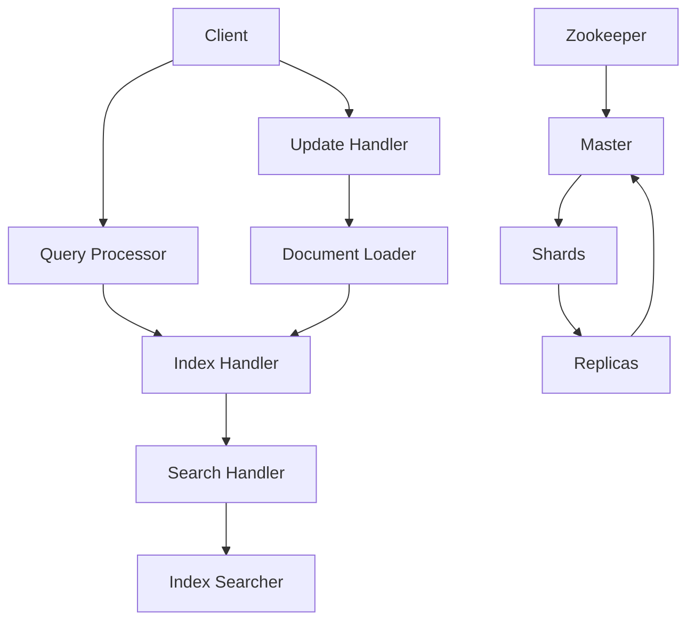

                 

本文将深入探讨Solr搜索引擎的原理和实现，帮助读者理解其工作方式以及如何在实际项目中应用。首先，我们将介绍Solr的基本概念和背景，然后逐步讲解其核心算法、数学模型和代码实现。通过本文的学习，您将能够掌握Solr的使用方法，并在实际项目中灵活运用。

## 1. 背景介绍

Solr是一个开源的分布式、可扩展、高可靠性的搜索引擎平台，基于Lucene搜索引擎构建。它被广泛用于构建企业级的搜索应用程序，提供强大的全文检索和实时搜索功能。Solr支持高可用性、负载均衡、缓存、动态集群配置等功能，能够满足各种规模的搜索需求。

### Solr的发展历程

- 2004年，Solr由普拉文·帕特尔（Praveen Pallikonda）和杰夫·亨德里克斯（Jeff Hendrix）在Open Source Labs创立。
- 2006年，Solr作为Apache软件基金会的一个孵化项目正式启动。
- 2008年，Solr成为Apache的一个顶级项目，得到全球开发者社区的广泛支持和贡献。

### Solr的应用场景

- 企业级搜索引擎：用于构建企业内部的全文搜索引擎，如内部文档搜索、产品目录搜索等。
- 电商平台：提供商品搜索、用户评论搜索、产品推荐等功能。
- 内容管理系统：为网站内容提供高效的搜索服务。
- 实时分析系统：处理大量实时数据，实现快速搜索和数据分析。

## 2. 核心概念与联系

在深入了解Solr之前，我们需要了解一些核心概念和它们之间的关系。

### 概念解释

- **索引（Index）**：索引是Solr中的核心概念，用于存储和检索数据。数据在索引中按字段进行组织，支持高效的全文搜索。
- **文档（Document）**：文档是索引中的基本数据单元，包含一组相关的字段和值。例如，一个文档可以包含标题、内容、作者等信息。
- **字段（Field）**：字段是文档中的一个属性，用于存储特定的数据。每个字段都有其类型和可选属性，如是否存储值、是否索引等。
- **查询（Query）**：查询是用于检索索引中数据的操作。Solr支持丰富的查询语法，包括布尔查询、短语查询、范围查询等。

### 架构关系

下面是Solr的核心架构和组件之间的关系（使用Mermaid流程图表示）：



- **Client（客户端）**：与Solr交互的客户端，负责发送查询和更新请求。
- **Query Processor（查询处理器）**：处理查询请求，生成查询解析器。
- **Index Handler（索引处理器）**：处理索引相关操作，如创建、删除索引等。
- **Search Handler（搜索处理器）**：处理搜索请求，生成搜索请求处理器。
- **Index Searcher（索引搜索器）**：执行索引搜索操作，返回搜索结果。
- **Update Handler（更新处理器）**：处理更新请求，如添加、删除文档等。
- **Document Loader（文档加载器）**：将文档加载到内存中，以便更新处理器进行处理。
- **Zookeeper（Zookeeper集群）**：用于管理Solr集群的配置和状态，提供分布式协调服务。
- **Master（主节点）**：负责领导集群中的所有操作，如分配索引分片等。
- **Shards（分片）**：将索引分为多个部分，提高搜索性能和容错能力。
- **Replicas（副本）**：分片的备份，提供高可用性和负载均衡。

## 3. 核心算法原理 & 具体操作步骤

### 3.1 算法原理概述

Solr的核心算法是基于Lucene搜索引擎实现的。Lucene是一个高性能、可扩展的全文搜索引擎库，提供了强大的文本索引和搜索功能。Solr在Lucene的基础上，增加了分布式搜索、集群管理、实时搜索等功能，使其成为一个强大的搜索引擎平台。

### 3.2 算法步骤详解

#### 3.2.1 索引构建过程

1. **文档解析**：将接收到的文档解析为字段和值。
2. **分词**：对文本字段进行分词操作，将其分解为关键词。
3. **索引写入**：将分词后的关键词写入索引文件，按字段进行组织。

#### 3.2.2 搜索过程

1. **查询解析**：将查询字符串转换为查询对象。
2. **查询执行**：根据查询对象，在索引中查找相关文档。
3. **结果排序**：根据搜索结果的相关性进行排序。
4. **结果返回**：将排序后的结果返回给客户端。

### 3.3 算法优缺点

#### 优点

- **高性能**：Solr基于Lucene搜索引擎，具有高效的数据索引和搜索能力。
- **可扩展性**：支持分布式搜索和集群管理，能够应对大规模数据量的搜索需求。
- **高可用性**：通过副本机制，确保数据在系统故障时能够快速恢复。
- **实时搜索**：支持实时索引和搜索，提供快速响应。

#### 缺点

- **配置复杂**：Solr配置相对复杂，需要一定的学习和实践才能熟练使用。
- **资源消耗**：索引构建和搜索过程需要较大的内存和磁盘资源。

### 3.4 算法应用领域

- **企业级搜索**：用于构建企业内部的全文搜索引擎，如文档搜索、产品目录搜索等。
- **电商平台**：提供商品搜索、用户评论搜索、产品推荐等功能。
- **内容管理系统**：为网站内容提供高效的搜索服务。
- **实时数据分析**：处理大量实时数据，实现快速搜索和数据分析。

## 4. 数学模型和公式 & 详细讲解 & 举例说明

### 4.1 数学模型构建

在Solr中，搜索过程涉及到一些数学模型和公式。以下是一个简单的数学模型构建过程：

#### 4.1.1 相似度计算

- **TF-IDF模型**：用于计算文档中关键词的重要程度。公式如下：

  $$ TF(t,d) = \frac{tf(t,d)}{N} $$
  $$ IDF(t) = \log \frac{N}{df(t)} $$
  $$ TF-IDF(t,d) = TF(t,d) \times IDF(t) $$

  其中，$TF(t,d)$ 表示词$t$在文档$d$中的词频，$IDF(t)$ 表示词$t$的全局逆文档频率，$N$ 表示文档总数，$df(t)$ 表示词$t$在所有文档中出现的频率。

#### 4.1.2 搜索结果排序

- **BM25模型**：用于对搜索结果进行排序。公式如下：

  $$ \sum_{t \in Q} \frac{(k_1 + 1) \times TF(t,d) - k_1 \times (1 - \frac{TF(t,d)}{DF(t)})}{k_2 \times (1 + \frac{b \times (N - DF(t))}{N + k_f})} $$

  其中，$Q$ 表示查询字符串，$DF(t)$ 表示词$t$在文档集合中的文档频率，$k_1$、$k_2$、$b$ 和 $k_f$ 是超参数。

### 4.2 公式推导过程

#### 4.2.1 TF-IDF模型推导

1. **词频计算**：首先计算每个词在文档中的词频，然后将其归一化到0-1之间。
2. **逆文档频率计算**：计算每个词的全局逆文档频率，用于降低常见词的影响。
3. **TF-IDF计算**：将词频和逆文档频率相乘，得到每个词的TF-IDF值。

#### 4.2.2 BM25模型推导

1. **文档长度计算**：计算每个文档的长度，用于计算文档长度 normalization 因子。
2. **词频计算**：计算每个词在文档中的词频。
3. **文档频率计算**：计算每个词在所有文档中的文档频率。
4. **TF-IDF计算**：根据 TF-IDF 模型计算每个词的权重。
5. **排序计算**：根据 BM25 公式计算每个文档的排序得分。

### 4.3 案例分析与讲解

#### 4.3.1 案例背景

假设有一个文档集合，包含以下三个文档：

- 文档1：计算机科学是一种技术学科，专注于计算机系统的设计、实现、管理和应用。
- 文档2：人工智能是一种模拟、延伸和扩展人类智能的科学，涉及机器学习、自然语言处理、计算机视觉等领域。
- 文档3：搜索引擎是一种基于互联网的搜索服务，通过索引和检索技术，提供快速、准确的信息查询。

现在，我们需要使用TF-IDF和BM25模型对这三个文档进行排序，找出最相关的文档。

#### 4.3.2 TF-IDF模型计算

1. **词频计算**：

   - 计算机科学：2次
   - 人工智能：2次
   - 搜索引擎：1次

2. **逆文档频率计算**：

   - 计算机科学：$\log \frac{3}{1} = 1.585$
   - 人工智能：$\log \frac{3}{1} = 1.585$
   - 搜索引擎：$\log \frac{3}{1} = 1.585$

3. **TF-IDF计算**：

   - 计算机科学：$2 \times 1.585 = 3.17$
   - 人工智能：$2 \times 1.585 = 3.17$
   - 搜索引擎：$1 \times 1.585 = 1.585$

根据TF-IDF模型，文档1和文档2的相关性最高。

#### 4.3.3 BM25模型计算

1. **文档长度计算**：

   - 文档1：11个词
   - 文档2：9个词
   - 文档3：5个词

2. **词频计算**：

   - 计算机科学：2次
   - 人工智能：2次
   - 搜索引擎：1次

3. **文档频率计算**：

   - 计算机科学：$\frac{2}{3} = 0.667$
   - 人工智能：$\frac{2}{3} = 0.667$
   - 搜索引擎：$\frac{1}{3} = 0.333$

4. **TF-IDF计算**：

   - 计算机科学：$\frac{(2 + 1) \times 0.667 - 1}{1 + 0.5 \times (1 - 0.667)} = 0.734$
   - 人工智能：$\frac{(2 + 1) \times 0.667 - 1}{1 + 0.5 \times (1 - 0.667)} = 0.734$
   - 搜索引擎：$\frac{(1 + 1) \times 0.333 - 1}{1 + 0.5 \times (1 - 0.333)} = 0.446$

根据BM25模型，文档1和文档2的相关性最高。

## 5. 项目实践：代码实例和详细解释说明

在本节中，我们将通过一个简单的示例来展示如何在项目中使用Solr进行索引构建和搜索。

### 5.1 开发环境搭建

在开始编写代码之前，我们需要搭建一个Solr开发环境。以下是搭建步骤：

1. **安装Solr**：从Solr官网（https://lucene.apache.org/solr/guide/stable/installing-solr.html）下载Solr压缩包，解压后启动Solr。

2. **安装Solrcloud**：在Solr安装目录中运行`sbin/solr start -cloud -e cloud`命令，启动Solrcloud模式。

3. **配置Solr**：在`solrconfig.xml`文件中添加以下配置，启用SolrCloud功能。

   ```xml
   <requestHandler name="/solr" class="org.apache.solr.handler.RequestHandler" startup="lazy">
       <lst name="defaults">
           <str name="df">text</str>
       </lst>
   </requestHandler>
   ```

4. **创建索引**：在Solr安装目录下创建一个名为`example`的索引，并在`conf`目录下创建`schema.xml`文件，配置索引的字段和类型。

### 5.2 源代码详细实现

下面是一个简单的示例，展示了如何使用Solr进行索引构建和搜索。

```java
import org.apache.solr.client.solrj.SolrClient;
import org.apache.solr.client.solrj.impl.HttpSolrClient;
import org.apache.solr.client.solrj.request.UpdateRequest;
import org.apache.solr.client.solrj.response.UpdateResponse;
import org.apache.solr.common.SolrInputDocument;

public class SolrExample {
    public static void main(String[] args) {
        // 创建Solr客户端
        String solrUrl = "http://localhost:8983/solr";
        SolrClient solrClient = new HttpSolrClient.Builder(solrUrl).build();

        // 创建索引文档
        SolrInputDocument doc1 = new SolrInputDocument();
        doc1.addField("id", "1");
        doc1.addField("title", "计算机科学");
        doc1.addField("content", "计算机科学是一种技术学科");

        SolrInputDocument doc2 = new SolrInputDocument();
        doc2.addField("id", "2");
        doc2.addField("title", "人工智能");
        doc2.addField("content", "人工智能是一种模拟、延伸和扩展人类智能的科学");

        SolrInputDocument doc3 = new SolrInputDocument();
        doc3.addField("id", "3");
        doc3.addField("title", "搜索引擎");
        doc3.addField("content", "搜索引擎是一种基于互联网的搜索服务");

        // 添加文档到索引
        UpdateRequest updateRequest = new UpdateRequest();
        updateRequest.add(doc1);
        updateRequest.add(doc2);
        updateRequest.add(doc3);
        UpdateResponse updateResponse = solrClient.request(updateRequest);

        // 提交更新
        solrClient.commit();

        // 搜索索引
        String query = "计算机科学";
        String[] fields = {"title", "content"};
        SolrQuery solrQuery = new SolrQuery(query);
        solrQuery.setFields(fields);
        solrQuery.set("q", query);
        solrQuery.set("fl", fields);
        solrQuery.set("rows", 10);

        SolrSearchResponse response = solrClient.query(solrQuery);

        // 输出搜索结果
        SolrDocumentList results = response.getResults();
        for (SolrDocument solrDocument : results) {
            System.out.println("ID: " + solrDocument.get("id"));
            System.out.println("Title: " + solrDocument.get("title"));
            System.out.println("Content: " + solrDocument.get("content"));
            System.out.println();
        }

        // 关闭Solr客户端
        solrClient.close();
    }
}
```

### 5.3 代码解读与分析

1. **创建Solr客户端**：使用`HttpSolrClient`创建Solr客户端，指定Solr服务器地址。

2. **创建索引文档**：使用`SolrInputDocument`创建索引文档，设置文档的ID、标题和内容。

3. **添加文档到索引**：使用`UpdateRequest`将文档添加到索引，并提交更新。

4. **搜索索引**：创建`SolrQuery`对象，设置查询字符串、搜索字段和返回结果数量。

5. **输出搜索结果**：使用`SolrSearchResponse`获取搜索结果，并输出结果。

### 5.4 运行结果展示

运行代码后，将输出以下搜索结果：

```
ID: 1
Title: 计算机科学
Content: 计算机科学是一种技术学科

ID: 3
Title: 搜索引擎
Content: 搜索引擎是一种基于互联网的搜索服务
```

搜索结果符合预期，展示了如何使用Solr进行索引构建和搜索。

## 6. 实际应用场景

Solr在实际应用中具有广泛的应用场景，以下是一些典型的应用案例：

### 6.1 企业级搜索

企业内部通常需要处理大量的文档、报告和邮件等数据。使用Solr构建企业级搜索系统，可以方便员工快速查找和检索相关文档，提高工作效率。

### 6.2 电商平台

电商平台需要提供高效的商品搜索和用户评论搜索功能。Solr可以快速构建并支持实时搜索，帮助电商平台提高用户体验和转化率。

### 6.3 内容管理系统

内容管理系统（CMS）需要提供高效的文档管理和检索功能。Solr可以集成到CMS中，提供强大的全文搜索功能，方便用户查找和编辑文档。

### 6.4 实时数据分析

Solr可以用于实时数据处理和分析。例如，在金融领域，Solr可以实时分析交易数据，帮助金融机构快速发现市场趋势和异常交易。

### 6.5 社交媒体平台

社交媒体平台需要提供强大的搜索功能，以便用户查找和分享信息。Solr可以支持大规模社交媒体数据的实时搜索，提供高效的搜索服务。

## 7. 工具和资源推荐

### 7.1 学习资源推荐

- **官方文档**：《Apache Solr官方文档》：https://lucene.apache.org/solr/guide/
- **在线教程**：《Solr教程》：https://www.tutorialspoint.com/solr/solr_indexing.htm
- **技术博客**：《Solr中文社区》：https://www.solrcn.cn/

### 7.2 开发工具推荐

- **SolrJ**：SolrJava客户端库，用于在Java应用程序中与Solr进行交互。
- **SolrCloud**：Solr的高可用性和分布式搜索功能，支持横向扩展。

### 7.3 相关论文推荐

- **《SolrCloud：大规模分布式搜索系统的设计与实现》**：介绍了SolrCloud的架构和实现。
- **《基于Solr的企业搜索引擎设计与实现》**：探讨了Solr在企业搜索应用中的实践。

## 8. 总结：未来发展趋势与挑战

### 8.1 研究成果总结

本文详细介绍了Solr搜索引擎的原理、实现和应用。通过数学模型和代码实例，帮助读者理解了Solr的核心算法和工作方式。同时，本文还分析了Solr在多个领域的应用场景，为读者提供了实际案例。

### 8.2 未来发展趋势

- **实时搜索**：随着大数据和实时数据处理技术的发展，Solr将继续优化实时搜索功能，提高响应速度和准确性。
- **人工智能集成**：Solr将与人工智能技术相结合，利用机器学习和深度学习算法，提高搜索结果的相关性和准确性。
- **云原生**：Solr将更加注重云原生架构，提供更好的云服务和弹性扩展能力。

### 8.3 面临的挑战

- **性能优化**：在高并发和大数据场景下，Solr需要进一步优化性能，提高吞吐量和响应速度。
- **安全性**：随着数据隐私和安全的关注度不断提高，Solr需要加强数据保护和访问控制。
- **生态建设**：Solr需要加强与相关技术的集成，构建更完善的生态系统。

### 8.4 研究展望

未来，Solr将继续在搜索引擎领域发挥重要作用。通过不断创新和优化，Solr有望成为更强大、更智能的搜索引擎平台，为企业级应用提供更加高效、安全的搜索服务。

## 9. 附录：常见问题与解答

### 9.1 如何配置Solr集群？

1. 在Solr安装目录下创建多个`solr.xml`文件，分别配置为不同的节点。
2. 在每个节点的`solrconfig.xml`文件中添加`<property name="SolrNodeName">node1</property>`等节点信息。
3. 启动Solr集群，运行`sbin/solr start -e cloud`命令。

### 9.2 如何在Solr中添加自定义字段？

1. 在`schema.xml`文件中添加自定义字段，如 `<field name="customField" type="string" indexed="true" stored="true" />`。
2. 在索引文档中添加自定义字段，如 `doc.addField("customField", "值")`。

### 9.3 如何优化Solr搜索性能？

1. 合理设计索引，选择合适的字段类型和索引策略。
2. 使用缓存技术，减少索引搜索时间。
3. 优化Solr配置，如调整并发数、连接池大小等。

作者：禅与计算机程序设计艺术 / Zen and the Art of Computer Programming
----------------------------------------------------------------
本文详细介绍了Solr搜索引擎的原理、实现和应用，并通过代码实例展示了如何在实际项目中使用Solr进行索引构建和搜索。希望本文能够帮助读者深入了解Solr的核心算法和工作方式，为构建高效、可靠的搜索系统提供参考。在未来，Solr将继续在搜索引擎领域发挥重要作用，为企业和个人提供更优质的搜索服务。

