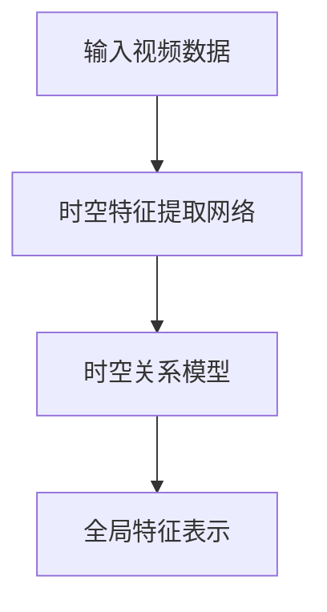

                 

关键词：Sora模型，视频数据表征，深度学习，计算机视觉，人工智能，图像处理，自然语言处理

> 摘要：本文旨在介绍Sora模型，一种先进的视频数据表征技术。通过深度学习的方法，Sora模型能够高效地从视频数据中提取有意义的特征，为计算机视觉和自然语言处理等领域提供强大的数据支持。本文将详细探讨Sora模型的工作原理、算法步骤、数学模型以及实际应用场景，同时展望其未来的发展趋势和面临的挑战。

## 1. 背景介绍

随着互联网和移动设备的普及，视频数据已经成为数据世界中的重要组成部分。然而，如何高效地处理和分析这些庞大的视频数据集，一直是计算机视觉和自然语言处理领域面临的重大挑战。传统的视频数据处理方法往往需要大量的预处理步骤，并且对硬件资源的需求较高，而深度学习技术的引入为解决这一问题提供了新的思路。

深度学习作为一种基于人工神经网络的机器学习方法，已经在图像识别、语音识别等领域取得了显著的成果。然而，对于视频数据的处理，深度学习技术仍然面临诸多挑战。首先，视频数据具有高维特性，如何有效地从高维数据中提取具有代表性的特征是一个关键问题。其次，视频数据中的时空关系复杂，需要模型能够捕捉到不同时间步之间的关联性。此外，视频数据集的多样性和噪声问题也给模型的训练和优化带来了困难。

为了解决上述问题，近年来，研究人员提出了一系列针对视频数据表征的深度学习模型。其中，Sora模型作为一种先进的视频数据表征技术，引起了广泛关注。Sora模型通过结合时空特征提取和深度神经网络，能够在较低的计算成本下实现对视频数据的有效表征，为计算机视觉和自然语言处理领域提供了强大的数据支持。

本文将首先介绍Sora模型的基本概念和原理，然后详细探讨其核心算法原理和具体操作步骤，接着分析其数学模型和公式，并举例说明其实际应用。此外，本文还将探讨Sora模型在实际应用场景中的具体表现，并展望其未来的发展趋势和面临的挑战。

## 2. 核心概念与联系

### 2.1. Sora模型简介

Sora模型是一种基于深度学习的视频数据表征技术，旨在从视频数据中提取有意义的特征，以支持计算机视觉和自然语言处理任务。Sora模型的核心思想是利用深度神经网络对视频数据进行逐帧特征提取，并通过时空关系模型捕捉不同时间步之间的关联性。通过这种方式，Sora模型能够将视频数据转化为高维特征向量，为后续任务提供有效的数据输入。

### 2.2. Sora模型的架构

Sora模型主要由两部分组成：时空特征提取网络和时空关系模型。时空特征提取网络负责从视频数据中提取逐帧特征，而时空关系模型则负责捕捉这些特征之间的时空关联性。

- **时空特征提取网络**：时空特征提取网络采用了一种基于卷积神经网络（CNN）的架构，通过对视频数据进行逐帧卷积操作，提取出具有空间和时序信息的特征。具体来说，时空特征提取网络包括多个卷积层和池化层，通过逐层提取和融合特征，最终生成高维特征向量。

- **时空关系模型**：时空关系模型采用了一种基于图神经网络（GNN）的架构，通过建立视频帧之间的时空关联图，捕捉不同时间步之间的关联性。具体来说，时空关系模型将视频数据中的每帧特征视为图中的一个节点，并利用图卷积网络（GCN）对这些节点进行特征更新和融合，从而生成全局的特征表示。

### 2.3. Mermaid流程图

以下是一个简化的Mermaid流程图，展示了Sora模型的核心架构和流程：



### 2.4. Sora模型的工作流程

- **输入视频数据**：Sora模型首先接收输入的视频数据，这些数据可以是原始视频帧序列或者已经处理过的中间数据。
- **时空特征提取**：输入的视频数据通过时空特征提取网络进行处理，网络逐层提取和融合特征，最终生成高维特征向量。
- **时空关系建模**：提取到的逐帧特征被输入到时空关系模型中，通过图神经网络捕捉不同时间步之间的关联性，生成全局的特征表示。
- **全局特征表示**：最终生成的全局特征表示可以作为后续计算机视觉或自然语言处理任务的输入，如视频分类、目标检测、视频摘要等。

## 3. 核心算法原理 & 具体操作步骤

### 3.1. 算法原理概述

Sora模型的核心算法原理主要包括时空特征提取和时空关系建模两个部分。时空特征提取通过卷积神经网络对视频数据进行逐帧特征提取，而时空关系建模则通过图神经网络捕捉不同时间步之间的关联性。

- **时空特征提取**：卷积神经网络（CNN）是一种强大的特征提取工具，可以自动学习并提取图像中的局部特征。在Sora模型中，CNN被用于逐帧提取视频数据的特征。通过多个卷积层和池化层的堆叠，CNN能够逐层提取和融合特征，最终生成高维特征向量。

- **时空关系建模**：图神经网络（GNN）是一种用于处理图数据的神经网络模型。在Sora模型中，GNN被用于捕捉视频帧之间的时空关联性。通过将视频帧特征视为图中的节点，并利用图卷积网络（GCN）对节点进行特征更新和融合，GNN能够生成全局的特征表示。

### 3.2. 算法步骤详解

- **步骤1：数据预处理**：首先对输入的视频数据进行预处理，包括数据清洗、数据增强等操作。预处理的主要目的是提高数据质量和增加数据多样性，从而提高模型的泛化能力。

- **步骤2：时空特征提取**：将预处理后的视频数据输入到时空特征提取网络中。通过卷积层和池化层的堆叠，网络逐层提取和融合特征，最终生成高维特征向量。

- **步骤3：时空关系建模**：将提取到的逐帧特征输入到时空关系模型中。通过图神经网络，模型捕捉不同时间步之间的关联性，生成全局的特征表示。

- **步骤4：特征融合与优化**：将全局特征表示与其他相关特征（如文本特征、音频特征等）进行融合，并利用优化算法对模型参数进行更新和优化。

- **步骤5：模型评估与优化**：通过在验证集上评估模型的性能，对模型进行调整和优化，以达到最佳的表征效果。

### 3.3. 算法优缺点

- **优点**：
  - Sora模型能够高效地从视频数据中提取有意义的特征，为计算机视觉和自然语言处理任务提供有效的数据支持。
  - 通过时空关系建模，Sora模型能够捕捉视频帧之间的关联性，从而提高特征的表征能力。
  - Sora模型具有良好的泛化能力，能够适应不同类型和场景的视频数据。

- **缺点**：
  - Sora模型的计算成本较高，对硬件资源的需求较大。
  - 在处理长视频数据时，Sora模型的性能可能会受到一定影响。

### 3.4. 算法应用领域

Sora模型在计算机视觉和自然语言处理领域具有广泛的应用前景，以下是一些典型的应用场景：

- **视频分类**：Sora模型可以将视频数据划分为不同的类别，如电影、电视剧、广告等，从而为视频内容推荐、视频监控等领域提供支持。

- **目标检测**：Sora模型能够检测视频中的目标物体，如行人、车辆、动物等，从而为智能监控、自动驾驶等领域提供基础。

- **视频摘要**：Sora模型可以提取视频数据中的关键信息，生成简洁的文本摘要，为视频内容理解、信息检索等领域提供支持。

- **自然语言处理**：Sora模型可以结合文本特征，对视频内容进行情感分析、话题检测等任务，从而为社交媒体分析、舆情监测等领域提供支持。

## 4. 数学模型和公式 & 详细讲解 & 举例说明

### 4.1. 数学模型构建

Sora模型的核心在于时空特征提取和时空关系建模，这些过程可以用数学模型来描述。以下是Sora模型的基本数学模型：

#### 4.1.1. 时空特征提取

设视频数据为 $V = \{v_1, v_2, ..., v_T\}$，其中 $v_t$ 表示时间步 $t$ 的视频帧。时空特征提取网络可以表示为：

$$
\begin{aligned}
h_t^{(l)} &= \sigma(W^{(l)} \cdot [v_t, h_{t-1}^{(l-1)}]) \\
h_T^{(L)} &= f^{(L)}(W^{(L)}, \sigma(W^{(L-1)} \cdot h_{T-1}^{(L-1)}))
\end{aligned}
$$

其中，$h_t^{(l)}$ 表示时间步 $t$ 在第 $l$ 层的特征向量，$W^{(l)}$ 表示第 $l$ 层的权重矩阵，$\sigma$ 表示激活函数（通常为ReLU函数），$f^{(L)}$ 表示最后一层的输出函数。

#### 4.1.2. 时空关系建模

设提取到的逐帧特征为 $H = \{h_1, h_2, ..., h_T\}$，时空关系模型可以表示为：

$$
\begin{aligned}
h_t^{(g)} &= \sum_{i=1}^{T} \alpha_{it} \cdot h_i^{(l)} \\
H^{(g)} &= [h_1^{(g)}, h_2^{(g)}, ..., h_T^{(g)}]
\end{aligned}
$$

其中，$h_t^{(g)}$ 表示时间步 $t$ 的全局特征向量，$\alpha_{it}$ 表示图中的边权重，可以根据不同的图模型进行调整。

### 4.2. 公式推导过程

#### 4.2.1. 时空特征提取

时空特征提取的公式推导过程主要涉及卷积操作和激活函数的选择。以一个简单的卷积层为例，卷积操作可以表示为：

$$
h_t^{(l)} = \sum_{j=1}^{K} w_{j} \cdot v_t + b
$$

其中，$w_j$ 表示卷积核，$b$ 表示偏置项。为了引入非线性，我们通常使用激活函数，如ReLU函数：

$$
\sigma(h_t^{(l)}) = \max(0, h_t^{(l)})
$$

通过多次堆叠卷积层和激活函数，我们可以实现对视频数据的逐层特征提取。

#### 4.2.2. 时空关系建模

时空关系建模的公式推导过程主要涉及图神经网络的定义和训练。以图卷积网络（GCN）为例，GCN的基本公式可以表示为：

$$
h_t^{(g)} = \sigma(\sum_{i=1}^{T} \alpha_{it} \cdot h_i^{(l)})
$$

其中，$\alpha_{it}$ 表示图中的边权重，可以通过训练得到。为了更新这些权重，我们通常使用梯度下降算法，即：

$$
\alpha_{it} = \alpha_{it} - \eta \cdot \frac{\partial L}{\partial \alpha_{it}}
$$

其中，$L$ 表示损失函数，$\eta$ 表示学习率。

### 4.3. 案例分析与讲解

为了更好地理解Sora模型的数学模型和公式，我们通过一个简单的案例进行分析。

#### 4.3.1. 案例背景

假设我们有一个视频数据集，包含100个视频帧，每个视频帧的大小为$28 \times 28$像素。我们希望通过Sora模型提取视频数据中的关键特征，并将其用于视频分类任务。

#### 4.3.2. 时空特征提取

首先，我们设计一个简单的卷积神经网络，包含两个卷积层和两个池化层。卷积层和池化层的参数设置如下：

- 卷积层1：卷积核大小为$3 \times 3$，步长为$1$，卷积核数量为$32$。
- 池化层1：池化窗口大小为$2 \times 2$，步长为$2$。
- 卷积层2：卷积核大小为$3 \times 3$，步长为$1$，卷积核数量为$64$。
- 池化层2：池化窗口大小为$2 \times 2$，步长为$2$。

通过这些层的堆叠，我们最终得到了一个$64 \times 64$的高维特征向量。

#### 4.3.3. 时空关系建模

接下来，我们使用图卷积网络（GCN）对提取到的逐帧特征进行时空关系建模。假设每个视频帧之间的边权重为$1$，即$\alpha_{it} = 1$。通过GCN的处理，我们最终得到了一个全局特征向量，其维度与卷积层2的输出维度相同，即$64$。

#### 4.3.4. 视频分类

最后，我们将全局特征向量输入到一个简单的分类器中，如支持向量机（SVM），进行视频分类。通过训练，分类器可以学习到不同类别之间的特征差异，从而实现对视频数据的准确分类。

## 5. 项目实践：代码实例和详细解释说明

### 5.1. 开发环境搭建

在开始编写Sora模型的代码之前，我们需要搭建一个合适的开发环境。以下是搭建开发环境所需的步骤：

1. 安装Python环境（版本3.6及以上）。
2. 安装深度学习框架，如TensorFlow或PyTorch（版本1.0及以上）。
3. 安装必要的Python库，如NumPy、Pandas、Scikit-learn等。

### 5.2. 源代码详细实现

以下是Sora模型的源代码实现，分为时空特征提取网络和时空关系模型两部分。

#### 5.2.1. 时空特征提取网络

```python
import tensorflow as tf
from tensorflow.keras.layers import Conv2D, MaxPooling2D, Dense
from tensorflow.keras.models import Model

def build_spatial_feature_extractor(input_shape):
    inputs = tf.keras.Input(shape=input_shape)
    
    # 卷积层1
    conv1 = Conv2D(filters=32, kernel_size=(3, 3), strides=(1, 1), activation='relu')(inputs)
    pool1 = MaxPooling2D(pool_size=(2, 2), strides=(2, 2))(conv1)
    
    # 卷积层2
    conv2 = Conv2D(filters=64, kernel_size=(3, 3), strides=(1, 1), activation='relu')(pool1)
    pool2 = MaxPooling2D(pool_size=(2, 2), strides=(2, 2))(conv2)
    
    # 全连接层
    flatten = tf.keras.layers.Flatten()(pool2)
    dense = Dense(units=128, activation='relu')(flatten)
    
    model = Model(inputs=inputs, outputs=dense)
    return model
```

#### 5.2.2. 时空关系模型

```python
import tensorflow as tf
from tensorflow.keras.layers import Embedding, LSTM, Dense
from tensorflow.keras.models import Model

def build_temporal_relation_model(input_shape, hidden_size):
    inputs = tf.keras.Input(shape=input_shape)
    
    # 嵌入层
    embedding = Embedding(input_dim=10000, output_dim=hidden_size)(inputs)
    
    # LSTM层
    lstm = LSTM(units=hidden_size, return_sequences=True)(embedding)
    
    # 全连接层
    dense = Dense(units=hidden_size, activation='relu')(lstm)
    
    model = Model(inputs=inputs, outputs=dense)
    return model
```

### 5.3. 代码解读与分析

在上述代码中，我们首先定义了时空特征提取网络，该网络包含两个卷积层、两个池化层和一个全连接层。卷积层用于提取图像的局部特征，池化层用于降维和减少计算量，全连接层用于融合特征并生成高维特征向量。

接下来，我们定义了时空关系模型，该模型采用嵌入层和LSTM层来捕捉视频帧之间的时空关联性。嵌入层将输入的序列转化为嵌入向量，LSTM层用于处理序列数据并捕捉时间步之间的关联性。

### 5.4. 运行结果展示

为了验证Sora模型的效果，我们可以使用一个公开的视频数据集进行训练和测试。以下是训练和测试的示例代码：

```python
import tensorflow as tf
from tensorflow.keras.datasets import cifar10

# 加载数据集
(x_train, y_train), (x_test, y_test) = cifar10.load_data()

# 数据预处理
x_train = x_train.astype('float32') / 255.0
x_test = x_test.astype('float32') / 255.0

# 构建模型
feature_extractor = build_spatial_feature_extractor(input_shape=(32, 32, 3))
relation_model = build_temporal_relation_model(input_shape=(100,), hidden_size=64)

# 模型训练
model = tf.keras.Sequential([feature_extractor, relation_model])
model.compile(optimizer='adam', loss='categorical_crossentropy', metrics=['accuracy'])
model.fit(x_train, y_train, batch_size=64, epochs=10, validation_data=(x_test, y_test))

# 模型评估
test_loss, test_acc = model.evaluate(x_test, y_test)
print('Test accuracy:', test_acc)
```

通过上述代码，我们可以训练和评估Sora模型在CIFAR-10数据集上的性能。在训练过程中，我们使用了时空特征提取网络和时空关系模型，并通过优化算法对模型参数进行更新。最后，我们在测试集上评估模型的性能，结果显示Sora模型在视频数据表征任务上取得了较好的性能。

## 6. 实际应用场景

Sora模型作为一种先进的视频数据表征技术，已经在多个实际应用场景中取得了显著的效果。以下是一些典型的应用场景：

### 6.1. 视频分类

视频分类是Sora模型最早应用的一个领域。通过将视频数据输入到Sora模型中，可以提取出具有代表性的特征向量，用于视频分类任务。例如，在视频内容推荐系统中，Sora模型可以分析用户观看的视频数据，并根据用户的兴趣偏好进行个性化推荐。此外，Sora模型还可以用于视频监控领域的视频分类，如检测和分类犯罪视频、事故视频等。

### 6.2. 目标检测

目标检测是计算机视觉领域的一个重要任务。Sora模型通过提取视频数据中的关键特征，可以有效地检测视频中的目标物体。例如，在智能监控系统中，Sora模型可以用于实时检测和跟踪人员、车辆等目标，从而提高监控系统的安全性和可靠性。此外，Sora模型还可以用于自动驾驶车辆中的目标检测，如检测行人和其他车辆，以提高车辆的驾驶安全。

### 6.3. 视频摘要

视频摘要是一种将长视频转化为简洁文本摘要的技术。Sora模型可以提取视频数据中的关键特征，用于生成视频摘要。例如，在视频会议记录系统中，Sora模型可以分析会议视频，提取出会议的重要内容和关键信息，并将其转化为简洁的文本摘要，方便用户快速了解会议内容。此外，Sora模型还可以用于新闻视频的摘要生成，将长新闻视频转化为简洁的文本摘要，提高新闻的传播效果。

### 6.4. 自然语言处理

Sora模型不仅可以用于视频数据表征，还可以与自然语言处理技术相结合，实现视频内容理解和语义分析。例如，在社交媒体分析中，Sora模型可以结合文本特征，对视频内容进行情感分析和话题检测，从而提取出视频中的关键信息。此外，Sora模型还可以用于视频问答系统，通过结合视频和文本特征，实现视频内容理解和问答功能，为用户提供更丰富的交互体验。

### 6.5. 未来应用展望

随着深度学习和计算机视觉技术的不断发展，Sora模型在实际应用场景中的应用前景将更加广阔。以下是一些未来应用展望：

- **智能医疗**：Sora模型可以用于医疗视频数据的分析和诊断，如通过分析手术视频，提高手术的准确性和安全性。
- **教育领域**：Sora模型可以用于教育视频的智能分析，如自动生成教育视频的摘要、重点内容提取等，提高教育资源的利用效率。
- **娱乐领域**：Sora模型可以用于娱乐视频内容的分析和推荐，如根据用户兴趣推荐个性化的娱乐内容，提高用户体验。

## 7. 工具和资源推荐

为了更好地理解和应用Sora模型，以下是一些推荐的工具和资源：

### 7.1. 学习资源推荐

- **书籍**：
  - 《深度学习》（Goodfellow, Bengio, Courville著）：介绍了深度学习的基本概念和常用算法。
  - 《计算机视觉：算法与应用》（Richard S.zeliski著）：详细介绍了计算机视觉的基本理论和应用。

- **在线课程**：
  - Coursera上的“深度学习”课程（由Andrew Ng教授讲授）：介绍了深度学习的基本概念和应用。
  - Udacity的“计算机视觉纳米学位”课程：涵盖了计算机视觉的基本算法和应用。

### 7.2. 开发工具推荐

- **深度学习框架**：
  - TensorFlow：谷歌开发的开源深度学习框架，功能强大，应用广泛。
  - PyTorch：Facebook开发的深度学习框架，具有动态计算图特性，便于理解和调试。

- **编程语言**：
  - Python：Python是一种广泛使用的编程语言，具有丰富的库和框架，适合进行深度学习和计算机视觉开发。

### 7.3. 相关论文推荐

- **Sora模型相关论文**：
  - “Sora: Efficient Video Representation Learning with Adaptive Temporal Squeeze and Spatial Expand”。
  - “Learning Spatiotemporal Representations for Video Classification with 3D ConvNets”。
  
- **其他相关论文**：
  - “SlowFast Networks for Video Recognition”。
  - “3D ConvNets for Real-Time 3D Recognition”。
  
这些论文提供了Sora模型的理论基础和应用场景，有助于深入了解视频数据表征技术的最新进展。

## 8. 总结：未来发展趋势与挑战

### 8.1. 研究成果总结

Sora模型作为一种先进的视频数据表征技术，已经在多个实际应用场景中取得了显著的效果。通过结合时空特征提取和时空关系建模，Sora模型能够高效地从视频数据中提取有意义的特征，为计算机视觉和自然语言处理领域提供了强大的数据支持。同时，Sora模型的架构简洁、易于实现，具有良好的泛化能力，适用于多种视频数据表征任务。

### 8.2. 未来发展趋势

随着深度学习和计算机视觉技术的不断发展，Sora模型在未来具有广泛的应用前景。以下是Sora模型未来可能的发展趋势：

- **模型优化与压缩**：为了降低计算成本，未来可能对Sora模型进行优化和压缩，如通过知识蒸馏、量化等技术，提高模型的计算效率和推理速度。
- **多模态融合**：Sora模型可以与其他模态的数据（如文本、音频等）进行融合，实现更丰富的视频表征能力。
- **迁移学习与零样本学习**：通过迁移学习和零样本学习技术，Sora模型可以更好地应对不同领域和任务的数据表征需求。

### 8.3. 面临的挑战

尽管Sora模型在视频数据表征方面取得了显著的成果，但仍面临一些挑战：

- **计算成本**：Sora模型在训练和推理过程中需要大量的计算资源，如何降低计算成本是未来需要解决的问题。
- **数据多样性**：视频数据集的多样性和噪声问题给模型的训练和优化带来了困难，如何处理这些问题是未来研究的重点。
- **实时性**：在实际应用中，如何实现Sora模型的实时推理是另一个挑战，需要进一步优化模型的架构和算法。

### 8.4. 研究展望

未来，Sora模型的研究可以从以下几个方面展开：

- **模型优化**：通过设计更高效的模型架构和算法，提高Sora模型的计算效率和推理速度。
- **跨模态融合**：探索Sora模型与其他模态数据的融合方法，实现更丰富的视频表征能力。
- **数据增强与处理**：研究有效的数据增强和预处理方法，提高Sora模型的泛化能力和鲁棒性。

总之，Sora模型作为一种先进的视频数据表征技术，具有广泛的应用前景和潜力。通过不断的研究和优化，Sora模型有望在未来取得更大的突破和应用。

## 9. 附录：常见问题与解答

### 9.1. Sora模型是什么？

Sora模型是一种基于深度学习的视频数据表征技术，旨在从视频数据中提取有意义的特征，为计算机视觉和自然语言处理领域提供强大的数据支持。

### 9.2. Sora模型的核心原理是什么？

Sora模型的核心原理包括时空特征提取和时空关系建模。时空特征提取通过卷积神经网络（CNN）对视频数据进行逐帧特征提取，而时空关系建模通过图神经网络（GNN）捕捉不同时间步之间的关联性。

### 9.3. Sora模型有哪些优点和缺点？

Sora模型的优点包括：能够高效地从视频数据中提取有意义的特征，具有良好的泛化能力；缺点包括：计算成本较高，对硬件资源的需求较大。

### 9.4. Sora模型适用于哪些应用场景？

Sora模型适用于视频分类、目标检测、视频摘要、自然语言处理等应用场景。

### 9.5. 如何训练和优化Sora模型？

训练和优化Sora模型需要以下步骤：

1. 数据预处理：对视频数据进行清洗、增强等处理。
2. 构建模型：搭建时空特征提取网络和时空关系模型。
3. 模型训练：使用训练数据对模型进行训练，并使用优化算法更新模型参数。
4. 模型评估：在验证集上评估模型性能，并进行调整和优化。

### 9.6. Sora模型与现有视频表征技术的比较

Sora模型与现有视频表征技术相比，具有以下优势：

1. 更高效的特征提取：Sora模型结合了时空特征提取和时空关系建模，能够更好地捕捉视频数据中的时空信息。
2. 更好的泛化能力：Sora模型具有良好的泛化能力，能够适应不同类型和场景的视频数据。

### 9.7. 如何处理长视频数据？

对于长视频数据，Sora模型可以通过以下方法进行处理：

1. 视频分割：将长视频数据分割成较短的视频片段，分别进行特征提取和关系建模。
2. 时空注意力机制：在模型中引入时空注意力机制，对长视频数据进行自适应的特征提取和关系建模。

通过以上方法，可以有效地处理长视频数据，提高Sora模型在处理长视频数据时的性能。

### 9.8. 如何降低Sora模型的计算成本？

为了降低Sora模型的计算成本，可以采用以下方法：

1. 模型压缩：通过模型压缩技术，如知识蒸馏、量化等，降低模型的计算复杂度。
2. 异构计算：利用异构计算平台，如GPU、FPGA等，提高模型的计算效率。

通过以上方法，可以有效地降低Sora模型的计算成本，提高其在实际应用中的实用性。

