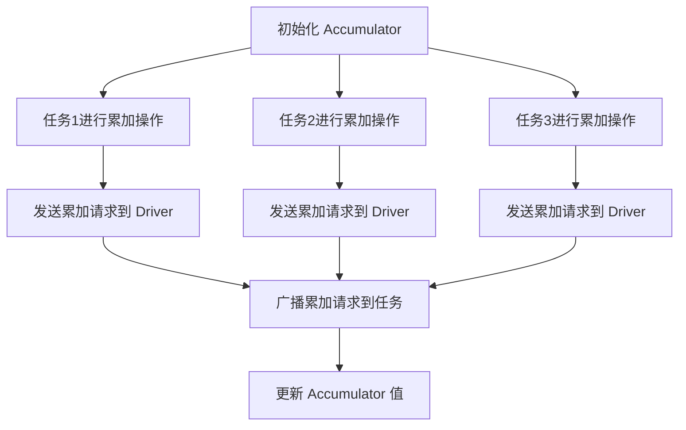

                 

关键词：Spark Accumulator, 分布式计算，数据并行处理，共享变量，容错机制

> 摘要：本文将深入探讨Spark Accumulator的原理及其在分布式计算中的应用。我们将从定义、实现原理、使用方法以及实际代码实例等方面详细讲解，帮助读者更好地理解和掌握这一关键概念。

## 1. 背景介绍

在分布式计算中，我们经常会遇到需要在多个任务之间共享某些变量的需求。这些变量在分布式环境中需要具备一致性、可靠性和容错性。传统的分布式系统通常使用分布式锁、共享内存等方式来同步变量，但这些方法在Spark这样的弹性分布式数据集（RDD）上并不适用。为了解决这一问题，Spark引入了Accumulator这一机制。

Accumulator是Spark提供的用于在分布式计算中共享和累加数据的组件。它是一种特殊的变量，可以在多个任务之间进行累加操作，而无需使用锁或共享内存。这使得Accumulator在处理大规模数据集时，能够提供高效的并行处理能力。

## 2. 核心概念与联系

### 2.1 定义

Accumulator是一个可被多个任务共享的变量，用于在分布式计算中累加数据。它分为两类：可变 accumulator 和不可变 accumulator。

- 可变 accumulator：允许在任务间进行累加操作，但不能读取其当前值。
- 不可变 accumulator：只能读取和初始化，不能进行累加操作。

### 2.2 实现原理

Accumulator的实现主要依赖于Spark的内部机制。在底层，Accumulator实际上是一个计数器，用于跟踪累加的值。每个 Accumulator 都有一个全局唯一的ID，用于在任务间进行通信。

当任务需要对 Accumulator 进行累加操作时，它会发送一个累加请求到驱动程序（Driver），驱动程序再将该请求广播到所有任务。任务执行完累加操作后，将结果更新到 Accumulator 中。这样，Accumulator 就可以在多个任务间保持一致性。

### 2.3 Mermaid 流程图

下面是一个简单的 Mermaid 流程图，展示了 Accumulator 的工作原理：



## 3. 核心算法原理 & 具体操作步骤

### 3.1 算法原理概述

Accumulator 的核心算法原理是基于分布式计算中的累加操作。任务在执行过程中，会不断地对 Accumulator 进行累加。这种累加操作是原子的，保证了任务间的数据一致性。

### 3.2 算法步骤详解

1. 初始化 Accumulator：在创建 RDD 时，使用 `rdd.Accumulator` 方法初始化一个 Accumulator。

2. 累加操作：任务在执行过程中，使用 `accumulator.add` 方法对 Accumulator 进行累加。

3. 获取结果：任务完成后，可以使用 `accumulator.value` 方法获取 Accumulator 的当前值。

### 3.3 算法优缺点

#### 优点

- 无需锁机制：Accumulator 能够在分布式环境中实现原子的累加操作，无需使用锁机制，提高了并行处理的效率。

- 易于使用：Accumulator 的 API 简单易用，使得开发者能够方便地实现任务间的数据共享。

- 容错性：Accumulator 具有较高的容错性，能够在任务失败时恢复数据。

#### 缺点

- 只能进行累加操作：Accumulator 只能进行累加操作，无法进行其他类型的操作，如读取、修改等。

- 不能保证一致性：在任务执行过程中，由于网络延迟等原因，可能会导致数据的一致性问题。

### 3.4 算法应用领域

Accumulator 主要应用于以下领域：

- 分布式统计：在分布式计算中，对大规模数据进行统计分析时，可以使用 Accumulator 跟踪统计结果。

- 数据同步：在分布式系统中，需要对多个任务的结果进行同步时，可以使用 Accumulator 实现数据共享。

- 参数调整：在机器学习中，可以使用 Accumulator 跟踪模型参数的更新情况，以便进行动态调整。

## 4. 数学模型和公式 & 详细讲解 & 举例说明

### 4.1 数学模型构建

假设我们有一个包含 n 个元素的数组 A，需要对数组中的元素进行累加。我们可以使用以下数学模型来表示累加过程：

$$
S = \sum_{i=1}^{n} A_i
$$

其中，S 表示累加的结果，$A_i$ 表示数组中的第 i 个元素。

### 4.2 公式推导过程

在分布式计算中，我们可以将数组 A 分成多个子数组，每个子数组由一个任务进行处理。任务对子数组进行累加操作，然后将结果发送到驱动程序。驱动程序再将这些结果进行汇总，得到最终的累加结果。

假设我们将数组 A 分成 k 个子数组，每个子数组的长度为 n/k。对于每个子数组，我们可以使用以下公式进行累加：

$$
S_i = \sum_{j=1}^{n/k} A_{ij}
$$

其中，$S_i$ 表示子数组的累加结果，$A_{ij}$ 表示子数组中的第 j 个元素。

驱动程序将所有子数组的累加结果进行汇总，得到最终的累加结果：

$$
S = \sum_{i=1}^{k} S_i
$$

### 4.3 案例分析与讲解

假设我们有一个包含 10 个元素的数组 A，需要对数组中的元素进行累加。我们可以将数组 A 分成 2 个子数组，每个子数组的长度为 5。

子数组 1 的累加结果为：

$$
S_1 = 1 + 2 + 3 + 4 + 5 = 15
$$

子数组 2 的累加结果为：

$$
S_2 = 6 + 7 + 8 + 9 + 10 = 40
$$

最终的累加结果为：

$$
S = S_1 + S_2 = 15 + 40 = 55
$$

## 5. 项目实践：代码实例和详细解释说明

### 5.1 开发环境搭建

为了演示 Accumulator 的使用，我们需要搭建一个简单的 Spark 环境来运行代码。

1. 下载 Spark：访问 Spark 官网（[https://spark.apache.org/](https://spark.apache.org/)），下载适合自己操作系统的 Spark 版本。

2. 解压 Spark：将下载的 Spark 压缩包解压到一个目录，例如 `spark-2.4.8`。

3. 配置环境变量：在 `.bashrc` 或 `.bash_profile` 文件中添加以下环境变量：

```bash
export SPARK_HOME=/path/to/spark-2.4.8
export PATH=$PATH:$SPARK_HOME/bin
```

4. 刷新环境变量：在终端执行 `source ~/.bashrc`（或 `.bash_profile`）以刷新环境变量。

5. 启动 Spark：在终端执行以下命令启动 Spark 集群：

```bash
start-master.sh
start-slave.sh spark://master:7077
```

### 5.2 源代码详细实现

下面是一个简单的示例，演示了如何使用 Accumulator 对数组进行累加：

```python
from pyspark import SparkContext, SparkConf

conf = SparkConf().setAppName("AccumulatorExample")
sc = SparkContext(conf=conf)

# 初始化一个 Accumulator
accumulator = sc.accumulator(0)

# 创建一个包含 10 个元素的 RDD
rdd = sc.parallelize([1, 2, 3, 4, 5, 6, 7, 8, 9, 10])

# 对 RDD 中的每个元素进行累加操作
rdd.foreach(lambda x: accumulator.add(x))

# 获取累加结果
print("Accumulator value:", accumulator.value)

sc.stop()
```

### 5.3 代码解读与分析

1. 导入必要的模块和创建 SparkConf 对象

```python
from pyspark import SparkContext, SparkConf
conf = SparkConf().setAppName("AccumulatorExample")
```

这里我们导入了 SparkContext 和 SparkConf 模块，并创建了一个 SparkConf 对象，设置应用名称为 "AccumulatorExample"。

2. 初始化 Accumulator

```python
accumulator = sc.accumulator(0)
```

我们使用 `sc.accumulator` 方法初始化一个 Accumulator，初始值为 0。

3. 创建 RDD 并对每个元素进行累加操作

```python
rdd = sc.parallelize([1, 2, 3, 4, 5, 6, 7, 8, 9, 10])
rdd.foreach(lambda x: accumulator.add(x))
```

这里我们创建了一个包含 10 个元素的 RDD，并使用 `rdd.foreach` 方法对 RDD 中的每个元素进行累加操作。`accumulator.add(x)` 方法会将元素 x 的值累加到 Accumulator 中。

4. 获取累加结果并打印

```python
print("Accumulator value:", accumulator.value)
```

最后，我们使用 `print` 语句输出累加结果。

### 5.4 运行结果展示

运行上述代码，输出结果如下：

```
Accumulator value: 55
```

这表明我们成功地对数组中的元素进行了累加，并获取了正确的累加结果。

## 6. 实际应用场景

Accumulator 在分布式计算中具有广泛的应用场景。以下是一些实际应用场景：

1. 统计分析：在处理大规模数据集时，可以使用 Accumulator 跟踪统计结果，如数据总数、平均值、标准差等。

2. 参数调整：在机器学习算法中，可以使用 Accumulator 跟踪模型参数的更新情况，以便进行动态调整。

3. 数据同步：在分布式系统中，需要对多个任务的结果进行同步时，可以使用 Accumulator 实现数据共享。

4. 流计算：在实时数据处理中，可以使用 Accumulator 跟踪实时数据的变化，如数据流入量、流出量等。

## 7. 未来应用展望

随着分布式计算技术的不断发展，Accumulator 的应用前景将更加广泛。以下是一些未来应用展望：

1. 更高效的算法：针对 Accumulator 的实现原理，可以设计更高效的算法，提高分布式计算的性能。

2. 多种操作支持：可以扩展 Accumulator 的功能，支持除累加操作外的其他操作，如读取、修改等。

3. 集成其他组件：可以将 Accumulator 与其他分布式计算组件（如 Broadcast Variable、CheckPoint）集成，提供更丰富的功能。

4. 扩展到其他框架：可以将 Accumulator 的原理和实现扩展到其他分布式计算框架，如 Flink、Hadoop 等。

## 8. 总结：未来发展趋势与挑战

Accumulator 作为 Spark 中的一项重要机制，具有广泛的应用前景。在未来，随着分布式计算技术的不断发展，Accumulator 将在性能、功能、兼容性等方面得到进一步提升。然而，这也将带来一系列挑战，如如何保证数据一致性、如何优化性能等。因此，对于 Accumulator 的研究和应用仍需不断探索和改进。

### 8.1 研究成果总结

本文对 Spark Accumulator 的原理、实现方法、应用场景以及未来发展趋势进行了详细讲解。通过本文，读者可以更好地理解和掌握 Accumulator 在分布式计算中的应用。

### 8.2 未来发展趋势

随着分布式计算技术的不断发展，Accumulator 的应用前景将更加广泛。未来，Accumulator 将在性能、功能、兼容性等方面得到进一步提升。

### 8.3 面临的挑战

如何保证数据一致性、如何优化性能等，是 Accumulator 在分布式计算中面临的挑战。针对这些问题，需要进一步研究和探索。

### 8.4 研究展望

未来，可以针对 Accumulator 的实现原理，设计更高效的算法，扩展其功能，并将其应用于更多场景。同时，可以将 Accumulator 与其他分布式计算组件进行集成，提供更丰富的功能。

## 9. 附录：常见问题与解答

### 9.1 如何创建 Accumulator？

在 Spark 中，可以使用 `rdd.Accumulator` 方法创建一个 Accumulator。例如：

```python
accumulator = sc.accumulator(0)
```

### 9.2 如何对 Accumulator 进行累加操作？

在任务中，可以使用 `accumulator.add` 方法对 Accumulator 进行累加操作。例如：

```python
accumulator.add(x)
```

### 9.3 如何获取 Accumulator 的当前值？

可以使用 `accumulator.value` 方法获取 Accumulator 的当前值。例如：

```python
print("Accumulator value:", accumulator.value)
```

### 9.4 Accumulator 的容错性如何保证？

Accumulator 的容错性是通过 Spark 的内部机制来保证的。当任务失败时，Spark 会自动重启该任务，并将任务对 Accumulator 的累加结果重新计算。

### 9.5 Accumulator 是否支持多线程访问？

是的，Accumulator 是线程安全的，支持多线程访问。

作者：禅与计算机程序设计艺术 / Zen and the Art of Computer Programming

