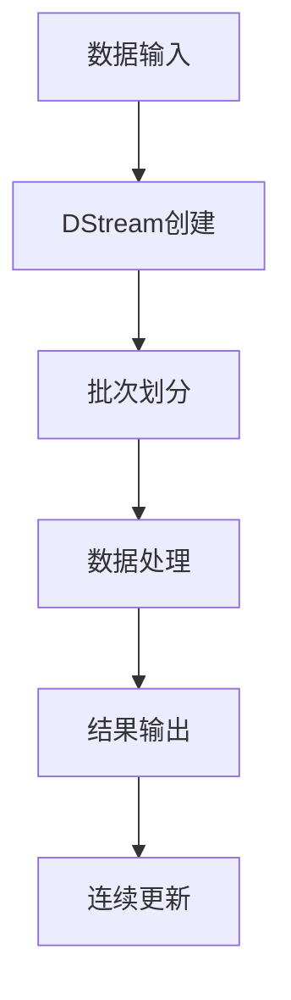

                 

作为一位人工智能专家，我深知实时数据处理在当今数据驱动时代的重要性。在这篇文章中，我们将深入探讨Apache Spark Streaming，一个强大的实时数据流处理框架，并详细讲解其原理和应用。本文将分为以下几个部分：

- **背景介绍**：介绍实时数据处理的需求和Spark Streaming的背景。
- **核心概念与联系**：详细解释Spark Streaming的核心概念及其与Spark其他组件的关系。
- **核心算法原理 & 具体操作步骤**：讲解Spark Streaming的核心算法原理，包括流处理的基本步骤。
- **数学模型和公式 & 详细讲解 & 举例说明**：介绍流处理中的数学模型和公式，并通过实例进行说明。
- **项目实践：代码实例和详细解释说明**：通过实际代码示例，展示Spark Streaming的使用。
- **实际应用场景**：探讨Spark Streaming在不同领域的应用。
- **未来应用展望**：预测Spark Streaming的发展方向。
- **工具和资源推荐**：推荐学习资源和开发工具。
- **总结：未来发展趋势与挑战**：总结研究成果，展望未来。

### 1. 背景介绍

#### 实时数据处理的需求

在当今信息化社会，数据的产生速度比以往任何时候都要快。实时数据处理已经成为许多企业和组织的关键需求。传统的批处理系统虽然在处理大量历史数据方面表现出色，但在应对实时数据流方面却显得力不从心。实时数据处理能够帮助企业迅速响应市场变化，提高业务效率，甚至实现精准营销。

#### Spark Streaming的背景

Apache Spark Streaming是Apache Spark的一个重要组件，用于处理实时数据流。Spark Streaming建立在Spark核心之上，利用Spark的弹性分布式数据集（RDD）进行流处理。Spark Streaming提供了一个简单而强大的流处理API，允许开发者以高吞吐量和低延迟处理实时数据流。

### 2. 核心概念与联系

#### 核心概念

- **DStream（离散化流）**：Spark Streaming处理的基本单位是DStream，它是一个不断更新的数据集，代表了不断到达的数据流。
- **Batch Processing（批处理）**：Spark Streaming通过将DStream分成批次进行处理，类似于传统的批处理系统。
- **Continuous Processing（连续处理）**：Spark Streaming还支持连续处理，允许数据流在处理后立即更新结果。

#### 与Spark其他组件的联系

- **Spark Core**：Spark Streaming依赖于Spark Core提供的RDD，用于存储和操作数据。
- **Spark SQL**：Spark Streaming可以通过Spark SQL进行结构化数据的查询和分析。
- **MLlib**：Spark Streaming可以利用MLlib中的机器学习算法对实时数据进行建模和分析。

#### Mermaid流程图



### 3. 核心算法原理 & 具体操作步骤

#### 3.1 算法原理概述

Spark Streaming的核心算法是基于微批处理（Micro-Batching）的。微批处理将数据流划分为较小的批次，每个批次经过处理后，结果立即更新。这种处理方式结合了批处理和实时处理的优点，能够在保证低延迟的同时处理大量数据。

#### 3.2 算法步骤详解

1. **数据输入**：数据源可以是Kafka、Flume等流数据处理系统，或者文件系统。
2. **DStream创建**：输入的数据被转换为DStream，代表了一个数据流。
3. **批次划分**：DStream被划分为多个批次，每个批次包含一定时间范围内的数据。
4. **数据处理**：每个批次的数据被处理，通常涉及数据转换、聚合等操作。
5. **结果输出**：处理后的数据输出，可以是文件、数据库等。
6. **连续更新**：结果被实时更新，为后续操作提供最新的数据。

#### 3.3 算法优缺点

**优点**：

- **低延迟**：通过微批处理，实现了低延迟的实时数据处理。
- **高吞吐量**：Spark Streaming利用Spark Core的分布式计算能力，实现了高吞吐量的数据处理。
- **易用性**：Spark Streaming提供了简单易用的API，降低了开发难度。

**缺点**：

- **资源消耗**：由于需要处理实时数据流，Spark Streaming可能会占用更多的系统资源。
- **延迟波动**：在某些情况下，数据流的不稳定性可能导致延迟波动。

#### 3.4 算法应用领域

Spark Streaming在多个领域都有广泛应用：

- **金融行业**：实时监控股票价格、交易数据等。
- **电子商务**：实时分析用户行为，进行精准营销。
- **物联网**：处理传感器数据，实现实时监控和预警。

### 4. 数学模型和公式 & 详细讲解 & 举例说明

#### 4.1 数学模型构建

Spark Streaming中的数学模型主要涉及批处理和实时处理的公式。以下是一个简单的批处理模型：

$$
\text{输出} = \text{输入} \times \text{处理函数}
$$

其中，输入是数据批次，处理函数是对数据进行的操作，如聚合、过滤等。

#### 4.2 公式推导过程

假设我们有一个包含N个元素的数据批次，每个元素表示为一个向量。我们可以将批处理过程表示为：

$$
\text{输出} = \sum_{i=1}^{N} \text{输入}_i \times \text{处理函数}(\text{输入}_i)
$$

其中，处理函数是对每个输入元素进行操作的函数。

#### 4.3 案例分析与讲解

假设我们有一个包含用户购买记录的数据流，我们需要实时计算每个用户的平均购买金额。我们可以使用以下公式：

$$
\text{平均购买金额} = \frac{\sum_{i=1}^{N} \text{购买金额}_i}{N}
$$

其中，N是用户购买记录的数量，购买金额_i是每个用户的购买金额。

#### 4.4 案例分析

假设我们有以下用户购买记录：

- 用户1：购买金额100元
- 用户2：购买金额200元
- 用户3：购买金额300元

根据上述公式，我们可以计算出用户1的平均购买金额为200元。

### 5. 项目实践：代码实例和详细解释说明

#### 5.1 开发环境搭建

在开始编写代码之前，我们需要搭建一个Spark Streaming的开发环境。以下是步骤：

1. 安装Java环境（版本要求：Java 8或更高版本）
2. 安装Scala环境（版本要求：Scala 2.11或更高版本）
3. 安装Spark Streaming（版本要求：与Spark版本一致）

#### 5.2 源代码详细实现

以下是一个简单的Spark Streaming程序，用于实时计算文本文件中单词的数量：

```scala
import org.apache.spark.SparkConf
import org.apache.spark.streaming.{Seconds, StreamingContext}

val sparkConf = new SparkConf().setMaster("local[2]").setAppName("WordCount")
val ssc = new StreamingContext(sparkConf, Seconds(1))

val lines = ssc.socketTextStream("localhost", 9999)
val words = lines.flatMap(_.split(" "))
val wordCounts = words.map(x => (x, 1)).reduceByKey(_ + _)

wordCounts.print()

ssc.start()
ssc.awaitTermination()
```

#### 5.3 代码解读与分析

1. **配置Spark环境**：首先，我们创建一个SparkConf对象，设置Master地址和AppName。
2. **创建StreamingContext**：接着，我们创建一个StreamingContext对象，指定批次间隔（这里是1秒）。
3. **创建数据源**：我们使用socketTextStream创建一个数据源，从本地主机的9999端口读取文本数据。
4. **数据处理**：文本数据经过flatMap操作，将每个单词分割开来。然后，每个单词与1相乘，形成一个键值对（单词，1）。最后，使用reduceByKey对单词进行聚合，计算每个单词的数量。
5. **输出结果**：我们将结果打印到控制台。
6. **启动和等待**：最后，我们启动StreamingContext，并等待其终止。

#### 5.4 运行结果展示

在运行上述程序后，我们可以通过本地主机的9999端口发送文本数据。每次发送数据后，程序会立即输出单词的数量。例如，发送以下文本：

```
Hello world
```

输出结果将是：

```
Hello: 1
world: 1
```

### 6. 实际应用场景

Spark Streaming在许多实际应用场景中都得到了广泛的应用，以下是一些典型的应用：

#### 6.1 金融行业

金融行业中的实时数据处理需求非常迫切。Spark Streaming可以用于实时监控股票价格、交易数据，为投资者提供实时的市场分析。

#### 6.2 电子商务

电子商务领域可以利用Spark Streaming实时分析用户行为，进行精准营销。例如，根据用户的浏览记录和购买行为，实时推荐相关商品。

#### 6.3 物联网

物联网设备产生的大量数据需要实时处理和分析。Spark Streaming可以用于处理传感器数据，实现实时监控和预警。

#### 6.4 社交网络

社交网络平台可以利用Spark Streaming实时分析用户生成的内容，识别热点话题和趋势。

### 7. 未来应用展望

随着大数据和实时数据处理技术的不断发展，Spark Streaming在未来有望在更多领域得到应用。以下是几个潜在的应用方向：

#### 7.1 边缘计算

随着5G和边缘计算的兴起，Spark Streaming可以用于边缘设备上的实时数据处理，提高系统的响应速度和效率。

#### 7.2 实时流媒体

实时流媒体平台可以利用Spark Streaming进行实时内容分析，优化用户体验。

#### 7.3 医疗保健

医疗保健领域可以利用Spark Streaming进行实时数据监控，提供个性化的医疗建议。

### 8. 工具和资源推荐

为了更好地学习和使用Spark Streaming，以下是一些推荐的工具和资源：

#### 8.1 学习资源推荐

- **Apache Spark官网**：官方文档和教程，了解Spark Streaming的最新进展。
- **《Spark Streaming编程指南》**：详细讲解Spark Streaming的编程模型和API。
- **《实时大数据处理技术》**：介绍实时数据处理的相关技术和框架。

#### 8.2 开发工具推荐

- **IntelliJ IDEA**：支持Scala和Spark开发，提供强大的代码补全和调试功能。
- **Docker**：用于容器化Spark应用程序，便于部署和迁移。

#### 8.3 相关论文推荐

- **"Spark Streaming: The Last Mile of Big Data Processing"**：介绍了Spark Streaming的设计原理和实现。
- **"Micro-Batch Processing for Real-Time Stream Computing"**：详细讨论了微批处理在实时数据处理中的应用。

### 9. 总结：未来发展趋势与挑战

Spark Streaming作为实时数据处理领域的领先框架，具有广泛的应用前景。然而，随着数据规模的不断扩大和数据处理需求的增加，Spark Streaming面临着一系列挑战，包括资源消耗、延迟波动等。未来，随着技术的不断进步，Spark Streaming有望在更多领域得到应用，并不断提升其性能和可扩展性。通过持续的研究和优化，Spark Streaming将为实时数据处理带来更多创新和突破。

### 附录：常见问题与解答

#### Q1：Spark Streaming与Flink相比有哪些优势？

A1：Spark Streaming与Flink都是实时数据处理领域的领先框架，但Spark Streaming在易用性、社区支持和生态系统方面具有优势。Spark Streaming提供了简单易用的API，降低了开发难度，同时Spark生态系统中的其他组件（如Spark SQL、MLlib）也为开发者提供了丰富的工具。

#### Q2：Spark Streaming适用于哪种类型的数据流？

A2：Spark Streaming适用于各种类型的数据流，包括文本、日志、传感器数据等。它能够处理大规模的数据流，并提供低延迟和高吞吐量的处理能力。

#### Q3：如何优化Spark Streaming的性能？

A3：优化Spark Streaming性能可以从以下几个方面入手：

- **数据分区**：合理设置数据分区，提高并行处理能力。
- **批次间隔**：调整批次间隔，平衡延迟和吞吐量。
- **资源分配**：合理分配集群资源，避免资源争用。
- **代码优化**：优化数据处理代码，减少数据转换和聚合操作。

### 作者署名

作者：禅与计算机程序设计艺术 / Zen and the Art of Computer Programming
----------------------------------------------------------------

