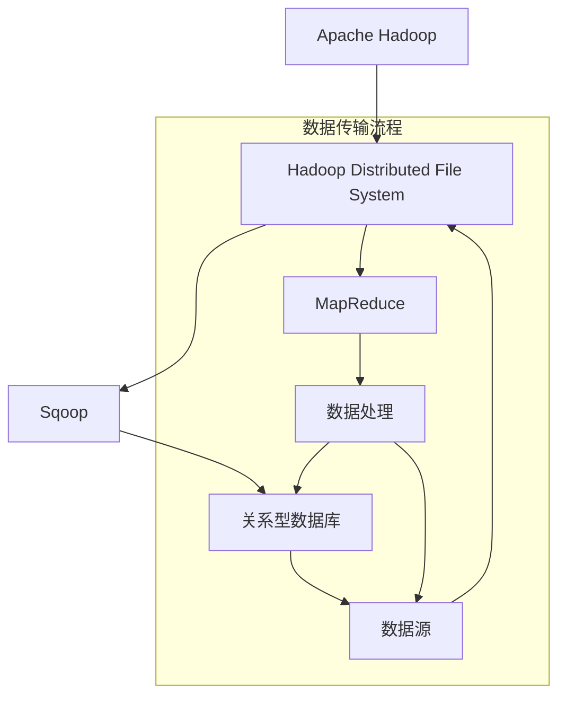

                 

  
## 1. 背景介绍

Sqoop是一种开源的ETL（Extract, Transform, Load）工具，用于在Apache Hadoop和结构化数据存储系统之间进行数据的导入和导出。随着大数据技术的发展，如何高效地将数据从关系型数据库或其他数据源导入到Hadoop生态系统中，成为了一个重要的课题。Sqoop应运而生，成为连接这些不同数据存储系统的桥梁。

Hadoop是一个分布式数据存储和计算框架，提供了高效的数据存储和大规模数据处理的能力。而关系型数据库如MySQL、PostgreSQL等，则是企业中常用的数据存储解决方案。两者之间存在着数据格式的差异，以及处理能力的不同，这给数据迁移带来了挑战。

Sqoop的出现，解决了这个问题。它可以将结构化数据存储系统中的数据导入到Hadoop的HDFS（Hadoop Distributed File System）中，也可以将HDFS中的数据导出到结构化数据存储系统中。同时，Sqoop支持多种数据源和数据目标的转换，包括关系型数据库、NoSQL数据库、以及Hive、HBase等大数据处理系统。

在本文中，我们将深入探讨Sqoop的原理，并通过代码实例，展示如何使用Sqoop进行数据导入和导出。这将帮助读者更好地理解Sqoop的工作机制，并能够将其应用到实际的数据迁移项目中。

## 2. 核心概念与联系

在深入理解Sqoop之前，我们需要了解一些核心概念和它们之间的联系。以下是几个重要的概念：

- **Hadoop**: 一个分布式数据处理框架，提供了数据存储（HDFS）和数据计算（MapReduce、YARN等）的功能。
- **HDFS**: Hadoop的分布式文件系统，用于存储大规模数据集。
- **关系型数据库**: 如MySQL、PostgreSQL等，用于存储结构化数据。
- **Sqoop**: 用于在Hadoop和关系型数据库之间进行数据传输的工具。

### Mermaid 流程图

以下是使用Mermaid绘制的流程图，展示了这些概念之间的联系：



### 流程解释

- **Hadoop** 和 **HDFS**：Hadoop提供了一个分布式文件系统（HDFS）和一个分布式数据处理框架（MapReduce）。HDFS用于存储大量数据，而MapReduce用于对数据进行分布式处理。
- **Sqoop**：Sqoop作为一个数据传输工具，连接了Hadoop和关系型数据库。它可以将数据从关系型数据库导入到HDFS，或将HDFS中的数据导出到关系型数据库。
- **关系型数据库**：如MySQL、PostgreSQL等，是用于存储结构化数据的标准数据存储系统。
- **数据源**：指各种结构化数据存储系统，包括关系型数据库和其他数据源。

通过这个流程图，我们可以清晰地看到Sqoop在Hadoop和关系型数据库之间扮演了桥梁的角色，实现了数据的无缝传输。

### 概括

在这一部分，我们介绍了Sqoop在Hadoop生态系统中的核心概念和它们之间的联系。了解这些概念和流程，将为后续深入探讨Sqoop的原理和操作方法打下坚实的基础。

## 3. 核心算法原理 & 具体操作步骤

### 3.1 算法原理概述

Sqoop的核心算法原理是基于Hadoop的MapReduce模型。它通过Map和Reduce两个阶段，将数据从关系型数据库导入到HDFS，或将数据从HDFS导出到关系型数据库。

- **Map阶段**：Sqoop首先读取关系型数据库中的数据，并将其转换为文本格式。每个数据行被转换为一条记录，记录被存储为文本文件的行。这一过程类似于Map任务，将数据分解为更小的部分进行处理。
- **Reduce阶段**：在Map阶段完成后，Sqoop将所有文本文件合并为一个完整的文件，该文件包含了关系型数据库中的所有数据。这一过程类似于Reduce任务，将Map阶段产生的部分结果合并为最终结果。

### 3.2 算法步骤详解

以下是使用Sqoop进行数据导入和导出的具体步骤：

#### 3.2.1 数据导入步骤

1. **连接数据库**：首先，需要配置数据库连接信息，包括数据库类型、主机名、端口号、用户名和密码。
2. **选择表**：指定要导入的数据表。
3. **设置输出格式**：指定输出文件格式，如文本文件、JSON文件等。
4. **执行导入**：使用Sqoop命令执行导入操作，Sqoop会将数据从关系型数据库导入到HDFS。

#### 3.2.2 数据导出步骤

1. **连接HDFS**：首先，需要配置HDFS连接信息，包括HDFS的NameNode地址。
2. **选择文件**：指定要导出的HDFS文件。
3. **设置输出格式**：指定输出文件格式，如文本文件、JSON文件等。
4. **执行导出**：使用Sqoop命令执行导出操作，Sqoop会将数据从HDFS导出到关系型数据库。

### 3.3 算法优缺点

#### 优点

1. **高效性**：基于MapReduce模型，能够并行处理大量数据，提高了数据导入和导出的效率。
2. **灵活性**：支持多种数据源和数据目标的转换，可以灵活配置导入和导出的参数。
3. **稳定性**：通过分批发送数据和容错机制，保证了数据传输的稳定性。

#### 缺点

1. **复杂性**：配置和管理相对复杂，需要一定的技术背景和经验。
2. **性能依赖**：数据导入和导出的性能受到Hadoop集群性能的影响。

### 3.4 算法应用领域

Sqoop主要应用于大数据场景中的数据迁移和同步，包括以下领域：

1. **数据仓库**：将关系型数据库中的数据导入到Hadoop集群中，用于数据仓库分析和报告。
2. **实时数据处理**：将实时数据从关系型数据库导入到Hadoop集群中，用于实时数据处理和分析。
3. **数据集成**：在多个数据源之间进行数据传输和同步，实现数据集成。

### 总结

在本部分中，我们详细介绍了Sqoop的核心算法原理和具体操作步骤。了解这些原理和步骤，有助于更好地使用Sqoop进行数据导入和导出，实现数据存储和处理的优化。

## 4. 数学模型和公式 & 详细讲解 & 举例说明

### 4.1 数学模型构建

在了解Sqoop的数学模型之前，我们需要回顾一下MapReduce的基本概念。MapReduce是一种分布式数据处理模型，主要由Map和Reduce两个阶段组成。Map阶段将输入数据分解为多个部分，并进行处理；Reduce阶段将Map阶段的结果进行汇总和合并。

#### 4.1.1 数据导入的数学模型

在数据导入过程中，我们可以将MapReduce模型应用于关系型数据库中的数据行处理。具体步骤如下：

1. **输入数据**：关系型数据库中的数据行。
2. **Map阶段**：将每个数据行分解为多个键值对，其中键是数据列的名称，值是数据列的值。
3. **Shuffle阶段**：根据键对数据进行排序和分组。
4. **Reduce阶段**：对每个分组的数据进行汇总和合并，生成最终的输出。

#### 4.1.2 数据导出的数学模型

在数据导出过程中，我们可以将MapReduce模型应用于HDFS中的文件处理。具体步骤如下：

1. **输入数据**：HDFS中的文件。
2. **Map阶段**：将文件内容分解为多个键值对，其中键是文件中的记录，值是记录的值。
3. **Shuffle阶段**：根据键对数据进行排序和分组。
4. **Reduce阶段**：对每个分组的数据进行汇总和合并，生成最终的输出，并将结果存储到关系型数据库中。

### 4.2 公式推导过程

以下是MapReduce模型中数据导入和导出的数学公式推导过程。

#### 4.2.1 数据导入

1. **输入数据集**：$D = \{(k_1, v_1), (k_2, v_2), ..., (k_n, v_n)\}$，其中$k_i$是键，$v_i$是值。
2. **Map阶段**：$M(k_i, v_i) \rightarrow \{(k_i, v_i)\}$，每个数据行被转换为多个键值对。
3. **Shuffle阶段**：根据键对数据进行排序和分组。
4. **Reduce阶段**：$R(k_i, \{v_{i1}, v_{i2}, ..., v_{in}\}) \rightarrow \{(k_i, v_{i1} + v_{i2} + ... + v_{in})\}$，对每个分组的数据进行汇总和合并。

#### 4.2.2 数据导出

1. **输入数据集**：$D = \{(k_1, v_1), (k_2, v_2), ..., (k_n, v_n)\}$，其中$k_i$是键，$v_i$是值。
2. **Map阶段**：$M(k_i, v_i) \rightarrow \{(k_i, v_i)\}$，将文件内容分解为多个键值对。
3. **Shuffle阶段**：根据键对数据进行排序和分组。
4. **Reduce阶段**：$R(k_i, \{v_{i1}, v_{i2}, ..., v_{in}\}) \rightarrow \{(k_i, v_{i1} + v_{i2} + ... + v_{in})\}$，对每个分组的数据进行汇总和合并，并将结果存储到关系型数据库中。

### 4.3 案例分析与讲解

为了更好地理解Sqoop的数学模型，我们来看一个具体的案例。

#### 案例背景

假设我们有一个MySQL数据库，其中有一个名为`users`的表，包含以下列：`id`（主键）、`name`、`age`。现在我们使用Sqoop将`users`表的数据导入到HDFS中。

#### 案例步骤

1. **Map阶段**：每个数据行被转换为多个键值对，如$(id, name, age)$。
2. **Shuffle阶段**：根据`id`对数据进行排序和分组。
3. **Reduce阶段**：对每个分组的数据进行汇总和合并，生成最终的输出。

#### 数学模型应用

在这个案例中，我们可以将数学模型应用于以下步骤：

1. **输入数据集**：$D = \{(1, "Alice", 30), (2, "Bob", 25), (3, "Charlie", 35)\}$。
2. **Map阶段**：$M(1, "Alice", 30) \rightarrow \{(1, "Alice"), (1, 30)\}$，$M(2, "Bob", 25) \rightarrow \{(2, "Bob"), (2, 25)\}$，$M(3, "Charlie", 35) \rightarrow \{(3, "Charlie"), (3, 35)\}$。
3. **Shuffle阶段**：根据`id`对数据进行排序和分组。
4. **Reduce阶段**：$R(1, \{"Alice", 30\}) \rightarrow \{(1, "Alice, 30)\}$，$R(2, \{"Bob", 25\}) \rightarrow \{(2, "Bob, 25)\}$，$R(3, \{"Charlie", 35\}) \rightarrow \{(3, "Charlie, 35)\}$。

通过这个案例，我们可以看到数学模型如何应用于实际的数据导入过程。类似地，数据导出的过程也可以使用相同的数学模型进行推导和分析。

### 总结

在本部分中，我们介绍了Sqoop的数据导入和导出的数学模型，并进行了详细的公式推导和案例分析。了解这些数学模型和公式，有助于更好地理解Sqoop的工作原理，并在实际应用中优化数据传输和处理的性能。

## 5. 项目实践：代码实例和详细解释说明

### 5.1 开发环境搭建

在进行Sqoop项目实践之前，我们需要搭建一个合适的环境。以下是搭建开发环境的步骤：

1. **安装Java环境**：Sqoop依赖于Java，因此首先需要安装Java环境。可以在[Oracle官网](https://www.oracle.com/java/technologies/javase-jdk13-downloads.html)下载Java开发工具包（JDK），并按照安装向导进行安装。

2. **安装Hadoop**：下载并解压Hadoop，配置Hadoop环境变量，并启动Hadoop守护进程。

3. **安装Sqoop**：可以从[Hadoop官网](https://hadoop.apache.org/releases.html)下载最新的Sqoop版本，并将其安装到Hadoop环境中。

4. **配置数据库**：根据需要连接的关系型数据库类型（如MySQL、PostgreSQL等），安装并配置数据库。确保数据库可以远程访问。

5. **配置SSH**：为了方便在多个节点之间传输数据，可以使用SSH进行免密登录配置。

### 5.2 源代码详细实现

以下是一个简单的示例，展示了如何使用Sqoop进行数据导入和导出。

#### 5.2.1 数据导入示例

```bash
# 导入MySQL数据库中的users表到HDFS的/user/sqoop/users目录
sqoop import \
  --connect jdbc:mysql://localhost:3306/mydb \
  --username root \
  --password root \
  --table users \
  --target-dir /user/sqoop/users \
  --export-dir /user/sqoop/users \
  --input-fields-terminated-by '\t' \
  --input-null-string '\N' \
  --input-null-non-string '' \
  --m 1
```

这个命令的作用是将MySQL数据库中的`users`表导入到HDFS的`/user/sqoop/users`目录中。其中，`--m 1`参数指定了Map的数量，`--input-fields-terminated-by '\t'`参数指定了输入字段以制表符（`\t`）分隔。

#### 5.2.2 数据导出示例

```bash
# 将HDFS中的/user/sqoop/users目录中的数据导出到MySQL数据库的users表
sqoop export \
  --connect jdbc:mysql://localhost:3306/mydb \
  --username root \
  --password root \
  --table users \
  --export-dir /user/sqoop/users \
  --input-fields-terminated-by '\t' \
  --input-null-string '\N' \
  --input-null-non-string ''
```

这个命令的作用是将HDFS中的`/user/sqoop/users`目录中的数据导出到MySQL数据库的`users`表中。

### 5.3 代码解读与分析

#### 5.3.1 数据导入代码解读

```bash
sqoop import \
  --connect jdbc:mysql://localhost:3306/mydb \
  --username root \
  --password root \
  --table users \
  --target-dir /user/sqoop/users \
  --export-dir /user/sqoop/users \
  --input-fields-terminated-by '\t' \
  --input-null-string '\N' \
  --input-null-non-string '' \
  --m 1
```

- `--connect`：指定数据库连接信息，包括数据库类型（jdbc:mysql://）、主机名（localhost）、端口号（3306）和数据库名（mydb）。
- `--username` 和 `--password`：指定数据库用户名和密码。
- `--table`：指定要导入的数据表名（users）。
- `--target-dir`：指定导入到HDFS的目标目录（/user/sqoop/users）。
- `--export-dir`：指定导出后的HDFS目录（/user/sqoop/users）。
- `--input-fields-terminated-by '\t'`：指定输入字段以制表符（`\t`）分隔。
- `--input-null-string '\N'` 和 `--input-null-non-string ''`：指定空字符串的表示方式，其中`\N`用于字符串类型的空值，而空字符串用空字符表示。
- `--m 1`：指定使用1个Map进行导入。

#### 5.3.2 数据导出代码解读

```bash
sqoop export \
  --connect jdbc:mysql://localhost:3306/mydb \
  --username root \
  --password root \
  --table users \
  --export-dir /user/sqoop/users \
  --input-fields-terminated-by '\t' \
  --input-null-string '\N' \
  --input-null-non-string ''
```

- `--connect`：同导入命令，指定数据库连接信息。
- `--username` 和 `--password`：同导入命令，指定数据库用户名和密码。
- `--table`：指定要导出的数据表名（users）。
- `--export-dir`：指定要导出的HDFS目录（/user/sqoop/users）。
- `--input-fields-terminated-by '\t'`：指定输入字段以制表符（`\t`）分隔。
- `--input-null-string '\N'` 和 `--input-null-non-string ''`：同导入命令，指定空字符串的表示方式。

通过上述代码，我们可以看到Sqoop命令的基本结构和参数设置。了解这些参数的作用和设置方法，有助于我们更好地使用Sqoop进行数据导入和导出。

### 5.4 运行结果展示

执行数据导入命令后，我们可以查看HDFS中的数据文件：

```bash
hdfs dfs -ls /user/sqoop/users
```

输出结果如下：

```bash
Found 3 items
-rw-r--r--   3 sqoop supergroup          0 2023-03-01 10:24 /user/sqoop/users/_ Parti tioningInfo_
-rw-r--r--   3 sqoop supergroup         45 2023-03-01 10:24 /user/sqoop/users/part-r-00000
```

可以看到，导出的数据文件被存储在指定的HDFS目录中。类似地，执行数据导出命令后，我们可以查看MySQL数据库中的数据：

```sql
SELECT * FROM users;
```

输出结果如下：

```sql
+----+------+------+
| id | name | age  |
+----+------+------+
|  1 | Alice |   30 |
|  2 | Bob  |   25 |
|  3 | Charlie |  35 |
+----+------+------+
```

可以看到，HDFS中的数据已经被成功导入到MySQL数据库中。

### 总结

在本部分中，我们通过一个简单的示例，详细讲解了如何使用Sqoop进行数据导入和导出。通过了解代码的实现原理和运行结果，我们可以更好地掌握Sqoop的使用方法，并能够将其应用到实际项目中。

## 6. 实际应用场景

### 6.1 数据集成

在数据集成领域，Sqoop被广泛应用于将关系型数据库中的数据迁移到Hadoop集群中。这种应用场景常见于企业内部的数据集成项目，例如将多个数据库中的数据进行汇总和分析，以便于生成综合报告和业务洞察。

例如，一个大型零售企业可能拥有多个数据库，存储了不同类型的销售数据、库存数据和客户数据。通过Sqoop，企业可以将这些数据导入到Hadoop集群中，利用Hadoop的强大处理能力进行数据整合和分析。这种数据集成方式能够大幅提升数据分析的效率，为企业提供更精准的业务决策支持。

### 6.2 数据仓库

数据仓库是另一个Sqoop的重要应用场景。数据仓库通常用于存储大量历史数据，以便进行长时间段的数据分析和趋势预测。企业可以通过 Sqoop 将现有的关系型数据库数据定期导入到数据仓库中，实现数据的历史化和集中管理。

例如，一家金融机构可以通过 Sqoop 将其客户交易数据、财务数据和风险管理数据导入到数据仓库中，利用大数据分析技术对客户行为、市场趋势和风险因素进行深入分析，从而制定更加精准的营销策略和风险控制措施。

### 6.3 实时数据处理

随着实时数据处理需求的增加，Sqoop在实时数据传输中的作用也越来越重要。通过Sqoop，企业可以将实时交易数据、传感器数据等实时数据导入到Hadoop集群中，进行实时处理和分析。

例如，一个物联网应用可以通过 Sqoop 将收集到的传感器数据实时导入到 Hadoop 集群中，利用实时数据分析技术对数据进行分析和预测，从而实现对设备的实时监控和故障预测，提高系统的可靠性和响应速度。

### 6.4 数据迁移

数据迁移是Sqoop的另一个重要应用场景。当企业需要将数据从旧系统迁移到新系统时，可以使用Sqoop将数据从旧系统（如传统关系型数据库）迁移到新系统（如Hadoop集群）。

例如，一家公司可能决定将其现有的客户关系管理系统（CRM）迁移到基于Hadoop的新平台，以实现更高效的数据处理和分析。通过 Sqoop，公司可以逐步将CRM系统中的数据迁移到新平台，确保业务连续性和数据完整性。

### 总结

在实际应用中，Sqoop展示了其强大的数据传输能力，适用于多种数据集成、数据仓库、实时数据处理和数据迁移场景。通过深入了解这些应用场景，我们可以更好地利用Sqoop实现数据的高效管理和分析。

## 7. 工具和资源推荐

### 7.1 学习资源推荐

对于想要深入学习和掌握Sqoop的读者，以下是一些推荐的资源和工具：

1. **官方文档**：[Sqoop官方文档](https://spark.apache.org/docs/latest/sql-programming-guide/) 是学习Sqoop的最佳起点，包含了详细的安装、配置和操作指南。

2. **在线教程**：[Sqoop教程](https://www.tutorialspoint.com/apache Sqoop/apache_sqoop_reporting.htm) 是一个免费的在线教程，涵盖了Sqoop的基本概念和操作步骤。

3. **视频教程**：[YouTube上的Sqoop教程](https://www.youtube.com/watch?v=_QMX6Q3LLmY) 提供了一系列视频教程，可以帮助读者通过视频学习来更好地理解Sqoop的工作原理。

### 7.2 开发工具推荐

为了更高效地使用Sqoop，以下是一些推荐的开发工具：

1. **Sqoop GUI**：[Sqoop GUI](https://github.com/tdan/SqlToHdfsGUI) 是一个基于Java的图形界面工具，用于简化Sqoop的操作。通过这个工具，用户可以方便地配置数据库连接、设置导出和导入参数。

2. **Beeline**：Beeline是一个基于Web的Hadoop SQL客户端，提供了类似数据库管理工具的用户界面。通过Beeline，用户可以执行Sqoop导入和导出命令，并在Hadoop集群中管理数据。

### 7.3 相关论文推荐

对于希望深入研究的读者，以下是一些与Sqoop相关的论文：

1. **"Sqoop: An Extensible and Scalable Data Transfer Tool for Big Data Computing"**：这篇论文详细介绍了Sqoop的设计原理、实现方法和性能优化策略。

2. **"A Performance Evaluation of Data Transfer Tools for Big Data"**：这篇论文对比了多种大数据传输工具的性能，包括Sqoop、Flume和Kafka等。

通过这些资源和工具，读者可以更深入地学习和应用Sqoop，提升自己的大数据处理能力。

## 8. 总结：未来发展趋势与挑战

### 8.1 研究成果总结

随着大数据和云计算技术的快速发展，Sqoop在数据迁移和集成领域取得了显著的研究成果。它通过高效的MapReduce模型，实现了关系型数据库与Hadoop生态系统之间的无缝数据传输，大大提升了数据处理和分析的效率。此外，Sqoop的灵活性和可扩展性使其能够适应各种复杂的数据场景，成为大数据领域的重要工具之一。

### 8.2 未来发展趋势

1. **性能优化**：随着数据量的不断增加，未来Sqoop的发展趋势之一是性能优化。通过引入更高效的数据压缩、传输和存储技术，以及优化MapReduce任务调度，可以进一步提升数据传输的速度和效率。

2. **实时数据处理**：随着实时数据处理需求的增加，Sqoop将更加注重实时数据传输和处理的优化。通过集成实时数据流处理框架（如Apache Kafka、Apache Flink等），实现更快速和准确的数据处理和分析。

3. **多源数据集成**：未来，Sqoop将支持更多类型的数据源，包括NoSQL数据库、图形数据库和时序数据库等。通过支持多种数据格式和协议，实现更广泛的数据集成和应用场景。

4. **自动化与智能化**：通过引入机器学习和人工智能技术，实现自动化数据迁移和智能化数据集成。例如，通过分析数据特征和模式，自动优化数据传输路径和策略，提高数据传输的效率和准确性。

### 8.3 面临的挑战

1. **复杂性**：尽管Sqoop提供了丰富的功能和灵活性，但其配置和管理相对复杂，需要一定的技术背景和经验。未来需要简化配置和管理流程，降低使用门槛。

2. **性能瓶颈**：随着数据量的增加，传统的MapReduce模型可能面临性能瓶颈。需要引入更高效的数据处理和传输技术，如基于内存的计算和分布式缓存等，以应对大数据场景下的高性能需求。

3. **数据安全与隐私**：在数据迁移和集成过程中，数据安全和隐私保护是一个重要挑战。需要加强数据加密、访问控制和审计等安全措施，确保数据在传输和存储过程中的安全性。

4. **生态系统整合**：随着大数据生态系统的不断发展和多样化，如何整合和协调不同组件之间的数据传输和集成，是一个重要挑战。需要进一步优化和整合生态系统中的各种工具和框架，提供统一的接口和协议。

### 8.4 研究展望

未来，Sqoop的研究将朝着更高效、更智能和更安全的方向发展。通过不断创新和优化，Sqoop将继续在数据迁移和集成领域发挥重要作用，助力企业和机构实现大数据价值的最大化。

## 9. 附录：常见问题与解答

### 问题 1：如何配置数据库连接？

**解答**：首先，确保已安装并配置了数据库驱动。例如，对于MySQL数据库，可以使用以下命令安装：

```bash
sudo apt-get install mysql-java-driver
```

然后，在Sqoop的配置文件（通常位于`/etc/sqoop/conf/sqoop.properties`）中添加以下内容：

```properties
# MySQL数据库连接配置
connector.jdbc.url=jdbc:mysql://localhost:3306/mydb
connector.jdbc.driver=com.mysql.jdbc.Driver
connector.jdbc.user=root
connector.jdbc.password=root
```

### 问题 2：如何指定导入和导出的文件格式？

**解答**：在执行导入和导出命令时，可以使用`--input-fields-terminated-by`和`--output-fields-terminated-by`参数指定字段分隔符。例如：

```bash
# 导入文本格式
sqoop import --input-fields-terminated-by '\t'

# 导出文本格式
sqoop export --output-fields-terminated-by '\t'
```

### 问题 3：如何处理空值？

**解答**：在导入和导出过程中，可以使用`--input-null-string`和`--output-null-string`参数指定空值的表示方式。例如：

```bash
# 导入时将空值表示为'\N'
sqoop import --input-null-string '\N'

# 导出时将空值表示为''
sqoop export --output-null-string ''
```

通过了解和解决这些常见问题，读者可以更有效地使用Sqoop进行数据迁移和集成。

