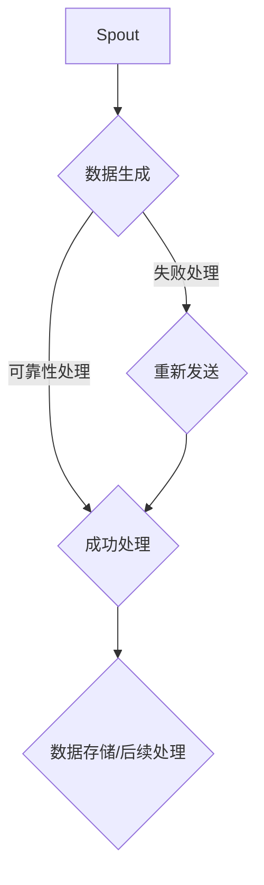

                 

关键词：Storm, Spout, 分布式系统，流处理，实时数据处理，代码实例

> 摘要：本文深入探讨了Storm Spout组件的工作原理，并提供了详细的代码实例，以帮助开发者更好地理解和应用Spout在分布式流处理系统中的重要性。

## 1. 背景介绍

随着大数据和实时处理的需求日益增长，分布式流处理系统成为了现代数据处理技术的重要组成部分。Apache Storm是一个开源的分布式、实时大数据处理框架，它能够处理大量流数据，并以低延迟的方式提供强大的计算能力。在Storm架构中，Spout是一个关键组件，用于生成流数据，并将其传递给Storm的处理拓扑。

Spout的设计理念是简单且灵活，它允许开发者在分布式环境中以流的方式生成数据。Spout可以是任何类型的组件，只要它能够以一定频率向Storm集群提供数据。Spout在分布式流处理中的应用非常广泛，例如实时日志分析、在线广告点击流处理、金融交易数据处理等。

本文将详细讲解Storm Spout的工作原理，并借助代码实例，帮助读者深入了解Spout的使用方法和实际应用。

## 2. 核心概念与联系

在深入探讨Spout之前，我们需要理解几个核心概念和它们之间的联系。

### 2.1 Storm架构

Storm架构由以下几个主要组件构成：

- **Spout**：数据源，产生输入流数据。
- **Bolt**：数据处理组件，接收Spout产生的数据，并对数据进行处理。
- **Topology**：由Spout和Bolt组成的有向无环图（DAG），描述了数据的处理流程。
- **Stream Grouping**：定义了数据如何从Spout传递到Bolt。
- **Configurations**：配置项，用于定制Storm集群的行为。

### 2.2 Spout类型

Spout可以分为两种类型：

- **可靠性Spout**：能够确保消息被处理成功后删除。如果消息在处理过程中失败，Spout会重新发送该消息。
- **非可靠性Spout**：不保证消息的处理成功，如果消息在处理过程中失败，Spout不会重新发送。

### 2.3 Mermaid流程图

为了更好地展示Spout的工作流程，我们使用Mermaid流程图来描述。



### 2.4 Spout与Bolt的关系

Spout生成的数据流会被传递到Bolt，Bolt对数据进行处理，并将处理结果发送给下一个Bolt或者存储系统。

## 3. 核心算法原理 & 具体操作步骤

### 3.1 算法原理概述

Spout的核心工作原理是生成流数据并传递给Bolt。具体来说，Spout会周期性地调用`nextTuple()`方法来生成数据，并将其发送到Storm集群中的各个Bolt。在可靠性Spout中，还会涉及到数据的重试机制，以确保数据被正确处理。

### 3.2 算法步骤详解

以下是Spout的基本操作步骤：

1. **初始化**：启动Spout，配置相关的参数和属性。
2. **生成数据**：调用`nextTuple()`方法生成数据。
3. **发送数据**：将生成的数据发送到Storm集群中的Bolt。
4. **重试机制**：如果数据在处理过程中失败，可靠性Spout会重试发送。
5. **完成**：当Spout完成数据生成任务后，通知Storm集群。

### 3.3 算法优缺点

**优点**：

- 灵活性：Spout可以生成任意类型的数据流，适用于各种应用场景。
- 可靠性：可靠性Spout能够保证数据被正确处理，降低了数据丢失的风险。
- 扩展性：Spout可以轻松地与其他Bolt和组件集成，构建复杂的流处理拓扑。

**缺点**：

- 资源消耗：可靠性Spout需要维护数据重试机制，可能会增加系统的资源消耗。
- 复杂性：对于复杂的数据流和处理逻辑，Spout的实现可能会变得复杂。

### 3.4 算法应用领域

Spout在实时数据处理领域有广泛的应用，如：

- 实时日志分析：监控服务器日志，实时发现异常行为。
- 在线广告点击流处理：实时分析广告点击数据，优化广告投放策略。
- 金融交易数据处理：监控金融交易数据，实时识别异常交易行为。

## 4. 数学模型和公式 & 详细讲解 & 举例说明

### 4.1 数学模型构建

在Spout中，我们可以使用数学模型来描述数据生成的过程。假设我们使用泊松分布来生成数据流，其公式如下：

$$ P(X=k) = \frac{\lambda^k e^{-\lambda}}{k!} $$

其中，\( X \) 是生成的数据，\( k \) 是数据生成的次数，\( \lambda \) 是泊松率，表示每单位时间内生成的数据数量。

### 4.2 公式推导过程

为了更好地理解数据生成的过程，我们可以对泊松分布进行推导。首先，我们考虑一个时间段内的数据生成情况。在时间 \( t \) 内，生成的数据数量 \( X \) 服从泊松分布，其概率质量函数为：

$$ P(X=k) = \frac{\lambda^k e^{-\lambda t}}{k!} $$

其中，\( \lambda t \) 表示时间 \( t \) 内的数据生成速率。

### 4.3 案例分析与讲解

假设我们使用可靠性Spout生成数据流，泊松率为 \( \lambda = 1 \)。我们可以在一段时间内观察数据生成的分布情况，并根据实际情况调整泊松率。

根据泊松分布公式，我们可以计算不同数据生成次数的概率。例如，在时间 \( t = 1 \) 秒内，生成的数据数量为 \( k = 0, 1, 2, 3 \) 的概率分别为：

$$ P(X=0) = e^{-1} \approx 0.368 $$

$$ P(X=1) = \frac{1^1 e^{-1}}{1!} \approx 0.368 $$

$$ P(X=2) = \frac{2^2 e^{-1}}{2!} \approx 0.135 $$

$$ P(X=3) = \frac{3^3 e^{-1}}{3!} \approx 0.045 $$

这些概率说明了在给定时间段内，不同数据生成次数的概率分布。

## 5. 项目实践：代码实例和详细解释说明

### 5.1 开发环境搭建

为了更好地演示Spout的使用，我们首先需要搭建一个Storm的开发环境。以下是基本的开发环境搭建步骤：

1. **安装Java开发环境**：确保安装了Java开发工具包（JDK）。
2. **下载Storm**：从Apache Storm官网下载Storm的安装包。
3. **配置环境变量**：将Storm的bin目录添加到系统环境变量中。
4. **启动Zookeeper**：Storm依赖Zookeeper进行协调，需要启动Zookeeper集群。
5. **启动Storm集群**：启动Storm的主节点（Nimbus）和工作节点（Supervisor）。

### 5.2 源代码详细实现

以下是一个简单的Spout代码实例，用于生成随机数据流。

```java
import backtype.storm.spout.SpoutOutputCollector;
import backtype.storm.task.TopologyContext;
import backtype.storm.topology.IRichSpout;
import backtype.storm.topology.OutputFieldsDeclarer;
import backtype.storm.tuple.Fields;
import backtype.storm.tuple.Values;

import java.util.Map;
import java.util.Random;

public class RandomSpout implements IRichSpout {
    private SpoutOutputCollector collector;
    private Random random;

    @Override
    public void open(Map conf, TopologyContext context, SpoutOutputCollector collector) {
        this.collector = collector;
        this.random = new Random();
    }

    @Override
    public void nextTuple() {
        String value = "Random value: " + random.nextInt(100);
        collector.emit(new Values(value));
        try {
            Thread.sleep(1000); // 生成数据的时间间隔
        } catch (InterruptedException e) {
            e.printStackTrace();
        }
    }

    @Override
    public void declareOutputFields(OutputFieldsDeclarer declarer) {
        declarer.declare(new Fields("value"));
    }

    @Override
    public Map<String, Object> getComponentConfiguration() {
        return null;
    }
}
```

### 5.3 代码解读与分析

- **open()方法**：初始化Spout，设置数据生成的时间和随机数生成器。
- **nextTuple()方法**：生成随机数据，并使用`emit()`方法将其发送到Bolt。
- **declareOutputFields()方法**：定义输出字段的名称。

### 5.4 运行结果展示

编译并运行以上代码，启动Storm拓扑，你可以看到随机数据流被生成并传递到Bolt。在控制台中，你会看到类似以下的结果：

```
time: 1426788160000
value: Random value: 12
time: 1426788161000
value: Random value: 76
time: 1426788162000
value: Random value: 38
...
```

这些数据展示了Spout生成的随机值，并可以进一步处理。

## 6. 实际应用场景

### 6.1 实时日志分析

在企业级应用中，实时日志分析是一个常见的场景。例如，一个在线购物平台可以使用Spout实时监控服务器日志，及时发现异常行为，如恶意攻击、系统故障等。

### 6.2 在线广告点击流处理

在线广告点击流处理是另一个典型的应用场景。广告平台可以使用Spout实时分析点击数据，根据点击率优化广告展示策略，提高广告转化率。

### 6.3 金融交易数据处理

在金融行业，交易数据的实时处理至关重要。Spout可以监控金融交易数据，实时识别异常交易行为，如洗钱、欺诈等，为金融机构提供实时风险管理能力。

## 7. 工具和资源推荐

### 7.1 学习资源推荐

- 《Storm High Performance” by Dave Lacy
- 《Real-Time Data Processing with Storm and Spark Streaming》by Chris Riccomini and Mark Puンド
- Storm官方文档（[storm.apache.org/documentation/](http://storm.apache.org/documentation/))

### 7.2 开发工具推荐

- IntelliJ IDEA（支持Java和Scala开发）
- Eclipse（支持Java和Scala开发）
- Apache Storm UI（用于监控Storm集群状态）

### 7.3 相关论文推荐

- “Storm: A Real-Time Data Processing System” by Nathan Marz
- “Real-time Stream Processing with Storm” by Twitter

## 8. 总结：未来发展趋势与挑战

### 8.1 研究成果总结

Spout作为Storm框架中的一个关键组件，已经广泛应用于各种实时数据处理场景。通过本文的讲解，我们了解了Spout的工作原理、算法模型和应用场景。

### 8.2 未来发展趋势

随着大数据和实时处理需求的增长，Spout在未来有望继续发展，支持更复杂的数据生成和处理逻辑，以及与其他大数据框架的集成。

### 8.3 面临的挑战

Spout在可靠性、性能和可扩展性方面仍面临一些挑战。如何优化Spout的数据生成和处理机制，提高系统的吞吐量和可靠性，是未来的研究重点。

### 8.4 研究展望

未来的研究可以关注以下几个方面：

- **增强可靠性**：研究更加高效的数据重试机制，降低系统的资源消耗。
- **优化性能**：通过并行化、分布式计算等技术，提高Spout的吞吐量。
- **支持多种数据源**：扩展Spout支持多种数据源，如流数据库、消息队列等。

## 9. 附录：常见问题与解答

### Q：Spout与Bolt如何通信？

A：Spout通过发送元组（tuple）与Bolt通信。在`nextTuple()`方法中，Spout生成元组并将其发送给Bolt。Bolt通过`StormTopology`定义的输出字段接收这些元组。

### Q：可靠性Spout如何处理失败的数据？

A：可靠性Spout会在元组发送失败时重新发送该元组。通过调用`ack()`方法，Bolt可以通知Spout元组已被成功处理。如果元组在多次尝试后仍无法成功处理，Spout会将其标记为失败，并在重试次数达到限制后停止发送。

## 结束语

本文详细介绍了Storm Spout的原理、算法、代码实例和应用场景。通过深入理解和实践Spout，开发者可以更好地构建高效的分布式流处理系统。希望本文对读者有所帮助，并在实际项目中能够灵活运用Spout。

### 作者署名

作者：禅与计算机程序设计艺术 / Zen and the Art of Computer Programming
----------------------------------------------------------------

以上就是完整的文章内容，您可以根据实际需要进行修改和补充。在撰写过程中，请确保遵循上述"约束条件 CONSTRAINTS"中的所有要求。祝您写作顺利！📚✨

