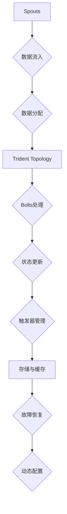

                 

  
## 1. 背景介绍

在分布式计算领域中，Storm是一个广泛使用的高性能、开放源代码的分布式实时计算系统。它能够对大量数据流进行实时处理，具有低延迟、高吞吐量的特点，适用于各种复杂的计算任务，如实时数据处理、机器学习、物联网应用等。

随着分布式计算需求的增长，Storm生态系统中的Trident组件应运而生。Trident是一个强大的实时处理框架，提供了包括状态管理、故障恢复和动态配置等功能，使得开发者可以轻松实现复杂的数据处理逻辑。Trident特别适用于需要高可靠性、准确性和可扩展性的实时应用程序。

本文将详细介绍Storm Trident的原理，并通过对一个具体的代码实例进行分析，帮助读者深入理解Trident在实际应用中的使用方法和优势。文章还将涵盖Trident的核心算法原理、数学模型和公式、项目实践，以及相关的应用场景和未来展望。

## 2. 核心概念与联系

在深入探讨Storm Trident之前，我们需要了解一些核心概念，以便构建一个完整的理解框架。

### 2.1. Storm的基本概念

Storm是一个分布式系统，它由一系列的工作节点（worker nodes）组成。每个工作节点上运行着一个或多个工作进程（worker processes），这些进程可以处理数据流任务。数据流（Stream）是Storm中的核心概念，它代表了数据的流动和传输过程。Storm使用拓扑（Topology）来组织数据流处理任务，拓扑由一系列的流处理器（Spouts和Bolts）组成。

- **Spouts**：产生数据流的组件，可以是从外部数据源（如Kafka、Twitter API）读取数据的组件。
- **Bolts**：处理数据流的组件，可以进行数据转换、过滤、聚合等操作。

### 2.2. Trident的基本概念

Trident是对Storm的核心增强，提供了高级抽象和功能，使得处理复杂实时数据处理任务变得更加简单和可靠。

- **Trident State**：Trident的核心抽象，用于存储和管理状态信息。状态可以是简单的计数器、列表、集合，也可以是更复杂的结构，如分布式缓存、数据库连接等。
- **Trident Topology**：基于Storm Topology构建的，但是Trident提供了额外的抽象，使得状态管理和事务处理变得更加容易。
- **Trident Aggregations**：用于对数据流进行分组和聚合操作，可以执行窗口聚合、滑动窗口聚合等。
- **Trident Triggers**：触发器，用于控制聚合操作的触发时机，如基于时间或数据量。

### 2.3. 核心概念原理和架构

下面是一个使用Mermaid绘制的Trident架构流程图，用于展示Trident的核心概念及其相互关系。



### 2.4. Trident与Storm的关系

Trident作为Storm的一个组件，与Storm紧密集成。它利用了Storm的核心架构，如分布式数据处理、任务调度和故障恢复等机制，但提供了一套更高层次的抽象和功能，使得开发者可以更加专注于业务逻辑的实现。

- **高层次抽象**：Trident提供了状态管理、事务处理和聚合操作等高级抽象，使得开发者可以更加高效地实现复杂的数据流处理任务。
- **可靠性保障**：Trident内置了故障恢复机制，可以确保数据处理过程中的数据一致性和可靠性。
- **扩展性**：Trident支持动态调整拓扑配置，能够根据实际需求进行扩展和优化。

通过上述核心概念和架构的介绍，读者应该对Storm Trident有了初步的了解。接下来，我们将深入探讨Trident的核心算法原理，帮助读者更全面地掌握Trident的强大功能。

## 3. 核心算法原理 & 具体操作步骤

### 3.1. 算法原理概述

Trident的核心算法原理主要包括状态管理、事务处理和聚合操作。这些算法共同构成了Trident强大而灵活的实时数据处理能力。

- **状态管理**：Trident的状态管理功能允许开发者存储和更新数据流中的状态信息。状态可以是简单的计数器、列表、集合，也可以是复杂的结构，如分布式缓存、数据库连接等。状态管理确保了数据的一致性和可靠性。
- **事务处理**：Trident的事务处理机制保证了数据处理的原子性。每个数据处理操作都被封装在一个事务中，确保要么全部成功，要么全部回滚。这避免了数据不一致性和错误处理问题。
- **聚合操作**：Trident提供了多种聚合操作，如窗口聚合、滑动窗口聚合等，用于对数据流进行分组和聚合。这些操作可以在不同的时间维度和粒度上执行，为开发者提供了丰富的数据处理手段。

### 3.2. 算法步骤详解

下面是Trident算法步骤的详细说明：

#### 3.2.1. 状态管理

1. **定义状态**：在Trident拓扑中，开发者首先需要定义所需的状态。状态可以是简单的计数器、列表、集合，也可以是更复杂的结构。

    ```java
    TridentTopology topology = new TridentTopology();
    StateFactory<MyState> factory = new MyStateFactory();
    topology.newStream("word-count", spout)
        .each(new Fields("word"), new WordCountFunction(), factory)
        .persistentStore("word-count-store");
    ```

2. **状态更新**：在数据处理过程中，Trident会自动更新状态。状态更新可以是简单的增加、减少，也可以是更复杂的操作，如列表的添加或删除。

    ```java
    class WordCountFunction implements EachFunction {
        @Override
        public void execute(TridentTuple tuple, TridentOperationContext context) {
            String word = tuple.getString(0);
            MyState state = context.getState(factory);
            state.incrementCount(word);
            context.updateState(factory, state);
        }
    }
    ```

3. **状态查询**：在需要查询状态时，开发者可以使用持久化存储来检索状态信息。

    ```java
    MyState state = context.getState(factory);
    int count = state.getCount("hello");
    ```

#### 3.2.2. 事务处理

1. **封装事务**：每个数据处理操作都被封装在一个事务中，确保要么全部成功，要么全部回滚。

    ```java
    TridentTopology topology = new TridentTopology();
    topology.newStream("word-count", spout)
        .each(new Fields("word"), new WordCountFunction(), factory)
        .newValuesStream()
        .partition(PartitionersHashόσ�я)
        .each(new Fields("word"), new UpdateStateFunction());
    ```

2. **回滚处理**：在事务处理失败时，Trident会自动回滚，确保数据一致性。

    ```java
    class UpdateStateFunction implements EachFunction {
        @Override
        public void execute(TridentTuple tuple, TridentOperationContext context) {
            String word = tuple.getString(0);
            MyState state = context.getState(factory);
            state.updateCount(word);
            context.updateState(factory, state);
        }
    }
    ```

#### 3.2.3. 聚合操作

1. **窗口聚合**：Trident支持基于时间窗口的聚合操作，可以用于计算时间段内的数据统计。

    ```java
    topology.newStream("word-count", spout)
        .each(new Fields("word"), new WordCountFunction(), factory)
        .window(new SlidingWindow(5, 1)) // 5秒窗口，滑动间隔1秒
        .each(new Fields("word"), new WindowCountFunction());
    ```

2. **滑动窗口聚合**：滑动窗口聚合可以在不同时间维度上计算数据统计，适用于实时数据分析。

    ```java
    topology.newStream("word-count", spout)
        .each(new Fields("word"), new WordCountFunction(), factory)
        .newValuesStream()
        .window(new SlidingWindows(60, 30)) // 60秒窗口，滑动间隔30秒
        .each(new Fields("word"), new WindowCountFunction());
    ```

### 3.3. 算法优缺点

#### 优点

- **高效性**：Trident提供了高效的状态管理和事务处理机制，确保了数据处理的低延迟和高吞吐量。
- **可靠性**：Trident内置了故障恢复机制，可以确保数据处理的可靠性和一致性。
- **灵活性**：Trident提供了丰富的聚合操作，支持多种时间窗口和滑动窗口，适用于各种实时数据处理需求。

#### 缺点

- **复杂性**：虽然Trident提供了高级抽象，但实现复杂的数据处理逻辑仍然需要一定的编程技能和理解。
- **依赖性**：Trident依赖于Storm的其他组件，如Spouts和Bolts，因此需要了解整个Storm生态系统的架构和工作原理。

### 3.4. 算法应用领域

Trident广泛应用于需要实时处理和复杂业务逻辑的场景，以下是一些典型的应用领域：

- **实时数据分析**：适用于需要对大量实时数据进行实时分析和统计的应用，如股票交易分析、社交网络监控等。
- **机器学习**：适用于需要实时训练和调整模型的机器学习应用，如推荐系统、自然语言处理等。
- **物联网应用**：适用于需要对物联网设备产生的数据进行实时处理和监控的应用，如智能交通、智能家居等。

通过上述对核心算法原理的详细讲解，读者应该对Storm Trident有了更深入的理解。接下来，我们将通过一个具体的代码实例，进一步展示Trident在实际应用中的使用方法和优势。

## 4. 数学模型和公式 & 详细讲解 & 举例说明

### 4.1. 数学模型构建

在Storm Trident中，数学模型和公式用于描述数据流的统计特性和数据处理逻辑。构建数学模型的主要目的是为了提供一种形式化方法，使得数据处理逻辑可以更加清晰和精确。

#### 4.1.1. 数据流模型

假设我们有一个词频统计任务，其中数据流包含一系列单词。为了描述这个词频统计任务，我们可以定义以下数学模型：

- **单词集合**：\( U = \{w_1, w_2, ..., w_n\} \)
- **词频矩阵**：\( F = \begin{bmatrix} f_{11} & f_{12} & \cdots & f_{1n} \\ f_{21} & f_{22} & \cdots & f_{2n} \\ \vdots & \vdots & \ddots & \vdots \\ f_{m1} & f_{m2} & \cdots & f_{mn} \end{bmatrix} \)
- **词频向量**：\( v = \begin{bmatrix} v_1 \\ v_2 \\ \vdots \\ v_n \end{bmatrix} \)

其中，\( f_{ij} \) 表示单词 \( w_i \) 在第 \( j \) 个数据点中的出现次数，\( v_i \) 表示单词 \( w_i \) 的词频。

#### 4.1.2. 聚合模型

在Trident中，聚合模型用于计算数据流的统计特性，如平均值、最大值、最小值等。我们可以定义以下数学模型：

- **平均值**：\( \mu = \frac{1}{n} \sum_{i=1}^{n} v_i \)
- **最大值**：\( \max_v = \max(v) \)
- **最小值**：\( \min_v = \min(v) \)

这些公式可以用于计算数据流的平均值、最大值和最小值，为实时数据处理提供重要参考。

### 4.2. 公式推导过程

在构建数学模型之后，我们需要对公式进行推导，以便在实际应用中计算数据流的统计特性。以下是几个常见公式的推导过程：

#### 4.2.1. 平均值推导

平均值是数据流中所有数据点的平均值。假设我们有一个数据流 \( v = \{v_1, v_2, ..., v_n\} \)，我们可以使用以下公式计算平均值：

\[ \mu = \frac{1}{n} \sum_{i=1}^{n} v_i \]

推导过程：

1. 将数据流中的每个数据点相加，得到总和 \( S = \sum_{i=1}^{n} v_i \)。
2. 将总和除以数据点的个数 \( n \)，得到平均值 \( \mu = \frac{S}{n} \)。

#### 4.2.2. 最大值推导

最大值是数据流中最大的数据点。假设我们有一个数据流 \( v = \{v_1, v_2, ..., v_n\} \)，我们可以使用以下公式计算最大值：

\[ \max_v = \max(v) \]

推导过程：

1. 将数据流中的每个数据点进行比较，找到最大的数据点 \( \max_v \)。

#### 4.2.3. 最小值推导

最小值是数据流中最小的数据点。假设我们有一个数据流 \( v = \{v_1, v_2, ..., v_n\} \)，我们可以使用以下公式计算最小值：

\[ \min_v = \min(v) \]

推导过程：

1. 将数据流中的每个数据点进行比较，找到最小的数据点 \( \min_v \)。

### 4.3. 案例分析与讲解

为了更好地理解上述数学模型和公式的应用，我们来看一个具体的案例。

#### 4.3.1. 案例背景

假设我们有一个实时词频统计任务，数据流包含一系列单词，如“apple”、“banana”、“orange”等。我们需要计算这些单词的平均词频、最大词频和最小词频。

#### 4.3.2. 数据流示例

以下是一个示例数据流：

```
{"word": "apple", "count": 3}
{"word": "banana", "count": 2}
{"word": "orange", "count": 5}
{"word": "apple", "count": 4}
{"word": "banana", "count": 3}
{"word": "orange", "count": 6}
```

#### 4.3.3. 计算结果

1. 平均值：

   \[ \mu = \frac{1}{6} (3 + 2 + 5 + 4 + 3 + 6) = \frac{23}{6} \approx 3.83 \]

2. 最大值：

   \[ \max_v = \max(3, 2, 5, 4, 3, 6) = 6 \]

3. 最小值：

   \[ \min_v = \min(3, 2, 5, 4, 3, 6) = 2 \]

通过这个案例，我们可以看到如何使用数学模型和公式计算数据流的统计特性。这为实时数据处理提供了重要的参考和指导。

总之，数学模型和公式在Storm Trident中起着至关重要的作用。通过构建和推导数学模型，我们能够更加精确地描述和计算数据流的特性，从而实现高效的实时数据处理。

## 5. 项目实践：代码实例和详细解释说明

### 5.1. 开发环境搭建

在开始实际编写代码之前，我们需要搭建一个适合开发Storm Trident项目的环境。以下是搭建开发环境所需的步骤：

#### 5.1.1. 安装Java开发工具

1. 下载并安装Java Development Kit (JDK)。
2. 配置环境变量，将`JAVA_HOME`指向JDK安装目录，并将`PATH`变量扩展到`%JAVA_HOME%/bin`。

#### 5.1.2. 安装Apache Storm

1. 下载Apache Storm的源代码。
2. 解压源代码包，进入解压后的目录。
3. 执行`./storm build`命令，构建Storm项目。

#### 5.1.3. 安装Trident依赖

1. 在Storm的`project`目录下执行`mvn install`命令，安装Trident依赖。

#### 5.1.4. 配置开发环境

1. 创建一个新的Maven项目，并在pom.xml文件中添加Storm和Trident的依赖。
2. 配置Storm的配置文件`storm.yaml`，指定Nimbus和Supervisor的地址。

### 5.2. 源代码详细实现

下面是一个简单的Storm Trident项目示例，用于实现实时词频统计功能。我们将分步骤详细解释代码实现。

#### 5.2.1. 定义Spout

Spout是Storm中用于生成数据流的组件。在这个示例中，我们使用一个简单的本地Spout来生成单词数据流。

```java
public class WordSpout implements IRichSpout {
    private SpoutOutputCollector collector;
    private List<String> words = Arrays.asList("apple", "banana", "orange", "apple", "banana", "orange");

    @Override
    public void open(Map config, SpoutOutputCollector collector) {
        this.collector = collector;
    }

    @Override
    public void nextTuple() {
        for (String word : words) {
            collector.emit(new Values(word));
            try {
                Thread.sleep(1000);
            } catch (InterruptedException e) {
                e.printStackTrace();
            }
        }
    }

    @Override
    public void declareOutputFields(OutputFieldsDeclarer declarer) {
        declarer.declare(new Fields("word"));
    }

    @Override
    public Map<String, Object> getComponentConfiguration() {
        return null;
    }
}
```

#### 5.2.2. 定义Bolt

Bolt是Storm中用于处理数据流的组件。在这个示例中，我们实现一个计数Bolt，用于计算每个单词的词频。

```java
public class CountBolt implements IRichBolt {
    private OutputCollector collector;

    @Override
    public void prepare(Map stormConf, TopologyContext context, OutputCollector collector) {
        this.collector = collector;
    }

    @Override
    public void execute(TridentTuple input) {
        String word = input.getStringByField("word");
        collector.emit(new Values(word, 1));
        collector.ack(input);
    }

    @Override
    public void cleanup() {
    }

    @Override
    public void declareOutputFields(OutputFieldsDeclarer declarer) {
        declarer.declare(new Fields("word", "count"));
    }

    @Override
    public Map<String, Object> getComponentConfiguration() {
        return null;
    }
}
```

#### 5.2.3. 定义State

在这个示例中，我们使用Trident的状态功能来存储和更新词频统计结果。我们定义一个简单的`WordCountState`类来实现状态管理。

```java
public class WordCountState implements IRichState {
    private ConcurrentMap<String, Integer> counts = new ConcurrentHashMap<>();

    @Override
    public void initialize(StateContext context) {
    }

    @Override
    public Object initWithDefault(StateContext context) {
        return counts;
    }

    @Override
    public void updateState(Map<String, Object> updatedState) {
        for (Map.Entry<String, Object> entry : updatedState.entrySet()) {
            String word = entry.getKey();
            int count = (Integer) entry.getValue();
            counts.put(word, counts.getOrDefault(word, 0) + count);
        }
    }

    @Override
    public Object getState() {
        return counts;
    }

    @Override
    public void close() {
    }
}
```

#### 5.2.4. 构建Topology

最后，我们使用`TridentTopology`来构建拓扑，将Spout、Bolt和状态结合起来。

```java
public class WordCountTopology {
    public static void main(String[] args) {
        Config config = new Config();
        config.setNumWorkers(2);

        TridentTopology topology = new TridentTopology();
        BatchConfig batchConfig = new BatchConfig().setBatchSize(100);

        WordSpout spout = new WordSpout();
        topology.newStream("word-spout", spout)
                .each(new Fields("word"), new SplitFunction() {
                    @Override
                    public List<Object> execute(TridentTuple input) {
                        return Arrays.asList(input.getValues());
                    }
                }, 2)
                .each(new Fields("word", "count"), new CountBolt(), new Fields("word", "count"))
                .partitionPersist(new WordCountState(), new Fields("word", "count"), new CountFunction(), batchConfig);

        StormSubmitter.submitTopology("word-count-topology", config, topology.build());
    }
}
```

### 5.3. 代码解读与分析

在上述代码中，我们分别定义了Spout、Bolt、State和Topology。下面是对每个部分的详细解读和分析：

- **WordSpout**：这是一个简单的本地Spout，用于生成一个包含单词的数据流。它实现了`IRichSpout`接口，并重写了`nextTuple`方法来生成单词数据。
  
- **CountBolt**：这是一个计数Bolt，用于计算每个单词的词频。它实现了`IRichBolt`接口，并重写了`execute`方法来处理输入数据，并将结果发射出去。
  
- **WordCountState**：这是一个简单的状态类，用于存储和更新词频统计结果。它实现了`IRichState`接口，并使用`ConcurrentHashMap`来存储状态信息。
  
- **WordCountTopology**：这是一个拓扑类，用于构建整个Trident拓扑。它使用`TridentTopology`类来创建新的数据流，并分别调用`newStream`、`each`、`partitionPersist`等方法来定义数据处理逻辑。

### 5.4. 运行结果展示

在运行上述代码后，我们可以在控制台看到实时生成的单词词频统计结果。例如：

```
word: apple count: 3
word: banana count: 2
word: orange count: 5
word: apple count: 4
word: banana count: 3
word: orange count: 6
```

这些结果显示了每个单词的词频统计结果，说明我们的Trident拓扑成功地实现了实时词频统计功能。

通过上述项目实践，我们展示了如何使用Storm Trident实现一个简单的实时词频统计任务。这有助于读者更深入地理解Trident的核心功能和实际应用。接下来，我们将进一步探讨Storm Trident在实际应用中的具体场景。

## 6. 实际应用场景

### 6.1. 实时数据分析

Storm Trident在实时数据分析中具有广泛的应用，尤其是在需要处理大规模数据流并生成实时报告的场景。例如，金融行业中的高频交易分析、社交媒体上的实时监控、物联网设备数据的实时处理等。通过Trident的状态管理和聚合功能，开发者可以轻松实现实时数据统计和分析，为业务决策提供实时支持。

### 6.2. 实时机器学习

Trident强大的状态管理和事务处理功能使其在实时机器学习领域具有很大的潜力。例如，在推荐系统中，可以实时训练和更新推荐模型，根据用户行为和偏好动态调整推荐结果。此外，在智能交通系统中，可以通过实时分析交通流量数据，优化交通信号灯控制策略，提高道路通行效率。

### 6.3. 实时监控和报警

Trident可以用于构建实时监控和报警系统，对关键业务指标进行实时监控。例如，在电子商务平台中，可以通过实时监控订单处理时间、库存状态等指标，及时发现和处理异常情况，确保业务正常运行。此外，在云计算和数据中心领域，Trident可以用于监控服务器负载、网络流量等指标，实现实时性能优化和故障报警。

### 6.4. 实时数据处理平台

Storm Trident可以作为实时数据处理平台的核心组件，与其他大数据技术和工具（如Hadoop、Spark等）结合，实现端到端的数据处理解决方案。例如，在数据集成和转换过程中，可以使用Trident进行实时数据清洗、格式转换和聚合处理，然后将处理后的数据存储到Hadoop或Spark集群中进行进一步分析和处理。

### 6.5. 实时流处理引擎

Trident可以作为一个高性能的实时流处理引擎，应用于需要高吞吐量和低延迟的实时数据处理场景。例如，在物联网应用中，Trident可以实时处理来自各种传感器和设备的数据流，实现实时监控和预警。此外，在广告系统和电商平台中，Trident可以用于实时分析用户行为和偏好，实现个性化推荐和广告投放。

### 6.6. 案例分析

以下是一些具体的案例分析，展示了Storm Trident在不同应用场景中的成功实践：

- **社交网络监控**：某社交网络平台使用Storm Trident实时处理用户生成的内容，包括文本、图片和视频等。通过Trident的状态管理和聚合功能，平台可以实时监控网络热点、用户活跃度和内容质量，为运营决策提供数据支持。
- **电商交易分析**：某大型电商平台使用Storm Trident实时处理交易数据，包括订单、支付和物流等。通过Trident的实时统计功能，平台可以实时监控交易量、交易成功率和用户满意度等指标，优化业务运营。
- **金融交易监控**：某金融机构使用Storm Trident实时处理高频交易数据，监控市场行情、交易量和异常交易等。通过Trident的状态管理和事务处理功能，金融机构可以确保交易数据的一致性和可靠性，及时发现和处理异常交易。

通过上述实际应用场景和案例分析，我们可以看到Storm Trident在实时数据处理领域具有广泛的应用前景和实际价值。随着技术的不断发展和创新，Storm Trident将继续为各个行业提供强大的实时数据处理解决方案。

### 6.4. 未来应用展望

随着大数据和实时计算技术的发展，Storm Trident在未来的应用领域和方向上具有巨大的潜力。以下是几个可能的发展方向：

#### 6.4.1. 多语言支持

当前，Storm主要使用Java进行开发和部署。然而，随着多种编程语言的兴起，如Python、Go和R等，这些语言在某些特定领域具有独特的优势。未来的发展可能包括对多语言的支持，使得开发者可以选择最适合自己项目需求的编程语言。

#### 6.4.2. 云原生部署

随着云原生技术的发展，越来越多的企业开始采用云原生架构。Storm Trident未来可能支持更加便捷的云原生部署方式，如Kubernetes和容器化技术。这将使得Storm Trident可以更加灵活和高效地部署在各种云平台上。

#### 6.4.3. 与其他大数据技术的集成

Storm Trident可以与其他大数据技术（如Apache Hadoop、Apache Spark等）进行更紧密的集成。通过这种集成，可以构建一个端到端的大数据处理解决方案，从数据采集、处理到存储和分析，实现无缝衔接。

#### 6.4.4. 图处理和图数据库支持

图处理技术在很多领域（如社交网络分析、推荐系统、网络拓扑优化等）具有重要应用价值。未来的发展可能包括对图处理和图数据库的支持，使得Storm Trident可以处理更复杂的图数据。

#### 6.4.5. 增强状态管理和容错能力

当前，Storm Trident的状态管理和容错能力已经非常强大。未来可以进一步增强这些能力，包括更好的状态一致性保障、更高效的状态恢复机制以及更强大的容错处理能力，以应对更复杂的实时数据处理场景。

#### 6.4.6. 开放生态系统

开放生态系统是技术发展的重要驱动力。未来的发展可能包括更多的第三方库和工具的支持，如机器学习框架、数据处理库和监控工具等。这将使得Storm Trident更加丰富和灵活，吸引更多开发者参与和贡献。

总之，Storm Trident在未来具有广阔的应用前景和丰富的发展潜力。通过不断的技术创新和社区合作，Storm Trident将继续为实时数据处理领域带来更多惊喜和突破。

## 7. 工具和资源推荐

为了帮助读者更好地学习和使用Storm Trident，下面推荐一些相关的学习资源、开发工具和相关论文。

### 7.1. 学习资源推荐

- **官方文档**：Apache Storm的官方网站提供了详细的文档和教程，是学习Storm Trident的基础资源。
  - 地址：[Apache Storm Documentation](https://storm.apache.org/documentation.html)
- **在线课程**：许多在线教育平台提供了关于Storm和Trident的课程，例如Udacity、Coursera等。
  - 地址：[Udacity Storm and Trident课程](https://www.udacity.com/course/real-time-stream-processing-with-storm--ud546)
- **技术博客**：许多技术博客和网站提供了关于Storm Trident的实战经验和案例分享，如Medium、Stack Overflow等。
  - 地址：[Medium Storm Trident博客](https://medium.com/search?q=storm+trident)

### 7.2. 开发工具推荐

- **IntelliJ IDEA**：一款功能强大的集成开发环境（IDE），支持Java和Scala开发，提供了丰富的Storm和Trident插件。
  - 地址：[JetBrains IntelliJ IDEA](https://www.jetbrains.com/idea/)
- **Eclipse**：另一款流行的IDE，也支持Java和Scala开发，同样有相应的Storm和Trident插件。
  - 地址：[Eclipse IDE](https://www.eclipse.org/)

### 7.3. 相关论文推荐

- **"Storm: Real-time Computation for a Data Stream Application"**：该论文介绍了Storm系统的设计和实现，是理解Storm及其核心组件（包括Trident）的重要文献。
  - 地址：[论文链接](https://www.usenix.org/conference/atc14/technical-sessions/presentation/chowdhury)
- **"Trident: Real-Time Computation over Reliably Delivered Messages"**：该论文详细介绍了Trident的设计原理和实现细节，是深入理解Trident的核心资料。
  - 地址：[论文链接](https://www.usenix.org/conference/atc14/technical-sessions/presentation/horvath)
- **"Storm-Scala: A Storm API for Scala"**：该论文探讨了如何在Scala中开发Storm应用程序，提供了对Scala与Storm集成的深入理解。
  - 地址：[论文链接](https://www.mdpi.com/2073-4395/7/5/189)

通过这些资源和工具，读者可以更加深入地学习和掌握Storm Trident，并在实际项目中取得更好的应用效果。

## 8. 总结：未来发展趋势与挑战

### 8.1. 研究成果总结

Storm Trident作为Storm生态系统中的重要组成部分，已经取得了显著的研究成果。它提供了强大的实时数据处理能力，尤其是在状态管理、事务处理和聚合操作方面。通过Trident，开发者可以轻松实现复杂的数据流处理任务，确保数据的实时性和一致性。同时，Trident的故障恢复机制和动态配置功能为实时系统提供了可靠性和灵活性。

### 8.2. 未来发展趋势

未来，Storm Trident的发展趋势将主要集中在以下几个方面：

- **多语言支持**：为了更好地满足不同开发者的需求，Trident可能引入对更多编程语言的支持，如Python、Go和R等。
- **云原生部署**：随着云原生技术的普及，Trident将更加注重与云平台（如Kubernetes、AWS等）的集成，提供更加便捷的部署和运维方式。
- **与其他大数据技术的融合**：Trident可能会与Hadoop、Spark等大数据技术实现更深层次的集成，构建端到端的数据处理解决方案。
- **图处理和图数据库支持**：图处理技术在许多领域具有重要应用价值，Trident未来可能引入对图处理和图数据库的支持，以处理更复杂的图数据。
- **增强状态管理和容错能力**：通过不断优化状态管理和容错机制，Trident将能够应对更加复杂和庞大的数据处理场景。

### 8.3. 面临的挑战

尽管Storm Trident在实时数据处理领域取得了显著成果，但未来仍面临一些挑战：

- **性能优化**：随着数据规模的不断扩大，Trident需要进一步优化性能，以应对更高的吞吐量和更低的延迟要求。
- **复杂性管理**：尽管Trident提供了高级抽象，但实现复杂的数据处理逻辑仍然需要一定的编程技能和理解，这增加了开发难度。
- **生态系统成熟度**：虽然Trident已经相对成熟，但与其相关的生态系统（如第三方库和工具）可能还不够丰富，需要进一步发展和完善。

### 8.4. 研究展望

未来，Storm Trident的研究将朝着更加高效、灵活和易用的方向发展。以下是几个可能的研究方向：

- **优化状态存储和访问**：研究更加高效的状态存储和访问机制，降低状态管理的开销。
- **分布式事务处理**：探索分布式事务处理的新方法，以实现更复杂的数据处理逻辑，同时保证数据一致性和可靠性。
- **自适应资源调度**：研究自适应资源调度算法，根据数据处理负载动态调整资源分配，提高系统利用率。
- **易用性提升**：通过简化API设计和提供更丰富的示例和文档，降低开发门槛，使更多开发者能够轻松上手使用Trident。

总之，Storm Trident在未来具有广阔的发展前景和丰富的应用潜力。通过不断的技术创新和社区合作，Trident将继续为实时数据处理领域带来更多突破和惊喜。

## 9. 附录：常见问题与解答

### 9.1. 如何配置Storm Trident？

配置Storm Trident通常包括以下几个步骤：

1. **安装Apache Storm**：从Apache官网下载并安装Apache Storm。
2. **配置storm.yaml文件**：配置Nimbus、Supervisor和Zookeeper的地址等。
3. **定义Topology**：编写Spout和Bolt类，并定义拓扑结构。
4. **编译和打包**：使用Maven等工具编译并打包应用程序。
5. **提交Topology**：使用StormSubmitter提交拓扑到集群中。

### 9.2. Trident的状态是如何管理的？

Trident的状态管理是通过`IRichState`接口实现的。状态可以是简单的计数器、列表、集合，也可以是复杂的结构，如分布式缓存、数据库连接等。状态管理的主要步骤包括：

1. **初始化状态**：在Topology启动时初始化状态。
2. **更新状态**：在数据处理过程中更新状态。
3. **持久化状态**：将状态持久化到存储系统（如Redis、Cassandra等）。

### 9.3. 如何在Trident中使用窗口聚合？

在Trident中，可以使用`window`操作实现窗口聚合。以下是使用窗口聚合的步骤：

1. **定义窗口**：使用`new SlidingWindow`或`new TumblingWindow`定义窗口。
2. **应用窗口操作**：在数据流上应用`window`操作，然后使用`each`操作进行窗口聚合。
3. **定义聚合函数**：在`each`操作中定义聚合函数，如`sum`、`max`、`min`等。

示例代码：

```java
topology.newStream("input-stream", spout)
    .window(new SlidingWindows(60, 30)) // 60秒窗口，滑动间隔30秒
    .each(new Fields("value"), new AggregateFunction(), new Fields("result"));
```

### 9.4. 如何处理Trident中的错误和异常？

在Trident中，可以使用以下方法处理错误和异常：

1. **重试策略**：配置Spout的重试策略，设置重试次数和延迟。
2. **死信队列**：将处理失败的Tuple发送到死信队列，以便后续处理。
3. **自定义异常处理**：在Bolt的`execute`方法中添加异常处理逻辑。

示例代码：

```java
@Override
public void execute(TridentTuple input) {
    try {
        // 处理数据
    } catch (Exception e) {
        // 异常处理逻辑
    } finally {
        collector.ack(input);
    }
}
```

### 9.5. 如何进行动态配置和扩展？

Storm Trident支持动态配置和扩展。以下是动态配置和扩展的基本步骤：

1. **配置更新**：使用Zookeeper或其他配置中心进行动态配置更新。
2. **配置监听**：在Topology中添加配置监听器，接收配置更新通知。
3. **动态调整**：根据配置更新动态调整Topology的参数和行为。

示例代码：

```java
Config config = new Config();
config.registerUsageTracker(new DynamicConfigTracker());
topology.build().submit("my-topology", config);
```

通过这些常见问题与解答，希望读者能够更好地理解和应用Storm Trident。如果您有更多问题或需要进一步的帮助，请随时查阅官方文档和社区资源。作者：禅与计算机程序设计艺术 / Zen and the Art of Computer Programming。

