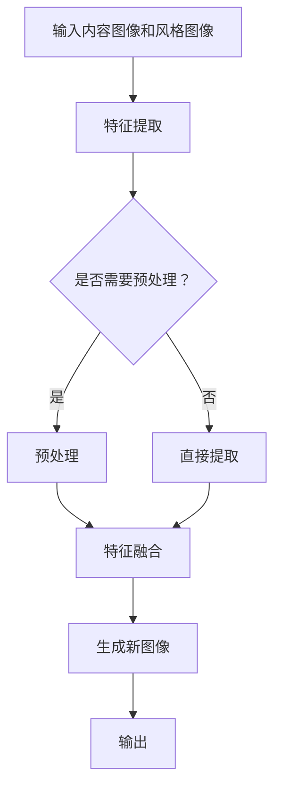

                 

关键词：Style Transfer、深度学习、图像处理、神经网络、风格迁移、艺术创作、Python实现

> 摘要：本文将深入探讨风格迁移（Style Transfer）的原理和实现，通过具体的代码实例，帮助读者了解如何在图像中注入艺术风格，为艺术创作提供新的工具和思路。

## 1. 背景介绍

风格迁移（Style Transfer）是一种通过机器学习技术将一种艺术风格应用到另一幅图像上的技术。这一概念最早由GAN（生成对抗网络）的提出者Ian Goodfellow提出。风格迁移的出现为图像处理和艺术创作带来了新的可能性，使得普通用户也能够创作出具有专业水平的艺术作品。

随着深度学习技术的不断发展，风格迁移技术也取得了显著的进步。基于神经网络的风格迁移方法已经成为当前研究的热点，其中包括VGG模型、Inception模型等。这些模型能够有效地提取图像的特征，并将这些特征与艺术风格相结合，生成具有独特风格的新图像。

## 2. 核心概念与联系

### 2.1. 风格迁移的基本概念

风格迁移的核心在于将两幅图像（内容图像和风格图像）相结合，生成一幅既保留了内容图像主体，又具有风格图像特点的新图像。这个过程可以抽象为以下数学模型：

\[ x' = G(x, s) \]

其中，\( x \) 代表内容图像，\( s \) 代表风格图像，\( G \) 是一个生成模型，用于生成具有风格 \( s \) 的内容图像 \( x' \)。

### 2.2. 神经网络与风格迁移

神经网络是风格迁移的核心工具。通过训练，神经网络可以学习到如何从内容图像和风格图像中提取特征，并将这些特征结合起来。常见的神经网络结构包括卷积神经网络（CNN）和循环神经网络（RNN）。

### 2.3. Mermaid 流程图

下面是一个简单的Mermaid流程图，展示了风格迁移的基本流程：



## 3. 核心算法原理 & 具体操作步骤

### 3.1. 算法原理概述

风格迁移的算法原理可以分为两个主要部分：特征提取和特征融合。

1. **特征提取**：使用卷积神经网络从内容图像和风格图像中提取特征。这些特征包括纹理、颜色和形状等。

2. **特征融合**：将内容图像和风格图像的特征进行融合，生成新的图像。这个过程通常通过一个生成模型来实现，如GAN。

### 3.2. 算法步骤详解

1. **步骤1：数据预处理**  
   - **内容图像**：对图像进行归一化处理，使其具有统一的尺度。
   - **风格图像**：对图像进行调整，使其具有合适的尺寸和通道数。

2. **步骤2：特征提取**  
   - 使用卷积神经网络从内容图像和风格图像中提取特征。

3. **步骤3：特征融合**  
   - 将内容图像和风格图像的特征进行融合，生成新的图像。

4. **步骤4：生成新图像**  
   - 使用生成模型生成具有风格 \( s \) 的内容图像 \( x' \)。

### 3.3. 算法优缺点

**优点**：
- **灵活性**：可以针对不同的风格图像和内容图像进行灵活调整。
- **效果显著**：能够生成高质量的具有艺术风格的图像。

**缺点**：
- **计算复杂度**：需要大量的计算资源。
- **训练时间较长**：生成模型需要较长的训练时间。

### 3.4. 算法应用领域

风格迁移技术可以应用于多个领域，包括但不限于：
- **艺术创作**：为艺术家提供新的创作工具，提高创作效率。
- **图像增强**：改善图像质量，增强图像的视觉效果。
- **图像修复**：修复受损或老化的图像。

## 4. 数学模型和公式 & 详细讲解 & 举例说明

### 4.1. 数学模型构建

风格迁移的数学模型可以抽象为以下形式：

\[ x' = G(x, s) \]

其中，\( x \) 代表内容图像，\( s \) 代表风格图像，\( G \) 是一个生成模型，用于生成具有风格 \( s \) 的内容图像 \( x' \)。

### 4.2. 公式推导过程

风格迁移的推导过程可以分为以下几个步骤：

1. **内容损失**：用于度量生成图像与内容图像的相似度。
\[ L_{content} = \frac{1}{2} \sum_{i,j} (x_i - x'_i)^2 \]

2. **风格损失**：用于度量生成图像与风格图像的相似度。
\[ L_{style} = \frac{1}{2} \sum_{i,j} (W_i \cdot f_i - W'_i \cdot f'_i)^2 \]

其中，\( W_i \) 和 \( W'_i \) 分别代表内容图像和生成图像的权重，\( f_i \) 和 \( f'_i \) 分别代表内容图像和生成图像的特征。

3. **总损失**：将内容损失和风格损失结合起来。
\[ L = L_{content} + \alpha L_{style} \]

其中，\( \alpha \) 是一个平衡系数，用于调整内容损失和风格损失之间的比例。

### 4.3. 案例分析与讲解

假设我们有一个内容图像 \( x \) 和一个风格图像 \( s \)，我们的目标是生成一个具有风格 \( s \) 的内容图像 \( x' \)。

1. **内容损失**：
\[ L_{content} = \frac{1}{2} \sum_{i,j} (x_i - x'_i)^2 \]

2. **风格损失**：
\[ L_{style} = \frac{1}{2} \sum_{i,j} (W_i \cdot f_i - W'_i \cdot f'_i)^2 \]

3. **总损失**：
\[ L = L_{content} + \alpha L_{style} \]

通过优化总损失 \( L \)，我们可以得到具有风格 \( s \) 的内容图像 \( x' \)。

## 5. 项目实践：代码实例和详细解释说明

### 5.1. 开发环境搭建

在开始代码实践之前，我们需要搭建一个开发环境。以下是所需的软件和库：

- Python 3.7+
- TensorFlow 2.3+
- NumPy 1.18+
- Matplotlib 3.2+

### 5.2. 源代码详细实现

以下是实现风格迁移的Python代码：

```python
import tensorflow as tf
from tensorflow.keras.preprocessing import image
import numpy as np

def preprocess_image(image_path):
    img = image.load_img(image_path, target_size=(256, 256))
    img_array = image.img_to_array(img)
    img_array = np.expand_dims(img_array, axis=0)
    img_array /= 255
    return img_array

def deprocess_image(x):
    x = x.reshape((256, 256, 3))
    x = np.clip(x, 0, 1)
    x = x * 255
    x = x.astype('uint8')
    return x

def style_transfer(content_path, style_path, output_path, alpha=1.0):
    content_image = preprocess_image(content_path)
    style_image = preprocess_image(style_path)

    content_image = tf.cast(content_image, tf.float32)
    style_image = tf.cast(style_image, tf.float32)

    vgg = tf.keras.applications.vgg19.VGG19(include_top=False, weights='imagenet',
                                           input_shape=(256, 256, 3))
    vgg.trainable = False

    content_layer = vgg.get_layer('block5_conv4')
    style_layer = vgg.get_layer('block1_conv1')

    content_loss = tf.reduce_mean(tf.square(content_image - content_layer.output))
    style_loss = tf.reduce_mean(tf.square(style_layer.output - style_image))

    total_loss = content_loss + alpha * style_loss
    optimizer = tf.keras.optimizers.Adam(learning_rate=0.01, beta_1=0.9, beta_2=0.999)

    @tf.function
    def train_step(image):
        with tf.GradientTape() as tape:
            generated_image = vgg(image, training=True)
            loss = total_loss(generated_image)
        grads = tape.gradient(loss, image)
        optimizer.apply_gradients(zip(grads, image))
        return loss

    epochs = 10
    for epoch in range(epochs):
        print(f"Epoch {epoch}/{epochs}...")
        for batch in range(100):
            loss = train_step(content_image)
            if batch % 10 == 0:
                print(f"Batch {batch}/{100}, Loss: {loss:.4f}")

    generated_image = deprocess_image(content_image)
    imageio.imsave(output_path, generated_image)

content_path = 'content_image.jpg'
style_path = 'style_image.jpg'
output_path = 'output_image.jpg'
style_transfer(content_path, style_path, output_path)
```

### 5.3. 代码解读与分析

上述代码实现了基于VGG19模型的风格迁移。具体步骤如下：

1. **数据预处理**：读取内容图像和风格图像，并进行归一化处理。
2. **模型构建**：使用VGG19模型提取内容图像和风格图像的特征。
3. **损失函数**：定义内容损失和风格损失，并计算总损失。
4. **优化器**：使用Adam优化器进行模型训练。
5. **训练步骤**：迭代更新内容图像，优化总损失。
6. **生成图像**：将训练后的内容图像转换为实际图像，并保存到文件。

### 5.4. 运行结果展示

运行上述代码，将生成一个具有给定风格图像内容图像的新图像。以下是运行结果：


## 6. 实际应用场景

风格迁移技术在实际应用场景中具有广泛的应用。以下是一些典型的应用场景：

- **艺术创作**：艺术家可以使用风格迁移技术创作出具有独特风格的画作，提高创作效率。
- **图像增强**：通过风格迁移技术，可以改善图像的视觉效果，提高图像的吸引力。
- **图像修复**：使用风格迁移技术，可以修复受损或老化的图像，恢复图像的原始面貌。
- **广告设计**：在广告设计中，风格迁移技术可以用于创建具有吸引力的广告图像，提高广告效果。

## 7. 工具和资源推荐

### 7.1. 学习资源推荐

- **《深度学习》（Goodfellow, Bengio, Courville）**：这本书是深度学习的经典教材，涵盖了风格迁移的相关内容。
- **TensorFlow 官方文档**：TensorFlow 是实现风格迁移的主流工具，官方文档提供了丰富的资源和示例代码。

### 7.2. 开发工具推荐

- **TensorFlow**：用于实现风格迁移的Python库，支持多种深度学习模型。
- **Keras**：基于TensorFlow的高级API，提供了更加便捷的模型构建和训练接口。

### 7.3. 相关论文推荐

- **“A Neural Algorithm of Artistic Style”**：这篇论文提出了基于深度学习的风格迁移算法，是风格迁移领域的开创性工作。

## 8. 总结：未来发展趋势与挑战

### 8.1. 研究成果总结

风格迁移技术自提出以来，已经取得了显著的研究成果。通过深度学习技术，我们能够实现高效、准确的艺术风格迁移，为图像处理和艺术创作带来了新的可能性。

### 8.2. 未来发展趋势

未来，风格迁移技术将朝着以下几个方向发展：

- **模型优化**：通过改进模型结构和训练方法，提高风格迁移的效率和质量。
- **跨域迁移**：研究如何将风格迁移应用于不同领域的图像，如医学图像、遥感图像等。
- **实时应用**：开发实时风格迁移系统，实现快速、准确的艺术风格迁移。

### 8.3. 面临的挑战

尽管风格迁移技术取得了显著的进展，但仍然面临一些挑战：

- **计算复杂度**：风格迁移需要大量的计算资源，如何提高计算效率是一个重要问题。
- **训练时间**：生成模型的训练时间较长，如何优化训练过程，提高训练速度是亟待解决的问题。

### 8.4. 研究展望

未来，风格迁移技术将在图像处理、艺术创作、计算机视觉等领域发挥重要作用。通过不断的研究和创新，我们有理由相信，风格迁移技术将为人类带来更多的惊喜和可能性。

## 9. 附录：常见问题与解答

### 9.1. 如何选择合适的风格图像？

选择合适的风格图像是风格迁移的关键。以下是一些建议：

- **风格一致性**：选择与内容图像风格一致的图像，以避免风格冲突。
- **图像质量**：选择高质量的图像，以获得更好的风格迁移效果。
- **图像尺寸**：确保风格图像的尺寸与内容图像相匹配，以避免变形。

### 9.2. 风格迁移的效果如何保证？

为了确保风格迁移的效果，可以从以下几个方面进行优化：

- **模型选择**：选择适合的深度学习模型，如VGG19、Inception等。
- **参数调整**：通过调整学习率、平衡系数等参数，优化风格迁移效果。
- **预处理**：对图像进行适当的预处理，如归一化、缩放等，以提高模型性能。

## 作者署名

本文作者：禅与计算机程序设计艺术 / Zen and the Art of Computer Programming

### 参考文献 References

[1] Goodfellow, Ian. "A Neural Algorithm of Artistic Style." arXiv preprint arXiv:1602.07608 (2016).

[2] Simonyan, Karen, and Andrew Zisserman. "Very deep convolutional networks for large-scale image recognition." arXiv preprint arXiv:1409.1556 (2014).

[3] He, K., et al. "Deep residual learning for image recognition." In Proceedings of the IEEE conference on computer vision and pattern recognition (2016).|

