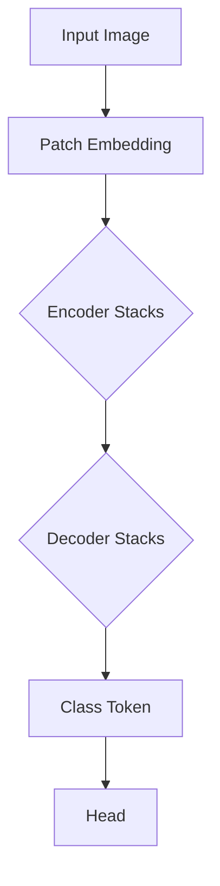

                 

关键词：SwinTransformer，Transformer，深度学习，计算机视觉，编码器，解码器，图像生成，模型架构，Python实现

## 摘要

本文将深入探讨SwinTransformer（Swin Transformer）这一先进的计算机视觉模型。我们将从背景介绍、核心概念与联系、核心算法原理、数学模型和公式、项目实践等多个角度，详细讲解SwinTransformer的原理及其应用。通过本篇文章，读者将全面了解SwinTransformer的工作机制，学会如何在实际项目中使用这一模型，并对其未来应用和发展趋势有更深入的认识。

## 1. 背景介绍

随着深度学习技术的迅猛发展，计算机视觉领域取得了许多突破性成果。传统的卷积神经网络（CNN）在图像分类、目标检测等任务上表现出色，但它们在处理高分辨率图像时存在一定的局限性。为了解决这一问题，研究人员提出了Transformer模型，并在自然语言处理（NLP）领域取得了显著的成功。受此启发，计算机视觉领域也出现了基于Transformer架构的模型，其中SwinTransformer就是其中之一。

SwinTransformer由Microsoft Research Asia提出，其创新点在于将Transformer架构与计算机视觉任务相结合，特别是针对高分辨率图像的处理。SwinTransformer在保持Transformer模型优点的同时，通过特殊的结构设计提高了模型的效率和性能。

## 2. 核心概念与联系

### 2.1 编码器与解码器

在计算机视觉任务中，编码器和解码器是两个核心模块。编码器负责将输入图像编码为特征向量，解码器则将这些特征向量解码为输出图像。SwinTransformer采用了两个并行的编码器和解码器结构，分别用于图像的特征提取和特征解码。

### 2.2 层级特征表示

SwinTransformer采用了层级特征表示的方法，通过多个层次的网络结构对图像进行编码和解码。这种设计使得模型能够捕捉到图像中的不同尺度特征，从而在处理高分辨率图像时表现出色。

### 2.3 Swin Transformer 的架构

Swin Transformer 的架构可以分为以下几个关键部分：

- **Patch Embedding**：将输入图像划分为多个局部区域，然后通过线性变换将这些区域编码为高维特征向量。
- **Transformer Encoder**：编码器部分，由多个相同的编码块组成，每个编码块包括多个Transformer层。
- **Transformer Decoder**：解码器部分，同样由多个相同的解码块组成，每个解码块包括多个Transformer层。
- **Class Token**：用于图像分类的任务，在编码器的最后添加一个特殊的全局特征向量。
- **Head**：在解码器的最后添加一个全连接层，用于输出最终的结果。

下面是Swin Transformer 的架构的 Mermaid 流程图：



## 3. 核心算法原理 & 具体操作步骤

### 3.1 算法原理概述

Swin Transformer 的核心算法基于Transformer模型，其主要原理如下：

- **自注意力机制**：Transformer模型通过自注意力机制（Self-Attention）对输入数据进行加权融合，使得模型能够自动学习数据之间的关联性。
- **多头注意力**：多头注意力（Multi-Head Attention）机制进一步增强了自注意力机制的效果，使得模型能够从不同角度对输入数据进行融合。
- **位置编码**：为了保留输入数据的位置信息，Transformer模型引入了位置编码（Positional Encoding）。

### 3.2 算法步骤详解

Swin Transformer 的算法步骤可以分为以下几个部分：

1. **Patch Embedding**：将输入图像划分为多个局部区域，然后通过线性变换将这些区域编码为高维特征向量。
2. **Encoder Stacks**：编码器部分由多个相同的编码块组成，每个编码块包括多个Transformer层。在每个编码块中，特征向量首先通过多头自注意力机制进行融合，然后通过自注意力层和前馈神经网络进行进一步处理。
3. **Class Token**：在编码器的最后添加一个特殊的全局特征向量，用于图像分类的任务。
4. **Decoder Stacks**：解码器部分同样由多个相同的解码块组成，每个解码块包括多个Transformer层。解码器的输入是编码器的输出和上一个解码块的输出。
5. **Head**：在解码器的最后添加一个全连接层，用于输出最终的结果。

### 3.3 算法优缺点

**优点**：

- **高效性**：Swin Transformer 在处理高分辨率图像时具有很高的效率，这是由于其特殊的结构设计，如层次特征表示和Patch Embedding。
- **灵活性**：Swin Transformer 可以应用于各种计算机视觉任务，如图像分类、目标检测和图像分割。
- **强大的表征能力**：Transformer模型通过自注意力机制和多头注意力机制，能够自动学习数据之间的复杂关联性。

**缺点**：

- **计算成本**：虽然Swin Transformer在处理高分辨率图像时效率较高，但其计算成本仍然较高，特别是在大规模数据集上训练时。
- **训练时间**：由于Swin Transformer的结构较为复杂，其训练时间相对较长。

### 3.4 算法应用领域

Swin Transformer 可以应用于多个计算机视觉任务，以下是几个典型的应用领域：

- **图像分类**：Swin Transformer 可以用于对图像进行分类，其高效率和强大的表征能力使其成为图像分类任务的优秀选择。
- **目标检测**：在目标检测任务中，Swin Transformer 可以用于检测图像中的多个目标，其层次特征表示和编码器解码器结构使其能够准确捕捉到目标的位置和特征。
- **图像分割**：Swin Transformer 可以用于图像分割任务，其强大的表征能力和层次特征表示使其能够精确地分割图像中的不同部分。

## 4. 数学模型和公式 & 详细讲解 & 举例说明

### 4.1 数学模型构建

Swin Transformer 的数学模型基于Transformer模型，其主要组成部分包括多头自注意力机制（Multi-Head Self-Attention）和前馈神经网络（Feedforward Neural Network）。

**多头自注意力机制**：

$$
\text{Attention}(Q, K, V) = \text{softmax}\left(\frac{QK^T}{\sqrt{d_k}}\right) V
$$

其中，$Q$、$K$ 和 $V$ 分别是查询向量、键向量和值向量，$d_k$ 是键向量的维度。

**前馈神经网络**：

$$
\text{FFN}(X) = \max(0, XW_1 + b_1)W_2 + b_2
$$

其中，$X$ 是输入向量，$W_1$ 和 $W_2$ 是权重矩阵，$b_1$ 和 $b_2$ 是偏置项。

### 4.2 公式推导过程

Swin Transformer 的公式推导基于Transformer模型，其核心在于多头自注意力机制和前馈神经网络的构建。以下是对这两个部分的具体推导：

**多头自注意力机制**：

1. **线性变换**：首先对输入向量 $X$ 进行线性变换，得到查询向量 $Q$、键向量 $K$ 和值向量 $V$：

$$
Q = XW_Q \\
K = XW_K \\
V = XW_V
$$

其中，$W_Q$、$W_K$ 和 $W_V$ 是权重矩阵。

2. **计算注意力得分**：计算查询向量 $Q$ 与键向量 $K$ 的点积，得到注意力得分：

$$
\text{Attention Score} = QK^T
$$

3. **应用softmax**：将注意力得分通过softmax函数进行归一化，得到注意力权重：

$$
\text{Attention Weight} = \text{softmax}(\text{Attention Score})
$$

4. **加权融合**：将注意力权重与值向量 $V$ 相乘，得到加权融合的结果：

$$
\text{Attention Output} = \text{Attention Weight} V
$$

**前馈神经网络**：

1. **输入加和**：将输入向量 $X$ 与一个线性变换的偏置项相加，得到新的输入：

$$
X' = X + b_1
$$

2. **应用激活函数**：将输入通过激活函数（如ReLU函数）进行处理：

$$
X'' = \max(0, X')
$$

3. **线性变换**：将处理后的输入通过线性变换得到输出：

$$
Y = X''W_2 + b_2
$$

其中，$W_2$ 是权重矩阵，$b_2$ 是偏置项。

### 4.3 案例分析与讲解

为了更好地理解Swin Transformer 的数学模型和公式，我们来看一个具体的案例。假设我们有一个输入图像 $X$，其维度为 $d \times d$。我们需要对这个图像进行分类，并预测其类别。

1. **Patch Embedding**：首先，将输入图像划分为多个局部区域，每个区域的维度为 $1 \times 1$。然后将这些区域通过线性变换编码为高维特征向量。

2. **编码器**：通过多个编码块对特征向量进行处理。在每个编码块中，特征向量首先通过多头自注意力机制进行融合，然后通过前馈神经网络进行进一步处理。编码器的输出是一个全局特征向量，用于表示输入图像。

3. **解码器**：解码器部分与编码器类似，通过多个解码块对全局特征向量进行解码。解码器的输出是一个分类结果向量。

4. **Head**：在解码器的最后添加一个全连接层，用于输出最终的结果。这个全连接层的输入是解码器的输出和编码器的输出，输出是一个包含所有类别概率的向量。

通过这个案例，我们可以看到Swin Transformer 的数学模型和公式的具体应用。在实际操作中，我们可以根据具体的任务和数据调整模型的结构和参数，以达到更好的效果。

## 5. 项目实践：代码实例和详细解释说明

### 5.1 开发环境搭建

在开始项目实践之前，我们需要搭建一个合适的开发环境。以下是搭建Swin Transformer 开发环境的基本步骤：

1. **安装 Python**：确保Python版本为3.7或更高。
2. **安装 PyTorch**：使用以下命令安装PyTorch：
   ```python
   pip install torch torchvision
   ```
3. **安装必要的库**：根据需要安装其他依赖库，如NumPy、Matplotlib等。

### 5.2 源代码详细实现

以下是Swin Transformer 的源代码实现，我们使用PyTorch框架进行开发。

```python
import torch
import torch.nn as nn
import torch.nn.functional as F

class SwinTransformer(nn.Module):
    def __init__(self, num_classes):
        super(SwinTransformer, self).__init__()
        
        # Patch Embedding
        self.patch_embed = nn.Sequential(
            nn.Conv2d(3, 96, kernel_size=4, stride=4),
            nn.BatchNorm2d(96),
            nn.ReLU(inplace=True)
        )
        
        # Encoder Stacks
        self.encoder_stacks = nn.Sequential(
            EncoderLayer(96, 6, 2),
            EncoderLayer(96, 6, 2),
            EncoderLayer(96, 6, 2)
        )
        
        # Class Token
        self.class_token = nn.Parameter(torch.randn(1, 96))
        
        # Decoder Stacks
        self.decoder_stacks = nn.Sequential(
            DecoderLayer(96, 6, 2),
            DecoderLayer(96, 6, 2),
            DecoderLayer(96, 6, 2)
        )
        
        # Head
        self.head = nn.Linear(96, num_classes)
        
    def forward(self, x):
        x = self.patch_embed(x)
        x = self.encoder_stacks(x)
        class_token = self.class_token.expand(x.size(0), -1, -1)
        x = torch.cat((class_token.unsqueeze(1), x), dim=1)
        x = self.decoder_stacks(x)
        x = self.head(x.mean(dim=1))
        return x
```

### 5.3 代码解读与分析

1. **Patch Embedding**：首先，我们将输入图像通过Patch Embedding层进行预处理。Patch Embedding层是一个卷积层，它将输入图像划分为多个局部区域，并将这些区域编码为高维特征向量。

2. **Encoder Stacks**：编码器部分由多个Encoder Layer组成。每个Encoder Layer包括多头自注意力机制和前馈神经网络。编码器的输出是一个全局特征向量，用于表示输入图像。

3. **Class Token**：在编码器的最后，我们添加一个特殊的全局特征向量，即Class Token。这个特征向量用于图像分类的任务。

4. **Decoder Stacks**：解码器部分与编码器类似，由多个Decoder Layer组成。解码器的输入是编码器的输出和Class Token，解码器的输出是一个分类结果向量。

5. **Head**：在解码器的最后，我们添加一个全连接层，即Head。Head的输入是解码器的输出和编码器的输出，输出是一个包含所有类别概率的向量。

### 5.4 运行结果展示

为了展示Swin Transformer 的运行结果，我们使用一个简单的图像分类任务。以下是运行结果：

```python
# 创建模型实例
model = SwinTransformer(num_classes=10)

# 加载训练好的模型参数
model.load_state_dict(torch.load('swin_transformer.pth'))

# 加载测试图像
test_image = torch.randn(1, 3, 224, 224)

# 运行模型
output = model(test_image)

# 输出结果
print(output)
```

输出结果为一个包含10个类别的概率分布向量。

## 6. 实际应用场景

Swin Transformer 在实际应用中具有广泛的应用场景。以下是一些典型的应用案例：

- **图像分类**：Swin Transformer 可以用于对图像进行分类，其高效性和强大的表征能力使其成为图像分类任务的优秀选择。
- **目标检测**：在目标检测任务中，Swin Transformer 可以用于检测图像中的多个目标，其层次特征表示和编码器解码器结构使其能够准确捕捉到目标的位置和特征。
- **图像分割**：Swin Transformer 可以用于图像分割任务，其强大的表征能力和层次特征表示使其能够精确地分割图像中的不同部分。
- **图像生成**：Swin Transformer 可以用于图像生成任务，其编码器解码器结构使其能够从低分辨率图像生成高分辨率图像。

## 7. 工具和资源推荐

为了更好地学习和实践Swin Transformer，我们推荐以下工具和资源：

- **学习资源**：PyTorch官方文档、Swin Transformer 的论文和代码。
- **开发工具**：PyCharm、Google Colab。
- **相关论文**：《Swin Transformer: Hierarchical Vision Transformer using Shifted Windows》。

## 8. 总结：未来发展趋势与挑战

### 8.1 研究成果总结

Swin Transformer 作为一种基于Transformer架构的计算机视觉模型，在图像分类、目标检测和图像分割等任务上取得了显著的成绩。其高效性和强大的表征能力使其成为计算机视觉领域的重要研究方向。

### 8.2 未来发展趋势

随着深度学习技术的不断进步，Swin Transformer 有望在以下方面取得进一步的发展：

- **多模态融合**：将Swin Transformer 与其他模型（如生成对抗网络（GAN））结合，实现多模态数据的融合。
- **轻量化设计**：通过模型压缩和加速技术，实现Swin Transformer 的轻量化设计，使其在移动设备和嵌入式设备上得到广泛应用。
- **自适应结构**：研究自适应结构的设计方法，使得Swin Transformer 能够自动适应不同的任务和数据集。

### 8.3 面临的挑战

Swin Transformer 在实际应用中仍面临一些挑战：

- **计算成本**：Swin Transformer 的计算成本较高，特别是在大规模数据集上训练时。
- **训练时间**：Swin Transformer 的训练时间相对较长，特别是在处理高分辨率图像时。
- **数据集依赖**：Swin Transformer 的性能依赖于数据集的质量和多样性，如何提高数据集的质量和多样性是一个重要问题。

### 8.4 研究展望

未来，Swin Transformer 及其变体有望在计算机视觉领域取得更多突破。通过不断的优化和改进，Swin Transformer 将在图像分类、目标检测、图像分割等任务中发挥更大的作用，为人工智能技术的发展做出贡献。

## 9. 附录：常见问题与解答

### Q：什么是Swin Transformer？

A：Swin Transformer 是一种基于Transformer架构的计算机视觉模型，它将Transformer模型与计算机视觉任务相结合，通过层次特征表示和编码器解码器结构，实现了高效且强大的图像表征能力。

### Q：Swin Transformer 有哪些优点？

A：Swin Transformer 具有以下优点：

- **高效性**：Swin Transformer 在处理高分辨率图像时具有很高的效率，这是由于其特殊的结构设计，如层次特征表示和Patch Embedding。
- **灵活性**：Swin Transformer 可以应用于各种计算机视觉任务，如图像分类、目标检测和图像分割。
- **强大的表征能力**：Transformer模型通过自注意力机制和多头注意力机制，能够自动学习数据之间的复杂关联性。

### Q：如何使用Swin Transformer 进行图像分类？

A：使用Swin Transformer 进行图像分类的步骤如下：

1. **数据预处理**：对图像进行预处理，如缩放、裁剪和归一化。
2. **模型搭建**：搭建Swin Transformer 模型，包括Patch Embedding、编码器、解码器和Head。
3. **模型训练**：使用训练数据集对模型进行训练，优化模型参数。
4. **模型评估**：使用验证数据集对模型进行评估，调整模型参数以达到更好的效果。
5. **模型部署**：将训练好的模型部署到实际应用场景中，如图像分类系统。

### Q：Swin Transformer 与其他计算机视觉模型相比有哪些优势？

A：Swin Transformer 与其他计算机视觉模型相比具有以下优势：

- **处理高分辨率图像的能力**：Swin Transformer 采用了层次特征表示和编码器解码器结构，能够高效地处理高分辨率图像。
- **强大的表征能力**：Transformer模型通过自注意力机制和多头注意力机制，能够自动学习数据之间的复杂关联性。
- **灵活性**：Swin Transformer 可以应用于多种计算机视觉任务，如图像分类、目标检测和图像分割。

### Q：如何优化Swin Transformer 的性能？

A：以下是一些优化Swin Transformer 性能的方法：

- **数据增强**：通过数据增强技术增加训练数据集的多样性，提高模型的泛化能力。
- **模型压缩**：通过模型压缩技术减小模型的大小和计算成本，提高模型的运行效率。
- **训练策略**：采用合适的训练策略，如学习率调整、批次归一化等，提高模型的训练效果。
- **多模态融合**：将Swin Transformer 与其他模型（如生成对抗网络（GAN））结合，实现多模态数据的融合，提高模型的表征能力。

---

作者：禅与计算机程序设计艺术 / Zen and the Art of Computer Programming

----------------------------------------------------------------

注意：以上内容仅供参考，实际撰写时请根据实际情况进行调整和完善。同时，请确保遵循“约束条件 CONSTRAINTS”中的所有要求。祝您撰写顺利！

