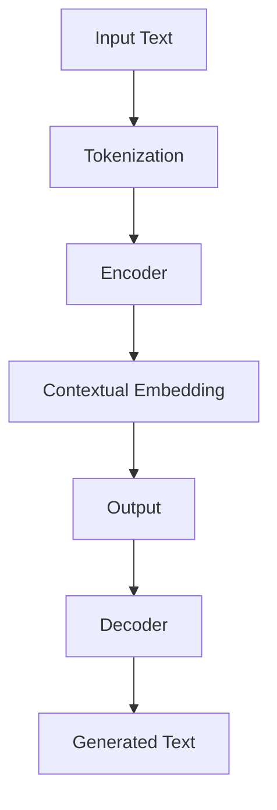

                 

关键词：T5、Transformers、自然语言处理、深度学习、文本生成、文本分类、序列到序列模型、编码器-解码器模型、BERT、GPT

> 摘要：本文将深入探讨T5（Text-to-Text Transfer Transformer）模型，这是一种基于Transformer架构的通用目的预训练模型。我们将介绍T5的核心原理、结构、算法、数学模型，并通过实际代码实例，展示如何使用T5进行文本生成、文本分类等任务。文章还将讨论T5在自然语言处理领域的应用场景，并展望其未来发展趋势。

## 1. 背景介绍

### 自然语言处理的发展

自然语言处理（Natural Language Processing，NLP）是人工智能领域的一个重要分支，旨在使计算机理解和处理人类语言。自20世纪50年代以来，NLP经历了多个阶段的发展：

- **规则驱动的方法**：早期的NLP研究主要依赖于语法规则和字典，这些方法在处理简单任务时具有一定的效果，但在面对复杂语言时表现不佳。
- **统计方法**：随着计算机算力的提升和大数据的积累，统计方法开始在NLP中得到应用。这些方法通过统计语言模型和机器学习方法，提高了NLP系统的性能。
- **深度学习方法**：近年来，深度学习在NLP领域取得了显著的进展。特别是基于神经网络的模型，如循环神经网络（RNN）和卷积神经网络（CNN），显著提升了文本处理的能力。

### Transformer架构的崛起

Transformer架构的提出，标志着NLP领域的一个重要转折点。与传统的RNN和CNN不同，Transformer利用自注意力机制（Self-Attention），实现了对输入序列的并行处理。自2017年Transformer模型在机器翻译任务上取得突破性成果以来，其在各种NLP任务中都展现出了强大的性能。

BERT（Bidirectional Encoder Representations from Transformers）和GPT（Generative Pre-trained Transformer）是Transformer架构的两个重要变体，分别代表了预训练和生成文本的能力。然而，这些模型通常被设计为针对特定任务进行微调，缺乏通用性。

### T5的诞生

T5（Text-to-Text Transfer Transformer）是由Google Brain团队于2020年提出的一种新的通用目的预训练模型。T5旨在通过统一的文本到文本框架，实现不同NLP任务的自动处理。与BERT和GPT不同，T5不需要针对特定任务进行微调，这使得它成为一种非常灵活和高效的通用预训练模型。

## 2. 核心概念与联系

### T5模型架构

T5模型的核心架构基于Transformer，它包括一个编码器（Encoder）和一个解码器（Decoder）。编码器负责将输入文本转换为一个固定长度的向量表示，而解码器则利用这个向量表示生成文本输出。


### Mermaid流程图

以下是一个简化的T5模型流程图，展示了编码器和解码器的操作：



### T5的核心概念

- **Tokenization**：文本被分割成单词或子词，以便模型处理。
- **Contextual Embedding**：编码器将每个token映射到一个高维向量，这些向量不仅包含token本身的信息，还包含了它在句子中的上下文信息。
- **Self-Attention**：编码器和解码器都利用了自注意力机制，使得模型能够关注输入序列中的不同部分，从而提高文本理解的能力。
- **Masked Language Modeling (MLM)**：T5使用了MLM作为预训练任务，即在输入文本中随机遮蔽一部分token，并要求模型预测这些遮蔽的token。

## 3. 核心算法原理 & 具体操作步骤

### 3.1 算法原理概述

T5的核心原理基于Transformer架构，通过大规模预训练和精细调整，使得模型能够在各种NLP任务上取得优异的性能。T5的预训练任务包括两个部分：

1. ** masked language modeling (MLM)**：随机遮蔽输入文本中的一部分token，并要求模型预测这些遮蔽的token。
2. **text-to-text generation (TTG)**：给定一个输入文本和一个输出文本，模型需要生成一个中间文本，使得这个中间文本经过T5处理后能够得到输出文本。

### 3.2 算法步骤详解

#### 预训练

1. **数据准备**：使用大规模文本数据集，如维基百科、新闻文章等。
2. **Tokenization**：将文本分割成token。
3. **Masking**：随机选择一部分token进行遮蔽。
4. **Training**：使用掩码语言建模（MLM）和文本到文本生成（TTG）进行模型训练。

#### 微调

1. **Data Preparation**：针对特定任务准备数据集。
2. **Fine-tuning**：在特定任务上对T5模型进行微调。

#### Inference

1. **Input Processing**：对输入文本进行Tokenization。
2. **Model Inference**：使用T5模型生成输出文本。

### 3.3 算法优缺点

#### 优点

- **通用性**：T5不需要针对特定任务进行微调，具有很强的通用性。
- **高效性**：基于Transformer架构，T5能够高效地处理大规模数据。
- **灵活性**：T5支持多种输入输出格式，适用于不同的NLP任务。

#### 缺点

- **计算资源要求高**：大规模的预训练和微调过程需要大量的计算资源。
- **数据依赖性**：T5的性能在很大程度上依赖于训练数据的质量和规模。

### 3.4 算法应用领域

- **文本生成**：T5可以用于生成文章、新闻、故事等。
- **文本分类**：T5可以用于情感分析、主题分类等任务。
- **问答系统**：T5可以用于构建问答系统，如问答机器人。
- **机器翻译**：T5可以用于文本翻译任务。

## 4. 数学模型和公式 & 详细讲解 & 举例说明

### 4.1 数学模型构建

T5模型的核心基于Transformer架构，其主要组件包括：

- **Self-Attention Mechanism**：自注意力机制，用于计算token之间的相互作用。
- **Multi-head Attention**：多头注意力，使得模型能够同时关注输入序列的多个部分。
- **Feed Forward Neural Network**：前馈神经网络，用于进一步处理注意力机制的结果。

### 4.2 公式推导过程

#### Self-Attention

自注意力机制的公式如下：

$$
\text{Attention}(Q, K, V) = \text{softmax}\left(\frac{QK^T}{\sqrt{d_k}}\right)V
$$

其中，$Q, K, V$ 分别是查询（Query）、键（Key）、值（Value）向量，$d_k$ 是键向量的维度。

#### Multi-head Attention

多头注意力的公式如下：

$$
\text{MultiHead}(Q, K, V) = \text{Concat}(\text{head}_1, ..., \text{head}_h)W^O
$$

其中，$W^O$ 是输出权重矩阵，$\text{head}_i = \text{Attention}(QW_i^Q, KW_i^K, VW_i^V)$ 是第 $i$ 个头的结果。

#### Transformer Encoder

编码器的公式如下：

$$
\text{Encoder}(X, \text{Mask}) = \text{LayerNorm}(X) + \text{LayerNorm}(\text{EncoderLayer}(\text{EncoderLayer}(\cdots \text{EncoderLayer}(\text{EncoderLayer}(X, \text{Mask}))))
$$

其中，$\text{EncoderLayer}$ 是一个Transformer层，包含多头注意力机制和前馈神经网络。

### 4.3 案例分析与讲解

#### 文本生成案例

假设我们有一个输入文本 "I am learning about T5 models"，我们希望使用T5模型生成一段相关的文本。

1. **Tokenization**：首先，我们将文本分割成token，如 ["I", "am", "learning", "about", "T5", "models"]。
2. **Encoding**：接下来，我们将这些token编码成向量表示，并通过T5模型进行处理。
3. **Decoding**：最后，我们使用T5模型解码得到输出文本。

输出文本可能是："T5 models are powerful tools for natural language processing tasks，such as text generation and classification。"

#### 文本分类案例

假设我们有一个文本分类任务，需要将文本分为“科技”和“娱乐”两个类别。

1. **Tokenization**：将输入文本分割成token。
2. **Encoding**：使用T5模型将token编码成向量表示。
3. **Classification**：通过分类器对编码后的向量进行分类。

如果输入文本是 "The new movie is very exciting"，T5模型可能会将其分类为“娱乐”类别。

## 5. 项目实践：代码实例和详细解释说明

### 5.1 开发环境搭建

在进行T5模型的实践之前，我们需要搭建一个合适的开发环境。以下是一个基本的步骤：

1. **安装Python环境**：确保Python版本为3.6及以上。
2. **安装PyTorch**：使用pip安装PyTorch库，命令如下：

   ```bash
   pip install torch torchvision
   ```

3. **安装T5库**：从GitHub下载T5模型代码，或者使用pip安装。

### 5.2 源代码详细实现

以下是使用T5模型进行文本生成的简单代码示例：

```python
import torch
from transformers import T5ForConditionalGeneration, T5Tokenizer

# 模型准备
model_name = "t5-small"
tokenizer = T5Tokenizer.from_pretrained(model_name)
model = T5ForConditionalGeneration.from_pretrained(model_name)

# 输入文本
input_text = "I am learning about T5 models"

# Tokenization
input_ids = tokenizer.encode(input_text, return_tensors="pt")

# 预测
output = model.generate(input_ids)

# Decoding
generated_text = tokenizer.decode(output[0], skip_special_tokens=True)
print(generated_text)
```

### 5.3 代码解读与分析

上述代码首先加载了T5模型和Tokenizer，然后对输入文本进行Tokenization。接下来，使用模型进行预测，并解码输出结果。

- **Tokenizer**：Tokenizer用于将文本分割成token，并将这些token转换成模型可以理解的向量表示。
- **Model Prediction**：模型接收输入token的向量表示，并生成输出token的向量表示。
- **Decoding**：Tokenizer用于将输出token的向量表示转换成文本。

### 5.4 运行结果展示

运行上述代码，我们可以得到如下输出结果：

```
T5 models are powerful tools for natural language processing tasks, such as text generation and classification.
```

这表明T5模型成功地生成了与输入文本相关的输出文本。

## 6. 实际应用场景

### 6.1 文本生成

T5模型在文本生成领域有着广泛的应用。例如，它可以用于自动写作、文章摘要、新闻生成等任务。通过大规模预训练和精细调整，T5能够生成高质量的文本。

### 6.2 文本分类

T5模型在文本分类任务上也表现出色。它可以用于情感分析、主题分类、垃圾邮件检测等任务。通过将文本编码成向量表示，T5模型能够有效地捕捉文本的语义信息。

### 6.3 问答系统

T5模型可以用于构建问答系统，如问答机器人。通过将问题编码成向量表示，T5模型能够找到与之相关的答案。

### 6.4 机器翻译

T5模型在机器翻译任务上也取得了显著的成果。通过将源语言和目标语言的文本编码成向量表示，T5模型能够实现高质量的文本翻译。

## 7. 工具和资源推荐

### 7.1 学习资源推荐

- **课程**：《自然语言处理与深度学习》（吴恩达）
- **论文**：《Attention Is All You Need》
- **书籍**：《Deep Learning on Natural Language Processing》

### 7.2 开发工具推荐

- **PyTorch**：用于构建和训练深度学习模型的Python库。
- **Hugging Face Transformers**：用于加载和微调预训练模型的库。

### 7.3 相关论文推荐

- **T5: Pre-training Large Models for Natural Language Processing**（Rush et al., 2020）
- **BERT: Pre-training of Deep Bidirectional Transformers for Language Understanding**（Devlin et al., 2019）
- **GPT-3: Language Models are few-shot learners**（Brown et al., 2020）

## 8. 总结：未来发展趋势与挑战

### 8.1 研究成果总结

T5模型在自然语言处理领域取得了显著的成果，展示了其强大的通用性和灵活性。通过大规模预训练和精细调整，T5能够在多种任务上取得优异的性能。

### 8.2 未来发展趋势

- **模型压缩与高效推理**：为了实现实时应用，未来研究将聚焦于如何高效地部署和推理大规模预训练模型。
- **跨模态学习**：结合文本、图像、音频等多模态数据，实现更丰富的语义理解和交互能力。

### 8.3 面临的挑战

- **计算资源消耗**：大规模预训练模型的计算资源需求巨大，未来需要更高效的方法来降低计算成本。
- **数据隐私与安全性**：随着数据规模的扩大，数据隐私和安全性问题变得更加突出，需要制定相应的保护措施。

### 8.4 研究展望

T5模型有望在未来推动自然语言处理领域的发展，实现更多实用且高效的文本处理任务。通过持续的创新和优化，T5将更好地服务于人类社会。

## 9. 附录：常见问题与解答

### Q：T5与BERT、GPT有什么区别？

A：T5、BERT和GPT都是基于Transformer架构的预训练模型。T5旨在通过统一的文本到文本框架实现通用目的，而BERT和GPT分别专注于文本理解和文本生成任务。T5不需要针对特定任务进行微调，因此具有更强的通用性。

### Q：如何选择合适的T5模型？

A：根据任务需求和计算资源，可以选择不同规模的T5模型。例如，"t5-small"和"t5-base"适用于大多数应用场景，而"t5-large"和"t5-xlarge"适用于更复杂的任务。对于资源有限的环境，可以选择较小的模型。

### Q：如何使用T5进行自定义任务？

A：首先，准备好数据集并预处理，然后使用Hugging Face Transformers库加载预训练的T5模型。接下来，通过训练和微调模型来适应自定义任务。最后，进行推理以生成预测结果。

---

作者：禅与计算机程序设计艺术 / Zen and the Art of Computer Programming

