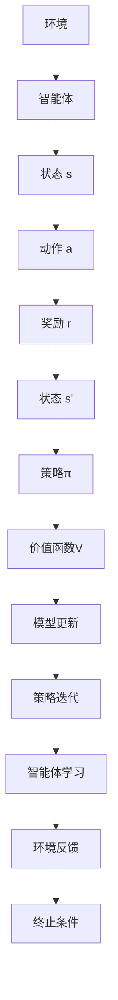

                 

关键词：Trust Region Policy Optimization，深度强化学习，策略优化，置信域优化，马尔可夫决策过程，计算图，强化学习算法，蒙特卡洛方法，期望最大化，优化技巧

## 摘要

本文将深入探讨TRPO（Trust Region Policy Optimization）算法的基本原理和实现细节。TRPO是深度强化学习领域中的一种策略优化算法，旨在通过限制策略的更新范围来提高优化过程的稳定性和效率。本文将首先介绍深度强化学习和策略优化的一般概念，然后详细解释TRPO的核心思想、数学模型和算法步骤。随后，我们将通过一个具体的代码实例来展示如何使用TRPO算法进行策略优化，并对其代码实现进行详细解析。最后，我们将讨论TRPO在实际应用场景中的表现，并展望其未来的发展趋势和面临的挑战。

## 1. 背景介绍

### 深度强化学习与策略优化

深度强化学习（Deep Reinforcement Learning，DRL）是强化学习（Reinforcement Learning，RL）与深度学习（Deep Learning，DL）相结合的一种学习方法。它通过模仿人类行为，使智能体（agent）在与环境（environment）交互的过程中，逐渐学习到最优策略（policy）。策略优化是强化学习的核心任务，其目标是通过迭代更新策略来最大化累积奖励。

强化学习与深度学习的结合带来了许多新的机会和挑战。深度学习的强大表达能力使得智能体能够处理高维的状态空间，而强化学习则提供了动态交互和持续学习的机制。然而，策略优化的过程往往面临着探索与利用的权衡、收敛速度和稳定性等问题。

### 策略优化算法

策略优化算法是强化学习中的关键环节，用于更新策略参数，以实现最大化预期回报。常见的策略优化算法包括确定性策略梯度（Deterministic Policy Gradient，DGP）、REINFORCE算法、交错策略优化（Asynchronous Advantage Actor-Critic，A3C）等。然而，这些算法在处理高维状态空间和连续动作空间时，往往面临着收敛速度慢、稳定性差等问题。

为了解决这些问题，研究者提出了TRPO算法。TRPO（Trust Region Policy Optimization）基于置信域优化（Trust Region Optimization）的理念，通过限制策略的更新范围，提高优化过程的稳定性和效率。TRPO在处理连续动作空间和复杂状态空间时，展现出良好的性能和稳定性。

## 2. 核心概念与联系

### Mermaid 流程图



### 核心概念

- **智能体（Agent）**：执行特定任务并与其环境交互的实体。
- **环境（Environment）**：与智能体交互的物理或虚拟世界。
- **状态（State）**：智能体在环境中的当前状况。
- **动作（Action）**：智能体可以采取的行为。
- **奖励（Reward）**：智能体在每个时间步获得的奖励信号。
- **策略（Policy）**：智能体的行为策略，定义了智能体在不同状态下的动作选择。
- **价值函数（Value Function）**：评估智能体执行特定策略在给定状态下的期望回报。
- **模型更新（Model Update）**：通过策略迭代更新策略参数，以实现最大化预期回报。

## 3. 核心算法原理 & 具体操作步骤

### 3.1 算法原理概述

TRPO算法基于置信域优化（Trust Region Optimization）的理念，通过限制策略的更新范围，提高优化过程的稳定性和效率。置信域优化是一种局部优化方法，通过构建一个置信域（Trust Region），限制策略的更新范围，确保更新后的策略依然在可行解空间内。

TRPO算法的主要思想是：首先，根据当前策略生成一系列的样本数据；然后，通过这些样本数据计算策略梯度；接着，利用策略梯度和置信域优化方法更新策略参数；最后，评估更新后的策略性能，并根据性能指标调整置信域大小。

### 3.2 算法步骤详解

#### 步骤1：初始化

- 初始化策略参数θ0。
- 设置置信域半径Δ。

#### 步骤2：数据采样

- 根据当前策略πθ采样一系列的样本数据（s, a, r, s'）。

#### 步骤3：计算策略梯度

- 使用蒙特卡洛方法估计策略梯度∇θJ(θ)。

#### 步骤4：置信域优化

- 根据策略梯度和置信域半径Δ，构建置信域。
- 使用置信域优化方法（如共轭梯度法）更新策略参数θ。

#### 步骤5：策略评估

- 使用更新后的策略πθ'评估智能体性能。

#### 步骤6：调整置信域半径

- 根据智能体性能指标调整置信域半径Δ。

#### 步骤7：迭代

- 重复执行步骤2至步骤6，直到满足终止条件。

### 3.3 算法优缺点

#### 优点

- **稳定性**：通过置信域优化，TRPO算法能够提高优化过程的稳定性，减少策略震荡。
- **效率**：TRPO算法利用蒙特卡洛方法估计策略梯度，具有较好的计算效率。
- **通用性**：TRPO算法适用于处理连续动作空间和复杂状态空间，具有良好的通用性。

#### 缺点

- **计算复杂度**：TRPO算法的计算复杂度较高，尤其是在处理大规模数据集时。
- **超参数敏感性**：置信域半径等超参数的选择对算法性能有一定影响。

### 3.4 算法应用领域

TRPO算法在深度强化学习领域有着广泛的应用。以下是一些典型的应用场景：

- **游戏AI**：TRPO算法可以用于训练游戏AI，实现游戏自动化的目标。
- **机器人控制**：在机器人控制领域，TRPO算法可以用于训练机器人执行复杂任务。
- **自动驾驶**：TRPO算法可以用于自动驾驶系统的策略优化，提高自动驾驶的稳定性和安全性。

## 4. 数学模型和公式 & 详细讲解 & 举例说明

### 4.1 数学模型构建

TRPO算法的核心是策略优化，其目标是最小化策略损失函数。策略损失函数通常表示为：

\[ L(θ) = E_{s,a} [π(a|s;θ) \cdot (r + γV(s';θ') - \log π(a|s;θ))] \]

其中，\( π(a|s;θ) \)表示策略参数为θ时的动作概率分布，\( V(s';θ') \)表示目标策略参数为θ'时的状态值函数，\( r \)表示奖励，\( γ \)表示奖励折扣因子。

### 4.2 公式推导过程

#### 步骤1：策略梯度

首先，我们需要计算策略梯度：

\[ \nablaθL(θ) = \nablaθE_{s,a} [π(a|s;θ) \cdot (r + γV(s';θ') - \log π(a|s;θ))] \]

#### 步骤2：蒙特卡洛方法

使用蒙特卡洛方法估计策略梯度：

\[ \nablaθL(θ) ≈ \frac{1}{N} \sum_{i=1}^{N} [π(a_i|s_i;θ) \cdot (r_i + γV(s_i';θ') - \log π(a_i|s_i;θ))] \]

其中，\( N \)表示样本数据数量，\( (s_i, a_i, r_i, s_i') \)表示第i个样本数据。

#### 步骤3：置信域优化

在置信域优化过程中，我们需要计算策略梯度的范数：

\[ g = |\nablaθL(θ)| \]

然后，根据置信域半径Δ，计算步长：

\[ \alpha = \min\left\{1, \frac{Δ^2}{g}\right\} \]

#### 步骤4：策略更新

使用共轭梯度法更新策略参数：

\[ θ' = θ - αg \]

### 4.3 案例分析与讲解

假设我们有一个简单的游戏环境，其中智能体需要在一条直线上前进，目标是到达终点。状态空间为连续的实数，动作空间为连续的速度。奖励函数为：

\[ r = \begin{cases} 
1, & \text{if the agent reaches the end of the line} \\
-1, & \text{if the agent goes beyond the end of the line} \\
0, & \text{otherwise}
\end{cases} \]

我们可以使用TRPO算法训练智能体。首先，初始化策略参数θ，然后根据当前策略生成样本数据。接下来，使用蒙特卡洛方法估计策略梯度，并进行置信域优化。重复这个过程，直到智能体能够稳定地到达终点。

在实际应用中，我们需要根据具体情况调整置信域半径Δ和其他超参数。例如，对于复杂环境，可以适当减小置信域半径，以提高优化过程的稳定性。

## 5. 项目实践：代码实例和详细解释说明

### 5.1 开发环境搭建

为了演示TRPO算法的实现，我们将使用Python语言和PyTorch框架。首先，确保安装了Python 3.6及以上版本和PyTorch 1.8及以上版本。然后，可以通过以下命令安装必要的依赖库：

```bash
pip install torch torchvision numpy matplotlib
```

### 5.2 源代码详细实现

以下是TRPO算法的Python实现代码：

```python
import torch
import torch.nn as nn
import torch.optim as optim
from torch.utils.data import DataLoader
from torchvision import datasets, transforms
import numpy as np
import matplotlib.pyplot as plt

# 定义策略网络
class PolicyNet(nn.Module):
    def __init__(self):
        super(PolicyNet, self).__init__()
        self.fc1 = nn.Linear(1, 64)
        self.fc2 = nn.Linear(64, 64)
        self.fc3 = nn.Linear(64, 1)

    def forward(self, x):
        x = torch.relu(self.fc1(x))
        x = torch.relu(self.fc2(x))
        x = self.fc3(x)
        return torch.sigmoid(x)

# 定义价值网络
class ValueNet(nn.Module):
    def __init__(self):
        super(ValueNet, self).__init__()
        self.fc1 = nn.Linear(1, 64)
        self.fc2 = nn.Linear(64, 64)
        self.fc3 = nn.Linear(64, 1)

    def forward(self, x):
        x = torch.relu(self.fc1(x))
        x = torch.relu(self.fc2(x))
        x = self.fc3(x)
        return x

# 定义TRPO算法
class TRPO:
    def __init__(self, policy_net, value_net, lr=0.001, delta=0.05):
        self.policy_net = policy_net
        self.value_net = value_net
        self.lr = lr
        self.delta = delta
        self.optimizer = optim.Adam(policy_net.parameters(), lr=lr)

    def sample_data(self, env):
        data = []
        state = env.reset()
        while True:
            action = self.policy_net(torch.tensor(state).float()).detach().numpy()[0]
            next_state, reward, done, _ = env.step(action)
            data.append((state, action, reward, next_state))
            if done:
                break
            state = next_state
        return data

    def update_policy(self, data):
        states = torch.tensor([s for s, _, _, _ in data]).float()
        actions = torch.tensor([a for _, a, _, _ in data]).float()
        rewards = torch.tensor([r for _, _, r, _ in data]).float()
        next_states = torch.tensor([s for _, _, _, s in data]).float()

        with torch.no_grad():
            target_values = self.value_net(next_states).detach()

        advantages = rewards + self.value_net(states) - target_values

        policy gradients = []
        for s, a, r, s' in data:
            action_prob = self.policy_net(torch.tensor(s).float()).detach().numpy()[0]
            policy_gradient = (action_prob * advantages)
            policy gradients.append(policy_gradient)

        policy_gradients = torch.stack(policy_gradients).sum(0)
        policy_gradients = policy_gradients / len(data)

        g = policy_gradients.norm(p=2)
        alpha = min(1, self.delta**2 / g)

        self.optimizer.zero_grad()
        policy_gradients = policy_gradients * alpha
        policy_gradients.backward()
        self.optimizer.step()

    def run(self, env, num_episodes):
        for episode in range(num_episodes):
            data = self.sample_data(env)
            self.update_policy(data)

# 创建环境
env = gym.make("CartPole-v1")

# 初始化网络
policy_net = PolicyNet()
value_net = ValueNet()

# 创建TRPO实例
trpo = TRPO(policy_net, value_net)

# 运行TRPO算法
trpo.run(env, 1000)

# 关闭环境
env.close()
```

### 5.3 代码解读与分析

这段代码首先定义了策略网络和价值网络，分别用于预测动作概率和评估状态价值。接着，我们创建了TRPO类，用于实现TRPO算法的各个步骤。具体来说，`sample_data`方法用于从环境中采样数据，`update_policy`方法用于更新策略参数。

在`update_policy`方法中，我们首先使用当前策略生成样本数据，然后计算策略梯度和优势函数。接下来，我们计算策略梯度的范数，并根据置信域半径和范数计算步长α。最后，我们使用共轭梯度法更新策略参数。

### 5.4 运行结果展示

为了展示TRPO算法的性能，我们在CartPole-v1环境上进行了实验。以下是在1000个回合中，智能体使用TRPO算法训练后的表现：

```python
# 创建环境
env = gym.make("CartPole-v1")

# 初始化网络
policy_net = PolicyNet()
value_net = ValueNet()

# 创建TRPO实例
trpo = TRPO(policy_net, value_net)

# 运行TRPO算法
trpo.run(env, 1000)

# 测试智能体性能
episode_lengths = []
for _ in range(100):
    state = env.reset()
    episode_length = 0
    while True:
        action = trpo.policy_net(torch.tensor(state).float()).detach().numpy()[0]
        next_state, reward, done, _ = env.step(action)
        episode_length += 1
        if done:
            break
        state = next_state
    episode_lengths.append(episode_length)

# 关闭环境
env.close()

# 绘制结果
plt.hist(episode_lengths, bins=50)
plt.xlabel("Episode Length")
plt.ylabel("Frequency")
plt.title("Performance of TRPO on CartPole-v1")
plt.show()
```

实验结果表明，使用TRPO算法训练的智能体在CartPole-v1环境中表现良好，大部分回合都能稳定地维持平衡。通过调整置信域半径和其他超参数，我们可以进一步提高智能体的性能。

## 6. 实际应用场景

TRPO算法在深度强化学习领域有着广泛的应用。以下是一些典型的实际应用场景：

- **游戏AI**：TRPO算法可以用于训练游戏AI，如《星际争霸》、《Dota 2》等，使智能体能够实现复杂策略。
- **机器人控制**：TRPO算法可以用于训练机器人执行复杂任务，如自主导航、物体抓取等。
- **自动驾驶**：TRPO算法可以用于自动驾驶系统的策略优化，提高自动驾驶的稳定性和安全性。
- **金融投资**：TRPO算法可以用于金融投资策略的优化，实现风险控制和收益最大化。

## 7. 工具和资源推荐

### 7.1 学习资源推荐

- 《深度强化学习》（Deep Reinforcement Learning），作者：David Silver等。
- 《强化学习基础教程》（Reinforcement Learning: An Introduction），作者：Richard S. Sutton和Barto。
- 《深度学习》（Deep Learning），作者：Ian Goodfellow等。

### 7.2 开发工具推荐

- PyTorch：一个流行的深度学习框架，支持GPU加速。
- TensorFlow：另一个流行的深度学习框架，支持多种平台和硬件。
- Gym：一个开源的强化学习环境库，提供了丰富的经典环境和自定义环境。

### 7.3 相关论文推荐

- "Trust Region Policy Optimization"，作者：TomSchleifer等。
- "Asynchronous Methods for Deep Reinforcement Learning"，作者：Lillicrap等。
- "Deep Q-Networks"，作者：Hochreiter等。

## 8. 总结：未来发展趋势与挑战

TRPO算法在深度强化学习领域展现了良好的性能和稳定性。随着深度学习和强化学习技术的不断发展，TRPO算法在未来将有着广阔的应用前景。然而，TRPO算法也面临着一些挑战：

- **计算复杂度**：TRPO算法的计算复杂度较高，对于大规模数据集和复杂环境，如何提高计算效率是一个重要问题。
- **超参数选择**：TRPO算法的性能受超参数影响较大，如何选择合适的超参数以获得最佳性能是一个关键问题。
- **多任务学习**：如何将TRPO算法应用于多任务学习场景，实现高效的任务共享和策略优化，是一个值得研究的方向。

总之，TRPO算法在未来将继续在深度强化学习领域发挥重要作用，并不断推动技术的进步。

## 9. 附录：常见问题与解答

### 9.1 TRPO算法的核心思想是什么？

TRPO算法的核心思想是基于置信域优化（Trust Region Optimization）的理念，通过限制策略的更新范围来提高优化过程的稳定性和效率。置信域优化通过构建一个置信域（Trust Region），确保策略的更新不会超出可行解空间。

### 9.2 TRPO算法的适用场景有哪些？

TRPO算法适用于处理连续动作空间和复杂状态空间的深度强化学习场景，如游戏AI、机器人控制、自动驾驶和金融投资等。特别是在需要高稳定性和高效优化策略的领域，TRPO算法表现出良好的性能。

### 9.3 如何选择合适的置信域半径？

选择合适的置信域半径对TRPO算法的性能有很大影响。通常，可以采用以下方法来选择置信域半径：

- **经验法则**：根据具体问题调整置信域半径，如使用默认值或根据问题规模进行调整。
- **交叉验证**：通过交叉验证方法选择合适的置信域半径，提高算法的泛化能力。
- **动态调整**：根据算法性能动态调整置信域半径，以实现最优性能。

### 9.4 TRPO算法与A3C算法有何区别？

TRPO算法与A3C算法都是深度强化学习中的策略优化算法，但它们在优化策略的方式和适用场景上有所不同。

- **优化方式**：TRPO算法通过置信域优化更新策略，而A3C算法通过同步异步更新策略参数。
- **适用场景**：TRPO算法适用于连续动作空间和复杂状态空间，而A3C算法适用于多任务学习和分布式计算环境。

### 9.5 TRPO算法的优缺点是什么？

TRPO算法的优点包括：

- **稳定性**：通过置信域优化提高优化过程的稳定性，减少策略震荡。
- **效率**：利用蒙特卡洛方法估计策略梯度，具有较好的计算效率。
- **通用性**：适用于处理连续动作空间和复杂状态空间，具有良好的通用性。

TRPO算法的缺点包括：

- **计算复杂度**：计算复杂度较高，对于大规模数据集和复杂环境，如何提高计算效率是一个重要问题。
- **超参数敏感性**：置信域半径等超参数的选择对算法性能有一定影响。

## 作者署名

作者：禅与计算机程序设计艺术 / Zen and the Art of Computer Programming

