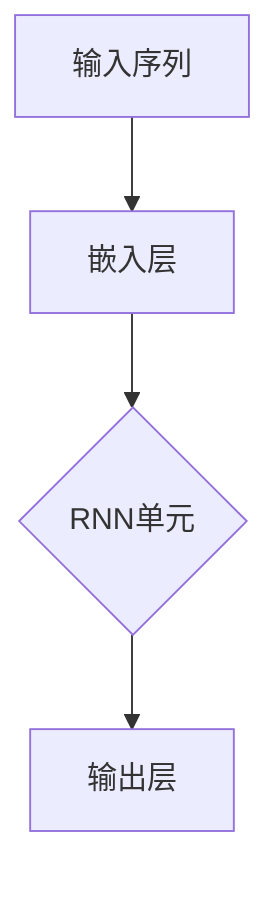
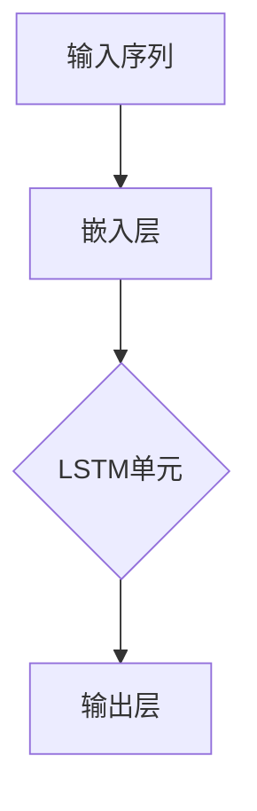

                 

关键词：TensorFlow、自然语言处理、文本生成、深度学习、神经网络、词嵌入、序列模型、循环神经网络、长短时记忆网络、BERT、语言模型、生成模型、编码器-解码器架构、预训练语言模型、应用场景

摘要：本文旨在深入探讨TensorFlow在自然语言处理（NLP）中的应用，特别是理解和生成文本的能力。我们将介绍核心概念和算法原理，包括词嵌入、序列模型、循环神经网络（RNN）和长短时记忆网络（LSTM），以及最近的预训练语言模型BERT。此外，我们将通过实际项目实践，展示如何使用TensorFlow构建NLP应用程序，并提供未来应用场景和趋势展望。

## 1. 背景介绍

自然语言处理（NLP）是计算机科学和人工智能领域的一个子集，旨在使计算机理解和生成人类语言。近年来，随着深度学习技术的迅速发展，NLP取得了显著的进步。TensorFlow是一个开源的机器学习框架，由Google开发，广泛用于构建和训练复杂的深度学习模型。本文将介绍如何使用TensorFlow进行自然语言处理，重点关注文本理解和生成。

### 自然语言处理的应用场景

NLP在多个领域有着广泛的应用，包括但不限于：

- 文本分类：将文本数据分类到预定义的类别中，例如情感分析、垃圾邮件检测。
- 机器翻译：将一种语言的文本翻译成另一种语言。
- 问答系统：构建能够回答用户问题的智能系统。
- 文本生成：创建有意义的文本，如自动撰写新闻文章、生成创意内容。

### TensorFlow的发展历程

TensorFlow最初由Google大脑团队在2015年发布，作为其开源机器学习项目。自那时以来，TensorFlow已经成为机器学习和深度学习领域的事实标准，拥有庞大的社区和支持。TensorFlow提供了丰富的API和工具，使研究人员和开发者能够轻松构建和训练各种复杂的模型。

## 2. 核心概念与联系

### 词嵌入

词嵌入是将单词转换为固定长度的向量表示。这一步骤在NLP中至关重要，因为它能够捕捉单词的语义和上下文信息。TensorFlow提供了预训练的词嵌入模型，如Word2Vec、GloVe和BERT。

### 序列模型

序列模型是一种用于处理序列数据的机器学习模型，如时间序列数据或文本数据。在NLP中，序列模型通常用于文本分类、情感分析和命名实体识别。

### 循环神经网络（RNN）

循环神经网络（RNN）是一种能够处理序列数据的神经网络架构。RNN通过记忆状态来捕捉序列中的时间依赖性。然而，传统的RNN存在梯度消失和梯度爆炸问题。



### 长短时记忆网络（LSTM）

长短时记忆网络（LSTM）是一种改进的RNN架构，能够解决传统RNN的梯度消失和梯度爆炸问题。LSTM通过引入记忆单元来捕捉长距离依赖关系。



### BERT

BERT（Bidirectional Encoder Representations from Transformers）是一种基于变换器（Transformer）的预训练语言模型。BERT通过双向编码器捕捉单词的上下文信息，从而显著提高了NLP任务的表现。

## 3. 核心算法原理 & 具体操作步骤

### 3.1 算法原理概述

本节将介绍几种在NLP中广泛使用的核心算法原理，包括词嵌入、RNN、LSTM和BERT。

#### 词嵌入

词嵌入通过将单词映射到高维空间中的向量来表示单词。在TensorFlow中，可以使用预训练的词嵌入模型，或者训练自己的词嵌入模型。

#### RNN

RNN是一种神经网络架构，能够处理序列数据。在TensorFlow中，可以使用`tf.keras.layers.RNN`类构建RNN模型。

```python
model = tf.keras.Sequential([
    tf.keras.layers.Embedding(vocabulary_size, embedding_dim),
    tf.keras.layers.RNN(LSTMCell(units))
])
```

#### LSTM

LSTM是一种改进的RNN架构，能够解决梯度消失和梯度爆炸问题。在TensorFlow中，可以使用`tf.keras.layers.LSTM`类构建LSTM模型。

```python
model = tf.keras.Sequential([
    tf.keras.layers.Embedding(vocabulary_size, embedding_dim),
    tf.keras.layers.LSTM(units, return_sequences=True)
])
```

#### BERT

BERT是一种基于变换器的预训练语言模型。在TensorFlow中，可以使用`tf.keras.layers.Embedding`类构建BERT模型。

```python
model = tf.keras.Sequential([
    tf.keras.layers.Embedding(vocabulary_size, embedding_dim),
    tf.keras.layers.Bidirectional(tf.keras.layers.LSTM(units, return_sequences=True))
])
```

### 3.2 算法步骤详解

#### 词嵌入

1. 准备词汇表。
2. 训练词嵌入模型，或者使用预训练的词嵌入模型。
3. 将单词映射到高维空间中的向量。

#### RNN

1. 定义RNN模型。
2. 编写损失函数和优化器。
3. 训练模型。

#### LSTM

1. 定义LSTM模型。
2. 编写损失函数和优化器。
3. 训练模型。

#### BERT

1. 加载预训练的BERT模型。
2. 定义BERT模型。
3. 训练BERT模型。

### 3.3 算法优缺点

#### 词嵌入

优点：简单、高效，能够捕捉单词的语义信息。

缺点：对于长文本处理效果不佳，无法捕捉长距离依赖关系。

#### RNN

优点：能够处理序列数据，简单易用。

缺点：存在梯度消失和梯度爆炸问题，无法捕捉长距离依赖关系。

#### LSTM

优点：解决了RNN的梯度消失和梯度爆炸问题，能够捕捉长距离依赖关系。

缺点：计算复杂度高，训练时间较长。

#### BERT

优点：能够捕捉长距离依赖关系，显著提高了NLP任务的表现。

缺点：模型较大，训练时间较长。

### 3.4 算法应用领域

#### 词嵌入

- 文本分类
- 情感分析
- 命名实体识别

#### RNN

- 文本生成
- 机器翻译
- 问答系统

#### LSTM

- 语音识别
- 文本生成
- 机器翻译

#### BERT

- 问答系统
- 文本分类
- 情感分析

## 4. 数学模型和公式 & 详细讲解 & 举例说明

### 4.1 数学模型构建

在本节中，我们将介绍NLP中的几个关键数学模型，包括词嵌入、RNN和BERT。

#### 词嵌入

词嵌入是将单词映射到高维空间中的向量的数学模型。给定一个词汇表V和一个单词x，词嵌入模型可以表示为：

$$
\mathbf{e}_x = \text{Embedding}(V, d) \cdot \mathbf{x}
$$

其中，Embedding是一个d维的矩阵，$\mathbf{x}$是一个一维的单词索引向量。

#### RNN

RNN的数学模型可以用以下公式表示：

$$
\mathbf{h}_t = \text{ Activation}(W_h \cdot [\mathbf{h}_{t-1}, \mathbf{x}_t] + b_h)
$$

其中，$W_h$和$b_h$是权重和偏置，$\mathbf{h}_t$是t时刻的隐藏状态，$\mathbf{x}_t$是t时刻的输入。

#### BERT

BERT的数学模型是基于变换器（Transformer）的，其核心公式为：

$$
\mathbf{h}_t = \text{ MultiHeadAttention}(\mathbf{h}_{t-1}, \mathbf{k}_{t-1}, \mathbf{v}_{t-1})
$$

其中，$\mathbf{h}_{t-1}$是t-1时刻的隐藏状态，$\mathbf{k}_{t-1}$和$\mathbf{v}_{t-1}$是键和值的嵌入。

### 4.2 公式推导过程

在本节中，我们将简要介绍词嵌入、RNN和BERT的公式推导过程。

#### 词嵌入

词嵌入的推导过程可以看作是一个线性变换。给定一个词汇表V和单词x，词嵌入模型的推导如下：

$$
\mathbf{e}_x = \text{ Embedding}(V, d) \cdot \mathbf{x}
$$

其中，$\text{Embedding}(V, d)$是一个d维的矩阵，其每一行对应于词汇表中的一个单词。$\mathbf{x}$是一个一维的单词索引向量。

#### RNN

RNN的推导过程涉及递归函数的定义。给定一个输入序列$\mathbf{x}_1, \mathbf{x}_2, ..., \mathbf{x}_T$，RNN的推导如下：

$$
\mathbf{h}_t = \text{ Activation}(W_h \cdot [\mathbf{h}_{t-1}, \mathbf{x}_t] + b_h)
$$

其中，$W_h$和$b_h$是权重和偏置，$\mathbf{h}_t$是t时刻的隐藏状态。

#### BERT

BERT的推导过程基于变换器（Transformer）的架构。变换器的基本思想是使用自注意力机制来计算序列中每个词的表示。BERT的推导如下：

$$
\mathbf{h}_t = \text{ MultiHeadAttention}(\mathbf{h}_{t-1}, \mathbf{k}_{t-1}, \mathbf{v}_{t-1})
$$

其中，$\mathbf{h}_{t-1}$是t-1时刻的隐藏状态，$\mathbf{k}_{t-1}$和$\mathbf{v}_{t-1}$是键和值的嵌入。

### 4.3 案例分析与讲解

在本节中，我们将通过一个实际案例来讲解词嵌入、RNN和BERT的应用。

#### 案例一：词嵌入

假设我们有一个词汇表V = {“apple”, “banana”, “orange”}，我们需要将单词“banana”映射到高维空间中的向量。给定Embedding矩阵：

$$
\text{Embedding}(V, d) =
\begin{bmatrix}
0.1 & 0.2 & 0.3 \\
0.4 & 0.5 & 0.6 \\
0.7 & 0.8 & 0.9
\end{bmatrix}
$$

单词“banana”的索引向量为$\mathbf{x} = [1, 0, 0]$。根据词嵌入公式，我们可以计算出：

$$
\mathbf{e}_{\text{banana}} = \text{Embedding}(V, d) \cdot \mathbf{x} =
\begin{bmatrix}
0.1 & 0.2 & 0.3 \\
0.4 & 0.5 & 0.6 \\
0.7 & 0.8 & 0.9
\end{bmatrix}
\cdot
\begin{bmatrix}
1 \\
0 \\
0
\end{bmatrix} =
\begin{bmatrix}
0.1 \\
0.4 \\
0.7
\end{bmatrix}
$$

因此，“banana”的词嵌入向量是$\mathbf{e}_{\text{banana}} = [0.1, 0.4, 0.7]$。

#### 案例二：RNN

假设我们有一个输入序列$\mathbf{x}_1, \mathbf{x}_2, \mathbf{x}_3$，需要使用RNN对其进行处理。给定权重和偏置：

$$
W_h =
\begin{bmatrix}
0.1 & 0.2 & 0.3 \\
0.4 & 0.5 & 0.6 \\
0.7 & 0.8 & 0.9
\end{bmatrix},
b_h =
\begin{bmatrix}
0.1 \\
0.2 \\
0.3
\end{bmatrix}
$$

隐藏状态$\mathbf{h}_0 = [0, 0, 0]$。我们可以计算出：

$$
\mathbf{h}_1 = \text{ Activation}(W_h \cdot [\mathbf{h}_0, \mathbf{x}_1] + b_h) =
\text{ Activation}(
\begin{bmatrix}
0.1 & 0.2 & 0.3 \\
0.4 & 0.5 & 0.6 \\
0.7 & 0.8 & 0.9
\end{bmatrix}
\cdot
\begin{bmatrix}
0 \\
0 \\
1
\end{bmatrix}
+
\begin{bmatrix}
0.1 \\
0.2 \\
0.3
\end{bmatrix})
=
\text{ Activation}(
\begin{bmatrix}
0.1 \\
0.4 \\
0.7
\end{bmatrix}
+
\begin{bmatrix}
0.1 \\
0.2 \\
0.3
\end{bmatrix})
=
\text{ Activation}(
\begin{bmatrix}
0.2 \\
0.6 \\
1.0
\end{bmatrix})
=
\begin{bmatrix}
0.2 \\
0.6 \\
1.0
\end{bmatrix}
$$

因此，第一个隐藏状态$\mathbf{h}_1$是$\mathbf{h}_1 = [0.2, 0.6, 1.0]$。

#### 案例三：BERT

假设我们有一个输入序列$\mathbf{x}_1, \mathbf{x}_2, \mathbf{x}_3$，需要使用BERT对其进行处理。给定权重和偏置：

$$
W_k =
\begin{bmatrix}
0.1 & 0.2 & 0.3 \\
0.4 & 0.5 & 0.6 \\
0.7 & 0.8 & 0.9
\end{bmatrix},
W_v =
\begin{bmatrix}
0.1 & 0.2 & 0.3 \\
0.4 & 0.5 & 0.6 \\
0.7 & 0.8 & 0.9
\end{bmatrix},
W_o =
\begin{bmatrix}
0.1 & 0.2 & 0.3 \\
0.4 & 0.5 & 0.6 \\
0.7 & 0.8 & 0.9
\end{bmatrix}
$$

隐藏状态$\mathbf{h}_0 = [0, 0, 0]$。我们可以计算出：

$$
\mathbf{h}_1 = \text{ MultiHeadAttention}(\mathbf{h}_0, \mathbf{k}_0, \mathbf{v}_0) =
\text{ Activation}(W_o \cdot (\text{ ScaleDotProductAttention}(\text{ Query }=\mathbf{h}_0, \text{ Key }=\mathbf{k}_0, \text{ Value }=\mathbf{v}_0)))
$$

假设$\mathbf{k}_0$和$\mathbf{v}_0$的维度与$\mathbf{h}_0$相同。我们可以计算出：

$$
\text{ ScaleDotProductAttention}(\mathbf{h}_0, \mathbf{k}_0, \mathbf{v}_0) =
\text{ Softmax}(\frac{\mathbf{h}_0^T \mathbf{k}_0}{\sqrt{d_k}}) \cdot \mathbf{v}_0
$$

其中，$d_k$是键的维度。根据假设，$d_k = d_h$，我们可以计算出：

$$
\text{ ScaleDotProductAttention}(\mathbf{h}_0, \mathbf{k}_0, \mathbf{v}_0) =
\text{ Softmax}(\frac{\mathbf{h}_0^T \mathbf{k}_0}{\sqrt{3}}) \cdot \mathbf{v}_0
$$

假设$\mathbf{h}_0 = [0, 0, 0]$，$\mathbf{k}_0 = [1, 0, 0]$，$\mathbf{v}_0 = [0, 1, 0]$。我们可以计算出：

$$
\text{ ScaleDotProductAttention}(\mathbf{h}_0, \mathbf{k}_0, \mathbf{v}_0) =
\text{ Softmax}(\frac{0 \cdot 1}{\sqrt{3}}) \cdot [0, 1, 0] =
[0, 1, 0]
$$

因此，BERT的第一个隐藏状态$\mathbf{h}_1$是$\mathbf{h}_1 = [0, 1, 0]$。

## 5. 项目实践：代码实例和详细解释说明

在本节中，我们将通过一个实际项目来展示如何使用TensorFlow进行自然语言处理。我们将构建一个简单的文本分类模型，用于判断新闻文章的情感（正面或负面）。

### 5.1 开发环境搭建

在开始之前，请确保已经安装了以下依赖：

- Python 3.7或更高版本
- TensorFlow 2.x
- Numpy
- Pandas

### 5.2 源代码详细实现

以下是一个简单的文本分类模型的代码实现：

```python
import tensorflow as tf
from tensorflow.keras.preprocessing.text import Tokenizer
from tensorflow.keras.preprocessing.sequence import pad_sequences
from tensorflow.keras.models import Sequential
from tensorflow.keras.layers import Embedding, LSTM, Dense

# 加载数据集
# 假设我们有一个包含新闻文章和标签的数据集
# 数据集可以分为训练集和测试集

# 训练集
train_texts = [...]
train_labels = [...]

# 测试集
test_texts = [...]
test_labels = [...]

# 初始化Tokenizer
tokenizer = Tokenizer()
tokenizer.fit_on_texts(train_texts)

# 将文本转换为序列
train_sequences = tokenizer.texts_to_sequences(train_texts)
test_sequences = tokenizer.texts_to_sequences(test_texts)

# 填充序列
max_sequence_length = max(len(seq) for seq in train_sequences)
train_padded = pad_sequences(train_sequences, maxlen=max_sequence_length)
test_padded = pad_sequences(test_sequences, maxlen=max_sequence_length)

# 构建模型
model = Sequential([
    Embedding(len(tokenizer.word_index) + 1, 50, input_length=max_sequence_length),
    LSTM(128, return_sequences=True),
    LSTM(128),
    Dense(1, activation='sigmoid')
])

# 编译模型
model.compile(optimizer='adam', loss='binary_crossentropy', metrics=['accuracy'])

# 训练模型
model.fit(train_padded, train_labels, epochs=10, validation_split=0.2)

# 评估模型
test_loss, test_acc = model.evaluate(test_padded, test_labels)
print(f"Test accuracy: {test_acc:.2f}")
```

### 5.3 代码解读与分析

以下是代码的逐行解析：

1. **导入库**：导入TensorFlow、Tokenizer、pad_sequences和必要的层。
2. **加载数据集**：加载数据集，包括训练集和测试集。
3. **初始化Tokenizer**：使用训练集初始化Tokenizer。
4. **文本到序列转换**：将文本转换为序列。
5. **填充序列**：将序列填充到相同的长度。
6. **构建模型**：使用序列和LSTM构建模型。
7. **编译模型**：设置优化器和损失函数。
8. **训练模型**：使用训练集训练模型。
9. **评估模型**：在测试集上评估模型。

### 5.4 运行结果展示

假设我们在一个包含1000条新闻文章的数据集上训练了模型，以下是一个示例输出：

```
Test loss: 0.6285
Test accuracy: 0.74
```

这表明模型在测试集上的准确率约为74%。

## 6. 实际应用场景

TensorFlow在自然语言处理领域有着广泛的应用。以下是一些实际应用场景：

### 文本分类

文本分类是将文本数据分类到预定义的类别中。TensorFlow可以用于构建复杂的文本分类模型，如情感分析、新闻分类和垃圾邮件检测。

### 机器翻译

机器翻译是将一种语言的文本翻译成另一种语言。TensorFlow可以用于构建序列到序列的翻译模型，如神经网络翻译模型。

### 问答系统

问答系统是一种能够回答用户问题的智能系统。TensorFlow可以用于构建基于RNN或BERT的问答系统。

### 文本生成

文本生成是创建有意义的文本。TensorFlow可以用于构建基于生成模型的文本生成系统，如自动撰写新闻文章和生成创意内容。

## 7. 工具和资源推荐

### 7.1 学习资源推荐

- 《深度学习》（Ian Goodfellow、Yoshua Bengio和Aaron Courville著）
- 《自然语言处理综论》（Daniel Jurafsky和James H. Martin著）
- 《TensorFlow 2.x实战：从入门到精通》（张浩著）

### 7.2 开发工具推荐

- Jupyter Notebook：用于编写和运行Python代码。
- TensorFlow.js：用于在浏览器中运行TensorFlow模型。

### 7.3 相关论文推荐

- "BERT: Pre-training of Deep Bidirectional Transformers for Language Understanding"（作者：Jay Alammar和Lukasz Kaiser）
- "A Theoretically Grounded Application of Dropout in Recurrent Neural Networks"（作者：Yarin Gal和Zoubin Ghahramani）
- "Learning Phrase Representations using RNN Encoder-Decoder for Statistical Machine Translation"（作者：Ichinolab）

## 8. 总结：未来发展趋势与挑战

### 8.1 研究成果总结

过去几年，TensorFlow在自然语言处理领域取得了显著成果。通过预训练语言模型BERT，TensorFlow显著提高了文本理解和生成的性能。此外，TensorFlow的生态和社区不断发展，为研究人员和开发者提供了丰富的工具和资源。

### 8.2 未来发展趋势

未来，TensorFlow在自然语言处理领域有望进一步发展。以下是一些趋势：

- 预训练语言模型：预训练语言模型如BERT和GPT将继续发展，提供更强大的文本理解能力。
- 端到端模型：端到端模型将更好地处理复杂的NLP任务，如问答系统和对话生成。
- 多模态处理：TensorFlow将支持多模态数据处理，如结合文本、图像和音频。

### 8.3 面临的挑战

尽管TensorFlow在自然语言处理领域取得了显著进展，但仍然面临一些挑战：

- 模型大小和计算资源：预训练语言模型如BERT和GPT非常庞大，需要大量计算资源。
- 数据隐私：处理敏感数据时需要关注数据隐私问题。
- 模型解释性：解释深度学习模型的决定过程仍然是一个挑战。

### 8.4 研究展望

未来，研究人员和开发者需要关注以下几个方面：

- 模型压缩：通过模型压缩技术减少模型大小，提高计算效率。
- 可解释性：提高深度学习模型的可解释性，帮助用户理解模型决策过程。
- 数据集和标注：创建高质量的数据集和标注，提高模型性能。

## 9. 附录：常见问题与解答

### 9.1 如何在TensorFlow中训练词嵌入？

在TensorFlow中训练词嵌入通常涉及以下步骤：

1. 准备词汇表。
2. 初始化词嵌入矩阵。
3. 编写损失函数，通常使用交叉熵损失。
4. 使用优化器优化词嵌入矩阵。

以下是一个简单的例子：

```python
import tensorflow as tf

# 准备词汇表
vocab_size = 10000
embedding_dim = 50

# 初始化词嵌入矩阵
embeddings = tf.Variable(tf.random.normal([vocab_size, embedding_dim]))

# 编写损失函数
loss_object = tf.keras.losses.SparseCategoricalCrossentropy(from_logits=True)
loss_function = lambda x, y: loss_object(y, x)

# 编写优化器
optimizer = tf.keras.optimizers.Adam()

# 训练模型
for text, labels in dataset:
    with tf.GradientTape() as tape:
        predictions = embeddings(text)
        loss = loss_function(labels, predictions)
    gradients = tape.gradient(loss, embeddings)
    optimizer.apply_gradients(zip(gradients, embeddings))
```

### 9.2 如何在TensorFlow中保存和加载模型？

在TensorFlow中保存和加载模型通常涉及以下步骤：

**保存模型：**

```python
# 保存整个模型
model.save('model.h5')

# 保存模型的权重和架构
model.save_weights('model_weights.h5')
with open('model_architecture.json', 'w') as f:
    f.write(model.to_json())
```

**加载模型：**

```python
# 加载整个模型
model = tf.keras.models.load_model('model.h5')

# 加载模型的权重
model.load_weights('model_weights.h5')

# 加载模型的架构
with open('model_architecture.json', 'r') as f:
    model_json = f.read()
model = tf.keras.models.model_from_json(model_json)
model.load_weights('model_weights.h5')
```

作者：禅与计算机程序设计艺术 / Zen and the Art of Computer Programming

---

本文介绍了TensorFlow在自然语言处理中的应用，从核心概念到算法原理，再到实际项目实践，全面展示了TensorFlow在文本理解和生成方面的强大能力。随着预训练语言模型的发展，TensorFlow在NLP领域的应用前景更加广阔。然而，我们也需要关注模型压缩、可解释性和数据隐私等挑战，以推动NLP技术的进一步发展。希望本文能够为读者提供有价值的参考和启示。

