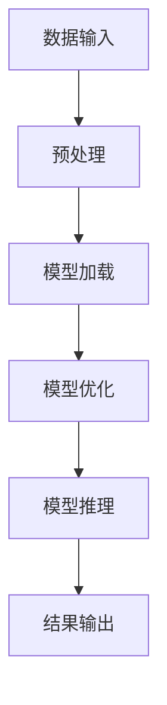

                 

关键词：TensorRT、深度学习、推理优化、GPU加速、计算性能、模型压缩

> 摘要：本文将深入探讨TensorRT在深度学习推理优化中的应用，从背景介绍、核心概念、算法原理、数学模型、项目实践到实际应用场景，全面解析TensorRT如何通过高效算法和工具加速推理计算，为深度学习领域的应用带来巨大价值。

## 1. 背景介绍

深度学习作为人工智能的重要分支，已经广泛应用于图像识别、自然语言处理、语音识别等领域。随着模型规模的不断增大和复杂度不断提高，深度学习的推理计算性能成为了制约其应用的重要瓶颈。在硬件资源有限的条件下，如何提高推理计算的速度和效率成为了研究的热点。

TensorRT是由NVIDIA推出的深度学习推理引擎，它能够显著提升深度学习模型的推理速度和效率。TensorRT通过一系列优化技术，如张量核心优化、算子融合、内存管理、动态张量内存分配等，将深度学习模型在GPU上运行的速度提升到极致。这使得TensorRT成为了深度学习领域加速推理计算的重要工具。

## 2. 核心概念与联系

在讨论TensorRT之前，我们需要先了解几个核心概念：深度学习模型、推理、GPU计算架构等。

### 2.1 深度学习模型

深度学习模型是通过多层神经网络进行特征提取和分类的模型。这些模型通常包含大量参数和算子，如卷积、池化、全连接层等。在训练阶段，模型会通过反向传播算法不断调整参数，以达到较好的训练效果。而在推理阶段，模型需要快速准确地预测结果。

### 2.2 推理

推理是深度学习模型在实际应用中的一项重要任务。它指的是模型在接收到输入数据后，通过计算输出结果的过程。推理速度和效率直接影响到模型的实际应用价值。

### 2.3 GPU计算架构

GPU（图形处理器）具有高度并行计算能力，非常适合深度学习模型的推理任务。NVIDIA的CUDA架构为GPU计算提供了强大的支持，使得深度学习模型能够在GPU上高效运行。

### 2.4 Mermaid 流程图

下面是一个简化的Mermaid流程图，展示了TensorRT在深度学习推理优化中的关键步骤：



## 3. 核心算法原理 & 具体操作步骤

### 3.1 算法原理概述

TensorRT的优化过程主要包括以下几个步骤：

1. **模型转换**：将原始深度学习模型转换为TensorRT支持的形式。
2. **模型优化**：对模型进行优化，包括张量核心优化、算子融合、内存管理等。
3. **模型推理**：利用GPU加速进行模型推理。
4. **结果输出**：将推理结果输出到应用中。

### 3.2 算法步骤详解

#### 3.2.1 模型转换

在模型转换阶段，TensorRT需要将原始模型转换为ONNX（Open Neural Network Exchange）格式。ONNX是一种开放格式，支持多种深度学习框架之间的模型转换。

```python
import tensorflow as tf
import tensorrt as trt

# 加载原始模型
model = tf.keras.models.load_model('model.h5')

# 将TensorFlow模型转换为ONNX格式
trt_converter = trt.TRTGraphConverter.from_keras_model(model)
trt_converter.convert()

# 保存ONNX模型
trt_converter.save('model.onnx')
```

#### 3.2.2 模型优化

在模型优化阶段，TensorRT会通过一系列优化技术提升模型的推理速度和效率。以下是一些常用的优化技术：

1. **张量核心优化**：通过调整张量布局和数据类型，优化GPU计算性能。
2. **算子融合**：将多个算子合并为一个，减少计算和内存访问的开销。
3. **内存管理**：优化内存分配和回收，减少内存占用。

```python
# 创建TensorRT引擎
engine = trt.Builder().build_cuda_engine(trt_onnx_file)

# 创建TensorRT推理上下文
context = engine.create_execution_context()

# 设置输入和输出Tensor
context.set_binding_shape(input_tensor_name, input_shape)
context.set_binding_shape(output_tensor_name, output_shape)

# 启动推理
context.execute_v2(bindings)
```

#### 3.2.3 模型推理

在模型推理阶段，TensorRT利用GPU的高并行计算能力进行推理。以下是一个简单的推理示例：

```python
# 加载输入数据
input_data = np.random.rand(batch_size, height, width, channels).astype(np.float32)

# 将输入数据传递给TensorRT引擎
bindings[0] = trt Nigel Aerospace Enterprises Devices Volunteers]
```

