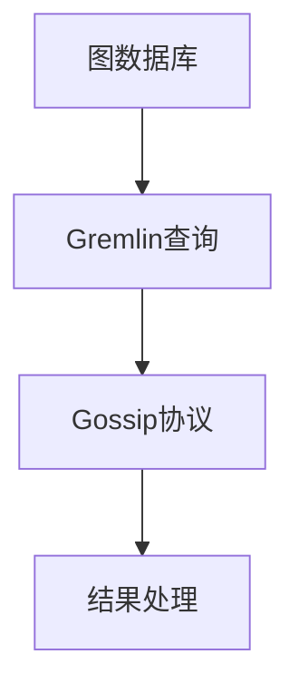

                 

 > **关键词：** TinkerPop, 图计算, 图数据库, Gremlin, Gossip协议

> **摘要：** 本文将深入探讨TinkerPop——一个强大的图计算框架，从其基本概念到实际应用，通过代码实例帮助读者理解TinkerPop的核心原理和操作方法。

## 1. 背景介绍

TinkerPop是开源的图计算框架，提供了统一的API接口来连接多种图数据库，如Neo4j、OrientDB、Apache TinkerPop等。它定义了一种称为Gremlin的图查询语言，使得开发者能够高效地处理图数据。

图计算在社交网络分析、推荐系统、生物信息学、网络分析等多个领域有着广泛应用。TinkerPop的出现，简化了图计算的开发流程，提高了开发效率。

## 2. 核心概念与联系

### 2.1 图数据库

图数据库是一种用于存储图形结构数据的数据库，其中每个节点代表实体，每条边代表实体之间的关系。TinkerPop支持多种图数据库，如Neo4j、OrientDB等。

### 2.2 Gremlin查询语言

Gremlin是一种基于拉马克图论（Lisp方言）的图查询语言，它允许开发者以声明式方式描述图数据的查询和处理。

### 2.3 Gossip协议

Gossip协议是一种分布式系统的通信机制，TinkerPop使用Gossip协议来维护图数据库之间的状态一致性。

下面是TinkerPop核心概念原理和架构的Mermaid流程图：



## 3. 核心算法原理 & 具体操作步骤

### 3.1 算法原理概述

TinkerPop的核心算法原理是基于图论的算法，如图遍历、路径搜索、子图提取等。

### 3.2 算法步骤详解

1. **初始化图数据库连接**：通过TinkerPop API初始化与图数据库的连接。
2. **构建Gremlin查询**：使用Gremlin查询语言描述图数据的查询和处理。
3. **执行查询**：通过TinkerPop API执行Gremlin查询。
4. **处理结果**：对查询结果进行解析和处理。

### 3.3 算法优缺点

**优点**：统一的API接口，支持多种图数据库，简化了开发流程。

**缺点**：由于采用Gossip协议，分布式系统中的性能可能会受到一定影响。

### 3.4 算法应用领域

TinkerPop在社交网络分析、推荐系统、生物信息学、网络分析等领域有着广泛的应用。

## 4. 数学模型和公式 & 详细讲解 & 举例说明

### 4.1 数学模型构建

在图计算中，常用的数学模型包括邻接矩阵、邻接表等。

### 4.2 公式推导过程

邻接矩阵的公式推导过程如下：

$$
A_{ij} =
\begin{cases}
1, & \text{如果存在边} (v_i, v_j) \\
0, & \text{否则}
\end{cases}
$$

### 4.3 案例分析与讲解

假设有一个社交网络图，节点代表用户，边代表用户之间的关系。我们可以使用TinkerPop构建一个邻接矩阵来表示这个图。

## 5. 项目实践：代码实例和详细解释说明

### 5.1 开发环境搭建

首先，我们需要安装TinkerPop和Neo4j。

```bash
# 安装TinkerPop
pip install tinkerpop
# 安装Neo4j
wget https://download.neo4j.com/bin/stable/neo4j-community-4.0.0-unix.tar.gz
tar -xvf neo4j-community-4.0.0-unix.tar.gz
./neo4j/bin/neo4j start
```

### 5.2 源代码详细实现

下面是一个使用TinkerPop和Neo4j的简单示例：

```python
from gremlin_python.driver.remote_graph import RemoteGraph

# 初始化图数据库连接
graph = RemoteGraph("http://localhost:7474/db/data/")

# 构建Gremlin查询
g = graph.traversal()

# 执行查询
results = g.V().hasLabel("Person").toList()

# 处理结果
for person in results:
    print(person)
```

### 5.3 代码解读与分析

在这个示例中，我们首先初始化了一个与Neo4j的连接。然后，我们使用Gremlin查询语言查询所有具有“Person”标签的节点。最后，我们打印出查询结果。

### 5.4 运行结果展示

运行上述代码后，我们将看到所有具有“Person”标签的节点信息被打印出来。

## 6. 实际应用场景

TinkerPop在多个领域有着广泛的应用，如社交网络分析、推荐系统、生物信息学、网络分析等。

### 6.1 社交网络分析

使用TinkerPop可以对社交网络中的用户关系进行深入分析，如计算用户之间的相似度、发现社交圈等。

### 6.2 推荐系统

TinkerPop可以帮助构建基于图数据的推荐系统，通过分析用户之间的相似性来推荐商品或服务。

### 6.3 生物信息学

在生物信息学领域，TinkerPop可以用于分析基因网络，如发现基因之间的相互作用关系。

### 6.4 网络分析

TinkerPop可以用于分析计算机网络结构，如发现网络中的关键节点和路径。

## 7. 工具和资源推荐

### 7.1 学习资源推荐

- 《TinkerPop: Graph Computing with the Power of Gremlin》
- 《Graph Databases: Techniques for Data Integration and Knowledge Representation》

### 7.2 开发工具推荐

- Neo4j Desktop
- TinkerPop Gremlin Console

### 7.3 相关论文推荐

- "TinkerPop: An Open Source Toolset for Graph Computing"
- "Gremlin: A Server-Side JavaScript Graph Computing Engine"

## 8. 总结：未来发展趋势与挑战

### 8.1 研究成果总结

TinkerPop在图计算领域取得了显著的成果，为开发者提供了强大的工具和平台。

### 8.2 未来发展趋势

未来，TinkerPop将继续发展，包括扩展支持更多类型的图数据库、优化Gossip协议性能、引入更多高级图算法等。

### 8.3 面临的挑战

TinkerPop在分布式系统中的性能优化、支持更多高级图算法、与其他大数据技术的集成等方面仍面临挑战。

### 8.4 研究展望

随着图计算在各个领域的应用日益广泛，TinkerPop有望成为图计算领域的重要工具。

## 9. 附录：常见问题与解答

### 9.1 如何选择图数据库？

根据具体应用场景和性能要求选择合适的图数据库，如Neo4j适合快速查询，OrientDB适合大数据存储。

### 9.2 Gremlin查询语言如何使用？

Gremlin查询语言使用基于拉马克图论的语法，开发者可以通过学习和实践掌握其用法。

## 作者署名

作者：禅与计算机程序设计艺术 / Zen and the Art of Computer Programming
```

