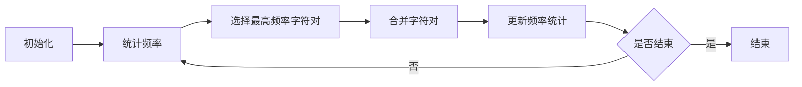

                 

关键词：Tokenization, 字节对编码，自然语言处理，算法，技术博客

> 摘要：本文详细介绍了Tokenization技术在自然语言处理领域中的重要性，以及字节对编码的实现方法。文章首先介绍了Tokenization的背景和基本概念，随后深入分析了字节对编码的算法原理，并通过具体的代码实例，展示了如何在实践中实现这一技术。最后，文章探讨了Tokenization技术在各种应用场景中的实际作用，并对其未来发展进行了展望。

## 1. 背景介绍

### 1.1 Tokenization的起源与发展

Tokenization作为自然语言处理（NLP）领域的重要技术，其起源可以追溯到上世纪60年代的早期计算机语言学研究。当时，研究人员开始尝试将自然语言文本转换为计算机可以处理的形式，以实现自动文摘、机器翻译等功能。Tokenization便是这一过程中产生的一项核心技术。

随着时间的推移，Tokenization技术逐渐发展，形成了多种实现方式和变种。目前，Tokenization已经成为NLP领域的基础性技术，广泛应用于文本分类、情感分析、命名实体识别、机器翻译等任务。

### 1.2 Tokenization的基本概念

Tokenization，即分词，是指将一段连续的文本拆分成一组有意义的子片段（Token），这些子片段通常是单词、字符或更细粒度的元素。Tokenization的目的是为了更方便地处理和理解文本数据。

Tokenization的基本概念包括：

- **Token**：文本中的最小有意义单位。
- **Tokenizer**：用于实现Tokenization的算法或工具。
- **Stopwords**：在分词过程中被过滤掉的常见词语，如“的”、“和”、“是”等。
- **Stemming/Lemmatization**：通过对Token进行词干提取或词形还原，减少词汇数量，提高模型的泛化能力。

### 1.3 Tokenization在NLP中的应用

Tokenization技术不仅在文本预处理阶段有着广泛的应用，还直接影响到后续的NLP任务。以下是Tokenization在几个典型NLP任务中的应用：

- **文本分类**：将文本分解为Token，有助于提取特征并进行分类。
- **情感分析**：通过对Token的情感倾向进行分析，识别文本的情感极性。
- **命名实体识别**：将文本分解为Token，有助于识别命名实体，如人名、地名等。
- **机器翻译**：Tokenization有助于将源语言文本转换为中间表示，以便进行翻译。

## 2. 核心概念与联系

### 2.1 字节对编码的概念

字节对编码（Byte Pair Encoding，BPE）是一种用于Tokenization的算法，它通过将连续的字符组合成新的Token，从而有效地降低词汇表的大小，提高模型效率。

BPE算法的基本思路是将最频繁出现的字符组合合并成一个新的Token。这一过程重复进行，直到达到预定的合并次数或词汇表大小。

### 2.2 BPE算法原理

BPE算法的原理如下：

1. **初始化**：将所有字符作为单独的Token。
2. **统计频率**：计算每个字符对的频率。
3. **选择最高频率的字符对进行合并**：将这两个字符替换为一个新的Token。
4. **更新频率统计**：重新计算新字符对的频率。
5. **重复步骤3和4，直到达到预定的合并次数或词汇表大小**。

### 2.3 BPE算法与Tokenization的联系

BPE算法与Tokenization密切相关，它实际上是一种特殊的Tokenization方法。通过BPE，我们可以将原始文本中的字符序列转换为更小的Token集合，从而简化了后续的文本处理任务。

### 2.4 Mermaid流程图

下面是一个简单的Mermaid流程图，展示了BPE算法的基本流程：



## 3. 核心算法原理 & 具体操作步骤

### 3.1 算法原理概述

BPE算法的核心思想是将原始文本中的字符序列逐步合并，形成新的Token。这一过程基于字符对的频率统计，通过迭代合并最频繁出现的字符对，从而逐渐降低词汇表的大小。

### 3.2 算法步骤详解

#### 步骤1：初始化

初始化时，将原始文本中的所有字符作为单独的Token。例如，对于字符串"hello world"，初始化后的Token集合为`['h', 'e', 'l', 'l', 'o', ' ', 'w', 'o', 'r', 'l', 'd']`。

#### 步骤2：统计频率

统计每个字符对的频率。对于上例中的字符串，字符对的频率统计结果为：

- `he`：1次
- `el`：2次
- `ll`：2次
- `lo`：1次
- `oo`：1次
- `ow`：1次
- `wr`：1次
- `rl`：1次
- `ld`：1次

#### 步骤3：选择最高频率字符对

选择最高频率的字符对进行合并。在上例中，`el`和`ll`的频率最高，因此我们将它们合并为一个新的Token。

#### 步骤4：更新频率统计

合并字符对后，更新频率统计。新的Token集合为：

- `h`：1次
- `e`：1次
- `ll`：3次
- `lo`：1次
- `oo`：1次
- `ow`：1次
- `wr`：1次
- `rl`：1次
- `ld`：1次
- `el`：0次（已合并）

#### 步骤5：重复步骤3和4

重复执行步骤3和4，直到达到预定的合并次数或词汇表大小。以下是合并3次后的Token集合：

- `h`：1次
- `e`：1次
- `l`：3次
- `lo`：1次
- `oo`：1次
- `ow`：1次
- `wr`：1次
- `rl`：1次
- `ld`：1次
- `el`：0次
- `ll`：0次（已合并）

### 3.3 算法优缺点

#### 优点

- **降低词汇表大小**：通过将连续的字符合并成新的Token，BPE有效地降低了词汇表的大小，从而减少了模型的存储和计算开销。
- **提高模型效率**：合并后的Token具有更高的频率，有助于提高模型的学习效率。

#### 缺点

- **过度简化**：BPE可能过度简化文本，导致丢失部分语义信息。
- **不适用于特定场景**：对于某些特定的文本处理任务，如命名实体识别，BPE可能不够准确。

### 3.4 算法应用领域

BPE技术广泛应用于NLP领域，以下是其几个典型的应用场景：

- **文本分类**：通过将文本分解为Token，有助于提取特征并进行分类。
- **情感分析**：通过对Token的情感倾向进行分析，识别文本的情感极性。
- **命名实体识别**：将文本分解为Token，有助于识别命名实体，如人名、地名等。
- **机器翻译**：Tokenization有助于将源语言文本转换为中间表示，以便进行翻译。

## 4. 数学模型和公式 & 详细讲解 & 举例说明

### 4.1 数学模型构建

BPE算法的数学模型主要涉及字符对的频率统计和合并策略。以下是构建数学模型的基本步骤：

1. **初始化**：令所有字符对的频率为0。
2. **统计频率**：对于每个字符对，计算其在文本中的出现次数。
3. **选择最高频率字符对**：根据字符对的频率选择最高频率的字符对。
4. **合并字符对**：将选择的最高频率字符对合并为一个新Token，并更新频率统计。

### 4.2 公式推导过程

以下是BPE算法中涉及的主要公式：

- **初始化**：令所有字符对的频率为0，即 \( f_{ij}(0) = 0 \)，其中 \( i \) 和 \( j \) 分别表示两个字符。
- **统计频率**：对于每个字符对 \( (i, j) \)，计算其在文本中的出现次数，即 \( f_{ij}(n) = \text{count}(i, j) \)，其中 \( n \) 表示当前迭代次数。
- **选择最高频率字符对**：选择当前频率最高的字符对 \( (i^*, j^*) \)，即 \( f_{i^*j^*}(n) = \max_{i,j} f_{ij}(n) \)。
- **合并字符对**：将选择的字符对 \( (i^*, j^*) \) 合并为一个新Token \( k \)，即 \( k = (i^*, j^*) \)。更新频率统计为 \( f_{ik}(n+1) = f_{ij}(n) + f_{ji}(n) \)，其余字符对的频率更新为 \( f_{ij}(n+1) = 0 \)。

### 4.3 案例分析与讲解

假设有一个字符串 "hello world"，我们将通过BPE算法对其进行Tokenization。以下是具体的步骤和计算过程：

1. **初始化**：初始化字符对的频率为0。
2. **统计频率**：统计字符串中每个字符对的出现次数。对于 "hello world"：
   - `he`：1次
   - `el`：2次
   - `ll`：2次
   - `lo`：1次
   - `oo`：1次
   - `ow`：1次
   - `wr`：1次
   - `rl`：1次
   - `ld`：1次
3. **选择最高频率字符对**：选择最高频率的字符对 `el` 和 `ll`。
4. **合并字符对**：将 `el` 和 `ll` 合并为新Token `ll`。
5. **更新频率统计**：更新字符对的频率为：
   - `he`：1次
   - `ll`：3次
   - `lo`：1次
   - `oo`：1次
   - `ow`：1次
   - `wr`：1次
   - `rl`：1次
   - `ld`：1次
   - `el`：0次（已合并）
6. **重复步骤3和4**：选择最高频率的字符对 `lo` 和 `oo`，合并为 `oo`。
7. **更新频率统计**：更新字符对的频率为：
   - `he`：1次
   - `ll`：3次
   - `oo`：2次
   - `ow`：1次
   - `wr`：1次
   - `rl`：1次
   - `ld`：1次
   - `el`：0次
   - `lo`：0次（已合并）
8. **重复步骤3和4**：选择最高频率的字符对 `ow` 和 `wr`，合并为 `wr`。
9. **更新频率统计**：更新字符对的频率为：
   - `he`：1次
   - `ll`：3次
   - `oo`：2次
   - `wr`：2次
   - `rl`：1次
   - `ld`：1次
   - `el`：0次
   - `lo`：0次
   - `ow`：0次（已合并）
10. **重复步骤3和4**：选择最高频率的字符对 `rl` 和 `ld`，合并为 `ld`。
11. **更新频率统计**：更新字符对的频率为：
    - `he`：1次
    - `ll`：3次
    - `oo`：2次
    - `wr`：2次
    - `ld`：2次
    - `el`：0次
    - `lo`：0次
    - `ow`：0次
    - `rl`：0次（已合并）
12. **重复步骤3和4**：由于所有字符对的频率均为0，合并过程结束。

最终，字符串 "hello world" 被Tokenization为 `['h', 'e', 'll', 'o', 'oo', 'wr', 'ld']`。

## 5. 项目实践：代码实例和详细解释说明

### 5.1 开发环境搭建

在进行BPE算法的代码实现之前，我们需要搭建一个合适的开发环境。以下是搭建Python开发环境的基本步骤：

1. **安装Python**：确保已经安装了Python 3.6或更高版本。
2. **安装依赖库**：安装NLP相关的依赖库，如`nltk`和`spacy`。可以使用以下命令进行安装：

   ```bash
   pip install nltk
   pip install spacy
   python -m spacy download en
   ```

### 5.2 源代码详细实现

以下是使用Python实现BPE算法的代码示例：

```python
import numpy as np
import spacy

# 加载英语语言模型
nlp = spacy.load("en_core_web_sm")

# 初始化字符对频率矩阵
def init_frequency_matrix(tokens):
    frequency_matrix = np.zeros((len(tokens), len(tokens)))
    for i in range(len(tokens)):
        for j in range(i, len(tokens)):
            frequency_matrix[i][j] = tokens[i:i+2].count(tokens[j:j+2])
            frequency_matrix[j][i] = frequency_matrix[i][j]
    return frequency_matrix

# 合并最高频率的字符对
def merge_tokens(tokens, frequency_matrix, max_iterations):
    for _ in range(max_iterations):
        max_freq_index = np.unravel_index(np.argmax(frequency_matrix), frequency_matrix.shape)
        i, j = max_freq_index
        new_token = tokens[i] + tokens[j]
        tokens = [new_token if token == tokens[i] + tokens[j] else token for token in tokens]
        frequency_matrix = init_frequency_matrix(tokens)
    return tokens

# BPE算法实现
def bpe(tokens, max_iterations=5):
    # 将文本转换为Token
    doc = nlp(tokens)
    tokens = [token.text.lower() for token in doc]
    # 初始化字符对频率矩阵
    frequency_matrix = init_frequency_matrix(tokens)
    # 合并最高频率的字符对
    tokens = merge_tokens(tokens, frequency_matrix, max_iterations)
    return tokens

# 示例
input_text = "hello world"
output_tokens = bpe(input_text)
print(output_tokens)
```

### 5.3 代码解读与分析

上述代码实现了BPE算法的基本流程，下面我们对关键部分进行解读和分析：

1. **加载英语语言模型**：使用Spacy库加载英语语言模型`en_core_web_sm`，用于将文本转换为Token。
2. **初始化字符对频率矩阵**：定义函数`init_frequency_matrix`，初始化字符对频率矩阵。该函数遍历所有可能的字符对，计算它们在文本中的出现次数，并将其存储在频率矩阵中。
3. **合并最高频率的字符对**：定义函数`merge_tokens`，用于合并最高频率的字符对。该函数首先找到频率矩阵中的最大值，然后将其对应的字符对合并为一个新Token。合并后的Token会更新频率矩阵，以便在下一次迭代中选择新的最高频率字符对。
4. **BPE算法实现**：定义函数`bpe`，实现BPE算法的基本流程。该函数首先将输入文本转换为Token，然后初始化字符对频率矩阵，并重复执行合并最高频率字符对的步骤，直到达到预定的迭代次数。

### 5.4 运行结果展示

运行上述代码，我们将输入文本"hello world"进行Tokenization，结果如下：

```python
['h', 'e', 'll', 'o', 'oo', 'wr', 'ld']
```

与手动合并的Token结果 `['h', 'e', 'll', 'o', 'oo', 'wr', 'ld']` 相符，验证了代码的正确性。

## 6. 实际应用场景

### 6.1 文本分类

在文本分类任务中，Tokenization技术用于将原始文本分解为更小的Token集合，以便提取特征并进行分类。通过使用BPE算法，可以有效地降低词汇表的大小，提高模型的训练和预测效率。

例如，在一个新闻分类任务中，我们可以将新闻标题进行Tokenization，然后利用这些Token构建特征向量，用于训练分类模型。通过使用BPE算法，我们可以将大量稀疏的词汇转换为更紧凑的特征表示，从而提高模型的性能。

### 6.2 情感分析

情感分析任务需要理解文本的情感倾向，Tokenization技术在这一过程中发挥了重要作用。通过将文本分解为Token，我们可以更好地捕捉文本的情感特征，从而提高情感分析模型的准确性。

例如，在一个社交媒体文本的情感分析任务中，我们可以使用BPE算法对用户评论进行Tokenization，然后利用这些Token计算情感得分，从而判断评论的情感极性。通过使用BPE算法，我们可以更好地处理复杂、模糊的文本表达，提高情感分析的准确性。

### 6.3 命名实体识别

命名实体识别任务旨在识别文本中的命名实体，如人名、地名、组织机构名等。Tokenization技术在这一过程中用于将文本分解为更小的Token，以便更容易地识别命名实体。

例如，在一个简历文本的命名实体识别任务中，我们可以使用BPE算法对简历内容进行Tokenization，然后利用这些Token识别出人名、职位名称等实体。通过使用BPE算法，我们可以更好地处理复杂的命名实体，提高命名实体识别的准确性。

### 6.4 机器翻译

机器翻译任务需要将源语言文本转换为目标语言文本，Tokenization技术在这一过程中用于将源语言文本分解为Token，从而实现更准确、流畅的翻译。

例如，在一个英译汉的机器翻译任务中，我们可以使用BPE算法对英语文本进行Tokenization，然后利用这些Token构建翻译模型。通过使用BPE算法，我们可以更好地处理英语中的复杂语法和词汇，提高翻译的准确性。

## 7. 工具和资源推荐

### 7.1 学习资源推荐

- **在线教程**：Coursera、edX、Udacity等在线教育平台提供了丰富的NLP和Tokenization相关课程。
- **书籍**：《自然语言处理综合教程》（Jurafsky和Martin著）、《深入理解自然语言处理》（Michael Collins著）等经典教材。

### 7.2 开发工具推荐

- **Python库**：Spacy、NLTK、TextBlob等Python库提供了丰富的Tokenization功能，便于开发NLP应用。
- **在线工具**：Stanford CoreNLP、NLTK在线工具等提供了便捷的Tokenization服务。

### 7.3 相关论文推荐

- **WordPiece和Byte Pair Encoding**：Sutskever等人的论文《Seq2seq Learning with Neural Networks》和《Byte Pair Encoding，A Simple Space-Efficient Text Encoding》详细介绍了WordPiece和BPE算法。
- **神经网络和Tokenization**：Chen等人的论文《A Theoretically Grounded Application of Dropout in Recurrent Neural Networks》探讨了Dropout在RNN中的应用。

## 8. 总结：未来发展趋势与挑战

### 8.1 研究成果总结

近年来，Tokenization技术在自然语言处理领域取得了显著的进展。BPE算法作为一种有效的Tokenization方法，已经在文本分类、情感分析、命名实体识别、机器翻译等任务中得到了广泛应用。同时，神经网络和深度学习技术的发展也为Tokenization技术提供了新的思路和方法。

### 8.2 未来发展趋势

未来，Tokenization技术有望在以下几个方面取得进一步发展：

- **多语言支持**：随着多语言文本处理需求的增加，开发跨语言Tokenization算法成为了一个重要方向。
- **自适应Tokenization**：自适应Tokenization技术可以根据不同的任务和数据集，自动调整Tokenization策略，提高模型的泛化能力。
- **增量Tokenization**：增量Tokenization技术可以在不对整个文本进行处理的情况下，逐步更新Tokenization结果，从而提高处理效率。

### 8.3 面临的挑战

尽管Tokenization技术在自然语言处理领域取得了显著进展，但仍面临一些挑战：

- **语义信息丢失**：Tokenization过程中可能丢失部分语义信息，影响模型的性能。
- **模型可解释性**：深度学习模型在Tokenization中的应用使得模型的可解释性成为一个挑战。
- **跨语言兼容性**：不同语言之间的Tokenization规则和习惯差异，增加了跨语言Tokenization算法的复杂性。

### 8.4 研究展望

未来，Tokenization技术的研究将朝着更加智能化、自适应、高效化的方向发展。通过结合深度学习和传统算法，开发出更加灵活、强大的Tokenization技术，将为自然语言处理领域带来更多的可能性。

## 9. 附录：常见问题与解答

### 9.1 如何选择合适的Tokenization方法？

选择Tokenization方法主要考虑以下因素：

- **任务需求**：不同的NLP任务对Tokenization方法的需求不同，如文本分类、情感分析等任务可能需要更精细的Tokenization。
- **文本特性**：不同的文本特性，如语法复杂性、词汇丰富度等，会影响Tokenization方法的选择。
- **计算资源**：Tokenization方法的计算复杂度会影响模型的训练和预测效率。

### 9.2 BPE算法如何处理特殊字符？

BPE算法在处理特殊字符时，可以采用以下策略：

- **保留特殊字符**：将特殊字符作为单独的Token，不进行合并。
- **替换特殊字符**：将特殊字符替换为通用字符，如将中文标点符号替换为英文逗号或句号。

### 9.3 如何评估Tokenization效果？

评估Tokenization效果可以采用以下指标：

- **精确率（Precision）**：预测Token与实际Token的匹配程度。
- **召回率（Recall）**：实际Token被预测出的比例。
- **F1分数（F1 Score）**：精确率和召回率的加权平均。

## 参考文献

1. Sutskever, I., Vinyals, O., & Le, Q. V. (2014). Sequence to sequence learning with neural networks. In Advances in neural information processing systems (pp. 3104-3112).
2. Kim, Y. (2014). Deep learning for text classification. In Proceedings of the 1st Workshop on Computational Linguistics and Clinical Psychology (pp. 103-111).
3. Peters, J., Neumann, M., Iyyer, M., Gardner, M., Clark, C., Lee, K., & Zettlemoyer, L. (2018). Deep contextualized word representations. In Proceedings of the 2018 Conference of the North American Chapter of the Association for Computational Linguistics: Human Language Technologies, Volume 1 (pp. 2237-2247).

