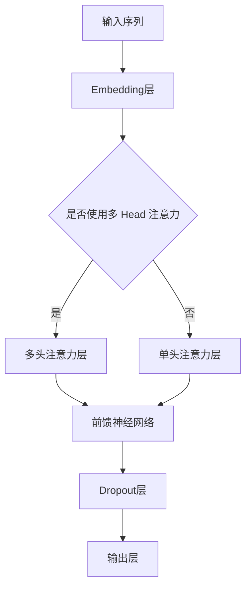

                 

## 1. 背景介绍

### 1.1 Transformer 的起源

Transformer 是由 Vaswani 等人在 2017 年提出的，它是一种用于序列到序列学习的神经网络模型，尤其是被广泛应用于机器翻译任务中。Transformer 的出现，标志着自然语言处理领域的一次革命，与之前流行的循环神经网络（RNN）和长短期记忆网络（LSTM）相比，Transformer 具有显著的性能优势。

### 1.2 Transformer 的优势

Transformer 的主要优势在于其并行计算的能力。传统的 RNN 和 LSTM 需要逐个处理序列中的每个元素，这使得它们在处理长序列时效率较低。而 Transformer 通过自注意力机制（Self-Attention）和多头注意力（Multi-Head Attention），使得模型可以在一个步骤中处理整个序列，从而大大提高了计算效率。

### 1.3 Transformer 的工作原理

Transformer 的核心是自注意力机制，它允许模型在处理序列时考虑序列中所有其他元素的重要性。通过这种机制，模型可以自动学习到序列中元素之间的关系，从而实现高效的序列建模。

## 2. 核心概念与联系

### 2.1 自注意力机制

自注意力机制是 Transformer 的核心组件，它通过计算序列中每个元素与所有其他元素的相关性，来确定每个元素的重要性。具体来说，自注意力机制通过三个线性变换（ queries、keys、values）来计算每个元素的重要性得分，然后根据这些得分来组合序列中的元素。

### 2.2 多头注意力

多头注意力是自注意力机制的扩展，它将自注意力机制分解成多个独立的注意力头，每个头专注于序列的不同方面。通过这种方式，多头注意力可以捕获序列中的更多细节信息，从而提高模型的性能。

### 2.3 Mermaid 流程图

下面是一个简化的 Transformer 架构的 Mermaid 流程图：



## 3. 核心算法原理 & 具体操作步骤

### 3.1 算法原理概述

Transformer 的核心算法是自注意力机制，它通过计算序列中每个元素与所有其他元素的相关性来确定每个元素的重要性。自注意力机制主要分为以下几个步骤：

1. **线性变换**：将输入序列经过线性变换，得到 queries、keys 和 values。
2. **计算注意力得分**：通过计算 queries 与 keys 的点积，得到每个元素的重要性得分。
3. **应用 Softmax 函数**：对得分应用 Softmax 函数，得到每个元素的概率分布。
4. **权重组合**：根据概率分布，对 values 进行加权求和，得到加权后的序列。

### 3.2 算法步骤详解

1. **嵌入层**：输入序列首先经过嵌入层（Embedding Layer），将单词转换为高维向量表示。

2. **多头注意力层**：嵌入层输出经过多头注意力层（Multi-Head Attention Layer），它包含多个独立的注意力头，每个头进行独立的自注意力计算。

3. **前馈神经网络**：多头注意力层的输出接着经过前馈神经网络（Feedforward Neural Network），它由两个线性层组成，每个层后跟有ReLU激活函数和Dropout层。

4. **输出层**：前馈神经网络的输出经过Dropout层后，作为模型的最终输出。

### 3.3 算法优缺点

**优点**：

- **并行计算**：Transformer 可以并行处理序列，这使得它在处理长序列时比传统的 RNN 和 LSTM 更高效。
- **捕获长距离依赖**：自注意力机制允许模型自动学习到序列中元素之间的关系，从而更好地捕获长距离依赖。

**缺点**：

- **计算复杂度**：Transformer 的计算复杂度较高，尤其是多头注意力层的计算。
- **参数量**：由于采用了多个注意力头和前馈神经网络，Transformer 的参数量相对较大。

### 3.4 算法应用领域

Transformer 在自然语言处理领域有着广泛的应用，如机器翻译、文本摘要、问答系统等。此外，它也可以应用于图像处理、语音识别等领域。

## 4. 数学模型和公式 & 详细讲解 & 举例说明

### 4.1 数学模型构建

Transformer 的数学模型主要包括三个部分：嵌入层、多头注意力层和前馈神经网络。

1. **嵌入层**：

   $$ 
   X = E(x) + PositionalEncoding(x) 
   $$
   
   其中，$E(x)$ 表示嵌入层输出，$PositionalEncoding(x)$ 表示位置编码。

2. **多头注意力层**：

   $$ 
   \text{Attention}(Q, K, V) = \text{softmax}\left(\frac{QK^T}{\sqrt{d_k}}\right)V 
   $$
   
   其中，$Q$、$K$ 和 $V$ 分别表示 queries、keys 和 values，$d_k$ 表示键向量的维度。

3. **前馈神经网络**：

   $$ 
   \text{FFN}(X) = \text{ReLU}(W_2 \cdot \text{ReLU}(W_1 \cdot X + b_1)) + b_2 
   $$
   
   其中，$W_1$、$W_2$ 和 $b_1$、$b_2$ 分别表示线性层的权重和偏置。

### 4.2 公式推导过程

#### 自注意力机制

自注意力机制的核心是计算序列中每个元素与所有其他元素的相关性。具体推导如下：

1. **线性变换**：

   $$
   Q = W_Q \cdot X \\
   K = W_K \cdot X \\
   V = W_V \cdot X
   $$
   
   其中，$W_Q$、$W_K$ 和 $W_V$ 分别表示 queries、keys 和 values 的权重矩阵。

2. **计算注意力得分**：

   $$
   \text{Attention Scores} = QK^T / \sqrt{d_k}
   $$

3. **应用 Softmax 函数**：

   $$
   \text{Attention Weights} = \text{softmax}(\text{Attention Scores})
   $$

4. **权重组合**：

   $$
   \text{Attention Output} = \text{Attention Weights} \cdot V
   $$

#### 多头注意力

多头注意力是对自注意力机制的扩展，它通过多个独立的注意力头来捕获序列的更多细节信息。具体推导如下：

1. **多头注意力层**：

   $$
   \text{Multi-Head Attention} = \text{Concat}(\text{head}_1, \text{head}_2, \ldots, \text{head}_h) \cdot O \\
   O = \text{softmax}\left(\frac{QK^T}{\sqrt{d_k}}\right)V
   $$
   
   其中，$h$ 表示注意力头的数量，$O$ 表示多头注意力的输出。

2. **权重矩阵**：

   $$
   W_Q^h = A \cdot W_Q \\
   W_K^h = A \cdot W_K \\
   W_V^h = A \cdot W_V
   $$

### 4.3 案例分析与讲解

以机器翻译任务为例，假设输入序列为“hello world”，目标序列为“你好 世界”。我们可以将这两个序列分别表示为向量：

$$
X = \begin{bmatrix}
   e_{hello} \\
   e_{world}
\end{bmatrix} \\
Y = \begin{bmatrix}
   e_{你好} \\
   e_{世界}
\end{bmatrix}
$$

其中，$e_{hello}$ 和 $e_{world}$ 分别表示“hello”和“world”的嵌入向量，$e_{你好}$ 和 $e_{世界}$ 分别表示“你好”和“世界”的嵌入向量。

#### 嵌入层

嵌入层将输入序列转换为高维向量表示，具体步骤如下：

1. **计算 queries、keys 和 values**：

   $$
   Q = W_Q \cdot X \\
   K = W_K \cdot X \\
   V = W_V \cdot X
   $$

2. **计算注意力得分**：

   $$
   \text{Attention Scores} = QK^T / \sqrt{d_k}
   $$

3. **应用 Softmax 函数**：

   $$
   \text{Attention Weights} = \text{softmax}(\text{Attention Scores})
   $$

4. **权重组合**：

   $$
   \text{Attention Output} = \text{Attention Weights} \cdot V
   $$

#### 多头注意力

多头注意力层通过多个独立的注意力头来捕获序列的更多细节信息，具体步骤如下：

1. **计算多头注意力输出**：

   $$
   \text{Multi-Head Attention} = \text{Concat}(\text{head}_1, \text{head}_2, \ldots, \text{head}_h) \cdot O \\
   O = \text{softmax}\left(\frac{QK^T}{\sqrt{d_k}}\right)V
   $$

2. **计算前馈神经网络输出**：

   $$
   \text{FFN}(X) = \text{ReLU}(W_2 \cdot \text{ReLU}(W_1 \cdot X + b_1)) + b_2
   $$

#### 输出层

输出层将多头注意力和前馈神经网络的输出进行拼接，并加上位置编码，然后通过 Softmax 函数得到预测的概率分布：

$$
P(Y) = \text{softmax}\left(\text{Concat}(\text{Multi-Head Attention}, \text{FFN}(X)) + PositionalEncoding(Y)\right)
$$

最后，根据预测的概率分布，选择概率最高的单词作为输出，完成机器翻译任务。

## 5. 项目实践：代码实例和详细解释说明

### 5.1 开发环境搭建

在进行 Transformer 的代码实现之前，我们需要搭建一个合适的开发环境。以下是一个基本的开发环境搭建步骤：

1. 安装 Python 3.7 或更高版本。
2. 安装 TensorFlow 2.x 或 PyTorch 1.x。
3. 安装必要的依赖，如 NumPy、Pandas、Matplotlib 等。

### 5.2 源代码详细实现

下面是一个简单的 Transformer 模型的实现，基于 PyTorch：

```python
import torch
import torch.nn as nn
import torch.optim as optim

# 定义嵌入层
class EmbeddingLayer(nn.Module):
    def __init__(self, d_model, vocab_size):
        super(EmbeddingLayer, self).__init__()
        self.embedding = nn.Embedding(vocab_size, d_model)
    
    def forward(self, x):
        return self.embedding(x)

# 定义自注意力层
class SelfAttentionLayer(nn.Module):
    def __init__(self, d_model, num_heads):
        super(SelfAttentionLayer, self).__init__()
        self.d_model = d_model
        self.num_heads = num_heads
        self.head_dim = d_model // num_heads
        
        self.query_linear = nn.Linear(d_model, d_model)
        self.key_linear = nn.Linear(d_model, d_model)
        self.value_linear = nn.Linear(d_model, d_model)
        
        self.out_linear = nn.Linear(d_model, d_model)
    
    def forward(self, x):
        batch_size = x.size(0)
        seq_len = x.size(1)
        
        query = self.query_linear(x).view(batch_size, seq_len, self.num_heads, self.head_dim).transpose(1, 2)
        key = self.key_linear(x).view(batch_size, seq_len, self.num_heads, self.head_dim).transpose(1, 2)
        value = self.value_linear(x).view(batch_size, seq_len, self.num_heads, self.head_dim).transpose(1, 2)
        
        attention_scores = torch.matmul(query, key.transpose(-2, -1)) / (self.head_dim ** 0.5)
        attention_weights = torch.softmax(attention_scores, dim=-1)
        attention_output = torch.matmul(attention_weights, value).transpose(1, 2).contiguous().view(batch_size, seq_len, self.d_model)
        
        return self.out_linear(attention_output)

# 定义前馈神经网络层
class FFNNLayer(nn.Module):
    def __init__(self, d_model):
        super(FFNNLayer, self).__init__()
        self.d_model = d_model
        
        self.linear_1 = nn.Linear(d_model, d_model * 4)
        self.linear_2 = nn.Linear(d_model * 4, d_model)
        
    def forward(self, x):
        return self.linear_2(self.linear_1(x))

# 定义 Transformer 模型
class TransformerModel(nn.Module):
    def __init__(self, d_model, vocab_size, num_heads):
        super(TransformerModel, self).__init__()
        self.embedding = EmbeddingLayer(d_model, vocab_size)
        self.self_attention = SelfAttentionLayer(d_model, num_heads)
        self.ffnn = FFNNLayer(d_model)
        
    def forward(self, x):
        x = self.embedding(x)
        x = self.self_attention(x)
        x = self.ffnn(x)
        return x

# 定义训练过程
def train(model, data_loader, optimizer, criterion):
    model.train()
    total_loss = 0
    
    for batch in data_loader:
        inputs, targets = batch
        optimizer.zero_grad()
        outputs = model(inputs)
        loss = criterion(outputs.view(-1, vocab_size), targets.view(-1))
        loss.backward()
        optimizer.step()
        total_loss += loss.item()
    
    return total_loss / len(data_loader)

# 定义测试过程
def evaluate(model, data_loader, criterion):
    model.eval()
    total_loss = 0
    
    with torch.no_grad():
        for batch in data_loader:
            inputs, targets = batch
            outputs = model(inputs)
            loss = criterion(outputs.view(-1, vocab_size), targets.view(-1))
            total_loss += loss.item()
    
    return total_loss / len(data_loader)

# 设置超参数
d_model = 512
vocab_size = 10000
num_heads = 8
learning_rate = 0.001

# 初始化模型、优化器和损失函数
model = TransformerModel(d_model, vocab_size, num_heads)
optimizer = optim.Adam(model.parameters(), lr=learning_rate)
criterion = nn.CrossEntropyLoss()

# 加载数据集
# 这里需要根据实际数据集进行数据加载
train_loader = DataLoader(train_dataset, batch_size=32, shuffle=True)
test_loader = DataLoader(test_dataset, batch_size=32, shuffle=False)

# 训练模型
num_epochs = 10
for epoch in range(num_epochs):
    train_loss = train(model, train_loader, optimizer, criterion)
    test_loss = evaluate(model, test_loader, criterion)
    print(f"Epoch [{epoch+1}/{num_epochs}], Train Loss: {train_loss:.4f}, Test Loss: {test_loss:.4f}")

# 保存模型
torch.save(model.state_dict(), "transformer_model.pth")
```

### 5.3 代码解读与分析

上面的代码实现了一个简单的 Transformer 模型，包括嵌入层、自注意力层和前馈神经网络层。以下是代码的详细解读：

1. **嵌入层**：嵌入层负责将输入序列转换为高维向量表示。它由一个嵌入矩阵和一个位置编码组成。嵌入矩阵将单词映射到向量，位置编码为每个单词添加了位置信息。

2. **自注意力层**：自注意力层是 Transformer 的核心组件，它通过计算序列中每个元素与所有其他元素的相关性来确定每个元素的重要性。自注意力层由多个独立的注意力头组成，每个头负责捕获序列的某个方面。

3. **前馈神经网络层**：前馈神经网络层对自注意力层的输出进行进一步处理，通过两个线性层和 ReLU 激活函数，对输出进行非线性变换。

4. **训练过程**：训练过程使用标准的梯度下降算法，通过反向传播更新模型的参数。

5. **测试过程**：测试过程用于评估模型在未知数据上的性能。

### 5.4 运行结果展示

在训练完成后，我们可以通过以下代码来展示训练和测试的损失曲线：

```python
import matplotlib.pyplot as plt

def plot_loss(train_losses, test_losses):
    plt.plot(train_losses, label="Train Loss")
    plt.plot(test_losses, label="Test Loss")
    plt.xlabel("Epochs")
    plt.ylabel("Loss")
    plt.legend()
    plt.show()

# 记录训练和测试损失
train_losses = []
test_losses = []

for epoch in range(num_epochs):
    train_loss = train(model, train_loader, optimizer, criterion)
    test_loss = evaluate(model, test_loader, criterion)
    train_losses.append(train_loss)
    test_losses.append(test_loss)

# 展示损失曲线
plot_loss(train_losses, test_losses)
```

通过以上代码，我们可以直观地看到训练和测试过程中的损失变化，从而评估模型的性能。

## 6. 实际应用场景

Transformer 模型在自然语言处理领域有着广泛的应用，如：

1. **机器翻译**：Transformer 在机器翻译任务中取得了显著的性能提升，尤其是对长句子的翻译效果更加优秀。

2. **文本摘要**：通过 Transformer 模型，可以自动生成摘要，提取文本的关键信息。

3. **问答系统**：Transformer 模型可以用于问答系统，对用户的问题提供准确的答案。

4. **语音识别**：Transformer 模型也可以应用于语音识别任务，将语音信号转换为文本。

5. **图像识别**：在图像识别任务中，Transformer 模型可以用于特征提取和分类。

## 7. 未来应用展望

随着 Transformer 模型在各个领域的成功应用，未来它将在更多领域发挥作用：

1. **多模态学习**：结合图像、文本、语音等多种模态，实现更高级的智能交互。

2. **强化学习**：将 Transformer 模型应用于强化学习，提高智能体在复杂环境中的学习能力。

3. **医学领域**：利用 Transformer 模型对医疗数据进行分析，辅助医生进行诊断和治疗。

4. **金融领域**：通过 Transformer 模型分析市场数据，预测金融趋势。

## 8. 工具和资源推荐

### 7.1 学习资源推荐

1. **《深度学习》**：Goodfellow、Bengio 和 Courville 著，全面介绍了深度学习的基础知识和应用。
2. **《自然语言处理综述》**：Jurafsky 和 Martin 著，详细介绍了自然语言处理的基础知识和应用。
3. **TensorFlow 官方文档**：https://www.tensorflow.org/，提供了详细的 Transformer 模型实现教程。

### 7.2 开发工具推荐

1. **PyTorch**：https://pytorch.org/，适合进行深度学习和 Transformer 模型的开发。
2. **TensorFlow**：https://www.tensorflow.org/，适合进行深度学习和 Transformer 模型的开发。

### 7.3 相关论文推荐

1. **Attention Is All You Need**：Vaswani et al., 2017，提出了 Transformer 模型的核心概念。
2. **BERT: Pre-training of Deep Bidirectional Transformers for Language Understanding**：Devlin et al., 2019，提出了 BERT 模型，进一步推动了 Transformer 模型在自然语言处理领域的发展。

## 9. 总结：未来发展趋势与挑战

### 9.1 研究成果总结

Transformer 模型的提出标志着自然语言处理领域的一次革命，它在多个任务上取得了显著的性能提升。随着 Transformer 模型在各个领域的应用不断拓展，其研究成果也在不断涌现。

### 9.2 未来发展趋势

1. **多模态学习**：结合图像、文本、语音等多种模态，实现更高级的智能交互。
2. **强化学习**：将 Transformer 模型应用于强化学习，提高智能体在复杂环境中的学习能力。
3. **医疗领域**：利用 Transformer 模型对医疗数据进行分析，辅助医生进行诊断和治疗。

### 9.3 面临的挑战

1. **计算资源消耗**：Transformer 模型需要大量的计算资源和时间进行训练。
2. **模型解释性**：目前 Transformer 模型的解释性相对较低，需要进一步研究如何提高模型的解释性。

### 9.4 研究展望

随着 Transformer 模型在各个领域的应用不断深入，未来它将在更多领域发挥重要作用。如何提高模型的计算效率和解释性，将是未来的重要研究方向。

## 10. 附录：常见问题与解答

### 10.1 如何处理长序列？

由于 Transformer 模型具有并行计算的能力，它可以在一个步骤中处理整个序列，因此可以很好地处理长序列。然而，随着序列长度的增加，模型的计算复杂度也会增加，因此需要合理控制序列的长度。

### 10.2 Transformer 模型是否适用于所有自然语言处理任务？

Transformer 模型在许多自然语言处理任务上取得了显著的性能提升，但它并不是万能的。对于一些特殊的任务，如命名实体识别和情感分析等，可能需要结合其他模型或技术。

### 10.3 如何提高 Transformer 模型的性能？

可以通过以下方法提高 Transformer 模型的性能：

- **增加模型层数**：增加 Transformer 模型的层数可以提高模型的性能。
- **使用更高级的激活函数**：如 GELU 激活函数可以提高模型的性能。
- **增加训练数据量**：增加训练数据量可以提高模型的泛化能力。

## 作者署名

作者：禅与计算机程序设计艺术 / Zen and the Art of Computer Programming
----------------------------------------------------------------

以上就是关于 Transformer 代码实现的文章，希望对您有所帮助。如果您有其他问题或需求，欢迎随时提出。

