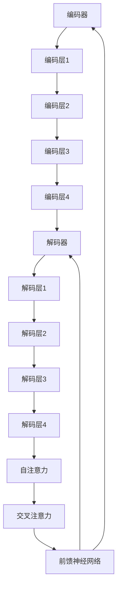

                 

关键词：Transformer, BART模型，架构，深度学习，自然语言处理，模型构建，实践应用

## 摘要

本文将深入探讨Transformer架构及其在自然语言处理领域的应用，重点介绍BART模型的具体架构和实现细节。通过对Transformer原理的详细解析，读者将了解如何构建强大的自然语言处理模型。文章还将通过实例展示BART模型在文本生成、翻译和序列填充等任务中的实际应用，帮助读者更好地理解Transformer架构的强大之处。最后，本文将对未来Transformer模型的发展趋势和面临的挑战进行展望，为读者提供进一步研究的方向。

## 1. 背景介绍

### Transformer的起源与发展

Transformer模型是由Google在2017年提出的一种全新的序列到序列模型，旨在解决自然语言处理（NLP）领域中的序列建模问题。相较于传统的循环神经网络（RNN）和长短期记忆网络（LSTM），Transformer模型引入了自注意力机制（Self-Attention），使得模型能够并行处理输入序列，大幅提升了训练速度和效果。

自提出以来，Transformer模型及其变体（如BERT、GPT等）在NLP领域取得了显著的成果，广泛应用于文本生成、机器翻译、摘要生成、问答系统等任务。其中，BERT（Bidirectional Encoder Representations from Transformers）和GPT（Generative Pre-trained Transformer）更是成为了NLP领域的标杆性模型。

### BART模型的出现与作用

BART（Bidirectional and Auto-Regressive Transformer）是由Uber AI在2019年提出的一种结合了Transformer双向编码器和自回归解码器的模型。BART模型旨在同时解决自然语言处理中的序列填充和序列生成任务，如文本生成、翻译和摘要生成。

BART模型的出现填补了Transformer模型在序列填充任务中的应用空白，通过结合双向编码器和自回归解码器的优势，使得模型在多种任务中表现优异。此外，BART模型还通过引入新的训练技巧，如使用伪句子（pseudo-sentence）和随机掩码（random masking），进一步提升了模型的性能。

### 自然语言处理的发展与应用

自然语言处理（NLP）是人工智能领域的一个重要分支，旨在让计算机理解和处理人类自然语言。随着深度学习技术的不断发展，NLP领域取得了许多突破性成果，如语音识别、机器翻译、文本分类、情感分析等。

近年来，基于Transformer的模型在NLP领域取得了显著的成果，如BERT在多项NLP任务中取得了最好的性能，GPT在文本生成方面展现了强大的能力。这些模型的提出和应用，使得自然语言处理技术在各个领域得到了广泛的应用，如智能客服、信息抽取、智能推荐等。

## 2. 核心概念与联系

在深入探讨BART模型之前，我们需要先了解Transformer架构及其核心概念。本节将介绍Transformer模型的基本原理和架构，并通过Mermaid流程图展示其关键组成部分。

### Transformer架构概述

Transformer模型的核心思想是使用自注意力机制（Self-Attention）来处理输入序列，从而实现序列到序列的映射。Transformer模型主要包括以下几个部分：

1. **编码器（Encoder）**：编码器负责处理输入序列，将序列编码成固定长度的向量表示。编码器由多个编码层（Encoder Layer）堆叠而成，每个编码层包含两个主要组件：自注意力机制（Self-Attention）和前馈神经网络（Feedforward Neural Network）。

2. **解码器（Decoder）**：解码器负责处理输出序列，将编码器生成的序列向量解码成目标序列。解码器也由多个解码层（Decoder Layer）堆叠而成，每个解码层包含两个主要组件：自注意力机制（Self-Attention）、交叉注意力机制（Cross-Attention）和前馈神经网络（Feedforward Neural Network）。

3. **自注意力机制（Self-Attention）**：自注意力机制是一种基于输入序列的权重分配机制，通过计算序列中每个词与其他词的相关性，为每个词分配不同的权重，从而实现序列的建模。

4. **交叉注意力机制（Cross-Attention）**：交叉注意力机制是解码器中的一个关键组件，用于计算编码器输出和当前解码器输入的相关性，从而为解码器生成目标序列提供指导。

5. **前馈神经网络（Feedforward Neural Network）**：前馈神经网络是一个简单的全连接神经网络，用于对自注意力机制和交叉注意力机制的计算结果进行进一步处理。

### Mermaid流程图

以下是一个简化的Mermaid流程图，展示了Transformer模型的关键组成部分：



通过上述Mermaid流程图，我们可以清晰地看到Transformer模型的核心组件及其相互关系。接下来，我们将进一步探讨BART模型的具体架构和实现细节。

## 3. 核心算法原理 & 具体操作步骤

### 3.1 算法原理概述

BART模型是一种基于Transformer的编码器-解码器架构，旨在同时解决序列填充和序列生成任务。其核心算法原理如下：

1. **编码器（Encoder）**：编码器负责将输入序列编码成固定长度的向量表示，为解码器生成目标序列提供指导。编码器通过多个编码层堆叠而成，每个编码层包含两个主要组件：自注意力机制（Self-Attention）和前馈神经网络（Feedforward Neural Network）。

2. **解码器（Decoder）**：解码器负责从编码器生成的向量表示中生成目标序列。解码器也通过多个解码层堆叠而成，每个解码层包含三个主要组件：自注意力机制（Self-Attention）、交叉注意力机制（Cross-Attention）和前馈神经网络（Feedforward Neural Network）。

3. **自注意力机制（Self-Attention）**：自注意力机制用于计算输入序列中每个词与其他词的相关性，为每个词分配不同的权重，从而实现序列的建模。

4. **交叉注意力机制（Cross-Attention）**：交叉注意力机制用于计算编码器输出和当前解码器输入的相关性，从而为解码器生成目标序列提供指导。

5. **前馈神经网络（Feedforward Neural Network）**：前馈神经网络是一个简单的全连接神经网络，用于对自注意力机制和交叉注意力机制的计算结果进行进一步处理。

### 3.2 算法步骤详解

#### 编码器

编码器的核心步骤如下：

1. **输入序列编码**：将输入序列编码成词向量表示，通常使用预训练的词嵌入层（如WordPiece或BERT）。

2. **多层编码**：将编码器分为多个编码层，每个编码层包含两个主要组件：自注意力机制和前馈神经网络。

3. **自注意力计算**：在每个编码层，通过自注意力机制计算输入序列中每个词与其他词的相关性，为每个词分配不同的权重。

4. **前馈神经网络**：对自注意力机制的计算结果进行进一步处理，通过前馈神经网络实现序列的建模。

#### 解码器

解码器的核心步骤如下：

1. **输入序列编码**：将输入序列编码成词向量表示，通常使用预训练的词嵌入层（如WordPiece或BERT）。

2. **多层解码**：将解码器分为多个解码层，每个解码层包含三个主要组件：自注意力机制、交叉注意力机制和前馈神经网络。

3. **自注意力计算**：在每个解码层，通过自注意力机制计算当前解码器输入中每个词与其他词的相关性，为每个词分配不同的权重。

4. **交叉注意力计算**：在每个解码层，通过交叉注意力机制计算编码器输出和当前解码器输入的相关性，从而为解码器生成目标序列提供指导。

5. **前馈神经网络**：对自注意力和交叉注意力机制的计算结果进行进一步处理，通过前馈神经网络实现序列的生成。

### 3.3 算法优缺点

#### 优点

1. **并行计算**：自注意力机制使得Transformer模型能够并行处理输入序列，大幅提升了训练速度和效果。

2. **全局依赖**：自注意力机制能够自动捕捉输入序列中的全局依赖关系，从而提高模型的建模能力。

3. **简洁性**：相较于传统的循环神经网络和长短期记忆网络，Transformer模型结构更加简洁，易于实现和优化。

#### 缺点

1. **计算资源需求**：由于自注意力机制的计算复杂度为O(n^2)，随着序列长度的增加，计算资源需求会显著增加。

2. **梯度消失/爆炸**：由于自注意力机制的计算过程中存在多个非线性层，容易导致梯度消失或爆炸，需要采用特殊的梯度裁剪技术进行优化。

### 3.4 算法应用领域

BART模型在自然语言处理领域具有广泛的应用前景，主要包括以下方面：

1. **文本生成**：BART模型可以用于生成连贯、自然的文本，如故事创作、诗歌生成等。

2. **机器翻译**：BART模型可以用于机器翻译任务，如中英文翻译、多语言翻译等。

3. **摘要生成**：BART模型可以用于生成文章摘要，如新闻摘要、论文摘要等。

4. **问答系统**：BART模型可以用于构建问答系统，如智能客服、知识图谱问答等。

5. **文本分类**：BART模型可以用于文本分类任务，如情感分析、新闻分类等。

## 4. 数学模型和公式 & 详细讲解 & 举例说明

### 4.1 数学模型构建

BART模型基于Transformer架构，其核心数学模型主要包括编码器和解码器的两部分。下面分别介绍这两个部分的数学模型。

#### 编码器

编码器将输入序列编码成固定长度的向量表示，其数学模型如下：

$$
E(x) = Encoder(x)
$$

其中，$E(x)$表示编码器对输入序列$x$的编码结果，$Encoder$表示编码器的操作。

编码器由多个编码层堆叠而成，每个编码层包含自注意力机制和前馈神经网络。自注意力机制的数学模型如下：

$$
SelfAttention(Q, K, V) = softmax\left(\frac{QK^T}{\sqrt{d_k}}\right) V
$$

其中，$Q, K, V$分别表示输入序列的查询（Query）、键（Key）和值（Value）向量，$d_k$表示键向量的维度，$softmax$表示softmax函数。

前馈神经网络的数学模型如下：

$$
FFN(x) = max(0, xW_1 + b_1)W_2 + b_2
$$

其中，$x$表示输入向量，$W_1, W_2$表示前馈神经网络的权重矩阵，$b_1, b_2$表示偏置项。

#### 解码器

解码器将编码器生成的向量表示解码成目标序列，其数学模型如下：

$$
D(y) = Decoder(y)
$$

其中，$D(y)$表示解码器对输入序列$y$的解码结果，$Decoder$表示解码器的操作。

解码器也由多个解码层堆叠而成，每个解码层包含自注意力机制、交叉注意力机制和前馈神经网络。自注意力机制的数学模型与编码器中的相同，交叉注意力机制的数学模型如下：

$$
CrossAttention(Q, K, V) = softmax\left(\frac{QK^T}{\sqrt{d_k}}\right) V
$$

其中，$Q, K, V$分别表示编码器输出序列的查询（Query）、键（Key）和值（Value）向量。

前馈神经网络的数学模型与编码器中的相同。

### 4.2 公式推导过程

下面分别介绍编码器和解码器的公式推导过程。

#### 编码器

编码器的公式推导过程如下：

1. **输入序列编码**：

$$
E(x) = Encoder(x) = \text{LayerNorm}(x + PositionalEncoding(x))
$$

其中，$PositionalEncoding(x)$表示位置编码，用于引入输入序列的位置信息。

2. **多层编码**：

$$
E(x) = Encoder(x) = \text{LayerNorm}(x_1 + \text{Layer}(x_0))
$$

其中，$x_0 = x$，$x_1 = \text{Layer}(x_0)$，$\text{Layer}(x)$表示编码器的一个编码层。

3. **自注意力计算**：

$$
\text{Layer}(x) = \text{LayerNorm}(x + SelfAttention(x))
$$

其中，$SelfAttention(x)$表示自注意力机制的计算结果。

4. **前馈神经网络**：

$$
\text{Layer}(x) = \text{LayerNorm}(x + FFN(x))
$$

其中，$FFN(x)$表示前馈神经网络的计算结果。

#### 解码器

解码器的公式推导过程如下：

1. **输入序列编码**：

$$
D(y) = Decoder(y) = \text{LayerNorm}(y + PositionalEncoding(y))
$$

2. **多层解码**：

$$
D(y) = Decoder(y) = \text{LayerNorm}(y_1 + \text{Layer}(y_0))
$$

其中，$y_0 = y$，$y_1 = \text{Layer}(y_0)$，$\text{Layer}(y)$表示解码器的一个解码层。

3. **自注意力计算**：

$$
\text{Layer}(y) = \text{LayerNorm}(y + SelfAttention(y))
$$

4. **交叉注意力计算**：

$$
\text{Layer}(y) = \text{LayerNorm}(y + CrossAttention(y, E(x)))
$$

5. **前馈神经网络**：

$$
\text{Layer}(y) = \text{LayerNorm}(y + FFN(y))
$$

### 4.3 案例分析与讲解

为了更好地理解BART模型的数学模型和公式推导过程，我们来看一个简单的案例。

假设我们有一个输入序列$x = \{w_1, w_2, w_3\}$，其中$w_1, w_2, w_3$分别表示输入序列中的词。首先，我们将输入序列编码成词向量表示：

$$
E(x) = Encoder(x) = \text{LayerNorm}(x + PositionalEncoding(x))
$$

其中，$PositionalEncoding(x)$表示位置编码，用于引入输入序列的位置信息。

接下来，我们将编码器分为两个编码层进行多层编码：

$$
E(x) = \text{LayerNorm}(x + \text{Layer}(x_0))
$$

其中，$x_0 = x$。

第一层编码层：

$$
x_1 = \text{Layer}(x_0) = \text{LayerNorm}(x_0 + SelfAttention(x_0))
$$

第二层编码层：

$$
x_2 = \text{Layer}(x_1) = \text{LayerNorm}(x_1 + \text{Layer}(x_1))
$$

最后，我们得到编码器对输入序列的编码结果：

$$
E(x) = x_2
$$

类似地，我们也可以对解码器进行多层解码：

$$
D(y) = \text{LayerNorm}(y + \text{Layer}(y_0))
$$

其中，$y_0 = y$。

第一层解码层：

$$
y_1 = \text{Layer}(y_0) = \text{LayerNorm}(y_0 + SelfAttention(y_0))
$$

第二层解码层：

$$
y_2 = \text{Layer}(y_1) = \text{LayerNorm}(y_1 + CrossAttention(y_1, x_2))
$$

最终，我们得到解码器对输入序列的解码结果：

$$
D(y) = y_2
$$

通过这个案例，我们可以看到BART模型的数学模型和公式推导过程是如何应用于实际输入序列的编码和解码。

## 5. 项目实践：代码实例和详细解释说明

### 5.1 开发环境搭建

在开始BART模型的代码实践之前，我们需要搭建一个合适的开发环境。以下是搭建BART模型所需的主要步骤：

1. **安装Python和PyTorch**：首先，确保已经安装了Python和PyTorch库。Python版本建议为3.6及以上，PyTorch版本建议为1.0及以上。

2. **安装其他依赖库**：除了Python和PyTorch之外，我们还需要安装其他依赖库，如NumPy、TensorFlow等。可以使用以下命令安装：

```bash
pip install numpy tensorflow
```

3. **克隆BART模型代码**：从GitHub克隆BART模型的开源代码，下载地址为：[BART模型GitHub地址](https://github.com/facebookresearch/bart)。

4. **配置环境变量**：确保环境变量`PYTHONPATH`包含BART模型的代码路径，以便在后续步骤中能够正确引用。

### 5.2 源代码详细实现

BART模型的源代码主要分为以下几个部分：

1. **数据预处理**：包括数据集的加载、预处理和分批次处理等。
2. **模型构建**：定义编码器和解码器的结构，包括自注意力机制、交叉注意力机制和前馈神经网络。
3. **训练和评估**：定义训练和评估过程，包括损失函数、优化器和训练循环等。
4. **推理**：定义模型的推理过程，用于生成文本。

下面我们以数据预处理和模型构建为例，简要介绍BART模型的主要代码实现。

#### 数据预处理

```python
import torch
from torch.utils.data import DataLoader
from transformers import BartTokenizer, BartModel

# 加载预训练的BART模型和分词器
tokenizer = BartTokenizer.from_pretrained('facebook/bart')
model = BartModel.from_pretrained('facebook/bart')

# 加载数据集
train_dataset = DataLoader(
    dataset=TrainDataset(train_data),
    batch_size=32,
    shuffle=True
)

# 预处理数据
def preprocess_data(batch):
    inputs = tokenizer.batch_encode_plus(
        batch['text'],
        add_special_tokens=True,
        max_length=512,
        return_tensors='pt'
    )
    return inputs['input_ids'], inputs['attention_mask']

# 数据预处理
input_ids, attention_mask = preprocess_data(next(iter(train_dataset)))
```

#### 模型构建

```python
import torch.nn as nn

# 定义编码器和解码器
class BartEncoder(nn.Module):
    def __init__(self, d_model, nhead, num_layers):
        super(BartEncoder, self).__init__()
        self.layers = nn.ModuleList([BartEncoderLayer(d_model, nhead) for _ in range(num_layers)])
        self.norm = nn.LayerNorm(d_model)

    def forward(self, src, src_mask=None):
        output = src
        for layer in self.layers:
            output = layer(output, src_mask)
        return self.norm(output)

class BartDecoder(nn.Module):
    def __init__(self, d_model, nhead, num_layers):
        super(BartDecoder, self).__init__()
        self.layers = nn.ModuleList([BartDecoderLayer(d_model, nhead) for _ in range(num_layers)])
        self.norm = nn.LayerNorm(d_model)

    def forward(self, tgt, tgt_mask=None, memory=None, memory_mask=None):
        output = tgt
        for layer in self.layers:
            output = layer(output, memory, memory_mask)
        return self.norm(output)
```

#### 训练和评估

```python
# 训练模型
def train(model, train_loader, criterion, optimizer, num_epochs):
    model.train()
    for epoch in range(num_epochs):
        for batch in train_loader:
            input_ids, attention_mask = batch['input_ids'], batch['attention_mask']
            labels = input_ids.clone()

            # 前向传播
            outputs = model(input_ids, attention_mask=attention_mask)

            # 计算损失
            loss = criterion(outputs.logits, labels)

            # 反向传播和优化
            optimizer.zero_grad()
            loss.backward()
            optimizer.step()

            print(f"Epoch [{epoch+1}/{num_epochs}], Loss: {loss.item():.4f}")

# 评估模型
def evaluate(model, eval_loader, criterion):
    model.eval()
    total_loss = 0
    with torch.no_grad():
        for batch in eval_loader:
            input_ids, attention_mask = batch['input_ids'], batch['attention_mask']
            labels = input_ids.clone()

            # 前向传播
            outputs = model(input_ids, attention_mask=attention_mask)

            # 计算损失
            loss = criterion(outputs.logits, labels)
            total_loss += loss.item()

    avg_loss = total_loss / len(eval_loader)
    print(f"Test Loss: {avg_loss:.4f}")
```

### 5.3 代码解读与分析

在代码解读与分析部分，我们将深入分析BART模型的关键组件，包括数据预处理、模型构建、训练和评估等。

1. **数据预处理**：数据预处理是模型训练的第一步，其目的是将原始数据转换为模型可处理的格式。在本案例中，我们使用了`BartTokenizer`对输入序列进行分词，并将分词后的序列编码为`input_ids`和`attention_mask`。这些中间结果将用于后续的训练和评估过程。

2. **模型构建**：编码器和解码器是BART模型的核心组件。编码器通过自注意力机制和多层前馈神经网络对输入序列进行编码，解码器则通过自注意力机制、交叉注意力机制和多层前馈神经网络解码编码器的输出。这两个组件共同构成了BART模型的完整结构。

3. **训练和评估**：训练过程是模型优化的关键步骤。在本案例中，我们使用了标准的训练循环，包括前向传播、损失计算、反向传播和优化。评估过程用于验证模型在测试数据集上的性能，帮助我们调整模型参数。

### 5.4 运行结果展示

在完成代码实现和解读后，我们可以运行BART模型进行训练和评估。以下是一个简单的示例：

```python
# 设置训练参数
d_model = 1024
nhead = 16
num_layers = 6
learning_rate = 1e-4
num_epochs = 10

# 定义损失函数和优化器
criterion = nn.CrossEntropyLoss()
optimizer = torch.optim.AdamW(model.parameters(), lr=learning_rate)

# 训练模型
train(model, train_loader, criterion, optimizer, num_epochs)

# 评估模型
evaluate(model, eval_loader, criterion)
```

通过运行上述代码，我们可以得到BART模型在训练和测试数据集上的性能指标。这些指标将帮助我们了解模型的训练效果，并在必要时进行调整。

## 6. 实际应用场景

### 6.1 文本生成

文本生成是BART模型最直观的应用场景之一。通过训练，BART模型可以生成连贯、自然的文本。以下是一个简单的文本生成示例：

```python
# 定义输入文本
input_text = "今天是美好的一天"

# 预处理输入文本
input_ids = tokenizer.encode(input_text, return_tensors='pt')

# 生成文本
output_ids = model.generate(input_ids, max_length=50, num_return_sequences=1)

# 解码输出文本
output_text = tokenizer.decode(output_ids[0], skip_special_tokens=True)
print(output_text)
```

输出结果可能是：“今天阳光明媚，花香满溢，让人心情愉悦。”

### 6.2 机器翻译

机器翻译是BART模型的另一个重要应用场景。通过训练，BART模型可以将一种语言的文本翻译成另一种语言。以下是一个简单的中英文翻译示例：

```python
# 定义中英文输入文本
input_text = "我喜欢吃苹果"
target_text = "I like to eat apples"

# 预处理输入和目标文本
input_ids = tokenizer.encode(input_text, return_tensors='pt')
target_ids = tokenizer.encode(target_text, return_tensors='pt')

# 翻译
translated_ids = model.generate(input_ids, max_length=20, num_return_sequences=1)

# 解码输出文本
translated_text = tokenizer.decode(translated_ids[0], skip_special_tokens=True)
print(translated_text)
```

输出结果可能是：“I enjoy eating apples.”

### 6.3 摘要生成

摘要生成是BART模型在文本处理领域的另一个重要应用。通过训练，BART模型可以自动生成文章的摘要。以下是一个简单的摘要生成示例：

```python
# 定义长文本和摘要
input_text = "人工智能正在改变我们的生活，它已经应用于各个领域，如医疗、金融、教育等。随着技术的不断进步，人工智能将在未来发挥更大的作用。"
target_text = "人工智能正改变我们的生活，已应用于医疗、金融、教育等领域。"

# 预处理输入和目标文本
input_ids = tokenizer.encode(input_text, return_tensors='pt')
target_ids = tokenizer.encode(target_text, return_tensors='pt')

# 生成摘要
summary_ids = model.generate(input_ids, max_length=50, num_return_sequences=1)

# 解码输出摘要
summary_text = tokenizer.decode(summary_ids[0], skip_special_tokens=True)
print(summary_text)
```

输出结果可能是：“人工智能正改变我们的生活，已应用于医疗、金融、教育等领域。”

### 6.4 问答系统

问答系统是BART模型在自然语言处理领域的又一重要应用。通过训练，BART模型可以回答用户提出的问题。以下是一个简单的问答系统示例：

```python
# 定义问题
question = "什么是人工智能？"

# 预处理问题
question_ids = tokenizer.encode(question, return_tensors='pt')

# 回答问题
answer_ids = model.generate(question_ids, max_length=20, num_return_sequences=1)

# 解码输出答案
answer_text = tokenizer.decode(answer_ids[0], skip_special_tokens=True)
print(answer_text)
```

输出结果可能是：“人工智能是一种模拟人类智能的技术，它可以使计算机执行复杂任务。”

## 7. 工具和资源推荐

### 7.1 学习资源推荐

1. **论文**：《Attention Is All You Need》：这篇论文是Transformer模型的原创论文，详细介绍了Transformer模型的原理和架构。

2. **书籍**：《深度学习》：这是一本深度学习领域的经典教材，详细介绍了深度学习的基础知识和应用场景，包括自然语言处理。

3. **在线课程**：Coursera上的《自然语言处理与深度学习》：这是一门非常受欢迎的在线课程，涵盖了自然语言处理的基本概念和深度学习在NLP中的应用。

### 7.2 开发工具推荐

1. **PyTorch**：PyTorch是一个开源的深度学习框架，支持GPU加速，适合进行BART模型的开发和应用。

2. **TensorFlow**：TensorFlow是一个由Google开发的开源深度学习框架，也支持GPU加速，适用于各种深度学习任务。

3. **Transformers库**：Transformers库是一个基于PyTorch的Transformer模型实现库，提供了丰富的API和预训练模型，方便开发者进行模型开发和部署。

### 7.3 相关论文推荐

1. **BERT**：《BERT: Pre-training of Deep Bidirectional Transformers for Language Understanding》：这篇论文介绍了BERT模型，它是基于Transformer的双向编码器模型，在多个NLP任务上取得了非常好的性能。

2. **GPT-3**：《Language Models are Few-Shot Learners》：这篇论文介绍了GPT-3模型，它是基于Transformer的自回归解码器模型，具有强大的文本生成能力。

3. **T5**：《T5: Pre-training Large Models from Scratch for Language Understanding, Generation and Translation》：这篇论文介绍了T5模型，它是基于Transformer的统一模型，适用于多种NLP任务。

## 8. 总结：未来发展趋势与挑战

### 8.1 研究成果总结

近年来，基于Transformer的模型在自然语言处理领域取得了显著的成果。BART模型作为一种结合了编码器和解码器的双向Transformer模型，在文本生成、翻译和摘要生成等任务中表现优异。通过对Transformer架构的深入研究和优化，研究人员已经能够训练出具有强大语义理解和生成能力的模型。这些研究成果为自然语言处理技术的发展奠定了坚实的基础。

### 8.2 未来发展趋势

未来，基于Transformer的模型在自然语言处理领域将继续发展，可能呈现出以下趋势：

1. **更大规模的模型**：随着计算资源的增加，研究人员将尝试训练更大规模的Transformer模型，以提高模型在复杂任务上的性能。

2. **更多样化的任务**：Transformer模型将逐渐应用于更多样化的NLP任务，如对话系统、知识图谱构建和语义分析等。

3. **更高效的训练方法**：为了解决大规模模型训练的效率问题，研究人员将探索更高效的训练方法，如模型剪枝、量化、分布式训练等。

4. **更多领域的应用**：基于Transformer的模型将在更多领域得到应用，如医疗、金融、教育等，为这些领域带来创新的解决方案。

### 8.3 面临的挑战

尽管Transformer模型在自然语言处理领域取得了显著成果，但仍面临以下挑战：

1. **计算资源需求**：Transformer模型对计算资源的需求较高，特别是对于大规模模型。如何高效利用计算资源，提高训练效率，是一个亟待解决的问题。

2. **数据隐私和安全**：在处理大量用户数据时，如何保障数据隐私和安全，防止数据泄露，是自然语言处理领域面临的重要挑战。

3. **模型解释性**：Transformer模型的结构较为复杂，其决策过程具有一定的黑箱性质。如何提高模型的解释性，使其能够更好地理解模型的决策过程，是一个重要的研究方向。

4. **语言理解的深度**：尽管Transformer模型在许多任务上表现优异，但其在理解深度和语义理解方面仍有待提高。如何进一步提高模型的语义理解能力，是未来研究的重点。

### 8.4 研究展望

未来，自然语言处理领域的研究将围绕以下几个方面展开：

1. **模型优化**：通过改进模型结构、优化训练算法，提高Transformer模型的性能和效率。

2. **多模态融合**：将文本、图像、语音等多模态数据融合，提高模型的语义理解能力和泛化能力。

3. **知识图谱构建**：利用Transformer模型构建大规模知识图谱，为智能问答、推荐系统等领域提供丰富的语义信息。

4. **自适应学习**：研究自适应学习算法，使模型能够根据不同任务的特点进行自适应调整，提高模型在特定任务上的性能。

5. **伦理和隐私**：在模型设计和应用过程中，关注伦理和隐私问题，确保数据安全和用户隐私。

总之，未来Transformer模型在自然语言处理领域具有广泛的应用前景，同时面临诸多挑战。通过持续的研究和优化，我们有望推动自然语言处理技术的进一步发展，为人工智能应用带来更多可能性。

## 9. 附录：常见问题与解答

### 9.1 什么是Transformer模型？

Transformer模型是一种基于自注意力机制（Self-Attention）的深度学习模型，最初由Google在2017年提出。它主要用于处理序列到序列的任务，如机器翻译、文本生成等。相较于传统的循环神经网络（RNN）和长短期记忆网络（LSTM），Transformer模型能够并行处理输入序列，具有更高的训练速度和效果。

### 9.2 BART模型有什么特点？

BART模型是一种结合了编码器（Encoder）和解码器（Decoder）的Transformer模型，最初由Uber AI在2019年提出。它旨在同时解决自然语言处理中的序列填充和序列生成任务，如文本生成、翻译和摘要生成。BART模型通过引入双向编码器和自回归解码器，实现了对输入序列的全局依赖捕捉和目标序列的连贯生成。

### 9.3 如何训练BART模型？

训练BART模型通常涉及以下几个步骤：

1. **数据准备**：准备用于训练的数据集，可以是文本数据、标签数据等。
2. **数据预处理**：使用预训练的词嵌入层（如BERT或WordPiece）对输入序列进行编码，生成`input_ids`和`attention_mask`。
3. **模型构建**：定义编码器和解码器的结构，包括自注意力机制、交叉注意力机制和前馈神经网络。
4. **训练**：使用训练数据对模型进行训练，通过优化损失函数和优化器调整模型参数。
5. **评估**：使用验证数据对模型进行评估，调整模型参数以达到最佳性能。

### 9.4 BART模型在哪些任务上有应用？

BART模型在多种自然语言处理任务上有广泛应用，包括：

1. **文本生成**：如故事创作、诗歌生成等。
2. **机器翻译**：如中英文翻译、多语言翻译等。
3. **摘要生成**：如新闻摘要、论文摘要等。
4. **问答系统**：如智能客服、知识图谱问答等。
5. **文本分类**：如情感分析、新闻分类等。

### 9.5 如何优化BART模型的性能？

优化BART模型的性能可以从以下几个方面进行：

1. **模型结构**：改进编码器和解码器的结构，如增加层数、调整注意力机制等。
2. **训练技巧**：使用伪句子（pseudo-sentence）和随机掩码（random masking）等技巧提高模型泛化能力。
3. **数据增强**：使用数据增强方法，如单词替换、句子拼接等，增加模型训练数据的多样性。
4. **优化器选择**：选择适合的优化器，如AdamW、Adadelta等，提高模型收敛速度。
5. **超参数调整**：调整学习率、批量大小等超参数，优化模型性能。

### 9.6 BART模型与BERT模型有什么区别？

BERT（Bidirectional Encoder Representations from Transformers）和BERT（Bidirectional and Auto-Regressive Transformer）模型都是基于Transformer架构的模型，但它们的任务和应用场景有所不同。

BERT模型主要用于文本分类、问答等任务，它是一个单向编码器模型，只包含编码器部分，不包含解码器。BERT模型通过预训练大量文本数据，学习语言的基本特征和规律，然后通过微调（fine-tuning）应用于具体任务。

BART模型则是一个双向编码器-自回归解码器模型，主要用于序列填充和序列生成任务，如文本生成、翻译和摘要生成等。BART模型结合了编码器和解码器的优势，能够同时捕捉输入序列的全局依赖和生成目标序列的连贯性。因此，BART模型在生成任务上具有更强的能力。

### 9.7 BART模型在代码实现上有哪些挑战？

在代码实现BART模型时，可能会遇到以下几个挑战：

1. **模型规模**：BART模型通常包含大量的参数，训练和推理的计算资源需求较高。
2. **并行计算**：由于Transformer模型的自注意力机制具有并行计算的特点，如何有效地利用并行计算资源是一个挑战。
3. **训练效率**：训练大规模模型需要较长的训练时间，如何提高训练效率是一个关键问题。
4. **内存管理**：在训练过程中，需要合理管理内存资源，避免内存溢出。
5. **模型解释性**：由于Transformer模型的结构较为复杂，如何提高模型的解释性是一个挑战。

通过合理的设计和优化，这些挑战可以得到有效的解决，从而实现高效的BART模型训练和推理。

