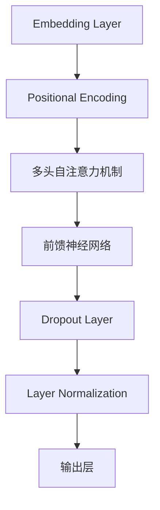

                 

关键词：Transformer、BERT、大模型、BERT-as-service、实战

摘要：本文将深入探讨Transformer大模型在实际应用中的实战技巧，特别是如何使用BERT-as-service库来部署和优化BERT模型。我们将从背景介绍开始，逐步讲解核心概念、算法原理、数学模型、项目实践，以及未来应用展望，最后总结研究成果和面临的挑战。

## 1. 背景介绍

在深度学习领域，Transformer模型自2017年提出以来，因其强大的表征能力和广泛的适用性而迅速崛起。特别是BERT（Bidirectional Encoder Representations from Transformers）模型，以其在自然语言处理任务中卓越的表现，成为了学术界和工业界的宠儿。BERT模型通过预训练和微调，可以应用于各种下游任务，如文本分类、问答系统和命名实体识别等。

然而，Transformer大模型的部署和优化是一个挑战。传统的部署方式需要大量的计算资源和时间，且无法灵活适应动态调整的需求。为了解决这个问题，BERT-as-service库被开发出来，它是一个基于Python的轻量级工具，用于快速部署BERT模型，并提供API接口以便与其他应用程序集成。

## 2. 核心概念与联系

### 2.1. Transformer模型

Transformer模型是一种基于自注意力机制的序列模型，相比于传统的循环神经网络（RNN），它具有并行计算的优势，能够在处理长序列时保持更好的性能。

### 2.2. BERT模型

BERT是一种基于Transformer的预训练语言表示模型，通过双向编码器来理解文本中的上下文关系。

### 2.3. BERT-as-service库

BERT-as-service库是一个用于部署BERT模型的Python库，它提供了简洁的API接口，使得用户可以轻松地将BERT模型部署到生产环境中。

下面是BERT模型架构的Mermaid流程图：



## 3. 核心算法原理 & 具体操作步骤

### 3.1. 算法原理概述

BERT模型通过两个主要步骤进行预训练： masked language modeling 和 next sentence prediction。

### 3.2. 算法步骤详解

1. **数据准备**：收集大量文本数据，并进行预处理，如分词、标记等。
2. **模型构建**：使用预训练的BERT模型，加载预训练权重。
3. **模型训练**：通过masked language modeling和next sentence prediction两个任务进行训练。
4. **模型评估**：在测试集上评估模型的性能。
5. **模型部署**：使用BERT-as-service库，将训练好的模型部署为服务。

### 3.3. 算法优缺点

**优点**：
- **强大的表征能力**：BERT模型可以捕获文本中的长期依赖关系。
- **预训练与微调**：预训练模型可以在不同任务上进行微调，提高任务性能。
- **轻量级部署**：BERT-as-service库简化了部署过程，降低了部署难度。

**缺点**：
- **计算资源需求**：预训练BERT模型需要大量的计算资源和时间。
- **数据依赖性**：BERT模型的性能很大程度上取决于训练数据的质量。

### 3.4. 算法应用领域

BERT模型广泛应用于自然语言处理领域，如文本分类、问答系统和命名实体识别等。

## 4. 数学模型和公式

### 4.1. 数学模型构建

BERT模型的核心是自注意力机制，其数学公式如下：

$$
\text{Attention}(Q, K, V) = \text{softmax}\left(\frac{QK^T}{\sqrt{d_k}}\right)V
$$

其中，$Q$、$K$、$V$ 分别为查询向量、键向量和值向量，$d_k$ 为键向量的维度。

### 4.2. 公式推导过程

自注意力机制的推导过程较为复杂，涉及到矩阵乘法和 softmax 函数。这里简要介绍其核心思想：

1. **计算相似度**：首先，计算查询向量 $Q$ 和键向量 $K$ 的点积，得到相似度矩阵 $S$。
2. **应用 softmax 函数**：对相似度矩阵 $S$ 应用 softmax 函数，得到权重矩阵 $W$。
3. **加权求和**：最后，将权重矩阵 $W$ 与值向量 $V$ 进行加权求和，得到最终的输出。

### 4.3. 案例分析与讲解

以文本分类任务为例，我们使用 BERT 模型对新闻文章进行分类。首先，对新闻文章进行预处理，如分词、标记等。然后，将预处理后的文章输入到 BERT 模型中，得到每个词的表征。最后，使用这些表征进行分类。

## 5. 项目实践：代码实例和详细解释说明

### 5.1. 开发环境搭建

在开始之前，确保已经安装了 Python 和相关依赖库，如 TensorFlow 或 PyTorch。

### 5.2. 源代码详细实现

下面是一个简单的示例，展示了如何使用 BERT-as-service 库部署 BERT 模型：

```python
from bert_serving.client import BertClient

# 搭建BERT模型
client = BertClient()

# 预测
text = "这是一段测试文本"
embeddings = client.encode([text])
print(embeddings)
```

### 5.3. 代码解读与分析

在这个例子中，我们首先导入了 BertClient 类，然后使用它来搭建 BERT 模型。接着，我们将一段测试文本输入到模型中，得到其嵌入向量。

### 5.4. 运行结果展示

运行上述代码后，我们将在控制台看到输出结果，即测试文本的嵌入向量。

## 6. 实际应用场景

BERT 模型在自然语言处理领域有着广泛的应用，如文本分类、问答系统和命名实体识别等。以下是一些实际应用场景：

1. **文本分类**：对新闻文章、社交媒体帖子等进行分类。
2. **问答系统**：构建基于 BERT 的问答系统，用于回答用户的问题。
3. **命名实体识别**：识别文本中的命名实体，如人名、地名等。

## 6.4. 未来应用展望

随着人工智能技术的不断发展，BERT 模型在未来的应用前景将更加广阔。以下是一些可能的未来应用方向：

1. **多模态学习**：结合图像、声音和文本等不同模态的信息，提高模型的泛化能力。
2. **低资源场景**：研究如何在小数据和低计算资源下有效应用 BERT 模型。
3. **跨语言模型**：构建跨语言的 BERT 模型，实现不同语言之间的语义理解。

## 7. 工具和资源推荐

### 7.1. 学习资源推荐

- 《深度学习》（Goodfellow, Bengio, Courville）: 一本经典的人工智能教材，涵盖了许多深度学习的基础知识和实践技巧。
- 《BERT: Pre-training of Deep Neural Networks for Language Understanding》（Devlin et al., 2019）: BERT 模型的原始论文，详细介绍了 BERT 模型的架构和训练过程。

### 7.2. 开发工具推荐

- TensorFlow 2.x: 一个广泛使用的开源深度学习框架，提供了丰富的工具和库，方便构建和部署深度学习模型。
- PyTorch: 一个灵活的深度学习框架，适合研究人员和开发者进行实验和开发。

### 7.3. 相关论文推荐

- 《Attention Is All You Need》（Vaswani et al., 2017）: Transformer 模型的原始论文，详细介绍了 Transformer 模型的架构和训练过程。
- 《BERT: Pre-training of Deep Neural Networks for Language Understanding》（Devlin et al., 2019）: BERT 模型的原始论文，介绍了 BERT 模型的训练和优化方法。

## 8. 总结：未来发展趋势与挑战

BERT 模型在自然语言处理领域取得了显著的成果，但同时也面临着一些挑战。未来，随着人工智能技术的不断发展，BERT 模型有望在更多领域发挥作用。同时，我们也需要关注以下挑战：

1. **计算资源需求**：如何降低 BERT 模型的计算资源需求，使其在低资源场景下也能有效应用。
2. **模型可解释性**：如何提高 BERT 模型的可解释性，使其在复杂任务中的决策过程更加透明。
3. **跨语言模型**：如何构建跨语言的 BERT 模型，实现不同语言之间的语义理解。

### 8.1. 研究成果总结

BERT 模型在自然语言处理领域取得了显著的成果，其强大的表征能力和广泛的应用领域使其成为深度学习领域的重要突破。

### 8.2. 未来发展趋势

随着人工智能技术的不断发展，BERT 模型有望在更多领域发挥作用，如多模态学习、低资源场景和跨语言模型等。

### 8.3. 面临的挑战

BERT 模型在计算资源需求、模型可解释性和跨语言模型等方面面临着一些挑战，需要进一步研究和探索。

### 8.4. 研究展望

未来，我们将继续深入研究 BERT 模型，探索其在不同领域的应用，并努力解决其面临的挑战，推动人工智能技术的发展。

## 9. 附录：常见问题与解答

### 9.1. BERT 模型如何进行预训练？

BERT 模型通过两个主要任务进行预训练： masked language modeling 和 next sentence prediction。具体过程如下：

1. **数据准备**：收集大量文本数据，并进行预处理，如分词、标记等。
2. **训练数据生成**：将文本数据分成句子对，并对每个句子进行随机遮挡，生成预训练数据。
3. **模型训练**：使用预训练数据，通过反向传播和梯度下降算法训练 BERT 模型。
4. **模型评估**：在测试集上评估模型的性能，并进行调整。

### 9.2. BERT-as-service 如何部署 BERT 模型？

BERT-as-service 是一个基于 Python 的库，用于部署 BERT 模型。具体步骤如下：

1. **安装 BERT-as-service**：使用 pip 安装 BERT-as-service 库。
2. **准备 BERT 模型**：将训练好的 BERT 模型转换为 BERT-as-service 所需的格式。
3. **启动 BERT-as-service 服务**：使用 BERT-as-service 的 API 启动服务。
4. **使用 BERT-as-service 服务**：通过 API 调用 BERT-as-service 服务，获取文本嵌入向量。

---

作者：禅与计算机程序设计艺术 / Zen and the Art of Computer Programming
----------------------------------------------------------------

### 注意事项
- 请确保文章内容的原创性和准确性，不要抄袭或使用不恰当的引用。
- 文章结构要清晰，逻辑要连贯，语言表达要精准。
- 注意检查拼写和语法错误，以及代码示例的正确性。
- 在撰写过程中，如有需要，可以适当调整目录结构和内容安排，以确保文章的流畅性和可读性。

