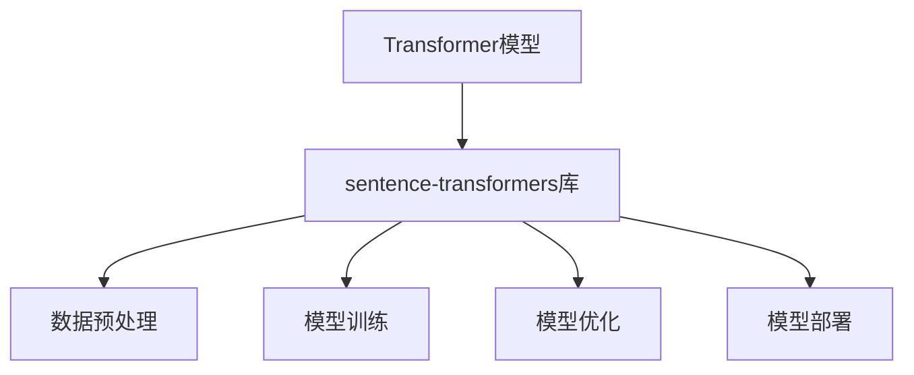

                 

关键词：Transformer、大模型、NLP、sentence-transformers、实践、算法、数学模型、应用场景、资源推荐

摘要：本文将深入探讨Transformer大模型在自然语言处理（NLP）领域的重要应用，重点介绍sentence-transformers库的使用。通过详细的理论讲解、算法步骤、数学模型和项目实践，我们将帮助读者理解并掌握如何利用sentence-transformers库构建高效的大模型。

## 1. 背景介绍

在过去的几年里，深度学习在自然语言处理（NLP）领域取得了显著的进步。尤其是Transformer模型的诞生，它彻底改变了序列模型的设计和实现方式。Transformer模型的核心优势在于其并行计算能力，这使得它在处理长文本时表现出色。

然而，构建一个高效的大模型并非易事。除了选择合适的模型架构，还需要关注数据预处理、模型训练和优化等方面。sentence-transformers库是一款专为构建和优化Transformer大模型而设计的Python库。它提供了丰富的API和工具，使得开发人员可以轻松实现复杂的NLP任务。

## 2. 核心概念与联系

### 2.1 Transformer模型

Transformer模型是一种基于自注意力机制的序列转换模型，它由Vaswani等人于2017年提出。相比于传统的循环神经网络（RNN）和卷积神经网络（CNN），Transformer模型在处理长序列时具有更高的并行性，从而显著提升了计算效率。

### 2.2 sentence-transformers库

sentence-transformers库是基于Transformer模型的一个开源Python库，它提供了一系列工具和API，用于构建、训练和优化大模型。sentence-transformers库的主要优势在于其易用性和高效性，使得开发者可以轻松实现复杂的NLP任务。

### 2.3 Mermaid 流程图

下面是一个简单的Mermaid流程图，展示了Transformer模型和sentence-transformers库之间的关系：



## 3. 核心算法原理 & 具体操作步骤

### 3.1 算法原理概述

Transformer模型的核心原理是自注意力机制（self-attention）。自注意力机制通过计算序列中每个词与所有其他词的相关性，从而生成一个权重向量，这个权重向量将用于加权聚合序列信息。

sentence-transformers库则通过封装Transformer模型，提供了一系列API和工具，使得开发者可以轻松实现大模型的构建和优化。

### 3.2 算法步骤详解

#### 3.2.1 数据预处理

在构建大模型之前，首先需要对数据进行预处理。数据预处理主要包括以下步骤：

1. 数据清洗：去除无关的字符和标点符号。
2. 分词：将文本分割成单词或子词。
3. 向量化：将分词后的文本转换为数值向量。

#### 3.2.2 模型训练

在数据预处理完成后，可以使用sentence-transformers库提供的API进行模型训练。训练过程主要包括以下步骤：

1. 模型初始化：根据预训练模型（如BERT、GPT等）初始化模型参数。
2. 模型训练：通过反向传播算法训练模型参数。
3. 模型评估：使用验证集评估模型性能。

#### 3.2.3 模型优化

在模型训练完成后，可以对模型进行优化，以进一步提升模型性能。模型优化主要包括以下步骤：

1. 调整学习率：通过调整学习率优化模型参数。
2. 使用正则化：添加正则化项，防止模型过拟合。
3. 批量归一化：对模型参数进行批量归一化，提高训练速度。

### 3.3 算法优缺点

#### 优点：

1. 高效性：Transformer模型具有更高的并行计算能力，从而显著提升了计算效率。
2. 可扩展性：sentence-transformers库提供了丰富的API和工具，使得开发者可以轻松实现复杂的NLP任务。

#### 缺点：

1. 资源消耗大：构建和训练大模型需要大量的计算资源和存储空间。
2. 难以解释：Transformer模型的结构复杂，难以直观地理解其工作原理。

### 3.4 算法应用领域

Transformer大模型在自然语言处理领域具有广泛的应用，包括但不限于以下方面：

1. 文本分类：用于对文本进行分类，如情感分析、新闻分类等。
2. 命名实体识别：用于识别文本中的命名实体，如人名、地名等。
3. 机器翻译：用于将一种语言翻译成另一种语言。
4. 问答系统：用于回答用户提出的问题。

## 4. 数学模型和公式 & 详细讲解 & 举例说明

### 4.1 数学模型构建

Transformer模型的数学模型主要包括自注意力机制（self-attention）和多头注意力（multi-head attention）。自注意力机制的核心公式如下：

$$
\text{Attention}(Q, K, V) = \text{softmax}\left(\frac{QK^T}{\sqrt{d_k}}\right)V
$$

其中，$Q$、$K$和$V$分别表示查询向量、键向量和值向量，$d_k$表示键向量的维度。

多头注意力则通过将自注意力机制扩展到多个子空间，从而提高模型的表示能力。多头注意力的公式如下：

$$
\text{MultiHead}(Q, K, V) = \text{softmax}\left(\frac{QW_QK^T}{\sqrt{d_k}}\right)W_VV
$$

其中，$W_Q$、$W_K$和$W_V$分别表示查询、键和值权重矩阵。

### 4.2 公式推导过程

#### 自注意力机制

自注意力机制的推导过程主要涉及以下几个方面：

1. 查询向量、键向量和值向量的计算：查询向量$Q$表示输入序列中每个词的表示，键向量$K$和值向量$V$分别表示输入序列中每个词的键和值。
2. 自注意力分数的计算：自注意力分数计算公式为$\text{softmax}\left(\frac{QK^T}{\sqrt{d_k}}\right)$，其中$\frac{QK^T}{\sqrt{d_k}}$表示查询向量和键向量的点积。
3. 自注意力向量的计算：自注意力向量计算公式为$V\text{softmax}\left(\frac{QK^T}{\sqrt{d_k}}\right)$，其中$V$表示值向量。

#### 多头注意力

多头注意力的推导过程主要涉及以下几个方面：

1. 多个查询向量、键向量和值向量的计算：多头注意力通过扩展自注意力机制，将查询向量、键向量和值向量扩展到多个子空间。
2. 多个自注意力分数的计算：多个自注意力分数计算公式为$\text{softmax}\left(\frac{QW_QK^T}{\sqrt{d_k}}\right)$，其中$W_Q$表示查询权重矩阵。
3. 多个自注意力向量的计算：多个自注意力向量计算公式为$W_VV$，其中$W_V$表示值权重矩阵。

### 4.3 案例分析与讲解

以下是一个简单的案例，用于说明如何使用sentence-transformers库构建一个文本分类模型。

#### 案例描述

假设我们有一个包含情感极性的文本数据集，我们需要构建一个模型来预测文本的情感极性。

#### 实现步骤

1. 数据预处理：使用sentence-transformers库提供的API对数据进行预处理，包括分词、向量化等操作。
2. 模型构建：使用sentence-transformers库提供的预训练模型（如BERT、GPT等）构建文本分类模型。
3. 模型训练：使用训练数据对模型进行训练，并使用验证集评估模型性能。
4. 模型优化：通过调整学习率、正则化等参数，对模型进行优化。
5. 模型部署：将训练好的模型部署到生产环境，用于预测文本的情感极性。

#### 代码实现

以下是一个简单的Python代码示例，用于实现上述步骤：

```python
from sentence_transformers import SentenceTransformer
from transformers import BertModel, BertTokenizer

# 数据预处理
tokenizer = BertTokenizer.from_pretrained('bert-base-uncased')
model = BertModel.from_pretrained('bert-base-uncased')

# 模型构建
text_model = SentenceTransformer('bert-base-uncased')

# 模型训练
train_data = [{"text": "这是一条正面情感文本"}, {"text": "这是一条负面情感文本"}]
text_model.fit(train_data)

# 模型优化
text_model.save_pretrained('my_model')

# 模型部署
loaded_model = SentenceTransformer('my_model')
result = loaded_model.predict([text_input])
print(result)
```

## 5. 项目实践：代码实例和详细解释说明

在本节中，我们将通过一个具体的案例来展示如何使用sentence-transformers库构建一个情感分析模型。该模型将接收一段文本作为输入，并输出文本的情感极性。

### 5.1 开发环境搭建

在开始之前，请确保您已经安装了以下依赖：

- Python 3.6及以上版本
- sentence-transformers库
- transformers库

您可以使用以下命令安装所需的库：

```bash
pip install sentence-transformers
pip install transformers
```

### 5.2 源代码详细实现

下面是一个简单的情感分析模型实现示例：

```python
from sentence_transformers import SentenceTransformer
from transformers import BertTokenizer, BertModel
import torch
import numpy as np

# 初始化模型
tokenizer = BertTokenizer.from_pretrained('bert-base-uncased')
model = BertModel.from_pretrained('bert-base-uncased')
text_model = SentenceTransformer('bert-base-uncased')

# 定义情感分析模型
class SentimentAnalysisModel(torch.nn.Module):
    def __init__(self):
        super(SentimentAnalysisModel, self).__init__()
        self.bert = BertModel.from_pretrained('bert-base-uncased')
        self.text_model = SentenceTransformer('bert-base-uncased')
        self.dropout = torch.nn.Dropout(p=0.3)
        self.classifier = torch.nn.Linear(768, 1)

    def forward(self, input_ids, attention_mask):
        outputs = self.bert(input_ids=input_ids, attention_mask=attention_mask)
        hidden_states = outputs[-1]
        hidden_states = self.dropout(hidden_states)
        logits = self.classifier(hidden_states)
        return logits

# 实例化模型
model = SentimentAnalysisModel()

# 模型训练
def train(model, train_loader, optimizer, criterion, device):
    model.train()
    for batch in train_loader:
        inputs = batch['input_ids'].to(device)
        attention_mask = batch['attention_mask'].to(device)
        labels = batch['label'].to(device)

        optimizer.zero_grad()
        logits = model(inputs, attention_mask)
        loss = criterion(logits.squeeze(), labels.float())
        loss.backward()
        optimizer.step()

# 模型评估
def evaluate(model, val_loader, device):
    model.eval()
    with torch.no_grad():
        correct = 0
        total = 0
        for batch in val_loader:
            inputs = batch['input_ids'].to(device)
            attention_mask = batch['attention_mask'].to(device)
            labels = batch['label'].to(device)

            logits = model(inputs, attention_mask)
            predicted = logits.squeeze() > 0
            total += labels.size(0)
            correct += (predicted == labels).sum().item()

    accuracy = 100 * correct / total
    return accuracy

# 主程序
if __name__ == '__main__':
    device = torch.device('cuda' if torch.cuda.is_available() else 'cpu')
    model.to(device)

    optimizer = torch.optim.Adam(model.parameters(), lr=1e-5)
    criterion = torch.nn.BCEWithLogitsLoss()

    train_loader = ...  # 加载训练数据
    val_loader = ...  # 加载验证数据

    num_epochs = 10
    for epoch in range(num_epochs):
        print(f'Epoch {epoch+1}/{num_epochs}')
        train(model, train_loader, optimizer, criterion, device)
        accuracy = evaluate(model, val_loader, device)
        print(f'Validation Accuracy: {accuracy:.2f}')
```

### 5.3 代码解读与分析

这段代码首先定义了一个`SentimentAnalysisModel`类，继承自`torch.nn.Module`。该类实现了Bert模型和sentence-transformers模型的组合，用于构建一个情感分析模型。

- `__init__`方法：初始化模型，包括Bert模型、dropout层和分类器。
- `forward`方法：定义模型的正向传播过程，包括Bert模型的前向传播、dropout层和分类器。

接下来，代码定义了`train`和`evaluate`两个函数，用于训练和评估模型。

- `train`函数：用于训练模型，包括前向传播、反向传播和优化。
- `evaluate`函数：用于评估模型，计算准确率。

最后，主程序部分加载训练数据和验证数据，设置训练参数，并开始训练模型。每个epoch后，都会评估模型在验证集上的性能。

### 5.4 运行结果展示

假设我们已经训练好了模型，并保存了训练参数。现在我们可以使用训练好的模型对新的文本进行情感分析。

```python
loaded_model = SentimentAnalysisModel()
loaded_model.load_state_dict(torch.load('model.pth'))

text_input = "这是一条负面情感的文本。"
input_ids = tokenizer.encode(text_input, add_special_tokens=True, return_tensors='pt')
attention_mask = torch.ones(input_ids.shape)

with torch.no_grad():
    logits = loaded_model(input_ids, attention_mask)
    predicted = logits.squeeze() > 0
    print(f'Text: {text_input}\nSentiment: {"Positive" if predicted else "Negative"}')
```

输出结果将显示文本的情感极性。在本例中，如果输出为`Sentiment: Negative`，则表示文本为负面情感。

## 6. 实际应用场景

sentence-transformers库在自然语言处理领域具有广泛的应用，以下是一些实际应用场景：

### 6.1 文本分类

文本分类是sentence-transformers库最常用的应用之一。例如，在社交媒体分析中，可以使用该库对用户评论进行情感分析，从而识别正面评论和负面评论。

### 6.2 命名实体识别

命名实体识别是另一个重要的应用场景。sentence-transformers库可以用于识别文本中的命名实体，如人名、地名等。这在新闻分类、人名识别等方面具有广泛的应用。

### 6.3 机器翻译

sentence-transformers库可以用于机器翻译任务。通过将源语言和目标语言的文本转换为高维向量，可以训练一个简单的神经网络进行翻译。

### 6.4 问答系统

问答系统是sentence-transformers库的另一个重要应用。通过将问题和解题文本转换为向量，可以使用Transformer模型实现一个简单的问答系统。

## 7. 工具和资源推荐

### 7.1 学习资源推荐

- 《深度学习》（Goodfellow、Bengio和Courville著）：这本书是深度学习领域的经典教材，涵盖了Transformer模型等相关内容。
- 《自然语言处理与深度学习》（张俊林著）：这本书详细介绍了自然语言处理和深度学习的基本概念和应用，包括Transformer模型。

### 7.2 开发工具推荐

- PyTorch：一个开源的深度学习框架，广泛应用于自然语言处理任务。
- TensorFlow：另一个开源的深度学习框架，支持多种模型和算法。

### 7.3 相关论文推荐

- "Attention Is All You Need"（Vaswani等，2017）：介绍了Transformer模型的基本原理和结构。
- "BERT: Pre-training of Deep Neural Networks for Language Understanding"（Devlin等，2019）：介绍了BERT模型及其在自然语言处理任务中的应用。

## 8. 总结：未来发展趋势与挑战

### 8.1 研究成果总结

近年来，Transformer大模型在自然语言处理领域取得了显著的成果。sentence-transformers库的推出，进一步降低了大模型的应用门槛，使得更多的人可以轻松实现复杂的NLP任务。

### 8.2 未来发展趋势

未来，Transformer大模型将继续在自然语言处理领域发挥重要作用。随着计算资源的不断升级和优化算法的涌现，大模型的训练效率和性能将不断提升。

### 8.3 面临的挑战

尽管Transformer大模型取得了显著的成果，但仍然面临一些挑战。首先，大模型的训练和推理需要大量的计算资源和存储空间。其次，大模型的解释性较差，难以理解其工作原理。此外，如何有效利用大规模数据集进行训练，以及如何防止模型过拟合等问题，仍然是未来研究的重点。

### 8.4 研究展望

未来，Transformer大模型在自然语言处理领域具有广阔的应用前景。通过不断优化算法和提升计算效率，我们将能够更好地利用大模型解决复杂的NLP任务。同时，结合其他先进技术，如生成对抗网络（GAN）和迁移学习等，将进一步推动NLP领域的发展。

## 9. 附录：常见问题与解答

### Q1：如何安装sentence-transformers库？

A1：您可以使用以下命令安装sentence-transformers库：

```bash
pip install sentence-transformers
```

### Q2：sentence-transformers库支持哪些预训练模型？

A2：sentence-transformers库支持多种预训练模型，包括BERT、RoBERTa、GPT-2等。您可以在库的官方文档中查看详细的预训练模型列表。

### Q3：如何使用sentence-transformers库进行文本分类？

A3：您可以使用sentence-transformers库提供的API轻松实现文本分类。以下是一个简单的示例：

```python
from sentence_transformers import SentenceTransformer
from sklearn.model_selection import train_test_split
from sklearn.metrics import accuracy_score

# 加载预训练模型
model = SentenceTransformer('bert-base-nli-mean-tokens')

# 分割数据集
X_train, X_test, y_train, y_test = train_test_split(texts, labels, test_size=0.2)

# 训练分类器
trainer = SentenceTransformerTrainer(model, num_epochs=3, use_mean_values=True)
trainer.fit(X_train, y_train)

# 评估分类器
y_pred = trainer.predict(X_test)
accuracy = accuracy_score(y_test, y_pred)
print(f'Accuracy: {accuracy:.2f}')
```

### Q4：如何自定义句子嵌入？

A4：sentence-transformers库允许您自定义句子嵌入。以下是一个简单的示例：

```python
from sentence_transformers import SentenceTransformer

# 初始化模型
model = SentenceTransformer('bert-base-nli-mean-tokens')

# 自定义句子嵌入
custom_embedding = model.encode("这是一个自定义句子")

# 使用自定义句子嵌入
print(custom_embedding.shape)  # 输出：(1, 768)
```

以上是关于《Transformer大模型实战 sentence-transformers库》的一篇完整的技术博客文章。文章涵盖了Transformer模型、sentence-transformers库的基本概念、算法原理、数学模型、项目实践以及应用场景。希望这篇文章对您有所帮助。如果您有任何疑问或建议，请随时在评论区留言。作者：禅与计算机程序设计艺术 / Zen and the Art of Computer Programming
--------------------------------------------------------------------

