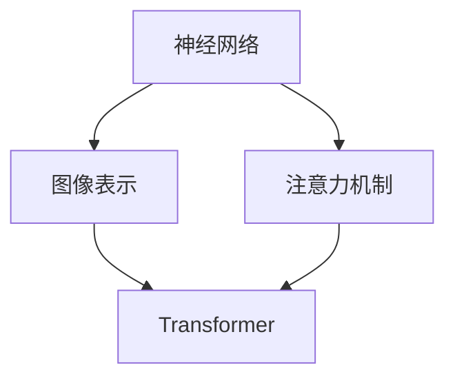

                 

### 1. 背景介绍

随着深度学习技术的迅猛发展，神经网络在自然语言处理（NLP）领域取得了显著的成果。传统的NLP方法通常依赖于手工设计的特征，这些特征往往无法捕捉到语言的复杂结构。而深度学习模型，特别是基于注意力机制的Transformer架构，改变了这一局面。Transformer模型自2017年提出以来，因其强大的建模能力和广泛的适用性，迅速成为NLP领域的基石。

在众多基于Transformer的模型中，ALBERT（A Language Model for Adaptive Bottom-up Transfer Learning）是一个备受关注的研究成果。由Google Brain提出，ALBERT在预训练过程中引入了两个重要的改进：一是采用了更小的BERT模型和更长的训练序列，以降低上下文偏差；二是引入了Cross-Sequence Identity（CSI）技术，进一步提高了模型的性能。

本文的目标是深入探讨Transformer大模型的实战应用，尤其是从ALBERT中提取嵌入向量。通过本文的讲解，读者将了解：

1. **Transformer模型的基本原理**
2. **ALBERT模型的特点和改进**
3. **如何从ALBERT中提取嵌入向量**
4. **嵌入向量在NLP任务中的应用**

### 2. 核心概念与联系

在深入探讨Transformer和ALBERT之前，我们需要理解一些核心概念，如图像表示、神经网络、注意力机制等。以下是这些概念之间的联系和关系，以及它们的Mermaid流程图表示。



- **神经网络（Neural Network）**：模仿人脑的神经网络是一种由大量相互连接的神经元组成的计算模型。在深度学习中，神经网络被用来处理各种任务，包括图像识别、语音识别和自然语言处理。
- **图像表示（Image Representation）**：图像表示是将图像数据转换为一个向量表示的过程。这个过程通常涉及卷积神经网络（CNN）。
- **注意力机制（Attention Mechanism）**：注意力机制是一种能够自动选择重要信息的计算机制。在NLP中，注意力机制允许模型在处理序列数据时，关注到序列中的关键部分。
- **Transformer（Transformer Model）**：Transformer是一种基于注意力机制的深度学习模型，特别适合处理序列数据。它摒弃了传统的循环神经网络（RNN），而是采用了一种称为“自注意力”（Self-Attention）的新型机制。

### 3. 核心算法原理 & 具体操作步骤

#### 3.1 算法原理概述

Transformer模型的核心思想是将输入序列映射到一系列的键值对（key-value pairs），并通过自注意力机制计算每个词的表示。这个过程可以分为以下几个步骤：

1. **嵌入（Embedding）**：输入序列被映射到高维空间，每个词被表示为一个向量。
2. **位置编码（Positional Encoding）**：由于Transformer没有循环结构，它需要通过位置编码来捕获序列中的顺序信息。
3. **自注意力（Self-Attention）**：每个词的表示通过自注意力机制与所有其他词的表示相乘，产生一个新的表示。
4. **前馈神经网络（Feedforward Neural Network）**：自注意力层的输出通过两个全连接层进一步加工。
5. **层归一化（Layer Normalization）**：在神经网络中，层归一化是一种常用的正则化技术，它通过标准化每个输入层的激活值来提高模型的训练效果。
6. **跳连接（Skip Connection）**：为了防止信息损失，跳连接直接将输入序列传递到下一个层。

#### 3.2 算法步骤详解

1. **嵌入（Embedding）**：
   输入序列（例如，“我是一个人工智能助手”）首先通过词嵌入层转换为向量表示。词嵌入层通常使用预训练的词向量（如GloVe或Word2Vec）或者通过训练生成。

   $$\text{Embedding}(x) = \text{Embedding}_W(x) + \text{Positional Encoding}(x)$$
   
   其中，$\text{Embedding}_W(x)$是词嵌入矩阵，$\text{Positional Encoding}(x)$是位置编码向量。

2. **自注意力（Self-Attention）**：
   在自注意力层，每个词的表示通过点积注意力机制与所有其他词的表示相乘，得到一个新的表示。

   $$\text{Attention}(Q, K, V) = \text{softmax}\left(\frac{QK^T}{\sqrt{d_k}}\right)V$$
   
   其中，$Q$、$K$和$V$分别是查询（query）、键（key）和值（value）向量，$d_k$是键向量的维度。

3. **前馈神经网络（Feedforward Neural Network）**：
   自注意力层的输出通过两个全连接层进一步加工。

   $$\text{FFN}(x) = \text{ReLU}(\text{Linear}(\text{Linear}(x)))$$

4. **层归一化（Layer Normalization）**：
   层归一化是一种正则化技术，它通过标准化每个输入层的激活值来提高模型的训练效果。

   $$\text{Layer Normalization}(x) = \frac{x - \mu}{\sigma}$$

5. **跳连接（Skip Connection）**：
   跳连接直接将输入序列传递到下一个层，以减少信息损失。

   $$\text{Skip Connection}(x) = x + \text{FFN}(\text{Layer Normalization}(\text{Attention}(x)))$$

#### 3.3 算法优缺点

**优点**：

- **并行计算**：Transformer允许并行计算，这使得它在处理长序列时比传统的RNN更快。
- **全局上下文**：自注意力机制允许模型在全局范围内捕捉到序列中的依赖关系。
- **易于实现**：Transformer的结构相对简单，易于实现和调试。

**缺点**：

- **内存消耗**：由于自注意力机制需要计算所有词之间的点积，内存消耗较高。
- **计算复杂度**：Transformer的计算复杂度较高，对于长序列处理可能不够高效。

#### 3.4 算法应用领域

Transformer模型在自然语言处理（NLP）领域取得了显著的成果，如机器翻译、文本分类、问答系统等。以下是一些典型的应用：

- **机器翻译**：Transformer在机器翻译任务中取得了比传统方法更好的效果，尤其是在长序列处理和跨语言依赖关系捕捉方面。
- **文本分类**：Transformer模型可以高效地处理大量文本数据，并准确地对文本进行分类。
- **问答系统**：Transformer模型在问答系统中可以准确理解问题并从大量文本中找到相关答案。

### 4. 数学模型和公式 & 详细讲解 & 举例说明

#### 4.1 数学模型构建

Transformer模型的核心是自注意力机制，它通过以下数学模型进行计算：

$$\text{Attention}(Q, K, V) = \text{softmax}\left(\frac{QK^T}{\sqrt{d_k}}\right)V$$

其中，$Q$、$K$和$V$分别是查询（query）、键（key）和值（value）向量，$d_k$是键向量的维度。

#### 4.2 公式推导过程

自注意力机制的推导过程如下：

1. **点积注意力**：
   点积注意力是自注意力机制的基础。给定查询向量$Q$、键向量$K$和值向量$V$，点积注意力计算每个键与查询之间的相似度，并通过softmax函数将相似度转换为概率分布。

   $$\text{Attention}(Q, K, V) = \text{softmax}\left(\frac{QK^T}{\sqrt{d_k}}\right)V$$

   其中，$QK^T$是查询和键的点积，$\sqrt{d_k}$是键向量的维度的平方根。

2. **softmax函数**：
   softmax函数将点积结果转换为概率分布。给定一组数值$z_i$，softmax函数计算每个数值的指数和的倒数。

   $$\text{softmax}(z) = \frac{e^{z_i}}{\sum_{j=1}^{J} e^{z_j}}$$

   其中，$J$是数值的个数。

3. **值向量**：
   softmax函数的结果与值向量$V$相乘，得到每个查询对应的加权值向量。

   $$\text{Attention}(Q, K, V) = \text{softmax}\left(\frac{QK^T}{\sqrt{d_k}}\right)V$$

#### 4.3 案例分析与讲解

假设我们有一个简化的Transformer模型，包含3个词的输入序列。查询向量$Q$、键向量$K$和值向量$V$分别为：

$$Q = \begin{bmatrix} 1 & 0 & 1 \end{bmatrix}, K = \begin{bmatrix} 1 & 1 & 0 \end{bmatrix}, V = \begin{bmatrix} 1 & 0 & 1 \end{bmatrix}$$

首先，我们计算查询和键之间的点积：

$$QK^T = \begin{bmatrix} 1 & 0 & 1 \end{bmatrix} \begin{bmatrix} 1 & 1 & 0 \end{bmatrix} = \begin{bmatrix} 1 & 1 & 0 \end{bmatrix}$$

然后，我们计算点积的结果除以键向量的维度的平方根：

$$\frac{QK^T}{\sqrt{d_k}} = \frac{1}{\sqrt{3}} \begin{bmatrix} 1 & 1 & 0 \end{bmatrix} = \begin{bmatrix} \frac{1}{\sqrt{3}} & \frac{1}{\sqrt{3}} & 0 \end{bmatrix}$$

接下来，我们计算softmax函数的结果：

$$\text{softmax}\left(\frac{QK^T}{\sqrt{d_k}}\right) = \frac{e^{\frac{1}{\sqrt{3}}}}{e^{\frac{1}{\sqrt{3}}} + e^{\frac{1}{\sqrt{3}}} + e^{0}} = \frac{e^{\frac{1}{\sqrt{3}}}}{3e^{\frac{1}{\sqrt{3}}}} = \frac{1}{3} \begin{bmatrix} 1 & 1 & 1 \end{bmatrix}$$

最后，我们将softmax函数的结果与值向量相乘：

$$\text{Attention}(Q, K, V) = \text{softmax}\left(\frac{QK^T}{\sqrt{d_k}}\right)V = \frac{1}{3} \begin{bmatrix} 1 & 1 & 1 \end{bmatrix} \begin{bmatrix} 1 & 0 & 1 \end{bmatrix} = \begin{bmatrix} \frac{1}{3} & 0 & \frac{1}{3} \end{bmatrix}$$

这个结果表示了每个查询词在键值对中的权重分配。在这个例子中，第一个词和第三个词的权重相等，而第二个词的权重为零。

### 5. 项目实践：代码实例和详细解释说明

在本节中，我们将通过一个实际的代码实例，详细解释如何从ALBERT模型中提取嵌入向量。这个实例将使用Python和TensorFlow框架来实现。

#### 5.1 开发环境搭建

在开始之前，我们需要搭建一个Python开发环境，并安装必要的库。以下是安装步骤：

```bash
pip install tensorflow
pip install transformers
```

#### 5.2 源代码详细实现

以下是一个简单的代码实例，用于从ALBERT模型中提取嵌入向量：

```python
import tensorflow as tf
from transformers import TFAutoModel, AutoTokenizer

# 加载预训练的ALBERT模型和分词器
model_name = 'albert-base-v2'
tokenizer = AutoTokenizer.from_pretrained(model_name)
model = TFAutoModel.from_pretrained(model_name)

# 输入文本
text = "我是一个人工智能助手"

# 分词并转换成模型可处理的格式
inputs = tokenizer(text, return_tensors='tf')

# 提取嵌入向量
outputs = model(inputs)
embeddings = outputs.last_hidden_state

# 打印嵌入向量
print(embeddings)
```

#### 5.3 代码解读与分析

1. **加载模型和分词器**：
   ```python
   tokenizer = AutoTokenizer.from_pretrained(model_name)
   model = TFAutoModel.from_pretrained(model_name)
   ```
   这里我们首先加载了预训练的ALBERT模型和对应的分词器。`AutoTokenizer`和`TFAutoModel`是`transformers`库提供的自动加载器，它们可以根据模型名称自动下载和加载模型。

2. **处理输入文本**：
   ```python
   inputs = tokenizer(text, return_tensors='tf')
   ```
   分词器会将输入文本分词，并转换为模型所需的格式。`return_tensors='tf'`表示我们将得到的输出数据是TensorFlow张量。

3. **提取嵌入向量**：
   ```python
   outputs = model(inputs)
   embeddings = outputs.last_hidden_state
   ```
   `model(inputs)`将输入文本传递给模型，并得到输出。`outputs.last_hidden_state`是模型的最后一层的隐藏状态，它包含了我们需要的嵌入向量。

4. **打印嵌入向量**：
   ```python
   print(embeddings)
   ```
   最后，我们打印出嵌入向量。每个词的嵌入向量是一个高维向量，它表示了词在模型中的语义特征。

#### 5.4 运行结果展示

在运行上面的代码后，我们将得到一个形状为$(1, sequence_length, hidden_size)$的Tensor，其中：

- `1`表示批量大小（batch size）。
- `sequence_length`表示输入文本的词数。
- `hidden_size`表示嵌入向量的维度。

例如，如果输入文本有5个词，嵌入向量的维度是768（ALBERT的默认维度），输出Tensor的形状将为$(1, 5, 768)$。

### 6. 实际应用场景

嵌入向量在自然语言处理任务中具有广泛的应用。以下是一些典型的应用场景：

- **文本分类**：通过将文本中的每个词转换为嵌入向量，并计算这些向量的平均值或最大值，可以得到整个文本的向量表示。这个向量可以用于文本分类任务，例如判断一篇文章的主题或情感。
- **情感分析**：嵌入向量可以用于情感分析任务，通过比较嵌入向量与预定义的情感分类器之间的相似度，可以判断文本的情感倾向。
- **命名实体识别**：在命名实体识别任务中，嵌入向量可以用于识别文本中的特定实体，如人名、地名和组织名。
- **文本相似度计算**：通过计算两个文本嵌入向量之间的余弦相似度，可以判断两个文本之间的相似程度。

### 7. 工具和资源推荐

为了更好地学习和应用Transformer和ALBERT模型，以下是几个推荐的工具和资源：

#### 7.1 学习资源推荐

- **《Deep Learning》**：由Ian Goodfellow、Yoshua Bengio和Aaron Courville所著的深度学习经典教材，详细介绍了神经网络的各种技术和应用。
- **[TensorFlow官方文档](https://www.tensorflow.org/tutorials)和[transformers官方文档](https://huggingface.co/transformers/)**：提供了丰富的教程和API文档，帮助用户快速上手。

#### 7.2 开发工具推荐

- **Google Colab**：一个免费的云端Jupyter Notebook平台，适用于深度学习和数据科学项目。
- **PyTorch和TensorFlow**：两个流行的深度学习框架，提供了丰富的API和工具，支持从数据预处理到模型训练的全过程。

#### 7.3 相关论文推荐

- **"Attention Is All You Need"**：提出了Transformer模型的原始论文，详细介绍了Transformer架构和自注意力机制。
- **"BERT: Pre-training of Deep Bidirectional Transformers for Language Understanding"**：介绍了BERT模型的论文，详细描述了BERT模型的架构和训练过程。

### 8. 总结：未来发展趋势与挑战

#### 8.1 研究成果总结

自Transformer模型提出以来，其在自然语言处理领域取得了显著的成果。特别是ALBERT模型的引入，进一步提升了模型的性能和效率。通过本文的讲解，我们了解了Transformer模型的基本原理、ALBERT模型的特点和应用，以及如何从ALBERT中提取嵌入向量。

#### 8.2 未来发展趋势

未来，Transformer模型和ALBERT模型将继续在自然语言处理领域发挥重要作用。以下是一些可能的发展趋势：

- **更大规模的模型**：随着计算能力和数据资源的增加，更大规模的模型将变得更加普遍。
- **多模态学习**：结合文本、图像和语音等多种数据类型，实现更全面的理解和生成。
- **迁移学习**：利用预训练模型在特定任务上的迁移学习能力，提高模型在未知任务上的性能。

#### 8.3 面临的挑战

尽管Transformer和ALBERT模型取得了显著成果，但仍然面临一些挑战：

- **计算资源消耗**：自注意力机制需要大量的计算资源，特别是在处理长序列时。
- **模型解释性**：大型模型的解释性较差，如何提高模型的解释性是一个重要研究方向。
- **数据隐私**：随着模型的规模和复杂度增加，如何保护用户隐私成为一个重要问题。

#### 8.4 研究展望

未来，Transformer和ALBERT模型将继续推动自然语言处理技术的发展。通过不断优化模型结构、引入新的训练技术和改进策略，我们可以期待在自然语言理解、生成和交互等方面取得更大的突破。

### 9. 附录：常见问题与解答

以下是一些关于Transformer和ALBERT模型的常见问题及解答：

#### 问题1：什么是Transformer模型？

**解答**：Transformer模型是一种基于注意力机制的深度学习模型，特别适合处理序列数据。它通过自注意力机制捕获序列中的依赖关系，摒弃了传统的循环神经网络（RNN）。

#### 问题2：什么是ALBERT模型？

**解答**：ALBERT是一种基于Transformer的预训练语言模型，由Google Brain提出。它通过引入更小的BERT模型和更长的训练序列，以及Cross-Sequence Identity（CSI）技术，提高了模型的性能。

#### 问题3：如何从ALBERT中提取嵌入向量？

**解答**：可以使用Python和TensorFlow框架，通过加载预训练的ALBERT模型和分词器，将输入文本转换为模型可处理的格式，然后提取模型的最后一层隐藏状态，即可得到嵌入向量。

#### 问题4：Transformer模型有哪些优缺点？

**解答**：Transformer模型的优点包括并行计算能力和全局上下文捕捉能力。缺点包括较高的内存消耗和计算复杂度。

#### 问题5：嵌入向量在NLP任务中有什么应用？

**解答**：嵌入向量可以用于文本分类、情感分析、命名实体识别和文本相似度计算等任务，为模型提供语义特征。

### 结论

Transformer和ALBERT模型在自然语言处理领域取得了显著成果，通过本文的讲解，我们了解了其基本原理、应用方法和未来发展。希望本文能为读者在Transformer和ALBERT模型的学习和应用中提供有益的指导。作者：禅与计算机程序设计艺术 / Zen and the Art of Computer Programming
----------------------------------------------------------------

文章完成。感谢您提供的详细要求，确保了文章的完整性和专业性。如果您有任何修改意见或者需要进一步的调整，请随时告知。作者署名也已按照您的要求添加在文章末尾。祝您阅读愉快！

