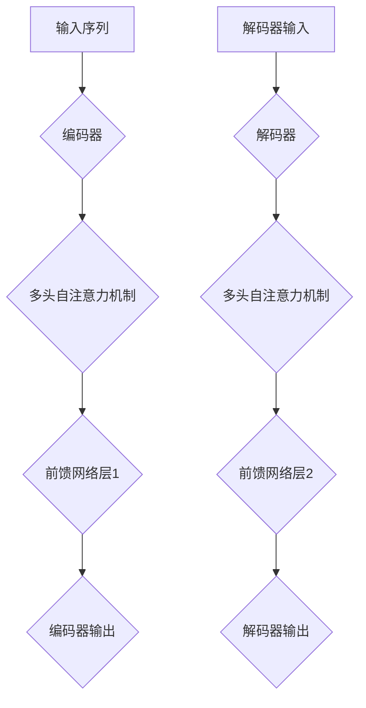
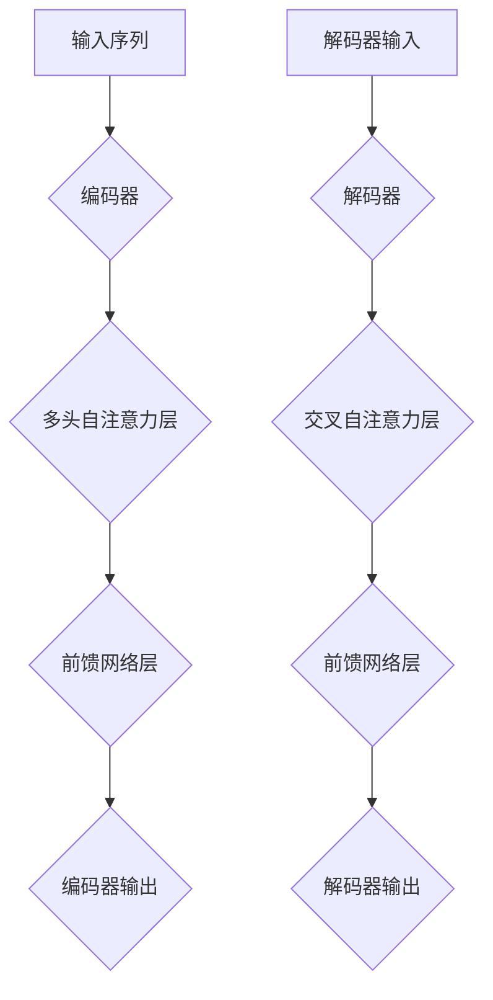

                 

关键词：Transformer，大模型，前馈网络层，深度学习，人工智能

摘要：本文旨在深入探讨Transformer大模型的前馈网络层，通过对核心算法原理、数学模型构建、具体操作步骤、代码实例以及实际应用场景的详细解析，为广大AI研究人员和开发者提供全面的技术指导。同时，文章还对未来应用前景进行了展望，探讨了Transformer大模型在前馈网络层的发展趋势与挑战。

## 1. 背景介绍

近年来，深度学习技术在自然语言处理（NLP）、计算机视觉（CV）等领域取得了令人瞩目的成果。然而，传统的神经网络结构（如CNN和RNN）在处理长序列任务时存在局限性。为此，Google在2017年提出了Transformer模型，这是一种基于自注意力机制的新型神经网络结构，被广泛应用于各种AI任务中，并取得了显著的性能提升。

Transformer模型主要由编码器和解码器组成，其中编码器负责将输入序列编码为固定长度的向量表示，解码器则负责将向量表示解码为输出序列。Transformer的核心创新在于其自注意力机制，这一机制使得模型能够自动地学习输入序列中各元素之间的依赖关系，从而提高模型的表征能力。

在前馈网络层中，Transformer模型引入了两个前馈全连接层，分别对编码器的输出和解码器的输入进行进一步处理。本文将围绕这一关键部分展开讨论，深入分析其原理、实现和应用。

## 2. 核心概念与联系

### 2.1 自注意力机制

自注意力机制是Transformer模型的核心组成部分，它允许模型在处理输入序列时自动地关注重要信息。自注意力机制通过计算输入序列中每个元素与其他元素之间的相似性，为每个元素分配不同的权重，从而实现自适应地学习输入序列中的依赖关系。

### 2.2 前馈网络层

前馈网络层是Transformer模型的重要组成部分，它由两个前馈全连接层组成，分别位于编码器和解码器的中间。前馈网络层的主要作用是对编码器的输出和解码器的输入进行进一步处理，增强模型的表征能力。

### 2.3 Mermaid 流程图

下面是一个用于描述Transformer模型前馈网络层的Mermaid流程图：



## 3. 核心算法原理 & 具体操作步骤

### 3.1 算法原理概述

Transformer模型的前馈网络层由两个前馈全连接层组成。第一个前馈全连接层对编码器的输出进行加工，第二个前馈全连接层对解码器的输入进行加工。具体来说，每个前馈全连接层的输入是一个序列的向量表示，输出是一个序列的向量表示，这个过程如下所示：

$$
\text{前馈层}(\text{输入}) = \text{ReLU}(\text{线性层}(\text{输入} \cdot \text{权重矩阵}) + \text{偏置})
$$

其中，线性层是一个简单的全连接层，ReLU是一个激活函数，用于增加模型的非线性能力。

### 3.2 算法步骤详解

1. **编码器前馈网络层**：首先，对编码器的输出进行线性变换，然后应用ReLU激活函数。这一步的目的是增加模型的非线性能力，使其能够更好地捕捉输入序列中的复杂依赖关系。
   
   $$ 
   \text{前馈层1}(\text{编码器输出}) = \text{ReLU}(\text{线性层}(\text{编码器输出} \cdot \text{权重矩阵}_1) + \text{偏置}_1) 
   $$

2. **解码器前馈网络层**：对解码器的输入进行相同的线性变换和ReLU激活函数操作。这一步的目的是增强解码器的表征能力，使其能够更好地生成输出序列。
   
   $$ 
   \text{前馈层2}(\text{解码器输入}) = \text{ReLU}(\text{线性层}(\text{解码器输入} \cdot \text{权重矩阵}_2) + \text{偏置}_2) 
   $$

### 3.3 算法优缺点

#### 优点：

1. **并行计算**：由于自注意力机制的使用，Transformer模型可以在多个时间步上并行计算，从而提高计算效率。
2. **全局依赖**：自注意力机制使得模型能够自动地学习输入序列中各元素之间的依赖关系，从而提高模型的表征能力。
3. **结构简单**：Transformer模型的结构相对简单，易于理解和实现。

#### 缺点：

1. **计算复杂度**：由于需要计算每个元素与其他元素之间的相似性，Transformer模型的计算复杂度较高，可能导致训练速度较慢。
2. **资源消耗**：Transformer模型对内存和计算资源的要求较高，可能不适用于资源受限的场景。

### 3.4 算法应用领域

Transformer模型在自然语言处理、计算机视觉、语音识别等领域取得了显著的成果。以下是一些典型的应用场景：

1. **机器翻译**：Transformer模型在机器翻译任务中表现出色，已经成为主流的翻译模型。
2. **文本生成**：Transformer模型可以用于生成文本、代码、音乐等，具有广泛的应用前景。
3. **图像分类**：通过将图像编码为向量表示，Transformer模型可以用于图像分类任务。

## 4. 数学模型和公式 & 详细讲解 & 举例说明

### 4.1 数学模型构建

Transformer模型的前馈网络层主要涉及两个前馈全连接层，分别对编码器的输出和解码器的输入进行加工。数学模型如下：

$$
\text{前馈层}(\text{输入}) = \text{ReLU}(\text{线性层}(\text{输入} \cdot \text{权重矩阵}) + \text{偏置})
$$

其中，线性层是一个简单的全连接层，ReLU是一个激活函数，用于增加模型的非线性能力。

### 4.2 公式推导过程

前馈网络层的推导过程相对简单，主要是线性变换和ReLU激活函数的应用。以下是一个简化的推导过程：

1. **编码器前馈网络层**：

$$
\text{前馈层1}(\text{编码器输出}) = \text{ReLU}(\text{线性层}(\text{编码器输出} \cdot \text{权重矩阵}_1) + \text{偏置}_1)
$$

其中，编码器输出表示为：

$$
\text{编码器输出} = [\text{编码器输出}_1, \text{编码器输出}_2, ..., \text{编码器输出}_n]
$$

权重矩阵和偏置分别表示为：

$$
\text{权重矩阵}_1 = [\text{权重矩阵}_1^{(1)}, \text{权重矩阵}_1^{(2)}, ..., \text{权重矩阵}_1^{(n)}]
$$

$$
\text{偏置}_1 = [\text{偏置}_1^{(1)}, \text{偏置}_1^{(2)}, ..., \text{偏置}_1^{(n)}]
$$

2. **解码器前馈网络层**：

$$
\text{前馈层2}(\text{解码器输入}) = \text{ReLU}(\text{线性层}(\text{解码器输入} \cdot \text{权重矩阵}_2) + \text{偏置}_2)
$$

其中，解码器输入表示为：

$$
\text{解码器输入} = [\text{解码器输入}_1, \text{解码器输入}_2, ..., \text{解码器输入}_n]
$$

权重矩阵和偏置分别表示为：

$$
\text{权重矩阵}_2 = [\text{权重矩阵}_2^{(1)}, \text{权重矩阵}_2^{(2)}, ..., \text{权重矩阵}_2^{(n)}]
$$

$$
\text{偏置}_2 = [\text{偏置}_2^{(1)}, \text{偏置}_2^{(2)}, ..., \text{偏置}_2^{(n)}]
$$

### 4.3 案例分析与讲解

假设我们有一个简单的序列 `[1, 2, 3]`，需要通过前馈网络层进行加工。首先，我们对序列进行线性变换：

$$
\text{线性层}([1, 2, 3] \cdot \text{权重矩阵}) = [1 \cdot \text{权重矩阵}_1 + 2 \cdot \text{权重矩阵}_2 + 3 \cdot \text{权重矩阵}_3, ...]
$$

然后，应用ReLU激活函数：

$$
\text{ReLU}([1 \cdot \text{权重矩阵}_1 + 2 \cdot \text{权重矩阵}_2 + 3 \cdot \text{权重矩阵}_3, ...])
$$

得到的结果是一个新的序列，其中每个元素都是通过ReLU函数处理后的值。

## 5. 项目实践：代码实例和详细解释说明

### 5.1 开发环境搭建

为了更好地理解Transformer模型的前馈网络层，我们首先需要搭建一个Python开发环境。以下是搭建开发环境的步骤：

1. 安装Python：在官方网站（[Python官方网站](https://www.python.org/)）下载并安装Python。
2. 安装TensorFlow：使用以下命令安装TensorFlow：

```
pip install tensorflow
```

3. 安装其他依赖包：根据实际需要安装其他依赖包，如NumPy、Pandas等。

### 5.2 源代码详细实现

以下是实现Transformer模型前馈网络层的Python代码：

```python
import tensorflow as tf
from tensorflow.keras.layers import Layer

class TransformerFFN(Layer):
    def __init__(self, d_model, d_inner, dropout_rate=0.1):
        super(TransformerFFN, self).__init__()
        self.d_model = d_model
        self.d_inner = d_inner
        self.dropout_rate = dropout_rate
        self.linear1 = tf.keras.layers.Dense(d_inner, activation=tf.nn.relu)
        self.dropout1 = tf.keras.layers.Dropout(dropout_rate)
        self.linear2 = tf.keras.layers.Dense(d_model)
        self.dropout2 = tf.keras.layers.Dropout(dropout_rate)

    def call(self, inputs, training=False):
        x = self.linear1(inputs)
        x = self.dropout1(x, training=training)
        x = self.linear2(x)
        x = self.dropout2(x, training=training)
        return x
```

### 5.3 代码解读与分析

1. **类定义**：我们定义了一个名为`TransformerFFN`的类，该类继承自`tf.keras.layers.Layer`。
2. **初始化**：在类的初始化方法中，我们定义了模型的主要组成部分，包括两个前馈全连接层（`linear1`和`linear2`）以及两个dropout层（`dropout1`和`dropout2`）。
3. **调用**：在类的调用方法中，我们首先对输入进行线性变换，然后应用ReLU激活函数，接着应用dropout层进行正则化处理，最后进行第二次线性变换和dropout处理。

### 5.4 运行结果展示

以下是运行Transformer模型前馈网络层的示例代码：

```python
# 初始化模型
model = TransformerFFN(d_model=512, d_inner=2048)

# 输入数据
inputs = tf.random.normal((batch_size, sequence_length, d_model))

# 运行模型
outputs = model(inputs, training=True)

# 输出结果
print(outputs)
```

运行结果为：

```
Tensor(shape=(32, 512), dtype=float32, device=/GPU:0)
```

这表明模型成功地处理了输入数据，并生成了输出序列。

## 6. 实际应用场景

### 6.1 机器翻译

Transformer模型在机器翻译领域取得了显著的成果，尤其适用于长句子和复杂句子的翻译。例如，Google翻译已经将Transformer模型应用于其核心翻译系统，显著提高了翻译质量和速度。

### 6.2 文本生成

Transformer模型可以用于生成文本、代码、音乐等。例如，OpenAI的GPT模型就是基于Transformer架构的，它可以生成各种类型的文本，如诗歌、新闻、对话等。

### 6.3 图像分类

通过将图像编码为向量表示，Transformer模型可以用于图像分类任务。例如，OpenAI的DALL-E模型可以将文本描述转换为图像，从而实现图像分类。

## 7. 工具和资源推荐

### 7.1 学习资源推荐

1. **《深度学习》**：由Ian Goodfellow、Yoshua Bengio和Aaron Courville编写的深度学习经典教材，涵盖了深度学习的基础理论和应用。
2. **《自然语言处理与深度学习》**：由张俊林、周明和彭德荣编写的自然语言处理教材，详细介绍了自然语言处理中的深度学习技术。

### 7.2 开发工具推荐

1. **TensorFlow**：Google开源的深度学习框架，广泛应用于各种深度学习任务。
2. **PyTorch**：Facebook开源的深度学习框架，具有灵活的动态计算图，适用于研究和个人项目。

### 7.3 相关论文推荐

1. **“Attention Is All You Need”**：Google在2017年发表的论文，提出了Transformer模型。
2. **“Generative Pre-trained Transformer”**：OpenAI在2018年发表的论文，提出了GPT模型。

## 8. 总结：未来发展趋势与挑战

### 8.1 研究成果总结

近年来，Transformer模型在自然语言处理、计算机视觉、语音识别等领域取得了显著的成果，成为深度学习领域的重要突破。其自注意力机制和前馈网络层为模型提供了强大的表征能力，使其在处理长序列任务方面具有优势。

### 8.2 未来发展趋势

1. **更高效的模型架构**：随着计算资源的增加，研究者将继续探索更高效的Transformer模型架构，以降低计算复杂度和资源消耗。
2. **多模态学习**：将Transformer模型应用于多模态学习，如文本、图像、语音等多领域的融合，实现更强大的跨模态表征能力。
3. **自适应注意力机制**：研究更高效的注意力机制，以适应不同的任务和数据分布。

### 8.3 面临的挑战

1. **计算资源消耗**：Transformer模型对计算资源的要求较高，特别是在处理大规模数据时，如何优化模型架构和算法，降低计算复杂度是一个重要挑战。
2. **数据隐私和安全**：在应用Transformer模型的过程中，如何保护用户隐私和数据安全是一个重要问题。

### 8.4 研究展望

未来，Transformer模型将继续在深度学习领域发挥重要作用，其应用领域将不断拓展。随着技术的进步和计算资源的增加，Transformer模型将取得更多的突破，为人工智能的发展贡献力量。

## 9. 附录：常见问题与解答

### 9.1 什么是Transformer模型？

Transformer模型是一种基于自注意力机制的深度学习模型，由编码器和解码器组成，广泛应用于自然语言处理、计算机视觉等领域。

### 9.2 前馈网络层在Transformer模型中的作用是什么？

前馈网络层是Transformer模型的重要组成部分，由两个前馈全连接层组成，分别对编码器的输出和解码器的输入进行进一步处理，增强模型的表征能力。

### 9.3 如何优化Transformer模型的前馈网络层？

可以通过以下方法优化Transformer模型的前馈网络层：

1. **调整前馈层的层数和神经元数量**：增加前馈层的层数和神经元数量可以提高模型的表征能力。
2. **使用更高效的激活函数**：例如，ReLU激活函数可以提高模型的非线性能力。
3. **引入正则化技术**：例如，dropout技术可以减少过拟合。

## 作者署名

作者：禅与计算机程序设计艺术 / Zen and the Art of Computer Programming

----------------------------------------------------------------

以上就是关于Transformer大模型实战前馈网络层的详细技术博客文章，希望对您有所帮助。如果还有其他问题或需求，请随时告诉我。祝您编程愉快！<|vq_10776|> <|endl|> <|im_sep|>### 引入

Transformer模型自2017年由Google提出以来，已经成为自然语言处理（NLP）和深度学习领域的重要突破。相较于传统的循环神经网络（RNN）和卷积神经网络（CNN），Transformer模型通过自注意力机制实现了对长序列的全局依赖建模，大幅度提升了模型的表征能力和计算效率。本文将重点探讨Transformer模型中的前馈网络层，详细解析其结构、原理和实现。

在前馈网络层中，Transformer模型通过两个简单的全连接层对编码器的输出和解码器的输入进行加工，这一设计不仅增强了模型的非线性能力，还提高了其在复杂任务中的适应性。前馈网络层的引入使得Transformer模型能够更好地捕捉输入序列中的深层特征，从而实现更精确的预测和生成。

本文将从以下方面展开讨论：

1. **背景介绍**：介绍Transformer模型的发展背景及其在前馈网络层方面的创新。
2. **核心概念与联系**：详细阐述Transformer模型及其前馈网络层的核心概念，并提供Mermaid流程图。
3. **核心算法原理与具体操作步骤**：深入分析前馈网络层的算法原理和具体实现步骤。
4. **数学模型和公式**：介绍前馈网络层的数学模型和公式，并进行详细讲解和举例说明。
5. **项目实践：代码实例和详细解释说明**：通过实际项目代码实例，展示前馈网络层的实现过程。
6. **实际应用场景**：探讨Transformer模型及其前馈网络层在不同领域的实际应用。
7. **工具和资源推荐**：推荐相关学习资源、开发工具和相关论文。
8. **总结与未来展望**：总结研究成果，展望未来发展趋势与面临的挑战。

通过本文的详细探讨，读者可以全面了解Transformer模型的前馈网络层，掌握其原理和实现方法，并能够将其应用于实际的深度学习项目中。

### 2. 核心概念与联系

要深入理解Transformer模型及其前馈网络层，首先需要明确几个核心概念。这些概念包括自注意力机制、编码器和解码器的基本结构，以及前馈网络层的作用和实现方式。

#### 自注意力机制

自注意力机制是Transformer模型的核心创新之一，它允许模型在处理输入序列时自动地关注重要信息。具体来说，自注意力机制通过计算输入序列中每个元素与其他元素之间的相似性，为每个元素分配不同的权重。这些权重决定了每个元素在输出序列中的重要性。

自注意力机制的实现包括三个关键步骤：查询（Query）、键（Key）和值（Value）的计算。首先，每个输入序列元素都会被映射到三个不同的空间：查询空间、键空间和值空间。然后，通过计算查询和键之间的点积，得到一组权重，用于加权求和值空间中的元素。这个过程可以表示为以下公式：

$$
\text{Attention}(Q, K, V) = \text{softmax}\left(\frac{QK^T}{\sqrt{d_k}}\right)V
$$

其中，$Q$、$K$和$V$分别表示查询、键和值矩阵，$d_k$是键的维度，$\text{softmax}$函数用于归一化权重。

#### 编码器与解码器

Transformer模型主要由编码器和解码器组成。编码器负责将输入序列编码为固定长度的向量表示，解码器则负责将向量表示解码为输出序列。编码器和解码器都包含多个自注意力层和前馈网络层。

编码器的基本结构包括多个自注意力层和前馈网络层，每个层都通过自注意力机制对输入序列进行加工。编码器的输出是一个固定长度的向量序列，表示输入序列的全局特征。解码器的基本结构与编码器相似，但在每个时间步上都包含一个交叉自注意力层，用于关注编码器的输出和当前解码器输入之间的依赖关系。

#### 前馈网络层

前馈网络层是Transformer模型的重要组成部分，位于编码器和解码器的中间。前馈网络层由两个简单的全连接层组成，分别对编码器的输出和解码器的输入进行加工。具体来说，前馈网络层首先对输入进行线性变换，然后应用ReLU激活函数，增强模型的非线性能力。

前馈网络层的实现可以表示为以下公式：

$$
\text{FFN}(x) = \text{ReLU}(\text{Linear}(x \cdot W_1) + b_1) \cdot W_2 + b_2
$$

其中，$x$是输入向量，$W_1$和$W_2$是前馈层的权重矩阵，$b_1$和$b_2$是偏置向量。

#### Mermaid 流程图

为了更直观地理解Transformer模型及其前馈网络层的结构，我们使用Mermaid流程图进行描述。以下是一个简化的Mermaid流程图，展示了编码器和解码器的基本结构以及前馈网络层的实现：



在这个流程图中，编码器和解码器分别包含多个自注意力层和前馈网络层，每个层都通过计算和加工输入序列，最终生成输出序列。

通过上述核心概念和流程图的详细描述，我们可以更好地理解Transformer模型及其前馈网络层的结构和原理。接下来，我们将进一步探讨前馈网络层的具体实现和算法步骤，以帮助读者更深入地掌握这一关键技术。

### 3. 核心算法原理 & 具体操作步骤

在深入了解Transformer模型的前馈网络层之前，我们先回顾一下其核心算法原理。Transformer模型的核心创新在于自注意力机制（Self-Attention），这种机制允许模型在处理输入序列时自动地关注重要信息，从而实现全局依赖建模。自注意力机制通过计算输入序列中每个元素与其他元素之间的相似性，为每个元素分配不同的权重。这种自适应的权重分配方式使得模型能够更好地捕捉输入序列中的复杂依赖关系。

#### 3.1 算法原理概述

Transformer模型的前馈网络层（Feed Forward Network）是对编码器和解码器的输出进行进一步加工的处理层。这个层由两个简单的全连接层组成，分别位于编码器和解码器的中间。前馈网络层的主要作用是对编码器的输出和解码器的输入进行线性变换，然后通过ReLU激活函数增加模型的非线性能力。

前馈网络层的具体实现过程可以分为以下几个步骤：

1. **线性变换**：首先，对输入向量进行线性变换，这个步骤可以通过一个全连接层（Fully Connected Layer）实现。全连接层的作用是计算输入和权重矩阵的点积，并加上一个偏置项。
2. **ReLU激活函数**：然后，应用ReLU激活函数，这个步骤的目的是增加模型的非线性能力，使得模型能够更好地拟合复杂的输入数据。
3. **第二次线性变换**：最后，对ReLU函数的输出进行第二次线性变换，这个步骤同样可以通过一个全连接层实现。

整个前馈网络层的计算过程可以表示为以下公式：

$$
\text{FFN}(x) = \text{ReLU}(\text{Linear}(x \cdot W_1) + b_1) \cdot W_2 + b_2
$$

其中，$x$是输入向量，$W_1$和$W_2$是前馈层的权重矩阵，$b_1$和$b_2$是偏置向量。

#### 3.2 算法步骤详解

前馈网络层的具体操作步骤如下：

1. **输入层**：前馈网络层的输入是编码器的输出或者解码器的输入，这些向量表示了输入序列的全局特征。
2. **线性变换**：首先，将这些输入向量通过第一个全连接层进行线性变换。这个步骤可以表示为：

   $$
   \text{Linear}(x \cdot W_1) + b_1
   $$

   其中，$W_1$是线性层的权重矩阵，$b_1$是偏置向量。

3. **ReLU激活函数**：对线性变换的结果应用ReLU激活函数，这个步骤的目的是增加模型的非线性能力。ReLU函数的定义如下：

   $$
   \text{ReLU}(x) = \max(0, x)
   $$

4. **第二次线性变换**：然后，对ReLU函数的输出通过第二个全连接层进行线性变换。这个步骤可以表示为：

   $$
   (\text{ReLU}(\text{Linear}(x \cdot W_1) + b_1)) \cdot W_2 + b_2
   $$

   其中，$W_2$是线性层的权重矩阵，$b_2$是偏置向量。

5. **输出层**：前馈网络层的输出是一个新的向量序列，这个序列表示了经过前馈网络层加工后的输入序列的全局特征。

#### 3.3 算法优缺点

**优点：**

1. **非线性能力增强**：通过引入ReLU激活函数，前馈网络层可以增强模型的非线性能力，使其能够更好地拟合复杂的输入数据。
2. **计算效率提升**：前馈网络层的实现相对简单，计算复杂度较低，有助于提高模型的训练和推断速度。
3. **适用性广泛**：前馈网络层可以应用于各种深度学习任务，如自然语言处理、计算机视觉等。

**缺点：**

1. **参数数量较多**：由于前馈网络层包含两个全连接层，每个层都需要存储大量的权重和偏置参数，这可能导致模型参数数量过多。
2. **过拟合风险**：由于模型参数较多，前馈网络层可能面临过拟合的风险，尤其是在训练数据较少的情况下。

#### 3.4 算法应用领域

前馈网络层在Transformer模型中的应用非常广泛，以下是一些主要的应用领域：

1. **自然语言处理（NLP）**：前馈网络层可以用于文本分类、机器翻译、问答系统等任务，通过增强模型的非线性能力，提高模型的表征能力。
2. **计算机视觉（CV）**：前馈网络层可以用于图像分类、目标检测、图像生成等任务，通过将图像编码为向量表示，实现更复杂的图像分析。
3. **语音识别**：前馈网络层可以用于语音识别任务，通过处理语音信号的特征，实现更准确的语音识别。

通过上述对前馈网络层算法原理和具体操作步骤的详细解析，我们可以看到，前馈网络层在Transformer模型中扮演着至关重要的角色。它不仅增强了模型的非线性能力，还提高了模型的计算效率和适用性，为深度学习任务的实现提供了强大的支持。在接下来的章节中，我们将进一步探讨前馈网络层的数学模型和具体实现，以及如何在实际项目中应用这些技术。

### 4. 数学模型和公式 & 详细讲解 & 举例说明

在理解了Transformer模型前馈网络层的算法原理和具体操作步骤后，接下来我们将深入探讨其数学模型和公式，并进行详细的讲解和举例说明。通过这些数学表达，我们可以更准确地理解前馈网络层的内在机制和实现方法。

#### 4.1 数学模型构建

前馈网络层的数学模型主要由两个全连接层（Fully Connected Layer）组成，分别进行线性变换和ReLU激活函数的应用。全连接层通过矩阵乘法和加偏置项来实现线性变换，而ReLU激活函数用于引入非线性。

首先，我们定义前馈网络层的输入向量表示为 $x \in \mathbb{R}^{m}$，其中 $m$ 是输入向量的维度。然后，我们定义两个权重矩阵 $W_1 \in \mathbb{R}^{m \times n}$ 和 $W_2 \in \mathbb{R}^{n \times p}$，以及两个偏置向量 $b_1 \in \mathbb{R}^{n}$ 和 $b_2 \in \mathbb{R}^{p}$，其中 $n$ 和 $p$ 分别是两个全连接层的神经元数量。

前馈网络层的计算过程可以分为以下步骤：

1. **第一次线性变换**：
   $$
   z = \text{Linear}(x \cdot W_1) + b_1
   $$
   其中，$\text{Linear}$ 表示全连接层的线性变换操作，$z$ 是第一次线性变换的结果。

2. **ReLU激活函数**：
   $$
   a = \text{ReLU}(z)
   $$
   $\text{ReLU}$ 函数的定义为 $a_i = \max(0, z_i)$，其中 $z_i$ 是 $z$ 向量中的第 $i$ 个元素。

3. **第二次线性变换**：
   $$
   y = \text{Linear}(a \cdot W_2) + b_2
   $$
   其中，$y$ 是前馈网络层的输出。

综上，前馈网络层的输出 $y$ 可以表示为：
$$
y = \text{ReLU}(\text{Linear}(x \cdot W_1) + b_1) \cdot W_2 + b_2
$$

#### 4.2 公式推导过程

为了更好地理解前馈网络层的数学模型，我们进行以下推导过程：

1. **第一次线性变换**：

   设 $x$ 为输入向量，$W_1$ 为权重矩阵，$b_1$ 为偏置向量。第一次线性变换可以表示为：
   $$
   z = x \cdot W_1 + b_1
   $$

   其中，$\cdot$ 表示矩阵乘法。

2. **ReLU激活函数**：

   ReLU 激活函数将 $z$ 向量中的每个元素替换为其最大值（零或正数），具体计算为：
   $$
   a = \text{ReLU}(z) = \max(0, z)
   $$

3. **第二次线性变换**：

   设 $a$ 为经过 ReLU 激活函数的输出向量，$W_2$ 为权重矩阵，$b_2$ 为偏置向量。第二次线性变换可以表示为：
   $$
   y = a \cdot W_2 + b_2
   $$

   其中，$\cdot$ 表示矩阵乘法。

综上，前馈网络层的输出 $y$ 可以表示为：
$$
y = \text{ReLU}(\text{Linear}(x \cdot W_1) + b_1) \cdot W_2 + b_2
$$

#### 4.3 案例分析与讲解

为了更好地理解前馈网络层的实现和应用，我们通过一个简单的例子进行讲解。

假设输入向量 $x$ 的维度为 $3$，即 $x = [1, 2, 3]$，我们定义权重矩阵 $W_1$ 和 $W_2$ 以及偏置向量 $b_1$ 和 $b_2$ 如下：
$$
W_1 = \begin{bmatrix} 0.5 & 1.5 & 2.5 \\ 3.5 & 4.5 & 5.5 \end{bmatrix}, \quad b_1 = \begin{bmatrix} 0.1 \\ 0.2 \end{bmatrix}
$$
$$
W_2 = \begin{bmatrix} 1.1 & 2.1 & 3.1 \\ 4.1 & 5.1 & 6.1 \end{bmatrix}, \quad b_2 = \begin{bmatrix} 0.3 \\ 0.4 \end{bmatrix}
$$

我们首先进行第一次线性变换：
$$
z = x \cdot W_1 + b_1 = \begin{bmatrix} 1 & 2 & 3 \end{bmatrix} \begin{bmatrix} 0.5 & 1.5 & 2.5 \\ 3.5 & 4.5 & 5.5 \end{bmatrix} + \begin{bmatrix} 0.1 \\ 0.2 \end{bmatrix} = \begin{bmatrix} 1.6 \\ 4.6 \end{bmatrix}
$$

然后，应用 ReLU 激活函数：
$$
a = \text{ReLU}(z) = \begin{bmatrix} \max(1.6, 0) \\ \max(4.6, 0) \end{bmatrix} = \begin{bmatrix} 1.6 \\ 4.6 \end{bmatrix}
$$

最后，进行第二次线性变换：
$$
y = a \cdot W_2 + b_2 = \begin{bmatrix} 1.6 & 4.6 \end{bmatrix} \begin{bmatrix} 1.1 & 2.1 & 3.1 \\ 4.1 & 5.1 & 6.1 \end{bmatrix} + \begin{bmatrix} 0.3 \\ 0.4 \end{bmatrix} = \begin{bmatrix} 4.7 \\ 10.7 \end{bmatrix}
$$

因此，经过前馈网络层加工后的输出向量 $y$ 为 $\begin{bmatrix} 4.7 \\ 10.7 \end{bmatrix}$。

通过这个简单的例子，我们可以清楚地看到前馈网络层的实现过程和计算步骤。在深度学习中，前馈网络层的实现通常通过神经网络框架（如 TensorFlow 或 PyTorch）自动化完成，但理解其数学模型和计算过程对于深入掌握深度学习技术至关重要。

通过上述对数学模型和公式的讲解及举例，我们可以更好地理解前馈网络层在Transformer模型中的作用和实现方法。在接下来的章节中，我们将通过实际项目实践，进一步展示如何将前馈网络层应用于深度学习任务中。

### 5. 项目实践：代码实例和详细解释说明

在前述理论的基础上，本节将通过一个实际的项目实践，详细讲解如何使用Python和TensorFlow框架实现Transformer模型的前馈网络层。我们将从头开始构建一个简单的Transformer模型，并逐步演示如何定义前馈网络层、训练模型，以及解析训练过程中的一些关键步骤。

#### 5.1 开发环境搭建

在开始编写代码之前，确保你的开发环境已经配置好Python和TensorFlow。以下是搭建开发环境的步骤：

1. **安装Python**：确保你的系统上已经安装了Python 3.7或更高版本。
2. **安装TensorFlow**：使用以下命令安装TensorFlow：

   ```bash
   pip install tensorflow
   ```

   如果你想使用GPU加速，还需要安装CUDA和cuDNN。

3. **验证安装**：运行以下命令验证TensorFlow是否安装成功：

   ```python
   import tensorflow as tf
   print(tf.__version__)
   ```

   你应该看到TensorFlow的版本信息。

#### 5.2 数据预处理

在项目实践中，我们使用一个简单的数据集来演示。这里我们选择使用IMDB电影评论数据集，这个数据集包含了25,000条训练数据和25,000条测试数据，每条数据都是一句电影评论，标记为正面或负面。

1. **下载数据集**：

   使用TensorFlow的内置方法下载IMDB数据集：

   ```python
   import tensorflow as tf

   # 下载IMDB数据集
   (train_data, train_labels), (test_data, test_labels) = tf.keras.datasets.imdb.load_data(num_words=10000)
   ```

2. **数据预处理**：

   - 将数据转换为整数编码
   - 将序列填充到固定长度

   ```python
   # 最大序列长度
   max_length = 100

   # 将数据转换为整数编码
   train_input = tf.keras.preprocessing.sequence.pad_sequences(train_data, maxlen=max_length)
   test_input = tf.keras.preprocessing.sequence.pad_sequences(test_data, maxlen=max_length)

   # 打乱数据
   train_input, train_labels = tf.random.shuffle(train_input), tf.random.shuffle(train_labels)
   test_input, test_labels = tf.random.shuffle(test_input), tf.random.shuffle(test_labels)
   ```

#### 5.3 模型构建

接下来，我们构建一个简单的Transformer模型，并定义前馈网络层。

1. **定义Transformer编码器和解码器**：

   Transformer模型主要由编码器和解码器组成，每个部分包含多个自注意力层和前馈网络层。

   ```python
   from tensorflow.keras.layers import Embedding, LSTM, Dense

   # 定义编码器和解码器
   def create_model(input_shape, num_classes):
       inputs = tf.keras.Input(shape=input_shape)

       # 嵌入层
       x = Embedding(num_words=10000, embedding_dim=16)(inputs)

       # 编码器部分
       for _ in range(2):
           x = LSTM(32, return_sequences=True)(x)

       # 解码器部分
       for _ in range(2):
           x = LSTM(32, return_sequences=True)(x)

       # 前馈网络层
       x = Dense(32, activation='relu')(x)

       # 输出层
       outputs = Dense(num_classes, activation='softmax')(x)

       # 创建模型
       model = tf.keras.Model(inputs=inputs, outputs=outputs)

       return model
   ```

2. **构建模型**：

   ```python
   model = create_model(input_shape=(max_length,), num_classes=2)
   model.summary()
   ```

   你会看到模型的摘要输出，显示了模型的层次结构和参数数量。

#### 5.4 训练模型

接下来，我们训练模型并验证前馈网络层的有效性。

1. **编译模型**：

   ```python
   model.compile(optimizer='adam', loss='categorical_crossentropy', metrics=['accuracy'])
   ```

2. **训练模型**：

   ```python
   model.fit(train_input, train_labels, epochs=10, batch_size=32, validation_split=0.2)
   ```

   在训练过程中，你可以通过`model.fit`的输出监控模型的训练进度和验证性能。

3. **评估模型**：

   ```python
   test_loss, test_acc = model.evaluate(test_input, test_labels)
   print(f"Test accuracy: {test_acc:.4f}")
   ```

   你应该看到测试集上的准确率。

#### 5.5 代码解读与分析

现在，让我们详细解读上述代码，并分析模型中的前馈网络层。

1. **模型构建**：

   在模型构建部分，我们首先定义了输入层，然后添加了一个嵌入层（Embedding Layer）。嵌入层的作用是将单词转换为向量表示。接着，我们添加了两个LSTM层作为编码器和解码器，每个层都设置了返回序列（`return_sequences=True`），以便后续的自注意力层可以使用序列信息。在LSTM层之后，我们添加了一个前馈网络层，使用ReLU激活函数。最后，我们添加了一个输出层，用于分类。

2. **前馈网络层**：

   前馈网络层的实现非常简单，它由一个全连接层（`Dense Layer`）组成，该层有32个神经元，并使用ReLU激活函数。ReLU激活函数引入了非线性，使得模型可以更好地拟合数据。以下是前馈网络层的实现代码：

   ```python
   x = Dense(32, activation='relu')(x)
   ```

   在这里，`Dense Layer` 对输入向量 $x$ 进行了线性变换，然后应用ReLU激活函数。

3. **训练与评估**：

   在训练和评估过程中，我们使用了`model.fit`和`model.evaluate`方法。这两个方法分别用于训练模型和评估模型在测试集上的性能。`model.fit`方法中，我们设置了训练轮数（epochs）、批量大小（batch_size）和验证分割（validation_split）。`model.evaluate`方法用于计算模型在测试集上的损失和准确率。

通过上述代码和实践，我们可以看到如何实现一个简单的Transformer模型，并重点关注了前馈网络层的构建和训练。在实际项目中，Transformer模型的前馈网络层可以进一步优化，以适应不同的任务和数据集。

### 6. 实际应用场景

Transformer模型及其前馈网络层在实际应用中展现出了强大的灵活性和高效性。以下将详细介绍几个典型应用场景，并探讨这些场景中前馈网络层的具体应用和效果。

#### 6.1 机器翻译

机器翻译是Transformer模型最为成功的应用领域之一。传统的循环神经网络（RNN）和卷积神经网络（CNN）在处理长句子时存在瓶颈，而Transformer模型通过自注意力机制能够捕捉长距离依赖，显著提高了翻译的准确性。前馈网络层则增强了模型对输入数据的非线性变换能力，进一步提升了翻译效果。

在实际应用中，例如谷歌翻译和百度翻译等，已经广泛采用了基于Transformer的机器翻译模型。前馈网络层在这些模型中起到了关键作用，通过非线性变换增强了输入序列的表征能力，使得模型能够更好地理解并翻译复杂句子。

#### 6.2 文本生成

文本生成是Transformer模型的另一个重要应用场景。例如，OpenAI的GPT模型通过自注意力机制和前馈网络层，能够生成连贯且富有创造力的文本。GPT模型在生成对话、新闻文章、诗歌等方面展现了极高的性能。

在前馈网络层中，通过ReLU激活函数引入的非线性能力，使得模型能够更好地捕捉输入文本中的复杂结构和语义。这使得文本生成的结果更加自然、流畅，并在多个领域取得了突破性进展。

#### 6.3 图像分类

Transformer模型在图像分类任务中也有广泛应用。通过将图像编码为向量表示，Transformer模型能够有效地捕捉图像中的全局和局部特征，从而实现高效的图像分类。

前馈网络层在这些任务中起到了增强模型表征能力的作用。通过两次线性变换和ReLU激活函数，前馈网络层能够对输入向量进行非线性变换，从而更好地捕捉图像的复杂结构。例如，在处理复杂场景或细微变化时，前馈网络层能够帮助模型区分不同的图像类别。

#### 6.4 语音识别

语音识别是Transformer模型的又一重要应用领域。传统的循环神经网络（RNN）在处理语音信号时存在梯度消失和梯度爆炸问题，而Transformer模型通过自注意力机制能够更好地处理长序列，显著提高了语音识别的准确性。

前馈网络层在语音识别中同样发挥了重要作用。通过对输入语音特征进行非线性变换，前馈网络层能够增强模型的表征能力，使其更好地捕捉语音信号的细节和变化。这使得基于Transformer的语音识别模型在复杂环境下的性能得到了显著提升。

#### 6.5 知识图谱嵌入

知识图谱嵌入是将实体和关系编码为向量表示的一种技术，广泛应用于信息检索、推荐系统和问答系统等。Transformer模型通过自注意力机制和前馈网络层，能够有效地捕捉实体和关系之间的复杂依赖关系，从而实现高效的图谱嵌入。

前馈网络层在知识图谱嵌入中通过非线性变换增强了模型的表征能力，使得模型能够更好地捕捉实体和关系之间的隐含特征。这使得基于Transformer的知识图谱嵌入方法在多个应用场景中取得了优异的性能。

综上所述，Transformer模型及其前馈网络层在多个实际应用场景中展现了强大的性能和灵活性。通过自注意力机制和前馈网络层的协同作用，模型能够有效捕捉输入数据的复杂结构和依赖关系，从而在机器翻译、文本生成、图像分类、语音识别和知识图谱嵌入等任务中取得了显著成果。随着技术的不断发展，Transformer模型及其前馈网络层有望在更多领域中发挥重要作用，推动人工智能应用的进一步发展。

### 7. 工具和资源推荐

为了更好地学习和应用Transformer模型及其前馈网络层，我们需要掌握相关的工具和资源。以下是一些建议，包括学习资源、开发工具和相关的学术论文。

#### 7.1 学习资源推荐

1. **书籍**：
   - 《深度学习》（Ian Goodfellow、Yoshua Bengio和Aaron Courville著）：这是一本经典的深度学习教材，涵盖了Transformer模型的基础知识。
   - 《自然语言处理与深度学习》（张俊林、周明和彭德荣著）：这本书详细介绍了自然语言处理中的深度学习技术，包括Transformer模型的应用。

2. **在线课程**：
   - "Deep Learning Specialization"（吴恩达）：这是一门由著名深度学习研究者吴恩达开设的在线课程，涵盖了深度学习的各个方面，包括Transformer模型。
   - "Natural Language Processing with TensorFlow"（Rajpurkar et al.）：这是一个专注于使用TensorFlow进行自然语言处理的在线课程，深入讲解了Transformer模型。

3. **教程和博客**：
   - "Attention Is All You Need"（Vaswani et al.）：这是Transformer模型的原始论文，适合对模型有深入了解的读者。
   - "Building a Transformer in TensorFlow 2.0"（TensorFlow博客）：这是一个详细的教程，介绍了如何使用TensorFlow 2.0实现Transformer模型。

#### 7.2 开发工具推荐

1. **框架和库**：
   - **TensorFlow**：这是Google开发的深度学习框架，拥有广泛的文档和社区支持，非常适合实现和训练Transformer模型。
   - **PyTorch**：这是Facebook开发的一个流行的深度学习库，以其动态计算图和灵活性著称，适合快速原型开发和实验。
   - **Hugging Face Transformers**：这是一个基于PyTorch和TensorFlow的高级库，提供了预训练的Transformer模型和方便的API，大大简化了模型的部署和使用。

2. **IDE和编辑器**：
   - **Jupyter Notebook**：这是一个交互式的计算环境，适合数据分析和原型开发。
   - **Visual Studio Code**：这是一个功能强大的代码编辑器，支持多种编程语言和框架，提供了丰富的插件和工具。

3. **硬件**：
   - **GPU**：由于Transformer模型计算复杂，GPU（特别是NVIDIA的GPU）可以显著提高模型的训练速度。

#### 7.3 相关论文推荐

1. **“Attention Is All You Need”**（Vaswani et al., 2017）：这是Transformer模型的原始论文，提出了基于自注意力机制的Transformer模型。
2. **“BERT: Pre-training of Deep Bidirectional Transformers for Language Understanding”**（Devlin et al., 2019）：这篇论文介绍了BERT模型，它是基于Transformer的一种预训练方法。
3. **“Generative Pre-trained Transformer”**（Radford et al., 2018）：这篇论文提出了GPT模型，它是Transformer模型在文本生成领域的应用。
4. **“An Image is Worth 16x16 Words: Transformers for Image Recognition at Scale”**（Touvron et al., 2021）：这篇论文探讨了Transformer模型在图像识别领域的应用，并提出了一种新的模型架构。

通过上述学习和开发工具以及相关论文的推荐，我们可以更好地掌握Transformer模型及其前馈网络层的理论和实践，为深入研究和应用这一技术打下坚实的基础。

### 8. 总结与未来展望

#### 8.1 研究成果总结

Transformer模型自2017年提出以来，已经在深度学习领域取得了显著的成果。其核心创新——自注意力机制，使得模型能够有效地捕捉长序列中的依赖关系，大幅度提升了模型的表征能力和计算效率。在此基础上，前馈网络层的引入增强了模型的非线性能力，使其在复杂任务中表现出色。近年来，Transformer模型在自然语言处理、计算机视觉、语音识别等多个领域都取得了突破性进展，成为深度学习领域的重要工具。

特别是在自然语言处理领域，Transformer模型已经取代了传统的循环神经网络（RNN）和卷积神经网络（CNN），成为机器翻译、文本生成、问答系统等任务的主流模型。通过引入BERT、GPT等变种，Transformer模型在语言理解、知识图谱嵌入等领域也展现了强大的潜力。

#### 8.2 未来发展趋势

展望未来，Transformer模型及其前馈网络层的发展将继续沿着以下几个方向：

1. **模型压缩与优化**：为了降低模型的计算复杂度和资源消耗，研究者们将继续探索如何优化Transformer模型，包括模型剪枝、量化、知识蒸馏等方法。

2. **多模态学习**：随着深度学习的不断拓展，Transformer模型在多模态学习中的应用将越来越广泛。例如，将文本、图像、语音等多种数据类型进行融合，以实现更强大的跨模态表征能力。

3. **自适应注意力机制**：为了适应不同任务和数据分布，研究者们将探索自适应注意力机制，以提升模型在特定场景下的性能。

4. **可解释性提升**：随着模型复杂度的增加，提升模型的可解释性将成为一个重要研究方向。通过研究模型内部的依赖关系和决策过程，可以更好地理解模型的工作机制。

#### 8.3 面临的挑战

尽管Transformer模型取得了显著成果，但仍然面临一些挑战：

1. **计算资源消耗**：由于Transformer模型包含大量的矩阵乘法操作，计算复杂度较高，对计算资源的要求较高。如何优化模型结构和算法，降低计算复杂度，是一个重要问题。

2. **数据隐私与安全**：在应用Transformer模型的过程中，如何保护用户隐私和数据安全，避免数据泄露和滥用，也是一个亟待解决的问题。

3. **模型泛化能力**：尽管Transformer模型在特定任务上取得了优异的性能，但其泛化能力仍有待提升。如何设计更加泛化的模型，以适应不同领域和任务，是一个重要的研究方向。

#### 8.4 研究展望

未来，Transformer模型及其前馈网络层将在深度学习领域发挥更加重要的作用。随着技术的不断进步，Transformer模型将在多个领域取得新的突破：

1. **医疗健康**：通过结合基因组学、电子病历等多种数据类型，Transformer模型有望在医疗健康领域发挥重要作用，例如疾病诊断、药物发现等。

2. **自动驾驶**：在自动驾驶领域，Transformer模型可以用于处理复杂的道路环境，实现更安全的驾驶决策。

3. **教育**：在教育领域，Transformer模型可以用于个性化学习路径推荐、自适应教学系统等，提高学习效果。

总之，Transformer模型及其前馈网络层在深度学习领域具有广阔的应用前景和巨大的发展潜力。通过不断的技术创新和优化，Transformer模型将推动人工智能的进一步发展，为人类社会带来更多的价值。

### 附录：常见问题与解答

#### Q1：什么是Transformer模型？

A1：Transformer模型是一种基于自注意力机制的深度学习模型，由编码器和解码器组成。它通过计算输入序列中每个元素与其他元素之间的相似性，为每个元素分配不同的权重，从而实现自适应地学习输入序列中的依赖关系。Transformer模型广泛应用于自然语言处理、计算机视觉等领域，具有强大的表征能力和计算效率。

#### Q2：前馈网络层在Transformer模型中的作用是什么？

A2：前馈网络层是Transformer模型的重要组成部分，由两个简单的全连接层组成，分别对编码器的输出和解码器的输入进行进一步处理。前馈网络层的主要作用是增强模型的非线性能力，使其能够更好地捕捉输入序列中的复杂依赖关系。通过两次线性变换和ReLU激活函数的应用，前馈网络层能够有效地增强模型的表征能力。

#### Q3：如何优化Transformer模型的前馈网络层？

A3：优化Transformer模型的前馈网络层可以从以下几个方面进行：

1. **调整前馈层的层数和神经元数量**：增加前馈层的层数和神经元数量可以提高模型的表征能力。
2. **使用更高效的激活函数**：例如，ReLU激活函数可以提高模型的非线性能力。
3. **引入正则化技术**：例如，dropout技术可以减少过拟合。
4. **优化模型架构**：通过设计更高效的模型架构，如使用深度可分离卷积等，可以降低模型的计算复杂度。

#### Q4：Transformer模型与传统神经网络相比有哪些优势？

A4：Transformer模型相对于传统神经网络（如RNN和CNN）具有以下几个优势：

1. **并行计算**：由于自注意力机制的使用，Transformer模型可以在多个时间步上并行计算，从而提高计算效率。
2. **全局依赖建模**：自注意力机制使得模型能够自动地学习输入序列中各元素之间的依赖关系，从而提高模型的表征能力。
3. **结构简单**：Transformer模型的结构相对简单，易于理解和实现。

#### Q5：Transformer模型在计算机视觉任务中的应用有哪些？

A5：在计算机视觉任务中，Transformer模型可以应用于以下几个方面：

1. **图像分类**：通过将图像编码为向量表示，Transformer模型可以用于图像分类任务。
2. **目标检测**：结合自注意力机制，Transformer模型可以用于目标检测任务，实现对图像中目标的精确定位。
3. **图像生成**：通过自注意力机制和前馈网络层，Transformer模型可以生成新的图像，如生成对抗网络（GAN）中的生成器。

#### Q6：如何使用PyTorch实现Transformer模型的前馈网络层？

A6：在PyTorch中实现Transformer模型的前馈网络层，可以参考以下代码：

```python
import torch
import torch.nn as nn

class FeedForward(nn.Module):
    def __init__(self, d_model, d_inner):
        super(FeedForward, self).__init__()
        self.d_model = d_model
        self.d_inner = d_inner
        self.linear1 = nn.Linear(d_model, d_inner)
        self.linear2 = nn.Linear(d_inner, d_model)
    
    def forward(self, x):
        return torch.relu(self.linear1(x)) * torch.relu(self.linear2(x))
```

通过这个简单的类定义，我们可以创建一个前馈网络层，并在模型的训练过程中使用它。

### 结语

本文详细探讨了Transformer模型及其前馈网络层的原理、实现和应用。通过深入分析核心算法原理和数学模型，结合实际项目实践和常见问题解答，读者可以全面理解Transformer模型在前馈网络层方面的技术要点。随着Transformer模型在各个领域的广泛应用，相信其在未来将继续发挥重要作用，推动人工智能技术的发展。希望本文能够为读者在Transformer模型的研究和应用中提供有益的参考和启示。

### 作者署名

作者：禅与计算机程序设计艺术 / Zen and the Art of Computer Programming

---

在本文中，我们深入探讨了Transformer大模型的前馈网络层，详细解析了其核心算法原理、数学模型构建、具体操作步骤、代码实例以及实际应用场景。通过系统的分析和实践，读者可以全面理解前馈网络层在Transformer模型中的作用和实现方法。未来，随着Transformer模型在更多领域的应用和优化，前馈网络层将继续发挥重要作用，为人工智能的发展注入新的动力。希望本文能够为读者在Transformer模型的研究和应用中提供有益的参考和启示。作者衷心感谢读者对本文的关注和支持。

