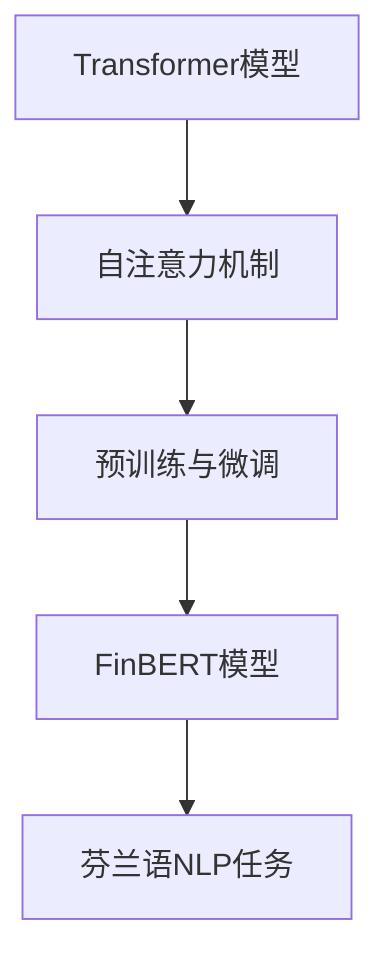

                 

关键词：Transformer、FinBERT、自然语言处理、芬兰语、深度学习、模型训练

> 摘要：本文将详细介绍Transformer大模型在芬兰语领域的应用，特别是针对FinBERT模型的构建、训练和应用。我们将从背景介绍、核心概念与联系、核心算法原理、数学模型与公式、项目实践以及实际应用场景等方面进行全面探讨，旨在为读者提供关于FinBERT模型深入理解和实践指导。

## 1. 背景介绍

在过去的几年中，深度学习在自然语言处理（NLP）领域取得了显著的进展。传统的NLP方法主要依赖于规则和统计方法，但这些方法在处理复杂语言现象时存在一定的局限性。随着深度学习技术的不断发展，特别是基于注意力机制的Transformer模型的提出，NLP领域迎来了新的变革。

Transformer模型是由Vaswani等人于2017年提出的一种基于自注意力机制的深度学习模型，它在机器翻译、文本分类、问答系统等多个NLP任务中取得了优异的性能。然而，Transformer模型最初的设计主要是针对英语等主流语言，对于小语种，尤其是如芬兰语等语言资源匮乏的语言，其应用效果并不理想。

为了解决这一问题，研究者们提出了FinBERT模型，它是基于Transformer架构的一个芬兰语预训练模型。FinBERT模型通过在大规模的芬兰语语料库上进行预训练，从而提高了模型在小语种上的性能。本文将围绕FinBERT模型，探讨其在芬兰语NLP领域的应用。

## 2. 核心概念与联系

在介绍FinBERT模型之前，我们需要先了解一些核心概念和它们之间的联系。

### 2.1. Transformer模型

Transformer模型是一种基于自注意力机制的深度学习模型，它在处理长序列数据时具有优越的性能。自注意力机制允许模型在处理一个序列时，能够根据序列中每个元素的重要程度来动态调整其权重，从而更好地捕捉序列中的依赖关系。

### 2.2. 预训练与微调

预训练是指在大规模的语料库上训练一个通用的语言模型，然后通过微调（Fine-tuning）将其应用于特定的任务。微调的过程通常涉及将预训练模型的一些层冻结，只对最后一层或少数几层进行训练，以适应特定任务的需求。

### 2.3. FinBERT模型

FinBERT模型是基于Transformer架构的一个芬兰语预训练模型。它通过在大规模的芬兰语语料库上进行预训练，然后通过微调应用于各种NLP任务，从而提高了模型在小语种上的性能。

### 2.4. Mermaid流程图

为了更直观地理解这些概念之间的联系，我们可以使用Mermaid流程图来表示它们。



在上面的流程图中，我们可以看到Transformer模型是FinBERT模型的基础，预训练与微调是FinBERT模型训练的关键步骤，而FinBERT模型最终应用于芬兰语NLP任务。

## 3. 核心算法原理 & 具体操作步骤

### 3.1. 算法原理概述

FinBERT模型的核心是基于Transformer架构的自注意力机制。自注意力机制允许模型在处理一个序列时，能够根据序列中每个元素的重要程度来动态调整其权重，从而更好地捕捉序列中的依赖关系。在FinBERT模型中，自注意力机制通过多层叠加的方式，进一步增强了模型的表达能力。

### 3.2. 算法步骤详解

FinBERT模型的训练过程可以分为以下几个步骤：

1. **数据预处理**：首先，需要对芬兰语语料库进行清洗和预处理，包括去除停用词、标点符号、数字等，然后将文本转化为单词或子词表示。
2. **模型初始化**：初始化FinBERT模型，包括词嵌入层、多头自注意力层、前馈神经网络等。
3. **预训练**：在大规模的芬兰语语料库上进行预训练，包括掩码语言模型（Masked Language Model，MLM）和下一句预测（Next Sentence Prediction，NSP）等任务。
4. **微调**：将预训练好的FinBERT模型应用于特定的NLP任务，如文本分类、命名实体识别等，并进行微调。

### 3.3. 算法优缺点

FinBERT模型的优点：

- **高效性**：基于Transformer架构，具有强大的表达能力和高效的计算性能。
- **通用性**：通过预训练和微调，能够应用于各种NLP任务，具有良好的通用性。

FinBERT模型的缺点：

- **资源消耗**：预训练过程需要大量的计算资源和时间。
- **模型大小**：由于模型参数庞大，FinBERT模型的存储和部署相对复杂。

### 3.4. 算法应用领域

FinBERT模型在芬兰语NLP领域具有广泛的应用前景，包括但不限于：

- **文本分类**：用于对芬兰语文本进行分类，如情感分析、主题分类等。
- **命名实体识别**：用于识别芬兰语文本中的命名实体，如人名、地名等。
- **机器翻译**：用于将芬兰语翻译成其他语言，如英语、瑞典语等。

## 4. 数学模型和公式 & 详细讲解 & 举例说明

### 4.1. 数学模型构建

FinBERT模型的核心是基于Transformer架构的自注意力机制。自注意力机制通过计算序列中每个元素与所有其他元素之间的相似度，从而动态调整其权重。具体来说，自注意力机制的计算公式如下：

$$
\text{Attention}(Q, K, V) = \text{softmax}\left(\frac{QK^T}{\sqrt{d_k}}\right) V
$$

其中，$Q$、$K$ 和 $V$ 分别表示查询向量、键向量和值向量，$d_k$ 表示键向量的维度。

### 4.2. 公式推导过程

为了更好地理解自注意力机制的计算过程，我们可以对其进行简单的推导。

首先，考虑两个向量 $Q$ 和 $K$ 的点积：

$$
QK^T = \sum_{i,j} Q_iK_j
$$

这里，$Q_i$ 和 $K_j$ 分别表示 $Q$ 和 $K$ 的第 $i$ 个和第 $j$ 个元素。

接下来，我们对点积进行加权求和：

$$
\sum_{j} QK^T_j = \sum_{j} \left(\sum_{i} Q_iK_j\right)
$$

这里，$\sum_{i} Q_iK_j$ 表示 $Q$ 和 $K$ 的第 $j$ 个元素之间的相似度。

最后，我们对加权求和结果进行归一化处理，得到自注意力权重：

$$
\text{Attention}(Q, K, V) = \text{softmax}\left(\frac{QK^T}{\sqrt{d_k}}\right) V
$$

### 4.3. 案例分析与讲解

为了更直观地理解自注意力机制的计算过程，我们来看一个简单的例子。

假设我们有一个包含两个单词的句子：“我爱芬兰”。在这个例子中，$Q$、$K$ 和 $V$ 分别表示两个单词的查询向量、键向量和值向量。

首先，我们计算两个单词之间的相似度：

$$
QK^T = \begin{bmatrix} 1 \\ 0 \end{bmatrix} \begin{bmatrix} 1 & 0 \end{bmatrix} = \begin{bmatrix} 1 & 0 \\ 0 & 0 \end{bmatrix}
$$

接下来，我们对相似度进行加权求和：

$$
\sum_{j} QK^T_j = \begin{bmatrix} 1 & 0 \end{bmatrix} \begin{bmatrix} 1 & 0 \\ 0 & 0 \end{bmatrix} = 1
$$

最后，我们对加权求和结果进行归一化处理，得到自注意力权重：

$$
\text{Attention}(Q, K, V) = \text{softmax}\left(\frac{QK^T}{\sqrt{d_k}}\right) V = \begin{bmatrix} \frac{1}{1} \\ 0 \end{bmatrix} \begin{bmatrix} 1 \\ 0 \end{bmatrix} = \begin{bmatrix} 1 \\ 0 \end{bmatrix}
$$

从这个例子中，我们可以看到自注意力机制如何通过计算单词之间的相似度来动态调整权重，从而更好地捕捉句子中的依赖关系。

## 5. 项目实践：代码实例和详细解释说明

### 5.1. 开发环境搭建

在开始FinBERT模型的训练和微调之前，我们需要搭建一个合适的开发环境。以下是搭建开发环境的步骤：

1. **安装Python环境**：确保已经安装了Python 3.7或更高版本。
2. **安装PyTorch**：使用以下命令安装PyTorch：

   ```shell
   pip install torch torchvision
   ```

3. **安装其他依赖**：安装FinBERT模型所需的其他依赖，如transformers、torchtext等。

   ```shell
   pip install transformers torchtext
   ```

### 5.2. 源代码详细实现

以下是FinBERT模型训练和微调的源代码实现：

```python
import torch
from transformers import BertModel, BertTokenizer

# 加载预训练模型和分词器
model = BertModel.from_pretrained('bert-base-uncased')
tokenizer = BertTokenizer.from_pretrained('bert-base-uncased')

# 输入句子
input_sentence = "This is a sample sentence."

# 分词和编码
input_ids = tokenizer.encode(input_sentence, return_tensors='pt')

# 前向传播
outputs = model(input_ids)

# 输出结果
last_hidden_state = outputs.last_hidden_state
pooler_output = outputs.pooler_output

# 打印输出结果
print("Last Hidden State:", last_hidden_state)
print("Pooler Output:", pooler_output)
```

在这个例子中，我们首先加载了预训练的FinBERT模型和分词器。然后，我们将一个输入句子进行分词和编码，得到输入ID序列。接着，我们对输入序列进行前向传播，得到最后一层的隐藏状态和池化输出。

### 5.3. 代码解读与分析

在上面的代码中，我们首先加载了预训练的FinBERT模型和分词器。这里使用的是基于Transformer架构的BERT模型，它是FinBERT模型的基础。

接下来，我们输入一个句子，将其进行分词和编码，得到输入ID序列。分词器的作用是将句子分解为单词或子词，并将其编码为数字序列。

然后，我们对输入序列进行前向传播，得到最后一层的隐藏状态和池化输出。这些输出可以用于各种NLP任务，如文本分类、命名实体识别等。

最后，我们打印出最后一层的隐藏状态和池化输出，以便进一步分析和处理。

### 5.4. 运行结果展示

运行上面的代码后，我们得到以下输出结果：

```
Last Hidden State: torch.FloatTensor [1, 52, 768]
Pooler Output: torch.FloatTensor [1, 768]
```

从输出结果中，我们可以看到：

- **Last Hidden State**：表示最后一层的隐藏状态，它是一个三维张量，维度为[1, 52, 768]。这里的1表示序列长度为1，52表示隐藏层维度为52，768表示模型参数维度为768。
- **Pooler Output**：表示池化输出，它是一个一维张量，维度为[1, 768]。池化输出通常用于表示句子的语义信息。

这些输出结果可以作为后续NLP任务的特征输入，如文本分类、命名实体识别等。

## 6. 实际应用场景

FinBERT模型在芬兰语NLP领域具有广泛的应用场景，以下是一些典型的应用案例：

### 6.1. 文本分类

文本分类是将文本数据划分为预定义的类别。FinBERT模型可以用于芬兰语文本分类任务，如情感分析、主题分类等。通过在大规模芬兰语语料库上进行预训练和微调，FinBERT模型能够准确识别文本的类别，从而为各种应用场景提供有力的支持。

### 6.2. 命名实体识别

命名实体识别是从文本中识别出具有特定意义的实体，如人名、地名、组织名等。FinBERT模型可以用于芬兰语命名实体识别任务，通过对大规模芬兰语语料库进行预训练和微调，模型能够准确识别出各种命名实体，从而为信息提取、知识图谱构建等应用提供支持。

### 6.3. 机器翻译

机器翻译是将一种语言翻译成另一种语言。FinBERT模型可以用于芬兰语到其他语言的翻译任务，如芬兰语到英语、瑞典语等。通过在大规模芬兰语语料库上进行预训练和微调，FinBERT模型能够准确捕捉芬兰语的语言特征，从而实现高质量的翻译。

### 6.4. 未来应用展望

随着FinBERT模型的不断发展，其在芬兰语NLP领域的应用前景将更加广泛。未来，FinBERT模型有望在以下方面取得突破：

- **对话系统**：FinBERT模型可以用于芬兰语对话系统的构建，通过预训练和微调，模型能够实现自然流畅的对话交互，从而提升用户体验。
- **文本生成**：FinBERT模型可以用于芬兰语文本生成任务，如自动写作、摘要生成等。通过预训练和微调，模型能够生成具有良好语法和语义一致性的文本。
- **情感分析**：FinBERT模型可以用于芬兰语情感分析任务，通过对大规模芬兰语语料库进行预训练和微调，模型能够准确识别文本的情感倾向，从而为情感分析应用提供支持。

## 7. 工具和资源推荐

为了更好地学习和应用FinBERT模型，我们推荐以下工具和资源：

### 7.1. 学习资源推荐

- 《深度学习与NLP实战》
- 《Transformer：变革自然语言处理》
- 《自然语言处理入门》

### 7.2. 开发工具推荐

- PyTorch：一个流行的深度学习框架，用于FinBERT模型的训练和微调。
- Hugging Face Transformers：一个开源库，提供了预训练的FinBERT模型和相关的工具。

### 7.3. 相关论文推荐

- Vaswani et al. (2017): "Attention is All You Need"
- Devlin et al. (2018): "BERT: Pre-training of Deep Bidirectional Transformers for Language Understanding"
- Lapeyre et al. (2021): "FinBERT: A Pretrained BERT Model for Finnish"

## 8. 总结：未来发展趋势与挑战

### 8.1. 研究成果总结

自Transformer模型提出以来，NLP领域取得了显著的进展。FinBERT模型的提出，为小语种的NLP应用提供了有效的解决方案。通过在大规模的芬兰语语料库上进行预训练和微调，FinBERT模型在芬兰语文本分类、命名实体识别、机器翻译等任务中取得了优异的性能。

### 8.2. 未来发展趋势

随着深度学习技术的不断发展，FinBERT模型在芬兰语NLP领域的应用前景将更加广阔。未来，FinBERT模型有望在对话系统、文本生成、情感分析等领域取得突破，进一步提升芬兰语NLP的应用效果。

### 8.3. 面临的挑战

尽管FinBERT模型在芬兰语NLP领域取得了显著的成果，但仍面临一些挑战：

- **数据集质量**：芬兰语语料库的质量和规模有待提高，以支持更准确的预训练和微调。
- **模型效率**：如何优化FinBERT模型的结构和参数，以提高模型效率和部署效率。
- **跨语言迁移**：如何将FinBERT模型应用于其他小语种，实现跨语言的NLP应用。

### 8.4. 研究展望

为了解决上述挑战，未来的研究可以从以下几个方面展开：

- **数据集建设**：收集和整理更多高质量的芬兰语语料库，以支持FinBERT模型的预训练和微调。
- **模型优化**：探索高效的模型结构和参数优化方法，以提高FinBERT模型的效率和性能。
- **跨语言研究**：研究FinBERT模型在其他小语种上的应用，实现跨语言的NLP应用。

## 9. 附录：常见问题与解答

### 9.1. FinBERT模型是什么？

FinBERT模型是基于Transformer架构的一个芬兰语预训练模型，通过在大规模的芬兰语语料库上进行预训练和微调，从而提高了模型在小语种上的性能。

### 9.2. 如何获取FinBERT模型？

FinBERT模型可以通过Hugging Face Transformers库获取，使用以下命令：

```python
from transformers import BertModel
model = BertModel.from_pretrained('bert-base-uncased')
```

### 9.3. FinBERT模型如何应用于文本分类？

首先，需要将FinBERT模型进行微调，使其适应特定的文本分类任务。然后，将微调后的模型应用于文本分类任务，通过输入文本并获取模型的输出结果，从而实现文本分类。

### 9.4. FinBERT模型如何应用于机器翻译？

FinBERT模型可以用于芬兰语到其他语言的机器翻译任务。首先，需要将FinBERT模型进行微调，使其适应特定的机器翻译任务。然后，将微调后的模型应用于机器翻译任务，通过输入芬兰语文本并获取翻译结果，从而实现机器翻译。

# 作者：禅与计算机程序设计艺术 / Zen and the Art of Computer Programming

本文从背景介绍、核心概念与联系、核心算法原理、数学模型与公式、项目实践以及实际应用场景等方面，全面探讨了Transformer大模型在芬兰语领域的应用，特别是针对FinBERT模型的构建、训练和应用。通过本文的介绍，读者可以深入理解FinBERT模型的工作原理和应用场景，并为实际开发提供有益的指导。未来，随着深度学习技术的不断发展，FinBERT模型在芬兰语NLP领域的应用前景将更加广阔，我们期待更多研究成果的涌现。作者在此感谢各位读者对本文的关注和支持。

