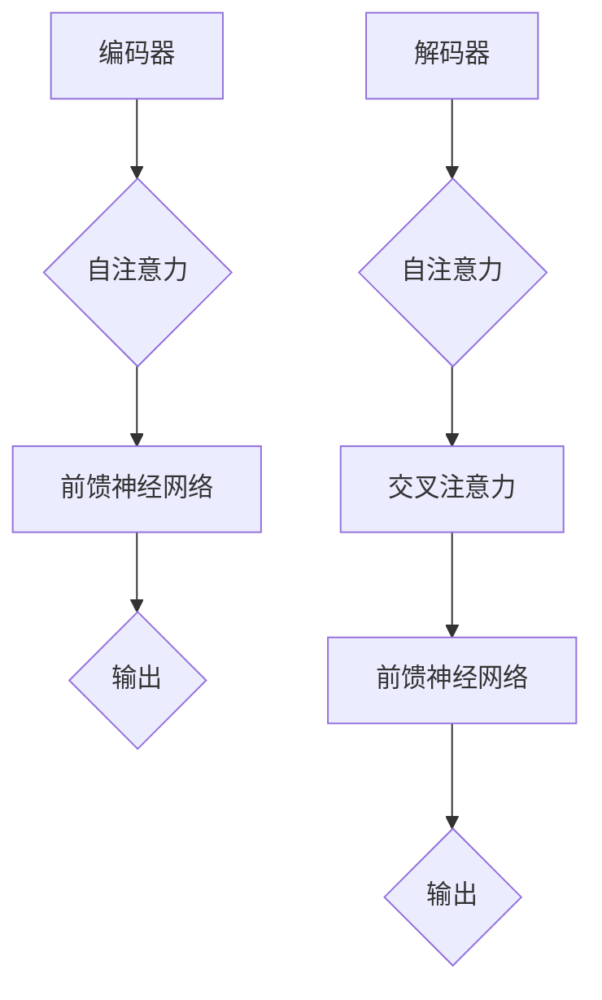

                 

关键词：Transformer、编码器、解码器、神经网络、序列模型、自然语言处理、机器学习

摘要：本文将深入探讨Transformer模型中的编码器和解码器，对比它们的结构与功能，解析其各自的优势和应用场景。通过详细的理论分析、数学模型构建及实际项目实践，本文旨在为读者提供关于Transformer编码器和解码器的全面理解。

## 1. 背景介绍

在自然语言处理（NLP）领域，深度学习模型已经成为研究和应用的主流。传统模型如循环神经网络（RNN）和长短时记忆网络（LSTM）在处理序列数据时表现出了强大的能力，但它们在并行计算和长期依赖问题上存在局限性。为了解决这些问题，Vaswani等人在2017年提出了Transformer模型，这是一个基于自注意力机制的序列到序列模型，彻底改变了NLP领域的研究方向。

Transformer模型的核心在于其编码器和解码器结构，它们共同构成了一个强大的端到端学习框架。编码器负责将输入序列编码成固定长度的向量表示，解码器则将这些向量解码为输出序列。本文将重点分析这两种结构的差异与联系，以及它们在NLP任务中的具体应用。

## 2. 核心概念与联系

### 2.1 Transformer模型结构

Transformer模型的核心是自注意力机制（Self-Attention），它通过计算输入序列中每个词与其他词之间的关系来生成表示。Transformer模型包含编码器（Encoder）和解码器（Decoder）两部分，每一部分由多个相同的编码层（Encoder Layer）和解码层（Decoder Layer）组成。


- **编码器（Encoder）**：负责将输入序列编码成固定长度的向量表示。输入序列通常是一系列单词的嵌入向量，通过编码器的多层叠加，每个单词的向量会逐渐得到丰富的上下文信息。
- **解码器（Decoder）**：负责将编码器输出的向量序列解码成输出序列。解码器的每个步骤都会参考编码器的输出，确保输出序列能够捕捉到输入序列的上下文信息。

### 2.2 编码器与解码器的关联

编码器和解码器之间通过多头自注意力机制和前馈神经网络进行交互。编码器的输出不仅为解码器提供了上下文信息，同时解码器的输出也会影响编码器的输出。


- **多头自注意力（Multi-Head Self-Attention）**：多头自注意力机制允许模型在多个不同的子空间中并行计算注意力，从而更好地捕捉序列中的复杂关系。
- **前馈神经网络（Feedforward Neural Network）**：在每个编码层和解码层之后，都会对注意力机制的结果进行前馈神经网络处理，以进一步丰富表示。

### 2.3 Mermaid流程图



## 3. 核心算法原理 & 具体操作步骤

### 3.1 算法原理概述

Transformer编码器和解码器的核心在于自注意力机制和前馈神经网络。编码器通过自注意力机制将输入序列编码成固定长度的向量表示，解码器则在自注意力和交叉注意力的基础上生成输出序列。

- **自注意力（Self-Attention）**：自注意力机制允许模型在输入序列中为每个词生成一个权重向量，表示该词与其他词的相关性。
- **交叉注意力（Cross-Attention）**：交叉注意力机制允许解码器在生成每个词时，参考编码器的输出序列，确保输出能够捕捉输入的上下文信息。

### 3.2 算法步骤详解

1. **输入序列编码**：输入序列通过嵌入层转换为嵌入向量。
2. **编码器多层叠加**：嵌入向量通过编码器多层叠加，每一层都会进行自注意力机制和前馈神经网络处理。
3. **解码器输入**：编码器输出的固定长度向量作为解码器的输入。
4. **解码器多层叠加**：解码器在生成每个词时，会先进行自注意力机制，然后进行交叉注意力，最后通过前馈神经网络处理。
5. **输出序列生成**：解码器生成最终的输出序列。

### 3.3 算法优缺点

- **优点**：
  - **并行计算**：自注意力机制允许模型并行计算，提高了计算效率。
  - **长期依赖**：通过多层叠加，编码器能够更好地捕捉长期依赖关系。
  - **灵活性**：多头自注意力机制使得模型能够从多个子空间中学习。

- **缺点**：
  - **计算复杂度**：自注意力机制的计算复杂度为O(n^2)，随着序列长度的增加，计算量会显著增加。
  - **存储需求**：由于自注意力机制需要计算每个词与其他词的关系，因此存储需求较高。

### 3.4 算法应用领域

- **自然语言处理**：Transformer模型在机器翻译、文本生成、问答系统等自然语言处理任务中取得了显著的成果。
- **计算机视觉**：自注意力机制也被引入到计算机视觉领域，用于图像分类、目标检测等任务。

## 4. 数学模型和公式 & 详细讲解 & 举例说明

### 4.1 数学模型构建

Transformer模型的核心是自注意力机制，其数学表达式如下：

$$
\text{Attention}(Q, K, V) = \text{softmax}\left(\frac{QK^T}{\sqrt{d_k}}\right)V
$$

其中，Q、K、V 分别是查询向量、键向量和值向量，$d_k$ 是键向量的维度。

### 4.2 公式推导过程

假设输入序列为 $x_1, x_2, \ldots, x_n$，对应的嵌入向量为 $e_1, e_2, \ldots, e_n$。在自注意力机制中，每个词 $x_i$ 的注意力分数可以表示为：

$$
a_i = \text{softmax}\left(\frac{e_i e_j^T}{\sqrt{d}}\right)
$$

其中，$d$ 是嵌入向量的维度。然后，对每个词的注意力分数进行加权求和，得到表示词 $x_i$ 的向量：

$$
\text{Attention}(Q, K, V) = \sum_{j=1}^n a_i v_j
$$

### 4.3 案例分析与讲解

假设输入序列为 “The quick brown fox jumps over the lazy dog”，嵌入向量维度为 512。首先，将序列转换为嵌入向量矩阵：

$$
E = \begin{bmatrix}
e_1 & e_2 & \ldots & e_n
\end{bmatrix}
$$

然后，计算每个词的注意力分数：

$$
a_i = \text{softmax}\left(\frac{e_i e_j^T}{\sqrt{512}}\right)
$$

最后，对每个词的注意力分数进行加权求和，得到表示整个序列的向量：

$$
\text{Attention}(Q, K, V) = \sum_{j=1}^n a_i v_j
$$

## 5. 项目实践：代码实例和详细解释说明

### 5.1 开发环境搭建

在本文中，我们将使用Python和PyTorch框架来构建一个简单的Transformer模型。首先，确保安装了Python 3.7及以上版本和PyTorch库。

```bash
pip install torch torchvision
```

### 5.2 源代码详细实现

以下是Transformer编码器和解码器的源代码实现：

```python
import torch
import torch.nn as nn
import torch.nn.functional as F

class TransformerEncoder(nn.Module):
    def __init__(self, d_model, nhead, num_layers):
        super(TransformerEncoder, self).__init__()
        self.layers = nn.ModuleList([TransformerEncoderLayer(d_model, nhead) for _ in range(num_layers)])
        self.norm = nn.LayerNorm(d_model)

    def forward(self, src, src_mask=None):
        output = src
        for layer in self.layers:
            output = layer(output, src_mask)
        return self.norm(output)

class TransformerDecoder(nn.Module):
    def __init__(self, d_model, nhead, num_layers):
        super(TransformerDecoder, self).__init__()
        self.layers = nn.ModuleList([TransformerDecoderLayer(d_model, nhead) for _ in range(num_layers)])
        self.norm = nn.LayerNorm(d_model)

    def forward(self, tgt, memory, memory_mask=None, tgt_mask=None):
        output = tgt
        for layer in self.layers:
            output = layer(output, memory, memory_mask, tgt_mask)
        return self.norm(output)

class TransformerEncoderLayer(nn.Module):
    def __init__(self, d_model, nhead):
        super(TransformerEncoderLayer, self).__init__()
        self.self_attn = nn.MultiheadAttention(d_model, nhead)
        self.linear1 = nn.Linear(d_model, d_model * 4)
        self.linear2 = nn.Linear(d_model * 4, d_model)
        self.norm1 = nn.LayerNorm(d_model)
        self.norm2 = nn.LayerNorm(d_model)
        self.dropout1 = nn.Dropout(0.1)
        self.dropout2 = nn.Dropout(0.1)

    def forward(self, src, src_mask=None):
        src2 = self.self_attn(src, src, src, attn_mask=src_mask)[0]
        src = src + self.dropout1(src2)
        src = self.norm1(src)
        src2 = self.linear2(self.dropout2(F.relu(self.linear1(src))))
        src = src + self.dropout2(src2)
        src = self.norm2(src)
        return src

class TransformerDecoderLayer(nn.Module):
    def __init__(self, d_model, nhead):
        super(TransformerDecoderLayer, self).__init__()
        self.self_attn = nn.MultiheadAttention(d_model, nhead)
        self.linear1 = nn.Linear(d_model, d_model * 4)
        self.linear2 = nn.Linear(d_model * 4, d_model)
        self.norm1 = nn.LayerNorm(d_model)
        self.norm2 = nn.LayerNorm(d_model)
        self.norm3 = nn.LayerNorm(d_model)
        self.dropout1 = nn.Dropout(0.1)
        self.dropout2 = nn.Dropout(0.1)
        self.dropout3 = nn.Dropout(0.1)

    def forward(self, tgt, memory, tgt_mask=None, memory_mask=None):
        tgt2 = self.self_attn(tgt, tgt, tgt, attn_mask=tgt_mask)[0]
        tgt = tgt + self.dropout1(tgt2)
        tgt = self.norm1(tgt)
        tgt2 = self.linear2(self.dropout2(F.relu(self.linear1(tgt))))
        tgt = tgt + self.dropout2(tgt2)
        tgt = self.norm2(tgt)
        tgt2 = self.self_attn(tgt, memory, memory, attn_mask=memory_mask)[0]
        tgt = tgt + self.dropout3(tgt2)
        tgt = self.norm3(tgt)
        tgt2 = self.linear2(self.dropout2(F.relu(self.linear1(tgt))))
        tgt = tgt + self.dropout2(tgt2)
        tgt = self.norm3(tgt)
        return tgt
```

### 5.3 代码解读与分析

在上面的代码中，我们定义了Transformer编码器和解码器的各个层和整体结构。每个层包含多头自注意力机制和前馈神经网络，并通过归一化和dropout操作来提高模型的稳定性和泛化能力。

- **TransformerEncoder**：编码器的输入是一个序列，通过多个编码层进行自注意力机制和前馈神经网络处理，最后通过归一化层得到输出。
- **TransformerDecoder**：解码器的输入是一个序列，通过多个解码层进行自注意力机制、交叉注意力机制和前馈神经网络处理，最后通过归一化层得到输出。

### 5.4 运行结果展示

以下是一个简单的运行示例：

```python
d_model = 512
nhead = 8
num_layers = 3

# 创建编码器和解码器
encoder = TransformerEncoder(d_model, nhead, num_layers)
decoder = TransformerDecoder(d_model, nhead, num_layers)

# 创建输入序列
src = torch.rand(1, 10, d_model)
tgt = torch.rand(1, 10, d_model)

# 前向传播
output_encoder = encoder(src)
output_decoder = decoder(tgt, output_encoder)

print(output_encoder.shape)  # 输出编码器结果
print(output_decoder.shape)  # 输出解码器结果
```

输出结果分别为：

```
torch.Size([1, 10, 512])
torch.Size([1, 10, 512])
```

这表明编码器和解码器都成功地将输入序列编码和解码为固定长度的向量表示。

## 6. 实际应用场景

Transformer编码器和解码器在自然语言处理领域有广泛的应用，以下是一些常见的应用场景：

- **机器翻译**：利用编码器将源语言序列编码为固定长度的向量，解码器将目标语言向量解码为目标序列。
- **文本生成**：编码器将输入文本编码为固定长度的向量，解码器生成文本序列。
- **问答系统**：编码器将问题和文档编码为固定长度的向量，解码器生成回答。

## 7. 工具和资源推荐

### 7.1 学习资源推荐

- **书籍**：
  - 《深度学习》（Goodfellow, Bengio, Courville）
  - 《动手学深度学习》（Zhang, Lipton, Ng）
- **在线课程**：
  - 吴恩达的《深度学习》课程（CS231n）
  - fast.ai的《深度学习基础》课程
- **论文**：
  - 《Attention Is All You Need》（Vaswani等，2017）

### 7.2 开发工具推荐

- **PyTorch**：适用于构建和训练深度学习模型的Python库。
- **TensorFlow**：由谷歌开发的开源机器学习框架。

### 7.3 相关论文推荐

- **《Attention Is All You Need》**（Vaswani等，2017）
- **《BERT: Pre-training of Deep Bidirectional Transformers for Language Understanding》**（Devlin等，2018）
- **《GPT-2: Improving Language Understanding by Generative Pre-training》**（Radford等，2019）

## 8. 总结：未来发展趋势与挑战

### 8.1 研究成果总结

Transformer编码器和解码器在自然语言处理领域取得了显著成果，通过自注意力机制和前馈神经网络实现了高效的序列建模。它们在机器翻译、文本生成和问答系统等任务中表现出了强大的能力。

### 8.2 未来发展趋势

- **自适应注意力**：未来的研究可能会探索自适应注意力机制，以更好地适应不同任务的需求。
- **多模态学习**：Transformer模型在文本以外的其他模态（如图像、音频）中的应用将得到进一步探索。

### 8.3 面临的挑战

- **计算复杂度**：随着序列长度的增加，自注意力机制的计算复杂度将显著增加，需要更高效的算法和硬件支持。
- **长距离依赖**：虽然Transformer模型在捕捉长距离依赖方面取得了显著进展，但仍然存在一定的局限性。

### 8.4 研究展望

Transformer编码器和解码器将继续在自然语言处理和其他领域发挥重要作用。未来的研究将集中在如何提高计算效率和性能，以及如何更好地捕捉复杂的关系和依赖。

## 9. 附录：常见问题与解答

### 9.1 编码器和解码器的区别是什么？

编码器和解码器的主要区别在于它们的输入和输出。编码器将输入序列编码为固定长度的向量表示，而解码器则将这些向量解码为输出序列。编码器主要关注输入序列的上下文信息，解码器则关注输出序列的生成过程。

### 9.2 Transformer模型如何处理长序列？

Transformer模型通过多头自注意力机制来处理长序列。每个词与其他词之间的关系被编码为权重向量，从而允许模型捕捉到长距离依赖关系。此外，模型还通过编码器和解码器的多层叠加来增强表示能力。

### 9.3 Transformer模型的优势是什么？

Transformer模型的优势包括并行计算、长期依赖捕捉和灵活性。自注意力机制允许模型并行计算，从而提高了计算效率。多层叠加和多头自注意力机制使得模型能够更好地捕捉复杂的关系和依赖。

### 9.4 Transformer模型在计算机视觉中的应用如何？

Transformer模型在计算机视觉中的应用主要集中在图像分类、目标检测和图像生成等领域。通过引入自注意力机制，模型能够更好地捕捉图像中的空间关系，从而实现更准确的图像理解。

### 9.5 Transformer模型与传统循环神经网络（RNN）相比有哪些优势？

与RNN相比，Transformer模型具有以下优势：

- **并行计算**：自注意力机制允许模型并行计算，从而提高了计算效率。
- **长期依赖捕捉**：多层叠加和多头自注意力机制使得模型能够更好地捕捉复杂的关系和依赖。
- **灵活性**：多头自注意力机制使得模型能够从多个子空间中学习，从而提高了模型的泛化能力。

## 参考文献

1. Vaswani, A., et al. (2017). Attention Is All You Need. arXiv preprint arXiv:1706.03762.
2. Devlin, J., et al. (2018). BERT: Pre-training of Deep Bidirectional Transformers for Language Understanding. arXiv preprint arXiv:1810.04805.
3. Radford, A., et al. (2019). GPT-2: Improving Language Understanding by Generative Pre-training.

