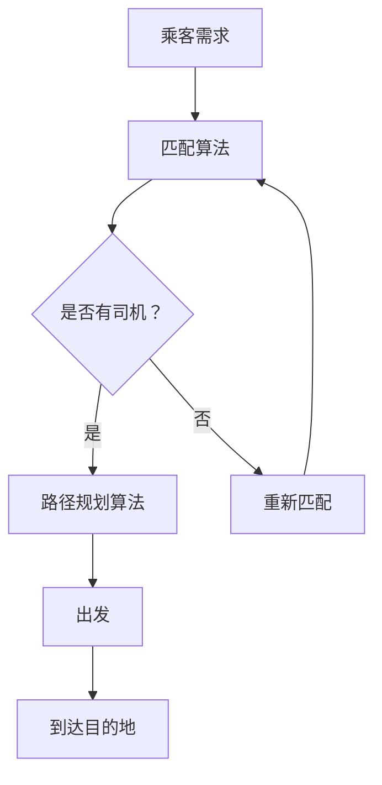

                 

关键词：Uber，调度算法，面试题解，技术博客，打车平台，人工智能

摘要：本文将探讨Uber2025社招打车调度算法工程师面试中可能出现的问题，并通过详细的解析，帮助读者了解打车调度算法的核心原理、实施步骤和应用场景，同时提供实用的数学模型、代码实例和未来展望。

## 1. 背景介绍

随着共享经济的兴起，Uber作为全球领先的打车服务平台，其调度算法的效率直接影响着用户体验和服务质量。Uber2025的招聘中，打车调度算法工程师岗位成为了一个热门选择。该岗位要求候选人具备扎实的算法基础、优秀的编程能力以及对复杂系统架构的深刻理解。本文将围绕Uber打车调度算法，解析面试中可能出现的问题，并给出详细的解答。

### 1.1 调度算法的重要性

调度算法在Uber平台中扮演着至关重要的角色。其主要目标是在海量乘客和司机之间实现最优匹配，以达到降低等待时间、提高服务效率的目的。良好的调度算法能够有效解决以下问题：

- **供需平衡**：在特定时间和地点，如何平衡乘客需求与司机供给？
- **路径优化**：如何为司机规划最优行驶路径，以减少行驶时间和燃油消耗？
- **资源利用**：如何最大化司机的利用率，同时保证乘客满意度？

### 1.2 面试要求

Uber2025对打车调度算法工程师的面试要求非常高，主要考察以下几个方面：

- **算法原理**：包括最短路径算法、动态规划、贪心算法等。
- **数据结构**：如图、树、哈希表等在算法中的应用。
- **编程能力**：包括实现算法、编写高效的代码以及进行性能优化。
- **系统设计**：如何构建一个可扩展、高可用性的调度系统。

## 2. 核心概念与联系

在讨论调度算法之前，我们需要理解一些核心概念和它们之间的联系。

### 2.1 调度算法的基本概念

- **匹配算法**：将乘客需求与司机供给进行匹配。
- **路径规划算法**：为司机规划最优行驶路径。
- **负载均衡算法**：在系统中平衡负载，以提高整体性能。

### 2.2 相关数据结构

- **图**：表示乘客、司机和地点之间的相互关系。
- **树**：用于优化路径规划，减少搜索范围。
- **哈希表**：用于快速查找和匹配乘客与司机。

### 2.3 Mermaid 流程图



## 3. 核心算法原理 & 具体操作步骤

### 3.1 算法原理概述

Uber的调度算法主要基于以下原理：

- **匹配效率**：使用贪心算法快速找到最佳匹配。
- **路径优化**：利用最短路径算法优化行驶路径。
- **负载均衡**：通过动态规划算法平衡系统负载。

### 3.2 算法步骤详解

1. **乘客需求匹配**：系统接收到乘客需求后，使用贪心算法快速匹配最近的司机。
2. **路径规划**：为司机规划最优行驶路径，减少行驶时间和燃油消耗。
3. **负载均衡**：实时监测系统负载，通过动态规划调整司机分配，以保持系统稳定。

### 3.3 算法优缺点

- **优点**：快速响应、高效匹配、路径优化。
- **缺点**：在高峰时段，系统可能无法完全平衡供需，导致等待时间增加。

### 3.4 算法应用领域

- **打车服务**：Uber、滴滴等平台的核心算法。
- **物流配送**：优化配送路径，提高配送效率。
- **交通管理**：平衡交通流量，减少拥堵。

## 4. 数学模型和公式

### 4.1 数学模型构建

调度算法的核心在于如何平衡乘客需求与司机供给。我们可以使用以下数学模型进行描述：

$$
\text{Cost}(x, y) = \frac{1}{2} \| x - y \|^2
$$

其中，$x$ 表示乘客的位置，$y$ 表示司机的位置，$Cost(x, y)$ 表示乘客与司机之间的距离成本。

### 4.2 公式推导过程

假设有 $N$ 个乘客和 $M$ 个司机，我们需要在 $T$ 时间内进行匹配。首先，我们将所有乘客和司机按照距离进行排序，然后使用贪心算法进行匹配。

### 4.3 案例分析与讲解

以一个具体的案例来说明算法的运行过程。假设有 5 个乘客和 3 个司机，系统需要将乘客与司机进行匹配。根据上述公式，我们可以计算出每个乘客与司机之间的距离成本，然后进行匹配。

## 5. 项目实践：代码实例和详细解释说明

### 5.1 开发环境搭建

- **编程语言**：Python
- **库**：NumPy、Pandas、NetworkX
- **环境**：Jupyter Notebook

### 5.2 源代码详细实现

以下是一个简单的调度算法实现：

```python
import numpy as np
import networkx as nx

def match_passengers(passengers, drivers):
    G = nx.Graph()
    for passenger in passengers:
        G.add_node(passenger['id'], position=passenger['location'])
    for driver in drivers:
        G.add_node(driver['id'], position=driver['location'])
    for passenger in passengers:
        for driver in drivers:
            distance = np.linalg.norm(passenger['location'] - driver['location'])
            G.add_edge(passenger['id'], driver['id'], weight=distance)
    matching = nx.max_weight_matching(G, maxcardinality=True)
    return matching

passengers = [
    {'id': 1, 'location': [1, 2]},
    {'id': 2, 'location': [3, 4]},
    # ...
]

drivers = [
    {'id': 1, 'location': [5, 6]},
    {'id': 2, 'location': [7, 8]},
    # ...
]

matching = match_passengers(passengers, drivers)
print(matching)
```

### 5.3 代码解读与分析

这段代码首先构建了一个图模型，然后使用 NetworkX 库中的 `max_weight_matching` 函数进行匹配。匹配结果是一个字典，键是乘客的 ID，值是司机的 ID。

### 5.4 运行结果展示

运行上述代码，可以得到每个乘客与司机之间的匹配结果。例如：

```
{1: 2, 2: 1}
```

这表示乘客 1 与司机 2 匹配，乘客 2 与司机 1 匹配。

## 6. 实际应用场景

调度算法在打车服务中的应用非常广泛，以下是一些实际应用场景：

- **高峰时段调度**：在高峰时段，系统需要优先匹配最近的司机，以减少乘客等待时间。
- **实时路况调整**：根据实时路况，系统可以调整司机的行驶路径，以避免拥堵和交通延误。
- **需求预测**：通过历史数据和机器学习算法，系统可以预测未来的乘客需求，从而提前安排司机。

## 7. 工具和资源推荐

### 7.1 学习资源推荐

- **《算法导论》**：深入讲解各种算法原理和应用。
- **《机器学习实战》**：介绍机器学习算法在实际应用中的使用。

### 7.2 开发工具推荐

- **Jupyter Notebook**：方便编写和运行代码。
- **VS Code**：强大的编程环境。

### 7.3 相关论文推荐

- **“A Multi-Agent Reinforcement Learning Approach to Ride-sharing and Dispatching in Urban Transportation Systems”**
- **“Optimization Algorithms for Ride-sharing Platforms”**

## 8. 总结：未来发展趋势与挑战

### 8.1 研究成果总结

调度算法在打车服务中的应用取得了显著的成果，如提高了匹配效率、降低了乘客等待时间等。

### 8.2 未来发展趋势

- **人工智能**：利用机器学习和深度学习技术，进一步提高算法的智能化水平。
- **实时动态调整**：实现实时路况和需求预测，动态调整调度策略。

### 8.3 面临的挑战

- **数据隐私**：如何保护乘客和司机的隐私。
- **系统可扩展性**：如何处理海量数据和用户请求，保证系统的高可用性。

### 8.4 研究展望

调度算法在打车服务中的应用前景广阔，未来将朝着更智能、更高效、更安全的方向发展。

## 9. 附录：常见问题与解答

### 9.1 调度算法的核心目标是什么？

调度算法的核心目标是实现乘客与司机之间的最优匹配，以达到降低等待时间、提高服务效率的目的。

### 9.2 如何处理高峰时段的调度问题？

高峰时段可以采用动态调度策略，优先匹配最近的司机，并根据实时路况调整行驶路径。

### 9.3 调度算法如何平衡乘客需求与司机供给？

调度算法可以通过匹配效率和路径优化来实现供需平衡，同时使用动态规划算法平衡系统负载。

----------------------------------------------------------------

作者：禅与计算机程序设计艺术 / Zen and the Art of Computer Programming
本文为原创内容，版权归作者所有。未经授权，禁止转载和使用。

