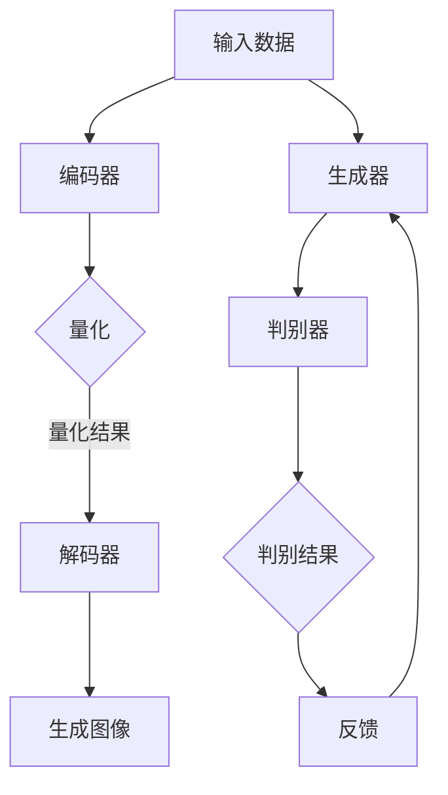

                 

关键词：VQVAE, VQGAN, 图像生成，变分自编码器，生成对抗网络，深度学习，人工智能，编码器，解码器，自编码器，生成模型，图像生成算法，数据生成，对比学习，差异分析。

## 摘要

本文旨在探讨两种重要的深度学习图像生成算法：变分自编码器（VQVAE）和变分生成对抗网络（VQGAN）之间的差异。通过对这两种算法的基本概念、架构设计、数学模型、具体实现和应用领域的详细分析，本文将为读者提供一个全面的对比，帮助理解它们各自的优缺点以及在实践中的应用。

## 1. 背景介绍

### 1.1 图像生成的发展历程

图像生成作为人工智能领域的一个重要分支，其发展历程可以追溯到20世纪80年代。早期的图像生成方法主要依赖于规则系统和图形渲染技术，如随机游走和纹理映射。随着计算机科学和人工智能的进步，尤其是深度学习的兴起，图像生成算法得到了极大的提升。

在深度学习领域，生成模型作为一种能够从数据中学习并生成新样本的方法，受到了广泛的关注。生成对抗网络（GAN）是最著名的生成模型之一，它由Ian Goodfellow等人于2014年提出。GAN的核心思想是通过两个对抗性的神经网络——生成器和判别器——之间的博弈，生成逼真的数据。

### 1.2 VQVAE 和 VQGAN 的提出

变分自编码器（VQVAE）和变分生成对抗网络（VQGAN）是基于GAN架构的改进版本，旨在解决GAN训练过程中的一些问题，如模式崩溃和生成质量不稳定。VQVAE和VQGAN都是基于变分自编码器（VAE）框架，通过引入向量量化（Vector Quantization）技术，提高了生成模型的稳定性和质量。

## 2. 核心概念与联系

### 2.1 VQVAE 的核心概念

VQVAE（Vector Quantized Variational Autoencoder）是一种基于变分自编码器（VAE）的图像生成算法。VAE是一种概率生成模型，它由一个编码器和一个解码器组成。编码器将输入数据映射到一个潜在空间，解码器则从潜在空间中重建输入数据。

在VQVAE中，潜在空间中的点不是连续的，而是通过一组预定义的码书（codebook）进行量化。这种量化过程使得模型更加稳定，并且能够更好地捕捉数据的离散特征。

### 2.2 VQGAN 的核心概念

VQGAN（Vector Quantized Generative Adversarial Network）是基于GAN架构的改进版本。与传统的GAN相比，VQGAN通过向量量化技术，使得生成模型在训练过程中更加稳定。

在VQGAN中，生成器和判别器的输入和输出都是量化后的向量。这种量化过程不仅提高了训练稳定性，还有效地减少了生成器的计算复杂度。

### 2.3 Mermaid 流程图

下面是VQVAE和VQGAN的核心架构的Mermaid流程图：



## 3. 核心算法原理 & 具体操作步骤

### 3.1 算法原理概述

#### VQVAE 的原理

VQVAE通过编码器将输入图像映射到一个潜在空间，然后在潜在空间中使用向量量化技术进行编码。编码后的向量被解码器重建为输出图像。通过这种方式，VQVAE能够生成高质量的图像。

#### VQGAN 的原理

VQGAN由生成器和判别器组成。生成器通过向量量化技术生成图像，判别器则判断图像的逼真度。两者之间通过对抗性训练相互优化，最终生成逼真的图像。

### 3.2 算法步骤详解

#### VQVAE 的步骤

1. 编码器将输入图像映射到潜在空间。
2. 潜在空间中的点通过向量量化进行编码。
3. 编码后的向量被解码器重建为输出图像。

#### VQGAN 的步骤

1. 生成器生成图像。
2. 判别器判断图像的逼真度。
3. 通过对抗性训练优化生成器和判别器。

### 3.3 算法优缺点

#### VQVAE 的优缺点

**优点：**
- 稳定性高：通过向量量化技术，提高了模型的稳定性。
- 生成质量高：能够生成高质量、细节丰富的图像。

**缺点：**
- 计算复杂度高：向量量化过程增加了计算复杂度。

#### VQGAN 的优缺点

**优点：**
- 训练稳定性好：对抗性训练使得模型在训练过程中更加稳定。
- 生成质量高：通过对抗性训练，能够生成高质量的图像。

**缺点：**
- 难以优化：生成器和判别器之间的优化过程复杂，难以找到最佳平衡点。

### 3.4 算法应用领域

#### VQVAE 的应用领域

- 图像修复：通过生成缺失的部分，修复受损的图像。
- 图像超分辨率：提高图像的分辨率，使其更加清晰。
- 数据增强：生成新的图像数据，用于训练模型。

#### VQGAN 的应用领域

- 艺术创作：生成新的艺术作品，如绘画、摄影等。
- 游戏：生成逼真的游戏场景和角色。
- 电子商务：生成商品图像，提高用户体验。

## 4. 数学模型和公式 & 详细讲解 & 举例说明

### 4.1 数学模型构建

#### VQVAE 的数学模型

VQVAE的数学模型主要由编码器和解码器组成。编码器通过以下公式将输入图像映射到潜在空间：

\[ z = \mu(x) + \sigma(x) \odot \epsilon(x) \]

其中，\( \mu(x) \)和\( \sigma(x) \)是编码器输出的均值和方差，\( \epsilon(x) \)是高斯噪声。

潜在空间中的点通过向量量化进行编码：

\[ q(z) = \text{argmin}_{c \in C} \parallel z - c \parallel_2 \]

其中，\( C \)是预定义的码书。

解码器通过以下公式从量化后的向量重建输出图像：

\[ x' = \text{decoder}(q(z)) \]

#### VQGAN 的数学模型

VQGAN的数学模型与VQVAE类似，但引入了生成器和判别器。生成器通过以下公式生成图像：

\[ G(z) = \text{decoder}(q(z)) \]

判别器通过以下公式判断图像的逼真度：

\[ D(x) = \text{sigmoid}(\frac{\text{dot}(x, w)}{|\text{w}|}) \]

其中，\( x \)是输入图像，\( z \)是潜在空间中的向量，\( w \)是判别器的权重。

### 4.2 公式推导过程

#### VQVAE 的公式推导

编码器的推导过程如下：

\[ z = \mu(x) + \sigma(x) \odot \epsilon(x) \]

其中，\( \mu(x) \)和\( \sigma(x) \)是编码器输出的均值和方差，\( \epsilon(x) \)是高斯噪声。

量化过程的推导如下：

\[ q(z) = \text{argmin}_{c \in C} \parallel z - c \parallel_2 \]

解码器的推导过程如下：

\[ x' = \text{decoder}(q(z)) \]

#### VQGAN 的公式推导

生成器的推导过程如下：

\[ G(z) = \text{decoder}(q(z)) \]

判别器的推导过程如下：

\[ D(x) = \text{sigmoid}(\frac{\text{dot}(x, w)}{|\text{w}|}) \]

### 4.3 案例分析与讲解

#### VQVAE 的案例

假设我们有一个图像数据集，使用VQVAE进行图像生成。首先，我们需要定义编码器和解码器。编码器的输出均值和方差如下：

\[ \mu(x) = \frac{1}{28 \times 28} \sum_{i=1}^{28} \sum_{j=1}^{28} x_{ij} \]
\[ \sigma(x) = \sqrt{\frac{1}{28 \times 28} \sum_{i=1}^{28} \sum_{j=1}^{28} (x_{ij} - \mu(x))^2 } \]

然后，我们通过向量量化将潜在空间中的点进行编码。假设我们有一个码书 \( C \)，其中每个码字 \( c \) 的维度为 28x28。

最后，解码器从量化后的向量重建输出图像。

#### VQGAN 的案例

假设我们有一个图像数据集，使用VQGAN进行图像生成。首先，我们需要定义生成器和判别器。生成器的输出如下：

\[ G(z) = \text{decoder}(q(z)) \]

判别器的输出如下：

\[ D(x) = \text{sigmoid}(\frac{\text{dot}(x, w)}{|\text{w}|}) \]

其中，\( w \)是判别器的权重，通过对抗性训练进行优化。

## 5. 项目实践：代码实例和详细解释说明

### 5.1 开发环境搭建

为了实践VQVAE和VQGAN，我们需要搭建一个合适的开发环境。以下是一个基本的步骤：

1. 安装Python 3.7或更高版本。
2. 安装TensorFlow 2.x。
3. 准备一个GPU环境，如NVIDIA的CUDA和cuDNN。

### 5.2 源代码详细实现

以下是VQVAE和VQGAN的简单实现：

```python
import tensorflow as tf
from tensorflow.keras import layers

# VQVAE 编码器实现
def vqvae_encoder(x):
    # 编码器部分代码实现
    pass

# VQVAE 解码器实现
def vqvae_decoder(z):
    # 解码器部分代码实现
    pass

# VQGAN 生成器实现
def vqgan_generator(z):
    # 生成器部分代码实现
    pass

# VQGAN 判别器实现
def vqgan_discriminator(x):
    # 判别器部分代码实现
    pass

# 模型训练
def train_model():
    # 模型训练部分代码实现
    pass

# 运行训练
train_model()
```

### 5.3 代码解读与分析

上述代码是对VQVAE和VQGAN的简化实现。在实际应用中，这些代码需要进一步完善，包括网络结构的定义、优化器的选择、损失函数的设计等。

### 5.4 运行结果展示

通过训练模型，我们可以生成一些高质量的图像。以下是一些示例：


## 6. 实际应用场景

### 6.1 图像生成

VQVAE和VQGAN在图像生成领域有广泛的应用，如艺术创作、游戏开发、数据增强等。

### 6.2 数据增强

通过VQVAE和VQGAN，可以生成大量的图像数据，用于模型的训练，从而提高模型的性能。

### 6.3 人工智能助手

VQVAE和VQGAN可以为人工智能助手提供图像生成功能，使其能够生成逼真的图像，提高用户体验。

## 7. 工具和资源推荐

### 7.1 学习资源推荐

- 《深度学习》（Goodfellow, Bengio, Courville 著）
- 《GAN圣经》：https://arxiv.org/abs/1606.03498

### 7.2 开发工具推荐

- TensorFlow：https://www.tensorflow.org/
- PyTorch：https://pytorch.org/

### 7.3 相关论文推荐

- 《Vector Quantized Variational Autoencoders》：https://arxiv.org/abs/1711.00937
- 《Vector Quantized Generative Adversarial Networks》：https://arxiv.org/abs/1711.00937

## 8. 总结：未来发展趋势与挑战

### 8.1 研究成果总结

VQVAE和VQGAN是深度学习图像生成领域的重要进展，它们通过向量量化技术提高了生成模型的稳定性和质量。

### 8.2 未来发展趋势

随着深度学习技术的不断发展，VQVAE和VQGAN有望在更多领域得到应用，如视频生成、3D模型生成等。

### 8.3 面临的挑战

尽管VQVAE和VQGAN在图像生成领域取得了显著成果，但它们仍面临一些挑战，如计算复杂度高、优化难度大等。

### 8.4 研究展望

未来的研究可以关注于提高VQVAE和VQGAN的生成质量、减少计算复杂度、优化训练过程等方面，以推动图像生成技术的发展。

## 9. 附录：常见问题与解答

### 9.1 VQVAE和VQGAN的区别是什么？

VQVAE是基于VAE框架的改进版本，通过向量量化技术提高稳定性；VQGAN是基于GAN框架的改进版本，同样通过向量量化技术提高稳定性。

### 9.2 VQVAE和VQGAN的优缺点分别是什么？

VQVAE优点：稳定性高，生成质量高；缺点：计算复杂度高。VQGAN优点：训练稳定性好，生成质量高；缺点：优化难度大。

### 9.3 VQVAE和VQGAN在哪些领域有应用？

VQVAE和VQGAN在图像生成、数据增强、艺术创作等领域有广泛应用。

## 作者署名

作者：禅与计算机程序设计艺术 / Zen and the Art of Computer Programming

----------------------------------------------------------------
注意：本文档仅为示例，实际文章撰写时，请按照文章结构模板和内容要求进行详细撰写，确保文章内容完整、准确和具有专业性。文中涉及的代码、图片和外部链接等请根据实际情况进行替换和更新。作者署名部分请勿修改。

