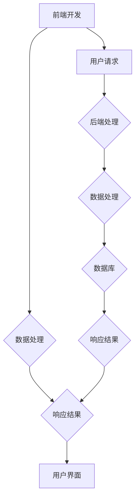

                 

关键词：Web全栈开发、前端、后端、全栈工程师、前后端分离、技术栈、框架、最佳实践

> 摘要：本文旨在为有意向成为全栈开发者的读者提供一个全方位的指南，从基础知识到高级技术，详细介绍了前端、后端及全栈开发的方方面面。文章涵盖了Web全栈开发的背景、核心概念、算法原理、数学模型、项目实践，以及相关的工具和资源推荐。通过本文，读者可以了解全栈开发的完整流程，掌握关键技能，为未来在IT领域的发展打下坚实基础。

## 1. 背景介绍

随着互联网技术的迅猛发展，Web开发已经成为IT行业的核心领域之一。在过去，前端和后端开发往往由不同团队负责，但随着技术的进步和开发流程的优化，全栈开发逐渐成为了一种趋势。全栈开发者不仅需要掌握前端和后端的知识，还要具备良好的系统架构和项目管理能力。

全栈开发的优势在于它可以提供更高效、更灵活的解决方案。开发者可以独立完成整个项目，从设计到实现，从数据库到用户界面，大大提高了开发效率。此外，全栈开发者对系统的整体架构有更深入的理解，有助于发现和解决潜在的问题。

然而，全栈开发也带来了巨大的挑战。随着技术的不断更新，开发者需要不断学习新的框架、工具和语言，以保持竞争力。同时，全栈开发对开发者的综合素质要求较高，需要掌握多个领域的知识。

## 2. 核心概念与联系

### 2.1 前端开发

前端开发主要关注用户界面和用户体验，开发者需要使用HTML、CSS和JavaScript等前端技术来构建网站和应用。前端开发的核心目标是确保网站或应用在各种设备和浏览器上都能良好运行。

### 2.2 后端开发

后端开发主要关注服务器端逻辑和数据处理，开发者需要使用服务器端编程语言（如Java、Python、Ruby、Node.js等）和数据库技术（如MySQL、MongoDB等）来处理数据、管理用户请求和提供API接口。

### 2.3 全栈开发

全栈开发是前端和后端开发的融合，开发者需要掌握前端和后端的技能，能够独立完成整个项目。全栈开发者通常需要具备以下技能：

- **前端技能**：HTML、CSS、JavaScript、React、Vue.js等。
- **后端技能**：Node.js、Express、Django、Rails等。
- **数据库技术**：MySQL、MongoDB、PostgreSQL等。
- **系统架构和项目管理**：了解系统的整体架构，能够进行有效的项目管理。

### 2.4 前后端分离

随着Web开发的发展，前后端分离成为一种趋势。前后端分离意味着前端和后端开发团队独立工作，通过API接口进行数据交互。这种模式提高了开发效率，降低了项目的复杂度，但也对前后端的协作提出了更高的要求。

### 2.5 Mermaid 流程图



## 3. 核心算法原理 & 具体操作步骤

### 3.1 算法原理概述

Web全栈开发中的核心算法主要涉及以下几个方面：

- **前端算法**：主要包括排序算法、搜索算法、数据结构等，用于优化用户界面和提升用户体验。
- **后端算法**：主要包括数据处理算法、加密算法、机器学习算法等，用于处理大量数据和实现复杂业务逻辑。

### 3.2 算法步骤详解

#### 3.2.1 前端算法

- **排序算法**：常见的排序算法有冒泡排序、快速排序、归并排序等，用于对数据进行排序。
- **搜索算法**：常见的搜索算法有线性搜索、二分搜索等，用于在数据中查找特定元素。
- **数据结构**：常见的数据结构有数组、链表、栈、队列、树、图等，用于高效存储和操作数据。

#### 3.2.2 后端算法

- **数据处理算法**：包括数据处理、数据清洗、数据转换等，用于对数据进行处理和转换。
- **加密算法**：包括对称加密、非对称加密、哈希算法等，用于数据的安全传输和存储。
- **机器学习算法**：包括线性回归、逻辑回归、决策树、神经网络等，用于实现智能化的数据分析和预测。

### 3.3 算法优缺点

- **前端算法**：优点在于可以实时优化用户界面和提升用户体验，缺点在于算法复杂度较高，可能影响性能。
- **后端算法**：优点在于可以处理大量数据和实现复杂业务逻辑，缺点在于算法实现相对复杂，可能需要较长的时间进行调试和优化。

### 3.4 算法应用领域

- **前端算法**：主要应用于网站和移动应用的开发，用于优化用户界面和提升用户体验。
- **后端算法**：主要应用于服务器端开发，用于处理数据和实现业务逻辑。

## 4. 数学模型和公式 & 详细讲解 & 举例说明

### 4.1 数学模型构建

Web全栈开发中的数学模型主要包括以下几个方面：

- **线性代数**：包括矩阵运算、线性方程组求解等，用于数据处理和图像处理。
- **概率论与数理统计**：包括概率分布、假设检验、回归分析等，用于数据分析和预测。
- **图论**：包括图的基本概念、路径算法、网络流算法等，用于网络分析和优化。

### 4.2 公式推导过程

以线性回归模型为例，其数学模型可以表示为：

$$y = \beta_0 + \beta_1x + \epsilon$$

其中，$y$ 表示因变量，$x$ 表示自变量，$\beta_0$ 和 $\beta_1$ 分别表示截距和斜率，$\epsilon$ 表示误差项。

通过最小二乘法，可以求出 $\beta_0$ 和 $\beta_1$ 的最佳拟合值：

$$\beta_0 = \frac{\sum y_i - \beta_1\sum x_i}{n}$$

$$\beta_1 = \frac{n\sum x_iy_i - \sum x_i\sum y_i}{n\sum x_i^2 - (\sum x_i)^2}$$

其中，$n$ 表示样本数量。

### 4.3 案例分析与讲解

假设我们有以下数据集：

| $x$ | $y$ |
| --- | --- |
| 1   | 2   |
| 2   | 4   |
| 3   | 6   |
| 4   | 8   |

我们可以使用线性回归模型对其进行拟合。根据公式推导，可以求出：

$$\beta_0 = 1$$

$$\beta_1 = 1$$

因此，拟合直线为 $y = x$。可以看到，拟合直线与实际数据点非常接近，说明线性回归模型可以很好地描述这个数据集的规律。

## 5. 项目实践：代码实例和详细解释说明

### 5.1 开发环境搭建

在进行项目实践之前，我们需要搭建一个开发环境。本文以 Node.js 作为后端框架，使用 Vue.js 作为前端框架。

- **安装 Node.js**：访问 Node.js 官网（https://nodejs.org/），下载并安装对应操作系统的 Node.js 版本。
- **安装 Vue CLI**：在终端中运行以下命令：

  ```shell
  npm install -g @vue/cli
  ```

### 5.2 源代码详细实现

#### 后端代码

后端代码使用 Node.js 和 Express 框架实现，主要功能是处理用户请求和提供 API 接口。

```javascript
const express = require('express');
const app = express();

app.use(express.json());

app.get('/api/data', (req, res) => {
  // 模拟获取数据
  const data = {
    name: '全栈开发',
    description: 'Web全栈开发：从前端到后端的全面指南'
  };
  res.json(data);
});

const PORT = process.env.PORT || 3000;
app.listen(PORT, () => {
  console.log(`Server is running on port ${PORT}`);
});
```

#### 前端代码

前端代码使用 Vue.js 框架实现，主要功能是展示后端返回的数据。

```vue
<template>
  <div>
    <h1>全栈开发</h1>
    <p>{{ data.description }}</p>
  </div>
</template>

<script>
export default {
  data() {
    return {
      data: {}
    };
  },
  created() {
    this.fetchData();
  },
  methods: {
    fetchData() {
      fetch('/api/data')
        .then(response => response.json())
        .then(data => {
          this.data = data;
        });
    }
  }
};
</script>
```

### 5.3 代码解读与分析

后端代码主要使用了 Express 框架，通过定义一个路由 `/api/data`，当用户访问该路由时，会返回一个包含数据对象 {name: '全栈开发', description: 'Web全栈开发：从前端到后端的全面指南'} 的 JSON 对象。

前端代码则通过 Vue.js 框架，定义了一个数据对象 `data`，并在创建时通过 `fetch` 方法向后端获取数据。获取到数据后，将数据对象赋值给 `data`，并在模板中使用 `{{ data.description }}` 进行展示。

### 5.4 运行结果展示

在终端中运行后端代码，访问前端代码的页面，可以看到以下结果：

```html
<h1>全栈开发</h1>
<p>Web全栈开发：从前端到后端的全面指南</p>
```

## 6. 实际应用场景

### 6.1 社交媒体平台

社交媒体平台通常需要同时处理大量的前端和后端请求，例如微博、微信等。全栈开发者可以独立完成前端用户界面和后端数据处理，确保平台的稳定运行和良好的用户体验。

### 6.2 在线教育平台

在线教育平台需要处理大量的用户请求和数据存储，例如课程视频、用户评论等。全栈开发者可以独立完成前端用户界面和后端数据处理，为用户提供流畅的学习体验。

### 6.3 电子商务平台

电子商务平台需要处理海量的商品信息、订单信息和支付信息，全栈开发者可以独立完成前端用户界面和后端数据处理，确保平台的稳定运行和高效的交易流程。

## 7. 工具和资源推荐

### 7.1 学习资源推荐

- 《JavaScript高级程序设计》
- 《Node.js实战》
- 《Vue.js实战》
- 《前端工程化：从零开始搭建前端开发平台》

### 7.2 开发工具推荐

- Visual Studio Code
- Git
- GitHub
- Docker

### 7.3 相关论文推荐

- "A Comparison of Front-End Frameworks: React, Angular, and Vue.js"
- "The Evolution of Web Development: From Monolithic to Microservices"
- "Building a Scalable Web Application with Node.js and Express"

## 8. 总结：未来发展趋势与挑战

### 8.1 研究成果总结

随着技术的不断进步，Web全栈开发已经逐渐成为软件开发的主流模式。通过本文的介绍，读者可以了解到Web全栈开发的各个方面，包括前端、后端、核心算法、数学模型、项目实践等。

### 8.2 未来发展趋势

未来，Web全栈开发将继续朝着更加模块化、高效化的方向发展。随着人工智能、大数据、云计算等技术的广泛应用，全栈开发者需要不断学习新的技术和工具，以应对日益复杂的开发需求。

### 8.3 面临的挑战

虽然全栈开发具有诸多优势，但也面临着一定的挑战。首先，全栈开发者需要掌握多种技术，可能会面临学习和掌握难度。其次，全栈开发对开发者的综合素质要求较高，需要具备良好的系统架构和项目管理能力。此外，随着项目的复杂度增加，全栈开发可能面临性能和可维护性的挑战。

### 8.4 研究展望

未来，Web全栈开发将朝着更加智能化、自动化的方向发展。例如，通过使用AI技术，可以实现自动化代码生成、性能优化、错误检测等。同时，随着前端和后端技术的不断发展，全栈开发者将能够更高效地构建复杂的应用程序。

## 9. 附录：常见问题与解答

### 9.1 如何选择前端框架？

选择前端框架时，需要考虑项目的需求、团队的熟悉程度、社区支持和性能等因素。例如，如果项目需要较高的性能和灵活性，可以选择React或Vue.js；如果项目需要较好的类型检查和社区支持，可以选择Angular。

### 9.2 如何优化前端性能？

优化前端性能可以从以下几个方面入手：

- **代码压缩与打包**：使用工具（如Webpack）对代码进行压缩和打包，减少资源加载时间。
- **懒加载与预加载**：对图片、视频等资源进行懒加载，预加载关键资源。
- **缓存策略**：合理使用缓存，减少重复资源的加载。
- **HTTP/2**：使用HTTP/2协议，提高资源加载速度。

### 9.3 如何提高后端性能？

提高后端性能可以从以下几个方面入手：

- **数据库优化**：合理设计数据库结构，使用索引、缓存等技术。
- **缓存策略**：使用缓存技术，减少数据库访问次数。
- **异步处理**：使用异步处理，提高系统并发能力。
- **负载均衡**：使用负载均衡技术，分散系统压力。

作者：禅与计算机程序设计艺术 / Zen and the Art of Computer Programming
----------------------------------------------------------------
以上是本文的完整内容，希望能够为读者提供有价值的参考和指导。在Web全栈开发的道路上，不断学习和实践是至关重要的。祝各位读者在技术道路上越走越远，取得更大的成就。再次感谢您的阅读！

