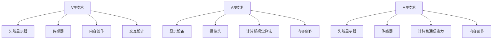

                 

关键词：虚拟现实（VR）、增强现实（AR）、混合现实（MR）、交叉应用、协同发展、技术融合、未来趋势、挑战与机遇

> 摘要：随着科技的发展，虚拟现实（VR）、增强现实（AR）和混合现实（MR）技术逐渐成熟并融合，为各行各业带来了革命性的变化。本文将深入探讨这三种技术的协同发展，以及它们在现实世界中的应用和未来的发展趋势。

## 1. 背景介绍

随着计算机技术、图形处理能力和网络通信技术的飞速发展，虚拟现实（VR）、增强现实（AR）和混合现实（MR）技术逐渐走进人们的日常生活。它们不仅在娱乐、教育和医疗等领域表现出巨大的潜力，还在工业设计、城市规划、军事训练等众多领域发挥着关键作用。

虚拟现实（VR）是一种将用户沉浸在一个完全虚构的三维环境中，通过头戴式显示器和传感器设备实现的体验。增强现实（AR）则是在现实世界中叠加虚拟信息，使现实场景与虚拟内容相互融合。混合现实（MR）则将虚拟现实和增强现实结合在一起，提供了一个更加丰富和交互性的体验。

### 1.1 发展历程

虚拟现实（VR）的概念最早可以追溯到1960年代，当时由 Ivan Sutherland 发明了第一个头戴式显示器。1980年代，VR技术开始应用于军事和航空航天领域。随着计算机性能的提升和传感器技术的进步，VR技术逐渐走向商业化。

增强现实（AR）起源于1990年代，第一个AR系统是由波音公司在1990年开发的。2009年，谷歌发布了第一款AR眼镜Google Glass，标志着AR技术进入了大众视野。随着智能手机和移动设备的普及，AR应用迅速扩展到游戏、广告和教育等领域。

混合现实（MR）是在近几年兴起的一个领域，它结合了VR和AR的优点。微软的HoloLens和惠普的Windows MR头戴设备是MR技术的代表产品。MR技术不仅提供了更加真实的交互体验，还可以实现现实世界与虚拟世界的无缝切换。

### 1.2 技术现状

目前，VR、AR和MR技术在各个领域已经取得了显著的进展。VR技术在游戏、旅游模拟和教育培训等领域表现出色；AR技术在零售、医疗和建筑设计等领域广泛应用；MR技术在医疗诊断、设计和工业制造等领域展现出了巨大的潜力。

## 2. 核心概念与联系

为了深入理解VR、AR和MR技术，我们需要首先了解它们的核心概念和相互之间的联系。

### 2.1 虚拟现实（VR）

虚拟现实（VR）的核心是通过计算机生成的三维虚拟环境，用户通过头戴显示器（HMD）和手柄等设备进行交互。VR技术主要依赖于以下几个关键组件：

- **头戴式显示器（HMD）**：提供沉浸式视觉体验，常见的如Oculus Rift、HTC Vive等。
- **传感器**：包括位置追踪器和手柄，用于捕捉用户的动作和位置。
- **内容创作**：包括3D建模、游戏开发、虚拟旅游等。
- **交互设计**：用户与虚拟环境的交互方式，如手势识别、语音控制等。

### 2.2 增强现实（AR）

增强现实（AR）技术将虚拟信息叠加在现实世界中，通过智能手机、AR眼镜等设备实现。AR技术主要依赖于以下几个关键组件：

- **显示设备**：如智能手机屏幕、AR眼镜等。
- **摄像头**：捕捉现实世界的图像，用于识别和叠加虚拟信息。
- **计算机视觉算法**：用于识别现实世界中的物体和场景。
- **内容创作**：包括AR应用开发、图像处理等。

### 2.3 混合现实（MR）

混合现实（MR）技术结合了VR和AR的特点，提供了一个更为丰富和交互性的体验。MR技术主要依赖于以下几个关键组件：

- **头戴式显示器**：提供沉浸式视觉体验，如微软的HoloLens。
- **传感器**：用于捕捉用户和环境的位置和动作。
- **计算和通信能力**：实现实时处理和交互。
- **内容创作**：包括3D建模、AR应用开发、实时交互等。

### 2.4 联系与区别

VR、AR和MR之间的联系在于它们都是通过计算机生成的虚拟信息与现实世界进行交互，但它们的实现方式和应用场景有所不同。

- **VR** 主要用于创建一个完全虚拟的环境，用户完全沉浸其中。
- **AR** 则是将虚拟信息叠加在现实世界之上，用户仍能感受到真实环境。
- **MR** 则是结合了虚拟和现实的特点，用户可以同时在虚拟环境中进行交互和操作现实世界中的物体。

### 2.5 Mermaid 流程图

下面是一个简单的Mermaid流程图，用于展示VR、AR和MR技术的核心组件及其联系：



## 3. 核心算法原理 & 具体操作步骤

### 3.1 算法原理概述

在VR、AR和MR技术中，核心算法主要用于处理和渲染虚拟信息，确保用户能够获得逼真的交互体验。以下是一些常见的核心算法原理：

- **3D渲染技术**：通过计算光线在虚拟环境中的传播，生成逼真的三维图像。
- **传感器融合算法**：结合多个传感器的数据，提高位置和动作追踪的精度。
- **图像识别算法**：用于识别现实世界中的物体和场景，实现AR内容的叠加。
- **实时交互算法**：确保用户与虚拟环境的实时互动，提高用户体验。

### 3.2 算法步骤详解

以3D渲染技术为例，其基本步骤如下：

1. **场景建模**：使用3D建模工具创建虚拟环境的几何模型。
2. **材质贴图**：为模型添加材质和贴图，增强视觉效果。
3. **光照计算**：模拟虚拟环境中的光照，计算光照效果。
4. **渲染引擎**：使用渲染引擎（如OpenGL、Unity等）渲染场景，生成图像。
5. **图像输出**：将渲染后的图像输出到显示设备，供用户观看。

### 3.3 算法优缺点

3D渲染技术的优点在于能够生成高质量的图像，提供逼真的视觉体验。然而，其缺点在于计算量大，对硬件性能要求较高，且实时渲染的难度较大。

### 3.4 算法应用领域

3D渲染技术广泛应用于游戏、影视特效、虚拟现实等领域。在VR中，3D渲染技术用于创建虚拟环境；在AR中，3D渲染技术用于生成虚拟对象的图像；在MR中，3D渲染技术用于渲染虚拟环境和现实物体的融合。

## 4. 数学模型和公式 & 详细讲解 & 举例说明

### 4.1 数学模型构建

在VR、AR和MR技术中，数学模型主要用于计算和渲染虚拟信息。以下是一个简单的数学模型示例：

- **三维空间坐标**：虚拟环境的坐标系统，用于表示物体的位置和方向。
- **向量运算**：用于计算物体的运动和变换。
- **光线追踪**：用于模拟光线在虚拟环境中的传播。

### 4.2 公式推导过程

以三维空间中的点P(x, y, z)为例，其运动方程可以表示为：

\[ P(t) = (x + v_x \cdot t, y + v_y \cdot t, z + v_z \cdot t) \]

其中，\( v_x, v_y, v_z \) 分别为物体在x、y、z方向的速度分量，\( t \) 为时间。

### 4.3 案例分析与讲解

假设有一个虚拟场景中的球体，其初始位置为\( P(0, 0, 0) \)，速度为\( v = (1, 1, 1) \)。要计算球体在5秒后的位置，可以使用上述公式：

\[ P(5) = (0 + 1 \cdot 5, 0 + 1 \cdot 5, 0 + 1 \cdot 5) = (5, 5, 5) \]

这意味着球体在5秒后位于三维空间中的点(5, 5, 5)。

## 5. 项目实践：代码实例和详细解释说明

### 5.1 开发环境搭建

本文将以Unity 2020.3为开发平台，介绍如何实现一个简单的VR应用。首先，我们需要安装Unity Hub和Unity编辑器。以下是具体步骤：

1. 访问Unity官网下载Unity Hub。
2. 安装Unity Hub并启动。
3. 在Unity Hub中创建一个新的Unity项目，选择“3D”项目模板。
4. 安装必要的插件，如Oculus SDK、SteamVR等。

### 5.2 源代码详细实现

以下是实现一个简单的VR应用的Unity C#脚本：

```csharp
using UnityEngine;

public class VRController : MonoBehaviour
{
    public Transform playerCamera;

    void Update()
    {
        // 控制摄像机位置
        transform.position = playerCamera.position;
        
        // 控制摄像机旋转
        transform.Rotate(playerCamera.eulerAngles);
    }
}
```

这段代码用于控制一个虚拟角色的位置和旋转，使其跟随用户头部的移动。

### 5.3 代码解读与分析

这段代码非常简单，主要包含以下几个部分：

- **引入命名空间**：`using UnityEngine;` 用于引入Unity游戏开发中常用的命名空间。
- **公共Transform变量**：`public Transform playerCamera;` 用于声明一个Transform类型的变量，用于存储用户头戴设备的Transform。
- **Update方法**：`void Update()` 是Unity游戏循环中的一个关键方法，每次游戏循环都会调用一次。该方法用于更新虚拟角色的位置和旋转。

### 5.4 运行结果展示

在Unity编辑器中运行这段代码，我们可以看到一个虚拟角色会跟随用户头部的移动而移动，同时保持面向用户的方向。这实现了基本的VR交互体验。

## 6. 实际应用场景

### 6.1 娱乐领域

在娱乐领域，VR、AR和MR技术为游戏、电影和主题公园等提供了全新的体验方式。VR游戏可以让玩家沉浸在虚拟世界中，体验丰富的游戏场景和角色互动。AR电影则将虚拟角色和场景叠加在现实世界中，为观众带来更加震撼的视觉效果。主题公园中的AR体验区可以让游客与虚拟角色互动，增强游玩体验。

### 6.2 教育领域

在教育领域，VR、AR和MR技术被广泛应用于模拟实验、远程教学和职业培训。VR技术可以让学生在虚拟环境中进行实验，减少实验成本和安全性风险。AR技术则可以将学习内容叠加在现实世界中，提高学生的学习兴趣和参与度。MR技术则提供了更加丰富和交互性的学习体验，使学生能够更深入地理解和掌握知识。

### 6.3 医疗领域

在医疗领域，VR、AR和MR技术被广泛应用于手术模拟、诊断和治疗。VR技术可以帮助医生进行手术模拟，提高手术技能和安全性。AR技术则可以将医学图像叠加在患者身上，帮助医生更准确地诊断和治疗。MR技术则提供了更加逼真的手术视野，使医生能够更精细地进行操作。

### 6.4 工业领域

在工业领域，VR、AR和MR技术被广泛应用于设计、制造和维护。VR技术可以帮助设计师在虚拟环境中进行产品设计和评估，减少物理样机制作的成本和时间。AR技术则可以提供现场维护指导，帮助工程师更快速地解决问题。MR技术则提供了更加直观和交互性的设计工具，提高了设计效率和产品质量。

## 7. 工具和资源推荐

### 7.1 学习资源推荐

- **Unity官方文档**：Unity官方文档提供了详细的开发指南和教程，适用于各种水平的开发者。
- **ARKit官方文档**：苹果公司提供的ARKit官方文档，涵盖了AR开发的基础知识和高级技巧。
- **HoloLens开发者中心**：微软提供的HoloLens开发者中心，提供了大量的开发资源和教程。

### 7.2 开发工具推荐

- **Unity**：一款功能强大的游戏开发引擎，支持VR、AR和MR应用的开发。
- **ARKit**：苹果公司提供的AR开发框架，适用于iOS设备。
- **HoloLens**：微软开发的MR头戴设备，提供了丰富的开发工具和SDK。

### 7.3 相关论文推荐

- **"A Survey on Virtual Reality, Augmented Reality, and Mixed Reality: Applications, Technologies, and Future Trends"**：一篇关于VR、AR和MR技术的全面综述，涵盖了当前的研究热点和发展趋势。
- **"Virtual, Augmented, and Mixed Reality: A Survey of Concepts, Technologies, and Applications"**：另一篇关于VR、AR和MR技术的综述，详细介绍了各种技术的原理和应用场景。

## 8. 总结：未来发展趋势与挑战

### 8.1 研究成果总结

随着技术的不断进步，VR、AR和MR技术在多个领域取得了显著的成果。虚拟现实技术为游戏、教育和医疗等领域带来了全新的体验方式；增强现实技术在零售、医疗和建筑等领域得到了广泛应用；混合现实技术则在设计、制造和维护等领域展现了巨大的潜力。

### 8.2 未来发展趋势

未来，VR、AR和MR技术将继续快速发展，并有望在更多领域得到应用。随着硬件性能的提升和算法的优化，这些技术将提供更加逼真和交互性的体验。此外，随着5G技术的普及，网络延迟将大大降低，使得远程协作和实时交互成为可能。

### 8.3 面临的挑战

尽管VR、AR和MR技术具有巨大的潜力，但它们也面临着一些挑战。首先，技术成本仍然较高，限制了其普及。其次，用户体验仍需进一步提升，以减少用户的不适感。此外，隐私保护和安全问题也需要得到充分关注。

### 8.4 研究展望

未来，VR、AR和MR技术的研究将更加关注以下几个方面：

- **硬件性能的提升**：通过改进硬件设备，提高计算速度和图像质量。
- **算法优化**：通过优化算法，提高交互体验和实时性。
- **应用拓展**：在更多领域探索应用，提高技术的社会价值和商业价值。
- **隐私保护和安全**：加强技术规范，确保用户数据的安全和隐私。

## 9. 附录：常见问题与解答

### 9.1 VR、AR和MR的区别是什么？

VR、AR和MR是三种不同的虚拟技术，VR是将用户完全沉浸在一个虚拟环境中，AR是在现实世界叠加虚拟信息，MR则是将虚拟和现实结合在一起。

### 9.2 VR、AR和MR技术有哪些应用领域？

VR技术在游戏、教育和医疗等领域表现出色；AR技术在零售、医疗和建筑等领域广泛应用；MR技术在设计、制造和维护等领域展现了巨大的潜力。

### 9.3 如何选择合适的VR、AR和MR技术？

根据应用需求和场景选择合适的技术。例如，对于沉浸式体验，可以选择VR技术；对于信息叠加，可以选择AR技术；对于交互性要求高且需要与现实互动的场景，可以选择MR技术。

### 9.4 VR、AR和MR技术有哪些挑战？

VR、AR和MR技术面临的挑战包括技术成本高、用户体验需提升、隐私保护和安全等问题。

### 9.5 VR、AR和MR技术的发展前景如何？

VR、AR和MR技术将继续快速发展，有望在更多领域得到应用。随着硬件性能的提升和算法的优化，这些技术将提供更加逼真和交互性的体验。

---

作者：禅与计算机程序设计艺术 / Zen and the Art of Computer Programming

以上是《XR技术融合：VR、AR与MR的协同发展》的完整文章，涵盖了背景介绍、核心概念、算法原理、项目实践、应用场景、工具推荐和未来展望等多个方面。希望本文能为您在VR、AR和MR领域的研究提供有益的参考。感谢阅读！

