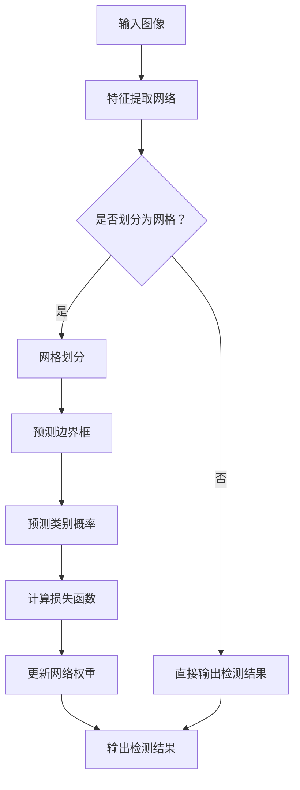

                 

关键词：YOLOv2，目标检测，深度学习，神经网络，卷积神经网络，COCO数据集，图像识别，目标定位，实时检测，算法原理，代码实例。

> 摘要：本文将深入探讨YOLOv2（You Only Look Once v2）的目标检测算法，介绍其原理、结构、数学模型以及具体实现。通过详细讲解YOLOv2的工作机制，我们将展示如何利用该算法进行高效的目标检测和定位，并通过代码实例验证其实际应用效果。

## 1. 背景介绍

目标检测是计算机视觉领域的一个核心任务，旨在从图像或视频中识别和定位多个对象。随着深度学习技术的快速发展，卷积神经网络（CNN）在目标检测任务中取得了显著的成绩。然而，传统目标检测方法通常采用两阶段检测器，如R-CNN系列和Faster R-CNN，其检测速度较慢，无法满足实时检测的需求。

为了解决这一问题，Joseph Redmon等人提出了YOLO（You Only Look Once）算法，该算法是一种单阶段检测器，能够在保持高检测准确率的同时实现实时检测。YOLOv2是在YOLO的基础上进行改进和优化的版本，它在检测速度和精度上都有了显著的提升。

本文将重点介绍YOLOv2的原理与实现，通过代码实例展示其在目标检测任务中的应用。希望通过本文的讲解，读者能够对YOLOv2有更深入的理解，并能够将其应用于实际项目中。

## 2. 核心概念与联系

### 2.1 YOLOv2算法原理

YOLOv2的目标检测算法基于深度学习中的卷积神经网络（CNN）。它将图像划分为多个网格（grid cells），每个网格负责检测其中的目标。具体来说，YOLOv2的主要思想是将整个目标检测任务分解为两个步骤：

1. **特征提取**：使用卷积神经网络对输入图像进行特征提取，生成具有层次结构的特征图。

2. **目标检测**：将特征图划分为多个网格，每个网格预测多个边界框（bounding boxes）以及相应的类别概率。

YOLOv2的核心创新在于其单阶段检测器的设计，它直接预测边界框和类别概率，避免了传统两阶段检测器中proposal的生成和候选区域的计算，从而大大提高了检测速度。

### 2.2 YOLOv2架构

YOLOv2的架构主要包括以下几个部分：

1. **特征提取网络**：通常使用Darknet-53作为基础网络，这是一个基于卷积神经网络的深度特征提取网络。

2. **网格划分**：将输入图像划分为`S x S`个网格，每个网格负责预测边界框和类别概率。

3. **边界框预测**：每个网格预测`B`个边界框，每个边界框由 `(x, y, width, height)` 四个值表示，其中 `(x, y)` 是边界框中心在对应网格中的位置，`width` 和 `height` 分别是边界框的宽度和高度。

4. **类别概率预测**：每个边界框还预测`C`个类别概率，其中`C`表示总的类别数。

5. **损失函数**：YOLOv2使用自定义的损失函数来计算预测边界框和真实边界框之间的差异，并通过反向传播更新网络权重。

### 2.3 Mermaid 流程图

以下是YOLOv2的Mermaid流程图：

在上面的流程图中，我们从输入图像开始，首先通过特征提取网络提取图像特征，然后根据网格划分对图像进行分割。对于每个网格，我们预测边界框和类别概率，并计算损失函数以更新网络权重。最后，我们输出检测结果。

## 3. 核心算法原理 & 具体操作步骤

### 3.1 算法原理概述

YOLOv2的目标检测算法基于卷积神经网络（CNN）的特征提取能力，通过将图像划分为多个网格（grid cells），每个网格负责检测其中的目标。YOLOv2的主要特点包括：

- 单阶段检测器：直接预测边界框和类别概率，避免了传统两阶段检测器中的proposal生成和候选区域计算，提高了检测速度。

- 网格划分：将输入图像划分为`S x S`个网格，每个网格负责预测边界框和类别概率。

- 边界框预测：每个网格预测`B`个边界框，每个边界框由 `(x, y, width, height)` 四个值表示。

- 类别概率预测：每个边界框还预测`C`个类别概率。

- 自定义损失函数：通过计算预测边界框和真实边界框之间的差异来更新网络权重。

### 3.2 算法步骤详解

#### 3.2.1 特征提取

特征提取是YOLOv2算法的基础，它使用Darknet-53作为基础网络，这是一个深度卷积神经网络。Darknet-53是一个基于残差块的CNN，它通过多次卷积和池化操作提取图像特征，生成具有层次结构的特征图。

具体来说，Darknet-53包括以下结构：

- 52个卷积层和2个池化层。
- 残差块的数量从初始的2个增加到最终52个。
- 输出特征图的大小逐渐减小，从`416 x 416`逐渐减小到`13 x 13`。

通过这些卷积和池化操作，特征提取网络能够提取图像的高层次特征，为后续的目标检测和分类任务提供基础。

#### 3.2.2 网格划分

将输入图像划分为`S x S`个网格，每个网格负责检测其中的目标。具体来说，输入图像被划分为`S x S`个单元，每个单元称为一个网格。每个网格负责预测边界框和类别概率。

#### 3.2.3 边界框预测

每个网格预测`B`个边界框，每个边界框由 `(x, y, width, height)` 四个值表示。其中 `(x, y)` 是边界框中心在对应网格中的位置，`width` 和 `height` 分别是边界框的宽度和高度。

边界框的预测是通过神经网络输出的，每个网格输出一个`B x 5 + C`的向量，其中 `5` 表示边界框的四个坐标值 `(x, y, width, height)` 和一个置信度值，`C` 表示类别概率。

#### 3.2.4 类别概率预测

每个边界框还预测`C`个类别概率，其中`C`表示总的类别数。类别概率是通过神经网络输出的，每个边界框输出一个`C`维的向量，表示每个类别的概率。

#### 3.2.5 损失函数

YOLOv2使用自定义的损失函数来计算预测边界框和真实边界框之间的差异，并通过反向传播更新网络权重。损失函数包括以下三个部分：

- **边界框坐标损失**：计算预测边界框和真实边界框之间的坐标差异，使用平滑L1损失函数。

- **边界框置信度损失**：计算预测边界框的置信度值和真实边界框的置信度值之间的差异，使用交叉熵损失函数。

- **类别损失**：计算预测类别概率和真实类别概率之间的差异，使用交叉熵损失函数。

### 3.3 算法优缺点

#### 优点

- **实时检测**：YOLOv2是一种单阶段检测器，避免了传统两阶段检测器中的proposal生成和候选区域计算，从而大大提高了检测速度，能够实现实时检测。

- **高精度**：通过使用深度卷积神经网络进行特征提取，YOLOv2能够提取图像的高层次特征，从而提高检测精度。

- **简单实现**：YOLOv2的算法结构相对简单，易于实现和部署。

#### 缺点

- **类别数量限制**：YOLOv2的类别数量限制为`C`个，对于类别数量较多的应用场景，可能需要进一步优化算法。

- **边界框数量限制**：每个网格只预测`B`个边界框，对于密集场景中的目标检测，可能存在一定程度的漏检。

### 3.4 算法应用领域

YOLOv2在目标检测领域具有广泛的应用，特别是在实时检测场景中。以下是一些典型的应用领域：

- **自动驾驶**：在自动驾驶系统中，YOLOv2可以用于实时检测车辆、行人、交通标志等目标，为自动驾驶决策提供基础。

- **视频监控**：在视频监控系统

