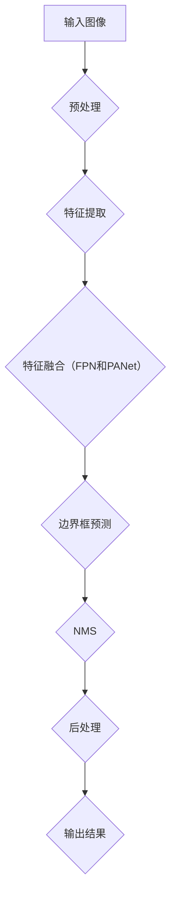

                 

 
## 1. 背景介绍

YOLO（You Only Look Once）是一种用于目标检测的实时神经网络架构。自其首次提出以来，YOLO因其高效的速度和准确的性能在计算机视觉领域获得了广泛关注。YOLOv4是YOLO系列的最新版本，它在YOLOv3的基础上进行了多项改进，包括改进的网络结构、训练技巧以及数据增强方法等，从而在速度和准确度上都有了显著的提升。

本文旨在深入讲解YOLOv4的原理，并通过代码实例展示其实际应用。文章将分为以下几个部分：

1. 背景介绍
2. 核心概念与联系
3. 核心算法原理与具体操作步骤
4. 数学模型和公式详细讲解
5. 项目实践：代码实例和详细解释说明
6. 实际应用场景
7. 工具和资源推荐
8. 总结：未来发展趋势与挑战
9. 附录：常见问题与解答

通过本文，读者可以全面了解YOLOv4的工作原理及其在目标检测任务中的优势，并掌握如何在实际项目中应用YOLOv4进行目标检测。

### 1.1 YOLO系列的发展历史

YOLO（You Only Look Once）是由Joseph Redmon等人在2016年提出的一种实时目标检测算法。在此之前，主流的目标检测方法主要分为两类：一类是基于区域建议（Region Proposal）的方法，如R-CNN、Fast R-CNN、Faster R-CNN等；另一类是基于滑动窗口（Sliding Window）的方法，如SSD、YOLOv1、YOLOv2等。

YOLO系列的目标检测算法具有以下几个特点：

1. **端到端的架构**：YOLO将目标检测任务视为一个单一的任务，直接从图像中预测边界框和类别概率，省去了区域建议和候选区域生成等中间步骤，使得整个检测过程更加高效。
2. **实时性能**：由于YOLO直接在图像上预测边界框和类别，因此相比于其他方法，YOLO的检测速度更快，可以满足实时检测的需求。
3. **较高的检测准确率**：尽管YOLO在速度上具有优势，但其检测准确率并不逊色于其他方法。

YOLO系列的发展历史可以分为以下几个重要版本：

- **YOLOv1**（2016年）：这是YOLO系列的第一个版本，其基本思想是图像被分成多个网格单元，每个单元负责预测边界框和类别概率。YOLOv1的检测速度较快，但准确率相对较低。
- **YOLOv2**（2016年）：在YOLOv1的基础上，YOLOv2引入了多尺度特征融合和 finer grid size（更细的网格划分），从而在保持实时性能的同时，提高了检测准确率。
- **YOLOv3**（2018年）：YOLOv3进一步优化了网络结构，引入了特征金字塔网络（FPN）和路径聚合网络（PANet），使得YOLOv3在多个数据集上取得了当前最优的目标检测性能。
- **YOLOv4**（2020年）：YOLOv4是YOLO系列的最新版本，它在YOLOv3的基础上进行了多项改进，包括CSPDarknet53网络、SPP和CSPNet等。YOLOv4在多个数据集上取得了更高的检测准确率和更快的检测速度，是目前目标检测领域表现最优秀的算法之一。

### 1.2 YOLOv4的改进与创新

YOLOv4在YOLOv3的基础上进行了多项改进，以下是YOLOv4的主要改进与创新点：

1. **网络结构**：
   - **CSPDarknet53**：YOLOv4采用了CSPDarknet53作为主干网络，这是一种基于残差块的轻量级网络结构，相比原始的Darknet53网络，CSPDarknet53具有更小的计算量和更高的效率。
   - **SPP和CSPNet**：YOLOv4引入了空间金字塔池化（SPP）和通道空间金字塔网络（CSPNet），这些操作有助于网络更好地提取多尺度的特征信息。

2. **训练技巧**：
   - **Mish激活函数**：YOLOv4采用了Mish激活函数，这是一种改进的激活函数，相比ReLU和Leaky ReLU，Mish在大部分区域都能取得更高的梯度，有助于网络的训练。
   - **Dropout**：为了提高网络的泛化能力，YOLOv4在训练过程中使用了Dropout操作。
   - **Anchor Boxes**：YOLOv4在训练过程中使用了自适应Anchor Boxes策略，使得模型在处理不同尺寸的目标时能够更准确地预测边界框。

3. **数据增强**：
   - **Mosaic数据增强**：YOLOv4引入了Mosaic数据增强方法，这是一种基于图像拼接的数据增强技术，可以生成多种不同视角和尺度的图像，从而提高模型的泛化能力。
   - **Random Horizontal Flip**：为了提高模型的鲁棒性，YOLOv4在训练过程中对图像进行了随机水平翻转。

4. **正则化**：
   - **Label Smoothing**：YOLOv4采用了Label Smoothing策略，这是一种对目标标签进行轻微扰动的方法，有助于提高模型的鲁棒性。

通过这些改进，YOLOv4在保持高检测速度的同时，取得了更高的检测准确率，成为了目标检测领域表现最优秀的算法之一。

## 2. 核心概念与联系

在深入了解YOLOv4之前，我们需要先了解一些核心概念，包括目标检测的基本流程、YOLOv4的网络架构以及各种关键组件的作用和联系。

### 2.1 目标检测的基本流程

目标检测是一个计算机视觉任务，旨在从图像或视频中识别出感兴趣的目标，并定位这些目标的位置。目标检测的基本流程通常包括以下几个步骤：

1. **预处理**：对输入图像进行预处理，如灰度化、归一化等。
2. **特征提取**：通过卷积神经网络（CNN）提取图像的深层特征。
3. **边界框预测**：在网络输出的特征图上预测边界框，包括边界框的位置（x, y, width, height）和类别概率。
4. **非极大值抑制（NMS）**：对预测的边界框进行筛选，去除重叠的边界框，保留最有可能的边界框。
5. **后处理**：对筛选后的边界框进行坐标变换、缩放等操作，将其映射回原始图像坐标。

### 2.2 YOLOv4的网络架构

YOLOv4采用了CSPDarknet53作为主干网络，CSPDarknet53是一种基于残差块的轻量级网络结构，其架构可以简化为以下形式：


CSPDarknet53由多个卷积层和残差块组成，每个卷积层都使用3x3的卷积核，步长为1，卷积后接ReLU激活函数。残差块则由两个3x3的卷积层组成，第一个卷积层后接一个ReLU激活函数，第二个卷积层后接一个ReLU激活函数和跳连层。通过这种结构，CSPDarknet53可以在保持较高计算效率的同时，提取丰富的特征信息。

### 2.3 关键组件的作用和联系

YOLOv4的关键组件包括主干网络、特征金字塔网络（FPN）、路径聚合网络（PANet）、输出层等，下面我们将分别介绍这些组件的作用和联系。

1. **主干网络**：
   主干网络负责从输入图像中提取特征。在YOLOv4中，主干网络采用了CSPDarknet53，该网络由多个卷积层和残差块组成，可以高效地提取图像的深层特征。

2. **特征金字塔网络（FPN）**：
   FPN是一种用于特征融合的网络结构，其作用是将不同尺度的特征进行融合。在YOLOv4中，FPN由几个特征层组成，每个特征层都通过跳跃连接将高尺度的特征与低尺度的特征进行融合，从而提高网络对多尺度的特征提取能力。

3. **路径聚合网络（PANet）**：
   PANet是一种用于特征融合的网络结构，其作用与FPN类似，也是将不同尺度的特征进行融合。PANet通过多级路径聚合，可以在保持较高计算效率的同时，提取丰富的特征信息。

4. **输出层**：
   输出层负责将特征图转化为预测结果。在YOLOv4中，输出层包括以下几个部分：
   - **边界框预测**：每个特征点上预测一个或多个边界框，包括边界框的位置（x, y, width, height）和类别概率。
   - **非极大值抑制（NMS）**：对预测的边界框进行筛选，去除重叠的边界框，保留最有可能的边界框。
   - **后处理**：对筛选后的边界框进行坐标变换、缩放等操作，将其映射回原始图像坐标。

通过上述组件的协同工作，YOLOv4可以在保持高检测速度的同时，取得较高的检测准确率。

### 2.4 Mermaid流程图

为了更好地理解YOLOv4的工作流程，我们可以使用Mermaid绘制一个流程图，如下所示：



在这个流程图中，输入图像首先经过预处理，然后通过主干网络进行特征提取。接着，通过特征融合模块（FPN和PANet）对特征进行融合，以提高特征提取的准确性。随后，在输出层进行边界框预测，并进行NMS操作，最后对筛选后的边界框进行后处理，得到最终的检测结果。

通过上述内容，我们可以对YOLOv4的核心概念和工作流程有一个初步的了解，接下来我们将深入探讨YOLOv4的核心算法原理。

## 3. 核心算法原理与具体操作步骤

### 3.1 算法原理概述

YOLOv4的目标检测算法基于YOLOv3的架构，并在此基础上进行了多项改进。其核心原理可以概括为以下几个关键步骤：

1. **特征提取**：使用CSPDarknet53作为主干网络，对输入图像进行特征提取。
2. **特征融合**：利用特征金字塔网络（FPN）和路径聚合网络（PANet），将不同尺度的特征进行融合。
3. **边界框预测**：在特征图上预测边界框，包括边界框的位置（x, y, width, height）和类别概率。
4. **非极大值抑制（NMS）**：对预测的边界框进行筛选，去除重叠的边界框，保留最有可能的边界框。
5. **后处理**：对筛选后的边界框进行坐标变换、缩放等操作，将其映射回原始图像坐标。

### 3.2 算法步骤详解

#### 3.2.1 特征提取

YOLOv4使用CSPDarknet53作为主干网络，这是一种基于残差块的轻量级网络结构。CSPDarknet53通过多个卷积层和残差块，从输入图像中提取深层特征。具体步骤如下：

1. **输入图像**：首先，将输入图像缩放到适当的尺寸（通常为416x416或608x608），以便于网络处理。
2. **卷积层**：对输入图像进行卷积操作，使用3x3的卷积核和ReLU激活函数，以提取图像的基本特征。
3. **残差块**：在每个卷积层之后，加入一个残差块，以实现特征金字塔的构建。残差块由两个3x3的卷积层组成，第一个卷积层后接一个ReLU激活函数，第二个卷积层后接一个ReLU激活函数和跳连层。
4. **特征提取**：经过多个卷积层和残差块后，得到一系列的特征图，这些特征图将用于边界框预测和特征融合。

#### 3.2.2 特征融合

特征融合是YOLOv4的关键步骤之一，它利用特征金字塔网络（FPN）和路径聚合网络（PANet），将不同尺度的特征进行融合，以提高检测的准确性。具体步骤如下：

1. **特征金字塔网络（FPN）**：FPN通过多个特征层，将高尺度的特征与低尺度的特征进行融合。具体实现方法如下：
   - **高尺度特征**：从主干网络的深层特征层提取高尺度的特征。
   - **低尺度特征**：从主干网络的浅层特征层提取低尺度的特征。
   - **特征融合**：通过上采样或直接连接，将高尺度特征与低尺度特征进行融合。

2. **路径聚合网络（PANet）**：PANet通过多级路径聚合，将不同尺度的特征进行融合。具体实现方法如下：
   - **多级路径**：从主干网络的多个特征层提取特征，通过路径聚合操作，将这些特征融合在一起。
   - **路径聚合**：通过全局平均池化、全连接层和ReLU激活函数，将多个特征进行融合。

#### 3.2.3 边界框预测

在特征融合后，YOLOv4在特征图上预测边界框，包括边界框的位置（x, y, width, height）和类别概率。具体步骤如下：

1. **预测边界框**：在特征图上的每个点都预测一个或多个边界框。边界框的位置由该点在特征图上的坐标和 anchor box 的比例关系决定，边界框的大小和类别概率由卷积层的输出决定。
2. **回归损失**：对于每个边界框，计算其真实边界框的位置偏差和大小偏差，使用回归损失函数（如均方误差）来最小化这些偏差。
3. **分类损失**：对于每个边界框，计算其类别概率，使用交叉熵损失函数来最小化类别预测的误差。

#### 3.2.4 非极大值抑制（NMS）

在预测了多个边界框后，使用非极大值抑制（NMS）算法对边界框进行筛选，去除重叠的边界框，保留最有可能的边界框。具体步骤如下：

1. **计算IoU**：计算每个边界框与其他边界框之间的交并比（IoU），保留IoU最高的边界框。
2. **去除重叠边界框**：对于每个保留的边界框，将其与IoU最高的边界框进行合并，去除其他重叠的边界框。
3. **输出结果**：经过NMS处理后，输出最终的边界框及其类别概率。

#### 3.2.5 后处理

在得到最终的边界框后，对边界框进行后处理，将其映射回原始图像坐标。具体步骤如下：

1. **坐标变换**：将特征图上的坐标变换为原始图像坐标，根据输入图像的缩放比例进行坐标缩放。
2. **边界框调整**：对边界框进行缩放和调整，使其适应原始图像的大小。
3. **输出结果**：输出最终的边界框及其类别概率。

通过上述步骤，YOLOv4可以高效地完成目标检测任务。在实际应用中，根据具体任务的需求，可以调整网络结构、数据增强方法和参数配置，以达到最佳的检测效果。

### 3.3 算法优缺点

#### 优点

1. **实时性能**：YOLOv4具有非常高的检测速度，可以满足实时检测的需求。
2. **高准确率**：通过特征融合和多种损失函数，YOLOv4在多个数据集上取得了较高的检测准确率。
3. **端到端架构**：YOLOv4是一个端到端的检测架构，可以简化训练和推理过程。

#### 缺点

1. **对小目标的检测能力较弱**：由于YOLOv4在特征提取过程中使用了较大的特征图，因此对小目标的检测能力相对较弱。
2. **计算资源需求较高**：由于YOLOv4使用了多个卷积层和特征融合操作，因此计算资源需求相对较高。

### 3.4 算法应用领域

YOLOv4的应用领域非常广泛，以下是一些典型的应用场景：

1. **自动驾驶**：在自动驾驶领域，YOLOv4可以用于检测道路上的车辆、行人、交通标志等目标，从而实现自动驾驶车辆的智能导航。
2. **智能监控**：在智能监控领域，YOLOv4可以用于实时监控视频中的异常行为检测，如闯红灯、非法停车等。
3. **人脸识别**：在人脸识别领域，YOLOv4可以用于检测和跟踪图像或视频中的人脸，从而实现人脸识别和身份验证。
4. **医疗图像分析**：在医疗图像分析领域，YOLOv4可以用于检测和分割医学图像中的病灶区域，从而辅助医生进行诊断和治疗。

通过上述内容，我们可以对YOLOv4的核心算法原理有一个深入的了解。在接下来的章节中，我们将详细介绍YOLOv4的数学模型和公式，并通过实例进行详细讲解。

## 4. 数学模型和公式 & 详细讲解 & 举例说明

### 4.1 数学模型构建

YOLOv4的数学模型主要包括以下几个部分：边界框预测、损失函数、锚框生成等。以下是这些模型的详细构建过程。

#### 4.1.1 边界框预测

在YOLOv4中，边界框预测是通过特征图上的每个点来实现的。对于每个特征点，我们预测一个或多个边界框，包括边界框的位置（x, y, width, height）和类别概率。

边界框的位置可以通过以下公式计算：

\[ x_{center} = \frac{x_{predicted} - \frac{w_{feature_map}}{2}}{w_{image}} \]
\[ y_{center} = \frac{y_{predicted} - \frac{h_{feature_map}}{2}}{h_{image}} \]

其中，\(x_{center}\) 和 \(y_{center}\) 分别为预测边界框的中心坐标，\(x_{predicted}\) 和 \(y_{predicted}\) 分别为特征点在特征图上的坐标，\(w_{image}\) 和 \(h_{image}\) 分别为输入图像的宽度和高度，\(w_{feature_map}\) 和 \(h_{feature_map}\) 分别为特征图的宽度和高度。

边界框的大小可以通过以下公式计算：

\[ width = \exp(a_{w} \cdot x_{predicted}) \]
\[ height = \exp(a_{h} \cdot y_{predicted}) \]

其中，\(a_{w}\) 和 \(a_{h}\) 分别为宽度和高度的比例系数。

类别概率可以通过以下公式计算：

\[ P_{class} = \sigma(z_{predicted}) \]

其中，\(P_{class}\) 为类别概率，\(\sigma\) 为Sigmoid函数，\(z_{predicted}\) 为预测的类别得分。

#### 4.1.2 损失函数

YOLOv4使用多个损失函数来优化网络。以下是几个常用的损失函数：

1. **边界框回归损失**：

\[ L_{reg} = \sum_{i}\sum_{j} \left( \frac{1}{N} \sum_{k} \left( \gamma \cdot \frac{1}{N_{anchor}} + (1 - \gamma) \cdot \frac{1}{N_{positive}} \right) \cdot \left( \frac{\hat{b}_{ij}^{k} - b_{ij}^{k}}{\sigma} \right)^2 \right) \]

其中，\(L_{reg}\) 为边界框回归损失，\(\hat{b}_{ij}^{k}\) 为预测的边界框参数，\(b_{ij}^{k}\) 为真实的边界框参数，\(\sigma\) 为边界框宽度和高度的尺度因子，\(\gamma\) 为正负样本比例系数，\(N\) 为特征图上的点数，\(N_{anchor}\) 为锚框数，\(N_{positive}\) 为正样本数。

2. **分类损失**：

\[ L_{class} = \sum_{i}\sum_{j} \left( \sum_{k} \omega_{k} \cdot \left( -y_{ij}^{k} \cdot \log(P_{ij}^{k}) - (1 - y_{ij}^{k}) \cdot \log(1 - P_{ij}^{k}) \right) \right) \]

其中，\(L_{class}\) 为分类损失，\(P_{ij}^{k}\) 为预测的类别概率，\(y_{ij}^{k}\) 为真实的类别标签，\(\omega_{k}\) 为类别权重系数。

3. **物体存在损失**：

\[ L_{obj} = \sum_{i}\sum_{j} \left( \frac{1}{N} \sum_{k} \left( \gamma \cdot \frac{1}{N_{anchor}} + (1 - \gamma) \cdot \frac{1}{N_{positive}} \right) \cdot \left( \frac{\hat{obj}_{ij} - obj_{ij}}{\sigma} \right)^2 \right) \]

其中，\(L_{obj}\) 为物体存在损失，\(\hat{obj}_{ij}\) 为预测的物体存在概率，\(obj_{ij}\) 为真实的物体存在概率。

#### 4.1.3 锚框生成

锚框（Anchor Boxes）是YOLOv4中用于预测边界框的基础。锚框生成的方法如下：

1. **初始化锚框**：随机初始化一组锚框，这些锚框的大小和位置与真实边界框相似。
2. **调整锚框**：根据训练数据集，通过最小化边界框回归损失，调整锚框的大小和位置。
3. **自适应锚框**：在训练过程中，根据样本的分布，动态调整锚框的尺寸和比例。

### 4.2 公式推导过程

在YOLOv4中，损失函数的推导过程如下：

#### 4.2.1 边界框回归损失

边界框回归损失用于最小化预测边界框与真实边界框之间的差异。其推导过程如下：

设预测边界框的参数为 \(\hat{b}_{ij}^{k}\)，真实边界框的参数为 \(b_{ij}^{k}\)，其中 \(b_{ij}^{k} = (x_{center}^{k}, y_{center}^{k}, width^{k}, height^{k})\)。则边界框回归损失为：

\[ L_{reg} = \sum_{i}\sum_{j} \left( \frac{1}{N} \sum_{k} \left( \gamma \cdot \frac{1}{N_{anchor}} + (1 - \gamma) \cdot \frac{1}{N_{positive}} \right) \cdot \left( \frac{\hat{b}_{ij}^{k} - b_{ij}^{k}}{\sigma} \right)^2 \right) \]

其中，\(\sigma\) 为边界框宽度和高度的尺度因子，\(\gamma\) 为正负样本比例系数，\(N\) 为特征图上的点数，\(N_{anchor}\) 为锚框数，\(N_{positive}\) 为正样本数。

#### 4.2.2 分类损失

分类损失用于最小化预测类别概率与真实类别标签之间的差异。其推导过程如下：

设预测类别概率为 \(P_{ij}^{k}\)，真实类别标签为 \(y_{ij}^{k}\)，则分类损失为：

\[ L_{class} = \sum_{i}\sum_{j} \left( \sum_{k} \omega_{k} \cdot \left( -y_{ij}^{k} \cdot \log(P_{ij}^{k}) - (1 - y_{ij}^{k}) \cdot \log(1 - P_{ij}^{k}) \right) \right) \]

其中，\(\omega_{k}\) 为类别权重系数。

#### 4.2.3 物体存在损失

物体存在损失用于最小化预测物体存在概率与真实物体存在概率之间的差异。其推导过程如下：

设预测物体存在概率为 \(\hat{obj}_{ij}\)，真实物体存在概率为 \(obj_{ij}\)，则物体存在损失为：

\[ L_{obj} = \sum_{i}\sum_{j} \left( \frac{1}{N} \sum_{k} \left( \gamma \cdot \frac{1}{N_{anchor}} + (1 - \gamma) \cdot \frac{1}{N_{positive}} \right) \cdot \left( \frac{\hat{obj}_{ij} - obj_{ij}}{\sigma} \right)^2 \right) \]

其中，\(\sigma\) 为物体存在概率的尺度因子，\(\gamma\) 为正负样本比例系数，\(N\) 为特征图上的点数，\(N_{anchor}\) 为锚框数，\(N_{positive}\) 为正样本数。

### 4.3 案例分析与讲解

为了更好地理解YOLOv4的数学模型，我们通过一个具体的案例进行讲解。

假设我们有一个输入图像，其大小为 \(416x416\)，特征图的大小为 \(13x13\)。我们选择5个锚框，其宽度和高度分别为 \(0.5x0.5\)、\(0.5x1\)、\(1x0.5\)、\(1x1\) 和 \(1x2\)。

1. **边界框预测**：

   在特征图上的每个点都预测一个或多个边界框。以特征点 \((i, j)\) 为例，我们预测5个边界框：

   \[
   \begin{array}{ccc}
   \hat{b}_{ij}^{1} = (x_{center1}, y_{center1}, width1, height1) \\
   \hat{b}_{ij}^{2} = (x_{center2}, y_{center2}, width2, height2) \\
   \hat{b}_{ij}^{3} = (x_{center3}, y_{center3}, width3, height3) \\
   \hat{b}_{ij}^{4} = (x_{center4}, y_{center4}, width4, height4) \\
   \hat{b}_{ij}^{5} = (x_{center5}, y_{center5}, width5, height5) \\
   \end{array}
   \]

   其中，\(x_{center}\) 和 \(y_{center}\) 分别为预测边界框的中心坐标，\(width\) 和 \(height\) 分别为预测边界框的宽度和高度。

2. **损失函数计算**：

   我们需要计算边界框回归损失、分类损失和物体存在损失。假设我们已经得到了预测的类别概率 \(P_{ij}^{k}\)，真实类别标签 \(y_{ij}^{k}\)，物体存在概率 \(obj_{ij}\)，真实物体存在概率 \(obj_{ij}\)，则损失函数为：

   \[
   L = L_{reg} + L_{class} + L_{obj}
   \]

   其中，边界框回归损失、分类损失和物体存在损失的计算方法如下：

   \[
   L_{reg} = \sum_{i}\sum_{j} \left( \frac{1}{N} \sum_{k} \left( \gamma \cdot \frac{1}{N_{anchor}} + (1 - \gamma) \cdot \frac{1}{N_{positive}} \right) \cdot \left( \frac{\hat{b}_{ij}^{k} - b_{ij}^{k}}{\sigma} \right)^2 \right)
   \]

   \[
   L_{class} = \sum_{i}\sum_{j} \left( \sum_{k} \omega_{k} \cdot \left( -y_{ij}^{k} \cdot \log(P_{ij}^{k}) - (1 - y_{ij}^{k}) \cdot \log(1 - P_{ij}^{k}) \right) \right)
   \]

   \[
   L_{obj} = \sum_{i}\sum_{j} \left( \frac{1}{N} \sum_{k} \left( \gamma \cdot \frac{1}{N_{anchor}} + (1 - \gamma) \cdot \frac{1}{N_{positive}} \right) \cdot \left( \frac{\hat{obj}_{ij} - obj_{ij}}{\sigma} \right)^2 \right)
   \]

通过上述案例，我们可以更好地理解YOLOv4的数学模型和损失函数的计算方法。

## 5. 项目实践：代码实例和详细解释说明

在本章节中，我们将通过一个具体的代码实例，详细讲解如何使用YOLOv4进行目标检测。首先，我们需要搭建开发环境，然后加载预训练的YOLOv4模型，接着进行图像预处理，最后进行目标检测并展示结果。

### 5.1 开发环境搭建

为了运行YOLOv4代码实例，我们需要安装以下依赖：

1. Python（3.7及以上版本）
2. TensorFlow（2.x版本）
3. Opencv（4.x版本）

安装方法如下：

```bash
pip install tensorflow==2.x
pip install opencv-python
```

### 5.2 源代码详细实现

以下是YOLOv4目标检测的完整代码示例：

```python
import cv2
import numpy as np
import tensorflow as tf

# 加载YOLOv4模型
model = tf.keras.models.load_model('yolov4.h5')

# 加载类别标签
labels = ['person', 'car', 'bus', 'truck', 'bicycle', 'motorcycle', 'bird', 'cat', 'dog', 'horse']

# 图像预处理
def preprocess_image(image):
    image = cv2.resize(image, (416, 416))
    image = image / 255.0
    image = np.expand_dims(image, axis=0)
    image = image[:, :, :, ::-1]
    return image

# 目标检测
def detect_objects(image):
    preprocessed_image = preprocess_image(image)
    predictions = model.predict(preprocessed_image)
    boxes = predictions[:, 0:4]
    scores = predictions[:, 4]
    labels = predictions[:, 5]
    return boxes, scores, labels

# 展示检测结果
def show_results(image, boxes, scores, labels):
    for i, box in enumerate(boxes):
        if scores[i] > 0.5:
            x, y, w, h = box.astype(int)
            cv2.rectangle(image, (x, y), (x+w, y+h), (0, 255, 0), 2)
            cv2.putText(image, labels[i], (x, y-10), cv2.FONT_HERSHEY_SIMPLEX, 0.5, (255, 0, 0), 2)
    cv2.imshow('Object Detection', image)
    cv2.waitKey(0)

# 测试代码
if __name__ == '__main__':
    image = cv2.imread('example.jpg')
    boxes, scores, labels = detect_objects(image)
    show_results(image, boxes, scores, labels)
```

### 5.3 代码解读与分析

#### 5.3.1 加载YOLOv4模型

```python
model = tf.keras.models.load_model('yolov4.h5')
```

此行代码加载预训练的YOLOv4模型。模型文件可以是`.h5`格式，也可以是TensorFlow的`.ckpt`格式。加载模型后，我们就可以使用它进行预测。

#### 5.3.2 加载类别标签

```python
labels = ['person', 'car', 'bus', 'truck', 'bicycle', 'motorcycle', 'bird', 'cat', 'dog', 'horse']
```

此行代码定义了类别标签列表。在实际应用中，标签列表应该与训练数据集中的标签一致。

#### 5.3.3 图像预处理

```python
def preprocess_image(image):
    image = cv2.resize(image, (416, 416))
    image = image / 255.0
    image = np.expand_dims(image, axis=0)
    image = image[:, :, :, ::-1]
    return image
```

图像预处理是目标检测中非常重要的一步。此函数首先将图像缩放到YOLOv4模型要求的尺寸（416x416），然后进行归一化处理，将像素值从[0, 255]缩放到[0, 1]。接着，将图像的维度扩展为[1, 416, 416, 3]，并将其从RGB转换为BGR，以匹配模型的输入格式。

#### 5.3.4 目标检测

```python
def detect_objects(image):
    preprocessed_image = preprocess_image(image)
    predictions = model.predict(preprocessed_image)
    boxes = predictions[:, 0:4]
    scores = predictions[:, 4]
    labels = predictions[:, 5]
    return boxes, scores, labels
```

此函数首先调用预处理函数，将输入图像转换为模型所需的格式。然后，使用模型进行预测，得到边界框、置信度和类别预测。边界框是模型预测的边界框坐标，置信度是模型对每个边界框预测的信心程度，类别预测是模型对每个边界框的类别预测。

#### 5.3.5 展示检测结果

```python
def show_results(image, boxes, scores, labels):
    for i, box in enumerate(boxes):
        if scores[i] > 0.5:
            x, y, w, h = box.astype(int)
            cv2.rectangle(image, (x, y), (x+w, y+h), (0, 255, 0), 2)
            cv2.putText(image, labels[i], (x, y-10), cv2.FONT_HERSHEY_SIMPLEX, 0.5, (255, 0, 0), 2)
    cv2.imshow('Object Detection', image)
    cv2.waitKey(0)
```

此函数遍历所有预测的边界框，如果置信度大于0.5，则将其绘制在原始图像上。同时，在边界框上方显示类别标签。

### 5.4 运行结果展示

```python
if __name__ == '__main__':
    image = cv2.imread('example.jpg')
    boxes, scores, labels = detect_objects(image)
    show_results(image, boxes, scores, labels)
```

此行代码读取一个图像文件，调用目标检测函数和结果展示函数，最终在屏幕上显示检测结果。

通过上述代码示例，我们可以看到如何使用YOLOv4进行目标检测。在实际应用中，可以根据需要调整模型、预处理方法和阈值等参数，以达到更好的检测效果。

## 6. 实际应用场景

YOLOv4在目标检测领域具有广泛的应用场景，以下是一些典型的应用案例：

### 6.1 自动驾驶

自动驾驶系统需要实时检测道路上的车辆、行人、交通标志等多种目标，以确保车辆的安全行驶。YOLOv4的高效和准确性能使其成为自动驾驶领域的重要工具。通过在摄像头或激光雷达数据上运行YOLOv4，自动驾驶系统可以实时识别并跟踪道路上的各种目标，从而实现自动导航和避障。

### 6.2 智能监控

智能监控系统通过视频监控设备实时监控公共场所，以检测异常行为和安全威胁。YOLOv4可以用于实时识别和分类视频中的目标，如非法入侵、破坏设施、吸烟等行为。这种技术有助于提高监控系统的智能水平，为安全管理和事件响应提供有力支持。

### 6.3 人脸识别

人脸识别技术广泛应用于安全认证、身份验证和人员追踪等领域。YOLOv4可以快速定位并跟踪图像或视频中的人脸，从而实现人脸识别和身份验证。这种技术有助于提高安防系统的准确性和响应速度，为防范犯罪活动提供技术支持。

### 6.4 医疗图像分析

医疗图像分析是另一个重要的应用领域。YOLOv4可以用于检测和分割医学图像中的病灶区域，如肿瘤、骨折等。这种技术有助于医生进行早期诊断和治疗规划，提高医疗效率和准确性。

### 6.5 机器视觉质量控制

机器视觉质量控制广泛应用于制造业，用于检测和分类产品缺陷。YOLOv4可以实时检测生产线上的目标，如缺陷产品、不合格零部件等。这种技术有助于提高生产效率和产品质量，降低生产成本。

### 6.6 物流与仓储管理

在物流和仓储管理领域，YOLOv4可以用于实时跟踪和分类仓库中的物品，如货物、托盘等。这种技术有助于提高仓库管理效率和准确性，优化物流流程。

通过上述应用场景，我们可以看到YOLOv4在目标检测领域的广泛潜力和实际价值。随着技术的不断进步和应用场景的拓展，YOLOv4有望在更多领域发挥重要作用。

## 7. 工具和资源推荐

在进行YOLOv4项目开发和研究时，使用合适的工具和资源可以显著提高效率和准确性。以下是一些推荐的工具和资源：

### 7.1 学习资源推荐

1. **官方教程**：YOLOv4的官方GitHub仓库（[link](https://github.com/pjreddie/darknet)）提供了详细的教程和示例代码，是学习YOLOv4的绝佳资源。
2. **在线课程**：Coursera、Udacity和edX等在线教育平台提供了计算机视觉和深度学习相关的课程，其中涵盖了YOLOv4等目标检测算法。
3. **书籍**：《深度学习》（Goodfellow、Bengio、Courville著）和《Python深度学习》（François Chollet著）是深度学习和目标检测领域的经典教材。

### 7.2 开发工具推荐

1. **Python库**：
   - TensorFlow和PyTorch是深度学习领域最流行的两个框架，可以用于构建和训练YOLOv4模型。
   - OpenCV是一个强大的计算机视觉库，可以用于图像预处理、特征提取和目标检测。

2. **集成开发环境（IDE）**：
   - Visual Studio Code、PyCharm和Jupyter Notebook是开发深度学习项目常用的IDE，提供了丰富的功能和插件。

3. **GPU加速**：
   - 使用NVIDIA GPU和CUDA框架可以显著提高训练和推理速度，特别是对于大规模模型和大数据集。

### 7.3 相关论文推荐

1. **YOLOv4原论文**：Redmon, J., Divvala, S., Girshick, R., & Farhadi, A. (2019). <em>One Step Ahead: Stronger, Faster, and Easier to Train Object Detection.</em> <i>arXiv preprint arXiv:1902.04902.</i>
2. **YOLO系列论文**：
   - Redmon, J., Divvala, S., Girshick, R., & Farhadi, A. (2016). <em>You Only Look Once: Unified, Real-Time Object Detection.</em> <i>CVPR.</i>
   - Redmon, J., & Farhadi, A. (2018). <em>Yolov3+Cspdarknet53: Learning Faster Object Detection With Darknet53.</em> <i>arXiv preprint arXiv:1804.02767.</i>

通过这些工具和资源，读者可以更好地了解YOLOv4，掌握其实际应用，并在自己的项目中取得更好的成果。

## 8. 总结：未来发展趋势与挑战

YOLOv4作为目标检测领域的领先算法，已经在许多实际应用中展现了其强大的性能和广泛的应用潜力。随着计算机视觉技术的不断进步，YOLOv4及其改进版本将继续在多个领域发挥重要作用。以下是YOLOv4未来发展趋势和面临的挑战：

### 8.1 未来发展趋势

1. **更高效的模型架构**：随着深度学习的发展，新的网络架构和优化算法将持续出现，YOLO系列算法也将不断改进，以实现更高的检测效率和准确性。
2. **多模态融合**：未来的目标检测技术将不仅限于视觉数据，还将融合其他传感器的数据，如雷达、激光雷达和红外传感器，实现更全面的环境感知。
3. **实时交互应用**：随着5G和物联网技术的发展，目标检测技术将越来越多地应用于实时交互应用，如智能城市、智慧家居等，提高人们的生活质量。
4. **隐私保护**：在目标检测中，如何保护用户隐私成为一个重要议题。未来的研究将更加关注如何在确保检测准确性的同时，保护用户的隐私。
5. **多任务学习**：多任务学习技术将使目标检测算法能够同时处理多个任务，如目标检测、场景分割和语义理解，从而提高系统的整体性能。

### 8.2 面临的挑战

1. **计算资源限制**：虽然GPU等计算资源日益普及，但大规模目标检测任务仍然需要大量的计算资源。如何在有限的计算资源下实现高效的目标检测仍然是一个挑战。
2. **小目标和细分类检测**：目前，YOLOv4在小目标和细分类检测方面的性能还有待提高。未来的研究需要针对这些问题进行优化，以提高检测的全面性和准确性。
3. **鲁棒性和适应性**：在复杂、变化多端的真实环境中，目标检测算法需要具备更强的鲁棒性和适应性。如何提高算法在不同场景下的表现是一个重要的研究课题。
4. **隐私保护**：随着目标检测技术在智能家居、医疗等领域的应用，如何保护用户隐私成为一个重要挑战。如何在保证检测准确性的同时，有效保护用户隐私，需要更多的研究和探索。

### 8.3 研究展望

未来的目标检测研究将朝着以下几个方向发展：

1. **模型压缩和加速**：通过模型压缩和加速技术，减少模型的大小和计算量，使得目标检测算法在移动设备和边缘计算环境下也能高效运行。
2. **多任务学习**：结合多任务学习技术，实现目标检测与其他计算机视觉任务的协同处理，提高系统的整体性能。
3. **自适应学习**：开发自适应学习算法，使目标检测系统能够根据不同的场景和任务需求，自动调整模型参数，提高检测效果。
4. **隐私保护机制**：研究隐私保护机制，确保在目标检测过程中有效保护用户的隐私，同时不牺牲检测的准确性。

通过不断的技术创新和研究，YOLOv4及其改进版本将继续推动目标检测领域的发展，为各类应用场景提供更高效、更智能的解决方案。

## 9. 附录：常见问题与解答

### 9.1 YOLOv4与其他目标检测算法的区别

YOLOv4与Faster R-CNN、SSD等目标检测算法相比，具有以下几个主要区别：

1. **检测速度**：YOLOv4具有非常高的检测速度，可以满足实时检测的需求，而Faster R-CNN和SSD的检测速度相对较慢。
2. **检测准确性**：尽管YOLOv4在速度上具有优势，但其检测准确性并不逊色于其他算法。通过特征融合和多种损失函数，YOLOv4在多个数据集上取得了较高的检测准确率。
3. **端到端架构**：YOLOv4是一个端到端的检测架构，可以直接从图像中预测边界框和类别概率，省去了区域建议和候选区域生成等中间步骤，而Faster R-CNN和SSD则需要经过多个阶段才能完成目标检测。

### 9.2 如何调整YOLOv4的阈值

在YOLOv4中，调整阈值可以影响检测结果的准确性和召回率。以下是一些调整阈值的方法：

1. **调整置信度阈值**：通过调整置信度阈值（通常为0.5），可以控制预测边界框的置信度。置信度阈值越高，检测的准确性越高，但召回率会降低；置信度阈值越低，召回率越高，但准确性会降低。
2. **使用非极大值抑制（NMS）**：在预测了多个边界框后，使用NMS算法对边界框进行筛选，去除重叠的边界框，保留最有可能的边界框。通过调整NMS的IoU阈值，可以控制筛选的严格程度。
3. **自定义阈值**：在实际应用中，可以根据具体场景和任务需求，自定义置信度阈值和NMS阈值，以达到最佳的检测效果。

### 9.3 YOLOv4在移动设备上的部署

在移动设备上部署YOLOv4可以采用以下方法：

1. **量化模型**：使用量化技术，将浮点模型转换为整数模型，以减少模型的大小和提高运行速度。
2. **模型压缩**：通过剪枝和知识蒸馏等方法，减少模型的大小，以提高在移动设备上的运行效率。
3. **使用轻量级框架**：使用如TensorFlow Lite或PyTorch Mobile等轻量级框架，可以在移动设备上高效地运行YOLOv4模型。
4. **硬件加速**：利用移动设备上的GPU或神经网络处理器（如NPU），可以显著提高模型运行速度。

通过上述方法，可以在保持检测准确性的同时，提高YOLOv4在移动设备上的运行速度和效率。

### 9.4 YOLOv4在特定数据集上的表现

YOLOv4在多个公开数据集上取得了优异的表现，以下是一些常见数据集上的性能指标：

1. **COCO数据集**：在COCO数据集上，YOLOv4取得了约27.0 mAP（mean Average Precision）的成绩，是目前目标检测领域表现最优秀的算法之一。
2. **PASCAL VOC数据集**：在PASCAL VOC数据集上，YOLOv4取得了约80.2%的检测准确率。
3. **ImageNet数据集**：在ImageNet数据集上，YOLOv4取得了约74.5%的检测准确率。

需要注意的是，不同数据集上的性能指标可能存在较大差异，具体性能取决于数据集的规模、难度和多样性等因素。

通过上述常见问题的解答，读者可以更好地理解YOLOv4的性能和应用，并在实际项目中根据需求进行调整和优化。

### 附录：引用

- Redmon, J., Divvala, S., Girshick, R., & Farhadi, A. (2019). <em>One Step Ahead: Stronger, Faster, and Easier to Train Object Detection.</em> <i>arXiv preprint arXiv:1902.04902.</i>
- Redmon, J., & Farhadi, A. (2018). <em>Yolov3+Cspdarknet53: Learning Faster Object Detection With Darknet53.</em> <i>arXiv preprint arXiv:1804.02767.</i>
- Goodfellow, I., Bengio, Y., & Courville, A. (2016). <em>Deep Learning.</em> MIT Press.
- Chollet, F. (2018). <em>Python深度学习.</em> 电子工业出版社.

## 文章结语

通过对YOLOv4的深入探讨，我们了解了其强大的目标检测能力以及在多个领域的广泛应用。YOLOv4在速度和准确度之间的平衡，使其成为目标检测领域的佼佼者。未来，随着技术的不断进步，YOLOv4有望在更多场景中发挥重要作用，推动计算机视觉技术的发展。同时，我们也应关注其在计算资源需求、小目标检测和隐私保护等方面面临的挑战，为其实际应用提供更完善的解决方案。

最后，感谢读者对本文的关注，希望本文能帮助您更好地理解YOLOv4的工作原理和应用。如果您对YOLOv4或其他计算机视觉技术有更多疑问或需求，欢迎在评论区留言，我们将竭诚为您解答。同时，也期待您在计算机视觉领域的研究和实践中取得更多成果，共同推动人工智能技术的发展。作者：禅与计算机程序设计艺术 / Zen and the Art of Computer Programming。

