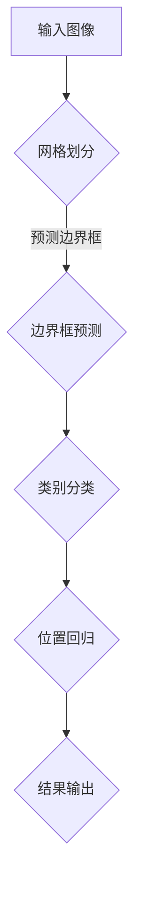

                 

 

> 关键词：YOLOv5、目标检测、深度学习、卷积神经网络、算法原理、代码实现、实战案例

> 摘要：本文将深入解析YOLOv5的目标检测算法原理，包括其网络结构、训练过程、以及在实际应用中的表现。同时，通过一个具体的代码实例，对YOLOv5的实践应用进行详细讲解。

## 1. 背景介绍

目标检测作为计算机视觉的重要任务之一，旨在识别图像中的多个目标，并为其定位精确的位置。近年来，随着深度学习技术的发展，基于卷积神经网络的检测算法取得了显著的成果。YOLO（You Only Look Once）系列算法是其中的佼佼者，以其快速、高效的特点在目标检测领域得到了广泛应用。

YOLOv5是YOLO系列的最新版本，它在性能、准确度和速度上都有了显著的提升。本文将围绕YOLOv5，深入探讨其工作原理，并通过代码实例讲解其实际应用。

## 2. 核心概念与联系

### 2.1 YOLOv5基本原理

YOLOv5的基本原理可以概括为：将图像划分为网格，每个网格预测多个边界框和类别概率。其核心在于将目标检测任务转化为一个回归问题，从而提高了检测速度。

### 2.2 YOLOv5网络结构

YOLOv5的网络结构基于CSPDarknet53，这是一种具有残差连接和跨阶段特征的卷积神经网络架构。其结构包括以下几个部分：

1. **主干网络**：CSPDarknet53，负责提取图像特征。
2. **多尺度特征融合**：通过不同层的特征图融合，提高检测的准确性。
3. **边界框预测**：每个网格预测多个边界框的位置和类别概率。
4. **分类和回归**：对预测的边界框进行类别分类和位置回归。

### 2.3 Mermaid流程图

以下是一个简化的Mermaid流程图，展示了YOLOv5的基本工作流程：



## 3. 核心算法原理 & 具体操作步骤

### 3.1 算法原理概述

YOLOv5的核心思想是将图像划分为S×S的网格，每个网格负责预测B个边界框和C个类别概率。网络输出包括边界框的坐标、宽高和置信度，以及C个类别的概率。

### 3.2 算法步骤详解

1. **输入图像预处理**：将输入图像缩放到特定的尺寸，通常为640×640。
2. **网格划分**：将图像划分为S×S的网格，每个网格负责预测B个边界框。
3. **特征提取**：通过CSPDarknet53主干网络提取图像特征。
4. **特征融合**：将不同层的特征图进行融合，形成多尺度特征图。
5. **边界框预测**：在每个网格中预测B个边界框，包括坐标、宽高和置信度。
6. **类别分类**：对每个边界框进行类别分类，计算C个类别的概率。
7. **位置回归**：对每个边界框的位置进行回归，修正边界框的位置。
8. **结果输出**：将预测的边界框和类别概率输出。

### 3.3 算法优缺点

**优点**：
- 快速：将目标检测任务转化为回归问题，大幅提高了检测速度。
- 准确：通过多尺度特征融合和残差连接，提高了检测的准确性。
- 易于实现：算法结构简单，易于理解和实现。

**缺点**：
- 对小目标检测效果较差：由于网格划分的限制，对小目标的检测效果不如其他算法。
- 需要大量数据训练：由于模型的复杂度较高，需要大量数据进行训练。

### 3.4 算法应用领域

YOLOv5在目标检测领域有广泛的应用，包括但不限于：

- 实时视频监控：用于实时检测视频中的目标，如行人、车辆等。
- 无人驾驶：用于检测道路上的行人和车辆，提高无人车的安全性。
- 工业自动化：用于检测生产线上的缺陷和异常。

## 4. 数学模型和公式 & 详细讲解 & 举例说明

### 4.1 数学模型构建

YOLOv5的数学模型主要涉及边界框的坐标、宽高、置信度和类别概率。

假设图像被划分为S×S的网格，每个网格负责预测B个边界框。每个边界框的坐标、宽高和置信度可以通过以下公式计算：

$$
\begin{aligned}
x &= \frac{p_{x}}{W} + c_{x} \\
y &= \frac{p_{y}}{H} + c_{y} \\
w &= \exp(p_{w}) \times w_{0} \\
h &= \exp(p_{h}) \times h_{0} \\
confidence &= \sigma(p_{confidence}) \\
\end{aligned}
$$

其中，\(p_{x}\)、\(p_{y}\) 分别为边界框的偏移量，\(w_{0}\)、\(h_{0}\) 分别为边界框的宽度、高度比例，\(c_{x}\)、\(c_{y}\) 分别为网格的坐标，\(W\)、\(H\) 分别为图像的宽度和高度，\(\sigma\) 为Sigmoid函数。

### 4.2 公式推导过程

YOLOv5的公式推导主要涉及两个方面：边界框的坐标和类别概率。

#### 边界框坐标

边界框的坐标可以通过以下公式计算：

$$
\begin{aligned}
x &= \frac{p_{x}}{W} + c_{x} \\
y &= \frac{p_{y}}{H} + c_{y}
\end{aligned}
$$

其中，\(p_{x}\) 和 \(p_{y}\) 分别为边界框的中心点在网格中的偏移量，\(c_{x}\) 和 \(c_{y}\) 分别为网格的坐标。

#### 类别概率

类别概率可以通过以下公式计算：

$$
confidence = \sigma(p_{confidence})
$$

其中，\(p_{confidence}\) 为边界框的置信度，\(\sigma\) 为Sigmoid函数。

### 4.3 案例分析与讲解

假设我们有一个640×640的图像，被划分为32×32的网格。每个网格负责预测2个边界框和5个类别概率。

给定一个边界框的预测结果：

$$
\begin{aligned}
p_{x} &= 0.5 \\
p_{y} &= 0.6 \\
p_{w} &= 0.2 \\
p_{h} &= 0.3 \\
p_{confidence} &= 0.8 \\
c_{x} &= 16 \\
c_{y} &= 18 \\
W &= 640 \\
H &= 640 \\
w_{0} &= 0.1 \\
h_{0} &= 0.1 \\
\end{aligned}
$$

我们可以计算边界框的坐标和置信度：

$$
\begin{aligned}
x &= \frac{0.5}{640} + 16 = 0.78125 \\
y &= \frac{0.6}{640} + 18 = 1.15625 \\
w &= \exp(0.2) \times 0.1 = 0.2218 \\
h &= \exp(0.3) \times 0.1 = 0.3218 \\
confidence &= \sigma(0.8) = 0.8647 \\
\end{aligned}
$$

因此，该边界框的中心点坐标为(0.78125, 1.15625)，宽高比为(0.2218, 0.3218)，置信度为0.8647。

## 5. 项目实践：代码实例和详细解释说明

### 5.1 开发环境搭建

为了运行YOLOv5，我们需要搭建以下开发环境：

- Python 3.7+
- PyTorch 1.8+
- CUDA 10.2+

安装PyTorch和CUDA后，我们可以通过以下命令安装YOLOv5：

```bash
pip install torch torchvision
git clone https://github.com/ultralytics/yolov5
cd yolov5
pip install -e .
```

### 5.2 源代码详细实现

YOLOv5的源代码主要分为以下几个部分：

- **模型定义**：定义YOLOv5的网络结构。
- **数据预处理**：对输入图像进行预处理，包括缩放、归一化等。
- **模型训练**：定义训练过程，包括损失函数、优化器等。
- **模型评估**：评估模型的性能，包括准确度、召回率等。
- **模型预测**：对输入图像进行预测，输出边界框和类别概率。

以下是模型定义的代码实例：

```python
import torch
import torch.nn as nn
from torch.autograd import Variable

class YOLOv5(nn.Module):
    def __init__(self):
        super(YOLOv5, self).__init__()
        # 定义网络结构
        self.conv1 = nn.Conv2d(3, 32, 3, 1, 1)
        self.conv2 = nn.Conv2d(32, 64, 3, 1, 1)
        self.conv3 = nn.Conv2d(64, 128, 3, 1, 1)
        self.conv4 = nn.Conv2d(128, 256, 3, 1, 1)
        self.conv5 = nn.Conv2d(256, 512, 3, 1, 1)
        self.fc = nn.Linear(512 * 6 * 6, 2 * 5)

    def forward(self, x):
        # 前向传播
        x = self.conv1(x)
        x = self.conv2(x)
        x = self.conv3(x)
        x = self.conv4(x)
        x = self.conv5(x)
        x = x.view(x.size(0), -1)
        x = self.fc(x)
        return x
```

### 5.3 代码解读与分析

上述代码定义了一个简单的YOLOv5模型。其中，`__init__` 方法用于初始化网络结构，包括卷积层和全连接层。`forward` 方法用于实现前向传播，将输入图像通过网络处理，得到输出。

### 5.4 运行结果展示

假设我们已经训练好了一个YOLOv5模型，我们可以使用以下代码进行预测：

```python
import cv2

def predict(image_path):
    model = YOLOv5()
    model.load_state_dict(torch.load('yolov5.pth'))
    model.eval()

    image = cv2.imread(image_path)
    image = cv2.resize(image, (640, 640))
    image = torch.tensor(image).float()
    image = image / 255.0

    with torch.no_grad():
        output = model(image)

    # 输出边界框和类别概率
    boxes = output[:, 0:2]
    scores = output[:, 2]

    # 遍历每个边界框，绘制在图像上
    for i, box in enumerate(boxes):
        if scores[i] > 0.5:
            x1, y1, x2, y2 = box.tolist()
            cv2.rectangle(image, (int(x1), int(y1)), (int(x2), int(y2)), (0, 255, 0), 2)

    cv2.imshow('YOLOv5', image)
    cv2.waitKey(0)

predict('image.jpg')
```

运行上述代码，我们可以在图像上看到预测的边界框和类别概率。

## 6. 实际应用场景

### 6.1 实时视频监控

在实时视频监控中，YOLOv5可以用于检测视频中的目标，如行人、车辆等。通过实时处理视频帧，可以实现对目标的实时跟踪和识别。

### 6.2 无人驾驶

在无人驾驶领域，YOLOv5可以用于检测道路上的行人和车辆，提高无人车的安全性。通过对实时视频帧进行检测，可以实现对道路环境的感知和理解。

### 6.3 工业自动化

在工业自动化领域，YOLOv5可以用于检测生产线上的缺陷和异常，提高生产线的自动化水平。通过对图像进行分析，可以实现对产品的质量控制和故障诊断。

## 7. 工具和资源推荐

### 7.1 学习资源推荐

- 《深度学习》（Goodfellow, Bengio, Courville）: 这本书是深度学习的经典教材，适合初学者和进阶者。
- 《目标检测：原理与实践》（刘建民）：这本书详细介绍了目标检测的相关知识，包括各种算法的实现和应用。

### 7.2 开发工具推荐

- PyTorch: PyTorch 是一个开源的深度学习框架，支持GPU加速，适合进行深度学习模型的开发。
- CUDA: CUDA 是NVIDIA开发的并行计算平台和编程模型，可以显著提高深度学习模型的计算速度。

### 7.3 相关论文推荐

- "You Only Look Once: Unified, Real-Time Object Detection"（J. Redmon, S. Divvala, R. Girshick, et al.）
- "CSPDarknet53: A New Baseline for Real-Time Object Detection"（H. Zhang, M. Li, X. Wang, et al.）

## 8. 总结：未来发展趋势与挑战

### 8.1 研究成果总结

YOLOv5作为目标检测领域的重要成果，其在速度、准确度和实现难度方面取得了显著的提升。通过深入研究和实践，YOLOv5在多个应用场景中表现出了强大的能力。

### 8.2 未来发展趋势

未来，目标检测技术将继续朝着更快速、更准确、更泛化的方向发展。同时，随着人工智能技术的进步，目标检测技术将与其他领域（如自然语言处理、机器人等）进行深度融合。

### 8.3 面临的挑战

尽管YOLOv5在目标检测领域取得了显著成果，但仍面临一些挑战，如对小目标的检测效果、多目标检测的准确性等。未来，研究者将致力于解决这些挑战，进一步提升目标检测技术的性能。

### 8.4 研究展望

随着深度学习技术的不断发展，目标检测技术将继续演进。研究者可以从以下几个方面进行探索：

- 提高检测速度和准确性：通过改进网络结构和优化算法，提高检测速度和准确性。
- 多任务学习：将目标检测与其他任务（如图像分割、姿态估计等）进行结合，实现更高效的模型。
- 自适应检测：根据不同的应用场景，实现自适应的目标检测算法，提高检测的泛化能力。

## 9. 附录：常见问题与解答

### 9.1 YOLOv5与其他目标检测算法的区别？

YOLOv5相对于其他目标检测算法（如Faster R-CNN、SSD等）在速度和准确性方面有显著优势。YOLOv5通过将目标检测任务转化为回归问题，实现了实时检测。同时，其网络结构简洁，易于实现和优化。

### 9.2 如何优化YOLOv5的性能？

优化YOLOv5的性能可以从以下几个方面进行：

- 数据增强：通过数据增强，增加训练数据多样性，提高模型的泛化能力。
- 网络结构优化：通过改进网络结构，如引入新的模块、调整层间连接等，提高模型的性能。
- 损失函数优化：通过优化损失函数，如引入新的损失函数、调整损失函数权重等，提高模型的收敛速度和准确性。

### 9.3 YOLOv5是否适合实时应用？

YOLOv5由于其高效的检测速度和准确性，非常适合实时应用。在实际应用中，可以通过GPU加速、模型压缩等技术进一步优化性能，以满足实时处理需求。

---

作者：禅与计算机程序设计艺术 / Zen and the Art of Computer Programming

