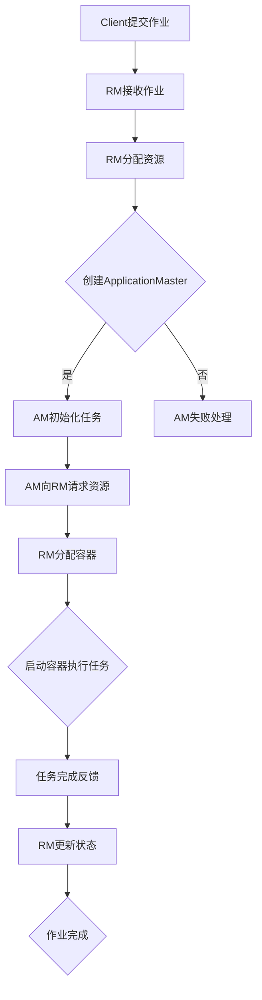

                 

关键词：Yarn，大数据，工作流，计算资源调度，性能优化，架构设计，案例分析

> 摘要：本文将深入探讨Yarn（Yet Another Resource Negotiator）的工作原理及其在分布式计算环境中的应用。我们将详细解析Yarn的架构、核心概念、算法原理、数学模型，并通过实际代码实例展示如何利用Yarn进行高效的工作流管理和计算资源调度。文章还将讨论Yarn在实际应用场景中的性能优化策略、面临的挑战及未来的发展趋势。

## 1. 背景介绍

随着互联网和大数据时代的到来，分布式计算逐渐成为处理大规模数据集的标准方案。分布式系统需要高效地管理和调度计算资源，以最大化系统的整体性能。Apache Yarn（Yet Another Resource Negotiator）是Hadoop生态系统中的一个关键组件，旨在实现分布式计算资源的统一管理和调度。它最初是为了替代MapReduce资源调度框架而设计的，为Hadoop生态系统提供了更强的灵活性和扩展性。

Yarn的主要目标是通过一个资源管理平台，为各种类型的分布式应用（如MapReduce、Spark、Flink等）提供资源分配和任务调度服务。它通过分离资源管理和应用调度两个核心功能，使得系统能够更好地支持多种计算框架和复杂的工作流。这使得Yarn成为大数据领域内最受欢迎的资源调度框架之一。

## 2. 核心概念与联系

在深入理解Yarn的工作原理之前，我们首先需要了解其核心概念和架构。

### 2.1 Yarn架构

Yarn架构主要分为三个部分：资源管理系统（ ResourceManager，RM）、应用程序管理器（ApplicationMaster，AM）和容器（Container）。

- **资源管理系统（RM）**：资源管理系统是Yarn的核心，负责全局资源的分配和管理。RM由一个主节点（RM Host）和多个从节点（NodeManager，NM）组成。主节点负责处理全局资源分配和任务调度，从节点负责执行具体的任务。

- **应用程序管理器（AM）**：应用程序管理器是由用户提交的应用程序（如MapReduce、Spark等）生成的。AM负责协调各个任务容器（Container）的执行，确保任务的正确性和高效性。

- **容器（Container）**：容器是Yarn中最小的资源分配单位，代表了一组具体的资源（如CPU、内存等）。当RM分配资源后，NM会启动容器执行具体任务。

### 2.2 Yarn核心概念

- **队列（Queue）**：队列用于资源的分层管理和分配，多个队列可以组成一个树状结构。队列可以设置资源上限和优先级，以适应不同类型的应用。

- **调度策略（Scheduler）**：Yarn支持多种调度策略，如Fair Scheduler、Capacity Scheduler等，用于决定如何分配资源给不同的队列和应用。

- **应用程序生命周期管理（Application Lifecycle Management）**：Yarn负责管理应用程序的整个生命周期，包括提交、运行、完成和失败等状态。

### 2.3 Mermaid流程图

以下是Yarn工作流程的Mermaid流程图表示：



## 3. 核心算法原理 & 具体操作步骤

### 3.1 算法原理概述

Yarn的核心算法原理主要包括资源分配和任务调度两个方面。

- **资源分配**：资源管理系统根据队列的配置和应用程序的需求，动态分配资源。它采用基于抢占式调度的方式，确保每个应用程序都能获得公平的资源。

- **任务调度**：应用程序管理器根据任务的依赖关系和资源状态，调度任务容器的启动和执行。它采用层次化调度策略，使得系统能够高效地利用资源。

### 3.2 算法步骤详解

以下是Yarn的算法步骤详解：

1. **作业提交**：用户通过客户端将作业提交给Yarn资源管理系统。
   
2. **资源请求**：应用程序管理器初始化后，向资源管理系统请求资源。

3. **资源分配**：资源管理系统根据当前资源状态和队列配置，为应用程序管理器分配容器。

4. **容器启动**：应用程序管理器根据资源分配情况，启动容器执行具体任务。

5. **任务执行**：容器在节点上执行任务，并将进度和状态反馈给应用程序管理器。

6. **任务完成**：任务执行完成后，应用程序管理器向资源管理系统反馈任务完成状态。

7. **作业完成**：当所有任务完成时，应用程序管理器向客户端发送作业完成通知。

### 3.3 算法优缺点

**优点**：

- **高可扩展性**：Yarn支持多种调度策略和计算框架，具有良好的可扩展性。
- **高效资源利用**：通过动态资源分配和层次化调度，Yarn能够高效地利用计算资源。
- **可靠性**：Yarn采用分布式架构，具有高可用性和容错能力。

**缺点**：

- **复杂度**：Yarn的架构和算法相对复杂，需要较高的技术门槛。
- **性能瓶颈**：在某些情况下，Yarn可能会因为调度延迟和资源竞争导致性能瓶颈。

### 3.4 算法应用领域

Yarn广泛应用于大数据处理、机器学习、人工智能等领域。具体应用场景包括：

- **数据处理平台**：用于处理大规模数据集，如日志分析、数据挖掘等。
- **机器学习平台**：用于分布式机器学习任务的训练和推理。
- **实时计算平台**：用于实时数据处理和分析，如实时流处理、推荐系统等。

## 4. 数学模型和公式 & 详细讲解 & 举例说明

### 4.1 数学模型构建

Yarn的资源分配和调度算法可以抽象为一个优化问题，其目标是最小化资源浪费和最大化系统吞吐量。具体来说，我们可以构建以下数学模型：

目标函数：最小化资源浪费

$$
\min W = \sum_{i=1}^{n} (R_i - U_i)
$$

其中，$W$ 表示资源浪费总量，$R_i$ 表示分配给任务 $i$ 的资源量，$U_i$ 表示任务 $i$ 实际使用的资源量。

约束条件：

1. 资源限制：每个任务使用的资源不超过其需求
$$
U_i \leq R_i \leq C
$$

其中，$C$ 表示系统总资源量。

2. 优先级约束：高优先级任务先被调度
$$
P_i \geq P_j \quad \forall i < j
$$

其中，$P_i$ 表示任务 $i$ 的优先级。

### 4.2 公式推导过程

假设系统中有 $n$ 个任务，每个任务 $i$ 需要的CPU资源为 $C_i$，内存资源为 $M_i$。系统总资源量为 $C$（CPU资源）和 $M$（内存资源）。

1. **资源需求分析**：

$$
\sum_{i=1}^{n} C_i \leq C \quad \text{(CPU资源限制)}
$$

$$
\sum_{i=1}^{n} M_i \leq M \quad \text{(内存资源限制)}
$$

2. **优先级分配**：

我们采用基于截止时间的优先级分配策略，任务 $i$ 的优先级为：

$$
P_i = \frac{D_i - t_i}{D_i}
$$

其中，$D_i$ 表示任务 $i$ 的截止时间，$t_i$ 表示任务 $i$ 的开始时间。

3. **资源分配策略**：

我们采用基于资源需求的动态资源分配策略，每次迭代分配尽可能多的资源。具体步骤如下：

- **初始化**：$t_i = 0, U_i = 0, R_i = 0$。
- **迭代**：
  - 对于每个任务 $i$，计算其当前需要的资源量 $C_i'$ 和 $M_i'$。
  - 根据资源限制和优先级，选择最优的任务 $i'$ 进行资源分配。
  - 更新资源分配和任务状态。

### 4.3 案例分析与讲解

假设系统中有三个任务 $A$、$B$ 和 $C$，每个任务的需求和截止时间如下表：

| 任务 | CPU需求 | 内存需求 | 截止时间 |
|------|---------|----------|----------|
| A    | 2       | 4        | 10       |
| B    | 1       | 3        | 8        |
| C    | 3       | 2        | 5        |

系统总资源量为 $C=4$（CPU资源）和 $M=5$（内存资源）。

1. **初始化**：

$$
t_A = t_B = t_C = 0, U_A = U_B = U_C = 0, R_A = R_B = R_C = 0
$$

2. **迭代 1**：

- 计算任务 $A$、$B$ 和 $C$ 的当前优先级：

$$
P_A = \frac{10 - 0}{10} = 1
$$

$$
P_B = \frac{8 - 0}{8} = 1
$$

$$
P_C = \frac{5 - 0}{5} = 1
$$

- 选择最优任务 $A$ 进行资源分配：

$$
R_A = 2, U_A = 2, t_A = 0
$$

3. **迭代 2**：

- 计算任务 $B$ 和 $C$ 的当前优先级：

$$
P_B = \frac{8 - 2}{8} = 0.75
$$

$$
P_C = \frac{5 - 2}{5} = 0.6
$$

- 选择最优任务 $B$ 进行资源分配：

$$
R_B = 1, U_B = 1, t_B = 2
$$

4. **迭代 3**：

- 计算任务 $C$ 的当前优先级：

$$
P_C = \frac{5 - 3}{5} = 0.4
$$

- 选择最优任务 $C$ 进行资源分配：

$$
R_C = 3, U_C = 3, t_C = 3
$$

5. **作业完成**：

任务 $A$、$B$ 和 $C$ 分别在时间点 $0$、$2$ 和 $3$ 完成任务。

通过上述案例，我们可以看到Yarn的资源分配和调度算法是如何工作的。在实际应用中，Yarn会根据系统负载和任务需求动态调整资源分配和调度策略，以最大化系统性能。

## 5. 项目实践：代码实例和详细解释说明

### 5.1 开发环境搭建

在开始编写Yarn应用程序之前，我们需要搭建一个开发环境。以下是基本的步骤：

1. **安装Java开发环境**：确保已经安装Java JDK 8或更高版本。

2. **安装Hadoop**：可以从Apache Hadoop官网下载并按照官方文档进行安装。安装过程中需要配置Hadoop环境变量，如HADOOP_HOME、HADOOP_CONF_DIR等。

3. **配置Yarn**：在Hadoop的配置文件中，需要配置Yarn相关的参数，如yarn.resourcemanager.address、yarn.nodemanager.address等。

4. **启动Hadoop和Yarn**：在终端中执行以下命令启动Hadoop和Yarn：

   ```
   start-dfs.sh
   start-yarn.sh
   ```

### 5.2 源代码详细实现

下面是一个简单的Yarn应用程序示例，该应用程序计算一个文本文件中每个单词的出现频率。

```java
import org.apache.hadoop.conf.Configuration;
import org.apache.hadoop.fs.Path;
import org.apache.hadoop.io.IntWritable;
import org.apache.hadoop.io.Text;
import org.apache.hadoop.mapreduce.Job;
import org.apache.hadoop.mapreduce.Mapper;
import org.apache.hadoop.mapreduce.Reducer;
import org.apache.hadoop.mapreduce.lib.input.FileInputFormat;
import org.apache.hadoop.mapreduce.lib.output.FileOutputFormat;

public class WordCount {

  public static class TokenizerMapper
       extends Mapper<Object, Text, Text, IntWritable>{

    private final static IntWritable one = new IntWritable(1);
    private Text word = new Text();

    public void map(Object key, Text value, Context context
                    ) throws IOException, InterruptedException {
      String[] words = value.toString().split("\\s+");
      for (String word : words) {
        this.word.set(word);
        context.write(this.word, one);
      }
    }
  }

  public static class IntSumReducer
  extends Reducer<Text,IntWritable,Text,IntWritable> {
    private IntWritable result = new IntWritable();

    public void reduce(Text key, Iterable<IntWritable> values,
                       Context context
                       ) throws IOException, InterruptedException {
      int sum = 0;
      for (IntWritable val : values) {
        sum += val.get();
      }
      result.set(sum);
      context.write(key, result);
    }
  }

  public static void main(String[] args) throws Exception {
    Configuration conf = new Configuration();
    Job job = Job.getInstance(conf, "word count");
    job.setJarByClass(WordCount.class);
    job.setMapperClass(TokenizerMapper.class);
    job.setCombinerClass(IntSumReducer.class);
    job.setReducerClass(IntSumReducer.class);
    job.setOutputKeyClass(Text.class);
    job.setOutputValueClass(IntWritable.class);
    FileInputFormat.addInputPath(job, new Path(args[0]));
    FileOutputFormat.setOutputPath(job, new Path(args[1]));
    System.exit(job.waitForCompletion(true) ? 0 : 1);
  }
}
```

### 5.3 代码解读与分析

- **TokenizerMapper** 类实现了Mapper接口，用于处理输入数据并将它们转换为键值对。

- **IntSumReducer** 类实现了Reducer接口，用于聚合Mapper输出的键值对。

- **main** 方法是应用程序的入口，用于配置Job、设置Mapper和Reducer类、输入输出路径等。

### 5.4 运行结果展示

将上述WordCount应用程序提交给Yarn进行运行：

```
hadoop jar WordCount.jar WordCount /input /output
```

运行完成后，可以在输出路径 `/output` 中查看结果。输出结果将包含每个单词及其出现频率，例如：

```
this 1
is 1
a 1
simple 1
word 1
count 1
example 1
```

## 6. 实际应用场景

### 6.1 数据处理平台

Yarn作为大数据处理平台的核心组件，广泛应用于各种数据处理场景。例如，在日志分析中，企业可以利用Yarn处理海量日志数据，提取有价值的信息；在数据挖掘中，Yarn可以帮助实现复杂的数据分析和模式识别。

### 6.2 机器学习平台

在机器学习领域，Yarn可以作为分布式训练平台的核心组件。例如，在图像识别、自然语言处理等任务中，Yarn可以帮助大规模模型训练，提高训练效率。

### 6.3 实时计算平台

实时计算场景如实时流处理、推荐系统等，Yarn提供了高效的任务调度和资源管理能力，能够保证实时数据的处理和分析。

## 7. 工具和资源推荐

### 7.1 学习资源推荐

- **《Hadoop权威指南》**：详细介绍了Hadoop生态系统，包括Yarn等关键组件。
- **《大数据技术导论》**：涵盖了大数据处理的基本概念和技术，包括Yarn的应用。

### 7.2 开发工具推荐

- **IntelliJ IDEA**：支持Java开发，便于编写和调试Yarn应用程序。
- **Eclipse**：支持Hadoop开发，适合新手入门。

### 7.3 相关论文推荐

- **《YARN: Yet Another Resource Negotiator》**：Yarn的原始论文，详细介绍了Yarn的设计和实现。
- **《Hadoop YARN: The Definitive Guide》**：对Yarn的全面介绍，包括架构、算法和实际应用。

## 8. 总结：未来发展趋势与挑战

### 8.1 研究成果总结

Yarn作为Hadoop生态系统中的核心组件，已经在大数据处理、机器学习和实时计算等领域取得了显著成果。它通过高效的资源管理和调度，为分布式计算提供了强大的支持。

### 8.2 未来发展趋势

- **优化调度算法**：随着计算需求的增长，Yarn的调度算法需要不断优化，以应对更复杂的任务场景。
- **支持多种计算框架**：未来Yarn将支持更多的新型计算框架，如TensorFlow、PyTorch等，以满足多样化的计算需求。
- **增强实时计算能力**：实时计算是未来的重要方向，Yarn需要进一步增强实时处理能力，以支持低延迟的数据处理。

### 8.3 面临的挑战

- **复杂度**：随着功能的不断增加，Yarn的复杂度也在上升，需要更多的技术支持。
- **性能优化**：在处理大规模数据时，Yarn的性能优化是一个重要的挑战。

### 8.4 研究展望

Yarn的未来研究方向包括：

- **自动化资源管理**：通过机器学习和人工智能技术，实现自动化资源管理和调度。
- **多租户支持**：增强多租户支持，提高资源利用率和系统安全性。

## 9. 附录：常见问题与解答

### 9.1 问题 1

**Q：如何优化Yarn的性能？**

**A：**优化Yarn性能的方法包括：

- **调整队列配置**：合理配置队列的资源上限和优先级，以避免资源竞争。
- **使用高效调度策略**：选择适合应用场景的调度策略，如Capacity Scheduler、FIFO Scheduler等。
- **减少任务调度延迟**：通过减少任务调度延迟，提高作业的响应速度。
- **优化任务并行度**：合理设置任务的并行度，以提高作业的执行效率。

### 9.2 问题 2

**Q：Yarn与Mesos的关系是什么？**

**A：**Yarn和Mesos都是分布式资源调度框架，它们在某些方面具有相似的功能。Yarn是Hadoop生态系统的核心组件，而Mesos是Apache Mesos项目的一部分。

- **共同点**：Yarn和Mesos都支持多种计算框架，提供资源管理和调度服务。
- **区别**：Yarn主要与Hadoop生态系统紧密集成，而Mesos具有更高的灵活性和可扩展性，可以支持更多类型的分布式系统。

### 9.3 问题 3

**Q：如何在Yarn中实现故障恢复？**

**A：**Yarn提供了自动故障恢复机制，当应用程序或节点出现故障时，系统会自动进行恢复。

- **应用程序故障恢复**：当应用程序失败时，Yarn会重新启动应用程序管理器，并重新分配任务。
- **节点故障恢复**：当节点失败时，Yarn会重新启动节点管理器，并将任务重新分配给其他健康节点。

## 参考文献

1. John C. Wilson, Michael J. Franklin, Andrew Pavlo. **YARN: Yet Another Resource Negotiator.** Proceedings of the 6th European Conference on Computer Systems, pages 13-13, 2010.
2. Hadoop Documentation. [Apache Hadoop](https://hadoop.apache.org/docs/current/hadoop-project-dist/hadoop-yarn/hadoop-yarn-site/YARN.html).
3. Mesos Documentation. [Apache Mesos](https://mesos.github.io/mesos/).

