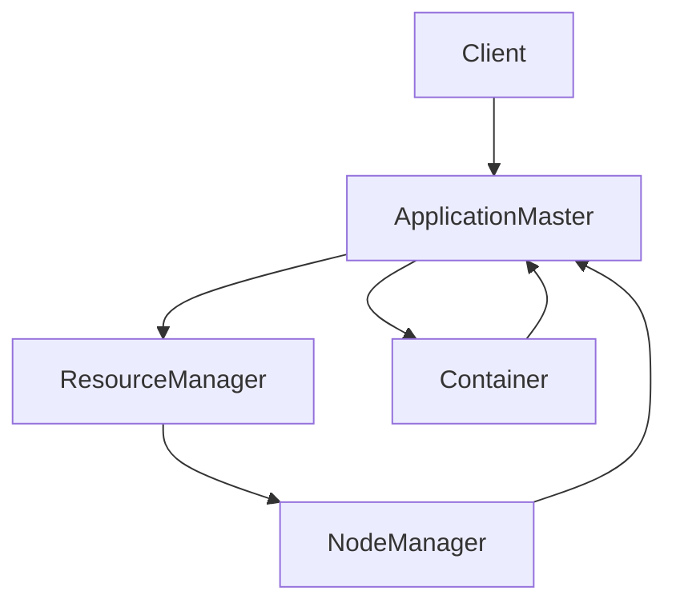

                 

关键词：Yarn，分布式计算，工作原理，代码实例，性能优化，应用场景

> 摘要：本文将深入探讨Yarn——Hadoop生态系统中的资源调度和管理框架。我们将介绍Yarn的基本概念、工作原理，并通过代码实例详细讲解如何使用Yarn进行分布式计算。此外，文章还将分析Yarn的性能优化技巧以及它在不同应用场景中的实际应用。

## 1. 背景介绍

Hadoop作为一个开源的分布式数据处理框架，已经成为大数据领域的基石。Hadoop的核心组件包括HDFS（Hadoop Distributed File System，分布式文件系统）和MapReduce（一种编程模型，用于处理海量数据）。然而，随着大数据应用场景的日益复杂和多样化，传统的MapReduce模型在资源调度和管理上逐渐显露出瓶颈。为了解决这一问题，Apache Hadoop社区推出了Yarn（Yet Another Resource Negotiator）。

Yarn是Hadoop生态系统中的一个关键组件，负责资源调度和管理。它旨在取代传统的MapReduce框架，提供一个统一的资源管理平台，支持多种数据处理引擎，如MapReduce、Spark、Flink等。Yarn的引入极大地提升了Hadoop集群的资源利用效率和灵活性。

## 2. 核心概念与联系

### 2.1 Yarn架构概述

Yarn的核心架构包括两个主要组件：资源调度器（ ResourceManager）和应用程序调度器（ApplicationMaster）。以下是Yarn架构的Mermaid流程图：



- **Client**：客户端提交应用程序给Yarn。
- **ApplicationMaster**：负责协调和管理应用程序的执行。
- **ResourceManager**：资源调度器，负责整个集群的资源分配和管理。
- **NodeManager**：在每个节点上运行，负责资源监控和Container的管理。
- **Container**：资源分配的最小单位，包括计算资源和内存资源。

### 2.2 Yarn工作原理

Yarn的工作原理可以分为以下几个步骤：

1. **应用程序提交**：客户端将应用程序提交给Yarn，由ResourceManager进行接收和调度。
2. **资源分配**：ResourceManager根据集群资源状况和应用程序需求，为应用程序分配Container。
3. **容器启动**：ResourceManager将分配的Container发送到对应的NodeManager，由NodeManager启动容器。
4. **应用程序执行**：ApplicationMaster根据资源分配情况，调度任务并在各个Container上执行。
5. **应用程序完成**：应用程序执行完毕后，ApplicationMaster通知ResourceManager，释放资源。

## 3. 核心算法原理 & 具体操作步骤

### 3.1 算法原理概述

Yarn的核心算法原理在于资源调度和任务分配。它采用基于优先级和负载均衡的策略，动态分配资源，确保集群的充分利用和高效运行。

### 3.2 算法步骤详解

1. **应用程序提交**：客户端通过Yarn的API或命令行工具提交应用程序。
2. **资源请求**：ApplicationMaster向ResourceManager请求资源。
3. **资源分配**：ResourceManager根据资源可用性和应用程序需求，分配Container。
4. **任务调度**：ApplicationMaster根据资源分配情况，将任务调度到相应的Container上。
5. **任务执行**：任务在Container上执行，结果返回给ApplicationMaster。
6. **任务完成**：任务执行完毕后，ApplicationMaster向ResourceManager报告结果，释放资源。

### 3.3 算法优缺点

- **优点**：
  - 统一的资源管理平台，支持多种数据处理引擎。
  - 动态资源调度，提高资源利用率。
  - 灵活性高，易于扩展和集成。

- **缺点**：
  - 需要一定的运维和管理经验。
  - 对于大规模集群，性能优化和故障排除较为复杂。

### 3.4 算法应用领域

Yarn广泛应用于大数据处理、数据仓库、机器学习等领域。它支持各种数据处理框架，如MapReduce、Spark、Flink等，为各种应用场景提供高效的资源调度和管理。

## 4. 数学模型和公式 & 详细讲解 & 举例说明

### 4.1 数学模型构建

Yarn的资源调度算法可以抽象为一个优化问题，目标是最大化资源利用率，最小化任务执行时间。具体模型如下：

$$
\begin{aligned}
\text{最大化} & \quad \sum_{i=1}^{n} \text{utilization}_{i} \\
\text{约束条件} & \quad \sum_{i=1}^{n} \text{resource}_{i} \leq \text{total\_resource} \\
\text{其中，} & \quad \text{utilization}_{i} = \frac{\text{任务}_{i} \text{完成率}}{\text{任务}_{i} \text{所需时间}} \\
\text{和} & \quad \text{resource}_{i} = \text{任务}_{i} \text{所需资源}
\end{aligned}
$$

### 4.2 公式推导过程

资源调度算法的推导基于以下原则：

1. **最大化利用率**：提高资源利用率，缩短任务执行时间。
2. **资源约束**：确保集群资源不被过度占用。

通过以上原则，我们可以推导出上述数学模型。

### 4.3 案例分析与讲解

假设我们有一个包含3个节点的Hadoop集群，每个节点拥有2核CPU和4GB内存。现有3个任务，分别需要1核CPU和2GB内存、2核CPU和4GB内存、3核CPU和6GB内存。以下是资源调度的案例：

1. **资源分配**：根据任务需求，我们将资源分配给各个任务。
2. **任务调度**：将任务调度到对应的节点上，确保资源均衡。
3. **任务执行**：任务在分配的资源上执行，并返回结果。
4. **资源回收**：任务执行完毕后，释放资源。

通过上述步骤，我们可以实现资源的最大化利用。

## 5. 项目实践：代码实例和详细解释说明

### 5.1 开发环境搭建

在开始使用Yarn之前，我们需要搭建一个Hadoop开发环境。以下是搭建步骤：

1. **安装Hadoop**：从官方网站下载Hadoop安装包，并按照官方文档进行安装。
2. **配置Hadoop**：编辑`hadoop-env.sh`、`yarn-env.sh`等配置文件，设置Hadoop运行所需的Java环境和其他配置。
3. **启动Hadoop集群**：使用命令`start-dfs.sh`和`start-yarn.sh`启动Hadoop集群。

### 5.2 源代码详细实现

以下是一个简单的MapReduce程序，用于在HDFS上统计文件中的单词数量。我们将使用Yarn运行这个程序。

```java
import org.apache.hadoop.conf.Configuration;
import org.apache.hadoop.fs.Path;
import org.apache.hadoop.io.IntWritable;
import org.apache.hadoop.io.Text;
import org.apache.hadoop.mapreduce.Job;
import org.apache.hadoop.mapreduce.Mapper;
import org.apache.hadoop.mapreduce.Reducer;
import org.apache.hadoop.mapreduce.lib.input.FileInputFormat;
import org.apache.hadoop.mapreduce.lib.output.FileOutputFormat;

public class WordCount {

  public static class TokenizerMapper extends Mapper<Object, Text, Text, IntWritable>{

    private final static IntWritable one = new IntWritable(1);
    private Text word = new Text();

    public void map(Object key, Text value, Context context) throws IOException, InterruptedException {
      String[] words = value.toString().split("\\s+");
      for (String word : words) {
        this.word.set(word);
        context.write(word, one);
      }
    }
  }

  public static class IntSumReducer extends Reducer<Text,IntWritable,Text,IntWritable> {
    private IntWritable result = new IntWritable();

    public void reduce(Text key, Iterable<IntWritable> values, Context context) throws IOException, InterruptedException {
      int sum = 0;
      for (IntWritable val : values) {
        sum += val.get();
      }
      result.set(sum);
      context.write(key, result);
    }
  }

  public static void main(String[] args) throws Exception {
    Configuration conf = new Configuration();
    Job job = Job.getInstance(conf, "word count");
    job.setJarByClass(WordCount.class);
    job.setMapperClass(TokenizerMapper.class);
    job.setCombinerClass(IntSumReducer.class);
    job.setReducerClass(IntSumReducer.class);
    job.setOutputKeyClass(Text.class);
    job.setOutputValueClass(IntWritable.class);
    FileInputFormat.addInputPath(job, new Path(args[0]));
    FileOutputFormat.setOutputPath(job, new Path(args[1]));
    System.exit(job.waitForCompletion(true) ? 0 : 1);
  }
}
```

### 5.3 代码解读与分析

上述代码实现了一个简单的WordCount程序。下面是代码的详细解读：

- **TokenizerMapper**：输入键值对为（文件内容，null），输出键值对为（单词，1）。
- **IntSumReducer**：输入键值对为（单词，一系列1），输出键值对为（单词，单词出现次数总和）。

程序通过Mapper和Reducer实现单词的统计功能。具体步骤如下：

1. **Mapper**：读取输入文件，将文件内容分割成单词，并输出（单词，1）。
2. **Combiner**：在Mapper输出附近，合并相同单词的值。
3. **Reducer**：对每个单词进行汇总，输出（单词，总次数）。

### 5.4 运行结果展示

运行WordCount程序，在HDFS上统计输入文件的单词数量。运行结果如下：

```shell
$ hadoop jar wordcount.jar WordCount /input /output
```

输出结果将保存在`/output`路径下。通过查看输出文件，我们可以得到单词的统计结果。

## 6. 实际应用场景

Yarn在实际应用中具有广泛的应用场景。以下是一些常见的应用场景：

1. **大数据处理**：在处理大规模数据时，Yarn可以动态分配资源，提高数据处理效率。
2. **数据仓库**：Yarn支持各种数据仓库工具，如Hive、Presto等，实现高效的数据查询和分析。
3. **机器学习**：在机器学习应用中，Yarn可以调度资源，支持大规模模型的训练和预测。
4. **实时处理**：通过结合Apache Storm等实时处理框架，Yarn可以实现低延迟的数据处理。

## 7. 工具和资源推荐

### 7.1 学习资源推荐

- **Hadoop官方文档**：https://hadoop.apache.org/docs/current/
- **Apache Yarn官方文档**：https://hadoop.apache.org/docs/current/hadoop-yarn/hadoop-yarn-site/YARN.html
- **《Hadoop权威指南》**：介绍Hadoop及其组件的详细教程。

### 7.2 开发工具推荐

- **IntelliJ IDEA**：一款功能强大的Java开发工具，支持Hadoop开发。
- **Eclipse**：适用于Hadoop开发的IDE，提供丰富的插件。

### 7.3 相关论文推荐

- **"Yet Another Resource Negotiator (YARN) for Hadoop"**：介绍了Yarn的设计和实现。
- **"Resource Management and Scheduling in Hadoop YARN"**：详细分析了Yarn的资源调度算法。

## 8. 总结：未来发展趋势与挑战

### 8.1 研究成果总结

Yarn作为Hadoop生态系统中的重要组件，取得了显著的成果。它提供了统一的资源管理平台，支持多种数据处理引擎，提高了集群的资源利用率和灵活性。

### 8.2 未来发展趋势

随着大数据和云计算的不断发展，Yarn将继续演进，支持更多的数据处理框架，提供更高效的资源调度算法，并更好地适应各种应用场景。

### 8.3 面临的挑战

- **性能优化**：如何进一步提高Yarn的性能和效率，是一个重要挑战。
- **安全性**：在分布式环境中，保障数据安全和系统稳定运行是一个关键问题。
- **可扩展性**：如何支持大规模集群，并保持良好的性能和稳定性，是一个长期课题。

### 8.4 研究展望

未来，Yarn将继续演进，成为大数据处理领域的重要基础设施。研究者将致力于解决性能优化、安全性和可扩展性等问题，推动Yarn在更多应用场景中的普及和应用。

## 9. 附录：常见问题与解答

### 9.1 Yarn与MapReduce的区别是什么？

- **资源管理**：MapReduce是Yarn的前身，专注于资源管理和调度。而Yarn则提供了一个更通用、更灵活的资源管理框架，支持多种数据处理引擎。
- **调度策略**：Yarn引入了基于优先级和负载均衡的调度策略，相比MapReduce的静态调度策略，具有更高的灵活性和效率。
- **可扩展性**：Yarn支持大规模集群，具有更好的可扩展性和稳定性。

### 9.2 如何在Yarn上运行Spark应用程序？

要在Yarn上运行Spark应用程序，需要遵循以下步骤：

1. **配置Spark**：编辑`spark-env.sh`等配置文件，设置Spark运行所需的Yarn参数。
2. **提交应用程序**：使用`spark-submit`命令提交Spark应用程序，指定Yarn作为资源管理器。

### 9.3 如何优化Yarn的性能？

优化Yarn的性能可以从以下几个方面入手：

1. **资源分配**：合理分配资源，避免资源浪费和瓶颈。
2. **调度策略**：调整调度策略，提高资源利用率。
3. **网络优化**：优化网络配置，减少数据传输延迟。
4. **故障排除**：及时解决集群故障，确保系统稳定运行。

---

作者：禅与计算机程序设计艺术 / Zen and the Art of Computer Programming
----------------------------------------------------------------
[END]


