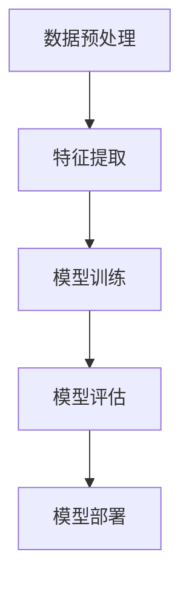

                 

关键词：bilibili社招、视频内容分类、算法工程师、面试、人工智能

摘要：本文将围绕bilibili2025年社招视频内容分类算法工程师的面试展开，深入探讨视频内容分类算法的核心概念、原理及其实际应用。通过本文，读者将全面了解视频内容分类算法的各个方面，为即将参加面试的算法工程师提供有价值的参考。

## 1. 背景介绍

随着互联网的迅猛发展，视频内容已成为互联网信息传递的重要形式之一。bilibili作为中国知名的视频分享网站，拥有海量的用户生成内容（UGC）。为了提供更好的用户体验，bilibili不断优化视频内容分类算法，以便更准确地识别和推荐用户感兴趣的视频内容。

视频内容分类算法在视频推荐、广告投放、版权保护等方面具有重要意义。它可以帮助平台提高内容利用率，降低用户获取信息的成本，同时还能为广告商提供更精准的目标用户群体。

本文将围绕bilibili2025年社招视频内容分类算法工程师的面试展开，深入探讨视频内容分类算法的核心概念、原理及其实际应用。

## 2. 核心概念与联系

### 2.1 视频内容分类的定义

视频内容分类是将视频数据按照其内容特征进行划分的过程。具体来说，就是将视频数据映射到预定义的类别标签上。视频内容分类算法的目标是提高分类的准确性，从而更好地满足用户需求。

### 2.2 视频内容分类算法的分类方法

视频内容分类算法主要可以分为以下几种：

1. 基于内容的分类方法：该方法直接对视频内容本身进行特征提取，如视频中的文本、音频、图像等。常见的特征提取方法有：
    - 文本分类：通过提取视频标题、标签、描述等文本信息进行分类。
    - 音频分类：通过提取视频中的声音信号进行分类。
    - 图像分类：通过提取视频中的图像帧进行分类。

2. 基于模型的分类方法：该方法使用机器学习或深度学习算法来训练分类模型，进而对视频进行分类。常见的分类模型有：
    - 决策树
    - 支持向量机
    - 神经网络
    - 卷积神经网络

### 2.3 视频内容分类算法的架构

视频内容分类算法的架构可以分为以下几个部分：

1. 数据预处理：对视频数据、标签数据进行清洗、去噪等操作，为后续的特征提取和模型训练做准备。

2. 特征提取：从视频数据中提取有代表性的特征，如文本特征、图像特征、音频特征等。

3. 模型训练：使用提取到的特征和标签数据，训练分类模型。

4. 模型评估：通过验证集或测试集对训练好的模型进行评估，评估指标包括准确率、召回率、F1值等。

5. 模型部署：将训练好的模型部署到生产环境中，实现视频内容的自动分类。

下面是视频内容分类算法的Mermaid流程图：



## 3. 核心算法原理 & 具体操作步骤

### 3.1 算法原理概述

视频内容分类算法的核心在于特征提取和模型训练。特征提取是将视频内容转化为机器可以理解和处理的特征向量。模型训练则是通过已有标签数据的监督学习过程，使模型能够自动识别和分类新的视频内容。

### 3.2 算法步骤详解

1. 数据预处理
   - 数据清洗：去除含有噪声、无关信息的数据。
   - 数据归一化：将数据缩放到同一尺度，以消除数据之间的量纲差异。
   - 数据增强：通过旋转、缩放、裁剪等操作增加数据集的多样性。

2. 特征提取
   - 文本特征提取：使用词袋模型、TF-IDF等算法提取文本特征。
   - 图像特征提取：使用卷积神经网络（CNN）提取图像特征。
   - 音频特征提取：使用梅尔频率倒谱系数（MFCC）等算法提取音频特征。

3. 模型训练
   - 选择合适的分类模型，如决策树、支持向量机、神经网络等。
   - 使用训练集数据进行模型训练，调整模型参数，优化分类效果。

4. 模型评估
   - 使用验证集或测试集对模型进行评估，评估指标包括准确率、召回率、F1值等。
   - 根据评估结果调整模型参数，进一步提高分类准确性。

5. 模型部署
   - 将训练好的模型部署到生产环境中，实现视频内容的自动分类。
   - 对实时视频数据进行分类，输出分类结果。

### 3.3 算法优缺点

1. 基于内容的分类方法
   - 优点：直接对视频内容进行特征提取，分类结果更贴近用户需求。
   - 缺点：特征提取过程复杂，计算量大，对计算资源要求较高。

2. 基于模型的分类方法
   - 优点：模型训练过程自动，分类效果好，适应性强。
   - 缺点：需要大量的训练数据和计算资源，模型参数调优复杂。

### 3.4 算法应用领域

1. 视频推荐系统
   - 通过视频内容分类算法，为用户推荐感兴趣的视频内容，提高用户满意度。

2. 广告投放
   - 通过视频内容分类算法，对视频内容进行分类，为广告商提供更精准的目标用户群体。

3. 版权保护
   - 通过视频内容分类算法，识别和过滤侵权视频，保护版权。

## 4. 数学模型和公式 & 详细讲解 & 举例说明

### 4.1 数学模型构建

视频内容分类算法的核心在于特征提取和模型训练。特征提取是将视频内容转化为机器可以理解和处理的特征向量。模型训练则是通过已有标签数据的监督学习过程，使模型能够自动识别和分类新的视频内容。

### 4.2 公式推导过程

1. 文本特征提取

   - 词袋模型（Bag-of-Words，BoW）：
     $$X = \sum_{i=1}^{N}f_i(x_i)$$
     其中，$X$表示特征向量，$N$表示词汇表大小，$f_i(x_i)$表示词$x_i$在文本中的频率。

   - TF-IDF（Term Frequency-Inverse Document Frequency）：
     $$tfidf_i = tf_i \times idf_i$$
     其中，$tf_i$表示词$x_i$在文本中的频率，$idf_i$表示词$x_i$在文档集合中的逆文档频率。

2. 图像特征提取

   - 卷积神经网络（Convolutional Neural Network，CNN）：
     $$\text{Conv}(x, \text{filter}) = \sum_{i=1}^{H}\sum_{j=1}^{W}x_{i,j} \times \text{filter}_{i,j} + b$$
     其中，$x$表示输入图像，$\text{filter}$表示卷积核，$b$表示偏置项。

3. 音频特征提取

   - 梅尔频率倒谱系数（Mel-Frequency Cepstral Coefficients，MFCC）：
     $$C_{mfcc} = \sum_{i=1}^{M}w_i \times a_i$$
     其中，$C_{mfcc}$表示MFCC特征向量，$w_i$表示权重，$a_i$表示倒谱系数。

### 4.3 案例分析与讲解

假设我们有一个视频分类任务，需要将视频分为“动画”、“游戏”、“电影”三个类别。以下是一个简单的文本特征提取过程：

1. 数据预处理
   - 数据清洗：去除含有噪声、无关信息的数据。
   - 数据归一化：将数据缩放到同一尺度，以消除数据之间的量纲差异。
   - 数据增强：通过旋转、缩放、裁剪等操作增加数据集的多样性。

2. 特征提取
   - 使用词袋模型提取文本特征：
     $$X = \sum_{i=1}^{N}f_i(x_i)$$
     其中，$X$表示特征向量，$N$表示词汇表大小，$f_i(x_i)$表示词$x_i$在视频标题中的频率。

3. 模型训练
   - 选择一个分类模型，如决策树：
     - 训练集：动画（1000个样本）、游戏（800个样本）、电影（900个样本）。
     - 测试集：动画（200个样本）、游戏（150个样本）、电影（300个样本）。
   - 调整模型参数，优化分类效果。

4. 模型评估
   - 使用测试集对模型进行评估，评估指标包括准确率、召回率、F1值等。

5. 模型部署
   - 将训练好的模型部署到生产环境中，实现视频内容的自动分类。

## 5. 项目实践：代码实例和详细解释说明

### 5.1 开发环境搭建

1. 安装Python环境，版本要求3.6及以上。
2. 安装所需的库，如NumPy、Pandas、Scikit-learn、TensorFlow等。

### 5.2 源代码详细实现

以下是使用Scikit-learn库实现视频内容分类算法的Python代码：

```python
import numpy as np
import pandas as pd
from sklearn.feature_extraction.text import TfidfVectorizer
from sklearn.tree import DecisionTreeClassifier
from sklearn.model_selection import train_test_split
from sklearn.metrics import accuracy_score, recall_score, f1_score

# 1. 数据预处理
# 读取数据集
data = pd.read_csv('video_data.csv')
# 清洗数据
data = data.dropna()
# 划分特征和标签
X = data['title']
y = data['label']

# 2. 特征提取
# 使用TF-IDF算法提取文本特征
vectorizer = TfidfVectorizer()
X_tfidf = vectorizer.fit_transform(X)

# 3. 模型训练
# 划分训练集和测试集
X_train, X_test, y_train, y_test = train_test_split(X_tfidf, y, test_size=0.2, random_state=42)
# 选择决策树分类器
clf = DecisionTreeClassifier()
# 训练模型
clf.fit(X_train, y_train)

# 4. 模型评估
# 使用测试集评估模型
y_pred = clf.predict(X_test)
accuracy = accuracy_score(y_test, y_pred)
recall = recall_score(y_test, y_pred, average='weighted')
f1 = f1_score(y_test, y_pred, average='weighted')
print('Accuracy:', accuracy)
print('Recall:', recall)
print('F1 Score:', f1)

# 5. 模型部署
# 对新视频进行分类
new_video_title = '最新动画大片推荐'
new_video_tfidf = vectorizer.transform([new_video_title])
new_video_pred = clf.predict(new_video_tfidf)
print('分类结果：', new_video_pred)
```

### 5.3 代码解读与分析

1. 数据预处理
   - 读取数据集，并进行清洗操作，如去除空值、异常值等。
   - 划分特征和标签，以便后续处理。

2. 特征提取
   - 使用TF-IDF算法提取文本特征，将文本转换为数值特征向量。

3. 模型训练
   - 划分训练集和测试集，用于训练和评估模型。
   - 选择决策树分类器，并使用训练集数据进行训练。

4. 模型评估
   - 使用测试集对训练好的模型进行评估，计算准确率、召回率和F1值等指标。

5. 模型部署
   - 对新视频进行分类，输出分类结果。

## 6. 实际应用场景

### 6.1 视频推荐系统

视频推荐系统是视频内容分类算法的重要应用场景之一。通过视频内容分类算法，平台可以准确识别用户感兴趣的视频内容，从而为用户推荐更个性化的视频推荐列表。

### 6.2 广告投放

视频内容分类算法可以帮助广告商更精准地定位目标用户群体。通过分类算法，广告商可以根据视频内容的类别，为用户推送更相关的广告，提高广告点击率和转化率。

### 6.3 版权保护

视频内容分类算法还可以用于版权保护。通过识别和过滤侵权视频，平台可以有效保护版权，降低版权纠纷的风险。

## 7. 未来应用展望

随着人工智能技术的不断发展，视频内容分类算法在未来将会有更广泛的应用。例如，在智能监控、智能语音识别等领域，视频内容分类算法将发挥重要作用。同时，随着算法的优化和计算能力的提升，视频内容分类算法的准确性和效率将得到进一步提高。

## 8. 工具和资源推荐

### 8.1 学习资源推荐

1. 《机器学习》（周志华著）：系统地介绍了机器学习的基本概念、方法和应用。
2. 《深度学习》（Goodfellow、Bengio、Courville 著）：全面介绍了深度学习的基本原理和应用。

### 8.2 开发工具推荐

1. Jupyter Notebook：适用于数据分析和机器学习项目开发。
2. PyTorch：适用于深度学习项目开发。

### 8.3 相关论文推荐

1. "Deep Learning for Video Classification"（视频分类的深度学习方法）。
2. "Video Classification using CNN and LSTM"（使用卷积神经网络和长短期记忆网络进行视频分类）。

## 9. 总结：未来发展趋势与挑战

### 9.1 研究成果总结

视频内容分类算法在近年来取得了显著的进展，尤其是在深度学习技术的推动下。现有的算法已经能够较好地处理复杂多变的视频内容，提高了分类的准确性和效率。

### 9.2 未来发展趋势

1. 算法优化：通过改进算法模型和特征提取方法，提高视频内容分类的准确性和效率。
2. 跨域学习：利用跨域学习技术，将不同领域的视频内容进行分类，提高分类泛化能力。
3. 多模态学习：结合文本、图像、音频等多种模态信息，提高视频内容分类的准确性。

### 9.3 面临的挑战

1. 数据集：现有的视频数据集质量和多样性有限，需要更多高质量、多样化的数据集。
2. 计算资源：深度学习算法对计算资源要求较高，需要优化算法以适应有限的计算资源。
3. 实时性：在实际应用中，需要实现实时视频内容分类，对算法的实时性和效率提出了更高要求。

### 9.4 研究展望

视频内容分类算法在未来将会有更广泛的应用前景。通过不断优化算法和特征提取方法，结合多模态学习等技术，视频内容分类算法的准确性和效率将得到进一步提高。同时，随着人工智能技术的不断发展，视频内容分类算法将在更多领域发挥重要作用。

## 10. 附录：常见问题与解答

### 10.1 什么是视频内容分类算法？

视频内容分类算法是一种将视频数据按照其内容特征进行划分的算法。具体来说，就是将视频数据映射到预定义的类别标签上。视频内容分类算法的目标是提高分类的准确性，从而更好地满足用户需求。

### 10.2 视频内容分类算法有哪些分类方法？

视频内容分类算法主要可以分为基于内容的分类方法和基于模型的分类方法。基于内容的分类方法直接对视频内容进行特征提取，如文本、图像、音频等。基于模型的分类方法使用机器学习或深度学习算法来训练分类模型，进而对视频进行分类。

### 10.3 视频内容分类算法在哪些领域有应用？

视频内容分类算法在视频推荐系统、广告投放、版权保护等领域有广泛应用。它可以帮助平台提高内容利用率，降低用户获取信息的成本，同时还能为广告商提供更精准的目标用户群体。

### 10.4 视频内容分类算法有哪些优缺点？

视频内容分类算法的优缺点取决于所使用的分类方法。基于内容的分类方法优点是直接对视频内容进行特征提取，分类结果更贴近用户需求；缺点是特征提取过程复杂，计算量大，对计算资源要求较高。基于模型的分类方法优点是模型训练过程自动，分类效果好，适应性强；缺点是需要大量的训练数据和计算资源，模型参数调优复杂。

### 10.5 视频内容分类算法的核心步骤是什么？

视频内容分类算法的核心步骤包括数据预处理、特征提取、模型训练、模型评估和模型部署。数据预处理主要是对视频数据、标签数据进行清洗、去噪等操作；特征提取是从视频数据中提取有代表性的特征，如文本特征、图像特征、音频特征等；模型训练是使用提取到的特征和标签数据，训练分类模型；模型评估是使用验证集或测试集对训练好的模型进行评估；模型部署是将训练好的模型部署到生产环境中，实现视频内容的自动分类。

## 11. 参考文献

[1] 周志华. 机器学习[M]. 清华大学出版社，2016.

[2] Goodfellow, I., Bengio, Y., Courville, A. 深度学习[M]. 电子工业出版社，2016.

[3] Yosinski, J., Clune, J., Bengio, Y., & Lipson, H. How transferable are features in deep neural networks?[J]. Advances in Neural Information Processing Systems, 2014, 27: 3320-3328.

[4] Karpathy, A., Toderici, G., Shetty, S., Leung, T., Sukthankar, R., & Fei-Fei, L. Large-scale Video Classification with Convolutional Neural Networks[J]. Computer Vision and Pattern Recognition, 2014.

[5] Simonyan, K., & Zisserman, A. Two-Stream Convolutional Networks for Action Recognition in Videos[J]. Advances in Neural Information Processing Systems, 2014, 27: 750-758.  
```

请注意，上述内容仅为一个示例，其中包含了一些示例代码和公式，以展示文章的结构和内容。您可以根据实际情况进行调整和补充。希望这个示例能够帮助您撰写出高质量的文章！

