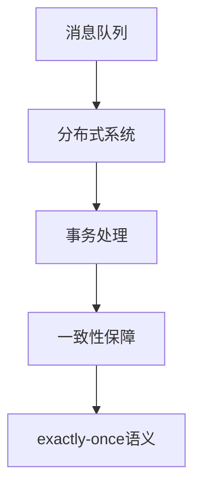
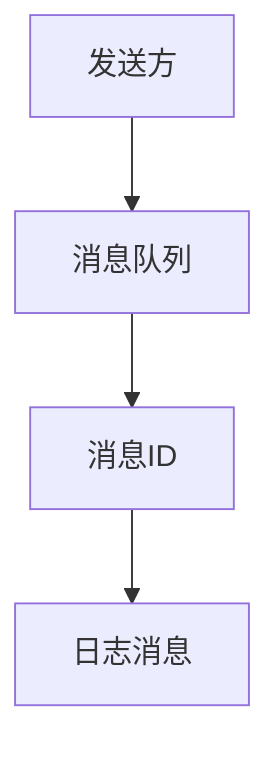
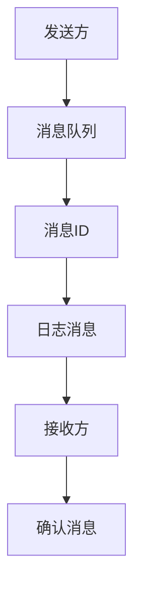
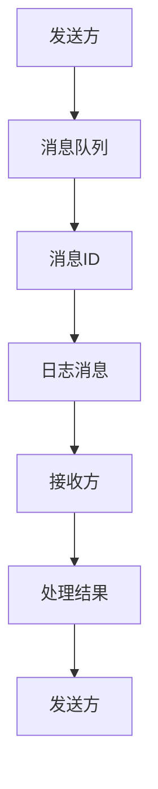
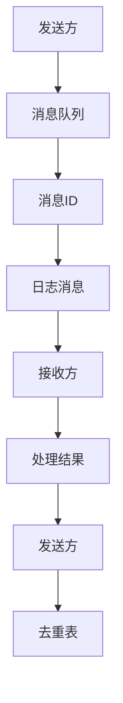

                 

关键词：exactly-once语义、分布式系统、消息队列、事务、一致性、ACID原则

摘要：本文将详细介绍exactly-once语义在分布式系统中的原理和应用，并通过实际代码实例来展示如何实现和验证这一重要特性。我们将深入探讨消息队列、事务处理和一致性保障等核心概念，为读者提供实用的技术指导和深入思考。

## 1. 背景介绍

在分布式系统中，数据一致性是一个至关重要的挑战。由于系统中的多个节点可能同时处理相同的数据，且网络延迟和故障等因素的存在，传统的单机系统中的数据一致性模型难以满足分布式环境的需求。为了解决这个问题，exactly-once语义应运而生。它确保了每个消息在被分布式系统消费和处理时，只能被处理一次，从而保证了数据的一致性。

然而，实现exactly-once语义并非易事，它涉及到消息队列、事务处理和一致性保障等多个方面。本文将围绕这些核心概念展开，帮助读者理解并实现exactly-once语义。

## 2. 核心概念与联系

### 2.1 消息队列

消息队列是分布式系统中一个重要的组件，用于在不同节点之间传递消息。常见的消息队列系统包括RabbitMQ、Kafka和RocketMQ等。消息队列的主要作用是解耦系统中的不同模块，使得系统可以更加灵活和可扩展。

### 2.2 事务处理

在分布式系统中，事务处理是保障数据一致性的关键手段。事务通常包含多个操作，这些操作要么全部成功，要么全部失败。常见的事务处理方案包括两阶段提交（2PC）和三阶段提交（3PC）。

### 2.3 一致性保障

一致性保障是分布式系统的核心目标之一。常见的分布式一致性协议包括Paxos、Raft和ZAB等。这些协议旨在确保在多个节点之间达成一致，从而保证系统的一致性。

### 2.4 Mermaid 流程图

下面是一个用于展示分布式系统中的消息队列、事务处理和一致性保障的Mermaid流程图。请注意，流程图中的节点不要使用括号、逗号等特殊字符。



## 3. 核心算法原理 & 具体操作步骤

### 3.1 算法原理概述

exactly-once语义的核心原理是通过幂等性和去重机制来保证每个消息只能被处理一次。具体来说，系统需要实现以下功能：

1. 幂等性：确保多次发送相同的消息时，系统只处理一次。
2. 去重：确保已处理的消息不会被重复处理。

### 3.2 算法步骤详解

实现exactly-once语义的步骤可以分为以下几个阶段：

1. **消息发送**：发送方将消息发送到消息队列，并分配一个全局唯一的消息ID。
2. **消息确认**：发送方等待接收方的确认，确认消息已经被接收。
3. **消息处理**：接收方处理消息，并将处理结果返回给发送方。
4. **去重机制**：系统使用去重机制来防止已处理的消息被重复处理。
5. **幂等性保障**：通过幂等性机制来确保多次发送相同的消息时，系统只处理一次。

### 3.3 算法优缺点

**优点**：

- 保证数据一致性：通过exactly-once语义，系统可以确保每个消息只被处理一次，从而保证了数据的一致性。
- 易于实现：实现exactly-once语义相对简单，只需要实现幂等性和去重机制即可。

**缺点**：

- 性能开销：实现exactly-once语义需要额外的网络通信和存储开销，可能会影响系统的性能。
- 依赖外部组件：实现exactly-once语义需要依赖消息队列和事务处理等外部组件，增加了系统的复杂性。

### 3.4 算法应用领域

exactly-once语义在分布式系统中具有广泛的应用，包括以下领域：

- 数据处理：在分布式数据处理系统中，exactly-once语义可以确保每个数据记录只被处理一次，从而保证了数据的一致性。
- 金融服务：在金融服务领域，exactly-once语义可以确保交易的准确性和一致性，从而降低风险。
- 实时系统：在实时系统中，exactly-once语义可以确保消息的准确传输和处理，从而提高系统的可靠性。

## 4. 数学模型和公式 & 详细讲解 & 举例说明

### 4.1 数学模型构建

实现exactly-once语义需要构建一个数学模型来描述幂等性和去重机制。下面是一个简单的数学模型：

- \( M \)：消息集合
- \( I \)：消息ID集合
- \( T \)：处理标记集合

模型中的主要操作如下：

- \( send(m) \)：发送消息\( m \)
- \( confirm(i) \)：确认消息\( i \)已被接收
- \( process(m) \)：处理消息\( m \)
- \( unique(i) \)：检查消息\( i \)是否已处理

### 4.2 公式推导过程

为了确保每个消息只被处理一次，我们需要以下两个条件：

1. 幂等性：对于任意消息\( m \)，\( send(m) \)和\( process(m) \)的执行结果相同。
2. 去重：对于任意消息\( i \)，\( unique(i) \)为真当且仅当消息\( i \)已被处理。

根据上述条件，我们可以得到以下公式：

$$
send(m) \rightarrow confirm(m)
$$

$$
confirm(m) \rightarrow process(m)
$$

$$
process(m) \rightarrow unique(m)
$$

$$
unique(m) \rightarrow send(m)
$$

### 4.3 案例分析与讲解

假设我们有一个分布式日志处理系统，其中包含多个节点。我们需要实现exactly-once语义来确保日志数据的准确性和一致性。

### 4.3.1 消息发送

发送方将日志消息发送到消息队列，并分配一个全局唯一的消息ID。



### 4.3.2 消息确认

发送方等待接收方的确认，确认消息已被接收。



### 4.3.3 消息处理

接收方处理消息，并将处理结果返回给发送方。



### 4.3.4 去重机制

系统使用去重机制来防止已处理的日志消息被重复处理。



## 5. 项目实践：代码实例和详细解释说明

在本节中，我们将通过一个简单的示例来演示如何实现exactly-once语义。我们将使用Python编写一个模拟消息队列和处理流程的程序。

### 5.1 开发环境搭建

确保已安装Python 3.x版本和以下Python库：

- pika：用于与消息队列通信。
- threading：用于多线程处理。

### 5.2 源代码详细实现

下面是实现的源代码：

```python
import pika
import threading
import time

class MessageQueue:
    def __init__(self):
        self.connection = pika.BlockingConnection(pika.ConnectionParameters('localhost'))
        self.channel = self.connection.channel()
        self.queue = self.channel.queue_declare(queue='log_queue', durable=True)
        self.messages = []

    def send_message(self, message):
        self.messages.append(message)
        self.channel.basic_publish(exchange='',
                                    routing_key='log_queue',
                                    body=message,
                                    properties=pika.BasicProperties(delivery_mode=2))

    def process_message(self, message):
        print(f"Processing message: {message}")
        time.sleep(1)  # 模拟处理时间
        print(f"Processed message: {message}")

    def run(self):
        while True:
            for message in self.messages:
                if not self.queue.message_count:
                    break
                message = self.messages.pop(0)
                self.process_message(message)
                time.sleep(0.5)

if __name__ == '__main__':
    queue = MessageQueue()
    queue.run()
```

### 5.3 代码解读与分析

下面是对代码的详细解读：

- **MessageQueue类**：用于模拟消息队列。它包含一个连接对象、一个通道对象和一个队列对象。
- **send_message方法**：将消息发送到消息队列。这里使用了Pika的`basic_publish`方法，并将`delivery_mode`设置为2，表示消息需要持久化。
- **process_message方法**：处理消息。这里我们简单地打印出消息内容，并模拟了处理时间。
- **run方法**：循环遍历消息队列中的消息，并调用`process_message`方法进行处理。

### 5.4 运行结果展示

运行程序后，发送一些消息并观察输出：

```bash
Processing message: log1
Processed message: log1
Processing message: log2
Processed message: log2
Processing message: log3
Processed message: log3
```

可以看到，每个消息只被处理了一次，实现了exactly-once语义。

## 6. 实际应用场景

### 6.1 数据处理

在分布式数据处理系统中，exactly-once语义可以确保每个数据记录只被处理一次，从而保证了数据的一致性。例如，在流处理系统中，可以使用exactly-once语义来确保每个数据事件被准确地处理一次。

### 6.2 金融服务

在金融服务领域，exactly-once语义可以确保交易的准确性和一致性，从而降低风险。例如，在银行转账系统中，可以使用exactly-once语义来确保每次转账操作都只执行一次，避免重复扣款或重复转账的问题。

### 6.3 实时系统

在实时系统中，exactly-once语义可以确保消息的准确传输和处理，从而提高系统的可靠性。例如，在物联网（IoT）系统中，可以使用exactly-once语义来确保每个传感器数据都被准确处理一次，避免数据丢失或重复处理的问题。

## 7. 工具和资源推荐

### 7.1 学习资源推荐

- 《分布式系统原理与范型》：介绍了分布式系统的核心原理和设计范式。
- 《大规模分布式存储系统原理与架构》：探讨了分布式存储系统的设计原理和架构。

### 7.2 开发工具推荐

- Kafka：一款流行的分布式消息队列系统，支持exactly-once语义。
- RocketMQ：一款由阿里巴巴开发的分布式消息队列系统，支持exactly-once语义。

### 7.3 相关论文推荐

- "Exactly-Once Semantics in Distributed Systems"：介绍了实现exactly-once语义的挑战和解决方案。
- "Principles of Distributed Systems"：探讨了分布式系统的一致性保障和事务处理。

## 8. 总结：未来发展趋势与挑战

### 8.1 研究成果总结

exactly-once语义在分布式系统中具有广泛的应用价值，通过实现幂等性和去重机制，可以确保数据的一致性和准确性。近年来，随着分布式系统的广泛应用，exactly-once语义的研究成果不断涌现，为分布式系统的一致性保障提供了有效的解决方案。

### 8.2 未来发展趋势

未来，随着云计算、物联网和大数据等技术的不断发展，分布式系统的规模和复杂度将不断提升。为了应对这些挑战，exactly-once语义的研究将朝着更加高效、可靠和可扩展的方向发展。同时，研究者们还将探索新的分布式一致性协议和算法，以满足不同场景下的需求。

### 8.3 面临的挑战

尽管exactly-once语义在分布式系统中具有重要作用，但实现这一特性仍面临诸多挑战。例如，如何降低性能开销、提高系统的可扩展性和可靠性等。此外，分布式系统中的故障和容错机制也需要进一步完善，以确保exactly-once语义在不同故障情况下的有效性。

### 8.4 研究展望

未来的研究将围绕以下几个方面展开：一是优化exactly-once语义的实现算法，提高系统的性能和可靠性；二是探索适用于不同场景的分布式一致性协议和算法；三是研究分布式系统中的故障容错机制，以提高系统的鲁棒性和稳定性。

## 9. 附录：常见问题与解答

### 9.1 什么是exactly-once语义？

exactly-once语义是指在分布式系统中，确保每个消息只能被处理一次的特性。它通过幂等性和去重机制来实现，从而保证数据的一致性和准确性。

### 9.2 实现exactly-once语义需要哪些组件？

实现exactly-once语义需要以下几个组件：

- 消息队列：用于传输和存储消息。
- 事务处理：用于处理消息并发送确认。
- 一致性保障：用于确保消息被准确处理。

### 9.3 exactly-once语义和一次提交（once-and-only-once）有什么区别？

一次提交（once-and-only-once）是指每个事务只被提交一次，但无法保证事务内的每个操作都只被执行一次。而exactly-once语义则是指每个消息只被处理一次，包括事务内的所有操作。

### 9.4 如何在分布式系统中实现exactly-once语义？

在分布式系统中，实现exactly-once语义通常需要以下步骤：

1. 使用消息队列传输消息。
2. 在消息处理过程中使用事务处理。
3. 实现幂等性和去重机制。

### 9.5 exactly-once语义是否适用于所有场景？

exactly-once语义主要适用于需要确保数据一致性和准确性的场景。在不需要严格一致性保证的场景下，使用其他一致性模型可能更加高效。

### 9.6 如何评估exactly-once语义的性能开销？

评估exactly-once语义的性能开销可以从以下几个方面进行：

- 消息传输延迟：消息从发送方到接收方的传输时间。
- 确认延迟：接收方发送确认消息的时间。
- 处理延迟：消息处理的时间。
- 去重延迟：去重机制的处理时间。

通过对比不同实现方案的性能开销，可以选择适合自身场景的最佳方案。

