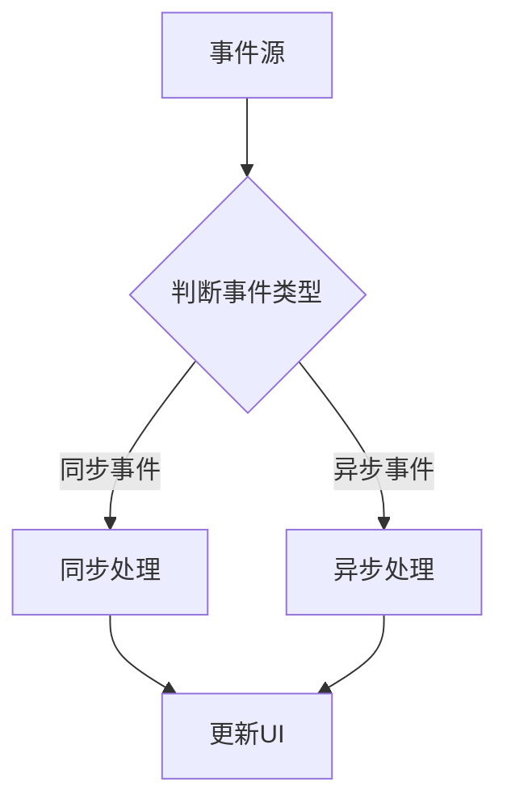

                 

关键字：iOS，响应式编程，RxSwift，事件驱动，异步处理，函数响应式编程，数据流管理，软件架构

摘要：本文旨在深入探讨iOS平台上的响应式编程技术，特别是RxSwift框架的应用。通过详细解析其核心概念、算法原理、数学模型及实际应用案例，本文将帮助开发者更好地理解并掌握响应式编程在iOS开发中的优势和实践方法。

## 1. 背景介绍

在iOS开发中，响应式编程已经成为一种主流的编程范式。传统的命令式编程依赖于一系列的命令和状态改变，而响应式编程则更注重于事件和数据流的管理。它能够有效地处理异步事件、复杂的数据依赖关系，并在保持代码简洁的同时提高应用程序的响应性和可维护性。

RxSwift是Reactoration的一个Swift实现，它允许开发者以函数响应式编程（FRP）的方式处理iOS中的数据流。与传统的面向对象编程（OOP）相比，响应式编程能够更自然地表达和组合异步操作，使得数据处理和状态管理变得更加直观和易于维护。

本文将首先介绍响应式编程的基本概念，然后深入探讨RxSwift的核心特性及其在iOS开发中的应用。我们将通过实际的代码实例，展示如何使用RxSwift实现复杂的异步数据处理和事件响应，以及如何通过响应式编程提高应用程序的性能和可维护性。

## 2. 核心概念与联系

### 2.1 响应式编程基础

响应式编程的核心概念是事件驱动和数据流。在响应式编程中，程序的行为由外部事件触发，而不是按照预定的顺序执行。事件可以是用户交互、网络请求、定时器触发等，而数据流则是事件传递的载体。

#### 2.1.1 事件（Events）

事件是响应式编程中的基本构建块。在RxSwift中，事件被抽象为`Observable`对象。一个`Observable`可以发布多个事件，如数据项、错误或完成信号。事件可以是同步的，也可以是异步的，这使得它们能够很好地处理异步操作。

#### 2.1.2 数据流（Data Streams）

数据流是由一系列事件组成的序列。在响应式编程中，数据流通常由`Observable`对象表示。开发者可以通过订阅`Observable`来监听数据流中的事件，并在事件发生时执行相应的处理逻辑。

### 2.2 Mermaid 流程图

为了更好地理解响应式编程的核心概念和联系，我们可以使用Mermaid流程图来展示其基本流程。



在这个流程图中，事件源（A）生成事件，判断事件类型（B）后，同步事件（C）会直接进行同步处理，而异步事件（D）则会通过异步处理完成后再更新UI（E）。

### 2.3 RxSwift 核心概念

#### 2.3.1 Observables

`Observable`是RxSwift中的核心组件，它负责发布事件。一个`Observable`可以看作是一个事件源，它可以发布多个事件，包括数据项、错误和完成信号。开发者可以通过订阅（`subscribe`）`Observable`来监听事件并执行相应的处理逻辑。

#### 2.3.2 Subscribers

`Subscriber`是接收并处理`Observable`发布事件的组件。每个订阅者都有一个`onNext`（接收数据项）、`onError`（处理错误）和`onCompleted`（处理完成信号）的回调方法。通过这些回调方法，开发者可以自定义事件处理逻辑。

#### 2.3.3 Operators

`Operator`是用于变换和组合数据流的函数。RxSwift提供了丰富的操作符，如`map`（映射）、`filter`（过滤）、`flatMap`（合并）等，这些操作符可以用来处理和变换数据流，使得数据处理的逻辑更加简洁和可读。

## 3. 核心算法原理 & 具体操作步骤

### 3.1 算法原理概述

响应式编程的核心在于事件和数据流的处理。在RxSwift中，这一过程通过`Observable`和`Subscriber`的实现来完成。`Observable`负责生成和发布事件，而`Subscriber`则负责接收和处理这些事件。

#### 3.1.1 事件生成

在响应式编程中，事件可以由用户交互、网络请求、定时器触发等多种方式生成。每个事件都会被封装成`Event`对象，然后发布到`Observable`中。

#### 3.1.2 事件处理

订阅者（`Subscriber`）通过订阅`Observable`来监听事件。在事件发生时，订阅者会接收到事件并通过回调方法（`onNext`、`onError`、`onCompleted`）来执行相应的处理逻辑。

#### 3.1.3 数据流变换

通过使用操作符（`Operator`），开发者可以方便地对数据流进行变换和组合。例如，使用`map`操作符可以将一个`Observable`中的事件映射到另一个事件，而`flatMap`操作符则可以合并多个`Observable`的事件流。

### 3.2 算法步骤详解

#### 3.2.1 创建 Observable

首先，开发者需要创建一个`Observable`对象来生成和发布事件。例如，可以使用`Observable.create`方法来创建一个自定义的`Observable`：

```swift
let observable = Observable.create { observer in
    observer.onNext(1)
    observer.onNext(2)
    observer.onCompleted()
    return Disposables.create()
}
```

#### 3.2.2 订阅 Observable

接下来，开发者需要通过订阅（`subscribe`）来监听`Observable`发布的事件。在订阅过程中，可以指定事件处理逻辑：

```swift
observable.subscribe(onNext: { event in
    print(event)
}, onError: { error in
    print("Error: \(error)")
}, onCompleted: {
    print("Completed")
})
```

#### 3.2.3 使用操作符

开发者可以使用各种操作符来变换和组合数据流。例如，可以使用`map`操作符将事件映射到另一个事件：

```swift
observable.map { event in
    return event * 2
}.subscribe(onNext: { event in
    print(event)
})
```

### 3.3 算法优缺点

#### 3.3.1 优点

1. **异步处理**：响应式编程能够方便地处理异步事件，使得异步操作更加直观和易于管理。
2. **代码可读性**：通过使用操作符和函数响应式编程，代码更加简洁和可读。
3. **数据依赖**：响应式编程能够更好地表达和处理复杂的数据依赖关系。

#### 3.3.2 缺点

1. **学习成本**：响应式编程相对于传统的命令式编程具有更高的学习成本，特别是对于初学者来说。
2. **性能问题**：在某些情况下，响应式编程可能会导致性能问题，特别是在处理大量数据流时。

### 3.4 算法应用领域

响应式编程在iOS开发中得到了广泛的应用，特别是在需要处理复杂异步操作和事件驱动的场景中。以下是一些典型的应用领域：

1. **网络请求**：使用`Observable`和`RxCocoa`可以方便地处理网络请求，包括GET、POST等操作。
2. **用户交互**：通过监听用户交互事件，如按钮点击、文本输入等，可以实时响应用户操作。
3. **定时任务**：可以使用响应式编程来实现定时任务的调度和管理。

## 4. 数学模型和公式 & 详细讲解 & 举例说明

### 4.1 数学模型构建

在响应式编程中，我们通常使用概率论和集合论来构建数学模型。以下是一个简单的数学模型，用于描述数据流中的事件：

#### 4.1.1 事件概率分布

假设我们有多个事件，每个事件发生的概率不同。我们可以使用概率分布函数（PDF）来描述这些事件的概率分布。例如，假设事件A发生的概率为0.5，事件B发生的概率为0.3，事件C发生的概率为0.2，那么PDF可以表示为：

$$
f(x) = \begin{cases} 
0.5 & \text{if } x = A \\
0.3 & \text{if } x = B \\
0.2 & \text{if } x = C \\
0 & \text{otherwise}
\end{cases}
$$

#### 4.1.2 事件集合

事件集合（Event Set）是由一系列事件组成的集合。在响应式编程中，事件集合通常用于表示数据流。例如，假设数据流包含事件A、B、C，那么事件集合可以表示为：

$$
S = \{A, B, C\}
$$

### 4.2 公式推导过程

#### 4.2.1 条件概率

在响应式编程中，条件概率用于描述事件之间的依赖关系。条件概率公式如下：

$$
P(A|B) = \frac{P(A \cap B)}{P(B)}
$$

其中，$P(A \cap B)$ 表示事件A和事件B同时发生的概率，$P(B)$ 表示事件B发生的概率。

#### 4.2.2 贝叶斯公式

贝叶斯公式是条件概率的扩展，用于计算后验概率。贝叶斯公式如下：

$$
P(A|B) = \frac{P(B|A)P(A)}{P(B)}
$$

其中，$P(B|A)$ 表示事件B在事件A发生条件下的概率，$P(A)$ 表示事件A发生的概率。

### 4.3 案例分析与讲解

#### 4.3.1 网络请求响应

假设我们需要发送一个网络请求并处理响应。网络请求的成功概率为0.9，失败概率为0.1。我们需要计算网络请求成功并返回特定数据的概率。

首先，我们定义事件A为“网络请求成功”，事件B为“返回特定数据”。根据条件概率公式，我们可以计算事件A和事件B同时发生的概率：

$$
P(A \cap B) = P(B|A)P(A) = 0.9 \times 0.9 = 0.81
$$

然后，我们使用贝叶斯公式计算后验概率：

$$
P(A|B) = \frac{P(B|A)P(A)}{P(B)} = \frac{0.9 \times 0.9}{0.9 + 0.1 \times 0.1} = \frac{0.81}{0.9} = 0.9
$$

因此，网络请求成功并返回特定数据的概率为0.9。

## 5. 项目实践：代码实例和详细解释说明

### 5.1 开发环境搭建

在开始项目实践之前，我们需要搭建好开发环境。首先，确保已经安装了Xcode和Swift语言环境。然后，通过CocoaPods安装RxSwift框架：

```shell
pod 'RxSwift', '~> 5.0'
pod 'RxCocoa', '~> 5.0'
```

### 5.2 源代码详细实现

以下是使用RxSwift处理网络请求的示例代码：

```swift
import RxSwift
import RxCocoa

class NetworkService {
    func fetchWeatherData(city: String) -> Observable<WeatherData> {
        let url = URL(string: "https://api.weatherapi.com/v1/current.json")!
        return URLSession.shared.rx.data(request: URLRequest(url: url))
            .map { data -> WeatherData in
                let json = try JSONSerialization.jsonObject(with: data, options: []) as? [String: Any]
                // 解析JSON数据并返回WeatherData对象
                return WeatherData(json: json)
            }
            .catchErrorJustReturn(WeatherData.default)
    }
}

class ViewController: UIViewController {
    let disposeBag = DisposeBag()
    let networkService = NetworkService()
    let cityTextField = UITextField()
    let weatherLabel = UILabel()

    override func viewDidLoad() {
        super.viewDidLoad()
        
        // 创建Observable，监听文本输入事件
        let city Observable<String> = cityTextField.rx.text.orEmpty.asObservable()
        
        // 使用flatMap操作符处理网络请求
        let weather Observable<WeatherData> = city.flatMap { city in
            return self.networkService.fetchWeatherData(city: city)
        }
        
        // 订阅天气数据流
        weather.subscribe(onNext: { weatherData in
            self.weatherLabel.text = "Weather in \(weatherData.city): \(weatherData.temperature)°C"
        }, onError: { error in
            print("Error: \(error)")
        }, onCompleted: {
            print("Completed")
        }, onDisposed: {
            print("Disposable")
        }).disposed(by: disposeBag)
    }
}
```

### 5.3 代码解读与分析

#### 5.3.1 网络请求处理

在上面的代码中，我们定义了一个`NetworkService`类，用于处理网络请求。`fetchWeatherData`方法使用`URLSession.rx.data`操作符发送网络请求，并将获取到的数据映射为`WeatherData`对象。

#### 5.3.2 数据流处理

我们使用`flatMap`操作符将文本输入事件（`city Observable<String>`）转换成天气数据流（`weather Observable<WeatherData>`）。这样，当文本输入发生变化时，就会触发网络请求，并更新UI显示天气数据。

#### 5.3.3 订阅与事件处理

通过订阅天气数据流，我们可以在`onNext`回调方法中更新UI显示天气信息。在发生错误时，我们可以通过`onError`回调方法进行错误处理。在数据流完成时，我们可以通过`onCompleted`回调方法进行后续操作。最后，在`onDisposed`回调方法中，我们可以释放资源。

### 5.4 运行结果展示

当在文本框中输入城市名称并触发文本输入事件时，程序会自动发送网络请求获取天气数据，并更新UI显示天气信息。在发生错误时，会打印错误信息。

## 6. 实际应用场景

### 6.1 网络请求处理

在iOS开发中，网络请求是常见的异步操作。使用RxSwift可以方便地处理复杂的网络请求，并确保数据流的可读性和可维护性。例如，在社交媒体应用中，可以实时获取和更新用户动态、私信等信息。

### 6.2 用户交互

响应式编程可以很好地处理用户交互事件，如按钮点击、滑动、拖动等。通过使用RxSwift，开发者可以轻松地绑定用户交互事件，并在事件发生时执行相应的处理逻辑。

### 6.3 定时任务

在iOS开发中，定时任务（如定时发送通知、定时同步数据等）也是常见的异步操作。使用响应式编程可以方便地处理和调度定时任务，确保任务的执行和状态管理。

## 7. 工具和资源推荐

### 7.1 学习资源推荐

- **官方文档**：[RxSwift官方文档](https://github.com/ReactiveX/RxSwift)
- **在线教程**：[iOS响应式编程教程](https://www.raywenderlich.com/series/ios-advanced-techniques)
- **书籍**：[《响应式Swift编程》](https://www.amazon.com/Reactive-Swift-Programming-Approach-Architecting/dp/1484236249)

### 7.2 开发工具推荐

- **Xcode**：官方集成开发环境，支持Swift和Objective-C编程。
- **CocoaPods**：依赖管理工具，用于管理项目中的第三方库。
- **Instruments**：性能分析工具，用于监控和优化应用程序的性能。

### 7.3 相关论文推荐

- **《响应式编程：理论与实践》**：介绍响应式编程的基本概念和原理，以及其在软件工程中的应用。
- **《函数响应式编程》**：探讨函数响应式编程的原理和实现，以及其在并发编程中的应用。

## 8. 总结：未来发展趋势与挑战

### 8.1 研究成果总结

响应式编程在iOS开发中已经得到了广泛应用，并取得了显著的成果。通过使用RxSwift等响应式框架，开发者可以更加简洁地处理异步事件和数据流，提高应用程序的响应性和可维护性。同时，响应式编程也在其他领域（如前端开发、服务器端开发等）得到了广泛的应用和研究。

### 8.2 未来发展趋势

随着移动设备和物联网（IoT）的快速发展，响应式编程将继续在iOS开发中发挥重要作用。未来，我们可以期待以下发展趋势：

1. **更丰富的操作符和功能**：随着响应式编程的不断发展，框架将提供更多高级操作符和功能，以更好地处理复杂的异步操作和数据流。
2. **跨平台支持**：响应式编程框架将逐渐支持其他平台（如Android、Web等），使得开发者可以更加方便地在不同平台上进行开发。
3. **集成化开发环境**：集成开发环境（IDE）将逐渐集成响应式编程工具，提供更加便捷的开发体验。

### 8.3 面临的挑战

尽管响应式编程在iOS开发中具有许多优势，但也面临一些挑战：

1. **学习成本**：响应式编程相对于传统的命令式编程具有更高的学习成本，特别是对于初学者来说。
2. **性能问题**：在某些情况下，响应式编程可能会导致性能问题，特别是在处理大量数据流时。
3. **调试和测试**：响应式编程框架的调试和测试相对较为复杂，需要开发人员具备一定的技能和经验。

### 8.4 研究展望

在未来，响应式编程将继续在iOS开发中发挥重要作用。研究重点可以包括以下几个方面：

1. **性能优化**：通过优化响应式编程框架，提高其性能和效率。
2. **开发工具和生态**：开发更加便捷的集成开发环境和工具，提高开发效率。
3. **跨平台支持**：探索响应式编程在跨平台开发中的应用，以实现代码的共享和复用。

总之，响应式编程在iOS开发中具有巨大的潜力，并将在未来继续发展和完善。通过不断的研究和实践，我们将能够更好地利用响应式编程的优势，开发出更加高效、可靠和可维护的应用程序。

## 9. 附录：常见问题与解答

### 9.1 常见问题

1. **什么是响应式编程？**
   响应式编程是一种编程范式，它强调对事件的响应和数据流的管理。在响应式编程中，程序的行为是由外部事件触发的，而不是按照预定的顺序执行。

2. **什么是RxSwift？**
   RxSwift是Reactoration的一个Swift实现，它允许开发者以函数响应式编程（FRP）的方式处理iOS中的数据流。通过使用RxSwift，开发者可以方便地处理异步事件和数据流。

3. **如何使用RxSwift处理异步操作？**
   使用RxSwift处理异步操作通常涉及创建一个`Observable`对象来发布事件，并使用操作符（如`flatMap`、`map`等）来变换和组合数据流。通过订阅`Observable`，开发者可以监听事件并执行相应的处理逻辑。

4. **响应式编程相对于传统的命令式编程有哪些优势？**
   相对于传统的命令式编程，响应式编程具有以下优势：
   - 更好的异步处理能力
   - 更简洁和可读的代码
   - 更好的表达复杂的数据依赖关系

5. **响应式编程在iOS开发中有哪些应用场景？**
   响应式编程在iOS开发中广泛应用于以下几个方面：
   - 网络请求处理
   - 用户交互
   - 定时任务

### 9.2 解答

1. **什么是响应式编程？**
   响应式编程是一种编程范式，它强调对事件的响应和数据流的管理。在响应式编程中，程序的行为是由外部事件触发的，而不是按照预定的顺序执行。

2. **什么是RxSwift？**
   RxSwift是Reactoration的一个Swift实现，它允许开发者以函数响应式编程（FRP）的方式处理iOS中的数据流。通过使用RxSwift，开发者可以方便地处理异步事件和数据流。

3. **如何使用RxSwift处理异步操作？**
   使用RxSwift处理异步操作通常涉及以下步骤：
   - 创建一个`Observable`对象来发布事件。
   - 使用操作符（如`flatMap`、`map`等）来变换和组合数据流。
   - 订阅`Observable`，并在回调方法中处理事件。

4. **响应式编程相对于传统的命令式编程有哪些优势？**
   相对于传统的命令式编程，响应式编程具有以下优势：
   - 更好的异步处理能力：响应式编程能够方便地处理异步事件，使得异步操作更加直观和易于管理。
   - 更简洁和可读的代码：通过使用操作符和函数响应式编程，代码更加简洁和可读。
   - 更好的表达复杂的数据依赖关系：响应式编程能够更好地表达和处理复杂的数据依赖关系。

5. **响应式编程在iOS开发中有哪些应用场景？**
   响应式编程在iOS开发中广泛应用于以下几个方面：
   - **网络请求处理**：使用RxSwift可以方便地处理复杂的网络请求，包括GET、POST等操作。
   - **用户交互**：通过监听用户交互事件，如按钮点击、文本输入等，可以实时响应用户操作。
   - **定时任务**：可以使用响应式编程来实现定时任务的调度和管理。

通过以上解答，希望能够帮助开发者更好地理解和应用响应式编程，特别是在iOS开发中的具体实践。在实际开发过程中，不断学习和探索，将有助于提升开发效率和代码质量。

