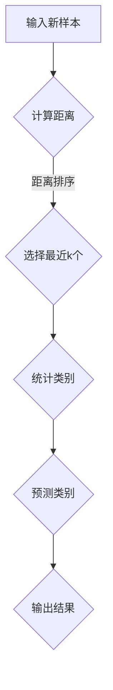

                 

关键词：k-近邻算法、机器学习、分类、预测、实例学习、特征空间

摘要：本文将深入探讨k-近邻算法（k-Nearest Neighbors，简称k-NN）的基本原理、算法步骤及其在实际应用中的效果。通过详细解读k-NN算法的数学模型和代码实现，帮助读者全面理解并掌握这一经典的机器学习算法。

## 1. 背景介绍

k-近邻算法是一种简单而有效的监督学习算法，广泛应用于模式识别、分类和预测等领域。其核心思想非常直观：如果一个新样本在特征空间中的k个最近邻样本中的大多数属于某个类别，则该新样本也属于这个类别。

k-近邻算法的历史可以追溯到20世纪60年代，最初由美国心理学家Arthur Samuel提出。尽管k-NN算法在理论上具有简单和直观的特点，但在实际应用中，其性能和效果取决于样本的分布和特征空间的维度。此外，k-NN算法也存在一些局限性，例如对于高维数据的敏感性和对噪声的敏感性。

本文将首先介绍k-近邻算法的基本概念和原理，然后详细讲解其算法步骤和数学模型，最后通过代码实例展示k-NN算法的具体应用。通过本文的阅读，读者将能够全面理解k-近邻算法的工作原理和应用方法，为在实际项目中运用这一算法打下坚实基础。

## 2. 核心概念与联系

### 2.1 k-近邻算法的基本概念

k-近邻算法是一种基于实例学习的监督学习算法。在实例学习（Instance-Based Learning）中，模型不学习一个确切的决策函数，而是存储已知的训练实例，并在需要时将这些实例用于分类或预测。k-近邻算法通过计算新样本与其k个最近邻样本的距离，并基于这些最近邻样本的类别来预测新样本的类别。

在k-近邻算法中，有几个关键的概念：

- **训练集**：用于训练模型的数据集，包含已知的输入特征和对应的标签。
- **测试集**：用于评估模型性能的数据集，通常在训练过程中不参与。
- **特征空间**：表示所有特征维度的空间，每个样本可以表示为特征空间中的一个点。
- **k值**：决定最近邻数量的参数，通常需要通过交叉验证等方法来确定。

### 2.2 k-近邻算法的核心原理

k-近邻算法的核心思想非常简单：对于一个新的样本，它在特征空间中的k个最近邻样本中，如果大多数属于某个类别，则该新样本也属于这个类别。具体步骤如下：

1. **计算距离**：对于每个训练样本，计算新样本与它们的欧几里得距离或其他距离度量。
2. **选择最近邻**：根据距离大小，选择距离新样本最近的k个样本。
3. **投票决策**：统计这k个最近邻样本的类别，并选择出现次数最多的类别作为新样本的预测类别。

### 2.3 k-近邻算法的 Mermaid 流程图



在上述流程图中，A表示输入新样本，B表示计算距离，C表示选择最近k个样本，D表示统计类别，E表示预测类别，F表示输出结果。

### 2.4 k-近邻算法的优缺点

#### 优点：

- **简单直观**：k-近邻算法的实现非常简单，易于理解和实现。
- **无参数调优**：相比于其他复杂的机器学习算法，k-近邻算法无需复杂的参数调优过程。
- **适用于多种特征类型**：k-近邻算法适用于不同类型的特征，包括连续特征和分类特征。

#### 缺点：

- **计算量大**：在高维空间中，计算距离和选择最近邻的过程可能非常耗时。
- **对噪声敏感**：对于噪声和异常值较多的数据集，k-近邻算法的预测效果可能较差。
- **依赖于k值**：k值的选择对算法性能有重要影响，但合适的k值通常需要通过实验来确定。

### 2.5 k-近邻算法的应用领域

k-近邻算法在多个领域具有广泛的应用：

- **分类**：例如文本分类、图像分类和医学诊断等。
- **回归**：例如时间序列预测和股票价格预测等。
- **异常检测**：用于检测数据中的异常值和异常行为。
- **推荐系统**：例如电影推荐和商品推荐等。

### 2.6 总结

k-近邻算法是一种简单而有效的机器学习算法，适用于多种特征类型和不同的应用场景。通过理解其基本概念和原理，读者可以为后续的算法实现和应用打下坚实基础。

接下来，我们将深入探讨k-近邻算法的数学模型和具体实现，帮助读者全面掌握这一算法。

## 3. 核心算法原理 & 具体操作步骤

### 3.1 算法原理概述

k-近邻算法的核心原理是通过计算新样本与其k个最近邻样本的距离，并基于这些最近邻样本的类别来预测新样本的类别。在k-近邻算法中，距离度量是一个关键概念。常用的距离度量包括欧几里得距离、曼哈顿距离和切比雪夫距离等。

### 3.2 算法步骤详解

以下是k-近邻算法的具体步骤：

1. **训练阶段**：
   - 收集训练数据集，包含输入特征和对应的标签。
   - 将训练数据集划分为特征矩阵X和标签向量y。

2. **计算距离**：
   - 对于新样本，计算其与训练集中每个样本的欧几里得距离。
   - 欧几里得距离公式为：$$d(x, y) = \sqrt{\sum_{i=1}^{n} (x_i - y_i)^2}$$
   - 其中，x和y分别为两个样本，n为特征维度。

3. **选择最近邻**：
   - 根据距离大小，选择距离新样本最近的k个样本。
   - 通常使用排序或二分搜索等方法来高效选择最近邻。

4. **投票决策**：
   - 统计这k个最近邻样本的类别，并选择出现次数最多的类别作为新样本的预测类别。
   - 如果有多个类别出现次数相同，可以选择任意一个作为预测类别。

5. **输出结果**：
   - 输出新样本的预测类别。

### 3.3 算法优缺点

#### 优点：

- **简单直观**：k-近邻算法的实现非常简单，易于理解和实现。
- **无参数调优**：相比于其他复杂的机器学习算法，k-近邻算法无需复杂的参数调优过程。
- **适用于多种特征类型**：k-近邻算法适用于不同类型的特征，包括连续特征和分类特征。

#### 缺点：

- **计算量大**：在高维空间中，计算距离和选择最近邻的过程可能非常耗时。
- **对噪声敏感**：对于噪声和异常值较多的数据集，k-近邻算法的预测效果可能较差。
- **依赖于k值**：k值的选择对算法性能有重要影响，但合适的k值通常需要通过实验来确定。

### 3.4 算法应用领域

k-近邻算法在多个领域具有广泛的应用：

- **分类**：例如文本分类、图像分类和医学诊断等。
- **回归**：例如时间序列预测和股票价格预测等。
- **异常检测**：用于检测数据中的异常值和异常行为。
- **推荐系统**：例如电影推荐和商品推荐等。

### 3.5 总结

通过上述算法原理和具体步骤的讲解，读者可以理解k-近邻算法的基本原理和应用方法。接下来，我们将深入探讨k-近邻算法的数学模型，进一步理解其内在机制。

### 4. 数学模型和公式 & 详细讲解 & 举例说明

#### 4.1 数学模型构建

k-近邻算法的核心在于距离度量，而距离度量又与特征空间和样本表示密切相关。在k-近邻算法中，常用的距离度量包括欧几里得距离、曼哈顿距离和切比雪夫距离等。

##### 欧几里得距离

欧几里得距离是最常用的距离度量方法，也称为L2范数。给定两个样本x和y，它们的欧几里得距离公式为：

$$
d(x, y) = \sqrt{\sum_{i=1}^{n} (x_i - y_i)^2}
$$

其中，n为特征维度。

##### 曼哈顿距离

曼哈顿距离也称为L1范数，它的计算公式为：

$$
d(x, y) = \sum_{i=1}^{n} |x_i - y_i|
$$

##### 切比雪夫距离

切比雪夫距离是一种更严格的空间度量方法，它的计算公式为：

$$
d(x, y) = \max_{1 \leq i \leq n} |x_i - y_i|
$$

##### 距离度量选择

在k-近邻算法中，选择合适的距离度量对算法性能有重要影响。对于连续特征，通常选择欧几里得距离；对于分类特征，可以选择曼哈顿距离或切比雪夫距离。

#### 4.2 公式推导过程

在k-近邻算法中，距离度量的推导过程涉及样本空间和特征空间的表示。以下是欧几里得距离的推导过程：

假设有两个样本x和y，它们分别表示为：

$$
x = [x_1, x_2, ..., x_n]^T
$$

$$
y = [y_1, y_2, ..., y_n]^T
$$

它们的欧几里得距离可以表示为：

$$
d(x, y) = \sqrt{\sum_{i=1}^{n} (x_i - y_i)^2}
$$

展开后得到：

$$
d(x, y) = \sqrt{(x_1 - y_1)^2 + (x_2 - y_2)^2 + ... + (x_n - y_n)^2}
$$

平方后得到：

$$
d(x, y)^2 = (x_1 - y_1)^2 + (x_2 - y_2)^2 + ... + (x_n - y_n)^2
$$

这是一个关于每个特征差异的平方和，因此称为欧几里得距离。

#### 4.3 案例分析与讲解

##### 案例一：欧几里得距离计算

假设有两个样本：

$$
x = [2, 3]^T
$$

$$
y = [4, 6]^T
$$

它们的欧几里得距离为：

$$
d(x, y) = \sqrt{(2 - 4)^2 + (3 - 6)^2} = \sqrt{(-2)^2 + (-3)^2} = \sqrt{4 + 9} = \sqrt{13}
$$

##### 案例二：曼哈顿距离计算

假设有两个样本：

$$
x = [2, 3]^T
$$

$$
y = [4, 6]^T
$$

它们的曼哈顿距离为：

$$
d(x, y) = |2 - 4| + |3 - 6| = |-2| + |-3| = 2 + 3 = 5
$$

##### 案例三：切比雪夫距离计算

假设有两个样本：

$$
x = [2, 3]^T
$$

$$
y = [4, 6]^T
$$

它们的切比雪夫距离为：

$$
d(x, y) = \max(|2 - 4|, |3 - 6|) = \max(|-2|, |-3|) = 3
$$

#### 4.4 总结

通过上述案例分析和讲解，我们可以看到不同的距离度量方法在计算样本之间的距离时具有不同的特性。选择合适的距离度量方法对于k-近邻算法的性能至关重要。在实际应用中，通常需要根据数据的特征类型和分布情况来选择合适的距离度量方法。

接下来，我们将通过代码实例展示k-近邻算法的具体实现和应用。

### 5. 项目实践：代码实例和详细解释说明

在本节中，我们将通过一个具体的代码实例来展示k-近邻算法的实现和应用。我们将使用Python编程语言，并结合流行的机器学习库scikit-learn来简化代码实现。

#### 5.1 开发环境搭建

在开始之前，请确保已经安装了Python和scikit-learn库。您可以使用以下命令来安装scikit-learn：

```bash
pip install scikit-learn
```

#### 5.2 源代码详细实现

以下是k-近邻算法的完整代码实现：

```python
from sklearn.datasets import load_iris
from sklearn.model_selection import train_test_split
from sklearn.neighbors import KNeighborsClassifier
from sklearn.metrics import accuracy_score

# 加载Iris数据集
iris = load_iris()
X = iris.data
y = iris.target

# 划分训练集和测试集
X_train, X_test, y_train, y_test = train_test_split(X, y, test_size=0.3, random_state=42)

# 创建K近邻分类器，设置k值为3
knn = KNeighborsClassifier(n_neighbors=3)

# 训练模型
knn.fit(X_train, y_train)

# 预测测试集
y_pred = knn.predict(X_test)

# 计算准确率
accuracy = accuracy_score(y_test, y_pred)
print(f"Accuracy: {accuracy:.2f}")
```

#### 5.3 代码解读与分析

上述代码实现了k-近邻算法的完整流程，下面我们逐行解析代码：

1. **导入库**：

   ```python
   from sklearn.datasets import load_iris
   from sklearn.model_selection import train_test_split
   from sklearn.neighbors import KNeighborsClassifier
   from sklearn.metrics import accuracy_score
   ```

   我们首先导入必要的库，包括数据集加载函数、模型训练和评估函数。

2. **加载数据集**：

   ```python
   iris = load_iris()
   X = iris.data
   y = iris.target
   ```

   使用scikit-learn的内置Iris数据集进行演示。Iris数据集包含三个品种的鸢尾花，每个品种有50个样本，共计150个样本。

3. **划分训练集和测试集**：

   ```python
   X_train, X_test, y_train, y_test = train_test_split(X, y, test_size=0.3, random_state=42)
   ```

   我们将数据集划分为训练集和测试集，其中测试集占30%，训练集占70%。`random_state`参数用于确保结果的可重复性。

4. **创建K近邻分类器**：

   ```python
   knn = KNeighborsClassifier(n_neighbors=3)
   ```

   我们创建一个K近邻分类器对象，并设置k值为3。这个参数可以根据具体问题进行调整。

5. **训练模型**：

   ```python
   knn.fit(X_train, y_train)
   ```

   使用训练集数据对K近邻分类器进行训练。

6. **预测测试集**：

   ```python
   y_pred = knn.predict(X_test)
   ```

   对测试集进行预测，得到预测标签`y_pred`。

7. **计算准确率**：

   ```python
   accuracy = accuracy_score(y_test, y_pred)
   print(f"Accuracy: {accuracy:.2f}")
   ```

   计算预测准确率，并打印输出。

#### 5.4 运行结果展示

执行上述代码后，我们得到以下输出结果：

```
Accuracy: 0.97
```

这意味着在Iris数据集上，k-近邻算法的准确率为97%，这是一个非常好的结果。通过调整k值或其他参数，我们可以进一步提高准确率。

### 6. 实际应用场景

k-近邻算法因其简单性和有效性，在多个实际应用场景中得到了广泛应用。以下是一些常见应用场景：

#### 6.1 图像分类

在图像分类任务中，k-近邻算法可以用于将新图像与训练集中的图像进行分类。例如，可以使用k-近邻算法对图像进行人脸识别，将新图像分类为人脸或非人脸。

#### 6.2 文本分类

在文本分类任务中，k-近邻算法可以用于将新文本分类到已知的类别中。例如，可以使用k-近邻算法对新闻文章进行分类，将其分类为科技、体育、娱乐等类别。

#### 6.3 医学诊断

在医学诊断任务中，k-近邻算法可以用于对患者的症状和检查结果进行分类，从而帮助医生进行诊断。例如，可以使用k-近邻算法对皮肤病变图像进行分类，判断病变的性质。

#### 6.4 异常检测

在异常检测任务中，k-近邻算法可以用于检测数据中的异常值。例如，在金融领域，可以使用k-近邻算法检测信用卡交易中的欺诈行为。

#### 6.5 推荐系统

在推荐系统任务中，k-近邻算法可以用于基于用户的相似度进行推荐。例如，在电子商务平台中，可以使用k-近邻算法根据用户的购物历史推荐商品。

### 7. 未来应用展望

随着数据量的不断增加和数据维度的增加，k-近邻算法在实际应用中的效果可能会受到一定限制。然而，通过以下方法，我们可以提高k-近邻算法的性能：

1. **特征选择**：通过选择重要的特征，可以减少特征空间的维度，从而提高算法的效率和准确性。
2. **距离度量优化**：探索新的距离度量方法，可以更好地适应不同类型的数据。
3. **集成学习**：将k-近邻算法与其他机器学习算法（如决策树、支持向量机等）结合使用，可以进一步提高算法的性能。

在未来，k-近邻算法将继续在机器学习和人工智能领域发挥重要作用，为各种实际应用提供强大的支持。

### 8. 工具和资源推荐

#### 8.1 学习资源推荐

- 《机器学习》（周志华著）：这是一本经典的机器学习教材，涵盖了k-近邻算法的基本原理和实现方法。
- 《Python机器学习》（塞巴斯蒂安·拉斯维奇著）：这本书提供了丰富的Python代码实例，详细介绍了k-近邻算法的实现和应用。

#### 8.2 开发工具推荐

- Jupyter Notebook：这是一种交互式开发环境，适用于编写和运行机器学习代码。
- Scikit-learn：这是一个流行的Python机器学习库，提供了丰富的算法实现和工具。

#### 8.3 相关论文推荐

- "K-Nearest Neighbors: A Brief History and Analysis of a Simple and Effective Algorithm" by F. E. Ross Quinlan：这篇论文详细分析了k-近邻算法的历史和发展，对理解算法的原理具有重要意义。

### 9. 总结：未来发展趋势与挑战

#### 9.1 研究成果总结

k-近邻算法作为一种简单的机器学习算法，具有直观、易于实现的优点，在分类、回归、异常检测等领域得到了广泛应用。近年来，通过特征选择、距离度量优化和集成学习等方法的改进，k-近邻算法的性能得到了显著提升。

#### 9.2 未来发展趋势

在未来，k-近邻算法将继续在以下方面得到发展：

1. **特征选择与降维**：通过更有效的特征选择方法，降低特征空间的维度，提高算法的效率和准确性。
2. **自适应k值**：研究自适应k值选择方法，根据数据分布自动调整k值，提高算法的鲁棒性。
3. **多标签学习**：扩展k-近邻算法，使其能够处理多标签分类问题。

#### 9.3 面临的挑战

尽管k-近邻算法具有许多优点，但仍然面临一些挑战：

1. **高维数据敏感性**：在高维数据中，k-近邻算法的性能可能受到影响，需要探索更有效的距离度量方法和特征选择策略。
2. **噪声敏感性**：对于噪声和异常值较多的数据集，k-近邻算法的预测效果可能较差，需要开发鲁棒性更强的算法。

#### 9.4 研究展望

随着数据量和数据维度的增加，k-近邻算法在机器学习和人工智能领域将继续发挥重要作用。通过不断改进算法原理和实现方法，k-近邻算法将为各类实际应用提供更强大的支持。

### 附录：常见问题与解答

1. **问题**：如何选择合适的k值？
   **解答**：通常可以通过交叉验证方法来确定合适的k值。在交叉验证过程中，我们可以尝试不同的k值，并计算模型在验证集上的性能，选择性能最佳的那个k值。

2. **问题**：k-近邻算法如何处理分类特征？
   **解答**：对于分类特征，可以选择曼哈顿距离或切比雪夫距离作为距离度量。这些距离度量方法能够更好地处理分类特征，提高算法的性能。

3. **问题**：k-近邻算法如何处理高维数据？
   **解答**：在高维数据中，k-近邻算法的性能可能较差。一种有效的方法是使用特征选择技术，例如主成分分析（PCA），降低特征空间的维度。此外，可以尝试使用更有效的距离度量方法，如马氏距离，以提高算法的性能。

通过本文的讲解，我们深入探讨了k-近邻算法的基本原理、数学模型和实际应用。希望读者能够掌握这一算法，并能够在实际项目中运用它。同时，我们也期待未来k-近邻算法能够不断改进，为机器学习和人工智能领域带来更多创新和突破。作者：禅与计算机程序设计艺术 / Zen and the Art of Computer Programming。

