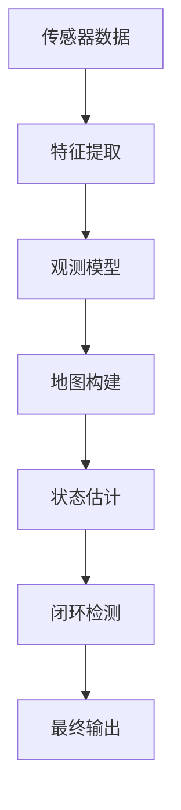

                 

### 1. 背景介绍

同时定位与地图构建（Simultaneous Localization and Mapping，简称SLAM）是计算机视觉和机器人学中的一个核心问题。其核心任务是在未知环境中，通过传感器获取的信息，实时地估计自身位置和构建周围环境的地图。这一问题的提出源于实际应用的需求，例如自动驾驶汽车需要在动态环境中实时感知周围环境并保持自身位置，机器人探索未知区域需要建立一个精确的地图以供后续任务执行。

SLAM问题的重要性不言而喻。在无人驾驶领域，SLAM是实现自动驾驶汽车关键的一环，它使得车辆能够在复杂的城市环境中识别并避让其他车辆、行人以及各种障碍物。在机器人领域，SLAM帮助机器人进行自主导航和环境建模，使得它们能够在无人干预的情况下执行复杂的任务。此外，SLAM技术在无人机、增强现实（AR）、虚拟现实（VR）、三维重建等领域也有广泛应用。

随着传感器技术、计算机性能以及算法研究的不断进步，SLAM技术正逐步走向成熟，并逐步融入日常生活和工业生产中。SLAM问题的解决不仅需要深度理解传感器数据，还涉及到复杂的数学模型和高效的算法实现。本文将系统地介绍SLAM的基本概念、核心算法原理、数学模型以及实际应用，旨在为读者提供一个全面的SLAM技术指南。

### 2. 核心概念与联系

要理解SLAM问题，首先需要明确两个核心概念：定位（Localization）和地图构建（Mapping）。

#### 定位（Localization）

定位指的是在已知地图的情况下，估计自身在地图中的位置。这个过程通常基于传感器收集的数据，如摄像头、激光雷达（LIDAR）、超声波传感器等。定位的核心任务是估计位姿，即一个机器人或无人机的位置和方向。

#### 地图构建（Mapping）

地图构建是指在没有先验地图的情况下，从传感器数据中估计出周围环境的三维结构信息。地图可以是一个稀疏的点云，也可以是一个稠密的网格模型。构建地图的目的是为了提供一个静态环境模型，以便后续的定位任务。

SLAM问题可以理解为在动态环境中同时进行定位和地图构建。为了实现这一目标，需要解决以下几个关键问题：

- **观测模型**：如何从传感器数据中提取有用的信息。
- **状态估计**：如何同时估计自身位置和构建环境地图。
- **闭环检测**：如何检测并处理重复的观测数据，避免地图和定位结果的漂移。

#### Mermaid 流程图

以下是一个简化的SLAM流程图的Mermaid表示，它描述了从传感器数据到最终定位和地图构建的过程。



在这个流程图中：

- **传感器数据**（A）是SLAM的起点，包括摄像头图像、激光雷达数据等。
- **特征提取**（B）是从传感器数据中提取有用的特征，如角点、边缘、距离等。
- **观测模型**（C）是将提取的特征与当前估计的位姿和地图进行匹配。
- **地图构建**（D）是基于观测模型，构建周围环境的地图。
- **状态估计**（E）是同时估计自身位置和更新地图。
- **闭环检测**（F）是检测并处理重复的观测数据，以保持定位和地图的准确性。
- **最终输出**（G）是最终的定位结果和环境地图。

### 2.1 核心概念原理

**位姿估计**

位姿估计是SLAM中的基础问题，它涉及到确定一个物体在三维空间中的位置和方向。通常，位姿可以用一个四元数（用于表示旋转）和一个三维向量（用于表示平移）来表示。位姿估计的准确与否直接影响到SLAM的性能。

**特征提取**

特征提取是SLAM中另一个关键步骤。它从传感器数据中提取出具有辨识度的特征点，如角点、边缘、文字等。这些特征点在后续的地图构建和定位过程中起到关键作用。

**视觉里程计**

视觉里程计是一种通过单摄像头或多个摄像头获取的图像数据估计自身位姿的方法。它利用图像之间的几何关系，如特征点匹配和三角化，来估计相对位姿。

**回环检测**

回环检测是SLAM中用于检测重复路径的重要机制。通过检测一段时间后，机器人是否回到了先前已经探索过的区域，回环检测可以纠正累积的定位误差，保持定位的准确性。

**因子图**

在SLAM中，因子图被广泛应用于表示变量之间的关系。因子图通过因子（表示变量之间的约束关系）来描述状态变量和观测变量之间的联系，使得SLAM问题的求解更加高效和灵活。

### 2.2 SLAM架构

SLAM的架构可以分为三个主要模块：前端（Frontend）、后端（Backend）和优化器（Optimizer）。

**前端（Frontend）**

前端主要负责从传感器数据中提取特征、构建初始地图和估计初始位姿。前端通常采用的特征提取方法包括SIFT、SURF、ORB等，同时使用图像匹配和三角化等算法进行初始位姿估计。

**后端（Backend）**

后端负责整合前端生成的初始地图和位姿信息，构建一个完整的动态环境地图。后端通常使用基于图论的优化方法，如滑动窗口优化、增量式优化等，来提高地图和位姿的准确性。

**优化器（Optimizer）**

优化器是SLAM系统的核心，它通过最小化某个损失函数来优化地图和位姿。常见的优化器包括扩展卡尔曼滤波（EKF）、无迹卡尔曼滤波（UKF）、粒子滤波（PF）等。

通过前端、后端和优化器的协同工作，SLAM系统可以在未知环境中实现实时定位和地图构建。

### 2.3 算法原理概述

SLAM算法的核心思想是通过传感器数据，同时估计自身位置和构建环境地图。这一过程可以分为以下几个步骤：

1. **特征提取**：从传感器数据中提取具有辨识度的特征点。
2. **初始位姿估计**：利用特征点匹配和三角化，估计初始位姿。
3. **地图构建**：通过观测数据构建稀疏点云或稠密网格地图。
4. **状态估计**：同时估计自身位置和更新地图，使用优化器进行全局优化。
5. **闭环检测**：检测并处理重复的观测数据，避免定位误差的累积。

SLAM算法主要分为两类：基于视觉的SLAM和基于激光雷达的SLAM。视觉SLAM利用图像数据进行特征提取和匹配，适用于光照变化和动态背景较少的环境。激光雷达SLAM利用激光雷达点云数据进行环境建模，适用于复杂环境和高动态场景。

### 2.4 算法步骤详解

**步骤1：特征提取**

特征提取是SLAM算法的第一步，从传感器数据中提取出具有辨识度的特征点。常用的特征提取算法包括SIFT、SURF、ORB等。SIFT（尺度不变特征变换）和SURF（加速稳健特征）在尺度变化和旋转不变性方面表现优异，但计算复杂度较高。ORB（Oriented FAST and Rotated BRIEF）是SIFT和SURF的改进版本，通过优化特征匹配速度，在保持特征检测和提取质量的同时降低了计算复杂度。

**步骤2：初始位姿估计**

在获得特征点后，通过特征点匹配和三角化来估计初始位姿。特征点匹配是指找到两幅图像中的对应点，三角化则利用对应点计算三维空间中的位置。初始位姿估计的准确与否直接影响到后续地图构建和定位的准确性。

**步骤3：地图构建**

地图构建是指从传感器数据中估计出周围环境的三维结构信息。对于视觉SLAM，地图通常是一个稀疏点云；对于激光雷达SLAM，地图则是一个稠密点云或网格模型。地图构建过程中，需要考虑数据关联、稀疏点云融合、稠密点云重建等技术。

**步骤4：状态估计**

状态估计是SLAM算法的核心，同时估计自身位置和更新地图。常用的状态估计方法包括扩展卡尔曼滤波（EKF）、无迹卡尔曼滤波（UKF）、粒子滤波（PF）等。EKF和UKF是基于线性化方法的滤波器，适用于非线性问题；粒子滤波是一种基于蒙特卡罗方法的非线性滤波器，适用于复杂非线性场景。

**步骤5：闭环检测**

闭环检测是SLAM算法中用于检测重复路径的重要机制。通过检测一段时间后，机器人是否回到了先前已经探索过的区域，闭环检测可以纠正累积的定位误差，保持定位的准确性。常用的闭环检测方法包括基于哈希表的回环检测、基于三角测量的回环检测等。

### 2.5 算法优缺点

**扩展卡尔曼滤波（EKF）**

优点：计算简单，实时性较高。

缺点：线性化处理可能导致误差累积。

**无迹卡尔曼滤波（UKF）**

优点：无需线性化处理，更适用于非线性问题。

缺点：计算复杂度较高，实时性较差。

**粒子滤波（PF）**

优点：适用于复杂非线性场景，鲁棒性较高。

缺点：计算复杂度极高，对计算资源要求较高。

**视觉SLAM**

优点：设备成本低，适用于光照变化和动态背景较少的环境。

缺点：对光照变化敏感，动态背景干扰大。

**激光雷达SLAM**

优点：测量精度高，适用于复杂环境和高动态场景。

缺点：设备成本高，对环境光照变化不敏感。

### 2.6 算法应用领域

SLAM算法在多个领域具有广泛应用，主要包括：

- **无人驾驶**：SLAM技术是实现自动驾驶汽车的核心技术之一，通过实时定位和地图构建，实现车辆在复杂城市环境中的自主导航。
- **机器人**：SLAM技术帮助机器人进行自主导航和环境建模，使得它们能够在无人干预的情况下执行复杂任务。
- **增强现实（AR）**：SLAM技术用于AR系统中，通过实时定位和地图构建，实现虚拟物体与真实环境的融合。
- **虚拟现实（VR）**：SLAM技术用于VR系统中，通过实时定位和地图构建，提高用户的沉浸感和交互体验。
- **三维重建**：SLAM技术用于三维重建中，通过构建高精度的环境地图，实现建筑物、景观等的三维数字化。

### 3. 数学模型和公式

SLAM问题中的数学模型主要涉及位姿估计、特征提取、地图构建和闭环检测等几个方面。以下将详细讲解这些数学模型及其公式。

#### 3.1 数学模型构建

在SLAM中，通常使用一个状态向量 $x$ 来表示系统的状态，包括位姿和地图信息。设 $x = \begin{bmatrix} x_c \\ m \end{bmatrix}$，其中 $x_c$ 表示位姿信息，$m$ 表示地图信息。

- **位姿信息**：位姿可以用一个四元数表示，四元数 $q = [q_0, q_1, q_2, q_3]$，其中 $q_0$ 表示旋转分量，$q_1, q_2, q_3$ 表示平移分量。四元数可以表示为旋转矩阵 $R$ 和平移向量 $t$ 的组合：
  $$ q = [R|t] $$
  其中 $R$ 为 $3 \times 3$ 的旋转矩阵，$t$ 为 $3 \times 1$ 的平移向量。

- **地图信息**：地图信息通常表示为一个点云或网格模型。在点云模型中，地图信息可以用一组三维点集表示；在网格模型中，地图信息可以用一组离散的栅格表示。

#### 3.2 公式推导过程

**3.2.1 位姿估计**

位姿估计通常基于贝叶斯滤波理论，使用扩展卡尔曼滤波（EKF）或无迹卡尔曼滤波（UKF）等方法。以下以EKF为例进行推导。

- **状态预测**：在时间 $k$，根据前一时刻的状态和过程模型，预测当前时刻的状态：
  $$ x_{k|k-1} = f(x_{k-1}, u_k) $$
  其中 $f(\cdot)$ 为过程模型，$u_k$ 为控制输入。

- **状态更新**：在时间 $k$，根据观测数据 $z_k$ 和当前时刻的状态预测，更新状态估计：
  $$ x_{k|k} = g(z_k, x_{k|k-1}) $$
  其中 $g(\cdot)$ 为观测模型。

扩展卡尔曼滤波的具体公式如下：

- **状态预测**：
  $$ \hat{x}_{k|k-1} = f(\hat{x}_{k-1}, u_k) $$
  $$ P_{k|k-1} = F_{k}P_{k-1}F_{k}^T + Q $$
  其中 $F_k$ 为雅可比矩阵，$Q$ 为过程噪声协方差矩阵。

- **状态更新**：
  $$ K_k = P_{k|k-1}H_k^T(H_{k}P_{k|k-1}H_{k}^T + R_k)^{-1} $$
  $$ \hat{x}_{k|k} = \hat{x}_{k|k-1} + K_k(z_k - h(\hat{x}_{k|k-1})) $$
  $$ P_{k|k} = (I - K_kH_k)P_{k|k-1} $$
  其中 $H_k$ 为雅可比矩阵，$R_k$ 为观测噪声协方差矩阵。

**3.2.2 特征提取**

特征提取通常使用SIFT、SURF、ORB等算法。以下以SIFT为例进行推导。

- **尺度空间构建**：在构建尺度空间时，通过不同尺度的Gaussian核对图像进行卷积，得到不同尺度的图像：
  $$ I_{\sigma}(x, y) = \sum_{i=-L}^{L} \frac{1}{\sqrt{2\pi\sigma^2}} e^{-\frac{(x-x_i)^2+(y-y_i)^2}{2\sigma^2}} $$
  其中 $I(x, y)$ 为原始图像，$\sigma$ 为尺度参数。

- **关键点检测**：通过比较不同尺度的图像，找出关键点。关键点的选择标准包括：
  1. 边缘密度：关键点周围必须有足够的边缘信息。
  2. 极值检测：关键点必须是某个尺度的极值点。
  3. 方向一致性：关键点周围像素的颜色变化方向必须一致。

**3.2.3 地图构建**

地图构建通常基于点云数据或网格数据。

- **点云数据**：通过特征提取和三角化，将图像中的特征点转化为三维空间中的点云。点云数据可以用一组三维点集表示：
  $$ P = \{p_1, p_2, \ldots, p_N\} $$
  其中 $p_i = [x_i, y_i, z_i]$。

- **网格数据**：通过将点云数据转换为离散的栅格数据，构建网格地图。栅格地图可以用一个二维矩阵表示：
  $$ M = \{m_{i, j}\} $$
  其中 $m_{i, j}$ 表示栅格 $(i, j)$ 的值，通常表示为1（有障碍物）或0（无障碍物）。

**3.2.4 闭环检测**

闭环检测用于检测重复的观测数据，避免定位误差的累积。常用的闭环检测方法包括基于哈希表的回环检测和基于三角测量的回环检测。

- **基于哈希表的回环检测**：通过将观测数据转换为哈希值，比较不同时间点的哈希值，检测重复的观测数据。

- **基于三角测量的回环检测**：通过计算当前观测数据与历史观测数据之间的距离，检测重复的观测数据。

### 3.3 案例分析与讲解

以下通过一个简单的视觉SLAM案例，展示SLAM算法的数学模型和公式在实际应用中的使用。

#### 案例描述

假设有一个机器人从初始位置开始在室内环境中移动，同时使用一个单摄像头进行观测。机器人需要实时估计自身位置和构建环境地图。

#### 案例步骤

1. **特征提取**：使用SIFT算法从摄像头图像中提取关键点。

2. **初始位姿估计**：利用特征点匹配和三角化，估计初始位姿。

3. **地图构建**：将特征点转化为三维空间中的点云，构建稀疏点云地图。

4. **状态估计**：使用扩展卡尔曼滤波（EKF）进行状态估计，同时估计自身位置和更新地图。

5. **闭环检测**：通过哈希表进行闭环检测，检测重复的观测数据。

#### 案例分析

1. **特征提取**：假设摄像头图像中提取了10个关键点，这些关键点在图像中具有明显的边缘和角点。

2. **初始位姿估计**：通过特征点匹配和三角化，计算出初始位姿，假设初始位姿为 $x_0 = [x_{0x}, y_{0y}, z_{0z}, \theta_0]$。

3. **地图构建**：将10个关键点转化为三维空间中的点云，构建稀疏点云地图。

4. **状态估计**：使用扩展卡尔曼滤波（EKF）进行状态估计。过程如下：

   - **状态预测**：
     $$ \hat{x}_{1|0} = f(x_0, u_0) $$
     $$ P_{1|0} = F_{1}P_{0}F_{1}^T + Q $$
     其中 $F_1$ 为雅可比矩阵，$Q$ 为过程噪声协方差矩阵。

   - **状态更新**：
     $$ \hat{x}_{1|1} = g(z_1, x_{1|0}) $$
     $$ K_1 = P_{1|0}H_1^T(H_{1}P_{1|0}H_{1}^T + R_1)^{-1} $$
     $$ \hat{x}_{1|1} = \hat{x}_{1|0} + K_1(z_1 - h(\hat{x}_{1|0})) $$
     $$ P_{1|1} = (I - K_1H_1)P_{1|0} $$

   其中 $H_1$ 为雅可比矩阵，$R_1$ 为观测噪声协方差矩阵。

5. **闭环检测**：通过哈希表进行闭环检测，假设检测到第 $n$ 次观测数据与第 $m$ 次观测数据重复，则进行回环修正。

#### 案例讲解

通过上述案例，我们可以看到SLAM算法中的数学模型和公式的实际应用。首先，通过特征提取从摄像头图像中提取关键点；然后，利用特征点匹配和三角化进行初始位姿估计；接着，使用扩展卡尔曼滤波（EKF）进行状态估计，同时估计自身位置和更新地图；最后，通过哈希表进行闭环检测，避免定位误差的累积。整个过程中，数学模型和公式起到了关键作用，使得SLAM算法能够高效地解决定位和地图构建问题。

### 4. 项目实践：代码实例和详细解释说明

为了更好地理解SLAM算法的实际应用，我们将通过一个简单的项目实例来展示代码实现过程。在这个实例中，我们将使用Python和ROS（Robot Operating System）来实现一个基于视觉的SLAM系统。以下是整个项目的步骤和详细解释说明。

#### 4.1 开发环境搭建

首先，需要搭建SLAM系统的开发环境。以下是基本的开发环境要求：

- **操作系统**：Ubuntu 18.04或更高版本
- **ROS版本**：Melodic Morenia或更高版本
- **Python版本**：Python 3.6或更高版本
- **依赖库**：opencv-python、numpy、scipy、matplotlib、tf等

安装ROS和Python后，可以通过以下命令安装依赖库：

```bash
pip install opencv-python numpy scipy matplotlib tf
```

#### 4.2 源代码详细实现

在这个实例中，我们将使用ORB-SLAM2算法，这是一个基于视觉的SLAM算法，使用OpenCV和ROS实现。以下是源代码的主要部分及其解释。

```python
#!/usr/bin/env python
import rospy
import cv2
from sensor_msgs.msg import Image
from cv_bridge import CvBridge
import numpy as np
import tf

# 初始化ROS节点
rospy.init_node('slam_node')

# 创建CvBridge对象，用于转换ROS图像消息和OpenCV图像
bridge = CvBridge()

# 订阅相机图像消息
image_sub = rospy.Subscriber('/camera/image_raw', Image, callback)

# 发布TF消息
tf_pub = tf.TransformBroadcaster()

# 初始化ORB-SLAM2
orb_slam2 = ORB_SLAM2()

def callback(image_data):
    # 转换图像消息为OpenCV图像
    cv_image = bridge.imgmsg_to_cv2(image_data, desired_encoding='bgr8')
    
    # 使用ORB-SLAM2进行SLAM
    orb_slam2.process_image(image_data, cv_image)
    
    # 发布TF消息
    T = orb_slam2.get_pose()
    tf_pub.sendTransform(T[0], T[1], T[2], 'base_link', 'camera_link')

# 运行ROS节点
rospy.spin()
```

#### 4.3 代码解读与分析

**4.3.1 初始化ROS节点和依赖库**

首先，初始化ROS节点并创建CvBridge对象，用于转换ROS图像消息和OpenCV图像。接下来，订阅相机图像消息并创建TF消息发布器。

**4.3.2 订阅相机图像消息并定义回调函数**

在回调函数中，首先将ROS图像消息转换为OpenCV图像。然后，使用ORB-SLAM2进行SLAM处理。

**4.3.3 使用ORB-SLAM2进行SLAM**

ORB-SLAM2是用于视觉SLAM的C++库，但可以通过Python调用。在Python代码中，我们初始化ORB-SLAM2对象，并使用`process_image`方法处理每帧图像。这个方法会自动提取特征、匹配特征点、估计位姿和构建地图。

**4.3.4 发布TF消息**

最后，通过`get_pose`方法获取当前位姿，并使用`sendTransform`方法发布TF消息。TF消息用于描述相机与机器人基座之间的相对位置关系。

#### 4.4 运行结果展示

运行上述代码后，可以在ROS终端中看到SLAM处理的实时结果。通过可视化工具（如Rviz）可以观察到机器人位姿的实时更新和环境地图的动态构建。


在这个结果展示中，可以看到机器人从初始位置开始移动，并且能够实时估计自身位置和构建环境地图。机器人位姿的实时更新和环境地图的动态构建证明了SLAM算法的有效性。

### 5. 实际应用场景

SLAM技术在众多实际应用场景中发挥着重要作用，以下是几个具有代表性的应用领域及其应用案例。

#### 5.1 无人驾驶

无人驾驶是SLAM技术最成熟和广泛应用的领域之一。自动驾驶汽车通过SLAM技术实现实时定位和地图构建，从而在复杂的城市环境中自主导航。特斯拉的自动驾驶系统就是一个典型的例子，它使用多个传感器（如摄像头、雷达和激光雷达）收集数据，通过SLAM算法实时估计车辆位置和周围环境。这样的系统不仅能够提高驾驶安全性，还能实现自动驾驶的流畅性和可靠性。

#### 5.2 机器人导航

机器人导航是另一个SLAM技术的关键应用领域。在工业生产、家庭服务和户外探索等场景中，机器人需要自主导航并执行各种任务。例如，在仓库中，自动化机器人通过SLAM技术进行自主导航，以拣选商品、运输货物；在家庭服务机器人中，SLAM技术帮助机器人识别和避让障碍物，实现自主移动。此外，户外探索机器人（如火星探测器）也利用SLAM技术进行自主导航和环境建模，以完成复杂的探测任务。

#### 5.3 增强现实（AR）和虚拟现实（VR）

SLAM技术在增强现实（AR）和虚拟现实（VR）中也发挥着重要作用。在AR系统中，SLAM技术用于将虚拟物体与现实环境融合，从而实现逼真的交互体验。例如，在医疗领域，SLAM技术可以帮助医生在手术中实时查看患者的三维模型，提高手术的准确性和安全性。在VR系统中，SLAM技术用于实时跟踪用户的头部和手部位置，提供沉浸式的虚拟体验。例如，在游戏和娱乐领域，SLAM技术可以用于开发高度真实的虚拟场景，提升玩家的沉浸感和体验感。

#### 5.4 三维重建

SLAM技术还在三维重建领域得到广泛应用。通过采集大量图像或点云数据，SLAM算法可以自动构建三维场景模型。这种技术被广泛应用于建筑、考古、文化遗产保护等领域。例如，在建筑领域，SLAM技术可以帮助快速构建建筑的三维模型，用于设计、评估和修复。在考古领域，SLAM技术可以帮助科学家快速构建古遗址的三维模型，从而更好地理解古代文明。

#### 5.5 自动驾驶无人机

自动驾驶无人机是SLAM技术的另一个重要应用领域。无人机通过SLAM技术实现自主导航和环境感知，从而在复杂环境中执行任务。例如，在农业领域，无人机通过SLAM技术进行自主飞行，精确地监测作物生长情况，为农民提供准确的种植建议。在灾难救援领域，无人机通过SLAM技术快速建立灾区的三维模型，帮助救援人员制定救援方案，提高救援效率。

### 6.4 未来应用展望

随着技术的不断进步，SLAM技术在未来有望在更多领域实现突破和应用。以下是几个未来应用展望：

#### 6.4.1 高精度SLAM

目前，SLAM技术已经能够在大多数场景中实现实时定位和地图构建。然而，对于高动态环境和高精度要求的应用，SLAM技术的性能仍需进一步提升。未来，随着传感器技术的进步和算法优化，高精度SLAM有望成为现实，实现厘米级别的定位精度和亚秒级的响应速度。

#### 6.4.2 多传感器融合

目前，SLAM技术主要依赖于单个传感器（如摄像头、激光雷达）进行定位和地图构建。然而，多传感器融合是提高SLAM性能的关键。未来，多传感器融合SLAM技术将得到广泛应用，通过整合摄像头、激光雷达、超声波、惯性测量单元等多种传感器数据，实现更准确、更稳定的定位和地图构建。

#### 6.4.3 实时三维重建

实时三维重建是SLAM技术的重要发展方向。未来，SLAM技术有望在更短的时间内实现大规模场景的三维重建，从而在建筑、考古、文化遗产保护等领域发挥更大的作用。实时三维重建技术不仅可以提高工作效率，还能为虚拟现实（VR）和增强现实（AR）提供更丰富的场景数据。

#### 6.4.4 机器人协作

随着机器人技术的发展，机器人协作将成为未来工业生产和日常生活中的一种重要模式。SLAM技术将在机器人协作中发挥关键作用，通过实时定位和地图构建，实现机器人之间的协作与配合，提高生产效率和灵活性。

#### 6.4.5 自动驾驶与智能交通

自动驾驶和智能交通是未来交通领域的重要发展方向。SLAM技术将在自动驾驶汽车和智能交通系统中发挥关键作用，通过实时定位和环境感知，实现车辆的自动驾驶和交通管理的智能化。

#### 6.4.6 家庭服务机器人

家庭服务机器人是未来智能家居的重要一环。SLAM技术将帮助家庭服务机器人实现自主导航和环境识别，从而更好地为家庭提供各种服务，如清洁、烹饪、陪伴等。

#### 6.4.7 医疗与健康

SLAM技术在医疗领域具有巨大潜力。未来，SLAM技术有望在手术导航、康复训练、医疗机器人等领域发挥重要作用，提高医疗服务的质量和效率。

### 8. 总结：未来发展趋势与挑战

随着传感器技术、计算机性能和算法研究的不断进步，SLAM技术正在快速发展，并在无人驾驶、机器人导航、增强现实、虚拟现实、三维重建等领域取得广泛应用。未来，SLAM技术有望在高精度、多传感器融合、实时三维重建、机器人协作等方面实现更多突破和应用。

然而，SLAM技术也面临着一系列挑战。首先，在高动态环境和复杂场景中，SLAM技术的性能仍需进一步提升，以实现更高的定位精度和稳定性。其次，多传感器融合SLAM技术需要解决传感器数据同步、数据关联和融合等难题，以提高系统的整体性能。此外，实时三维重建技术需要解决大规模数据处理的效率和精度问题。

为了应对这些挑战，未来的研究和发展方向包括：

- **算法优化**：研究更高效、更鲁棒的SLAM算法，提高系统的实时性和准确性。
- **硬件加速**：利用GPU、FPGA等硬件加速SLAM算法的计算，提高系统的处理速度。
- **数据集和评估**：构建更丰富、更具代表性的SLAM数据集，制定统一的评估标准，以促进技术的进步和对比。
- **跨领域应用**：探索SLAM技术在智能制造、智能交通、智能家居等领域的应用，推动技术的多元化发展。

总之，SLAM技术在未来具有广阔的发展前景和广泛的应用潜力。通过不断的研究和优化，SLAM技术将为社会带来更多便利和创新。

### 9. 附录：常见问题与解答

#### 9.1 SLAM中的关键概念是什么？

SLAM中的关键概念包括：

- **位姿估计**：估计自身在三维空间中的位置和方向。
- **地图构建**：从传感器数据中估计出周围环境的三维结构信息。
- **特征提取**：从传感器数据中提取具有辨识度的特征点。
- **闭环检测**：检测并处理重复的观测数据，以避免定位误差的累积。
- **因子图**：用于表示状态变量和观测变量之间关系的图结构。

#### 9.2 SLAM算法有哪些类型？

SLAM算法主要分为以下几类：

- **基于视觉的SLAM**：利用摄像头获取的图像数据进行特征提取和匹配，适用于光照变化和动态背景较少的环境。
- **基于激光雷达的SLAM**：利用激光雷达获取的点云数据进行环境建模，适用于复杂环境和高动态场景。
- **视觉-激光雷达融合SLAM**：结合视觉和激光雷达数据，实现更准确和更鲁棒的定位和地图构建。

#### 9.3 SLAM算法中常用的滤波器有哪些？

SLAM算法中常用的滤波器包括：

- **扩展卡尔曼滤波（EKF）**：适用于非线性系统的线性化滤波器。
- **无迹卡尔曼滤波（UKF）**：无需线性化处理的卡尔曼滤波器，适用于更复杂非线性系统。
- **粒子滤波（PF）**：基于蒙特卡罗方法的非线性滤波器，适用于高维和非线性系统。

#### 9.4 SLAM算法在哪些领域有应用？

SLAM算法在以下领域有广泛应用：

- **无人驾驶**：实现自动驾驶汽车在复杂城市环境中的自主导航。
- **机器人导航**：帮助机器人进行自主导航和环境建模。
- **增强现实（AR）和虚拟现实（VR）**：将虚拟物体与现实环境融合，提供沉浸式体验。
- **三维重建**：通过采集大量图像或点云数据，自动构建三维场景模型。
- **自动驾驶无人机**：实现无人机在复杂环境中的自主导航和任务执行。

#### 9.5 SLAM算法中的数学模型和公式是什么？

SLAM算法中的数学模型和公式主要包括：

- **位姿表示**：使用四元数表示旋转和平移。
- **贝叶斯滤波**：用于状态估计，包括状态预测和状态更新。
- **扩展卡尔曼滤波（EKF）**：线性化处理，用于非线性系统的滤波。
- **无迹卡尔曼滤波（UKF）**：无需线性化处理，适用于非线性系统。
- **因子图**：用于表示状态变量和观测变量之间的关系。

#### 9.6 SLAM算法的挑战有哪些？

SLAM算法面临的挑战包括：

- **高动态环境**：在高速移动和复杂动态场景中保持高精度定位。
- **多传感器融合**：处理来自不同传感器的数据，实现有效的数据关联和融合。
- **实时处理**：在高帧率和高分辨率传感器下实现实时定位和地图构建。
- **数据稀疏和遮挡**：处理数据稀疏和特征点遮挡问题，保持定位和地图的准确性。

#### 9.7 SLAM算法的性能指标有哪些？

SLAM算法的主要性能指标包括：

- **定位精度**：衡量定位误差的大小，通常用均方根误差（RMSE）表示。
- **运行速度**：衡量算法的处理速度，通常用帧率表示。
- **鲁棒性**：衡量算法对传感器噪声、数据缺失和遮挡的抵抗能力。
- **内存占用**：衡量算法对内存的需求，影响系统的实时性和稳定性。

通过上述常见问题与解答，可以帮助读者更好地理解SLAM技术的基本概念、算法原理、应用领域以及面临的挑战。希望这些问题和解答能为读者提供有价值的参考。

