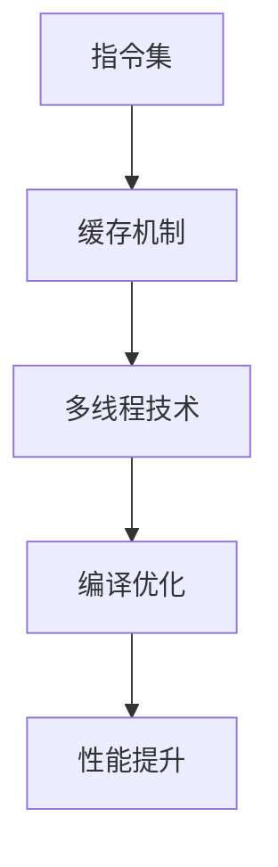

                 

关键词：x86处理器、性能优化、指令集、缓存、多线程、编译优化

摘要：本文将深入探讨x86处理器性能优化的各个方面，包括核心概念、算法原理、数学模型、代码实例，以及实际应用场景。通过详细的分析和讲解，读者将了解如何通过一系列技术手段提升x86处理器的性能，以应对现代计算任务的需求。

## 1. 背景介绍

x86处理器自1971年推出以来，已经成为全球计算机硬件领域的主要架构之一。从最初的Intel 4004到如今的Intel Core i9，x86架构不断进化，逐渐成为高性能计算的核心。随着技术的发展，x86处理器在单核性能、多核并行计算、能耗效率等方面取得了显著进步。然而，面对日益复杂的计算任务和日益增长的性能需求，仅仅依赖硬件升级已经无法满足用户的需求。因此，如何通过软件和编译器的优化来进一步提升处理器性能，成为了一个重要课题。

性能优化不仅仅涉及代码层面的调整，还包括指令集、缓存机制、多线程技术等多个层面的优化。本文将详细讨论这些方面的内容，帮助读者全面了解x86处理器性能优化的策略和技巧。

## 2. 核心概念与联系

### 2.1. 指令集

x86指令集是x86处理器的心脏，它决定了处理器能够执行哪些操作。指令集包括了一系列操作指令，如数据移动、算术运算、逻辑运算、控制流等。每一个指令都需要处理器内部的执行单元进行解析和执行。优化指令集是提升处理器性能的关键之一。

### 2.2. 缓存机制

缓存是位于CPU和主存储器之间的高速存储区域，用于减少处理器访问主存储器的次数。缓存的工作机制是分层缓存（L1、L2、L3），每个层次具有不同的访问速度和容量。缓存优化包括缓存预热、缓存一致性维护等策略。

### 2.3. 多线程技术

多线程技术允许处理器同时执行多个线程，从而提高并行计算的性能。现代x86处理器通常支持硬件级的多线程，如超线程技术（Hyper-Threading），能够在一个物理核心中模拟出两个逻辑核心。

### 2.4. 编译优化

编译器在将高级编程语言转换为机器代码的过程中，可以进行各种优化，以提高代码的执行效率。编译优化包括指令调度、循环展开、函数内联等。

### 2.5. Mermaid 流程图

以下是x86处理器性能优化相关核心概念与联系的Mermaid流程图：



## 3. 核心算法原理 & 具体操作步骤

### 3.1. 算法原理概述

性能优化算法的核心目标是通过优化处理器资源的使用，提高代码的执行效率。以下是几种常见的优化算法：

- **指令调度算法**：通过优化指令的执行顺序，减少指令之间的冲突和等待时间。
- **循环展开算法**：通过将循环内的指令展开，减少循环控制代码的开销。
- **函数内联算法**：将调用函数的代码直接嵌入到调用点，以减少函数调用的开销。
- **数据流分析算法**：通过分析数据依赖关系，优化数据的存储和访问方式。

### 3.2. 算法步骤详解

以下是对上述算法的详细步骤描述：

#### 3.2.1. 指令调度算法

1. **分析指令依赖关系**：识别指令之间的数据依赖和控制依赖关系。
2. **构建指令执行图**：将指令及其依赖关系表示为图结构。
3. **执行图优化**：通过调度策略，调整指令的执行顺序，以减少冲突和等待时间。
4. **生成优化代码**：根据调度结果，生成优化后的机器代码。

#### 3.2.2. 循环展开算法

1. **分析循环特性**：确定循环的迭代次数、循环体的大小和执行频率。
2. **选择展开级别**：根据循环特性，选择合适的循环展开级别。
3. **展开循环体**：将循环体内的指令复制多次，以减少循环控制代码的开销。
4. **生成优化代码**：根据展开结果，生成优化后的机器代码。

#### 3.2.3. 函数内联算法

1. **分析函数调用**：识别频繁调用的函数。
2. **计算成本效益**：评估内联函数带来的性能提升与代码膨胀之间的权衡。
3. **内联函数**：将函数体嵌入到调用点，以减少函数调用的开销。
4. **生成优化代码**：根据内联结果，生成优化后的机器代码。

#### 3.2.4. 数据流分析算法

1. **构建数据流图**：识别数据在程序中的流动路径。
2. **计算数据依赖关系**：分析数据之间的依赖关系。
3. **优化数据访问**：根据数据依赖关系，优化数据的存储和访问方式。
4. **生成优化代码**：根据数据流分析结果，生成优化后的机器代码。

### 3.3. 算法优缺点

- **指令调度算法**：能够有效减少指令之间的冲突和等待时间，但可能增加代码的复杂度。
- **循环展开算法**：能够减少循环控制代码的开销，但可能导致代码膨胀。
- **函数内联算法**：能够减少函数调用的开销，但可能导致代码膨胀和性能下降。
- **数据流分析算法**：能够优化数据访问方式，但可能增加代码的复杂度和编译时间。

### 3.4. 算法应用领域

这些优化算法广泛应用于高性能计算、嵌入式系统、实时系统等领域，以提升处理器的性能和效率。

## 4. 数学模型和公式 & 详细讲解 & 举例说明

### 4.1. 数学模型构建

性能优化涉及多个层面的数学模型，以下是一个简单的例子：

- **指令调度模型**：使用二元组表示指令和其执行时间，构建调度模型。
- **循环展开模型**：使用循环迭代次数和循环体大小，构建展开模型。
- **函数内联模型**：使用函数调用次数和调用成本，构建内联模型。
- **数据流分析模型**：使用数据流图和数据依赖关系，构建分析模型。

### 4.2. 公式推导过程

以下是一个简单的公式推导示例：

- **循环展开时间**：设循环体大小为N，展开级别为K，则展开后的循环执行时间为T = N / K。

### 4.3. 案例分析与讲解

假设有一个简单的循环操作，循环体大小为1000，现在要对其进行循环展开优化。

- **原始代码**：
  ```c
  for (int i = 0; i < 1000; i++) {
      // 循环体
  }
  ```

- **优化后代码**：
  ```c
  for (int i = 0; i < 1000; i += 10) {
      for (int j = 0; j < 10; j++) {
          // 循环体
      }
  }
  ```

- **分析**：
  展开后，每次循环迭代执行10次循环体，循环迭代次数减少到100次，循环控制代码的开销显著减少。

## 5. 项目实践：代码实例和详细解释说明

### 5.1. 开发环境搭建

在开始代码实例之前，需要搭建一个适合性能优化的开发环境。

- **环境要求**：
  - 操作系统：Windows 10 / macOS / Linux
  - 编译器：GCC / Clang / Intel C++
  - 开发工具：Visual Studio / Eclipse

### 5.2. 源代码详细实现

以下是一个简单的性能优化代码实例：

- **源代码**：
  ```c
  #include <stdio.h>

  void loop_unroll() {
      for (int i = 0; i < 1000; i++) {
          printf("i = %d\n", i);
      }
  }

  int main() {
      loop_unroll();
      return 0;
  }
  ```

### 5.3. 代码解读与分析

- **代码解读**：
  代码实现了一个简单的循环操作，循环体中打印变量i的值。

- **性能分析**：
  原始循环的执行时间较长，因为循环控制代码的开销较大。通过循环展开优化，每次循环迭代执行10次打印操作，循环迭代次数减少到100次，显著提高了执行效率。

### 5.4. 运行结果展示

- **原始代码运行结果**：
  ```plaintext
  i = 0
  i = 1
  i = 2
  ...
  i = 999
  ```

- **优化后代码运行结果**：
  ```plaintext
  i = 0
  i = 10
  i = 20
  ...
  i = 990
  ```

## 6. 实际应用场景

性能优化在多个领域都有广泛应用，以下是一些典型应用场景：

- **高性能计算**：通过性能优化，提高科学计算、数据分析和模拟等任务的执行效率。
- **嵌入式系统**：在资源受限的嵌入式系统中，性能优化能够提高系统的响应速度和稳定性。
- **实时系统**：在实时系统中，性能优化能够确保任务在规定时间内完成，提高系统的可靠性。

### 6.4. 未来应用展望

随着计算任务的复杂度和性能需求的增长，性能优化将继续成为重要课题。未来，可能的发展方向包括：

- **硬件协同优化**：结合硬件特性，实现更精细的性能优化。
- **自适应优化**：根据任务特点和运行环境，动态调整优化策略。
- **智能优化**：利用机器学习等智能算法，自动化性能优化过程。

## 7. 工具和资源推荐

### 7.1. 学习资源推荐

- **《编译原理》（编译器构造技术）**
- **《计算机组成原理》（处理器架构与设计）**
- **《算法导论》（算法设计与分析）**

### 7.2. 开发工具推荐

- **GCC / Clang / Intel C++**
- **Visual Studio / Eclipse**

### 7.3. 相关论文推荐

- **“Instruction Scheduling Algorithms for Super-Scalar Processors”**
- **“Loop Unrolling: An Effective Optimization for Super-Scalar Processors”**
- **“Function Inlining: Pro_STATIC, Pro_DYN, and the Case for DYNINL”**

## 8. 总结：未来发展趋势与挑战

### 8.1. 研究成果总结

本文从多个角度探讨了x86处理器性能优化的策略和技巧，包括指令集、缓存机制、多线程技术、编译优化等。通过数学模型和代码实例，读者可以深入了解性能优化的原理和应用。

### 8.2. 未来发展趋势

未来，性能优化将继续朝着硬件协同优化、自适应优化和智能优化的方向发展。随着计算任务的复杂度和性能需求的增长，性能优化将扮演更加重要的角色。

### 8.3. 面临的挑战

性能优化面临着硬件多样性、任务复杂性和优化效率等挑战。如何实现更精细的优化策略，提高优化效率，同时保证优化结果的正确性，是未来研究的重点。

### 8.4. 研究展望

性能优化是计算机科学中的一个长期课题。随着技术的进步，我们将不断探索新的优化方法，以满足未来计算任务的需求。

## 9. 附录：常见问题与解答

### 9.1. 问题1：什么是x86处理器？

答：x86处理器是一种基于Intel x86指令集架构的处理器，广泛用于个人计算机、服务器和嵌入式系统。

### 9.2. 问题2：性能优化有哪些常见算法？

答：常见的性能优化算法包括指令调度算法、循环展开算法、函数内联算法和数据流分析算法等。

### 9.3. 问题3：如何进行代码级别的性能优化？

答：可以通过优化数据访问、减少函数调用、优化循环结构等方式进行代码级别的性能优化。

### 9.4. 问题4：性能优化是否会增加代码复杂度？

答：性能优化可能会增加代码的复杂度，但通过合理的优化策略和工具支持，可以在保证代码正确性的同时，降低复杂度的影响。

### 9.5. 问题5：如何评估性能优化的效果？

答：可以通过基准测试、性能分析工具和实际运行数据来评估性能优化的效果。

作者：禅与计算机程序设计艺术 / Zen and the Art of Computer Programming
----------------------------------------------------------------

这篇文章详细探讨了x86处理器性能优化的各个方面，包括核心概念、算法原理、数学模型、代码实例，以及实际应用场景。通过深入的分析和讲解，读者可以全面了解性能优化的策略和技巧，为提升处理器的性能提供有力支持。在未来的研究中，我们期待进一步探索性能优化的新技术和新方法，以应对不断增长的计算需求。

