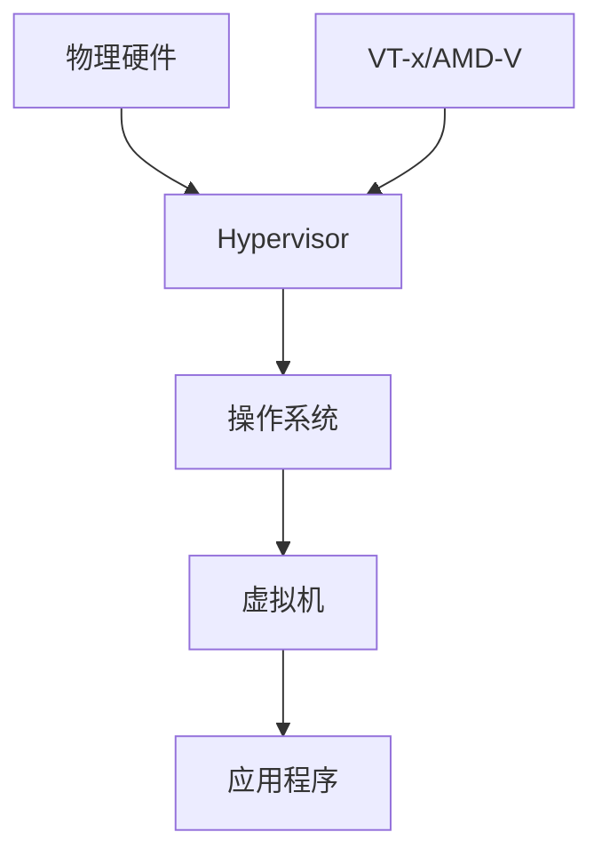

                 

关键词：x86虚拟化，VT-x，AMD-V，虚拟化技术，处理器架构，性能优化，安全隔离，操作系统，云计算

> 摘要：本文深入探讨了x86虚拟化技术的两个核心实现：Intel的VT-x和AMD的AMD-V。通过对这两种技术的背景介绍、核心原理解析、算法步骤详述、数学模型解析以及实际应用场景的分析，为读者提供了一个全面了解x86虚拟化技术的视角。文章旨在为计算机领域专业人士提供有价值的参考，帮助他们在虚拟化技术应用中取得更好的效果。

## 1. 背景介绍

虚拟化技术是一种重要的计算机虚拟化方法，它通过软件层的抽象，将物理硬件资源虚拟化为多个独立的虚拟资源，从而实现硬件资源的共享和隔离。随着云计算和虚拟化技术的发展，虚拟化技术已经成为现代计算机系统中的关键组成部分。x86虚拟化技术作为其中的一种重要实现，已经成为服务器、桌面和移动设备等领域的主流技术。

x86虚拟化技术的两大核心实现分别是Intel的VT-x和AMD的AMD-V。这两种技术分别由Intel和AMD公司推出，旨在提高处理器的虚拟化性能和兼容性。然而，它们的实现原理、功能特性以及应用场景有所不同，本文将深入探讨这两大技术。

## 2. 核心概念与联系

### 2.1 虚拟化技术的核心概念

虚拟化技术包括以下几个核心概念：

1. **虚拟机监控器（Hypervisor）**：一种运行在物理硬件和操作系统之间的软件层，负责管理虚拟机的创建、运行和资源分配。根据是否直接运行在硬件上，分为Type 1（裸机型）和Type 2（宿主型）。

2. **虚拟化层（Virtualization Layer）**：在操作系统和硬件之间添加的一层软件，用于实现硬件资源的虚拟化。虚拟化层可以提供对CPU、内存、存储和网络等硬件资源的抽象和隔离。

3. **虚拟机（Virtual Machine，VM）**：一个逻辑上的计算机系统，拥有独立的操作系统、应用程序和硬件资源。虚拟机可以在不同的硬件平台上运行，从而实现硬件资源的共享和灵活性。

4. **虚拟化扩展（Virtualization Extensions）**：为了提高虚拟化性能，处理器厂商在硬件层面提供的扩展支持，如Intel的VT-x和AMD的AMD-V。

### 2.2 VT-x和AMD-V的核心原理与架构

**VT-x** 是Intel公司推出的虚拟化扩展技术，全称为Virtualization Technology for Intel Platforms。它通过在硬件层面提供虚拟化支持，实现了对操作系统和应用软件的无感知虚拟化。VT-x的核心架构包括以下几个部分：

1. **VMX模式**：VT-x引入了一种新的处理器模式，称为VMX模式，用于实现虚拟化操作。在VMX模式下，处理器可以识别和管理虚拟机。

2. **VMCS（Virtual Machine Control Structure）**：VMCS是VT-x的核心数据结构，用于存储虚拟机的状态信息，如寄存器、内存页表和中断信息等。VMCS使得虚拟机监控器可以高效地管理和切换虚拟机。

3. **EPT（Extended Page Table）**：EPT是VT-x提供的内存虚拟化功能，用于实现虚拟内存到物理内存的映射。EPT可以减少内存访问的 overhead，提高虚拟化性能。

**AMD-V** 是AMD公司推出的虚拟化扩展技术，全称为AMD Virtualization。AMD-V的核心架构与VT-x类似，也包含VMX模式、VMCS和EPT等功能。然而，AMD-V在硬件实现上与VT-x有所不同，具有以下特点：

1. **nested VMX**：AMD-V引入了nested VMX功能，允许虚拟机监控器在虚拟机中运行，从而实现了更复杂的虚拟化场景。nested VMX使得虚拟机监控器可以更加灵活地管理虚拟机，提高了虚拟化性能和安全性。

2. **RVI（Reiddy Virtualized Interface）**：AMD-V提供了RVI功能，用于优化虚拟化处理器的性能。RVI通过将虚拟化处理器的指令集转换为物理处理器的指令集，减少了虚拟化层的 overhead。

### 2.3 Mermaid 流程图

以下是一个简化的Mermaid流程图，展示了x86虚拟化技术的基本架构：

## 3. 核心算法原理 & 具体操作步骤

### 3.1 算法原理概述

x86虚拟化技术的核心算法原理主要包括：

1. **虚拟化模式的切换**：虚拟化技术通过在物理处理器和虚拟机之间切换不同的执行模式来实现。在VMX模式下，处理器可以执行虚拟化操作；而在普通模式下，处理器执行正常的操作系统指令。

2. **VMCS的管理**：VMCS是虚拟化技术的核心数据结构，用于存储虚拟机的状态信息。虚拟机监控器通过操作VMCS来管理虚拟机的创建、运行和切换。

3. **EPT和影子页表**：EPT是虚拟化技术的内存虚拟化功能，通过将虚拟内存映射到物理内存来实现。影子页表是EPT的实现机制，用于维护虚拟内存和物理内存之间的映射关系。

### 3.2 算法步骤详解

以下是一个简化的虚拟化算法步骤：

1. **虚拟化模式的切换**：
   - 切换到VMX模式：通过执行VMX启用指令（如`vmxon`）将处理器切换到VMX模式。
   - 切换到普通模式：通过执行VMX禁用指令（如`vmxo

