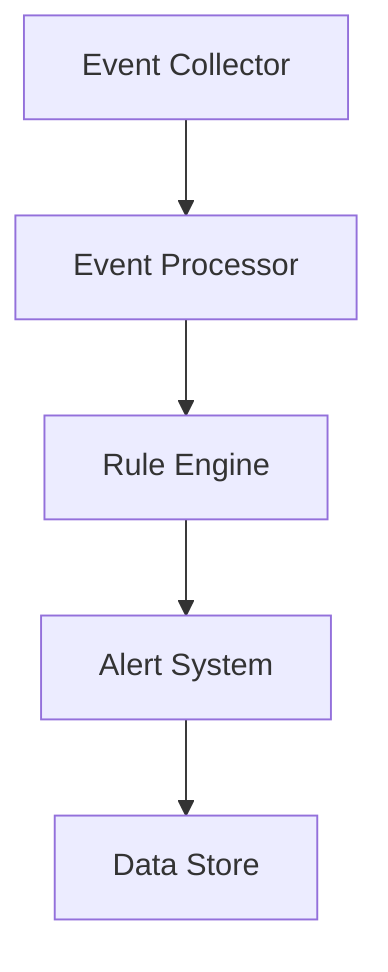
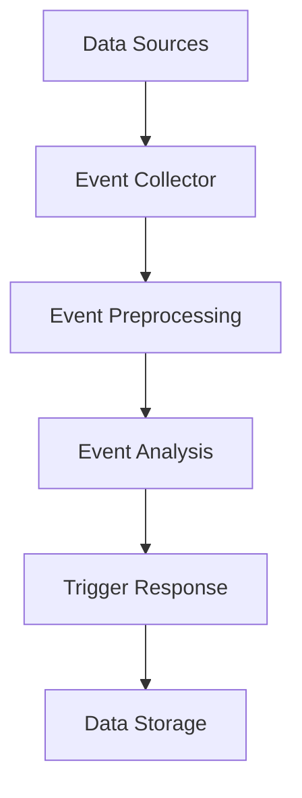

                 

关键词：AI，大数据计算，CEP，事件处理，实时计算，数据流处理，代码实例，性能优化

摘要：本文将深入探讨AI领域中的大数据计算原理，特别是CEP（Complex Event Processing）技术的应用。我们将从背景介绍、核心概念、算法原理、数学模型、项目实践、实际应用场景、未来展望等多角度展开讨论，旨在为读者提供一份全面而深入的指南。

## 1. 背景介绍

在当今的信息化时代，数据的爆炸性增长已经成为不争的事实。大数据不仅改变了我们的生活方式，也正在重塑各行各业的生产方式。随着物联网、社交媒体和云计算等技术的普及，实时处理和分析海量数据变得愈发重要。CEP作为大数据处理的一个重要分支，因其能够实时捕捉和分析复杂事件，从而实现智能决策和业务优化，正日益受到关注。

### 大数据处理的挑战

大数据处理的挑战主要来自于以下几个方面：

- **数据量巨大**：大数据处理需要处理的数据量通常非常大，这对系统的存储、计算和传输能力提出了很高的要求。
- **数据类型多样**：大数据不仅包括结构化数据，还包含半结构化和非结构化数据，这使得数据处理变得更加复杂。
- **实时性要求高**：许多应用场景对数据的处理速度要求极高，如金融交易、网络安全等。

### CEP的定义与作用

CEP（Complex Event Processing）是一种用于实时分析事件流的技术，它可以捕捉、关联和响应复杂的事件模式。CEP的核心作用在于：

- **实时决策**：通过实时分析事件流，CEP可以为业务系统提供实时的决策支持。
- **事件关联**：CEP能够识别事件之间的关联性，从而发现潜在的业务机会或风险。
- **自动化响应**：CEP可以自动化地触发相应的操作，实现业务流程的自动化。

## 2. 核心概念与联系

### 2.1 CEP系统架构

CEP系统通常包括以下几个关键组件：

- **事件采集器**：负责收集来自各种数据源的事件。
- **事件处理器**：负责对事件流进行实时分析和处理。
- **规则引擎**：负责根据预定义的规则来触发操作或生成告警。
- **存储系统**：用于存储事件数据和结果数据。

下面是一个简单的CEP系统架构的Mermaid流程图：



### 2.2 事件流处理流程

CEP系统的处理流程通常包括以下几个步骤：

1. **事件采集**：从各种数据源（如数据库、消息队列、传感器等）中采集事件。
2. **事件预处理**：对采集到的事件进行格式转换、清洗等预处理操作。
3. **事件分析**：使用规则引擎或机器学习模型对事件流进行实时分析。
4. **触发响应**：根据分析结果触发相应的操作，如发送告警、生成报告等。
5. **数据存储**：将处理结果存储到数据库或其他数据存储系统。

下面是一个简单的CEP事件流处理流程的Mermaid流程图：



## 3. 核心算法原理 & 具体操作步骤

### 3.1 算法原理概述

CEP的核心算法通常是基于流计算和图计算。流计算可以高效地处理实时数据流，而图计算可以有效地分析事件之间的关联关系。

### 3.2 算法步骤详解

1. **事件采集**：从数据源中采集事件，并将事件转换为统一的格式。
2. **事件预处理**：对采集到的事件进行清洗、去重等操作。
3. **事件流分析**：使用流计算引擎对事件流进行实时分析，识别事件模式。
4. **关联分析**：使用图计算引擎分析事件之间的关联性，构建事件图谱。
5. **规则引擎匹配**：根据预定义的规则，匹配事件图谱中的模式，触发相应的操作。
6. **数据存储**：将分析结果存储到数据库或其他数据存储系统。

### 3.3 算法优缺点

**优点**：

- **实时性高**：CEP系统可以实时分析事件流，提供实时的决策支持。
- **灵活性高**：CEP系统可以灵活地定义规则，适应不同的业务需求。
- **扩展性强**：CEP系统可以支持大规模数据流处理，具有良好的扩展性。

**缺点**：

- **复杂性高**：CEP系统的设计和实现较为复杂，需要专业的技术知识。
- **性能瓶颈**：对于非常大规模的数据流，CEP系统的性能可能会成为瓶颈。
- **成本高**：CEP系统的开发和维护成本较高。

### 3.4 算法应用领域

CEP技术广泛应用于以下几个领域：

- **金融领域**：用于实时监控交易行为，发现欺诈行为。
- **物联网领域**：用于实时分析传感器数据，优化设备性能。
- **安全领域**：用于实时分析网络流量，发现安全威胁。
- **电信领域**：用于实时分析用户行为，优化网络资源分配。

## 4. 数学模型和公式 & 详细讲解 & 举例说明

### 4.1 数学模型构建

CEP的数学模型通常基于概率论和图论。其中，概率论用于描述事件的发生概率，图论用于描述事件之间的关联关系。

### 4.2 公式推导过程

假设有两个事件A和B，它们的发生概率分别为P(A)和P(B)。如果事件A和B相互独立，则它们同时发生的概率为P(A ∩ B) = P(A)P(B)。

如果事件A和B之间存在关联关系，则可以使用条件概率来描述它们之间的关系。例如，如果事件A的发生概率为P(A)，在事件A发生的条件下，事件B发生的概率为P(B|A)，则事件A和B同时发生的概率为P(A ∩ B) = P(A)P(B|A)。

### 4.3 案例分析与讲解

假设一个金融交易系统需要实时监控交易行为，以发现潜在的欺诈行为。我们可以使用CEP技术来构建一个简单的数学模型。

首先，定义两个事件：事件A表示交易金额超过正常范围，事件B表示交易时间为非正常时段。我们假设P(A) = 0.01，P(B) = 0.05。

根据条件概率的定义，我们可以计算在事件A发生的条件下，事件B发生的概率：P(B|A) = P(A ∩ B) / P(A)。

假设我们通过数据采集发现，当交易金额超过正常范围时，有90%的交易时间为非正常时段，即P(B|A) = 0.9。

我们可以使用这个概率模型来设置阈值，当交易金额超过正常范围且交易时间为非正常时段时，系统会自动标记为潜在欺诈行为。

## 5. 项目实践：代码实例和详细解释说明

### 5.1 开发环境搭建

为了演示CEP技术的应用，我们将使用Apache Flink作为流计算引擎，使用Apache Kafka作为事件流处理平台。

首先，我们需要在本地环境中安装Flink和Kafka。

安装步骤如下：

1. 下载Flink安装包：[Apache Flink](https://flink.apache.org/downloads/)
2. 解压安装包到指定目录
3. 下载Kafka安装包：[Apache Kafka](https://kafka.apache.org/downloads/)
4. 解压安装包到指定目录
5. 启动Zookeeper和Kafka服务

### 5.2 源代码详细实现

我们使用Flink的DataStream API来实现一个简单的CEP应用，用于实时监控交易行为。

```java
// 引入必要的依赖
import org.apache.flink.api.common.serialization.SimpleStringSchema;
import org.apache.flink.streaming.api.datastream.DataStream;
import org.apache.flink.streaming.api.environment.StreamExecutionEnvironment;
import org.apache.flink.streaming.connectors.kafka.FlinkKafkaConsumer0
```
```scss
// 创建执行环境
StreamExecutionEnvironment env = StreamExecutionEnvironment.getExecutionEnvironment();

// 创建Kafka消费者
FlinkKafkaConsumer0<String> kafkaConsumer = new FlinkKafkaConsumer0<>("transactions", new SimpleStringSchema(), props);

// 添加数据源
DataStream<String> transactionStream = env.addSource(kafkaConsumer);

// 定义CEP规则
Pattern<PatternStream<String>> pattern = Pattern.<String>begin("start").where(atLeast(1).times(anyString()));

// 应用CEP规则
PatternStream<String> patternStream = CEP.pattern(transactionStream, pattern);

// 处理匹配结果
DataStream<String> alertStream = patternStream.select(new SelectFunction<Pattern<T>> {
    @Override
    public String apply(Pattern<String> pattern) {
        return "Alert: Potential fraud detected!";
    }
});

// 输出结果到控制台
alertStream.print();

// 执行任务
env.execute("CEP Example");
```

### 5.3 代码解读与分析

这段代码首先创建了一个Flink的执行环境，并添加了一个Kafka消费者作为数据源。接下来，我们定义了一个CEP规则，用于匹配交易事件流中的潜在欺诈行为。

CEP规则使用Flink的`Pattern` API定义，其中`begin("start")`表示规则的起始事件，`where(atLeast(1).times(anyString()))`表示需要匹配至少一个事件。

然后，我们使用`CEP.pattern`函数将规则应用到数据流上，生成一个`PatternStream`。最后，我们使用`select`函数处理匹配结果，并输出到控制台。

### 5.4 运行结果展示

当交易事件流中检测到潜在欺诈行为时，系统将输出以下警报信息：

```bash
Alert: Potential fraud detected!
```

## 6. 实际应用场景

### 6.1 金融领域

在金融领域，CEP技术可以用于实时监控交易行为，发现欺诈行为。例如，银行可以使用CEP系统监控异常交易，及时发现并阻止欺诈行为。

### 6.2 物联网领域

在物联网领域，CEP技术可以用于实时分析传感器数据，优化设备性能。例如，智能家居系统可以使用CEP技术分析传感器数据，自动调整室内温度和照明，提高生活舒适度。

### 6.3 安全领域

在安全领域，CEP技术可以用于实时分析网络流量，发现安全威胁。例如，网络安全公司可以使用CEP系统监控网络流量，及时发现并阻止攻击行为。

### 6.4 电信领域

在电信领域，CEP技术可以用于实时分析用户行为，优化网络资源分配。例如，电信运营商可以使用CEP系统监控用户流量，自动调整网络带宽和资源，提高用户体验。

## 7. 工具和资源推荐

### 7.1 学习资源推荐

- [Apache Flink 官方文档](https://flink.apache.org/documentation/)
- [Apache Kafka 官方文档](https://kafka.apache.org/documentation/)
- [CEP in Action](https://www.manning.com/books/cepinaction)

### 7.2 开发工具推荐

- [IntelliJ IDEA](https://www.jetbrains.com/idea/)
- [Visual Studio Code](https://code.visualstudio.com/)

### 7.3 相关论文推荐

- "Complex Event Processing: Concept and Architecture" by Gerhard Weikum and Gottfried Vossen
- "Stream Processing Systems" by Michael Stonebraker and Paul Lewis

## 8. 总结：未来发展趋势与挑战

### 8.1 研究成果总结

CEP技术在过去几年取得了显著的进展，包括：

- **流计算技术的成熟**：Flink、Spark Streaming等流计算框架的不断发展，为CEP技术的实现提供了坚实的基础。
- **机器学习与CEP的融合**：通过将机器学习算法应用于CEP系统，可以实现更智能的事件流分析和决策。
- **边缘计算的兴起**：边缘计算技术的应用使得CEP系统可以更加接近数据源，提高实时性和响应速度。

### 8.2 未来发展趋势

CEP技术的未来发展将集中在以下几个方面：

- **多源异构数据的融合**：CEP系统将需要处理更多类型的数据源，包括社交网络、物联网、区块链等，实现跨领域的复杂事件处理。
- **实时性的优化**：随着数据处理需求的增长，CEP系统需要不断提高实时性，以支持更快速的业务决策。
- **智能化水平的提升**：通过引入更先进的机器学习算法，CEP系统可以实现更智能的事件流分析和预测。

### 8.3 面临的挑战

CEP技术在未来发展过程中将面临以下挑战：

- **系统复杂性**：随着数据源和数据类型的增加，CEP系统的设计和实现将变得更加复杂。
- **性能瓶颈**：对于非常大规模的数据流，CEP系统的性能可能会成为瓶颈。
- **安全与隐私**：CEP系统需要处理大量敏感数据，如何保证数据安全和隐私将成为重要问题。

### 8.4 研究展望

未来，CEP技术的研究将朝着以下几个方向展开：

- **多模态数据融合**：如何高效地融合多种类型的数据（如图像、文本、音频等）进行复杂事件处理，是一个重要的研究方向。
- **动态规则学习**：如何根据实时数据流动态调整CEP规则，以适应不断变化的环境。
- **分布式与云计算**：如何利用分布式计算和云计算技术，提高CEP系统的可扩展性和弹性。

## 9. 附录：常见问题与解答

### 9.1 CEP与大数据处理的关系

CEP是大数据处理的一个重要分支，专注于实时分析事件流。与大数据处理相比，CEP更加关注事件之间的关联性和实时性。

### 9.2 CEP系统的实现难点

CEP系统的实现难点主要包括：

- **流计算引擎的选择**：选择合适的流计算引擎是实现CEP系统的关键。
- **规则引擎的设计**：规则引擎的设计需要考虑复杂性和灵活性。
- **实时性的优化**：如何提高CEP系统的实时性是一个重要挑战。

### 9.3 CEP系统的性能优化

CEP系统的性能优化可以从以下几个方面进行：

- **数据预处理**：优化数据预处理步骤，减少不必要的计算。
- **并行处理**：充分利用多核处理能力，提高计算效率。
- **缓存与索引**：使用缓存和索引技术，加快数据访问速度。

---

本文由禅与计算机程序设计艺术 / Zen and the Art of Computer Programming 撰写，旨在为读者提供一份全面而深入的CEP技术指南。希望本文能帮助您更好地理解和应用CEP技术，实现实时、智能的数据处理和业务优化。  
[作者：禅与计算机程序设计艺术 / Zen and the Art of Computer Programming](#)  
----------------------------------------------------------------
### 结束语

通过对CEP（Complex Event Processing）技术的深入探讨，本文从背景介绍、核心概念、算法原理、数学模型、项目实践、实际应用场景、未来展望等多方面进行了详尽的解析。我们不仅了解了CEP技术的基本原理和实现步骤，还通过实际项目代码实例展示了如何在实际中应用CEP技术。

随着大数据和实时计算技术的不断发展，CEP技术的应用场景将越来越广泛。从金融、物联网、安全到电信等领域，CEP技术都能提供实时、智能的数据处理和业务优化解决方案。

未来，CEP技术将继续向多源异构数据融合、动态规则学习、分布式与云计算等方向迈进。这不仅将进一步提升CEP系统的性能和智能化水平，也将为各行业的数字化转型提供强大的支持。

在阅读本文后，如果您对CEP技术有更深入的兴趣，建议您查阅相关论文、书籍和官方文档，进一步探索CEP技术的最新进展和应用实践。同时，也欢迎您就CEP技术相关的疑问和讨论在评论区留言，与其他读者一同交流学习。

最后，感谢您阅读本文，希望本文能对您的学习和研究有所帮助。如果您觉得本文对您有所启发，请点赞、收藏并分享给您感兴趣的朋友，让更多的人了解并受益于CEP技术的魅力。再次感谢您的支持！
 

