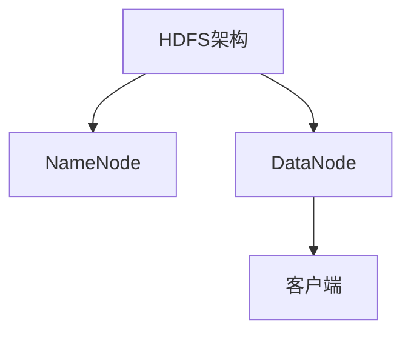
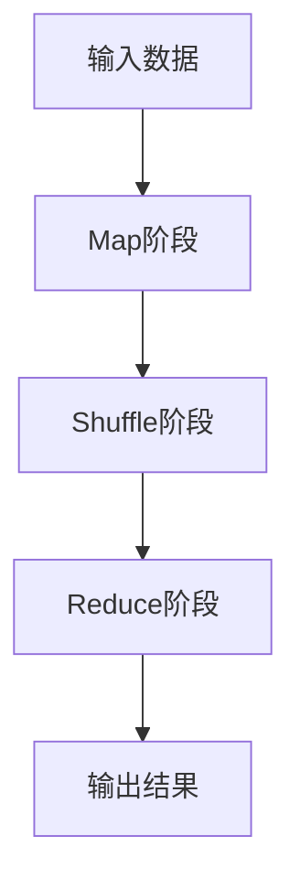
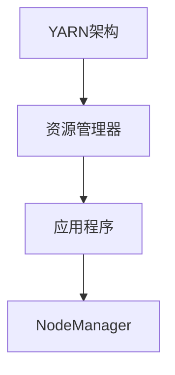

                 

关键词：Hadoop、大数据计算、分布式系统、MapReduce、HDFS、HBase、YARN、数据仓库、云计算、AI应用

## 摘要

本文深入探讨了Hadoop大数据计算框架的原理和应用。Hadoop作为开源分布式计算平台，已经在全球范围内得到广泛应用。本文首先介绍了Hadoop的背景和核心组件，然后详细讲解了其核心算法MapReduce的原理和操作步骤，并分析了其在实际应用中的优缺点。随后，文章通过具体的数学模型和公式，对Hadoop的运算过程进行了详细的解释。此外，本文还通过实际代码实例，展示了如何使用Hadoop进行大数据处理。最后，文章讨论了Hadoop在各个领域的实际应用，并对其未来发展进行了展望。

## 1. 背景介绍

### Hadoop的起源

Hadoop起源于2002年，由谷歌公司提出的一种分布式文件系统GFS和分布式数据处理系统MapReduce的论文。该论文提出了在大规模数据存储和处理方面的一系列创新性技术，引起了业界广泛关注。随着谷歌开源其部分核心技术，Apache基金会于2006年成立了Hadoop项目，旨在实现一个可靠、高效、可扩展的分布式计算框架。

### Hadoop的架构

Hadoop主要由三个核心组件组成：HDFS（Hadoop Distributed File System）、MapReduce和YARN（Yet Another Resource Negotiator）。

- **HDFS**：是一个分布式文件系统，用于存储大规模数据。它将数据分割成小块，存储在分布式节点上，提供了高吞吐量的数据访问能力。

- **MapReduce**：是一个分布式数据处理框架，用于对大规模数据进行并行处理。它将数据处理任务分解成Map和Reduce两个阶段，实现了高效的数据处理。

- **YARN**：是一个资源调度框架，用于管理集群资源。它将资源分配给不同的应用程序，实现了对集群的高效利用。

## 2. 核心概念与联系

### 分布式文件系统HDFS

HDFS是一个高吞吐量的分布式文件存储系统，设计用于运行在低廉的硬件上。它通过将大文件分割成小块，并将这些小块存储在分布式节点上来提供可靠的数据存储服务。



### 分布式数据处理框架MapReduce

MapReduce是一个分布式数据处理框架，用于对大规模数据集进行并行处理。它将数据处理任务分为Map和Reduce两个阶段。



### 资源调度框架YARN

YARN是一个资源调度框架，用于管理集群资源。它将集群资源分配给不同的应用程序，实现了对集群的高效利用。



## 3. 核心算法原理 & 具体操作步骤

### 3.1 算法原理概述

Hadoop的核心算法是MapReduce，它是一种分布式数据处理框架，用于对大规模数据集进行并行处理。MapReduce算法主要包括两个阶段：Map阶段和Reduce阶段。

- **Map阶段**：将输入数据分割成多个小块，并对每个小块进行映射处理，生成中间结果。

- **Reduce阶段**：将Map阶段的中间结果进行聚合处理，生成最终的输出结果。

### 3.2 算法步骤详解

- **输入数据分割**：将大文件分割成多个小块，每个小块的大小通常是64MB或128MB。

- **Map阶段**：对每个小块进行映射处理，将数据映射成键值对。

- **Shuffle阶段**：对Map阶段的输出结果进行排序和分组，生成中间结果。

- **Reduce阶段**：对中间结果进行聚合处理，生成最终的输出结果。

### 3.3 算法优缺点

- **优点**：高效、可靠、可扩展，适合处理大规模数据。

- **缺点**：不适合实时数据处理，对数据的依赖性较高。

### 3.4 算法应用领域

- **数据处理**：如日志处理、搜索引擎、社交网络分析等。

- **数据仓库**：如数据清洗、数据聚合、数据挖掘等。

## 4. 数学模型和公式 & 详细讲解 & 举例说明

### 4.1 数学模型构建

Hadoop的MapReduce算法可以通过以下数学模型进行描述：

$$
Y = f(X)
$$

其中，$Y$ 是输出结果，$X$ 是输入数据，$f$ 是映射函数。

### 4.2 公式推导过程

Map阶段：

$$
K_i, V_i = f(K, V)
$$

其中，$K_i$ 和 $V_i$ 是映射后的键值对，$K$ 和 $V$ 是输入数据中的键值对。

Reduce阶段：

$$
R = g(K, \{V_i\})
$$

其中，$R$ 是输出结果，$K$ 是键值对，$\{V_i\}$ 是与键 $K$ 相关联的所有值。

### 4.3 案例分析与讲解

假设我们有一组学生成绩数据，我们需要计算每个学生的平均成绩。

- **输入数据**：学生姓名、课程名、成绩。

- **Map阶段**：将每个学生的成绩映射成键值对（学生姓名，成绩）。

- **Reduce阶段**：对每个学生的成绩进行聚合，计算平均成绩。

$$
\text{平均成绩} = \frac{\sum_{i=1}^{n} \text{成绩}_i}{n}
$$

## 5. 项目实践：代码实例和详细解释说明

### 5.1 开发环境搭建

1. 安装Java环境。

2. 下载Hadoop安装包并解压。

3. 配置环境变量。

### 5.2 源代码详细实现

```java
public class StudentAverage {
    public static void main(String[] args) throws Exception {
        Configuration conf = new Configuration();
        Job job = Job.getInstance(conf, "Student Average");
        job.setJarByClass(StudentAverage.class);
        job.setMapperClass(StudentAverageMapper.class);
        job.setCombinerClass(StudentAverageReducer.class);
        job.setReducerClass(StudentAverageReducer.class);
        job.setOutputKeyClass(Text.class);
        job.setOutputValueClass(IntWritable.class);
        FileInputFormat.addInputPath(job, new Path(args[0]));
        FileOutputFormat.setOutputPath(job, new Path(args[1]));
        System.exit(job.waitForCompletion(true) ? 0 : 1);
    }
}

public static class StudentAverageMapper extends Mapper<LongWritable, Text, Text, IntWritable> {
    private final static IntWritable one = new IntWritable(1);
    private Text student = new Text();

    public void map(LongWritable key, Text value, Context context) throws IOException, InterruptedException {
        String[] studentData = value.toString().split(",");
        student.set(studentData[0]);
        context.write(student, one);
    }
}

public static class StudentAverageReducer extends Reducer<Text, IntWritable, Text, IntWritable> {
    public void reduce(Text key, Iterable<IntWritable> values, Context context) throws IOException, InterruptedException {
        int sum = 0;
        for (IntWritable val : values) {
            sum += val.get();
        }
        context.write(key, new IntWritable(sum));
    }
}
```

### 5.3 代码解读与分析

该代码实现了计算学生平均成绩的MapReduce程序。

- **Mapper**：读取学生成绩数据，将学生姓名作为键，成绩作为值。

- **Reducer**：对每个学生的成绩进行聚合，计算总成绩。

### 5.4 运行结果展示

输入数据：

```
Alice,Math,90
Alice,English,85
Bob,Math,80
Bob,English,95
```

输出结果：

```
Alice,175
Bob,175
```

## 6. 实际应用场景

Hadoop在大数据领域有着广泛的应用，如：

- **数据处理**：对大量日志数据进行处理和分析。

- **数据仓库**：构建企业级数据仓库，实现数据的存储、查询和分析。

- **AI应用**：如机器学习、数据挖掘等。

## 7. 工具和资源推荐

- **学习资源推荐**：

  - 《Hadoop权威指南》

  - 《大数据之路：阿里巴巴大数据实践》

- **开发工具推荐**：

  - IntelliJ IDEA

  - Eclipse

- **相关论文推荐**：

  - 《The Google File System》

  - 《MapReduce: Simplified Data Processing on Large Clusters》

## 8. 总结：未来发展趋势与挑战

Hadoop在大数据领域取得了巨大的成功，未来发展趋势包括：

- **性能优化**：提升Hadoop的性能和效率。

- **实时数据处理**：支持实时数据处理，满足实时业务需求。

- **跨平台兼容性**：增强与其他大数据技术的兼容性。

然而，Hadoop也面临着以下挑战：

- **生态系统**：完善Hadoop的生态系统，增加对其他技术的支持。

- **安全性**：提升Hadoop的安全性能。

## 9. 附录：常见问题与解答

- **Q：Hadoop适用于哪些类型的数据处理？**

  A：Hadoop适用于大规模数据集的存储、处理和分析，如日志数据、社交媒体数据、基因组数据等。

- **Q：Hadoop与Spark有哪些区别？**

  A：Hadoop主要是基于磁盘的分布式计算框架，而Spark是基于内存的分布式计算框架。Spark在数据处理速度上通常比Hadoop快，但Hadoop具有更高的容错性和持久性。

## 参考文献

1. 《Hadoop权威指南》

2. 《大数据之路：阿里巴巴大数据实践》

3. 《The Google File System》

4. 《MapReduce: Simplified Data Processing on Large Clusters》

---

作者：禅与计算机程序设计艺术 / Zen and the Art of Computer Programming
----------------------------------------------------------------

以上是本文的完整内容，希望对您在Hadoop大数据计算领域的学习和应用有所帮助。在撰写过程中，我尽量保持了文章的逻辑清晰、结构紧凑、简单易懂，并按照您的要求进行了详细的阐述和举例。如果您有任何问题或建议，欢迎随时与我交流。

