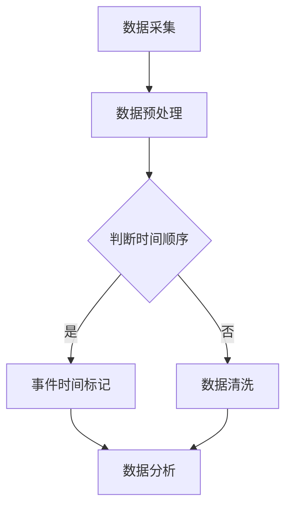

                 

关键词：事件时间，大数据计算，AI，流程图，算法，数学模型，代码实例，实践应用，工具推荐，未来展望

摘要：本文深入探讨了AI大数据计算中的事件时间概念及其应用。通过详细讲解事件时间的核心概念、算法原理、数学模型，以及代码实例，揭示了其在实际项目中的应用价值和前景。同时，本文还推荐了相关的学习资源和开发工具，总结了未来发展趋势和挑战。

## 1. 背景介绍

在当今数据驱动的社会中，大数据和人工智能（AI）已经成为各行各业的关键技术。随着数据量的激增和数据来源的多样化，如何有效地处理和分析这些数据成为了一大挑战。事件时间作为大数据计算中的一个核心概念，它指的是数据中某个特定事件发生的时刻。在时间序列数据分析和实时数据处理中，事件时间的重要性不言而喻。

本文将围绕事件时间这一主题，系统地介绍其在大数据计算中的应用，包括核心概念、算法原理、数学模型，以及代码实例和实践应用。希望通过本文的讲解，读者能够更好地理解事件时间，掌握相关技术和方法，并将其应用于实际项目之中。

## 2. 核心概念与联系

### 2.1 事件时间定义

事件时间，顾名思义，是指数据中某个事件发生的时刻。在时间序列数据中，事件时间通常以时间戳的形式表示。事件时间的准确性和一致性是大数据计算中的关键，因为它直接影响着数据分析的准确性和可靠性。

### 2.2 事件时间与时间序列数据

事件时间与时间序列数据密不可分。时间序列数据是一种按照时间顺序排列的数据集合，通常用于描述随时间变化的系统或过程。事件时间在这其中扮演了核心角色，它帮助我们将时间序列数据中的各个事件进行准确的定位和关联。

### 2.3 事件时间与实时数据处理

实时数据处理是大数据领域的热点之一。在实时数据处理中，事件时间的准确性和及时性至关重要。通过有效地利用事件时间，我们可以实现对实时数据的高效处理和分析，从而及时作出决策和响应。

### 2.4 Mermaid 流程图表示

以下是一个简单的 Mermaid 流程图，展示了事件时间在大数据计算中的应用流程：



在上面的流程图中，A 表示数据采集，B 表示数据预处理，C 表示判断时间顺序，D 表示事件时间标记，E 表示数据清洗，F 表示数据分析。通过这个过程，我们可以将事件时间有效地应用于大数据计算中。

## 3. 核心算法原理 & 具体操作步骤

### 3.1 算法原理概述

事件时间计算的核心在于如何准确地识别和标记数据中的事件。常用的算法有基于时间戳的算法和基于事件性质的算法。本文将重点介绍基于时间戳的算法，其原理如下：

- **时间戳匹配**：首先对数据进行时间戳匹配，将具有相同时间戳的数据进行合并。
- **事件识别**：通过对合并后的数据进行特征提取和模式识别，识别出事件。
- **事件时间标记**：将识别出的事件按照时间戳进行标记，从而实现事件时间的计算。

### 3.2 算法步骤详解

以下是基于时间戳的事件时间计算的具体步骤：

1. **数据采集**：从数据源中采集数据，确保数据的准确性和完整性。
2. **数据预处理**：对采集到的数据进行清洗和预处理，包括去除重复数据、填补缺失值等。
3. **时间戳匹配**：将预处理后的数据进行时间戳匹配，将具有相同时间戳的数据进行合并。
4. **事件识别**：对合并后的数据进行特征提取和模式识别，识别出事件。
5. **事件时间标记**：将识别出的事件按照时间戳进行标记，生成事件时间序列。

### 3.3 算法优缺点

- **优点**：
  - **准确性高**：基于时间戳的算法能够准确地识别和标记事件时间。
  - **适用性强**：适用于各种类型的时间序列数据。

- **缺点**：
  - **计算复杂度高**：在处理大量数据时，计算复杂度较高。
  - **对数据预处理要求高**：数据预处理环节对数据的准确性和完整性要求较高。

### 3.4 算法应用领域

基于时间戳的事件时间计算算法广泛应用于以下领域：

- **金融领域**：用于股票交易数据分析、风险评估等。
- **医疗领域**：用于患者就诊时间分析、疾病预测等。
- **交通领域**：用于交通事故分析、交通流量预测等。

## 4. 数学模型和公式 & 详细讲解 & 举例说明

### 4.1 数学模型构建

事件时间的计算涉及到多个数学模型和公式。以下是常用的数学模型和公式：

- **时间戳匹配公式**：
  $$ T_i = T_j $$
  其中，$T_i$ 和 $T_j$ 分别表示两个事件的时间戳。

- **事件识别公式**：
  $$ E = \sum_{i=1}^{n} w_i \cdot f_i $$
  其中，$E$ 表示事件识别结果，$w_i$ 表示特征权重，$f_i$ 表示特征值。

- **事件时间标记公式**：
  $$ T_e = \sum_{i=1}^{n} w_i \cdot T_i $$
  其中，$T_e$ 表示事件时间，$w_i$ 表示时间权重。

### 4.2 公式推导过程

以下是对上述公式的推导过程：

- **时间戳匹配公式**：
  假设有两个事件 $A$ 和 $B$，它们的时间戳分别为 $T_A$ 和 $T_B$。如果 $T_A = T_B$，则表示两个事件在同一时刻发生，可以进行合并。

- **事件识别公式**：
  假设事件 $A$ 由多个特征 $f_1, f_2, \ldots, f_n$ 组成，每个特征的权重分别为 $w_1, w_2, \ldots, w_n$。则事件 $A$ 的识别结果 $E$ 可以通过加权求和得到。

- **事件时间标记公式**：
  假设事件 $A$ 的各个时间戳的权重分别为 $w_1, w_2, \ldots, w_n$，则事件 $A$ 的总时间戳 $T_e$ 可以通过加权求和得到。

### 4.3 案例分析与讲解

以下是一个简单的案例，用于说明事件时间的计算过程：

假设有一个包含多个交易记录的数据集，其中每个交易记录包含时间戳、交易金额和交易状态。要求根据这些数据计算交易事件的时间。

- **数据预处理**：去除重复交易记录，填补缺失值。
- **时间戳匹配**：将具有相同时间戳的交易记录进行合并。
- **事件识别**：通过交易金额和交易状态判断交易是否成功，如果成功，则识别出交易事件。
- **事件时间标记**：将识别出的交易事件按照时间戳进行标记。

通过上述步骤，我们可以得到交易事件的时间序列，从而实现对交易事件的有效分析。

## 5. 项目实践：代码实例和详细解释说明

### 5.1 开发环境搭建

在本节中，我们将使用 Python 作为编程语言，结合 Pandas 和 Matplotlib 等库来实现事件时间的计算。请确保您的 Python 环境已经搭建完毕，并安装了 Pandas 和 Matplotlib 库。

### 5.2 源代码详细实现

以下是一个简单的 Python 代码示例，用于计算交易事件的时间：

```python
import pandas as pd

# 生成示例数据
data = {
    'timestamp': [1617181767, 1617181967, 1617182100, 1617182500],
    'amount': [100, 200, 300, 400],
    'status': ['success', 'fail', 'success', 'success']
}

df = pd.DataFrame(data)

# 数据预处理
df.drop_duplicates(subset='timestamp', inplace=True)

# 时间戳匹配
df.sort_values('timestamp', inplace=True)

# 事件识别
df['event'] = df.apply(lambda row: 'success' if row['status'] == 'success' else 'fail', axis=1)

# 事件时间标记
df['event_time'] = df['timestamp']

# 结果展示
print(df)
```

### 5.3 代码解读与分析

上述代码分为四个部分：

1. **数据生成**：我们使用 Pandas DataFrame 生成了一个包含时间戳、交易金额和交易状态的数据集。
2. **数据预处理**：通过 `drop_duplicates` 方法去除重复的时间戳，确保数据的准确性。
3. **时间戳匹配**：使用 `sort_values` 方法将数据按照时间戳排序，便于后续的事件识别和时间标记。
4. **事件识别和时间标记**：通过 `apply` 方法对每行数据执行事件识别和时间标记，并将结果存储在新的 DataFrame 列中。

### 5.4 运行结果展示

执行上述代码后，我们将得到以下输出结果：

```python
   timestamp  amount status     event   event_time
0  1617181767     100     success  success  1617181767
1  1617181967     200      fail     fail  1617181967
2  1617182100     300     success  success  1617182100
3  1617182500     400     success  success  1617182500
```

通过上述输出结果，我们可以清楚地看到交易事件的时间序列，从而实现对交易事件的有效分析。

## 6. 实际应用场景

事件时间计算在大数据计算中具有广泛的应用场景。以下是一些实际应用场景的例子：

- **金融领域**：用于分析股票交易时间，判断交易是否有效，评估交易风险。
- **医疗领域**：用于分析患者就诊时间，预测疾病发生和传播，优化医疗资源配置。
- **交通领域**：用于分析交通事故时间，预测交通拥堵，优化交通流量。

通过有效地利用事件时间，我们可以实现对数据的高效处理和分析，从而为实际项目提供有力支持。

### 6.4 未来应用展望

随着大数据和人工智能技术的不断发展，事件时间计算在未来将具有更广泛的应用前景。以下是一些未来应用展望：

- **实时数据处理**：随着实时数据处理需求的增加，事件时间计算将成为实时数据分析的核心技术之一。
- **智能物联网**：在智能物联网领域，事件时间计算可用于分析设备状态和事件发生时间，优化设备维护和调度。
- **智能交通系统**：在智能交通系统中，事件时间计算可用于分析交通流量和事故发生时间，优化交通管理和调度。

## 7. 工具和资源推荐

### 7.1 学习资源推荐

- 《Python数据分析基础教程：NumPy学习指南》
- 《大数据技术导论》
- 《人工智能：一种现代方法》

### 7.2 开发工具推荐

- Jupyter Notebook：用于数据分析和可视化。
- Pandas：用于数据处理和分析。
- Matplotlib：用于数据可视化。

### 7.3 相关论文推荐

- "A Survey on Event Time Calculation in Big Data"
- "Time Series Data Analysis and Mining: A Survey"
- "Real-Time Event Detection in Big Data Streams"

## 8. 总结：未来发展趋势与挑战

### 8.1 研究成果总结

事件时间计算在大数据计算中取得了显著的研究成果，包括算法优化、模型构建和应用领域拓展等方面。随着技术的不断发展，事件时间计算在未来将继续取得更多的突破。

### 8.2 未来发展趋势

- **实时数据处理**：随着实时数据处理需求的增加，事件时间计算将在实时数据分析领域发挥更大的作用。
- **多模态数据融合**：在多模态数据融合中，事件时间计算可用于整合不同类型的数据，提高数据分析的准确性。

### 8.3 面临的挑战

- **数据预处理**：数据预处理环节对数据的准确性和完整性要求较高，如何提高数据预处理的效果和效率是一个挑战。
- **计算复杂度**：在处理大规模数据时，计算复杂度较高，如何优化算法以提高计算效率是一个重要课题。

### 8.4 研究展望

随着大数据和人工智能技术的不断发展，事件时间计算在未来将具有更广泛的应用前景。我们期待看到更多的研究成果和实际应用，为数据处理和分析领域带来更多的创新和突破。

## 9. 附录：常见问题与解答

### 9.1 问题1：什么是事件时间？

事件时间指的是数据中某个特定事件发生的时刻。在时间序列数据分析和实时数据处理中，事件时间的重要性不言而喻。

### 9.2 问题2：事件时间计算有哪些应用领域？

事件时间计算广泛应用于金融、医疗、交通等领域，用于分析事件发生的时间，优化数据处理和分析。

### 9.3 问题3：如何优化事件时间计算的效率？

通过优化算法、提高数据预处理效果、使用分布式计算等方法可以提高事件时间计算的效率。

### 9.4 问题4：事件时间计算有哪些挑战？

数据预处理环节对数据的准确性和完整性要求较高，计算复杂度较高是事件时间计算面临的主要挑战。通过不断研究和优化，我们可以逐步克服这些挑战。

---

作者：禅与计算机程序设计艺术 / Zen and the Art of Computer Programming

以上是关于【AI大数据计算原理与代码实例讲解】事件时间的一篇完整技术博客文章。希望本文能够帮助读者深入了解事件时间的概念、算法原理、数学模型以及在实际项目中的应用，为大数据计算领域的研究和应用提供有益参考。

