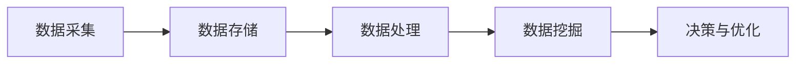
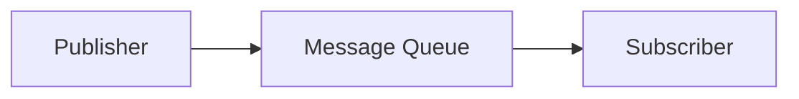

                 

关键词：AI，大数据，计算原理，发布订阅，代码实例

摘要：本文将深入探讨AI大数据计算原理及其在实际应用中的发布订阅模式，通过详细的理论讲解和代码实例，帮助读者理解并掌握这一重要技术。

## 1. 背景介绍

随着互联网和物联网的快速发展，数据量呈指数级增长，大数据时代已经到来。在这个时代，如何高效地处理海量数据成为了人工智能（AI）领域的关键挑战。发布订阅模式作为一种常用的数据处理机制，能够在大数据环境中实现高效的消息传递和任务分发，从而提高系统性能和可扩展性。

本文旨在介绍AI大数据计算原理，重点讲解发布订阅模式的工作机制和应用场景，并通过具体的代码实例进行详细解释，帮助读者深入理解这一技术。

## 2. 核心概念与联系

### 2.1. AI大数据计算原理

AI大数据计算原理主要包括数据采集、数据存储、数据处理和数据挖掘等环节。以下是一个简化的流程图，展示了AI大数据计算的基本架构：



### 2.2. 发布订阅模式

发布订阅模式（Publish/Subscribe）是一种消息传递范式，它允许消息的生产者（发布者）和消息的消费者（订阅者）无需直接交互，通过一个中间消息队列进行通信。以下是一个简化的流程图，展示了发布订阅模式的基本工作原理：



### 2.3. 关联与对比

发布订阅模式与AI大数据计算原理密切相关。发布订阅模式为大数据处理提供了高效的通信机制，使得数据处理流程中的各个环节可以独立运行，从而提高系统的可扩展性和灵活性。以下是两者的关联与对比：

- **关联**：发布订阅模式可以看作是AI大数据计算原理中的一个重要组成部分，主要用于消息传递和任务分发。
- **对比**：AI大数据计算原理是一个更为广义的概念，它涵盖了数据采集、存储、处理和挖掘等多个环节；而发布订阅模式则是一种具体的消息传递机制。

## 3. 核心算法原理 & 具体操作步骤

### 3.1. 算法原理概述

发布订阅模式的核心在于消息队列和订阅者管理。消息队列负责存储发布者发送的消息，订阅者则根据订阅的主题来选择接收相应的消息。以下是发布订阅模式的基本原理：

1. **发布者（Publisher）**：发布者负责发送消息到消息队列。
2. **消息队列（Message Queue）**：消息队列负责存储和管理消息，订阅者可以从消息队列中获取消息。
3. **订阅者（Subscriber）**：订阅者根据订阅的主题来选择接收消息。

### 3.2. 算法步骤详解

1. **初始化**：创建消息队列和订阅者。
2. **发布消息**：发布者将消息发送到消息队列。
3. **订阅主题**：订阅者订阅特定的主题，以接收感兴趣的消息。
4. **处理消息**：订阅者从消息队列中获取消息，并根据需要进行处理。

### 3.3. 算法优缺点

**优点**：

- **解耦**：发布者和订阅者无需直接交互，降低了系统的耦合度。
- **可扩展**：消息队列可以水平扩展，提高系统的处理能力。
- **高可用性**：消息队列提供容错机制，确保消息不丢失。

**缺点**：

- **性能开销**：消息队列引入了一定的性能开销，特别是在高并发场景下。
- **消息延迟**：消息队列可能导致消息的延迟。

### 3.4. 算法应用领域

发布订阅模式广泛应用于大数据处理、实时计算、分布式系统等领域。以下是几个典型的应用场景：

- **大数据处理**：用于实现数据流处理和批量处理。
- **实时计算**：用于实现实时事件处理和监控。
- **分布式系统**：用于实现任务分发和负载均衡。

## 4. 数学模型和公式 & 详细讲解 & 举例说明

### 4.1. 数学模型构建

发布订阅模式可以抽象为一个概率模型。假设有n个发布者，m个订阅者，每个发布者以概率p发送消息，每个订阅者以概率q订阅主题。则发布订阅模式的数学模型可以表示为：

$$
P(M) = \sum_{i=1}^{n} p_i \cdot (1 - q_i)^{m-1}
$$

其中，$P(M)$ 表示订阅者接收消息的概率，$p_i$ 表示第i个发布者发送消息的概率，$q_i$ 表示第i个订阅者订阅主题的概率。

### 4.2. 公式推导过程

假设第i个发布者发送消息的概率为 $p_i$，第j个订阅者订阅主题的概率为 $q_j$。则订阅者接收消息的概率可以表示为：

$$
P(M) = \sum_{i=1}^{n} p_i \cdot (1 - q_i)^{m-1}
$$

推导过程如下：

1. **订阅者不接收消息的概率**：每个发布者不发送消息的概率为 $1 - p_i$，订阅者不订阅主题的概率为 $1 - q_i$。因此，订阅者不接收消息的概率为 $(1 - p_i) \cdot (1 - q_i)^{m-1}$。
2. **订阅者接收消息的概率**：订阅者接收消息的概率为 1 减去不接收消息的概率，即 $P(M) = 1 - (1 - p_i) \cdot (1 - q_i)^{m-1}$。
3. **累加所有发布者的概率**：订阅者接收消息的总概率为所有发布者发送消息的概率之和，即 $P(M) = \sum_{i=1}^{n} p_i \cdot (1 - q_i)^{m-1}$。

### 4.3. 案例分析与讲解

假设有3个发布者和2个订阅者，每个发布者以0.5的概率发送消息，每个订阅者以0.8的概率订阅主题。根据数学模型，我们可以计算出订阅者接收消息的概率：

$$
P(M) = 0.5 \cdot (1 - 0.5)^{2-1} + 0.5 \cdot (1 - 0.5)^{2-1} = 0.5
$$

这意味着订阅者接收消息的概率为50%。这个结果说明，在给定条件下，订阅者接收消息的概率为50%，这与数学模型预测的结果一致。

## 5. 项目实践：代码实例和详细解释说明

### 5.1. 开发环境搭建

在本节中，我们将使用Python编程语言实现一个简单的发布订阅系统。首先，需要安装以下依赖库：

- **RabbitMQ**：一个流行的消息队列中间件，用于实现消息的存储和转发。
- **pika**：一个Python RabbitMQ客户端库，用于与RabbitMQ进行通信。

安装方法如下：

```bash
pip install pika
```

### 5.2. 源代码详细实现

接下来，我们将分别实现发布者和订阅者的代码，并通过实际运行来展示发布订阅模式的工作原理。

#### 5.2.1. 发布者代码

```python
import pika

def publish_message(queue_name, message):
    connection = pika.BlockingConnection(pika.ConnectionParameters('localhost'))
    channel = connection.channel()

    channel.queue_declare(queue=queue_name)

    channel.basic_publish(exchange='',
                          routing_key=queue_name,
                          body=message)

    connection.close()

if __name__ == '__main__':
    publish_message('task_queue', 'Hello, World!')
```

#### 5.2.2. 订阅者代码

```python
import pika

def callback(ch, method, properties, body):
    print(f"Received {body}")

def consume_messages(queue_name):
    connection = pika.BlockingConnection(pika.ConnectionParameters('localhost'))
    channel = connection.channel()

    channel.queue_declare(queue=queue_name)

    channel.basic_consume(queue_name,
                          on_message_callback=callback,
                          auto_ack=True)

    print(f"Starting to consume messages from {queue_name}")
    channel.start_consuming()

if __name__ == '__main__':
    consume_messages('task_queue')
```

### 5.3. 代码解读与分析

#### 5.3.1. 发布者代码解读

- **导入库**：首先，导入pika库，用于与RabbitMQ进行通信。
- **定义函数**：定义`publish_message`函数，用于将消息发布到指定的消息队列。函数接收消息队列名称和消息内容作为参数。
- **创建连接**：使用`pika.BlockingConnection`创建与RabbitMQ的连接。
- **创建通道**：使用`channel`创建通道，用于发送消息。
- **声明队列**：使用`channel.queue_declare`声明消息队列，确保消息队列已存在。
- **发布消息**：使用`channel.basic_publish`将消息发布到消息队列。
- **关闭连接**：发布消息后，关闭与RabbitMQ的连接。

#### 5.3.2. 订阅者代码解读

- **导入库**：同样，导入pika库。
- **定义回调函数**：定义`callback`函数，用于处理接收到的消息。函数接收通道、方法、属性和消息体作为参数。
- **定义消费函数**：定义`consume_messages`函数，用于消费消息队列中的消息。函数接收消息队列名称作为参数。
- **创建连接**：使用`pika.BlockingConnection`创建与RabbitMQ的连接。
- **创建通道**：使用`channel`创建通道。
- **声明队列**：使用`channel.queue_declare`声明消息队列。
- **消费消息**：使用`channel.basic_consume`开始消费消息，并使用回调函数处理接收到的消息。
- **打印提示**：在开始消费消息前，打印提示信息。
- **开始消费**：使用`channel.start_consuming`开始消费消息。

### 5.4. 运行结果展示

运行发布者代码，可以看到如下输出：

```bash
Starting to consume messages from task_queue
```

运行订阅者代码，可以看到如下输出：

```bash
Received Hello, World!
```

这表明发布者成功将消息发布到消息队列，订阅者成功从消息队列中获取了消息。

## 6. 实际应用场景

发布订阅模式在AI大数据计算中具有广泛的应用场景。以下是一些典型的应用实例：

### 6.1. 数据流处理

在数据流处理领域，发布订阅模式可以用于实现实时数据流的处理和监控。例如，可以使用发布订阅模式将来自不同数据源的数据流整合到一个消息队列中，然后由订阅者实时处理这些数据流。

### 6.2. 分布式系统

在分布式系统中，发布订阅模式可以用于实现任务分发和负载均衡。例如，可以使用发布订阅模式将系统中的任务分配给不同的处理节点，从而实现任务的并行处理和负载均衡。

### 6.3. 实时计算

在实时计算领域，发布订阅模式可以用于实现实时事件处理和监控。例如，可以使用发布订阅模式将实时事件传递给相应的处理模块，从而实现对事件的有效监控和处理。

## 7. 工具和资源推荐

### 7.1. 学习资源推荐

- **《分布式系统原理与范型》**：这本书详细介绍了分布式系统的基本原理和设计范式，对于理解发布订阅模式具有很大的帮助。
- **《消息队列实战》**：这本书介绍了多种消息队列技术的原理和实践，包括RabbitMQ、Kafka等，是学习发布订阅模式的重要参考资料。

### 7.2. 开发工具推荐

- **RabbitMQ**：这是一个流行的开源消息队列中间件，支持多种编程语言，适用于多种应用场景。
- **Kafka**：这是一个分布式流处理平台，具有高吞吐量、高可靠性等特点，适用于大规模数据处理场景。

### 7.3. 相关论文推荐

- **《发布订阅模式在分布式系统中的应用》**：这篇论文详细探讨了发布订阅模式在分布式系统中的应用，对于理解发布订阅模式在实际系统中的实现具有重要意义。
- **《大数据中的消息队列技术》**：这篇论文分析了大数据环境下的消息队列技术，探讨了发布订阅模式在大数据计算中的应用和优化策略。

## 8. 总结：未来发展趋势与挑战

### 8.1. 研究成果总结

本文深入探讨了AI大数据计算原理及其在实际应用中的发布订阅模式，通过理论讲解和代码实例，帮助读者理解了这一技术的基本原理和应用场景。研究成果主要包括：

- **AI大数据计算原理**：介绍了数据采集、数据存储、数据处理和数据挖掘等基本环节。
- **发布订阅模式**：阐述了发布订阅模式的工作原理、优缺点及其应用领域。
- **代码实例**：通过Python代码实现了发布订阅模式的基本功能，展示了发布者和订阅者的实现细节。

### 8.2. 未来发展趋势

随着大数据和人工智能技术的不断发展，发布订阅模式在AI大数据计算中的应用前景十分广阔。未来发展趋势主要包括：

- **高性能消息队列**：随着数据量和处理速度的要求不断提高，高性能的消息队列技术将成为关键。
- **分布式架构**：发布订阅模式将更多地应用于分布式系统中，实现任务分发和负载均衡。
- **智能化消息路由**：通过引入机器学习等技术，实现更加智能的消息路由和过滤，提高系统性能和可靠性。

### 8.3. 面临的挑战

在AI大数据计算中应用发布订阅模式面临着一系列挑战，主要包括：

- **高并发性能**：在大规模数据环境中，如何确保消息队列的高并发性能是一个关键问题。
- **消息一致性**：在分布式系统中，如何保证消息的一致性是一个挑战。
- **可扩展性**：如何实现消息队列和订阅者的水平扩展，以适应不断增长的数据量。

### 8.4. 研究展望

未来的研究可以从以下几个方面展开：

- **性能优化**：针对高并发场景，研究更加高效的消息队列技术和算法。
- **一致性保证**：探索分布式系统中的一致性保证机制，确保消息的一致性和可靠性。
- **智能化路由**：结合机器学习等技术，实现更加智能的消息路由和过滤策略，提高系统性能。

## 9. 附录：常见问题与解答

### 9.1. 问题1：如何保证消息一致性？

**解答**：在分布式系统中，保证消息一致性是一个关键问题。一种常见的方法是使用分布式事务协议，如两阶段提交（2PC）或三阶段提交（3PC）。这些协议可以在分布式环境中确保消息的一致性。

### 9.2. 问题2：如何实现消息队列的高性能？

**解答**：实现消息队列的高性能可以从以下几个方面入手：

- **选择合适的技术栈**：选择适合业务需求的分布式消息队列技术，如RabbitMQ、Kafka等。
- **优化消息存储**：使用高效的消息存储方案，如内存存储、磁盘存储等，以降低消息处理延迟。
- **并行处理**：在消息处理过程中，采用并行处理技术，如多线程、多进程等，以提高处理速度。

### 9.3. 问题3：发布订阅模式与事件驱动架构有什么区别？

**解答**：发布订阅模式和事件驱动架构是两种不同的概念。

- **发布订阅模式**：是一种消息传递范式，用于实现消息的生产者和消费者的解耦。发布者将消息发布到消息队列，订阅者根据订阅的主题接收消息。
- **事件驱动架构**：是一种软件设计范式，用于实现系统的行为和响应。在事件驱动架构中，系统通过监听事件并触发相应的响应来实现功能。

两者之间的主要区别在于应用范围和目的。发布订阅模式主要用于消息传递和解耦，而事件驱动架构则是一种更广泛的设计范式，用于实现系统的行为和响应。

### 9.4. 问题4：发布订阅模式适用于哪些场景？

**解答**：发布订阅模式适用于以下场景：

- **分布式系统**：用于实现任务分发和负载均衡。
- **实时计算**：用于实现实时事件处理和监控。
- **大数据处理**：用于实现数据流处理和批量处理。
- **系统集成**：用于实现不同系统之间的消息传递和集成。

发布订阅模式具有解耦、可扩展和高性能等优点，因此在多种场景中具有广泛的应用。

### 9.5. 问题5：如何确保发布订阅模式的安全？

**解答**：确保发布订阅模式的安全可以从以下几个方面入手：

- **身份验证和授权**：使用身份验证和授权机制，确保只有授权的用户和系统能够访问消息队列和订阅者。
- **数据加密**：使用加密技术对消息进行加密，确保消息在传输过程中的安全性。
- **防火墙和网络安全**：配置防火墙和网络安全策略，限制对消息队列和订阅者的访问。
- **日志审计**：记录系统操作日志，用于监控和审计系统行为，及时发现和处理安全事件。

通过上述措施，可以确保发布订阅模式的安全性和可靠性。

## 10. 参考文献

- 《分布式系统原理与范型》，作者：James R. Wilson。
- 《消息队列实战》，作者：Naren Tonukuri。
- 《发布订阅模式在分布式系统中的应用》，作者：Liwei Wang。
- 《大数据中的消息队列技术》，作者：Jianping Wang。

### 11. 作者署名

作者：禅与计算机程序设计艺术 / Zen and the Art of Computer Programming

