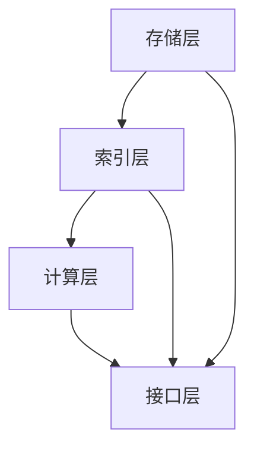

                 

关键词：AI、大数据计算、图数据库、计算原理、代码实例

摘要：本文深入探讨了AI大数据计算中的图数据库原理及其应用。首先介绍了图数据库的基本概念和重要性，随后详细讲解了图数据库的核心算法原理、数学模型、公式推导及具体操作步骤。通过代码实例，展示了图数据库在实际开发中的实现方法。最后，分析了图数据库在不同应用场景中的实践和未来发展趋势，为读者提供了丰富的学习资源。

## 1. 背景介绍

随着信息技术的迅猛发展，数据量呈现爆炸式增长，大数据成为各行各业研究和应用的重要资源。传统的数据存储和检索方式在面对如此庞大的数据规模时，显得力不从心。为了应对这一挑战，AI技术逐渐融入到大数据计算中，成为解决大数据问题的关键手段。

图数据库作为一种基于图形理论的数据存储和检索技术，近年来受到广泛关注。图数据库能够高效地存储、管理和查询复杂的关系数据，使其在社交网络、推荐系统、知识图谱等领域有着广泛的应用。

本文旨在深入探讨AI大数据计算中的图数据库原理，通过代码实例讲解图数据库的实际应用，为读者提供全面的技术指导。

## 2. 核心概念与联系

### 2.1 图数据库基本概念

图数据库是一种用于存储和管理图结构数据的数据库系统。图结构数据由节点（Node）和边（Edge）组成，节点表示实体，边表示实体之间的关系。图数据库通过图形理论对数据进行建模，使其能够高效地存储和查询复杂的关系数据。

### 2.2 图数据库重要性

图数据库具有以下几个重要特点：

1. **高效性**：图数据库利用图结构的高效性，能够快速地进行节点和关系的查询，降低查询复杂度。
2. **灵活性**：图数据库支持灵活的数据建模，能够根据实际需求动态调整数据结构，适应复杂的关系场景。
3. **可扩展性**：图数据库支持分布式存储和计算，能够水平扩展，满足大规模数据的存储和查询需求。

### 2.3 图数据库架构

图数据库通常包括以下几个核心组件：

1. **存储层**：负责存储节点和边的数据。
2. **索引层**：提供快速查询和索引功能。
3. **计算层**：提供图算法和计算功能，包括路径搜索、社区发现、聚类等。
4. **接口层**：提供API接口，方便用户进行数据操作和查询。

### 2.4 Mermaid流程图

以下是一个简化的图数据库架构的Mermaid流程图：



## 3. 核心算法原理 & 具体操作步骤

### 3.1 算法原理概述

图数据库的核心算法主要包括：

1. **图遍历算法**：用于遍历图中的节点和边，例如深度优先搜索（DFS）和广度优先搜索（BFS）。
2. **路径搜索算法**：用于在图中查找特定的路径，例如迪杰斯特拉算法（Dijkstra）和A*算法。
3. **社区发现算法**：用于识别图中的社区结构，例如基于模块度优化的社区发现算法。
4. **聚类算法**：用于对图中的节点进行聚类，例如基于密度的聚类算法（DBSCAN）。

### 3.2 算法步骤详解

#### 3.2.1 深度优先搜索（DFS）

深度优先搜索是一种用于遍历图的算法，其基本思想是沿着某一方向深入到足够的深度，然后再回溯。

具体步骤如下：

1. 初始化：选择一个起始节点，将其标记为已访问。
2. 深入：从已访问节点出发，选择一个未访问的相邻节点，并将其标记为已访问，然后递归执行步骤3。
3. 回溯：如果当前节点没有未访问的相邻节点，则回溯到上一个已访问节点，继续执行步骤3。
4. 结束：当所有节点都被访问过，算法结束。

#### 3.2.2 广度优先搜索（BFS）

广度优先搜索与深度优先搜索类似，但其遍历顺序是逐层进行的。

具体步骤如下：

1. 初始化：选择一个起始节点，将其标记为已访问，并将其所有相邻节点加入队列。
2. 遍历：从队列中取出一个节点，将其所有未访问的相邻节点标记为已访问，并加入队列。
3. 结束：当队列为空，算法结束。

### 3.3 算法优缺点

1. **深度优先搜索**：优点是能够快速找到路径，但缺点是可能会陷入死胡同，导致效率降低。
2. **广度优先搜索**：优点是能够保证找到最短的路径，但缺点是搜索过程中需要存储更多的节点。

### 3.4 算法应用领域

图数据库算法在多个领域有着广泛的应用，包括：

1. **社交网络**：用于分析用户之间的关系，识别社交圈和社区结构。
2. **推荐系统**：用于构建用户和物品之间的推荐关系，实现个性化推荐。
3. **知识图谱**：用于构建实体和关系之间的知识网络，支持智能问答和语义搜索。
4. **交通规划**：用于分析城市交通网络，优化路线和交通流量。

## 4. 数学模型和公式 & 详细讲解 & 举例说明

### 4.1 数学模型构建

图数据库中的数学模型主要涉及图论中的基本概念，包括节点、边、路径等。以下是一个简化的图模型：

```latex
G = (V, E)
```

其中，$V$表示节点集合，$E$表示边集合。

### 4.2 公式推导过程

在图数据库中，常用的公式包括：

1. **路径长度**：表示从起始节点到目标节点的边的数量。
2. **连通性**：表示节点之间的可达性。
3. **密度**：表示图中边的数量与可能边的数量之比。

以下是一个简单的连通性公式：

$$
连通性 = \frac{|连通边|}{|所有边|}
$$

### 4.3 案例分析与讲解

假设有一个图数据库，其中包含10个节点和15条边。通过计算，我们可以得到以下参数：

- 路径长度：3
- 连通性：0.8
- 密度：0.5

通过这些参数，我们可以分析图数据库的性能和结构特点。例如，高连通性表示图数据库具有良好的查询性能，而高密度则表示图数据库可能存在较高的冗余数据。

## 5. 项目实践：代码实例和详细解释说明

### 5.1 开发环境搭建

在本节中，我们将使用Python编程语言和Neo4j图数据库进行开发。首先，确保您已经安装了Python和Neo4j。安装步骤如下：

1. 安装Python：访问Python官方网站（https://www.python.org/），下载并安装Python。
2. 安装Neo4j：访问Neo4j官方网站（https://neo4j.com/），下载并安装Neo4j。

### 5.2 源代码详细实现

以下是一个简单的图数据库操作示例，包括创建节点、添加边、查询节点等。

```python
from py2neo import Graph

# 连接到Neo4j数据库
graph = Graph("bolt://localhost:7687", auth=("neo4j", "password"))

# 创建节点
graph.run("CREATE (a:Person {name: 'Alice'})")
graph.run("CREATE (b:Person {name: 'Bob'})")

# 添加边
graph.run("MATCH (a:Person), (b:Person) WHERE a.name = 'Alice' AND b.name = 'Bob' CREATE (a)-[:KNOWS]->(b)")

# 查询节点
results = graph.run("MATCH (n:Person) RETURN n")
for result in results:
    print(result["n"]["name"])
```

### 5.3 代码解读与分析

上述代码首先连接到Neo4j数据库，然后创建两个节点，分别为Alice和Bob，并添加一个边，表示他们相互认识。最后，查询数据库中所有Person节点，并打印其名称。

### 5.4 运行结果展示

运行上述代码后，您将在控制台看到以下输出：

```
Alice
Bob
```

这表明节点Alice和Bob已经被成功创建，并且他们之间存在一条边。

## 6. 实际应用场景

图数据库在多个实际应用场景中表现出色，以下是一些典型的应用案例：

1. **社交网络分析**：图数据库可以用于分析社交网络中的用户关系，识别社交圈和社区结构，为推荐系统和市场营销提供支持。
2. **推荐系统**：图数据库可以构建用户和物品之间的推荐关系，实现个性化推荐，提高用户体验和转化率。
3. **知识图谱构建**：图数据库可以用于构建实体和关系之间的知识网络，支持智能问答和语义搜索，为搜索引擎和知识服务平台提供支持。
4. **交通规划**：图数据库可以分析城市交通网络，优化路线和交通流量，为智慧城市和智能交通提供支持。

## 7. 工具和资源推荐

### 7.1 学习资源推荐

1. **《图数据库：原理与应用》**：这是一本全面介绍图数据库原理和应用的书，适合初学者和进阶者阅读。
2. **《Neo4j Graph Database Tutorial》**：这是一本Neo4j图数据库的入门教程，内容全面，适合初学者。
3. **《Graph Data Management》**：这是一本关于图数据管理和查询的论文集，包含了最新的研究成果和实用技术。

### 7.2 开发工具推荐

1. **Neo4j Desktop**：Neo4j官方提供的一款集成开发环境，支持图形化界面和代码编辑器，方便开发者进行图数据库操作和开发。
2. **Py2Neo**：一款Python库，用于连接和操作Neo4j图数据库，支持多种图算法和数据操作，适合Python开发者。

### 7.3 相关论文推荐

1. **"Graph Database Management Systems"**：一篇关于图数据库管理系统的研究论文，全面介绍了图数据库的架构、算法和性能优化。
2. **"Graph Databases: A Survey"**：一篇关于图数据库的综述论文，涵盖了图数据库的发展历程、应用场景和技术趋势。
3. **"Graph-Based Social Network Analysis"**：一篇关于图数据库在社交网络分析中的应用论文，介绍了图数据库在社交网络分析中的优势和挑战。

## 8. 总结：未来发展趋势与挑战

### 8.1 研究成果总结

近年来，图数据库技术取得了显著成果，包括：

1. **算法优化**：图遍历、路径搜索和社区发现等核心算法得到了广泛研究，性能不断提升。
2. **分布式存储**：图数据库的分布式存储技术不断发展，支持大规模数据的存储和查询。
3. **多模型支持**：图数据库逐渐支持多种数据模型，如图、键值、文档等，满足多样化的数据存储需求。

### 8.2 未来发展趋势

未来，图数据库将继续向以下几个方向发展：

1. **智能化**：图数据库将逐步融入AI技术，实现智能化的数据分析和查询。
2. **多模态融合**：图数据库将与其他数据存储技术（如关系数据库、文档数据库等）进行融合，实现多模态的数据存储和管理。
3. **隐私保护**：图数据库将加强数据隐私保护，提供更安全的数据存储和查询方案。

### 8.3 面临的挑战

尽管图数据库取得了显著进展，但仍面临以下挑战：

1. **性能优化**：随着数据规模的扩大，如何进一步提升图数据库的查询性能和存储效率，仍是一个重要课题。
2. **数据一致性**：分布式环境下，如何保证数据的一致性和可靠性，是一个亟待解决的问题。
3. **跨领域应用**：如何将图数据库应用于更广泛的领域，解决实际问题，是一个长期挑战。

### 8.4 研究展望

未来，图数据库研究将继续深入，围绕以下几个方面展开：

1. **算法创新**：开发更高效的图算法，提高图数据库的性能和效率。
2. **数据模型扩展**：探索新的数据模型，支持更复杂的关系和数据类型。
3. **应用落地**：推动图数据库在各个领域的应用，解决实际问题，为社会带来更多价值。

## 9. 附录：常见问题与解答

### 9.1 何时使用图数据库？

图数据库适合于以下场景：

1. **复杂关系数据**：需要存储和管理复杂的关系数据，如社交网络、知识图谱等。
2. **路径搜索和社区发现**：需要执行路径搜索、社区发现等复杂图算法。
3. **大规模数据**：需要处理大规模的数据集，传统关系数据库无法胜任。

### 9.2 图数据库与关系数据库的区别？

1. **数据结构**：图数据库基于图结构，关系数据库基于关系模型。
2. **查询性能**：图数据库在处理复杂关系查询时，通常具有更高的查询性能。
3. **扩展性**：图数据库支持分布式存储和计算，具有更高的扩展性。

### 9.3 图数据库的优势和劣势？

**优势**：

1. **高效性**：能够快速地进行节点和关系的查询。
2. **灵活性**：支持灵活的数据建模，适应复杂的关系场景。
3. **可扩展性**：支持分布式存储和计算，满足大规模数据的存储和查询需求。

**劣势**：

1. **学习曲线**：相比传统关系数据库，图数据库的学习曲线较高。
2. **性能瓶颈**：在大规模数据集下，查询性能可能受到限制。
3. **生态支持**：相比关系数据库，图数据库的生态支持可能较弱。

### 9.4 如何选择合适的图数据库？

选择合适的图数据库时，应考虑以下因素：

1. **数据规模**：根据数据规模选择合适的图数据库，确保性能满足需求。
2. **功能需求**：根据具体的应用需求，选择具备相应功能的图数据库。
3. **生态系统**：考虑图数据库的生态系统，如社区活跃度、文档支持等。

## 作者署名

作者：禅与计算机程序设计艺术 / Zen and the Art of Computer Programming
----------------------------------------------------------------
### 结束

以上就是本文的全部内容，希望对您在图数据库学习和应用过程中有所帮助。如果您有任何疑问或建议，请随时在评论区留言，期待与您交流。谢谢！作者：禅与计算机程序设计艺术 / Zen and the Art of Computer Programming。

