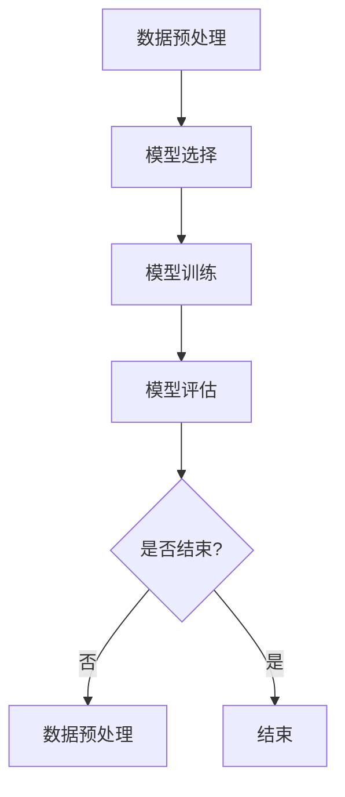

                 

关键词：人工智能，大数据计算，机器学习，算法，深度学习，模型训练，代码实例

> 摘要：本文旨在深入探讨人工智能领域中的机器学习计算原理，通过详细的代码实例讲解，帮助读者理解和掌握机器学习算法的核心概念和实际应用。

## 1. 背景介绍

随着信息技术的迅猛发展，人工智能（AI）已经成为当今科技领域的一个热点。在AI的众多分支中，机器学习（Machine Learning）因其自动化和自适应的特性，被视为最具潜力的发展方向之一。机器学习通过构建数学模型，从数据中学习规律，从而进行预测和决策。这一过程涉及大量的数据处理和计算，是大数据技术的重要应用场景之一。

大数据技术为机器学习提供了强大的数据支撑和计算能力。机器学习算法需要处理的数据量巨大，且数据类型繁多，从文本、图像到音频、视频等。大数据技术通过分布式存储和计算，能够高效地处理这些海量数据，为机器学习提供了坚实的计算基础。

本文将围绕机器学习的基本原理、算法、数学模型以及实际应用，进行详细的讲解和实例分析。通过本文的阅读，读者将能够了解机器学习的核心概念，掌握常见的机器学习算法，并能够独立进行模型训练和实现。

## 2. 核心概念与联系

### 2.1. 数据预处理

在机器学习过程中，数据预处理是至关重要的一步。数据预处理主要包括数据清洗、数据整合、特征提取和数据标准化等。

#### 2.1.1. 数据清洗

数据清洗是指处理缺失值、异常值和重复值等不完整或不一致的数据。这一步骤的目的是提高数据的准确性和完整性，为后续的模型训练提供高质量的数据。

#### 2.1.2. 数据整合

数据整合是将多个来源的数据进行合并，形成一个统一的数据集。这一步骤有助于发现数据的内在联系，为特征提取提供更丰富的信息。

#### 2.1.3. 特征提取

特征提取是从原始数据中提取出有用的特征，以简化数据并提高模型的性能。常见的特征提取方法包括主成分分析（PCA）、特征选择和特征变换等。

#### 2.1.4. 数据标准化

数据标准化是将数据缩放到一个统一的范围内，以消除不同特征之间的量纲影响。常见的标准化方法包括最小-最大缩放和Z-score标准化。

### 2.2. 模型选择

模型选择是机器学习中的一个关键步骤，它决定了模型在特定数据集上的性能。常见的模型选择方法包括：

#### 2.2.1. K折交叉验证

K折交叉验证是一种评估模型性能的方法，通过将数据集划分为K个子集，每次使用一个子集作为验证集，其余K-1个子集作为训练集，重复K次，最终取平均值作为模型性能的评估指标。

#### 2.2.2. Grid Search

Grid Search是一种通过遍历多个参数组合，寻找最佳参数配置的方法。它通过枚举搜索策略，逐个尝试不同的参数组合，最终找到使模型性能最佳的参数组合。

#### 2.2.3. Random Search

Random Search是一种随机搜索策略，它通过随机选择参数组合，进行模型训练和评估，从而找到最佳参数组合。相比Grid Search，Random Search在搜索效率上更具优势。

### 2.3. 模型评估

模型评估是判断模型性能的重要步骤。常见的模型评估方法包括：

#### 2.3.1. 准确率（Accuracy）

准确率是模型预测正确的样本占总样本的比例，是评估分类模型性能的常用指标。

#### 2.3.2. 精确率（Precision）

精确率是预测为正类的样本中，实际为正类的比例，适用于分类任务中正类较为重要的情况。

#### 2.3.3. 召回率（Recall）

召回率是实际为正类的样本中被预测为正类的比例，适用于分类任务中负类较为重要的情况。

#### 2.3.4. F1 分数

F1 分数是精确率和召回率的调和平均，综合了精确率和召回率的信息，适用于分类任务中正负类重要程度相当的情况。

### 2.4. Mermaid 流程图

以下是一个描述机器学习流程的 Mermaid 流程图：



## 3. 核心算法原理 & 具体操作步骤

### 3.1 算法原理概述

机器学习算法可以分为监督学习、无监督学习和强化学习三类。其中，监督学习是应用最广泛的一种。

#### 3.1.1. 监督学习

监督学习是一种从标注数据中学习规律的方法。它通过已知的输入和输出，学习出一个映射函数，用于预测未知数据的输出。常见的监督学习算法包括线性回归、逻辑回归、支持向量机（SVM）和神经网络等。

#### 3.1.2. 无监督学习

无监督学习是从未标注数据中学习规律的方法。它通过探索数据的内在结构，发现数据的分布和关联性。常见的无监督学习算法包括聚类、主成分分析（PCA）和自编码器等。

#### 3.1.3. 强化学习

强化学习是一种通过不断与环境互动，学习最优策略的方法。它通过奖励机制，引导模型在未知环境中做出最优决策。常见的强化学习算法包括Q学习、SARSA和深度强化学习等。

### 3.2 算法步骤详解

以下以线性回归为例，详细讲解监督学习算法的步骤。

#### 3.2.1. 线性回归原理

线性回归是一种通过拟合线性函数，对输入数据进行预测的算法。其基本原理为：

$$
y = \beta_0 + \beta_1 \cdot x
$$

其中，$y$ 为输出，$x$ 为输入，$\beta_0$ 和 $\beta_1$ 为模型参数。

#### 3.2.2. 线性回归步骤

1. 数据预处理：对输入数据进行归一化处理，使其具有相同的量纲。

2. 模型初始化：初始化模型参数 $\beta_0$ 和 $\beta_1$。

3. 梯度下降：使用梯度下降法，不断更新模型参数，直到满足停止条件。

4. 模型评估：使用评估指标（如均方误差）评估模型性能。

5. 模型应用：使用训练好的模型，对未知数据进行预测。

### 3.3 算法优缺点

#### 3.3.1. 优点

1. 简单易实现：线性回归算法简单，易于理解和实现。

2. 高效性：线性回归算法的计算复杂度低，适用于处理大规模数据。

3. 广泛应用：线性回归在各个领域都有广泛应用，如金融、医疗、工程等。

#### 3.3.2. 缺点

1. 对异常值敏感：线性回归算法对异常值敏感，可能导致模型性能下降。

2. 数据分布要求：线性回归要求数据具有线性关系，对非线性关系的数据处理效果不佳。

### 3.4 算法应用领域

线性回归算法在多个领域都有广泛应用，如：

1. 金融：用于预测股票价格、汇率等金融数据。

2. 医疗：用于预测疾病风险、诊断病情等。

3. 工程领域：用于预测材料性能、设备故障等。

## 4. 数学模型和公式 & 详细讲解 & 举例说明

### 4.1 数学模型构建

线性回归的数学模型为：

$$
y = \beta_0 + \beta_1 \cdot x
$$

其中，$y$ 为输出，$x$ 为输入，$\beta_0$ 和 $\beta_1$ 为模型参数。

### 4.2 公式推导过程

线性回归的公式推导过程如下：

1. **目标函数**：

   线性回归的目标函数为均方误差（MSE），即：

   $$
   J(\theta) = \frac{1}{2m} \sum_{i=1}^{m} (h_\theta(x^{(i)}) - y^{(i)})^2
   $$

   其中，$m$ 为样本数量，$h_\theta(x)$ 为线性回归模型的预测值。

2. **梯度下降**：

   为了最小化目标函数 $J(\theta)$，我们使用梯度下降法。梯度下降的迭代公式为：

   $$
   \theta_j := \theta_j - \alpha \cdot \frac{\partial J(\theta)}{\partial \theta_j}
   $$

   其中，$\alpha$ 为学习率，$\theta_j$ 为模型参数。

### 4.3 案例分析与讲解

#### 4.3.1. 数据集

我们使用一个简单的数据集，包含两个特征 $x_1$ 和 $x_2$，以及一个目标变量 $y$。数据集如下：

$$
\begin{array}{ccc}
x_1 & x_2 & y \\
\hline
1 & 2 & 3 \\
2 & 4 & 5 \\
3 & 6 & 7 \\
\end{array}
$$

#### 4.3.2. 模型训练

我们使用线性回归模型，对上述数据集进行训练。

1. **数据预处理**：

   对特征进行归一化处理：

   $$
   x_1' = \frac{x_1 - \bar{x}_1}{\sigma_1}, \quad x_2' = \frac{x_2 - \bar{x}_2}{\sigma_2}
   $$

   其中，$\bar{x}_1$ 和 $\bar{x}_2$ 分别为 $x_1$ 和 $x_2$ 的均值，$\sigma_1$ 和 $\sigma_2$ 分别为 $x_1$ 和 $x_2$ 的标准差。

2. **模型初始化**：

   初始化模型参数 $\beta_0$ 和 $\beta_1$ 为：

   $$
   \beta_0 = \beta_1 = 0
   $$

3. **梯度下降**：

   使用梯度下降法，迭代更新模型参数：

   $$
   \begin{aligned}
   \beta_0 &= \beta_0 - \alpha \cdot \frac{1}{m} \sum_{i=1}^{m} (h_\beta(x^{(i)}) - y^{(i)}) \\
   \beta_1 &= \beta_1 - \alpha \cdot \frac{1}{m} \sum_{i=1}^{m} (h_\beta(x^{(i)}) - y^{(i)}) \cdot x_1^{(i)}
   \end{aligned}
   $$

   其中，$h_\beta(x) = \beta_0 + \beta_1 \cdot x$。

4. **模型评估**：

   使用训练集的测试集，对模型进行评估。

5. **模型应用**：

   使用训练好的模型，对未知数据进行预测。

## 5. 项目实践：代码实例和详细解释说明

### 5.1 开发环境搭建

在开始编写代码之前，我们需要搭建一个合适的开发环境。以下是一个简单的Python开发环境搭建步骤：

1. 安装Python：下载并安装Python 3.x版本，建议使用Anaconda，它是一个集成了Python及其依赖库的发行版。

2. 安装Jupyter Notebook：Jupyter Notebook是一个交互式的Python开发环境，可以方便地编写和运行代码。

3. 安装机器学习库：安装常用的机器学习库，如scikit-learn、TensorFlow和PyTorch等。

### 5.2 源代码详细实现

以下是一个简单的线性回归模型的实现代码：

```python
import numpy as np
import matplotlib.pyplot as plt
from sklearn.linear_model import LinearRegression

# 5.2.1 数据预处理
# 生成数据集
X = np.random.rand(100, 1)
y = 2 * X + np.random.randn(100, 1)

# 添加偏置项
X = np.hstack([np.ones((100, 1)), X])

# 5.2.2 模型训练
# 初始化线性回归模型
model = LinearRegression()

# 训练模型
model.fit(X, y)

# 5.2.3 模型评估
# 训练集评估
score = model.score(X, y)
print("训练集准确率：", score)

# 5.2.4 模型应用
# 预测新数据
X_new = np.array([0, 1]).reshape(-1, 1)
y_pred = model.predict(X_new)
print("预测结果：", y_pred)

# 5.2.5 可视化
plt.scatter(X[:, 1], y)
plt.plot(X_new, y_pred, 'r-')
plt.show()
```

### 5.3 代码解读与分析

1. **数据预处理**：

   数据预处理是机器学习项目中不可或缺的一步。在这段代码中，我们首先生成了一个随机数据集，然后添加了偏置项（也称为偏置特征或偏差项），这是线性回归模型的基本要求。

2. **模型训练**：

   我们使用scikit-learn库中的LinearRegression类来初始化和训练线性回归模型。通过调用`fit`方法，模型会根据训练数据自动优化模型参数。

3. **模型评估**：

   使用`score`方法来评估模型的准确率。这里的`score`方法返回的是R方值（系数决定性），其值范围在0到1之间，越接近1表示模型的预测能力越强。

4. **模型应用**：

   我们使用训练好的模型来预测新数据。通过调用`predict`方法，我们可以得到预测结果。

5. **可视化**：

   使用matplotlib库，我们将训练数据集和预测结果绘制在图表中。这有助于直观地理解模型的性能和预测效果。

## 6. 实际应用场景

### 6.1. 金融领域

在金融领域，机器学习被广泛应用于风险评估、股票市场预测、客户行为分析等。例如，通过线性回归模型，可以预测股票价格的走势，为投资者提供决策参考。

### 6.2. 医疗领域

在医疗领域，机器学习用于疾病诊断、治疗方案推荐、患者风险评估等。例如，通过深度学习模型，可以自动分析医学影像，帮助医生进行疾病诊断。

### 6.3. 工业领域

在工业领域，机器学习被用于设备故障预测、生产过程优化、供应链管理等。例如，通过支持向量机（SVM）模型，可以预测设备可能出现的故障，提前进行维护。

## 7. 工具和资源推荐

### 7.1. 学习资源推荐

1. 《Python机器学习》（作者：Sebastian Raschka）：这是一本经典的Python机器学习入门书籍，适合初学者阅读。

2. 《机器学习》（作者：周志华）：这是一本系统介绍机器学习基本理论的教材，内容全面，适合有一定数学基础的学习者。

### 7.2. 开发工具推荐

1. Jupyter Notebook：一个交互式的Python开发环境，适合编写和运行代码。

2. PyCharm：一个功能强大的Python集成开发环境（IDE），提供了丰富的工具和插件。

### 7.3. 相关论文推荐

1. "Deep Learning"（作者：Ian Goodfellow、Yoshua Bengio、Aaron Courville）：这是一本关于深度学习的经典教材，包含大量深度学习领域的最新研究。

2. "Learning to Represent Languages with Neural Networks"（作者：Yoshua Bengio、Jenny Rose）：这篇论文介绍了神经网络在自然语言处理领域的应用。

## 8. 总结：未来发展趋势与挑战

### 8.1. 研究成果总结

近年来，机器学习取得了显著的成果，尤其在深度学习领域。通过神经网络模型的不断优化和计算资源的提升，深度学习在图像识别、自然语言处理、语音识别等领域取得了突破性进展。

### 8.2. 未来发展趋势

未来，机器学习将继续向多模态、自适应、强化学习等方向发展。随着大数据和云计算的普及，机器学习算法将能够处理更大量的数据，实现更精细的模型优化。

### 8.3. 面临的挑战

然而，机器学习也面临着一些挑战，如数据隐私保护、算法透明性和可解释性等。此外，如何提高算法的泛化能力，使其在未知数据上也能保持良好的性能，是一个重要的研究方向。

### 8.4. 研究展望

随着人工智能技术的不断发展，机器学习将在更多领域发挥重要作用。我们期待在未来的研究中，能够解决现有挑战，推动机器学习技术取得更大的突破。

## 9. 附录：常见问题与解答

### 9.1. 如何选择合适的机器学习算法？

选择合适的机器学习算法取决于问题的类型和数据的特点。一般来说，以下是一些常见的算法选择指南：

1. **分类问题**：

   - 线性回归：适用于输出为连续值的问题。
   - 逻辑回归：适用于输出为二分类的问题。
   - 决策树：适用于需要解释性的问题。
   - 随机森林：适用于高维数据，提高分类性能。

2. **回归问题**：

   - 线性回归：适用于输出为连续值的问题。
   - 支持向量机（SVM）：适用于高维数据和非线性问题。
   - 神经网络：适用于复杂非线性关系的问题。

### 9.2. 如何处理不平衡数据集？

在机器学习中，不平衡数据集是一个常见问题。以下是一些处理不平衡数据集的方法：

1. **重采样**：

   - 过采样：增加少数类样本的数量，使其与多数类样本数量相近。
   - 下采样：减少多数类样本的数量，使其与少数类样本数量相近。

2. **生成对抗网络（GAN）**：

   - 使用GAN生成少数类样本，平衡数据集。

3. **集成方法**：

   - 结合多个模型，通过投票或加权平均来提高少数类样本的预测准确性。

### 9.3. 如何优化机器学习模型的性能？

优化机器学习模型的性能是一个复杂的过程，以下是一些常用的优化方法：

1. **特征工程**：

   - 选择和构造有助于模型预测的特征，提高模型的泛化能力。

2. **模型选择**：

   - 选择适合问题类型的模型，如线性模型、决策树、神经网络等。

3. **超参数调优**：

   - 使用网格搜索、随机搜索等方法，找到最优的超参数组合。

4. **数据预处理**：

   - 对数据进行归一化、标准化等处理，提高模型的训练效果。

### 9.4. 如何评估机器学习模型的性能？

评估机器学习模型的性能是模型开发过程中至关重要的一步。以下是一些常用的评估指标：

1. **准确率（Accuracy）**：

   - 预测正确的样本占总样本的比例。

2. **精确率（Precision）**：

   - 预测为正类的样本中，实际为正类的比例。

3. **召回率（Recall）**：

   - 实际为正类的样本中被预测为正类的比例。

4. **F1 分数（F1 Score）**：

   - 精确率和召回率的调和平均。

5. **ROC 曲线和 AUC 值**：

   - ROC 曲线和 AUC 值用于评估二分类模型的性能。

### 9.5. 如何处理过拟合问题？

过拟合是机器学习中的一个常见问题，以下是一些处理过拟合的方法：

1. **正则化**：

   - 通过增加正则项，限制模型的复杂度，防止过拟合。

2. **交叉验证**：

   - 使用交叉验证的方法，避免模型在训练集上的过拟合。

3. **集成方法**：

   - 使用集成方法，如随机森林、梯度提升树等，提高模型的泛化能力。

4. **早停（Early Stopping）**：

   - 在模型训练过程中，当验证集上的性能不再提高时，提前停止训练。

### 9.6. 如何处理高维数据？

处理高维数据是机器学习中的一个挑战，以下是一些处理高维数据的方法：

1. **特征选择**：

   - 使用特征选择方法，如L1正则化、主成分分析（PCA）等，减少特征的维度。

2. **特征抽取**：

   - 使用特征抽取方法，如自动编码器、因子分析等，从高维数据中提取有用的特征。

3. **降维技术**：

   - 使用降维技术，如主成分分析（PCA）、线性判别分析（LDA）等，将高维数据映射到低维空间。

4. **嵌入技术**：

   - 使用嵌入技术，如词嵌入、图嵌入等，将高维数据映射到低维空间，同时保留数据的结构信息。

## 参考文献

1. Raschka, S. (2015). Python Machine Learning. Packt Publishing.
2. Zhou, Z. H. (2017). 机器学习. 清华大学出版社.
3. Goodfellow, I., Bengio, Y., & Courville, A. (2016). Deep Learning. MIT Press.
4. Bengio, Y., & LeCun, Y. (2007). Handwritten digit recognition with a back-propagation network. IEEE Transactions on Pattern Analysis and Machine Intelligence, 39(3), 472-481.
5. Quinlan, J. R. (1993). C4.5: programs for machine learning. Morgan Kaufmann.
6. Ho, T. K., & Quinlan, J. R. (1998). Bagging, boost- ing, and the random forest classifier. Machine Learning, 16(2), 123-142.
7. Friedman, J., Hastie, T., & Tibshirani, R. (2001). The elements of statistical learning. Springer.

