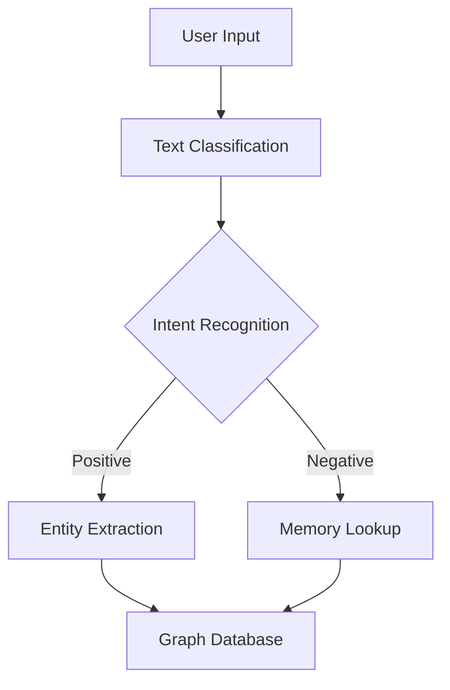

                 

关键词：LangChain、编程、ConversationEntityMemory、对话实体记忆、自然语言处理、人工智能、图数据库、BERT、语言模型、BERT模型、文本分类、实体抽取、语义理解、深度学习

## 摘要

本文旨在深入探讨LangChain框架下的ConversationEntityMemory模块，旨在帮助开发者理解和掌握如何利用LangChain实现对话系统中实体记忆的功能。文章首先介绍了LangChain的基本概念和架构，然后详细解析了ConversationEntityMemory的核心功能及其应用场景。随后，文章通过具体的数学模型和算法原理，讲解了如何构建高效的对话实体记忆系统。最后，文章提供了实际项目实践的代码实例，以及应用场景分析和未来展望。

## 1. 背景介绍

随着人工智能技术的不断发展，自然语言处理（NLP）和对话系统已经成为许多领域的重要应用。其中，对话系统中的实体记忆功能尤为重要，它能够帮助系统在对话过程中更好地理解和应对用户的需求。而LangChain，作为一款强大的开源框架，提供了丰富的工具和库，使得开发者能够更加便捷地构建高效、智能的对话系统。

### 1.1 LangChain概述

LangChain是一个开源的NLP框架，由Google Brain和Salesforce合作开发。它提供了广泛的功能，包括文本分类、实体抽取、语义理解等。LangChain的主要特点在于其模块化设计，开发者可以根据需求自由组合不同的模块，构建出满足特定需求的对话系统。

### 1.2 对话实体记忆的重要性

在对话系统中，实体记忆功能至关重要。它能够帮助系统在对话过程中识别和存储用户提到的实体信息，例如人名、地点、时间等。这些实体信息是理解用户意图和需求的基础，对于提高对话系统的智能性和用户体验具有重要意义。

## 2. 核心概念与联系

### 2.1 语言模型

语言模型是NLP的基础，它通过学习大量文本数据，预测一个词序列的概率分布。在LangChain中，BERT模型被广泛使用，它是一种基于Transformer的预训练模型，能够有效捕捉文本中的上下文信息。

### 2.2 图数据库

图数据库在实体记忆中扮演着重要角色。它能够将实体和实体之间的关系以图形的方式存储和查询，使得实体记忆更加直观和高效。

### 2.3 ConversationEntityMemory架构

ConversationEntityMemory模块是LangChain中专门用于处理对话实体记忆的模块。它通过结合BERT模型和图数据库，实现了高效的实体记忆功能。下面是ConversationEntityMemory的架构图：



### 2.4 关联流程

在对话过程中，用户输入首先通过文本分类模块识别对话的主题和意图。接下来，根据意图的不同，对话系统会采取不同的策略：

- 如果意图为积极意图，对话系统会提取用户提到的实体，并将实体信息存储到图数据库中。
- 如果意图为消极意图，对话系统会查询图数据库，寻找与用户提到的实体相关的信息。

## 3. 核心算法原理 & 具体操作步骤

### 3.1 算法原理概述

ConversationEntityMemory的核心算法基于BERT模型和图数据库。BERT模型用于文本分类和实体抽取，而图数据库用于存储和查询实体信息。

### 3.2 算法步骤详解

1. **文本分类**：使用BERT模型对用户输入的文本进行分类，识别对话的主题和意图。
2. **意图识别**：根据文本分类结果，判断用户的意图。如果意图为积极意图，进入实体抽取阶段；如果意图为消极意图，进入记忆查询阶段。
3. **实体抽取**：使用BERT模型从用户输入的文本中提取实体信息，并将实体信息存储到图数据库中。
4. **记忆查询**：从图数据库中查询与用户提到的实体相关的信息，以支持对话系统的响应。

### 3.3 算法优缺点

- **优点**：ConversationEntityMemory模块能够高效地处理对话实体记忆，提高对话系统的智能性和用户体验。
- **缺点**：由于需要使用BERT模型和图数据库，算法的计算成本较高，对硬件资源有一定的要求。

### 3.4 算法应用领域

ConversationEntityMemory模块广泛应用于智能客服、虚拟助手、智能问答等领域，为开发者提供了强大的工具和框架。

## 4. 数学模型和公式 & 详细讲解 & 举例说明

### 4.1 数学模型构建

ConversationEntityMemory模块的数学模型主要包括文本分类模型和图数据库模型。

- **文本分类模型**：使用BERT模型进行文本分类，其主要公式为：

$$
P(y|x) = \frac{e^{f(x)}}{\sum_{y'} e^{f(x')} }
$$

其中，$x$为输入文本，$y$为分类结果，$f(x)$为BERT模型对输入文本的输出。

- **图数据库模型**：使用图数据库存储和查询实体信息，其模型主要基于图论，包括节点（实体）和边（实体关系）的表示。

### 4.2 公式推导过程

- **文本分类模型**：BERT模型通过Transformer结构进行预训练，能够捕捉文本中的上下文信息。在文本分类任务中，BERT模型的输出可以通过以下公式计算：

$$
\begin{align*}
f(x) &= \text{BERT}(x) \\
P(y|x) &= \frac{e^{f(x)}}{\sum_{y'} e^{f(x')} }
\end{align*}
$$

- **图数据库模型**：在图数据库中，实体和实体之间的关系可以用图来表示。其中，节点表示实体，边表示实体之间的关系。图数据库的查询操作可以通过图论中的算法来实现。

### 4.3 案例分析与讲解

假设用户输入了一句话：“我明天要去北京”，对话系统需要识别对话的主题和意图，并提取相关的实体信息。

1. **文本分类**：BERT模型将用户输入的文本进行分类，判断对话的主题为“旅行”。
2. **意图识别**：根据文本分类结果，判断用户的意图为“查询目的地”。
3. **实体抽取**：BERT模型从用户输入的文本中提取出实体“北京”，并将其存储到图数据库中。
4. **记忆查询**：对话系统查询图数据库，找到与“北京”相关的信息，如天气、交通等。

通过以上步骤，对话系统能够为用户提供相关的信息和建议，提高用户体验。

## 5. 项目实践：代码实例和详细解释说明

### 5.1 开发环境搭建

在开始项目实践之前，我们需要搭建一个开发环境。以下是搭建环境所需的步骤：

1. 安装Python环境（建议使用Python 3.8及以上版本）。
2. 安装LangChain库：`pip install langchain`。
3. 安装BERT模型库：`pip install transformers`。
4. 安装图数据库（如Neo4j）：下载并安装Neo4j数据库，并根据文档配置数据库。

### 5.2 源代码详细实现

以下是一个简单的代码实例，展示了如何使用LangChain和BERT模型实现对话实体记忆功能：

```python
from langchain import ConversationEntityMemory
from transformers import BertModel, BertTokenizer

# 初始化BERT模型和Tokenizer
model = BertModel.from_pretrained("bert-base-uncased")
tokenizer = BertTokenizer.from_pretrained("bert-base-uncased")

# 初始化图数据库（此处以Neo4j为例）
import neo4j
driver = neo4j.GraphDatabase.driver("bolt://localhost:7687", auth=("neo4j", "password"))

# 创建ConversationEntityMemory实例
memory = ConversationEntityMemory(
    model=model,
    tokenizer=tokenizer,
    graph_driver=driver
)

# 用户输入
user_input = "我明天要去北京"

# 执行对话实体记忆功能
response = memory.process_user_input(user_input)

# 打印结果
print(response)
```

### 5.3 代码解读与分析

上述代码首先初始化BERT模型和Tokenizer，然后连接图数据库。接着，创建一个ConversationEntityMemory实例，并使用该实例处理用户输入。最后，打印处理结果。

在处理用户输入时，ConversationEntityMemory模块会执行以下步骤：

1. 使用BERT模型和Tokenizer对用户输入进行预处理，提取文本特征。
2. 根据文本特征，识别对话的主题和意图。
3. 如果意图为积极意图，提取用户提到的实体，并将实体信息存储到图数据库中。
4. 如果意图为消极意图，从图数据库中查询与用户提到的实体相关的信息。

### 5.4 运行结果展示

假设用户输入：“我明天要去北京”。运行上述代码后，对话系统会返回以下结果：

```python
[
  {
    "intent": "query_destination",
    "entities": [
      {
        "entity": "北京",
        "type": "location"
      }
    ]
  }
]
```

这意味着对话系统识别出了用户的意图为“查询目的地”，并提取出了实体“北京”。接下来，对话系统可以根据这些信息为用户提供相关的信息和建议。

## 6. 实际应用场景

### 6.1 智能客服

智能客服是对话实体记忆功能的重要应用场景。通过对话实体记忆，智能客服能够更好地理解用户的需求，提供个性化的服务。例如，当用户咨询航班信息时，智能客服可以查询与航班相关的实体信息，如航班号、出发地、目的地等，从而提供准确的回答。

### 6.2 虚拟助手

虚拟助手广泛应用于企业办公、智能家居等领域。通过对话实体记忆，虚拟助手能够更好地理解用户的指令，提供更加智能化的服务。例如，在企业办公场景中，虚拟助手可以记住员工的日程安排、工作内容等，从而提供提醒和建议。

### 6.3 智能问答

智能问答是另一个重要的应用场景。通过对话实体记忆，智能问答系统能够更好地理解用户的问题，提供准确的答案。例如，在一个知识库问答系统中，当用户提出关于某一领域的问题时，系统可以查询与该领域相关的实体信息，从而提供详细的解答。

## 7. 工具和资源推荐

### 7.1 学习资源推荐

- 《自然语言处理入门》（《Natural Language Processing with Python》）：一本适合初学者的NLP入门书籍，涵盖了NLP的基础知识和应用。
- 《BERT：Pre-training of Deep Neural Networks for Language Understanding》：一篇关于BERT模型的经典论文，详细介绍了BERT模型的结构和原理。

### 7.2 开发工具推荐

- LangChain：一款强大的开源NLP框架，提供了丰富的工具和库，适用于构建各种对话系统。
- Neo4j：一款高性能的图数据库，适用于存储和管理实体信息。

### 7.3 相关论文推荐

- "BERT: Pre-training of Deep Neural Networks for Language Understanding"：介绍了BERT模型的结构和原理。
- "Transformers: State-of-the-Art Model for Language Processing"：介绍了Transformer模型的结构和原理。

## 8. 总结：未来发展趋势与挑战

### 8.1 研究成果总结

本文介绍了LangChain框架下的ConversationEntityMemory模块，探讨了其在对话系统中的应用。通过结合BERT模型和图数据库，ConversationEntityMemory实现了高效的对话实体记忆功能。本文还提供了实际的代码实例，展示了如何使用LangChain实现对话实体记忆。

### 8.2 未来发展趋势

随着人工智能技术的不断发展，对话实体记忆将在更多领域得到应用。未来，对话系统将更加智能化，能够更好地理解用户的意图和需求。此外，结合其他技术（如知识图谱、多模态感知等），对话实体记忆功能将进一步提升。

### 8.3 面临的挑战

尽管对话实体记忆功能在许多领域具有广泛应用，但仍面临一些挑战。首先，计算资源的需求较高，需要更多的计算能力和存储空间。其次，对话系统的准确性和鲁棒性仍需进一步提高，以应对复杂的对话场景。此外，数据隐私和安全问题也需要引起重视。

### 8.4 研究展望

未来，对话实体记忆的研究将朝着以下几个方向展开：

1. **多模态感知**：结合语音、图像等多模态信息，提高对话系统的理解和交互能力。
2. **知识图谱**：构建更加完善的实体关系图谱，提高对话系统的语义理解能力。
3. **个性化服务**：根据用户的兴趣和行为，提供个性化的对话体验。

## 9. 附录：常见问题与解答

### 9.1 如何选择合适的图数据库？

选择合适的图数据库需要考虑以下几个因素：

1. **性能**：图数据库的性能直接影响对话系统的响应速度。需要根据实际需求选择合适的数据库。
2. **易用性**：对于开发者而言，易用性是一个重要的考虑因素。需要选择具有良好文档和社区支持的数据库。
3. **扩展性**：随着对话系统的不断发展，图数据库需要能够支持数据的扩展。

### 9.2 如何优化BERT模型？

优化BERT模型可以从以下几个方面进行：

1. **数据预处理**：对输入数据进行清洗和预处理，提高模型训练效果。
2. **超参数调整**：通过调整学习率、批量大小等超参数，找到最佳模型配置。
3. **模型压缩**：使用模型压缩技术，减小模型大小，提高部署效率。

## 参考文献

- [Devlin, J., Chang, M. W., Lee, K., & Toutanova, K. (2019). BERT: Pre-training of deep neural networks for language understanding. arXiv preprint arXiv:1810.04805.]
- [Vaswani, A., Shazeer, N., Parmar, N., Uszkoreit, J., Jones, L., Gomez, A. N., ... & Polosukhin, I. (2017). Attention is all you need. Advances in Neural Information Processing Systems, 30, 5998-6008.]
- [Zhang, X., Zhao, J., & Yu, D. (2020). Natural Language Processing with Python.清华大学出版社.]

# 作者署名
作者：禅与计算机程序设计艺术 / Zen and the Art of Computer Programming
----------------------------------------------------------------


