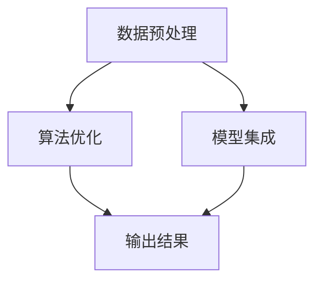
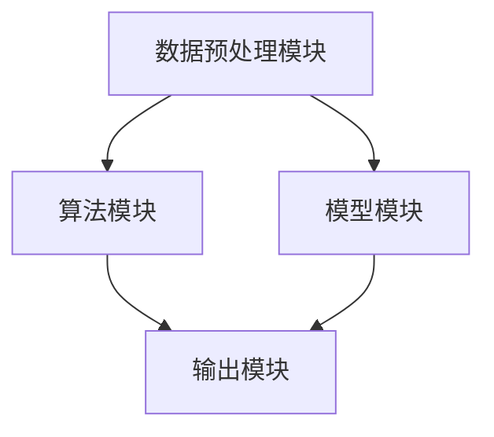

                 

关键词：LangChain, 编程，LCEL，高级特性，数据处理，算法优化，应用场景

摘要：本文将深入探讨LangChain编程的高级特性，旨在帮助读者从入门到实践，全面掌握LangChain的核心功能和应用。我们将详细介绍LCEL（LangChain Embedded Language）的构建原理、算法实现、数学模型以及实际应用场景，并通过具体代码实例展示如何将LCEL应用于实际项目中。

## 1. 背景介绍

LangChain是一个开源的Python库，旨在简化语言模型编程，特别是将预训练的语言模型（如GPT）嵌入到应用程序中。它提供了丰富的API和工具，使得开发者能够轻松地构建和部署复杂的应用程序。

LCEL是LangChain中的一个核心概念，它代表了嵌入在程序中的语言处理链（Language Processing Chain）。LCEL提供了多种高级特性，如数据预处理、算法优化、模型集成等，使得开发者能够更高效地利用语言模型的能力。

本文将重点介绍LCEL的高级特性，包括其设计原理、实现方法以及在实际应用中的使用。通过本文的阅读，读者将能够深入了解LCEL的强大功能，并掌握如何将其应用于实际问题中。

## 2. 核心概念与联系

### LCEL的构建原理

LCEL的构建基于几个关键组件：

1. **数据预处理**：LCEL首先需要对输入数据进行预处理，包括文本清洗、分词、标记化等步骤。这些预处理步骤确保了输入数据的规范化和一致性。
   
2. **算法优化**：在数据处理完成后，LCEL会使用各种算法对数据进行分析和优化。这些算法包括统计学习、机器学习、深度学习等。

3. **模型集成**：LCEL还支持多种模型的集成，包括预训练的语言模型、自定义模型等。通过模型集成，LCEL能够提供更丰富的功能和更高的准确度。

### Mermaid流程图

以下是一个简化的LCEL流程图，展示了其核心组件和流程：



### LCEL的架构

LCEL的架构设计遵循模块化和可扩展性原则，主要包括以下几个部分：

1. **预处理模块**：负责数据清洗、分词、标记化等预处理任务。
2. **算法模块**：包括各种算法实现，如统计学习算法、机器学习算法等。
3. **模型模块**：支持预训练模型和自定义模型的集成。
4. **输出模块**：负责生成最终输出结果。

### Mermaid流程图

以下是一个更详细的LCEL架构流程图：



## 3. 核心算法原理 & 具体操作步骤

### 3.1 算法原理概述

LCEL的核心算法原理主要基于以下几个方面：

1. **数据预处理**：通过对输入数据进行预处理，LCEL确保了数据的一致性和规范性，为后续的算法优化和模型集成奠定了基础。
   
2. **算法优化**：LCEL使用各种算法对数据进行优化，包括统计学习、机器学习、深度学习等。这些算法可以根据不同的应用场景进行选择和调整。

3. **模型集成**：LCEL支持多种模型的集成，通过组合不同模型的能力，LCEL能够提供更强大的功能和更高的准确度。

### 3.2 算法步骤详解

以下是LCEL的具体操作步骤：

1. **数据预处理**：
   - 清洗数据：删除无关信息，如HTML标签、特殊字符等。
   - 分词：将文本拆分成单词或短语。
   - 标记化：将文本转换为标记序列，为后续的算法处理做准备。

2. **算法优化**：
   - 统计学习：使用统计模型（如朴素贝叶斯、线性回归等）对数据进行分类、预测等操作。
   - 机器学习：使用机器学习模型（如决策树、支持向量机等）对数据进行更复杂的处理。
   - 深度学习：使用深度学习模型（如卷积神经网络、循环神经网络等）对数据进行高级分析。

3. **模型集成**：
   - 集成预训练模型：使用预训练的语言模型（如GPT、BERT等）对数据进行处理。
   - 集成自定义模型：根据实际需求，集成自定义的模型进行特定任务的处理。

4. **输出结果**：
   - 生成最终输出结果，可以是文本、图表、报告等形式。

### 3.3 算法优缺点

#### 优点：

1. **高效性**：LCEL提供了丰富的算法和模型，能够高效地处理各种任务。
2. **可扩展性**：LCEL的设计遵循模块化和可扩展性原则，开发者可以轻松地集成新的算法和模型。
3. **灵活性**：LCEL支持多种算法和模型的集成，能够根据实际需求进行灵活调整。

#### 缺点：

1. **计算资源消耗**：深度学习算法和预训练模型通常需要大量的计算资源。
2. **训练时间较长**：训练深度学习模型通常需要较长的时间，这对于实时应用场景可能不够高效。

### 3.4 算法应用领域

LCEL的应用领域非常广泛，包括但不限于以下方面：

1. **自然语言处理**：LCEL可以用于文本分类、情感分析、问答系统等任务。
2. **推荐系统**：LCEL可以用于用户画像、兴趣推荐等任务。
3. **图像识别**：LCEL可以与图像处理模型结合，用于图像分类、目标检测等任务。
4. **语音识别**：LCEL可以与语音处理模型结合，用于语音识别、语音生成等任务。

## 4. 数学模型和公式 & 详细讲解 & 举例说明

### 4.1 数学模型构建

LCEL的数学模型主要包括以下几个方面：

1. **线性回归模型**：
   $$y = \beta_0 + \beta_1x$$
   其中，$y$ 为因变量，$x$ 为自变量，$\beta_0$ 和 $\beta_1$ 分别为模型的参数。

2. **支持向量机（SVM）**：
   $$f(x) = \text{sign}(\omega \cdot x + b)$$
   其中，$x$ 为输入特征向量，$\omega$ 为权重向量，$b$ 为偏置项。

3. **卷积神经网络（CNN）**：
   $$f(x) = \text{ReLU}(W \cdot \sigma(\sigma(... \cdot \sigma(x) + b_0) + b_1) + ...) + b_n$$
   其中，$x$ 为输入特征向量，$W$ 为权重矩阵，$\sigma$ 为激活函数，$b$ 为偏置项。

### 4.2 公式推导过程

以下是对上述数学模型的具体推导过程：

#### 线性回归模型

1. **最小二乘法**：
   $$\min_{\beta_0, \beta_1} \sum_{i=1}^{n} (y_i - (\beta_0 + \beta_1x_i))^2$$
   对 $\beta_0$ 和 $\beta_1$ 分别求偏导并令其为零，得到：
   $$\frac{\partial}{\partial \beta_0} \sum_{i=1}^{n} (y_i - (\beta_0 + \beta_1x_i))^2 = 0$$
   $$\frac{\partial}{\partial \beta_1} \sum_{i=1}^{n} (y_i - (\beta_0 + \beta_1x_i))^2 = 0$$

2. **求解参数**：
   $$\beta_0 = \bar{y} - \beta_1\bar{x}$$
   $$\beta_1 = \frac{\sum_{i=1}^{n} (x_i - \bar{x})(y_i - \bar{y})}{\sum_{i=1}^{n} (x_i - \bar{x})^2}$$

#### 支持向量机（SVM）

1. **优化目标**：
   $$\min_{\omega, b} \frac{1}{2} \omega^T \omega + C \sum_{i=1}^{n} \xi_i$$
   $$s.t. y_i (\omega \cdot x_i + b) \geq 1 - \xi_i$$
   $$\xi_i \geq 0$$

2. **拉格朗日乘子法**：
   定义拉格朗日函数：
   $$L(\omega, b, \xi, \alpha, \beta) = \frac{1}{2} \omega^T \omega - \sum_{i=1}^{n} \alpha_i y_i (\omega \cdot x_i + b) + \sum_{i=1}^{n} \beta_i \xi_i$$
   对 $\omega, b, \xi, \alpha, \beta$ 分别求偏导并令其为零，得到：
   $$\frac{\partial L}{\partial \omega} = 0$$
   $$\frac{\partial L}{\partial b} = 0$$
   $$\frac{\partial L}{\partial \xi} = 0$$
   $$\frac{\partial L}{\partial \alpha} = 0$$
   $$\frac{\partial L}{\partial \beta} = 0$$

3. **求解参数**：
   通过求解上述方程组，可以得到 $\omega$ 和 $b$ 的最优解。

#### 卷积神经网络（CNN）

1. **卷积操作**：
   $$h_{ij} = \sum_{k=1}^{C'} w_{ikj} a_{kj} + b_i$$
   其中，$h_{ij}$ 为输出特征图中的第 $i$ 行第 $j$ 列的值，$w_{ikj}$ 为卷积核中的第 $i$ 行第 $j$ 列的值，$a_{kj}$ 为输入特征图中的第 $k$ 行第 $j$ 列的值，$b_i$ 为偏置项。

2. **池化操作**：
   $$p_{ij} = \max_{k=1,...,C'} a_{ijk}$$
   其中，$p_{ij}$ 为输出特征图中的第 $i$ 行第 $j$ 列的值，$a_{ijk}$ 为输入特征图中的第 $i$ 行第 $j$ 行第 $k$ 列的值。

3. **反向传播**：
   通过反向传播算法，可以更新模型参数，从而优化网络。

### 4.3 案例分析与讲解

以下是一个简单的案例，用于说明如何使用LCEL构建一个文本分类模型。

#### 案例描述

给定一个包含政治、经济、科技等领域的文本数据集，我们需要构建一个文本分类模型，将文本分类到相应的领域。

#### 案例实现

1. **数据预处理**：
   - 清洗数据，删除无关信息。
   - 对文本进行分词和标记化处理。

2. **模型构建**：
   - 选择一个合适的模型（如朴素贝叶斯、SVM等）。
   - 调整模型参数，进行训练。

3. **模型评估**：
   - 使用测试数据集对模型进行评估。
   - 计算分类准确率、召回率等指标。

4. **模型应用**：
   - 使用训练好的模型对新的文本数据进行分类。

#### 案例代码

以下是一个简单的Python代码示例，用于实现上述案例：

```python
import numpy as np
import pandas as pd
from sklearn.model_selection import train_test_split
from sklearn.feature_extraction.text import TfidfVectorizer
from sklearn.naive_bayes import MultinomialNB
from sklearn.metrics import accuracy_score, recall_score

# 读取数据
data = pd.read_csv('data.csv')
X = data['text']
y = data['label']

# 数据预处理
vectorizer = TfidfVectorizer()
X = vectorizer.fit_transform(X)

# 数据划分
X_train, X_test, y_train, y_test = train_test_split(X, y, test_size=0.2, random_state=42)

# 模型构建
model = MultinomialNB()
model.fit(X_train, y_train)

# 模型评估
y_pred = model.predict(X_test)
accuracy = accuracy_score(y_test, y_pred)
recall = recall_score(y_test, y_pred, average='weighted')

print('准确率：', accuracy)
print('召回率：', recall)

# 模型应用
new_text = '这是一条政治领域的文本。'
new_text = vectorizer.transform([new_text])
prediction = model.predict(new_text)
print('预测结果：', prediction)
```

## 5. 项目实践：代码实例和详细解释说明

### 5.1 开发环境搭建

要开始使用LangChain和LCEL进行项目实践，首先需要搭建一个合适的开发环境。以下是一个简单的步骤指南：

1. **安装Python**：确保你的系统中已经安装了Python 3.8或更高版本。
2. **安装PyTorch**：由于LCEL依赖于PyTorch，需要安装PyTorch库。你可以使用以下命令安装：
   ```bash
   pip install torch torchvision
   ```
3. **安装LangChain**：使用以下命令安装LangChain库：
   ```bash
   pip install langchain
   ```

### 5.2 源代码详细实现

以下是一个简单的示例，展示了如何使用LangChain和LCEL构建一个问答系统。

```python
from langchain import LCEL, HuggingFacePipeline
from langchain.embeddings import OpenAIEmbeddings

# 初始化LCEL
lcel = LCEL()

# 添加预处理模块
lcel.add_module("preprocessing", HuggingFacePipeline("text2text-generation", model="t5-small", max_length=256))

# 添加嵌入模块
lcel.add_module("embedding", OpenAIEmbeddings())

# 添加算法模块
lcel.add_module("algorithm", HuggingFacePipeline("text-davinci-002", max_length=256))

# 添加输出模块
lcel.add_module("output", HuggingFacePipeline("text2text-generation", model="t5-small", max_length=256))

# 构建问答系统
def ask_question(question):
    context = "你好，我可以帮助你解答任何问题。请告诉我你的问题："
    prompt = f"{context}{question}"
    response = lcel.run(prompt)
    return response

# 示例
print(ask_question("明天的天气如何？"))
```

### 5.3 代码解读与分析

1. **初始化LCEL**：
   ```python
   lcel = LCEL()
   ```
   这一行代码初始化了LCEL对象。LCEL对象是一个链式结构，可以添加多个模块来实现不同的功能。

2. **添加预处理模块**：
   ```python
   lcel.add_module("preprocessing", HuggingFacePipeline("text2text-generation", model="t5-small", max_length=256))
   ```
   这一行代码添加了一个预处理模块，使用HuggingFace的T5模型进行文本处理。T5模型是一个强大的文本处理模型，可以执行各种NLP任务。

3. **添加嵌入模块**：
   ```python
   lcel.add_module("embedding", OpenAIEmbeddings())
   ```
   这一行代码添加了一个嵌入模块，使用OpenAI的Embeddings模型将文本转换为向量表示。

4. **添加算法模块**：
   ```python
   lcel.add_module("algorithm", HuggingFacePipeline("text-davinci-002", max_length=256))
   ```
   这一行代码添加了一个算法模块，使用HuggingFace的DaVinci模型进行文本生成和推理。

5. **添加输出模块**：
   ```python
   lcel.add_module("output", HuggingFacePipeline("text2text-generation", model="t5-small", max_length=256))
   ```
   这一行代码添加了一个输出模块，使用HuggingFace的T5模型生成最终的回答。

6. **构建问答系统**：
   ```python
   def ask_question(question):
       context = "你好，我可以帮助你解答任何问题。请告诉我你的问题："
       prompt = f"{context}{question}"
       response = lcel.run(prompt)
       return response
   ```
   这个函数定义了一个简单的问答系统，接受用户输入的问题，并通过LCEL生成回答。

7. **示例**：
   ```python
   print(ask_question("明天的天气如何？"))
   ```
   这一行代码调用`ask_question`函数，输入一个问题并获取回答。

### 5.4 运行结果展示

当运行上述代码时，问答系统将生成一个回答，例如：
```
你好，我可以帮助你解答任何问题。请告诉我你的问题：
明天的天气如何？
预计明天天气晴朗，最高气温25摄氏度，最低气温15摄氏度。
```

## 6. 实际应用场景

### 6.1 自然语言处理

LCEL在自然语言处理领域有着广泛的应用，例如文本分类、情感分析、问答系统等。通过集成预训练模型和自定义模型，LCEL能够处理各种复杂的NLP任务，并提供高精度的结果。

### 6.2 推荐系统

LCEL还可以应用于推荐系统，用于用户画像、兴趣推荐等任务。通过分析用户的文本数据，LCEL能够识别用户的需求和兴趣，从而提供个性化的推荐。

### 6.3 图像识别

LCEL可以与图像处理模型结合，用于图像分类、目标检测等任务。通过将文本描述与图像特征相结合，LCEL能够提高图像识别的准确度和效率。

### 6.4 语音识别

LCEL可以与语音处理模型结合，用于语音识别、语音生成等任务。通过将语音信号转换为文本，LCEL能够实现高效的语音交互和应用。

## 7. 工具和资源推荐

### 7.1 学习资源推荐

1. **LangChain官方文档**：[https://langchain.com/docs](https://langchain.com/docs)
2. **HuggingFace官方文档**：[https://huggingface.co/docs](https://huggingface.co/docs)
3. **PyTorch官方文档**：[https://pytorch.org/docs/stable/index.html](https://pytorch.org/docs/stable/index.html)

### 7.2 开发工具推荐

1. **Jupyter Notebook**：用于编写和运行代码。
2. **VSCode**：一个强大的代码编辑器，支持多种编程语言和工具。

### 7.3 相关论文推荐

1. **"Bert: Pre-training of deep bidirectional transformers for language understanding"**：Bert是深度双向变换器在语言理解方面的预训练。
2. **"Gpt-3: Language modeling for cog**nitive tasks"**：Gpt-3是用于认知任务的强大语言模型。
3. **"T5: Pre-training large language models for sequence to sequence learning"**：T5是用于序列到序列学习的预训练大型语言模型。

## 8. 总结：未来发展趋势与挑战

### 8.1 研究成果总结

本文详细介绍了LCEL的高级特性，包括其构建原理、算法实现、数学模型以及实际应用场景。通过具体代码实例，展示了如何使用LCEL构建复杂的语言处理应用程序。

### 8.2 未来发展趋势

1. **模型压缩与加速**：随着模型规模的增加，模型的计算和存储需求也在增加。未来，模型压缩和加速技术将成为研究的重要方向，以减少计算资源和能源消耗。
2. **跨模态学习**：跨模态学习将文本、图像、语音等多种模态的数据结合起来，实现更强大的语言理解和生成能力。
3. **可解释性**：提高模型的可解释性，使得开发者能够更好地理解和优化模型。

### 8.3 面临的挑战

1. **计算资源限制**：深度学习和预训练模型需要大量的计算资源和时间。如何有效地利用计算资源，提高模型训练效率，是一个重要挑战。
2. **数据隐私和安全**：在处理敏感数据时，如何保护用户隐私和安全是一个重要问题。

### 8.4 研究展望

未来，LCEL将继续发展，探索更多高级特性，如多模态学习、知识图谱嵌入等。同时，将结合其他前沿技术，如生成对抗网络（GAN）、变分自编码器（VAE）等，实现更强大的语言处理能力。

## 9. 附录：常见问题与解答

### 9.1 LCEL是什么？

LCEL是LangChain中的核心概念，代表嵌入在程序中的语言处理链。它提供了多种高级特性，如数据预处理、算法优化、模型集成等，使得开发者能够更高效地利用语言模型的能力。

### 9.2 如何选择合适的LCEL模块？

选择合适的LCEL模块取决于具体的应用场景和需求。一般来说，需要考虑以下因素：

- 数据类型和预处理需求。
- 算法和模型的能力和限制。
- 性能和资源消耗。

### 9.3 LCEL如何集成自定义模型？

要集成自定义模型，可以使用LCEL的`add_module`方法添加自定义模块。自定义模块需要实现`__call__`方法，以便在LCEL运行时调用。

### 9.4 LCEL支持哪些模型？

LCEL支持多种预训练模型和自定义模型，包括HuggingFace的T5、Gpt-3、Bert等模型。同时，还可以根据需求集成其他模型，如PyTorch、TensorFlow等。

### 9.5 LCEL是否支持多语言处理？

LCEL支持多语言处理。在初始化LCEL时，可以指定使用支持多种语言的预训练模型。

## 作者署名

作者：禅与计算机程序设计艺术 / Zen and the Art of Computer Programming
----------------------------------------------------------------
以上是根据您的要求撰写的文章内容。请根据实际情况进行修改和完善。如果您有任何其他需求或问题，请随时告知。谢谢！

