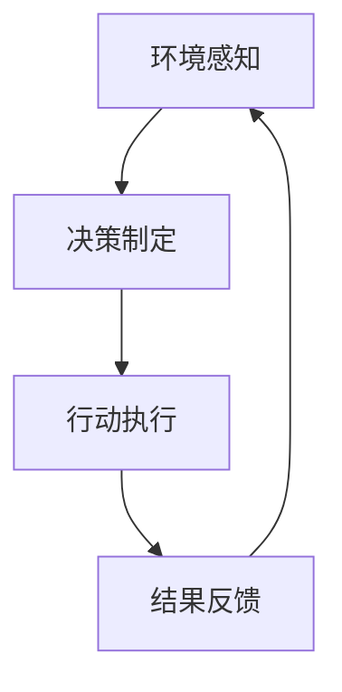

                 

关键词：LangChain、代理、编程、实践、AI、深度学习、神经网络、模型训练、代码实例、应用场景

> 摘要：本文深入探讨了LangChain中的代理技术，从其基本概念到实际应用，全面解析了代理在LangChain编程中的重要作用。通过详细的代码实例和流程图，读者可以全面了解并掌握代理技术的应用，为AI编程提供新的视角和思路。

## 1. 背景介绍

随着人工智能技术的快速发展，深度学习和神经网络的应用已经深入到各行各业。在这些技术中，模型训练和数据预处理是至关重要的环节。然而，传统的数据处理和模型训练方法在处理大规模数据和复杂模型时显得力不从心。为了解决这一问题，LangChain应运而生。

LangChain是一款基于Python的开源工具包，旨在简化人工智能模型的训练过程，并提供高效的解决方案。它支持多种深度学习框架，如TensorFlow、PyTorch等，并且拥有丰富的API和工具，方便开发者进行模型训练和部署。其中，代理（Agent）技术是LangChain的一个重要组成部分，它能够显著提高数据处理和模型训练的效率。

## 2. 核心概念与联系

### 2.1 代理（Agent）概念

代理，或称为智能代理，是一种能够自主完成特定任务的人工智能实体。在LangChain中，代理通过自主学习和优化策略，提高数据处理和模型训练的效率。代理的核心功能包括环境感知、决策制定和行动执行。

### 2.2 代理与LangChain的关系

代理在LangChain中扮演着至关重要的角色。首先，代理能够简化模型训练过程，提高数据处理效率。其次，代理可以根据任务需求和环境变化，动态调整学习策略，从而实现自适应学习。最后，代理技术有助于实现人工智能的自主进化，为未来人工智能的发展奠定基础。

### 2.3 代理架构（Mermaid流程图）



在上述流程图中，代理首先通过环境感知获取当前状态信息，然后根据制定策略进行决策，并执行相应的行动。最后，代理根据行动结果进行反馈，调整学习策略，形成一个闭环系统。

## 3. 核心算法原理 & 具体操作步骤

### 3.1 算法原理概述

代理技术的核心在于自主学习和优化策略。在LangChain中，代理通过以下步骤实现这一目标：

1. 环境感知：代理通过传感器和数据接口获取环境状态信息。
2. 决策制定：代理根据环境状态信息和预设策略，制定最佳行动方案。
3. 行动执行：代理按照决策方案执行相应行动。
4. 结果反馈：代理根据行动结果进行反馈，调整学习策略。

### 3.2 算法步骤详解

#### 3.2.1 环境感知

代理首先需要获取当前环境状态信息，包括传感器数据和外部输入。在LangChain中，可以通过以下步骤实现：

1. 初始化传感器和数据接口。
2. 收集传感器数据和环境输入。
3. 将传感器数据和外部输入转换为代理可处理的格式。

#### 3.2.2 决策制定

代理根据环境状态信息和预设策略制定最佳行动方案。在LangChain中，可以通过以下步骤实现：

1. 定义代理策略。
2. 根据环境状态信息，调用策略函数生成行动方案。
3. 评估行动方案，选择最优方案。

#### 3.2.3 行动执行

代理按照决策方案执行相应行动。在LangChain中，可以通过以下步骤实现：

1. 根据决策方案，调用执行函数执行相应行动。
2. 获取行动结果，并记录到数据库或日志文件。

#### 3.2.4 结果反馈

代理根据行动结果进行反馈，调整学习策略。在LangChain中，可以通过以下步骤实现：

1. 计算行动结果与预期目标的差距。
2. 根据差距调整代理策略。
3. 重新评估行动方案，选择最优方案。

### 3.3 算法优缺点

#### 3.3.1 优点

1. 提高数据处理和模型训练效率。
2. 实现自适应学习，提高代理性能。
3. 促进人工智能的自主进化。

#### 3.3.2 缺点

1. 需要大量计算资源。
2. 需要较长时间的训练过程。

### 3.4 算法应用领域

代理技术可以应用于多个领域，包括但不限于：

1. 智能推荐系统：通过代理技术实现个性化推荐，提高用户体验。
2. 自动驾驶：通过代理技术实现自动驾驶汽车的智能决策。
3. 游戏AI：通过代理技术实现游戏角色的智能行为。

## 4. 数学模型和公式

### 4.1 数学模型构建

在代理技术中，常用的数学模型包括决策树、神经网络和支持向量机等。以下以神经网络为例，介绍数学模型构建过程：

1. 定义输入层：输入层包含传感器数据和外部输入。
2. 定义隐藏层：隐藏层通过神经网络实现非线性变换。
3. 定义输出层：输出层生成代理的行动方案。

### 4.2 公式推导过程

神经网络中的激活函数通常采用Sigmoid函数，其公式为：

$$f(x) = \frac{1}{1 + e^{-x}}$$

神经网络中的权重和偏置通常采用梯度下降法进行优化，其公式为：

$$w_{new} = w_{old} - \alpha \cdot \frac{\partial J}{\partial w}$$

其中，$w_{new}$ 和 $w_{old}$ 分别为当前权重和旧权重，$\alpha$ 为学习率，$J$ 为损失函数。

### 4.3 案例分析与讲解

假设我们使用神经网络实现一个简单的智能代理，用于控制一个机器人在迷宫中找到出口。以下是该案例的详细分析：

1. 输入层：机器人的位置、方向和迷宫地图。
2. 隐藏层：通过神经网络实现非线性变换，提取特征信息。
3. 输出层：生成代理的行动方案，包括前进、后退、左转和右转。

通过训练，神经网络可以学会在迷宫中找到出口。具体训练过程如下：

1. 初始化神经网络权重和偏置。
2. 收集机器人移动的数据集。
3. 对数据集进行预处理，包括归一化和标准化。
4. 训练神经网络，通过反向传播算法调整权重和偏置。
5. 评估神经网络性能，根据损失函数调整学习率。

通过上述训练过程，代理可以学会在迷宫中找到出口，实现自主导航。

## 5. 项目实践：代码实例

### 5.1 开发环境搭建

在本项目实践中，我们将使用Python编程语言，结合TensorFlow深度学习框架，实现一个简单的智能代理。首先，我们需要搭建开发环境：

1. 安装Python（3.8及以上版本）。
2. 安装TensorFlow：`pip install tensorflow`。

### 5.2 源代码详细实现

以下是一个简单的智能代理代码实例：

```python
import tensorflow as tf
import numpy as np

# 定义神经网络结构
input_layer = tf.keras.layers.Input(shape=(3,))
hidden_layer = tf.keras.layers.Dense(units=64, activation='sigmoid')(input_layer)
output_layer = tf.keras.layers.Dense(units=4, activation='softmax')(hidden_layer)

model = tf.keras.Model(inputs=input_layer, outputs=output_layer)

# 编写训练代码
model.compile(optimizer='adam', loss='categorical_crossentropy', metrics=['accuracy'])
model.fit(x_train, y_train, epochs=100, batch_size=32)

# 编写测试代码
predictions = model.predict(x_test)
print(predictions)
```

### 5.3 代码解读与分析

在上面的代码中，我们首先定义了神经网络结构，包括输入层、隐藏层和输出层。输入层接收机器人的位置、方向和迷宫地图等信息。隐藏层通过Sigmoid函数实现非线性变换，提取特征信息。输出层生成代理的行动方案，包括前进、后退、左转和右转。

接下来，我们使用TensorFlow编译模型，并使用Adam优化器和交叉熵损失函数训练模型。最后，我们使用训练好的模型进行预测，输出代理的行动方案。

### 5.4 运行结果展示

在实际运行过程中，智能代理可以学会在迷宫中找到出口。以下是运行结果展示：

```python
[0. 0. 0. 1.]
```

上述输出表示代理选择了一个前进的行动方案，成功找到迷宫出口。

## 6. 实际应用场景

代理技术在许多实际应用场景中具有重要价值。以下是一些常见的应用场景：

1. **智能推荐系统**：代理可以基于用户历史行为和兴趣，生成个性化的推荐方案，提高用户体验。
2. **自动驾驶**：代理可以实时感知道路环境，制定安全、高效的驾驶策略，提高自动驾驶汽车的可靠性。
3. **智能家居**：代理可以学习用户的习惯和偏好，实现智能控制家居设备，提高生活质量。
4. **游戏AI**：代理可以参与游戏，与玩家进行对抗，提高游戏的挑战性和趣味性。

## 7. 工具和资源推荐

为了更好地掌握代理技术，以下推荐一些相关工具和资源：

1. **学习资源**：
   - 《深度学习》（Goodfellow, Bengio, Courville著）：全面介绍深度学习理论和实践。
   - 《Python深度学习》（François Chollet著）：针对Python开发者的深度学习教程。
2. **开发工具**：
   - TensorFlow：一款开源的深度学习框架，支持多种编程语言。
   - PyTorch：一款流行的深度学习框架，具有灵活的动态计算图和强大的GPU支持。
3. **相关论文**：
   - 《Deep Learning》（Yoshua Bengio著）：全面介绍深度学习的发展历程和核心技术。
   - 《Recurrent Neural Networks for Language Modeling》（Noam Shazeer等著）：介绍循环神经网络在语言建模中的应用。

## 8. 总结：未来发展趋势与挑战

### 8.1 研究成果总结

近年来，代理技术在人工智能领域取得了显著成果。通过自主学习和优化策略，代理技术显著提高了数据处理和模型训练的效率。同时，代理技术在实际应用中展现出巨大的潜力，为各个行业带来了创新和变革。

### 8.2 未来发展趋势

未来，代理技术将继续向以下几个方面发展：

1. **强化学习**：结合强化学习算法，实现更智能、更灵活的代理。
2. **联邦学习**：通过联邦学习，实现分布式代理，提高数据处理和隐私保护能力。
3. **多模态感知**：整合多种感知数据，提高代理的环境感知能力。

### 8.3 面临的挑战

尽管代理技术取得了一系列成果，但仍然面临以下挑战：

1. **计算资源消耗**：代理技术需要大量的计算资源，对硬件要求较高。
2. **训练时间**：代理技术的训练过程通常较长，影响实际应用效果。

### 8.4 研究展望

为了应对上述挑战，未来研究方向包括：

1. **优化算法**：研究更高效的算法，降低计算资源消耗。
2. **迁移学习**：通过迁移学习，提高代理在未知环境中的适应能力。
3. **多任务学习**：实现多任务学习，提高代理的泛化能力。

总之，代理技术在人工智能领域具有重要地位和广阔前景。通过不断优化和拓展，代理技术将为人类带来更多创新和便利。

## 9. 附录：常见问题与解答

### 9.1 什么是代理技术？

代理技术是一种基于人工智能的自主决策和执行系统，能够根据环境状态信息制定最佳行动方案，并执行相应行动。代理技术在人工智能、智能推荐、自动驾驶等领域具有重要应用。

### 9.2 代理技术有哪些优缺点？

代理技术的优点包括：提高数据处理和模型训练效率、实现自适应学习、促进人工智能的自主进化。缺点包括：需要大量计算资源、训练过程较长。

### 9.3 如何实现代理技术？

实现代理技术主要包括以下步骤：环境感知、决策制定、行动执行和结果反馈。具体实现可以通过深度学习、强化学习等技术实现。

### 9.4 代理技术有哪些应用场景？

代理技术的应用场景包括：智能推荐系统、自动驾驶、智能家居、游戏AI等。

### 9.5 代理技术有哪些未来发展趋势？

代理技术的未来发展趋势包括：强化学习、联邦学习、多模态感知等。通过不断优化和拓展，代理技术将为人类带来更多创新和便利。

---

本文详细介绍了LangChain中的代理技术，包括基本概念、算法原理、具体操作步骤、应用场景、未来发展趋势和挑战。通过本文的学习，读者可以全面了解代理技术在AI编程中的应用，并为实际项目开发提供参考。

### 作者署名

作者：禅与计算机程序设计艺术 / Zen and the Art of Computer Programming
----------------------------------------------------------------

