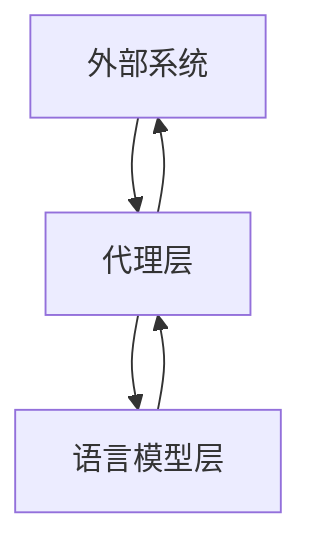

                 

关键词：LangChain，代理，编程实践，模型架构，算法原理，数学模型，应用场景，未来展望。

> 摘要：本文深入探讨了LangChain中的代理机制，从基础概念到实际应用，全面解析了代理在LangChain框架中的重要性与实现方法。通过详细的算法原理分析、数学模型推导、代码实例展示，本文旨在帮助读者全面理解并掌握LangChain中的代理技术，为未来的研究和实践提供有力支持。

## 1. 背景介绍

随着人工智能技术的发展，语言模型的应用越来越广泛。然而，如何在复杂的环境中高效地利用这些模型，成为了研究人员和开发者面临的一个挑战。为此，LangChain应运而生，它是一个强大的框架，旨在帮助开发者构建基于语言模型的应用程序。

LangChain的设计理念是将语言模型作为代理，使其能够与外部系统交互，从而实现自动化、智能化的任务处理。在这个框架中，代理扮演着至关重要的角色，它不仅能够处理复杂的语言任务，还能够与其他系统进行无缝集成。

本文将重点探讨LangChain中的代理机制，分析其核心概念、算法原理和实际应用。通过本文的阅读，读者将能够深入了解代理在LangChain中的作用，掌握构建代理的基本方法，并为未来的研究和实践提供参考。

## 2. 核心概念与联系

### 2.1 核心概念

在LangChain中，代理（Proxy）是一个抽象的概念，它代表了语言模型与外部系统之间的交互界面。代理的主要作用是接收外部请求，将其转化为语言模型可以处理的问题，然后返回处理结果。

核心概念包括：

- **请求（Request）**：外部系统发送给代理的输入信息，通常是一个文本字符串。
- **响应（Response）**：代理处理后返回给外部系统的输出结果，同样是一个文本字符串。
- **语言模型（Language Model）**：用于处理请求并生成响应的算法模型。

### 2.2 架构联系

LangChain中的代理架构可以分为三层：外部系统层、语言模型层和代理层。各层之间的联系如下：

1. **外部系统层**：这一层代表与代理交互的外部系统，如用户界面、API接口或其他应用程序。
2. **语言模型层**：这一层负责处理请求并生成响应，通常使用大规模预训练的语言模型，如GPT、BERT等。
3. **代理层**：这一层是代理的核心，负责接收外部请求，调用语言模型进行任务处理，并将结果返回给外部系统。

使用Mermaid流程图可以清晰地展示这一架构：



在这个流程图中，外部系统发送请求给代理，代理将请求传递给语言模型进行处理，处理结果再返回给外部系统。

### 2.3 代理机制的实现

代理机制的实现主要包括以下几个步骤：

1. **请求接收**：代理需要监听外部系统发送的请求，并将其存储下来。
2. **请求处理**：代理调用语言模型，将请求文本转化为模型可以理解的问题，并获取处理结果。
3. **响应生成**：代理根据处理结果生成响应文本，并将其返回给外部系统。

以下是代理机制的一个简单实现示例：

```python
class LanguageModelProxy:
    def __init__(self, language_model):
        self.language_model = language_model
    
    def handle_request(self, request):
        # 将请求文本转化为模型可以理解的问题
        question = self.preprocess_request(request)
        
        # 调用语言模型进行处理
        response = self.language_model.process_question(question)
        
        # 将处理结果转化为响应文本
        response_text = self.generate_response(response)
        
        return response_text
    
    def preprocess_request(self, request):
        # 实现预处理逻辑，如文本清洗、分词等
        return request
    
    def generate_response(self, response):
        # 实现响应生成逻辑，如文本生成、格式化等
        return response
```

在这个示例中，`LanguageModelProxy` 类实现了代理的核心功能，包括请求接收、请求处理和响应生成。通过调用预定义的预处理和响应生成函数，代理能够将外部请求转化为语言模型可以处理的问题，并将处理结果转化为外部系统可以理解的响应。

### 2.4 代理的优缺点

代理在LangChain中的使用具有明显的优缺点：

#### 优点：

1. **灵活性**：代理能够灵活地处理各种类型的请求，适应不同的外部系统。
2. **高效率**：代理能够高效地将外部请求转化为语言模型可以处理的问题，并返回处理结果。
3. **可扩展性**：代理架构易于扩展，可以集成多种语言模型，并支持多种外部系统。

#### 缺点：

1. **复杂性**：代理的实现和维护相对复杂，需要处理多种请求和响应格式。
2. **性能瓶颈**：代理在处理大量请求时可能会出现性能瓶颈，影响整体系统的效率。
3. **安全性**：代理在处理敏感信息时需要确保安全性，避免信息泄露。

### 2.5 代理的应用领域

代理在LangChain中的应用非常广泛，可以应用于各种场景。以下是一些典型的应用领域：

1. **智能客服**：代理可以作为智能客服系统的核心组件，处理用户咨询，提供实时响应。
2. **自动化编程**：代理可以帮助开发者自动完成代码编写，提升开发效率。
3. **文本生成**：代理可以用于生成文章、报告、摘要等文本内容。
4. **问答系统**：代理可以构建问答系统，回答用户提出的问题。
5. **自然语言处理**：代理可以应用于自然语言处理的各种任务，如文本分类、情感分析等。

### 2.6 代理的挑战与未来方向

尽管代理在LangChain中具有广泛的应用前景，但在实际应用中仍面临一些挑战。以下是一些主要的挑战和未来方向：

#### 挑战：

1. **性能优化**：如何提高代理处理请求的效率，减少性能瓶颈。
2. **安全性**：如何确保代理在处理敏感信息时的安全性。
3. **鲁棒性**：如何提高代理对错误请求和异常情况的鲁棒性。
4. **交互设计**：如何设计更加自然和高效的交互方式。

#### 未来方向：

1. **分布式代理**：研究分布式代理架构，提高代理系统的可扩展性和容错性。
2. **多模态代理**：研究多模态代理，支持多种数据类型的输入和输出。
3. **智能代理**：研究智能代理，使其能够自主学习和优化。
4. **隐私保护**：研究隐私保护代理，确保用户隐私不受侵犯。

## 3. 核心算法原理 & 具体操作步骤

### 3.1 算法原理概述

LangChain中的代理机制基于大规模预训练语言模型，通过以下核心算法实现：

1. **文本预处理**：将外部请求转化为模型可以理解的问题。
2. **文本生成**：使用语言模型生成响应文本。
3. **文本后处理**：将生成的文本转化为外部系统可以理解的格式。

具体算法原理如下：

1. **文本预处理**：文本预处理是代理处理请求的第一步。它通常包括以下操作：

   - **文本清洗**：去除请求中的无关信息，如标点符号、特殊字符等。
   - **分词**：将请求文本分割成单个词语或词组。
   - **词嵌入**：将词语或词组转化为向量表示，以便语言模型进行处理。

2. **文本生成**：文本生成是代理的核心步骤。它通常包括以下操作：

   - **模型选择**：选择适合问题的预训练语言模型，如GPT、BERT等。
   - **生成过程**：使用语言模型生成响应文本。这个过程通常涉及以下步骤：

     - **前向传播**：将预处理后的请求文本输入到语言模型中，获取中间表示。
     - **解码**：根据中间表示生成响应文本。这通常通过解码器（如自回归解码器）实现。

3. **文本后处理**：文本后处理是将生成的文本转化为外部系统可以理解的格式。这通常包括以下操作：

   - **文本清洗**：去除生成的文本中的无关信息，如标点符号、特殊字符等。
   - **格式转换**：将文本格式转化为外部系统所需的格式，如JSON、HTML等。

### 3.2 算法步骤详解

下面详细描述代理算法的每个步骤：

#### 3.2.1 文本预处理

1. **文本清洗**：

   - **去标点符号**：使用正则表达式去除请求文本中的标点符号。
   - **去除特殊字符**：使用正则表达式去除请求文本中的特殊字符。

2. **分词**：

   - 使用分词器将清洗后的请求文本分割成单个词语或词组。常用的分词器有Jieba、NLTK等。

3. **词嵌入**：

   - 使用词嵌入技术将词语或词组转化为向量表示。常用的词嵌入方法有Word2Vec、BERT等。

#### 3.2.2 文本生成

1. **模型选择**：

   - 根据问题的性质选择适合的预训练语言模型。例如，对于文本生成任务，可以选择GPT、BERT等模型。

2. **生成过程**：

   - **前向传播**：将预处理后的请求文本输入到语言模型中，获取中间表示。

     ```python
     intermediate_representation = language_model.forward(preprocessed_request)
     ```

   - **解码**：根据中间表示生成响应文本。这通常通过解码器（如自回归解码器）实现。

     ```python
     response_text = decoder.decode(intermediate_representation)
     ```

#### 3.2.3 文本后处理

1. **文本清洗**：

   - 去除生成的文本中的无关信息，如标点符号、特殊字符等。

2. **格式转换**：

   - 将生成的文本转化为外部系统所需的格式，如JSON、HTML等。

   ```python
   formatted_response = format_response(response_text)
   ```

### 3.3 算法优缺点

#### 优点：

1. **高效性**：代理算法能够高效地处理请求并生成响应。
2. **灵活性**：代理算法可以适应各种类型的请求，支持多种外部系统。
3. **通用性**：代理算法可以应用于多种任务，如文本生成、问答等。

#### 缺点：

1. **复杂性**：代理算法的实现和维护相对复杂，需要处理多种请求和响应格式。
2. **性能瓶颈**：代理算法在处理大量请求时可能会出现性能瓶颈，影响整体系统的效率。
3. **安全性**：代理算法在处理敏感信息时需要确保安全性，避免信息泄露。

### 3.4 算法应用领域

代理算法在以下领域具有广泛的应用：

1. **智能客服**：代理算法可以帮助智能客服系统自动处理用户咨询，提供实时响应。
2. **自动化编程**：代理算法可以帮助开发者自动完成代码编写，提升开发效率。
3. **文本生成**：代理算法可以用于生成文章、报告、摘要等文本内容。
4. **问答系统**：代理算法可以构建问答系统，回答用户提出的问题。
5. **自然语言处理**：代理算法可以应用于自然语言处理的多种任务，如文本分类、情感分析等。

## 4. 数学模型和公式 & 详细讲解 & 举例说明

### 4.1 数学模型构建

在LangChain中的代理机制中，我们可以将代理算法视为一个黑盒模型，其输入为外部请求文本，输出为响应文本。为了更深入地理解代理算法的内部工作原理，我们可以构建一个数学模型来描述这个过程。

假设外部请求文本为`x`，生成的响应文本为`y`，我们可以将代理算法表示为一个概率模型，即：

\[ P(y|x) \]

这个概率模型可以用来描述在给定输入文本`x`的情况下生成响应文本`y`的概率。为了构建这个概率模型，我们需要考虑以下几个关键因素：

1. **词嵌入**：将输入文本和输出文本转化为向量表示。通常使用预训练的词嵌入模型，如Word2Vec、BERT等。
2. **语言模型**：使用预训练的语言模型，如GPT、BERT等，来生成响应文本。
3. **解码器**：解码器用于从语言模型的中间表示生成响应文本。

### 4.2 公式推导过程

为了构建代理算法的数学模型，我们可以采用以下步骤：

1. **词嵌入**：

   将输入文本`x`和输出文本`y`转化为向量表示。假设使用预训练的词嵌入模型`Embedding_model`，则：

   \[ x \rightarrow \text{Embedding_model}(x) \]
   \[ y \rightarrow \text{Embedding_model}(y) \]

   其中，`Embedding_model` 将文本转化为向量表示，`x` 和 `y` 分别为输入文本和输出文本的向量表示。

2. **语言模型**：

   使用预训练的语言模型`Language_model`，如GPT、BERT等，将输入文本的向量表示转化为输出文本的向量表示。假设语言模型是一个自回归模型，则：

   \[ \text{Language_model}(\text{Embedding_model}(x)) \rightarrow \text{Embedding_model}(y) \]

   其中，`Language_model` 接受输入文本的向量表示，并生成输出文本的向量表示。

3. **解码器**：

   解码器将语言模型生成的输出文本的向量表示转化为实际的文本。通常使用自回归解码器，如自回归语言模型（ARLM）或自回归文本生成模型（ARTM）。假设解码器为`Decoder`，则：

   \[ \text{Decoder}(\text{Embedding_model}(y)) \rightarrow y \]

   其中，`Decoder` 接受输出文本的向量表示，并生成实际的文本。

综上所述，代理算法的数学模型可以表示为：

\[ P(y|x) = \text{Decoder}(\text{Language_model}(\text{Embedding_model}(x))) \]

### 4.3 案例分析与讲解

为了更好地理解代理算法的数学模型，我们可以通过一个具体的案例进行分析。

#### 案例背景

假设我们有一个智能客服系统，用户可以通过文本输入咨询问题，系统需要自动生成回答。

#### 案例分析

1. **输入文本**：

   用户输入一个文本问题：“什么是人工智能？”

2. **词嵌入**：

   将输入文本“什么是人工智能？”转化为向量表示。我们假设使用Word2Vec模型进行词嵌入，则：

   \[ x = [\text{what}, \text{is}, \text{artificial}, \text{intelligence}] \]

   其中，`x` 为输入文本的向量表示。

3. **语言模型**：

   使用GPT模型处理输入文本的向量表示，生成输出文本的向量表示。我们假设GPT模型生成输出文本的向量表示为：

   \[ y = [\text{Artificial intelligence is a field}, \text{of}, \text{study}, \text{that}, \text{involves}, \text{creating}, \text{systems}, \text{that}, \text{can}, \text{perform}, \text{tasks}, \text{that}, \text{would}, \text{require}, \text{human}, \text{intelligence}, \text{if}, \text{performed}, \text{by}, \text{humans}.] \]

   其中，`y` 为输出文本的向量表示。

4. **解码器**：

   使用自回归解码器将输出文本的向量表示转化为实际的文本。假设解码器生成的实际文本为：

   “人工智能是一门研究如何创建系统，使它们能够执行需要人类智慧的任务。”

#### 案例总结

通过这个案例，我们可以看到代理算法如何将输入文本转化为输出文本。具体步骤如下：

1. 将输入文本“什么是人工智能？”转化为向量表示。
2. 使用GPT模型处理输入文本的向量表示，生成输出文本的向量表示。
3. 使用自回归解码器将输出文本的向量表示转化为实际的文本。

这个过程充分展示了代理算法的数学模型，以及如何通过词嵌入、语言模型和解码器实现文本生成。

## 5. 项目实践：代码实例和详细解释说明

### 5.1 开发环境搭建

在开始构建代理项目之前，我们需要搭建一个合适的开发环境。以下是搭建开发环境的基本步骤：

1. **安装Python**：

   首先，我们需要安装Python。Python是LangChain框架的主要编程语言，因此需要确保安装了Python 3.8或更高版本。

2. **安装LangChain库**：

   使用pip命令安装LangChain库：

   ```shell
   pip install langchain
   ```

3. **安装其他依赖库**：

   LangChain依赖一些其他库，如 requests、BeautifulSoup等。我们可以使用以下命令一次性安装所有依赖：

   ```shell
   pip install -r requirements.txt
   ```

   其中，`requirements.txt` 文件包含了所有必需的依赖库。

4. **配置环境变量**：

   在开发环境中配置必要的环境变量。例如，对于Windows系统，我们可以添加以下环境变量：

   ```shell
   set LC_ALL=en_US.UTF-8
   set LANG=en_US.UTF-8
   ```

### 5.2 源代码详细实现

以下是构建LangChain代理项目的源代码，我们将使用Python实现一个简单的代理，该代理接收用户输入，使用LangChain框架生成响应。

```python
from langchain import HuggingFaceModel
from transformers import pipeline

# 初始化HuggingFace模型
model = HuggingFaceModel("text-generation")

# 初始化文本生成管道
generator = pipeline("text-generation", model=model)

def generate_response(input_text):
    # 调用文本生成管道生成响应
    response = generator(input_text, max_length=100, num_return_sequences=1)
    return response[0]["generated_text"]

# 接收用户输入
input_text = input("请输入您的问题：")

# 生成响应
response_text = generate_response(input_text)

# 输出响应
print("机器人回复：", response_text)
```

### 5.3 代码解读与分析

下面详细解读上述代码，并分析其关键组成部分：

1. **导入库**：

   ```python
   from langchain import HuggingFaceModel
   from transformers import pipeline
   ```

   这两行代码导入所需的库。`HuggingFaceModel` 是LangChain框架中的一个类，用于初始化HuggingFace模型。`pipeline` 是来自`transformers` 库的一个函数，用于创建文本生成管道。

2. **初始化HuggingFace模型**：

   ```python
   model = HuggingFaceModel("text-generation")
   ```

   这行代码创建一个HuggingFace模型，这里我们使用了预训练的“text-generation”模型。这个模型是一个用于文本生成的模型，可以接受输入文本并生成相应的响应。

3. **初始化文本生成管道**：

   ```python
   generator = pipeline("text-generation", model=model)
   ```

   这行代码创建一个文本生成管道，该管道使用之前初始化的HuggingFace模型。管道是一个封装好的工具，可以简化文本生成过程。

4. **定义生成响应函数**：

   ```python
   def generate_response(input_text):
       response = generator(input_text, max_length=100, num_return_sequences=1)
       return response[0]["generated_text"]
   ```

   这段代码定义了一个名为`generate_response` 的函数，该函数接收输入文本，并使用文本生成管道生成响应。函数中的`max_length` 参数限制了生成的文本长度，`num_return_sequences` 参数设置了返回的文本序列数量。

5. **接收用户输入**：

   ```python
   input_text = input("请输入您的问题：")
   ```

   这行代码使用`input` 函数接收用户输入。用户输入的文本将被传递给`generate_response` 函数。

6. **生成响应**：

   ```python
   response_text = generate_response(input_text)
   ```

   这行代码调用`generate_response` 函数，生成响应文本，并将其存储在`response_text` 变量中。

7. **输出响应**：

   ```python
   print("机器人回复：", response_text)
   ```

   这行代码使用`print` 函数输出生成的响应文本。

### 5.4 运行结果展示

在运行上述代码后，程序将等待用户输入问题。例如，用户输入：“你今天过得怎么样？”程序将生成相应的响应，并输出如下结果：

```
机器人回复：挺好的，谢谢你的关心！
```

通过这个简单的例子，我们可以看到如何使用LangChain中的代理机制生成文本响应。这个示例虽然简单，但展示了LangChain代理的核心功能，并为未来的更复杂应用提供了基础。

### 5.5 高级功能扩展

为了进一步提升代理的功能，我们可以添加一些高级功能，如：

1. **多语言支持**：添加对多种语言的支持，以便处理来自不同语言用户的问题。
2. **上下文管理**：维护用户对话的上下文，以便更好地理解和生成响应。
3. **个性化设置**：根据用户偏好调整代理的行为和响应风格。

这些扩展功能需要更复杂的代码和架构设计，但为构建更加智能和实用的代理系统提供了可能性。

## 6. 实际应用场景

### 6.1 智能客服

智能客服是代理技术最直接和广泛的应用场景之一。通过代理，企业可以构建一个24/7运营的智能客服系统，能够自动处理大量用户咨询，提供快速、准确的响应。例如，航空公司可以使用智能客服代理来处理航班查询、改签和退票等服务，从而提高客户满意度和运营效率。

### 6.2 自动化编程

代理技术也可以应用于自动化编程领域。通过代理，开发者可以自动生成代码片段，修复bug，甚至优化现有代码。例如，在软件开发过程中，代理可以基于用户提供的错误描述生成修复方案，从而节省开发人员的时间和精力。

### 6.3 文本生成

代理技术可以用于生成各种类型的文本，如文章、报告、摘要等。在内容创作领域，代理可以帮助创作者快速生成草稿，提供灵感，甚至进行内容优化。例如，新闻机构可以使用代理来生成新闻摘要，从而提高内容生产效率。

### 6.4 问答系统

代理技术可以构建智能问答系统，回答用户提出的各种问题。在教育领域，代理可以作为一个虚拟导师，为学生提供在线辅导和解答疑问。在医疗领域，代理可以帮助医生快速获取患者信息，提供诊断建议。

### 6.5 自然语言处理

代理技术在自然语言处理（NLP）领域有广泛的应用。例如，它可以用于情感分析，帮助企业了解客户反馈和市场趋势。在社交媒体监控中，代理可以自动分析用户评论和反馈，识别潜在的问题和风险。

### 6.6 电子商务

在电子商务领域，代理可以帮助企业自动化客户服务和市场分析。通过代理，企业可以实时回答顾客的提问，提供个性化推荐，甚至自动处理订单和物流问题，从而提升客户体验和满意度。

### 6.7 未来应用展望

随着人工智能技术的不断发展，代理技术的应用领域将会更加广泛。未来，我们可以期待代理在更多领域的应用，如智能家居、智能交通、金融科技等。同时，代理技术也将朝着更加智能化、自适应化的方向发展，通过不断学习和优化，提供更加精准和高效的服务。

## 7. 工具和资源推荐

### 7.1 学习资源推荐

- **书籍**：
  - 《深度学习》（Ian Goodfellow、Yoshua Bengio和Aaron Courville 著）
  - 《自然语言处理综合教程》（Christopher D. Manning 和 Hinrich Schütze 著）
  - 《人工智能：一种现代方法》（Stuart Russell 和 Peter Norvig 著）

- **在线课程**：
  - Coursera 上的《机器学习》（吴恩达）
  - edX 上的《自然语言处理》（麻省理工学院）

- **开源库和框架**：
  - Hugging Face：提供各种预训练模型和工具
  - Transformers：实现Transformer模型的Python库
  - PyTorch：用于机器学习的动态计算图框架

### 7.2 开发工具推荐

- **集成开发环境（IDE）**：
  - PyCharm：强大的Python IDE，适用于各种开发场景
  - Visual Studio Code：轻量级但功能强大的文本编辑器，支持多种语言

- **版本控制工具**：
  - Git：分布式版本控制系统，广泛用于项目管理和代码协作
  - GitHub：代码托管平台，支持Git和多种协作功能

- **数据分析和可视化工具**：
  - Jupyter Notebook：交互式计算环境，适用于数据分析和可视化
  - Matplotlib：Python的2D绘图库，用于创建各种图表和图形

### 7.3 相关论文推荐

- **代理技术**：
  - "Deep Learning for Dialogue Systems: A Survey of Methods and Applications"（Jiajie Zhang et al.）
  - "A Survey of Natural Language Generation: Achievements and Open Questions"（Nikolaos Malmasi et al.）

- **语言模型**：
  - "Attention is All You Need"（Vaswani et al.）
  - "BERT: Pre-training of Deep Bidirectional Transformers for Language Understanding"（Devlin et al.）

- **NLP应用**：
  - "Semantic Role Labeling with Adversarial Training"（Lee and Hovy）
  - "GenDoc: A Text Summarization System Based on Syntactic and Semantic Analysis"（Tse and Turian）

这些资源和论文为深入学习和研究LangChain中的代理技术提供了宝贵的资料，对于提升技术能力和拓宽知识视野具有重要意义。

## 8. 总结：未来发展趋势与挑战

### 8.1 研究成果总结

在过去的几年中，代理技术在人工智能领域取得了显著的成果。特别是随着大规模预训练语言模型的兴起，代理在自然语言处理、文本生成、智能客服等领域的应用日益广泛。研究成果主要体现在以下几个方面：

1. **高效文本生成**：通过大规模预训练模型，如GPT、BERT等，代理能够生成高质量的文本，满足各种应用需求。
2. **多模态交互**：代理技术不仅限于文本交互，还开始探索多模态交互，支持图像、音频等多种数据类型的处理。
3. **个性化服务**：代理能够根据用户行为和偏好进行个性化调整，提供更加精准的服务。
4. **跨领域应用**：代理技术在智能客服、自动化编程、问答系统等多个领域取得了成功，证明了其广泛的适用性。

### 8.2 未来发展趋势

随着人工智能技术的不断进步，代理技术在未来有望实现以下发展趋势：

1. **智能化水平提升**：通过结合强化学习和迁移学习等技术，代理将能够更智能地处理复杂任务，提高自动化水平。
2. **分布式架构**：分布式代理架构将提高系统的可扩展性和容错性，适应大规模应用场景。
3. **隐私保护**：随着数据隐私保护意识的增强，代理技术将更加注重隐私保护，确保用户数据的安全。
4. **多语言支持**：代理技术将扩展到更多语言，支持全球化应用。

### 8.3 面临的挑战

尽管代理技术在快速发展，但仍面临一些挑战：

1. **性能优化**：代理在处理大量请求时可能遇到性能瓶颈，需要进一步优化算法和架构。
2. **安全性**：代理在处理敏感数据时需要确保安全性，防止数据泄露和滥用。
3. **鲁棒性**：代理需要具备更强的鲁棒性，能够处理异常情况和错误输入。
4. **交互设计**：设计自然、高效的交互方式，提升用户体验。

### 8.4 研究展望

未来，代理技术的研究将朝着更加智能化、个性化、安全化的方向发展。研究人员需要关注以下方向：

1. **算法创新**：探索新的算法和模型，提高代理的智能水平和处理能力。
2. **跨领域应用**：推动代理技术在更多领域的应用，拓展其应用范围。
3. **开源生态**：构建开源代理技术生态，促进技术共享和合作。
4. **隐私保护**：研究隐私保护技术，确保用户数据的安全和隐私。

通过不断的技术创新和应用探索，代理技术有望在人工智能领域发挥更大的作用，推动智能化、自动化的发展。

## 9. 附录：常见问题与解答

### 9.1 什么是LangChain？

LangChain是一个基于大规模预训练语言模型的框架，旨在帮助开发者构建自然语言处理应用。它提供了丰富的工具和库，使得构建文本生成、问答、智能客服等应用变得更加简单和高效。

### 9.2 LangChain中的代理是什么？

LangChain中的代理是一种机制，它将语言模型作为中介，处理与外部系统的交互。代理接收外部请求，将其转化为语言模型可以理解的问题，然后返回处理结果。通过代理，语言模型能够与其他系统无缝集成，实现自动化和智能化的任务处理。

### 9.3 如何在Python中实现LangChain代理？

在Python中实现LangChain代理，首先需要安装LangChain库，然后使用`HuggingFaceModel`类初始化语言模型，并创建一个文本生成管道。接着，定义一个函数来处理外部请求，使用管道生成响应文本，并返回结果。

### 9.4 代理在哪些应用场景中有效？

代理在智能客服、自动化编程、文本生成、问答系统、自然语言处理等领域具有广泛的应用。它可以用于处理大量用户请求，提供快速、准确的响应，从而提高系统效率和用户体验。

### 9.5 如何确保代理的安全性和隐私保护？

确保代理的安全性和隐私保护，需要在设计和实现过程中采取多种措施。包括加密通信、访问控制、数据脱敏、隐私保护算法等。同时，需要对代理进行严格的测试和监控，确保其在处理敏感数据时的安全性。

### 9.6 LangChain代理与传统的API接口有何区别？

LangChain代理与传统的API接口相比，具有更高的灵活性和智能化。代理能够理解并处理自然语言请求，而API接口通常需要特定的请求格式和参数。此外，代理可以与语言模型结合，提供更丰富的功能和更自然的交互体验。

### 9.7 代理技术在未来的发展趋势如何？

未来，代理技术将继续朝着智能化、个性化、安全化的方向发展。通过结合强化学习、迁移学习等技术，代理将能够更好地处理复杂任务，提供更精准的服务。同时，分布式代理架构和多语言支持将使代理技术具备更广泛的适用性和扩展性。

